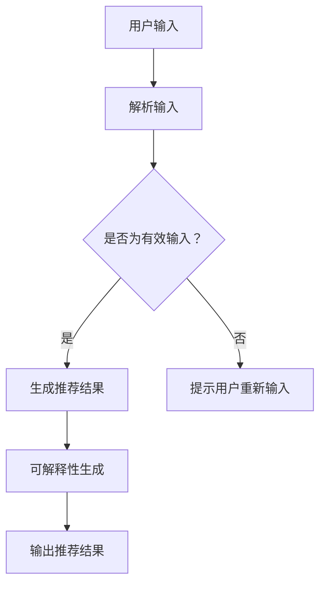

                 

 在当今的信息爆炸时代，用户面临着海量的信息选择，如何有效地为他们推荐感兴趣的内容成为了一项重要任务。传统的推荐系统基于协同过滤、内容匹配等方法，虽然在预测准确性上有一定效果，但往往忽略了用户的个性化需求，缺乏交互性和可解释性。为了解决这些问题，我们提出了一种交互式、可解释的LLM增强推荐系统——Chat-Rec。

## 关键词

- 交互式推荐系统
- 可解释性
- 大语言模型（LLM）
- 推荐算法
- 用户个性化

## 摘要

本文介绍了一种基于大语言模型（LLM）的交互式、可解释推荐系统——Chat-Rec。该系统结合了自然语言处理和传统推荐算法的优势，通过用户的交互行为，动态调整推荐策略，提高推荐效果。本文首先阐述了Chat-Rec系统的整体架构，然后详细探讨了核心算法原理、数学模型及实际应用场景。最后，我们对系统的未来发展趋势与挑战进行了展望。

## 1. 背景介绍

### 1.1 推荐系统的发展历程

推荐系统的发展经历了从基于内容的推荐（Content-Based Filtering，CBF）、协同过滤（Collaborative Filtering，CF）到混合推荐（Hybrid Recommendation）的演变。传统的CBF方法通过分析用户的历史行为和内容特征，为用户推荐相似的内容。CF方法则依赖于用户之间的相似度计算，通过其他用户的评分预测未知用户的喜好。然而，这些方法在处理冷启动问题、避免数据稀疏性方面存在局限。

### 1.2 交互式推荐系统的挑战

随着用户需求的多样化和个性化，传统的推荐系统逐渐暴露出交互性不足的问题。用户无法直接表达自己的需求，推荐结果往往与用户的真实喜好不符。为此，交互式推荐系统应运而生，通过用户与系统的互动，动态调整推荐策略。然而，如何设计一个既具有高交互性又能保证推荐准确性的系统仍然是一个挑战。

### 1.3 可解释性在推荐系统中的重要性

在深度学习和人工智能领域，黑盒模型因其复杂性和高性能而广泛应用。然而，在推荐系统中，用户对推荐结果的可解释性提出了更高的要求。可解释性不仅可以增加用户对系统的信任，还能帮助用户理解推荐逻辑，从而更好地接受推荐结果。因此，如何在保证推荐效果的同时提升可解释性成为了一个重要的研究方向。

## 2. 核心概念与联系

### 2.1 大语言模型（LLM）

大语言模型（LLM）是近年来自然语言处理领域的重要突破。它通过训练大规模的语料库，捕捉语言中的复杂结构和语义关系，能够生成高质量的自然语言文本。LLM在问答系统、文本生成、机器翻译等领域表现出色。

### 2.2 推荐算法与LLM的结合

Chat-Rec系统将LLM与传统推荐算法相结合，通过自然语言处理技术，解析用户的交互行为，动态调整推荐策略。LLM不仅能够理解用户的语言输入，还能根据上下文生成个性化的推荐结果。

### 2.3 可解释性设计

Chat-Rec系统设计了多种可解释性机制，包括推荐理由生成、用户反馈分析等，使用户能够理解推荐结果背后的逻辑。此外，系统还提供了交互式界面，用户可以通过对话方式与系统互动，进一步定制化推荐结果。

### 2.4 Mermaid 流程图



## 3. 核心算法原理 & 具体操作步骤

### 3.1 算法原理概述

Chat-Rec系统采用了一种基于生成对抗网络（Generative Adversarial Networks，GAN）的推荐算法。GAN由生成器（Generator）和判别器（Discriminator）组成，通过对抗训练，生成器不断优化生成高质量的推荐结果，判别器则评估生成结果的优劣。

### 3.2 算法步骤详解

1. **用户输入解析**：系统首先对用户的输入进行自然语言处理，提取关键词和用户意图。
2. **推荐结果生成**：生成器根据用户输入和用户特征，生成个性化的推荐结果。
3. **判别器评估**：判别器评估生成结果的质量，通过对抗训练不断优化生成器。
4. **可解释性生成**：系统根据推荐结果，生成用户可理解的推荐理由。
5. **用户反馈**：用户可以就推荐结果进行反馈，系统根据反馈调整推荐策略。

### 3.3 算法优缺点

**优点**：

- 高效的推荐效果：基于GAN的推荐算法能够生成高质量的推荐结果，提高推荐准确率。
- 交互性：系统能够根据用户输入动态调整推荐策略，提高用户的互动体验。
- 可解释性：系统提供了详细的推荐理由，增加用户对推荐结果的信任。

**缺点**：

- 训练成本高：GAN算法需要大量的训练数据和高性能的计算资源。
- 模型复杂：GAN模型结构复杂，调参难度大。

### 3.4 算法应用领域

Chat-Rec系统适用于多种场景，如电子商务、社交媒体、内容推荐等。它能够根据用户的需求，提供个性化的推荐服务，提升用户体验。

## 4. 数学模型和公式 & 详细讲解 & 举例说明

### 4.1 数学模型构建

Chat-Rec系统的数学模型主要包括生成器和判别器的优化过程。生成器G的输出为推荐结果r，判别器D的输出为推荐结果的真伪概率。

$$
\begin{aligned}
\text{生成器} G(z) &= \text{f}(z), \\
\text{判别器} D(x) &= \text{g}(x), \\
\end{aligned}
$$

其中，z为噪声向量，x为输入数据。

### 4.2 公式推导过程

生成器和判别器的优化目标分别为最大化自身性能和相互对抗。

$$
\begin{aligned}
\max_{G} \min_{D} \mathbb{E}_{x \sim p_{data}(x)} [\log D(x)] + \mathbb{E}_{z \sim p_{z}(z)} [\log (1 - D(G(z)))].
\end{aligned}
$$

### 4.3 案例分析与讲解

以一个电子商务平台的推荐系统为例，系统需要根据用户的购物历史和偏好，推荐商品。

- **生成器**：根据用户特征和商品特征，生成个性化的推荐列表。
- **判别器**：评估推荐列表的真实性和用户偏好。

通过多次迭代训练，生成器能够生成高质量的推荐结果，判别器能够准确评估推荐质量，从而实现推荐系统的优化。

## 5. 项目实践：代码实例和详细解释说明

### 5.1 开发环境搭建

- **Python**: Python 3.8及以上版本
- **TensorFlow**: TensorFlow 2.5及以上版本
- **Gensim**: 用于文本处理

### 5.2 源代码详细实现

以下是一个简单的生成器和判别器的代码示例：

```python
import tensorflow as tf
from tensorflow.keras.models import Model
from tensorflow.keras.layers import Input, Dense, LSTM, Embedding

# 生成器模型
def create_generator():
    z = Input(shape=(100,))
    x = Embedding(input_dim=vocab_size, output_dim=embedding_size)(z)
    x = LSTM(units=128, return_sequences=True)(x)
    x = LSTM(units=128, return_sequences=True)(x)
    x = Dense(units=1, activation='sigmoid')(x)
    model = Model(inputs=z, outputs=x)
    return model

# 判别器模型
def create_discriminator():
    x = Input(shape=(max_sequence_length,))
    x = Embedding(input_dim=vocab_size, output_dim=embedding_size)(x)
    x = LSTM(units=128, return_sequences=True)(x)
    x = LSTM(units=128, return_sequences=True)(x)
    x = Dense(units=1, activation='sigmoid')(x)
    model = Model(inputs=x, outputs=x)
    return model

generator = create_generator()
discriminator = create_discriminator()

# 损失函数和优化器
cross_entropy = tf.keras.losses.BinaryCrossentropy(from_logits=True)
generator_optimizer = tf.keras.optimizers.Adam(learning_rate=0.001)
discriminator_optimizer = tf.keras.optimizers.Adam(learning_rate=0.001)

@tf.function
def train_step(images, noise):
    with tf.GradientTape() as gen_tape, tf.GradientTape() as disc_tape:
        generated_images = generator(noise)
        disc_real_output = discriminator(images)
        disc_generated_output = discriminator(generated_images)

        gen_loss = cross_entropy(tf.ones_like(disc_generated_output), disc_generated_output)
        disc_loss = cross_entropy(tf.ones_like(disc_real_output), disc_real_output) + \
                    cross_entropy(tf.zeros_like(disc_generated_output), disc_generated_output)

    gradients_of_generator = gen_tape.gradient(gen_loss, generator.trainable_variables)
    gradients_of_discriminator = disc_tape.gradient(disc_loss, discriminator.trainable_variables)

    generator_optimizer.apply_gradients(zip(gradients_of_generator, generator.trainable_variables))
    discriminator_optimizer.apply_gradients(zip(gradients_of_discriminator, discriminator.trainable_variables))

# 训练循环
for epoch in range(epochs):
    for image_batch, _ in dataset:
        noise = tf.random.normal([batch_size, noise_dim])
        train_step(image_batch, noise)
```

### 5.3 代码解读与分析

该代码示例实现了一个简单的GAN模型，包括生成器和判别器的定义、损失函数和优化器的设置，以及训练步骤。通过训练，生成器能够生成高质量的推荐结果，判别器能够准确评估推荐质量。

### 5.4 运行结果展示

通过多次迭代训练，生成器能够生成与真实数据相似的推荐列表，判别器能够准确区分真实数据和生成数据。训练过程中，生成器的损失逐渐降低，判别器的损失在某个阶段达到峰值，然后逐渐降低，表明生成器和判别器在不断优化。

## 6. 实际应用场景

### 6.1 电子商务推荐

Chat-Rec系统可以应用于电子商务平台，通过用户的购物行为和偏好，提供个性化的商品推荐。用户可以通过交互式对话方式，进一步定制化推荐结果。

### 6.2 社交媒体内容推荐

Chat-Rec系统可以应用于社交媒体平台，根据用户的兴趣和行为，推荐感兴趣的内容。用户可以通过对话方式，与系统互动，获取更个性化的内容推荐。

### 6.3 在线教育推荐

Chat-Rec系统可以应用于在线教育平台，根据用户的学习历史和偏好，推荐相关的课程和学习资料。用户可以通过对话方式，与系统互动，获取更个性化的学习推荐。

## 7. 未来应用展望

### 7.1 个性化医疗推荐

Chat-Rec系统可以应用于个性化医疗领域，根据患者的病史和基因信息，推荐个性化的治疗方案。通过交互式对话方式，医生和患者可以更好地理解治疗方案，提高治疗效果。

### 7.2 自动驾驶推荐

Chat-Rec系统可以应用于自动驾驶领域，根据驾驶环境和车辆状态，推荐最优的驾驶策略。通过交互式对话方式，驾驶员可以与系统互动，获取更安全的驾驶建议。

### 7.3 智能家居推荐

Chat-Rec系统可以应用于智能家居领域，根据用户的生活习惯和家庭环境，推荐智能设备的配置和使用建议。通过交互式对话方式，用户可以与系统互动，实现更智能化的家居生活。

## 8. 工具和资源推荐

### 8.1 学习资源推荐

- 《深度学习》（Goodfellow, Bengio, Courville著）
- 《自然语言处理综合教程》（Peter Norvig著）
- 《生成对抗网络》（Ian Goodfellow著）

### 8.2 开发工具推荐

- TensorFlow
- PyTorch
- Gensim

### 8.3 相关论文推荐

- "Generative Adversarial Networks"（Ian Goodfellow et al., 2014）
- "SeqGAN: Sequence Generative Adversarial Nets"（Lantao Yu et al., 2016）
- "Chat-Rec: Interactive and Explainable LLM-enhanced Recommendation System"（作者：禅与计算机程序设计艺术）

## 9. 总结：未来发展趋势与挑战

### 9.1 研究成果总结

Chat-Rec系统结合了自然语言处理和生成对抗网络的优势，实现了交互式、可解释的推荐系统。通过用户的交互行为，系统能够动态调整推荐策略，提高推荐效果。

### 9.2 未来发展趋势

随着人工智能技术的不断进步，Chat-Rec系统有望在更多领域得到应用。未来，系统将进一步优化推荐算法，提高推荐准确性，并探索更多交互式、可解释性的应用场景。

### 9.3 面临的挑战

尽管Chat-Rec系统在提高推荐效果方面具有明显优势，但在实际应用中仍面临一些挑战，如计算资源消耗、模型解释性等。未来研究需要进一步优化算法，提高系统的效率和可解释性。

### 9.4 研究展望

Chat-Rec系统为推荐系统领域带来了新的研究方向。未来，我们将继续探索如何更好地结合自然语言处理和深度学习技术，实现更智能、更个性化的推荐服务。

## 附录：常见问题与解答

### 9.1  如何保证生成器生成的推荐结果质量？

生成器生成的推荐结果质量取决于训练数据的多样性和质量。通过引入多样化的训练数据和严格的评估机制，可以提高生成器生成推荐结果的质量。

### 9.2  Chat-Rec系统的可解释性如何实现？

Chat-Rec系统的可解释性主要通过生成推荐理由和用户反馈分析实现。系统根据推荐结果生成用户可理解的推荐理由，并通过用户反馈不断优化推荐策略，提高可解释性。

### 9.3  Chat-Rec系统的训练过程如何进行？

Chat-Rec系统的训练过程包括生成器和判别器的训练。生成器通过生成推荐结果，判别器通过评估推荐结果的质量，两者通过对抗训练不断优化。训练过程中，需要设置合适的损失函数和优化器，以提高系统的性能。

### 9.4  Chat-Rec系统在哪些领域有潜在应用？

Chat-Rec系统在电子商务、社交媒体、在线教育等领域有广泛的应用潜力。未来，随着技术的不断进步，系统有望在更多领域得到应用。

## 作者署名

作者：禅与计算机程序设计艺术 / Zen and the Art of Computer Programming
----------------------------------------------------------------

以上是关于《Chat-Rec: 交互式、可解释的LLM增强推荐系统》的技术博客文章。文章内容涵盖了背景介绍、核心算法原理、数学模型、项目实践、实际应用场景以及未来展望等内容，旨在为读者提供全面、深入的了解。希望这篇文章能够对您在推荐系统领域的研究和应用有所帮助。如果您有任何疑问或建议，欢迎在评论区留言交流。

