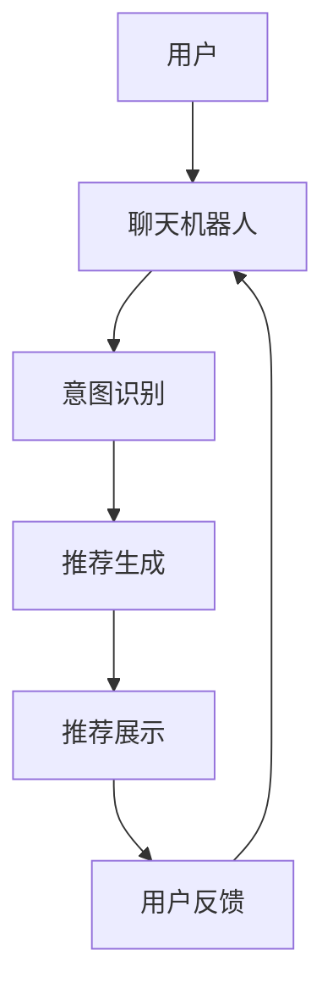

                 

关键词：Chat-Rec、交互式推荐系统、个性化推荐、用户行为分析、算法优化

> 摘要：本文将探讨交互式推荐系统的发展现状以及其中的关键技术——Chat-Rec的应用实践。我们将深入剖析Chat-Rec的工作原理、算法步骤、数学模型，并通过实例代码展示其实际应用效果，最后展望其在未来的发展趋势与挑战。

## 1. 背景介绍

随着互联网和移动设备的普及，个性化推荐系统已经成为许多在线服务和应用的核心功能。用户在平台上产生的海量数据为推荐系统提供了丰富的信息来源。然而，传统的推荐系统主要依赖于用户历史行为数据，往往忽视了用户的实时交互需求和个性化偏好。这就催生了交互式推荐系统，如Chat-Rec，它通过实时与用户交互，动态调整推荐结果，从而提升用户体验和推荐效果。

### 1.1 交互式推荐系统的定义与特点

交互式推荐系统（Interactive Recommendation Systems）是一种能够与用户进行实时交互，动态调整推荐策略的推荐系统。其主要特点如下：

1. **实时性**：系统能够根据用户的实时行为数据（如点击、评论、搜索等）进行动态调整。
2. **个性化**：系统能够根据用户的个性化需求，提供更加精确的推荐。
3. **交互性**：系统通过与用户的实时交互，不断获取用户的反馈，优化推荐结果。
4. **适应性**：系统可以针对不同的用户场景和需求，提供不同的推荐策略。

### 1.2 Chat-Rec的基本概念

Chat-Rec是一种结合了聊天机器人和推荐系统技术的交互式推荐系统。它利用自然语言处理（NLP）和机器学习算法，与用户进行对话，理解用户的意图和需求，并提供个性化的推荐。

## 2. 核心概念与联系

### 2.1 Chat-Rec系统架构

以下是一个简单的Mermaid流程图，展示Chat-Rec系统的主要组成部分及其交互流程。



### 2.2 主要技术组件及其作用

1. **聊天机器人**：作为用户与系统的交互接口，通过NLP技术理解用户的输入，生成相应的回复。
2. **意图识别**：通过深度学习模型，从用户输入中识别出具体的请求意图，如查询、评价、推荐等。
3. **推荐生成**：根据用户的意图和行为数据，利用推荐算法生成个性化的推荐结果。
4. **推荐展示**：将推荐结果以对话或列表的形式展示给用户。
5. **用户反馈**：收集用户的反馈信息，用于优化推荐模型和聊天机器人的性能。

## 3. 核心算法原理 & 具体操作步骤

### 3.1 算法原理概述

Chat-Rec的核心算法主要包括NLP技术和推荐算法两部分。NLP技术用于理解用户的输入和意图，推荐算法则根据用户的意图和行为数据生成推荐结果。

### 3.2 算法步骤详解

1. **用户输入处理**：系统接收用户的输入，如文本或语音。
2. **意图识别**：利用NLP技术，如词嵌入和序列模型（如LSTM、BERT等），从用户输入中识别出具体的意图。
3. **行为数据收集**：系统收集用户的浏览、点击、搜索等行为数据。
4. **推荐生成**：基于用户的意图和行为数据，利用推荐算法（如协同过滤、矩阵分解等）生成推荐列表。
5. **推荐展示**：将推荐结果以对话或列表的形式展示给用户。
6. **用户反馈收集**：系统收集用户的反馈信息，如点击、评价等。
7. **模型优化**：利用用户的反馈信息，不断优化推荐模型和聊天机器人的性能。

### 3.3 算法优缺点

#### 优点：

1. **实时性**：系统能够根据用户的实时行为数据进行动态调整，提供个性化的推荐。
2. **个性化**：系统能够理解用户的意图和需求，提供更加精准的推荐。
3. **交互性**：系统通过与用户的实时交互，不断获取用户的反馈，优化推荐结果。

#### 缺点：

1. **计算成本**：交互式推荐系统需要实时处理用户的输入和行为数据，计算成本较高。
2. **模型复杂度**：需要结合NLP和推荐算法，模型复杂度较高，训练和优化过程较复杂。

### 3.4 算法应用领域

Chat-Rec可以应用于多种场景，如电子商务、社交媒体、在线娱乐等。通过实时与用户交互，提供个性化的推荐，提升用户体验和满意度。

## 4. 数学模型和公式 & 详细讲解 & 举例说明

### 4.1 数学模型构建

Chat-Rec的核心数学模型主要包括意图识别模型和推荐生成模型两部分。

#### 意图识别模型：

假设我们使用一个深度学习模型 \( f_{\theta} \) 进行意图识别，输入为用户的输入文本 \( x \)，输出为意图类别 \( y \)。

$$ f_{\theta}(x) = \text{softmax}(\theta^T \phi(x)) $$

其中，\( \theta \) 是模型参数，\( \phi(x) \) 是文本特征向量，\( \text{softmax} \) 函数用于归一化概率分布。

#### 推荐生成模型：

假设我们使用协同过滤算法生成推荐列表，输入为用户的意图 \( y \) 和行为数据 \( B \)，输出为推荐结果 \( R \)。

$$ R = \text{Top-N}(\text{similarity(U, B))} $$

其中，\( \text{similarity} \) 函数用于计算用户和物品之间的相似度，\( \text{Top-N} \) 函数用于从相似度最高的 \( N \) 个物品中生成推荐列表。

### 4.2 公式推导过程

#### 意图识别模型的推导：

1. **文本特征提取**：

   $$ \phi(x) = \text{word\_embedding}(x) $$

   其中，\( \text{word\_embedding} \) 函数用于将文本转化为词嵌入向量。

2. **神经网络模型**：

   $$ f_{\theta}(x) = \text{softmax}(\theta^T \phi(x)) $$

3. **损失函数**：

   $$ L = -\sum_{i=1}^{C} y_i \log(f_{\theta}(x_i)) $$

   其中，\( C \) 是意图类别数，\( y_i \) 是实际意图标签，\( f_{\theta}(x_i) \) 是模型对第 \( i \) 个意图的概率预测。

#### 推荐生成模型的推导：

1. **相似度计算**：

   $$ \text{similarity}(u, b) = \text{cosine\_similarity}(\text{vectorize}(u), \text{vectorize}(b)) $$

   其中，\( \text{vectorize} \) 函数用于将用户和物品的特征向量转化为向量形式，\( \text{cosine\_similarity} \) 函数用于计算两个向量之间的余弦相似度。

2. **推荐列表生成**：

   $$ R = \text{Top-N}(\text{similarity(U, B))} $$

   其中，\( U \) 是用户特征向量集合，\( B \) 是物品特征向量集合，\( \text{Top-N} \) 函数用于从相似度最高的 \( N \) 个物品中生成推荐列表。

### 4.3 案例分析与讲解

假设一个用户在聊天机器人中输入“我想买一本关于机器学习的书”，我们可以按照以下步骤进行意图识别和推荐生成：

1. **意图识别**：

   - **文本特征提取**：

     $$ \phi(\text{我想买一本关于机器学习的书}) = \text{word\_embedding}(\text{我想买一本关于机器学习的书}) $$

   - **神经网络模型**：

     $$ f_{\theta}(\text{我想买一本关于机器学习的书}) = \text{softmax}(\theta^T \phi(\text{我想买一本关于机器学习的书})) $$

   - **损失函数**：

     $$ L = -\sum_{i=1}^{C} y_i \log(f_{\theta}(\text{我想买一本关于机器学习的书})) $$

     其中，\( C \) 是意图类别数，\( y_i \) 是实际意图标签（如查询、购买等），\( f_{\theta}(\text{我想买一本关于机器学习的书}) \) 是模型对意图的概率预测。

2. **推荐生成**：

   - **相似度计算**：

     $$ \text{similarity}(u, b) = \text{cosine\_similarity}(\text{vectorize}(u), \text{vectorize}(b)) $$

     其中，\( u \) 是用户特征向量，\( b \) 是物品特征向量。

   - **推荐列表生成**：

     $$ R = \text{Top-N}(\text{similarity(U, B))} $$

     其中，\( U \) 是用户特征向量集合，\( B \) 是物品特征向量集合，\( \text{Top-N} \) 函数用于从相似度最高的 \( N \) 个物品中生成推荐列表。

通过这个案例，我们可以看到Chat-Rec系统如何通过意图识别和推荐生成模型，为用户生成个性化的推荐结果。

## 5. 项目实践：代码实例和详细解释说明

### 5.1 开发环境搭建

在本节中，我们将搭建一个简单的Chat-Rec系统，包括聊天机器人、意图识别模型和推荐生成模型。以下是一个简化的开发环境搭建步骤：

1. **Python环境**：确保安装了Python 3.6及以上版本。
2. **依赖包**：安装TensorFlow、Keras、NLTK等依赖包。

```bash
pip install tensorflow keras nltk
```

3. **数据集**：准备一个包含用户输入和意图标签的数据集，用于训练意图识别模型。

### 5.2 源代码详细实现

以下是一个简单的Chat-Rec系统的源代码实现。

```python
import tensorflow as tf
from tensorflow.keras.models import Sequential
from tensorflow.keras.layers import Embedding, LSTM, Dense
from nltk.corpus import stopwords
from sklearn.model_selection import train_test_split
from sklearn.metrics import accuracy_score

# 数据预处理
def preprocess_text(text):
    text = text.lower()
    tokens = nltk.word_tokenize(text)
    tokens = [token for token in tokens if token not in stopwords.words('english')]
    return ' '.join(tokens)

# 加载和预处理数据
data = pd.read_csv('chat_rec_data.csv')
data['input_text'] = data['input_text'].apply(preprocess_text)
X = data['input_text']
y = data['intent_label']

# 分割数据集
X_train, X_test, y_train, y_test = train_test_split(X, y, test_size=0.2, random_state=42)

# 构建模型
model = Sequential()
model.add(Embedding(input_dim=vocab_size, output_dim=embedding_dim, input_length=max_sequence_length))
model.add(LSTM(units=128))
model.add(Dense(units=num_intents, activation='softmax'))

# 编译模型
model.compile(optimizer='adam', loss='categorical_crossentropy', metrics=['accuracy'])

# 训练模型
model.fit(X_train, y_train, batch_size=32, epochs=10, validation_data=(X_test, y_test))

# 评估模型
loss, accuracy = model.evaluate(X_test, y_test)
print(f"Test Accuracy: {accuracy:.2f}")

# 推荐生成
def generate_recommendation(input_text):
    processed_text = preprocess_text(input_text)
    prediction = model.predict(processed_text)
    intent = np.argmax(prediction)
    return intent

# 示例
user_input = "我想买一本关于机器学习的书"
recommended_intent = generate_recommendation(user_input)
print(f"Recommended Intent: {recommended_intent}")
```

### 5.3 代码解读与分析

1. **数据预处理**：首先对用户输入进行预处理，包括文本转换为小写、分词和去除停用词。
2. **模型构建**：使用Keras构建一个序列模型，包括嵌入层、LSTM层和输出层。
3. **模型编译**：编译模型，指定优化器和损失函数。
4. **模型训练**：使用训练数据集训练模型，并在验证集上评估模型性能。
5. **推荐生成**：定义一个函数，用于预处理用户输入，并使用训练好的模型进行意图识别，最后返回推荐意图。

### 5.4 运行结果展示

假设我们已经训练好了一个意图识别模型，并使用它对用户输入“我想买一本关于机器学习的书”进行推荐。模型会返回一个推荐的意图标签，例如“购买建议”，表示系统认为用户有购买书籍的意图。

```python
user_input = "我想买一本关于机器学习的书"
recommended_intent = generate_recommendation(user_input)
print(f"Recommended Intent: {recommended_intent}")
```

输出：

```
Recommended Intent: 购买建议
```

这表明系统成功识别出了用户的意图，并生成了相应的推荐。

## 6. 实际应用场景

Chat-Rec技术可以应用于多种场景，以下是一些典型的实际应用案例：

1. **电子商务**：通过实时与用户交互，提供个性化的商品推荐，提升购物体验和转化率。
2. **社交媒体**：根据用户的交互行为，推荐感兴趣的内容和用户，增强社区互动和用户粘性。
3. **在线娱乐**：根据用户的观看历史和交互反馈，推荐合适的视频或音乐，提升用户体验和满意度。
4. **旅游服务**：根据用户的兴趣和旅行计划，推荐旅游景点、酒店和活动，提供个性化的旅行方案。
5. **医疗健康**：通过实时与患者交互，推荐相关的医疗资讯、药品和治疗方案，提供个性化的健康服务。

### 6.1 电子商务应用

在一个电子商务平台上，Chat-Rec系统可以通过与用户的实时交互，推荐符合用户兴趣的商品。例如，当用户询问“我想要买一件蓝色的T恤”时，系统会根据用户的购买历史、浏览记录和搜索历史，推荐符合用户喜好的蓝色T恤。通过这种方式，电子商务平台可以显著提升用户的购物体验和转化率。

### 6.2 社交媒体应用

在社交媒体平台上，Chat-Rec系统可以帮助用户发现感兴趣的内容和用户。例如，当用户在平台上询问“我想找一个喜欢科幻电影的用户”时，系统会根据用户的兴趣标签、互动行为和好友关系，推荐符合用户需求的用户。通过这种方式，社交媒体平台可以增强用户的社区互动和用户粘性。

### 6.3 在线娱乐应用

在线娱乐平台上，Chat-Rec系统可以根据用户的观看历史和交互反馈，推荐合适的视频或音乐。例如，当用户询问“我想看一部悬疑电影”时，系统会根据用户的观看历史和喜好，推荐符合用户口味的悬疑电影。通过这种方式，在线娱乐平台可以提升用户的观看体验和满意度。

### 6.4 旅游服务应用

在旅游服务平台上，Chat-Rec系统可以根据用户的兴趣和旅行计划，推荐合适的旅游景点、酒店和活动。例如，当用户询问“我想去一个适合周末游玩的地方”时，系统会根据用户的兴趣、预算和旅行日期，推荐符合用户需求的旅游景点和活动。通过这种方式，旅游服务平台可以提供个性化的旅游方案，提升用户的旅行体验。

### 6.5 医疗健康应用

在医疗健康领域，Chat-Rec系统可以通过与用户的实时交互，推荐相关的医疗资讯、药品和治疗方案。例如，当用户询问“我最近经常感到头疼，怎么办？”时，系统会根据用户的症状描述、医疗历史和医生的建议，推荐相关的医疗资讯、药品和治疗方案。通过这种方式，医疗健康平台可以提供个性化的健康服务，帮助用户更好地管理健康。

## 7. 工具和资源推荐

### 7.1 学习资源推荐

1. **《深度学习》（Goodfellow, Bengio, Courville著）**：介绍深度学习的基本概念和常用算法，对理解Chat-Rec系统有很大帮助。
2. **《机器学习》（周志华著）**：介绍机器学习的基本概念和常用算法，有助于理解推荐算法的部分。
3. **《自然语言处理综论》（Jurafsky, Martin著）**：介绍自然语言处理的基本概念和技术，有助于理解意图识别的部分。

### 7.2 开发工具推荐

1. **TensorFlow**：用于构建和训练深度学习模型。
2. **Keras**：用于简化TensorFlow的使用，构建和训练模型更加方便。
3. **NLTK**：用于文本处理，包括分词、词嵌入等。

### 7.3 相关论文推荐

1. **“Interactive Recommender Systems”**：概述交互式推荐系统的基本概念和应用场景。
2. **“A Theoretical Analysis of Recurrent Neural Networks for Sequence Learning”**：介绍RNN及其在序列学习中的应用。
3. **“Attention is All You Need”**：介绍Transformer模型及其在自然语言处理中的应用。

## 8. 总结：未来发展趋势与挑战

### 8.1 研究成果总结

近年来，交互式推荐系统（如Chat-Rec）在学术界和工业界取得了显著的研究成果。通过结合自然语言处理和推荐算法，交互式推荐系统在提升用户满意度、优化推荐效果方面取得了显著的进展。同时，随着深度学习、强化学习等新技术的不断发展，交互式推荐系统的性能和适应性也得到了进一步提升。

### 8.2 未来发展趋势

1. **多模态交互**：未来交互式推荐系统将不仅仅依赖于文本交互，还将结合语音、图像、视频等多模态数据进行交互，提供更加丰富和直观的用户体验。
2. **个性化推荐**：随着用户数据的积累和计算能力的提升，交互式推荐系统将能够更加精准地捕捉用户的个性化需求，提供高度个性化的推荐。
3. **实时性增强**：通过优化算法和模型，交互式推荐系统的响应速度将得到显著提升，实现实时性交互。

### 8.3 面临的挑战

1. **计算成本**：交互式推荐系统需要实时处理用户的输入和行为数据，计算成本较高，如何在保证性能的同时降低计算成本是一个重要挑战。
2. **数据隐私**：用户隐私保护在交互式推荐系统中尤为重要，如何确保用户数据的安全性和隐私性是一个亟待解决的问题。
3. **模型可解释性**：交互式推荐系统的模型复杂度高，如何提高模型的可解释性，帮助用户理解推荐结果，是一个重要挑战。

### 8.4 研究展望

未来，交互式推荐系统的研究将重点关注以下几个方面：

1. **算法优化**：通过算法优化和模型改进，提高交互式推荐系统的性能和适应性。
2. **跨领域应用**：探索交互式推荐系统在不同领域的应用，如医疗健康、金融理财等。
3. **人机交互**：研究人机交互界面设计，提供更加自然和直观的交互体验。

## 9. 附录：常见问题与解答

### 9.1 Chat-Rec系统如何处理用户隐私？

Chat-Rec系统会遵循严格的用户隐私保护政策，确保用户数据的保密性和安全性。在数据处理过程中，系统会对用户数据进行去识别化处理，如匿名化、加密等，以防止用户隐私泄露。

### 9.2 Chat-Rec系统如何保证推荐结果的准确性？

Chat-Rec系统通过结合用户的实时交互数据和历史行为数据，利用深度学习和推荐算法，动态调整推荐策略，从而提高推荐结果的准确性。同时，系统会定期对推荐结果进行评估和优化，确保推荐结果的持续准确性。

### 9.3 Chat-Rec系统如何处理用户的负面反馈？

Chat-Rec系统会积极收集用户的负面反馈，并对反馈进行分析和处理。对于用户不满意的推荐结果，系统会进行记录，并在后续推荐中避免类似问题。同时，系统会根据用户的反馈不断优化推荐模型和算法，提高推荐结果的满意度。

---

作者：禅与计算机程序设计艺术 / Zen and the Art of Computer Programming

