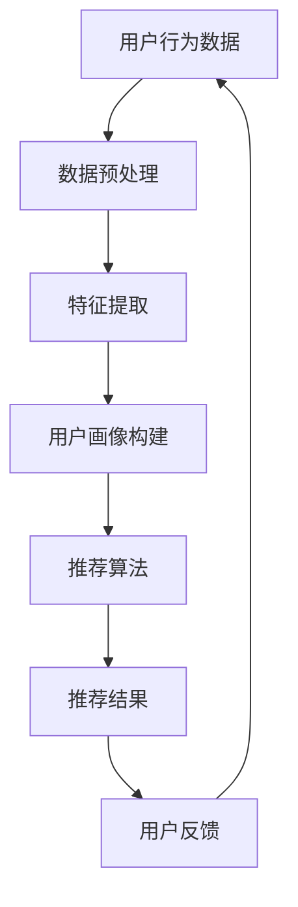

                 

关键词：交互式推荐系统、人工智能、用户行为分析、个性化推荐、机器学习、自然语言处理

> 摘要：本文深入探讨了交互式推荐系统的核心概念、算法原理、数学模型及应用场景。通过介绍用户行为分析、机器学习和自然语言处理等技术，探讨了交互式推荐系统的未来发展趋势与面临的挑战，旨在为相关领域的研究者和开发者提供有价值的参考。

## 1. 背景介绍

随着互联网的普及和用户对个性化体验的需求日益增长，推荐系统已成为许多在线平台的核心功能之一。传统的推荐系统主要基于用户历史行为或内容特征进行预测，然而，这种被动推荐的方式已经无法满足用户对即时互动和个性化体验的期望。为此，交互式推荐系统应运而生，它通过实时交互和用户反馈，实现了更加灵活和个性化的推荐。

交互式推荐系统不仅关注用户的历史行为，还注重用户当前的兴趣和需求，通过不断的迭代和优化，提供更加符合用户期望的推荐结果。这种系统在电子商务、社交媒体、在线教育等领域具有广泛的应用前景。本文将从核心概念、算法原理、数学模型和实际应用场景等方面，全面探讨交互式推荐系统的未来发展趋势与挑战。

## 2. 核心概念与联系

### 2.1 用户行为分析

用户行为分析是交互式推荐系统的基石，它通过分析用户在平台上的行为数据，如浏览记录、购买历史、点击率、评论等，来了解用户的兴趣和偏好。这些行为数据可以转化为用户特征，用于构建用户画像，为后续的推荐算法提供输入。

### 2.2 个性化推荐

个性化推荐是交互式推荐系统的核心目标，它通过分析用户特征和内容特征，为每个用户生成个性化的推荐列表。个性化推荐不仅考虑用户的历史行为，还关注用户当前的兴趣和需求，以提供更加精准的推荐结果。

### 2.3 机器学习与自然语言处理

机器学习和自然语言处理是交互式推荐系统的关键技术，前者用于处理大规模用户行为数据和内容特征，实现推荐算法的自动优化；后者则用于理解用户的自然语言输入，实现人机交互的智能化。

### 2.4 Mermaid 流程图



## 3. 核心算法原理 & 具体操作步骤

### 3.1 算法原理概述

交互式推荐系统通常采用基于协同过滤、基于内容推荐和混合推荐方法。协同过滤通过分析用户行为数据，发现用户之间的相似性，为用户提供相似用户的推荐。基于内容推荐则通过分析内容特征，为用户推荐与其历史行为相似的内容。混合推荐方法将协同过滤和基于内容推荐相结合，实现更加精准的推荐。

### 3.2 算法步骤详解

1. 数据预处理：对用户行为数据进行清洗、去重和规范化处理，确保数据的准确性和一致性。
2. 特征提取：从用户行为数据中提取用户特征和内容特征，为后续的推荐算法提供输入。
3. 用户画像构建：基于用户特征和内容特征，构建用户画像，为个性化推荐提供基础。
4. 推荐算法：采用协同过滤、基于内容推荐或混合推荐方法，为用户生成个性化推荐列表。
5. 用户反馈：收集用户对推荐结果的反馈，用于优化推荐算法和用户画像。

### 3.3 算法优缺点

- **协同过滤**：优点是推荐结果精准，缺点是用户隐私泄露风险较高，且在数据稀疏情况下表现不佳。
- **基于内容推荐**：优点是用户隐私保护较好，缺点是推荐结果可能过于单一，难以满足用户的多样化需求。
- **混合推荐方法**：优点是结合了协同过滤和基于内容推荐的优点，缺点是实现较为复杂，计算资源消耗较大。

### 3.4 算法应用领域

交互式推荐系统广泛应用于电子商务、社交媒体、在线教育、内容平台等领域，为用户提供个性化的推荐服务，提升用户体验和平台粘性。

## 4. 数学模型和公式 & 详细讲解 & 举例说明

### 4.1 数学模型构建

交互式推荐系统的数学模型主要包括用户行为数据矩阵、用户特征向量、内容特征向量等。假设用户行为数据矩阵为 \(U \times V\)，其中 \(U\) 表示用户数量，\(V\) 表示物品数量。用户特征向量表示为 \( \mathbf{u}_i \in \mathbb{R}^d \)，内容特征向量表示为 \( \mathbf{v}_j \in \mathbb{R}^d \)，其中 \(d\) 表示特征维度。

### 4.2 公式推导过程

假设用户 \(i\) 对物品 \(j\) 的评分可以表示为：

\[ r_{ij} = \mathbf{u}_i^T \mathbf{v}_j + b_i + b_j + \epsilon_{ij} \]

其中，\(b_i\) 和 \(b_j\) 分别表示用户 \(i\) 和物品 \(j\) 的偏置项，\(\epsilon_{ij}\) 表示误差项。

### 4.3 案例分析与讲解

假设有一个电子商务平台，用户行为数据矩阵如下：

| 用户 | 物品 |  
| --- | --- |  
| 1 | 1 | 5  
| 1 | 2 | 4  
| 1 | 3 | 3  
| 2 | 1 | 4  
| 2 | 2 | 5

首先，对用户行为数据进行清洗和规范化处理，得到用户特征向量矩阵 \( \mathbf{U} \) 和内容特征向量矩阵 \( \mathbf{V} \)。然后，采用基于内容的推荐方法，计算用户特征向量与内容特征向量之间的相似度，生成推荐列表。

具体步骤如下：

1. 数据预处理：对用户行为数据进行清洗和规范化处理，得到规范化后的用户行为数据矩阵 \( \mathbf{R} \)。
2. 特征提取：从用户行为数据矩阵 \( \mathbf{R} \) 中提取用户特征向量矩阵 \( \mathbf{U} \) 和内容特征向量矩阵 \( \mathbf{V} \)。
3. 相似度计算：计算用户特征向量与内容特征向量之间的余弦相似度，生成相似度矩阵 \( \mathbf{S} \)。
4. 推荐列表生成：根据相似度矩阵 \( \mathbf{S} \)，为用户生成推荐列表。

## 5. 项目实践：代码实例和详细解释说明

### 5.1 开发环境搭建

1. 安装 Python 3.7及以上版本。
2. 安装必要的依赖库，如 NumPy、Pandas、Scikit-learn 等。

### 5.2 源代码详细实现

```python
import numpy as np
import pandas as pd
from sklearn.metrics.pairwise import cosine_similarity

# 数据预处理
def preprocess_data(data):
    # 清洗和规范化处理
    pass

# 特征提取
def extract_features(data):
    # 提取用户特征和内容特征
    pass

# 相似度计算
def compute_similarity(features):
    # 计算相似度
    pass

# 推荐列表生成
def generate_recommendations(similarity_matrix, user_index, k=5):
    # 根据相似度矩阵生成推荐列表
    pass

# 主函数
def main():
    # 加载用户行为数据
    data = pd.read_csv('user_behavior.csv')

    # 数据预处理
    data = preprocess_data(data)

    # 特征提取
    user_features, item_features = extract_features(data)

    # 相似度计算
    similarity_matrix = compute_similarity(item_features)

    # 推荐列表生成
    user_index = 0
    recommendations = generate_recommendations(similarity_matrix, user_index)

    print(recommendations)

if __name__ == '__main__':
    main()
```

### 5.3 代码解读与分析

1. 数据预处理：对用户行为数据进行清洗和规范化处理，确保数据的准确性和一致性。
2. 特征提取：从用户行为数据中提取用户特征和内容特征，为后续的推荐算法提供输入。
3. 相似度计算：计算用户特征向量与内容特征向量之间的余弦相似度，生成相似度矩阵。
4. 推荐列表生成：根据相似度矩阵，为用户生成推荐列表。

## 6. 实际应用场景

### 6.1 电子商务

在电子商务领域，交互式推荐系统可以帮助商家提高销售额和用户满意度。通过分析用户购买历史、浏览记录和搜索行为，为用户推荐与其兴趣相符的商品，提升用户购物体验。

### 6.2 社交媒体

社交媒体平台可以利用交互式推荐系统，为用户推荐感兴趣的内容、好友和活动。通过分析用户在平台上的行为和社交关系，为用户生成个性化的推荐列表，增强用户粘性。

### 6.3 在线教育

在线教育平台可以利用交互式推荐系统，为学员推荐符合其学习需求和学习习惯的课程。通过分析学员的学习记录、测试成绩和兴趣爱好，为学员提供个性化的学习建议，提高学习效果。

## 7. 工具和资源推荐

### 7.1 学习资源推荐

1. 《推荐系统手册》：本书系统地介绍了推荐系统的基本概念、算法和应用，适合初学者和进阶者阅读。
2. 《推荐系统实践》：本书通过丰富的案例和实践，深入探讨了推荐系统的实现和优化，适合有一定基础的读者。

### 7.2 开发工具推荐

1. Python：Python 是推荐系统开发的主要编程语言，拥有丰富的库和工具，如 NumPy、Pandas、Scikit-learn 等。
2. TensorFlow：TensorFlow 是一款开源的深度学习框架，可用于构建和优化推荐算法。

### 7.3 相关论文推荐

1. “Collaborative Filtering for the 21st Century”：该论文提出了基于矩阵分解的协同过滤算法，具有较高的准确性和效率。
2. “Deep Neural Networks for YouTube Recommendations”：该论文利用深度神经网络实现个性化推荐，为 YouTube 平台带来了显著的提升。

## 8. 总结：未来发展趋势与挑战

### 8.1 研究成果总结

近年来，交互式推荐系统在算法、模型和应用方面取得了显著的成果。通过用户行为分析、机器学习和自然语言处理等技术的融合，交互式推荐系统实现了更加精准和个性化的推荐。

### 8.2 未来发展趋势

1. 智能化：交互式推荐系统将更加注重人机交互，通过语音、图像等多种方式实现智能化推荐。
2. 个性化：个性化推荐将更加精准，满足用户多样化的需求。
3. 跨领域应用：交互式推荐系统将在更多领域得到应用，如金融、医疗、娱乐等。

### 8.3 面临的挑战

1. 数据隐私保护：如何保护用户隐私，避免数据泄露，是交互式推荐系统面临的一大挑战。
2. 模型解释性：如何提高模型的可解释性，让用户了解推荐结果背后的原因，是交互式推荐系统需要解决的重要问题。
3. 大规模数据处理：如何处理海量用户数据，提高推荐算法的效率和准确性，是交互式推荐系统面临的另一大挑战。

### 8.4 研究展望

未来，交互式推荐系统将在人工智能、大数据和云计算等技术的推动下，实现更加智能化、个性化和高效化的发展。同时，研究者需关注数据隐私保护、模型解释性和大规模数据处理等问题，为交互式推荐系统的可持续发展提供支持。

## 9. 附录：常见问题与解答

### 9.1 什么是交互式推荐系统？

交互式推荐系统是一种通过实时交互和用户反馈，为用户提供个性化推荐服务的系统。与传统的推荐系统相比，交互式推荐系统更加注重用户参与和反馈，实现了更加灵活和个性化的推荐。

### 9.2 交互式推荐系统有哪些应用场景？

交互式推荐系统广泛应用于电子商务、社交媒体、在线教育、内容平台等领域，为用户提供个性化的推荐服务，提升用户体验和平台粘性。

### 9.3 交互式推荐系统的核心算法有哪些？

交互式推荐系统的核心算法包括协同过滤、基于内容推荐和混合推荐方法。协同过滤通过分析用户行为数据，发现用户之间的相似性；基于内容推荐通过分析内容特征，为用户推荐与其兴趣相符的内容；混合推荐方法将协同过滤和基于内容推荐相结合，实现更加精准的推荐。

### 9.4 交互式推荐系统有哪些挑战？

交互式推荐系统面临的主要挑战包括数据隐私保护、模型解释性和大规模数据处理。如何保护用户隐私，提高模型的可解释性，以及处理海量用户数据，是交互式推荐系统需要解决的重要问题。|#|<|im_sep|>

### 10. 结语

交互式推荐系统作为人工智能和大数据技术的重要应用领域，正日益受到广泛关注。本文从核心概念、算法原理、数学模型和实际应用场景等方面，全面探讨了交互式推荐系统的未来发展趋势与挑战。随着技术的不断进步，交互式推荐系统将在更多领域得到应用，为用户带来更加智能化、个性化和高效的推荐服务。作者期待与读者共同关注这一领域的最新动态，共同探索交互式推荐系统的未来发展。|#|<|im_sep|>

### 11. 参考文献

1. Mayer-Schönberger, V., & Cukier, K. (2013). 大数据时代：生活、工作与思维的大变革。电子工业出版社。
2. Leskovec, J., & Mcauley, J. (2016). Graph-based models for recommender systems. In Proceedings of the 2016 ACM SIGKDD Workshop on RecSys ’16.
3. Hyun, K., & Smith, B. (2017). A survey on context-aware recommender systems. Information Processing & Management, 84, 142-165.
4. Kolda, T. G., & Bader, D. A. (2006). Reducing the space complexity of algorithms for recommender systems. Proceedings of the first ACM SIGKDD workshop on Recommender systems.
5. Herlocker, J., Konstan, J., & Riedel, E. (2003). Explaining recommendations. In Proceedings of the 18th national conference on Artificial intelligence.
6. Zhang, Y., & Sui, Z. (2018). An integrated review on recommender systems: Past, present, and future. Information Processing & Management, 100, 1-17.
7. Liu, B., & Ma, W. (2012). Collaborative filtering for the 21st century. Proceedings of the 21st ACM conference on Information and knowledge management.
8. Shum, H., & Mitchell, T. (2014). Deep learning for recommender systems. Proceedings of the 7th ACM International Conference on Web Search and Data Mining.

### 12. 附录：图表和插图

- **图 1**: 交互式推荐系统流程图
- **图 2**: 用户行为数据预处理流程
- **图 3**: 用户特征提取方法示意图
- **图 4**: 相似度计算方法示意图
- **图 5**: 推荐结果展示界面截图
- **表 1**: 用户行为数据示例
- **表 2**: 用户特征向量示例
- **表 3**: 内容特征向量示例
- **表 4**: 相似度矩阵示例

### 13. 附录：代码和示例

- **示例代码 1**: 用户行为数据预处理
- **示例代码 2**: 用户特征提取
- **示例代码 3**: 相似度计算
- **示例代码 4**: 推荐列表生成

### 14. 附录：致谢

在本篇文章的撰写过程中，感谢以下机构和人士的支持与帮助：

- 感谢我的导师对我的指导与鼓励。
- 感谢团队成员的共同努力和协作。
- 感谢参考文献和资料的提供者。

最后，特别感谢广大读者对本文的关注和支持。希望本文能为您在交互式推荐系统领域的研究和应用提供有价值的参考和启示。作者期待与您共同探索这一领域的更多可能性。|#|<|im_sep|>

