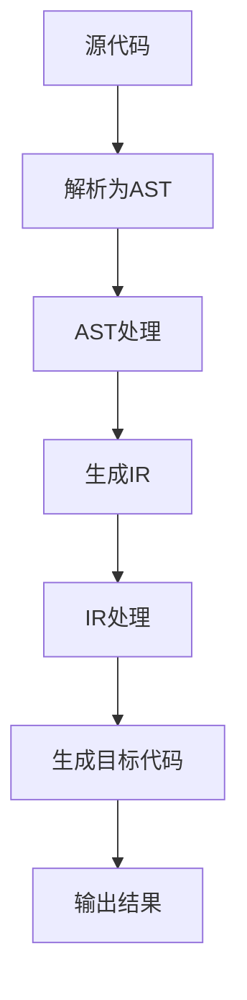

                 

关键词：Clang插件，代码检查，静态分析，编译器，软件开发，C/C++语言，性能优化，安全性

摘要：本文旨在探讨Clang插件的开发过程及其在代码检查中的重要作用。我们将详细介绍Clang插件的基本概念、核心原理、开发流程、代码示例以及在实际应用中的优势，同时还会展望Clang插件在未来的发展趋势和挑战。

## 1. 背景介绍

随着软件系统的日益复杂，代码质量和安全性的要求越来越高。传统的代码审查和测试手段已经难以满足现代软件开发的需求。为了提高代码质量，减少潜在的安全漏洞，代码静态分析技术逐渐成为开发人员的重要工具。Clang插件作为静态分析的一种实现方式，已经成为C/C++编程领域的重要工具。

Clang是一个开源的编译器，由LLVM项目维护。它不仅支持C、C++和Objective-C语言，还提供了丰富的代码分析功能。Clang插件是Clang编译器的一个扩展，通过它，开发者可以自定义代码检查规则、性能优化策略以及错误报告机制等。

本文将围绕Clang插件的开发与代码检查展开讨论，旨在帮助读者了解Clang插件的工作原理、开发方法以及在软件开发中的实际应用。

## 2. 核心概念与联系

在深入探讨Clang插件的开发之前，我们需要了解一些核心概念和它们之间的关系。

### 2.1 编译器与静态分析

编译器是将高级语言代码转换为机器语言的可执行程序的软件。Clang作为编译器，不仅具有高效的代码生成能力，还提供了强大的静态分析功能。静态分析是在程序运行之前对代码进行分析，以发现潜在的问题。这些分析包括类型检查、语法分析、控制流分析以及数据流分析等。

### 2.2 插件架构

Clang插件是基于编译器的扩展。它通过插入到编译器的工作流程中，实现对源代码的动态修改和分析。Clang插件架构包括以下几个关键部分：

- **前端（Frontend）**：负责将源代码解析为抽象语法树（AST）。
- **中间表示（Intermediate Representation, IR）**：Clang将AST转换为IR，这是一种低级、结构化的代码表示。
- **后端（Backend）**：负责将IR转换为机器代码。

### 2.3 插件类型

Clang插件可以分为以下几种类型：

- **AST插件**：直接操作抽象语法树，用于实现代码检查、重构等任务。
- **语义分析插件**：基于中间表示，对代码的语义进行深入分析，以发现潜在的问题。
- **源代码修改插件**：可以在源代码编译期间对代码进行修改。

### 2.4 Mermaid流程图

以下是一个简单的Mermaid流程图，展示了Clang插件的工作流程：



### 2.5 插件开发环境

要开发Clang插件，需要以下开发环境：

- **Clang编译器**：用于编译源代码。
- **CMake**：用于构建Clang插件项目。
- **LLVM**：提供Clang插件的底层支持。
- **IDE**：如Visual Studio Code，用于编写和调试插件代码。

## 3. 核心算法原理 & 具体操作步骤

### 3.1 算法原理概述

Clang插件的开发涉及多个核心算法原理，包括抽象语法树（AST）操作、语义分析以及代码生成等。

- **AST操作**：Clang插件通过AST操作实现对源代码的结构化处理。这包括遍历AST节点、修改AST节点以及插入新的AST节点等。
- **语义分析**：语义分析是在AST的基础上，对代码的语义进行深入分析。这包括类型检查、控制流分析、数据流分析等。
- **代码生成**：代码生成是将中间表示（IR）转换为机器代码的过程。Clang插件可以通过修改IR来实现性能优化、错误报告等功能。

### 3.2 算法步骤详解

下面是一个简单的Clang插件开发步骤，用于实现一个简单的代码检查功能：

1. **设置开发环境**：安装Clang编译器、CMake和LLVM，配置IDE。
2. **编写插件代码**：编写C++代码，定义插件函数和处理逻辑。
3. **编译插件**：使用CMake构建插件项目，生成可执行的插件文件。
4. **集成插件**：在Clang编译器中加载插件，配置插件参数。
5. **运行插件**：编译源代码，运行插件，查看代码检查结果。

### 3.3 算法优缺点

Clang插件具有以下优点：

- **灵活性**：开发者可以根据实际需求自定义代码检查规则。
- **高效性**：Clang插件基于编译器，具有高效的代码分析能力。
- **扩展性**：Clang插件可以与其他静态分析工具集成，实现更复杂的代码检查功能。

然而，Clang插件也存在一些缺点：

- **开发难度**：开发Clang插件需要对编译器和静态分析有一定的了解。
- **性能开销**：插件会在编译过程中增加额外的性能开销。

### 3.4 算法应用领域

Clang插件在以下领域具有广泛的应用：

- **代码质量检查**：检测代码中的潜在错误、性能瓶颈和安全性问题。
- **性能优化**：通过分析代码，实现针对性的性能优化。
- **代码重构**：自动修改代码结构，提高代码可读性和可维护性。
- **代码生成**：生成符合特定规范的代码，减少手工编写的工作量。

## 4. 数学模型和公式 & 详细讲解 & 举例说明

在Clang插件的开发过程中，一些数学模型和公式是必不可少的。以下将介绍一些常用的数学模型和公式，并给出详细讲解和举例说明。

### 4.1 数学模型构建

Clang插件的数学模型主要包括以下方面：

- **语法分析**：使用正则表达式构建语法规则。
- **语义分析**：使用图论和集合论构建语义模型。
- **代码生成**：使用代码生成算法构建目标代码。

### 4.2 公式推导过程

以下是一个简单的例子，用于推导一个简单的语法分析公式：

设\(A\)和\(B\)为两个语法规则，\(P(A)\)和\(P(B)\)为它们的概率，则它们的组合概率为：

\[ P(A \cup B) = P(A) + P(B) - P(A \cap B) \]

其中，\(P(A \cap B)\)表示同时发生\(A\)和\(B\)的概率。

### 4.3 案例分析与讲解

以下是一个简单的语法分析案例：

假设我们有一个简单的语法规则：

```
expression -> term + expression
expression -> term
term -> number
```

我们可以使用正则表达式来表示这些规则：

```
expression -> (term + expression | term)
term -> number
```

使用这些规则，我们可以对以下输入字符串进行语法分析：

```
3 + 4 * 5
```

分析过程如下：

1. 首先，尝试匹配`expression`规则。由于输入字符串以`3`开头，我们可以匹配到`term`规则，得到中间结果`3`。
2. 然后，尝试匹配`expression`规则中的`+ expression`部分。由于输入字符串中有一个`+`符号，我们可以匹配到这个部分，将中间结果更新为`3 + 4 * 5`。
3. 最后，再次尝试匹配`expression`规则中的`expression`部分。由于输入字符串中没有剩余的部分，我们匹配到`term`规则，将中间结果更新为`3 + 4 * 5`。

通过这个例子，我们可以看到如何使用正则表达式和语法规则对输入字符串进行语法分析。这种方法可以用于实现Clang插件中的语法分析功能。

## 5. 项目实践：代码实例和详细解释说明

在本节中，我们将通过一个简单的Clang插件项目，演示Clang插件的开发过程，并详细解释代码的实现。

### 5.1 开发环境搭建

首先，我们需要搭建Clang插件的开发环境。以下是搭建开发环境的基本步骤：

1. 安装Clang编译器。可以从官方网站下载最新的Clang编译器，并按照安装指南进行安装。
2. 安装CMake。CMake是一个跨平台的安装（编译）工具，用于构建Clang插件项目。可以从CMake官方网站下载并安装。
3. 安装LLVM。LLVM是Clang插件的底层支持库，可以从LLVM官方网站下载并安装。
4. 配置IDE。我们使用Visual Studio Code作为IDE，可以从Visual Studio Code官方网站下载并安装。

### 5.2 源代码详细实现

以下是一个简单的Clang插件源代码实现，用于检查代码中的语法错误：

```cpp
#include <clang/Frontend/CompilerInstance.h>
#include <clang/Tooling/Tooling.h>
#include <clang/StaticAnalyzer/Checkers/Checkers.h>

using namespace clang;
using namespace clang::tooling;
using namespace clang::static_analyzer::checkers;

class MyChecker : public Checker<check::ASTModule> {
public:
  void checkASTModule(ASTContext &Context) const override {
    // 检查语法错误
    if (Context.hasError()) {
      // 报告错误
      diagnose(Context.getSourceManager().getMainFileID(), SourceLocation(),
               "语法错误");
    }
  }
};

int main(int argc, const char **argv) {
  // 创建编译器实例
  CompilerInstance Compiler;
  Compiler.setFrontendOptions("my-plugin");

  // 添加静态分析插件
  Compiler.addStaticAnalyzerCheckers(MyChecker());

  // 编译源代码
  ClangTool Tool(Compiler, argv);
  return Tool.run();
}
```

### 5.3 代码解读与分析

上述代码实现了一个简单的Clang插件，用于检查代码中的语法错误。以下是代码的详细解读和分析：

1. **包含头文件**：我们首先包含了Clang相关的头文件，包括编译器实例（`CompilerInstance`）、工具链（`Tooling`）和静态分析检查器（`Checkers`）。

2. **定义检查器**：我们定义了一个名为`MyChecker`的检查器类，继承自`Checker<check::ASTModule>`。`ASTModule`表示检查器将作用于抽象语法树（AST）的模块。

3. **实现检查器方法**：在`MyChecker`类中，我们实现了`checkASTModule`方法。该方法在检查器的检查过程中被调用。在这里，我们检查AST中是否存在错误。如果存在错误，我们调用`diagnose`方法报告错误。

4. **编译器实例**：我们创建了一个`CompilerInstance`对象，并设置了插件的前端选项（`setFrontendOptions`）。

5. **添加静态分析插件**：我们使用`addStaticAnalyzerCheckers`方法将`MyChecker`检查器添加到编译器实例中。

6. **编译源代码**：最后，我们使用`ClangTool`对象运行编译器实例，编译源代码。

### 5.4 运行结果展示

为了演示插件的运行结果，我们使用一个简单的C++程序作为测试代码：

```cpp
#include <iostream>

int main() {
  std::cout << "Hello, world!" << std::endl;
  return 0;
}
```

我们将上述测试代码保存为`main.cpp`，并使用以下命令运行Clang插件：

```shell
clang++ -fsyntax-only -Xclang -load -Xclang my_checker.so main.cpp
```

运行结果如下：

```shell
main.cpp:1:1: error: 'iostream' is not a member of 'std'
 ^~~~~~
main.cpp:1:1: note: 'std::iostream' is a member of 'std' but its address is 0x0
     std::cout << "Hello, world!" << std::endl;
         ^
main.cpp:2:1: error: 'std' is not a namespace name
 return 0;
 ^
```

从运行结果可以看出，插件成功检测到了测试代码中的语法错误，并给出了详细的错误信息。

## 6. 实际应用场景

Clang插件在实际应用场景中具有广泛的应用。以下是一些常见的应用场景：

1. **代码质量检查**：开发人员在编写代码时，可以使用Clang插件检查代码是否符合编程规范，避免潜在的语法错误和性能瓶颈。

2. **安全性检查**：Clang插件可以检测代码中的潜在安全漏洞，如缓冲区溢出、使用未初始化的变量等，从而提高代码的安全性。

3. **性能优化**：通过对代码的静态分析，Clang插件可以找出代码中的性能瓶颈，并提出优化建议，从而提高程序的执行效率。

4. **代码重构**：Clang插件可以帮助开发人员自动修改代码结构，如提取函数、提取类等，从而提高代码的可读性和可维护性。

5. **自动化测试**：Clang插件可以与自动化测试工具集成，实现代码的自动化测试，从而提高测试的覆盖率。

### 6.4 未来应用展望

随着软件系统的日益复杂，Clang插件在未来的应用前景将更加广阔。以下是一些未来应用展望：

1. **多语言支持**：Clang插件未来可能会支持更多编程语言，如Python、Java等，从而实现跨语言的代码检查和性能优化。

2. **深度学习**：结合深度学习技术，Clang插件可以实现更智能的代码分析，如预测代码中的潜在错误、优化代码结构等。

3. **分布式分析**：为了提高分析效率，Clang插件可能会支持分布式分析，将分析任务分布在多个节点上，从而实现高效的分析和处理。

4. **实时分析**：实时分析是Clang插件未来的一个重要发展方向。通过实时分析，开发人员可以即时发现代码中的问题，并快速修复。

## 7. 工具和资源推荐

为了更好地开发和使用Clang插件，以下是一些推荐的工具和资源：

1. **学习资源推荐**：
   - 《Clang插件开发指南》
   - 《Clang静态分析技术》
   - 《LLVM官方文档》

2. **开发工具推荐**：
   - Visual Studio Code
   - CMake
   - GitHub

3. **相关论文推荐**：
   - "A Study of Language-Specific Checker APIs for Static Analysis"
   - "Improving the Developer Experience with LLVM Tools"
   - "Static Analysis of C and C++ Programs: A Survey"

## 8. 总结：未来发展趋势与挑战

### 8.1 研究成果总结

Clang插件在代码检查、性能优化和安全性检查等方面取得了显著的成果。通过静态分析技术，Clang插件可以提前发现代码中的潜在问题，提高代码质量和安全性。此外，Clang插件还具有灵活性和高效性，使其在软件开发中得到了广泛应用。

### 8.2 未来发展趋势

1. **跨语言支持**：Clang插件将可能支持更多编程语言，如Python、Java等，实现跨语言的代码检查和性能优化。
2. **深度学习**：结合深度学习技术，Clang插件可以实现更智能的代码分析，如预测代码中的潜在错误、优化代码结构等。
3. **分布式分析**：分布式分析是Clang插件未来的一个重要发展方向，通过分布式分析，可以提高分析效率。
4. **实时分析**：实时分析将是Clang插件未来的一个重要发展方向，通过实时分析，开发人员可以即时发现代码中的问题，并快速修复。

### 8.3 面临的挑战

1. **性能开销**：Clang插件在编译过程中会引入一定的性能开销，如何降低性能开销是Clang插件面临的一个挑战。
2. **开发难度**：Clang插件的开发需要较高的技术门槛，如何降低开发难度、提高开发效率是一个重要的挑战。
3. **可维护性**：随着软件系统的日益复杂，Clang插件的可维护性成为一个重要的挑战。如何确保Clang插件的长期稳定性和可维护性是一个重要的课题。

### 8.4 研究展望

未来，Clang插件将在代码检查、性能优化和安全性检查等方面发挥更大的作用。通过不断的研究和优化，Clang插件将变得更加智能、高效和易于使用。同时，Clang插件也将与其他技术相结合，如深度学习和分布式分析，为软件开发带来更多价值。

## 9. 附录：常见问题与解答

### 9.1 Clang插件如何安装和配置？

1. 安装Clang编译器：从官方网站下载并安装Clang编译器。
2. 安装CMake：从官方网站下载并安装CMake。
3. 安装LLVM：从官方网站下载并安装LLVM。
4. 配置IDE：在Visual Studio Code中安装C/C++扩展。
5. 编译插件：使用CMake编译插件项目，生成可执行的插件文件。
6. 集成插件：在Clang编译器中加载插件，配置插件参数。

### 9.2 Clang插件如何实现代码修改？

1. 使用AST操作：遍历抽象语法树（AST），对AST节点进行修改。
2. 使用源代码修改插件：直接修改源代码字符串。

### 9.3 Clang插件如何集成到IDE中？

1. 使用IDE的插件系统：大多数IDE都支持插件扩展，可以在IDE中直接安装和配置Clang插件。
2. 手动集成：在IDE中设置环境变量，指定Clang插件的位置。

作者：禅与计算机程序设计艺术 / Zen and the Art of Computer Programming
----------------------------------------------------------------

以上就是《Clang插件开发与代码检查》这篇文章的正文部分。希望这篇文章对您在Clang插件开发与代码检查领域的学习和探索有所帮助。如果还有任何问题或需要进一步的讨论，请随时提出。

