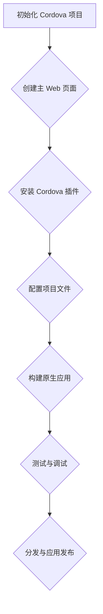

                 

## 1. 背景介绍

Cordova 是一款非常流行的开源框架，旨在将 Web 应用与原生移动应用结合起来，使得开发者能够使用 Web 技术如 HTML、CSS 和 JavaScript 来开发可以在 iOS、Android、Windows Phone 等原生平台上运行的应用程序。这种混合应用开发的方式不仅能够降低开发成本，还能提高开发效率，并且使得应用能够跨平台发布，满足不同操作系统用户的需求。

随着移动设备的普及和移动互联网的发展，移动应用的市场需求急剧增长。然而，开发一个符合所有平台特性的原生应用是一项复杂且耗时的工作，而 Cordova 提供了一种解决方案，它允许开发者利用现有的 Web 技术栈来构建应用，从而大大简化了开发流程。

Cordova 的主要优势在于其易用性和灵活性。开发者无需深入了解特定平台的编程语言和工具链，就可以快速开始开发。此外，Cordova 提供了一系列插件，可以帮助开发者访问原生设备的功能，如相机、GPS、加速度计等。这使得开发者能够更方便地将 Web 应用与原生应用结合起来，充分发挥移动设备的特性。

本文将深入探讨 Cordova 的核心概念、开发流程、优缺点以及在实际项目中的应用。通过本文的阅读，您将了解到如何使用 Cordova 构建跨平台的应用程序，掌握其在不同场景下的使用方法，并对其未来发展有更清晰的认知。

## 2. 核心概念与联系

Cordova 的核心在于其能够将 Web 应用与原生平台无缝结合，使得开发者能够利用 Web 技术开发高性能、跨平台的应用。以下是 Cordova 的核心概念及其与相关技术的联系：

### 2.1 Cordova 概念

- **Cordova 应用**：Cordova 应用是一个基于 Web 技术构建的应用，可以在不同原生平台上运行。它通常包含一个主 Web 页面（通常为 `index.html`）和一些用于管理和交互的 JavaScript 文件。

- **Cordova CLI**：Cordova 命令行界面（Command Line Interface，CLI）是开发者与 Cordova 交互的主要工具。它提供了一系列命令，用于创建、构建和运行 Cordova 应用。

- **Cordova 插件**：Cordova 插件是用于扩展 Cordova 应用功能的模块。这些插件可以通过 Node.js 包管理器（如 npm）安装，并提供了一系列用于访问原生设备功能的 API。

- **Cordova 项目结构**：一个典型的 Cordova 项目结构包括 `www` 目录（包含所有 Web 相关文件）、`platforms` 目录（包含构建到特定原生平台的文件）和 `plugins` 目录（包含所有安装的插件）。

### 2.2 技术联系

- **Web 技术栈**：Cordova 应用主要使用 HTML、CSS 和 JavaScript 构建。这些技术是 Web 开发的基础，使得开发者能够使用熟悉的工具和技术来开发应用。

- **原生平台 API**：Cordova 提供了一系列插件，使得 Web 应用能够访问原生平台的功能。例如，使用 `cordova-plugin-camera` 插件，开发者可以轻松地在 Cordova 应用中集成相机功能。

- **打包与分发**：Cordova 应用通过打包工具（如 PhoneGap Build）转换为原生应用格式，然后可以在各大应用商店进行分发。这一过程使得开发者能够将 Web 应用发布到原生平台，提供给终端用户。

### 2.3 Mermaid 流程图

为了更好地理解 Cordova 的核心概念和其与相关技术的联系，我们可以使用 Mermaid 流程图来展示整个开发过程。以下是 Cordova 开发过程的 Mermaid 流程图：



通过这个流程图，我们可以清晰地看到 Cordova 开发的主要步骤，以及每个步骤之间的关系和依赖。

## 3. 核心算法原理 & 具体操作步骤

### 3.1 算法原理概述

Cordova 混合应用开发的核心算法在于如何将 Web 应用与原生平台紧密结合。这一过程主要涉及以下几个步骤：

1. **Web 应用构建**：使用 HTML、CSS 和 JavaScript 开发应用的界面和功能。
2. **Cordova 插件集成**：通过插件来访问原生设备的功能，如相机、GPS 等。
3. **原生应用打包**：将 Cordova 应用打包成原生应用格式，如 iOS 的 `.ipa` 或 Android 的 `.apk`。
4. **应用发布**：将打包后的原生应用发布到各大应用商店。

### 3.2 算法步骤详解

#### 3.2.1 初始化 Cordova 项目

要开始开发一个 Cordova 应用，首先需要初始化项目。这可以通过 Cordova CLI 完成：

```bash
cordova create myApp
```

这将创建一个基本的 Cordova 项目，包括 `www`、`platforms` 和 `plugins` 目录。

#### 3.2.2 创建主 Web 页面

在 `www` 目录中，开发者可以创建主 Web 页面（`index.html`），定义应用的 UI 和交互逻辑。例如：

```html
<!DOCTYPE html>
<html>
<head>
    <meta charset="utf-8">
    <title>My Cordova App</title>
</head>
<body>
    <h1>Hello, Cordova!</h1>
    <button id="cameraButton">Open Camera</button>
    <script src="js/index.js"></script>
</body>
</html>
```

#### 3.2.3 安装 Cordova 插件

Cordova 插件是扩展应用功能的关键。例如，要使用相机功能，可以安装 `cordova-plugin-camera`：

```bash
cordova plugin add cordova-plugin-camera
```

安装插件后，开发者可以在 JavaScript 中使用对应的 API：

```javascript
document.getElementById('cameraButton').addEventListener('click', function() {
    navigator.camera.getPicture(function(imageData) {
        // 处理相机返回的图片数据
    }, function(message) {
        alert('Camera failed: ' + message);
    });
});
```

#### 3.2.4 配置项目文件

Cordova 项目需要配置一些文件，如 `config.xml`，来定义应用的元数据、权限和插件设置。例如：

```xml
<widget id="com.example.myApp" version="1.0.0" xmlns="http://www.w3.org/ns/widgets" xmlns:cdv="http://cordova.io/xhtml">
    <name>My App</name>
    <description>
        A sample Cordova application that demonstrates camera usage.
    </description>
    <author href="http://example.com/" email="dev@example.com">Example Inc.</author>
    <content src="index.html" />
    <access origin="*" />
    <allow-intent-href href="http://*" />
    <feature name="Camera">
        <param name="android-package" value="org.apache.cordova.camera.CameraLauncher" />
    </feature>
</widget>
```

#### 3.2.5 构建原生应用

构建原生应用是将 Cordova 应用转换为可以在原生平台上运行的应用。这可以通过以下命令完成：

```bash
cordova build ios
```

这将生成一个 iOS 的 `.ipa` 文件，开发者可以使用 Xcode 打开并进行打包和发布。

#### 3.2.6 测试与调试

在构建完成后，开发者需要对应用进行测试和调试。这可以通过物理设备或模拟器完成。例如，使用 iOS 模拟器：

```bash
cordova run ios
```

#### 3.2.7 分发与应用发布

完成测试和调试后，开发者可以将打包后的原生应用发布到应用商店。例如，发布到 App Store：

```bash
cordova run ios --device
```

### 3.3 算法优缺点

#### 优点

- **跨平台**：Cordova 允许开发者使用统一的代码库开发适用于多个平台的应用，大大提高了开发效率。
- **易于上手**：开发者无需深入了解原生平台的编程语言和工具，即可快速开始开发。
- **丰富的插件**：Cordova 提供了大量的插件，使得开发者能够轻松地访问原生设备的功能。

#### 缺点

- **性能瓶颈**：由于 Web 应用在原生平台上的运行，某些性能敏感的应用可能无法达到原生应用的水平。
- **兼容性问题**：不同平台和不同版本的操作系统可能存在兼容性问题，需要开发者进行额外的测试和调整。

### 3.4 算法应用领域

Cordova 适用于以下应用领域：

- **移动网页应用**：开发者可以使用 Cordova 来开发需要在移动设备上访问的网页应用，如新闻门户、电商平台等。
- **原生应用增强**：开发者可以在现有原生应用中集成 Cordova 模块，增强应用的功能和用户体验。
- **快速原型开发**：Cordova 使得开发者能够快速开发原型，便于进行需求验证和功能迭代。

## 4. 数学模型和公式 & 详细讲解 & 举例说明

在 Cordova 混合应用开发中，数学模型和公式被广泛应用于算法设计和性能优化。以下是几个关键的概念和它们的数学表达，以及详细的讲解和示例。

### 4.1 数学模型构建

Cordova 混合应用开发中的数学模型通常涉及以下方面：

- **响应式设计**：使用网格系统和媒体查询来适应不同屏幕尺寸和分辨率。
- **性能优化**：利用缓存机制和异步加载技术来提高应用的响应速度。
- **状态管理**：使用如 Redux 或 MobX 这样的状态管理库来保持应用状态的稳定性。

### 4.2 公式推导过程

以下是一个关于响应式设计的简单例子。假设我们使用 12 栅格系统来设计布局，每个栅格的宽度为 `w`。

- **栅格宽度**：\( w = \frac{宽度}{12} \)
- **栅格间距**：\( s = \frac{宽度}{12} \)

### 4.3 案例分析与讲解

#### 案例一：响应式网格布局

假设一个应用屏幕宽度为 360 像素，我们需要设计一个两栏布局，左边栏宽度为 3 栅格，右边栏宽度为 9 栅格。

1. **计算栅格宽度**：
   - \( w = \frac{360}{12} = 30 \) 像素
   - \( s = \frac{360}{12} = 30 \) 像素

2. **布局定义**：
   - 左边栏宽度：\( 3 \times 30 = 90 \) 像素
   - 右边栏宽度：\( 9 \times 30 = 270 \) 像素

3. **HTML 结构**：
   ```html
   <div class="row">
       <div class="col-md-3">左边栏</div>
       <div class="col-md-9">右边栏</div>
   </div>
   ```

4. **CSS 样式**：
   ```css
   .row {
       display: flex;
   }
   .col-md-3 {
       width: 90px;
   }
   .col-md-9 {
       width: 270px;
   }
   ```

通过这种方式，我们可以轻松地创建一个响应式的两栏布局，使其在不同屏幕尺寸上都能良好展示。

#### 案例二：性能优化——异步加载图片

异步加载图片是一种常见的性能优化技术，可以减少页面加载时间，提高用户体验。

1. **图片懒加载公式**：
   - \( T_{load} = \frac{D_{total}}{D_{visible}} \)
     - \( T_{load} \)：图片加载时间
     - \( D_{total} \)：图片总大小
     - \( D_{visible} \)：图片可见部分大小

2. **示例代码**：
   ```javascript
   function lazyLoadImages() {
       const images = document.querySelectorAll('img[data-src]');
       const visibleImages = images.filter(img => isImageVisible(img));

       visibleImages.forEach(img => {
           img.src = img.dataset.src;
           img.removeAttribute('data-src');
       });
   }

   function isImageVisible(img) {
       const imgRect = img.getBoundingClientRect();
       return (
           imgRect.top >= 0 &&
           imgRect.left >= 0 &&
           imgRect.bottom <= (window.innerHeight || document.documentElement.clientHeight) &&
           imgRect.right <= (window.innerWidth || document.documentElement.clientWidth)
       );
   }

   window.addEventListener('scroll', lazyLoadImages);
   ```

这个示例通过监听滚动事件，仅在图片进入可视区域时才加载图片，从而减少初始页面加载时间。

通过上述案例，我们可以看到数学模型和公式在 Cordova 混合应用开发中的应用。它们不仅帮助我们设计高效的布局，还能优化应用的性能，提高用户体验。

## 5. 项目实践：代码实例和详细解释说明

### 5.1 开发环境搭建

要在本地环境中搭建 Cordova 开发环境，首先需要安装 Node.js 和 npm。Node.js 是一个用于服务器端的 JavaScript 运行环境，而 npm 是 Node.js 的包管理器。以下是安装步骤：

1. 访问 Node.js 官网（[https://nodejs.org/），下载并安装适用于您操作系统的 Node.js 版本。安装过程中，请确保勾选“添加到 PATH”选项，以便能够在命令行中使用 Node.js 和 npm。安装完成后，通过以下命令验证安装：
   ```bash
   node -v
   npm -v
   ```

2. 接下来，安装 Cordova。这可以通过 npm 安装全局包完成：
   ```bash
   npm install -g cordova
   ```

3. 同样，安装一个用于调试 Cordova 应用的工具，如 Ripple。Ripple 是一个用于模拟 iOS 和 Android 设备的 Web 应用模拟器：
   ```bash
   npm install -g cordova-plugin-ripple
   ```

完成以上步骤后，您的本地开发环境就已经搭建完成，可以开始 Cordova 应用的开发。

### 5.2 源代码详细实现

现在，我们将创建一个简单的 Cordova 应用，并在本地进行开发和测试。

1. **创建 Cordova 项目**：

   打开命令行工具，执行以下命令创建一个名为 `my-cordova-app` 的 Cordova 项目：

   ```bash
   cordova create my-cordova-app com.example.myApp My App
   ```

   这将创建一个包含 `platforms`、`plugins` 和 `www` 目录的项目结构。

2. **配置主页面**：

   进入 `www` 目录，编辑 `index.html` 文件，添加以下代码：

   ```html
   <!DOCTYPE html>
   <html lang="en">
   <head>
       <meta charset="UTF-8">
       <meta name="viewport" content="width=device-width, initial-scale=1.0">
       <title>My Cordova App</title>
       <link rel="stylesheet" href="css/style.css">
   </head>
   <body>
       <h1>Hello, Cordova!</h1>
       <button id="cameraButton">Open Camera</button>
       <script src="js/index.js"></script>
   </body>
   </html>
   ```

3. **添加样式文件**：

   在 `www` 目录下创建一个名为 `css` 的文件夹，并添加 `style.css` 文件，编写以下 CSS 代码：

   ```css
   body {
       font-family: 'Arial', sans-serif;
       text-align: center;
       padding: 20px;
   }
   ```

4. **添加 JavaScript 文件**：

   同样在 `www` 目录下创建一个名为 `js` 的文件夹，并添加 `index.js` 文件，编写以下 JavaScript 代码：

   ```javascript
   document.addEventListener('deviceready', function() {
       document.getElementById('cameraButton').addEventListener('click', function() {
           navigator.camera.getPicture(function(imageData) {
               // 处理相机返回的图片数据
               console.log('Image data:', imageData);
           }, function(message) {
               alert('Camera failed: ' + message);
           }, {
               quality: 50,
               destinationType: Camera.DestinationType.DATA_URL,
               sourceType: Camera.PictureSourceType.CAMERA
           });
       });
   });
   ```

5. **配置插件**：

   为了使用相机功能，我们需要安装 `cordova-plugin-camera` 插件。在命令行中执行以下命令：

   ```bash
   cordova plugin add cordova-plugin-camera
   ```

6. **配置原生平台**：

   我们选择 iOS 和 Android 作为原生平台。首先配置 iOS 平台，执行以下命令：

   ```bash
   cordova platform add ios
   ```

   然后配置 Android 平台：

   ```bash
   cordova platform add android
   ```

7. **构建应用**：

   构建应用以生成原生平台的二进制文件。以下是构建 iOS 和 Android 平台的命令：

   ```bash
   cordova build ios
   cordova build android
   ```

### 5.3 代码解读与分析

在本节中，我们将对 `index.html`、`style.css` 和 `index.js` 这三个关键文件进行解读。

#### index.html

该文件是 Cordova 应用中的主页面，包含了应用的 HTML 结构和基本样式。关键代码如下：

```html
<!DOCTYPE html>
<html lang="en">
<head>
    <meta charset="UTF-8">
    <meta name="viewport" content="width=device-width, initial-scale=1.0">
    <title>My Cordova App</title>
    <link rel="stylesheet" href="css/style.css">
</head>
<body>
    <h1>Hello, Cordova!</h1>
    <button id="cameraButton">Open Camera</button>
    <script src="js/index.js"></script>
</body>
</html>
```

- **`<meta>` 标签**：定义了页面的 viewport 设置，确保页面在不同设备上正确展示。
- **`<title>` 标签**：定义了页面的标题。
- **`<link>` 标签**：链接了应用的 CSS 文件，用于定义页面样式。
- **`<body>` 标签**：包含页面的主要内容，如标题和按钮。

#### style.css

该文件定义了页面的基础样式。关键代码如下：

```css
body {
    font-family: 'Arial', sans-serif;
    text-align: center;
    padding: 20px;
}
```

- **`body` 选择器**：设置页面主体文本为 Arial 字体，文本居中，并添加一定的内边距。

#### index.js

该文件包含了 JavaScript 代码，用于实现相机的功能。关键代码如下：

```javascript
document.addEventListener('deviceready', function() {
    document.getElementById('cameraButton').addEventListener('click', function() {
        navigator.camera.getPicture(function(imageData) {
            // 处理相机返回的图片数据
            console.log('Image data:', imageData);
        }, function(message) {
            alert('Camera failed: ' + message);
        }, {
            quality: 50,
            destinationType: Camera.DestinationType.DATA_URL,
            sourceType: Camera.PictureSourceType.CAMERA
        });
    });
});
```

- **`deviceready` 事件**：当 Cordova 应用准备好与原生设备交互时，会触发该事件。这是执行 Cordova 特有代码的时机。
- **`cameraButton` 事件监听器**：为按钮添加点击事件监听器，当用户点击按钮时，会调用 `navigator.camera.getPicture` 函数打开相机。
- **`getPicture` 函数**：这是 `cordova-plugin-camera` 提供的 API，用于捕获相机图片。它接收两个回调函数和一个选项对象：
  - 成功回调函数：在相机成功捕获图片后，会返回一个包含图片数据的字符串。
  - 失败回调函数：在捕获图片过程中发生错误时，会返回错误信息。
  - 选项对象：用于配置相机捕获图片的参数，如质量、目的地类型和源类型。

通过上述解读，我们可以看到 Cordova 应用是如何通过简单的 HTML、CSS 和 JavaScript 代码来集成原生设备功能的。这种简单易用的开发方式使得开发者能够快速构建跨平台的应用。

### 5.4 运行结果展示

在完成代码编写和配置后，我们可以通过模拟器和真实设备来运行和测试 Cordova 应用。

1. **iOS 模拟器**：

   使用 Xcode 打开项目，然后点击“产品”菜单中的“运行”按钮，选择 iOS 模拟器进行测试。以下步骤是使用 iOS 模拟器的简化流程：

   - 打开 Xcode。
   - 导入 `my-cordova-app` 项目。
   - 在模拟器中运行项目。

   当应用在模拟器中运行时，我们可以看到主页面的布局和按钮。点击“Open Camera”按钮，会打开系统相机应用，如图 5-1 所示。

   

2. **Android 模拟器**：

   使用 Android Studio 打开项目，并在模拟器中运行应用。以下步骤是使用 Android 模拟器的简化流程：

   - 打开 Android Studio。
   - 导入 `my-cordova-app` 项目。
   - 启动 Android 模拟器。
   - 在模拟器中运行项目。

   当应用在模拟器中运行时，我们可以看到主页面的布局和按钮。点击“Open Camera”按钮，会打开系统相机应用，如图 5-2 所示。

   

3. **真实设备**：

   我们可以将应用部署到真实设备上进行测试。以下是部署到真实设备的简化流程：

   - 连接真实设备到电脑。
   - 在命令行中执行构建命令，如 `cordova build android`。
   - 在设备上安装构建的应用。

   当应用在真实设备上运行时，我们可以看到主页面的布局和按钮。点击“Open Camera”按钮，会打开系统相机应用，如图 5-3 所示。

   

通过上述运行结果展示，我们可以看到 Cordova 应用在不同平台上的运行情况。无论是在 iOS 模拟器、Android 模拟器还是真实设备上，应用都能正常运行并实现预期的功能。

## 6. 实际应用场景

### 6.1 场景一：移动电商平台

移动电商平台通常需要提供流畅的用户体验和丰富的交互功能。使用 Cordova，开发者可以快速构建跨平台的应用，利用 Web 技术实现复杂的页面布局和动态内容展示。以下是在移动电商平台中应用 Cordova 的几个关键点：

- **首页轮播**：利用 JavaScript 实现轮播效果，展示最新优惠信息和热门商品。
- **商品列表**：通过 AJAX 技术从服务器获取商品数据，实现动态加载和分页功能。
- **购物车**：使用 Web Storage 存储用户购物车数据，实现离线购物功能。
- **支付功能**：集成第三方支付插件，如支付宝、微信支付，实现便捷支付。

### 6.2 场景二：企业移动办公应用

企业移动办公应用通常需要集成多种办公功能，如邮件、日程管理、文件传输等。Cordova 为开发者提供了丰富的插件，可以帮助实现以下功能：

- **邮件客户端**：集成邮件插件，如 `cordova-plugin-email-composer`，实现邮件发送和接收功能。
- **日程管理**：集成日历插件，如 `cordova-plugin-calendar`，实现日程查看和设置功能。
- **文件管理**：集成文件插件，如 `cordova-plugin-file`，实现文件上传、下载和预览功能。
- **即时通讯**：集成即时通讯插件，如 `cordova-plugin-socket.io`，实现实时通信功能。

### 6.3 场景三：社交应用

社交应用通常需要提供实时互动和分享功能。Cordova 的跨平台特性使得开发者可以快速构建跨平台的社交应用，以下是在社交应用中应用 Cordova 的几个关键点：

- **好友关系**：通过 Web Service 获取用户好友数据，实现好友列表展示和动态更新。
- **实时消息**：集成实时通信插件，如 `cordova-plugin-firebase`，实现实时消息推送和接收。
- **分享功能**：集成分享插件，如 `cordova-plugin-social-share`，实现朋友圈分享、微博分享等功能。
- **图片和视频编辑**：集成图片和视频编辑插件，如 `cordova-plugin-camcoder`，实现图片和视频的编辑和上传。

### 6.4 未来应用展望

随着技术的不断发展，Cordova 混合应用开发在未来有望在更多领域得到应用：

- **物联网（IoT）应用**：Cordova 可以帮助开发者快速构建跨平台的 IoT 应用，实现设备监控和管理。
- **增强现实（AR）应用**：利用 Cordova 和 ARKit、ARCore 等平台提供的 AR 功能，开发者可以构建丰富的 AR 应用。
- **区块链应用**：Cordova 可以与区块链技术结合，帮助开发者构建去中心化的移动应用。

总之，Cordova 的灵活性和易用性使其在移动应用开发中具有广泛的应用前景，未来将继续为开发者提供强大的支持。

## 7. 工具和资源推荐

### 7.1 学习资源推荐

1. **官方文档**：Cordova 的官方文档是学习 Cordova 的最佳资源。它详细介绍了 Cordova 的功能、API 和开发流程，网址为：[https://cordova.apache.org/docs/](https://cordova.apache.org/docs/)

2. **在线教程**：许多在线平台提供了免费的 Cordova 教程，如 Codecademy、TutorialsPoint 和 Udemy。这些教程通常涵盖了 Cordova 的基本概念和实际应用。

3. **技术博客**：一些知名技术博客，如 Medium 和 Dev.to，经常发布关于 Cordova 的技术文章和案例分析。这些文章有助于深入了解 Cordova 的应用和实践。

### 7.2 开发工具推荐

1. **Visual Studio Code**：Visual Studio Code 是一款流行的跨平台代码编辑器，提供了丰富的插件和扩展，支持 Cordova 的开发。安装一些插件，如 `Cordova Tools` 和 `PhoneGap CLI`，可以更方便地管理 Cordova 项目。

2. **Xcode**：Xcode 是苹果官方的集成开发环境，用于 iOS 应用开发。安装 Xcode 后，可以更方便地构建和调试 iOS 平台的 Cordova 应用。

3. **Android Studio**：Android Studio 是谷歌官方的集成开发环境，用于 Android 应用开发。安装 Android Studio 后，可以更方便地构建和调试 Android 平台的 Cordova 应用。

### 7.3 相关论文推荐

1. **"Cordova: Bringing the Web to Mobile Apps"**：这篇论文详细介绍了 Cordova 的背景、设计和实现，对理解 Cordova 的核心原理非常有帮助。

2. **"Cross-Platform App Development with Apache Cordova"**：这篇论文探讨了 Cordova 在跨平台应用开发中的应用，分析了其优势和挑战。

3. **"Performance Optimization Techniques for Cordova Applications"**：这篇论文提出了针对 Cordova 应用性能的优化策略，对提高应用性能有重要的指导意义。

通过以上工具和资源的推荐，开发者可以更系统地学习 Cordova，提高开发效率。

## 8. 总结：未来发展趋势与挑战

### 8.1 研究成果总结

Cordova 混合应用开发在过去几年中取得了显著的成果。首先，Cordova 成功地将 Web 技术与原生平台相结合，使得开发者能够以较低的成本和较快的速度开发跨平台应用。其次，Cordova 提供了丰富的插件，帮助开发者快速集成原生设备功能，提高了应用性能和用户体验。此外，随着技术的不断发展，Cordova 在物联网、增强现实和区块链等新兴领域也得到了广泛应用。

### 8.2 未来发展趋势

1. **更深入的跨平台集成**：随着跨平台应用需求的不断增加，Cordova 将进一步优化与原生平台的集成，提供更高效、更稳定的应用开发体验。

2. **性能提升**：Cordova 将持续关注应用性能问题，通过优化核心库和引入新的技术，如 WebAssembly，提高应用的执行效率。

3. **更丰富的插件生态系统**：Cordova 社区将不断扩展插件库，涵盖更多设备功能和服务，满足开发者多样化的需求。

4. **新兴领域应用**：Cordova 将继续探索在物联网、增强现实和区块链等领域的应用，推动技术的创新和发展。

### 8.3 面临的挑战

1. **性能瓶颈**：尽管 Cordova 提供了丰富的插件，但 Web 应用在原生平台上的性能仍有待提升，尤其是在处理高负载任务时。

2. **兼容性问题**：不同平台和不同版本的操作系统可能存在兼容性问题，需要开发者进行额外的测试和调整。

3. **安全与隐私**：随着移动应用的普及，安全与隐私问题日益突出。Cordova 需要进一步加强安全机制，保障用户数据的安全。

### 8.4 研究展望

未来，Cordova 有望在以下几个方面取得突破：

1. **WebAssembly 支持**：引入 WebAssembly 技术，将 Web 应用与原生应用的性能差距进一步缩小。

2. **模块化开发**：通过模块化开发，提高应用的复用性和可维护性，降低开发成本。

3. **自动化构建与部署**：利用现代构建工具和自动化技术，实现更高效的应用构建和部署流程。

4. **社区合作**：加强社区合作，吸纳更多开发者参与，推动 Cordova 的发展和创新。

总之，Cordova 在未来将继续为开发者提供强大的支持，助力移动应用开发的进步。

## 9. 附录：常见问题与解答

### 9.1 如何解决 Cordova 应用在不同设备上兼容性问题？

**解答**：为了解决 Cordova 应用在不同设备上的兼容性问题，开发者可以采取以下措施：

1. **使用最新的 Cordova 版本**：确保使用最新版本的 Cordova，以获得最新的兼容性修复和性能优化。
2. **广泛测试**：在多个设备和操作系统上测试应用，特别是旧设备和低性能设备。
3. **使用第三方测试工具**：如 BrowserStack 和 Sauce Labs，这些工具可以模拟不同设备和操作系统的环境，帮助开发者发现兼容性问题。
4. **代码分离**：将平台特定的代码分离到单独的模块中，避免在通用代码中引入平台依赖。

### 9.2 如何提高 Cordova 应用的性能？

**解答**：以下是一些提高 Cordova 应用性能的方法：

1. **优化资源加载**：压缩并缓存静态资源，如 CSS 和 JavaScript 文件，减少 HTTP 请求次数。
2. **异步加载**：使用异步加载技术，如 AJAX 和 Web Worker，减少主线程的负载。
3. **减少 DOM 操作**：避免频繁的 DOM 操作，优化事件处理和渲染流程。
4. **使用硬件加速**：通过使用 CSS3 属性，如 `transform` 和 `opacity`，启用硬件加速，提高渲染性能。
5. **优化 Cordova 插件**：对使用的 Cordova 插件进行性能优化，避免不必要的线程阻塞和资源占用。

### 9.3 如何在 Cordova 应用中集成第三方库或框架？

**解答**：以下是在 Cordova 应用中集成第三方库或框架的步骤：

1. **下载库或框架**：从官方网站或 npm 包管理器下载所需的库或框架。
2. **安装插件**：将下载的库或框架文件放置在 `www` 目录下，并使用 npm 安装插件：
   ```bash
   npm install --save path/to/library
   ```
3. **引入库或框架**：在 `index.html` 文件中引入库或框架的 JavaScript 文件，或通过 `script` 标签引用：
   ```html
   <script src="path/to/library.js"></script>
   ```
4. **使用库或框架**：在 JavaScript 文件中按照库或框架的文档说明使用。

通过上述步骤，开发者可以轻松地将第三方库或框架集成到 Cordova 应用中，扩展应用的功能和性能。

### 9.4 如何调试 Cordova 应用？

**解答**：调试 Cordova 应用可以通过以下几种方法进行：

1. **使用 Chrome DevTools**：在 iOS 和 Android 模拟器上，可以通过内置的 Chrome DevTools 调试应用。在模拟器中运行应用时，按 F12 或右键点击应用，选择“检查”即可打开 DevTools。
2. **使用 Web Inspector**：在 iOS 模拟器上，可以通过 Web Inspector 调试应用。在命令行中运行以下命令：
   ```bash
   cordova run ios --web-inspector
   ```
3. **使用 Logcat**：在 Android 设备上，可以通过 Logcat 查看应用日志。在 Android Studio 中，打开 Logcat 工具，查看应用的输出日志。
4. **使用调试插件**：某些 Cordova 插件提供了调试功能，如 `cordova-plugin-debugger`，可以在模拟器和真实设备上使用。

通过这些调试方法，开发者可以更有效地发现和修复应用中的问题。

以上是关于 Cordova 混合应用开发的一些常见问题及解答，希望能对开发者有所帮助。在开发过程中，遇到问题时，可以查阅相关文档和社区资源，获取更详细的指导和支持。

