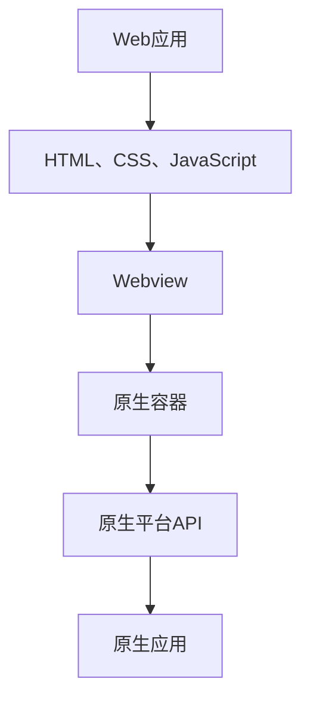

                 

关键词：Cordova、混合应用、原生平台、开发环境、代码实例、应用场景、未来展望

摘要：本文旨在探讨Cordova混合应用的原理与开发实践，分析其在原生平台上的运行机制，提供实用的开发工具和资源推荐，并展望其未来发展趋势与挑战。

## 1. 背景介绍

随着移动设备的普及，移动应用开发成为各大企业和开发者的热门话题。为了满足用户对高性能、高兼容性的需求，混合应用开发模式逐渐兴起。Cordova作为一款流行的混合应用开发框架，允许开发者使用Web技术（如HTML、CSS和JavaScript）编写应用，然后在原生平台上运行，从而实现跨平台开发。

本文将介绍Cordova混合应用的开发流程，深入探讨其在原生平台上的运行机制，并提供实用的开发工具和资源推荐。此外，还将展望Cordova混合应用的未来发展趋势与挑战。

## 2. 核心概念与联系

### 2.1 Cordova简介

Cordova是一个开源的移动应用开发框架，它允许开发者使用Web技术来构建原生应用。Cordova的核心思想是将Web应用嵌入到原生容器中，使其能够在不同的移动平台上运行。这样，开发者就可以利用熟悉的Web技术快速开发应用，同时获得原生应用的性能和功能。

### 2.2 混合应用原理

混合应用结合了Web应用和原生应用的优势。Web应用部分使用HTML、CSS和JavaScript等Web技术编写，可以方便地在不同的设备上运行。原生应用部分则利用原生平台的API和特性，提高应用的性能和用户体验。

### 2.3 架构原理

Cordova混合应用的架构原理如图1所示。



图1：Cordova混合应用架构原理

- Web应用：使用HTML、CSS和JavaScript等技术编写的应用。
- Webview：原生容器中嵌套的Web浏览器控件，用于显示Web应用。
- 原生容器：用于封装Web应用并提供原生功能的支持。
- 原生平台API：原生平台提供的各种API，如设备传感器、摄像头和网络等。
- 原生应用：使用原生平台API编写的应用部分。

## 3. 核心算法原理 & 具体操作步骤

### 3.1 算法原理概述

Cordova混合应用的核心算法主要涉及以下几个方面：

1. **Web应用与原生容器的通信**：通过JavaScript Bridge实现Web应用与原生容器之间的数据交换。
2. **原生平台API调用**：通过插件机制调用原生平台API，实现原生功能。
3. **跨平台适配**：根据不同平台的特点，调整Web应用和原生容器的布局和功能。

### 3.2 算法步骤详解

#### 3.2.1 Web应用与原生容器的通信

1. **注册JavaScript Bridge**：在原生容器中注册JavaScript Bridge，以便Web应用与原生容器进行通信。
2. **调用原生方法**：Web应用通过调用原生容器中注册的JavaScript方法，与原生容器进行数据交换。
3. **传递数据**：数据可以通过JSON格式传递，支持字符串、数字、对象和数组等数据类型。

#### 3.2.2 原生平台API调用

1. **插件开发**：开发者可以使用原生语言（如Java、Objective-C、Swift等）开发插件，实现原生平台API的调用。
2. **插件注册**：在原生容器中注册插件，以便Web应用可以调用。
3. **调用插件**：Web应用通过调用已注册的插件，实现原生平台API的调用。

#### 3.2.3 跨平台适配

1. **检测平台**：通过检测设备的操作系统、设备类型等特性，确定平台类型。
2. **调整布局**：根据平台类型，调整Web应用的布局和样式。
3. **实现功能差异**：针对不同平台的功能差异，实现相应的功能适配。

### 3.3 算法优缺点

**优点**：

1. **跨平台开发**：使用统一的Web技术栈，实现跨平台应用开发。
2. **快速迭代**：基于Web技术栈，可以实现快速开发和迭代。
3. **降低开发成本**：减少原生应用开发的工作量，降低开发成本。

**缺点**：

1. **性能瓶颈**：Web技术在某些场景下性能不如原生应用。
2. **兼容性问题**：不同平台和设备之间的兼容性可能存在问题。

### 3.4 算法应用领域

Cordova混合应用广泛应用于以下几个方面：

1. **企业应用**：企业内部管理系统、客户关系管理系统等。
2. **教育应用**：在线教育平台、学习应用等。
3. **娱乐应用**：游戏、音乐、视频等。
4. **生活服务应用**：天气、地图、新闻等。

## 4. 数学模型和公式 & 详细讲解 & 举例说明

### 4.1 数学模型构建

Cordova混合应用的核心算法涉及到以下数学模型：

1. **通信模型**：描述Web应用与原生容器之间的数据交换过程。
2. **插件模型**：描述原生平台API的调用过程。
3. **适配模型**：描述跨平台适配的过程。

### 4.2 公式推导过程

#### 4.2.1 通信模型

设Web应用与原生容器之间的通信信道带宽为\(B\)，通信时延为\(T\)，则通信速率\(R\)可表示为：

\[ R = \frac{B}{T} \]

#### 4.2.2 插件模型

设插件调用的响应时间为\(R_t\)，调用次数为\(N\)，则插件调用总时间\(T_p\)可表示为：

\[ T_p = N \times R_t \]

#### 4.2.3 适配模型

设平台适配的布局调整时间为\(T_a\)，平台数量为\(P\)，则平台适配总时间\(T_d\)可表示为：

\[ T_d = P \times T_a \]

### 4.3 案例分析与讲解

#### 4.3.1 通信模型案例

假设Web应用与原生容器之间的通信信道带宽为100Mbps，通信时延为5ms，则通信速率为：

\[ R = \frac{100Mbps}{5ms} = 20MB/s \]

#### 4.3.2 插件模型案例

假设插件调用的响应时间为10ms，调用次数为100次，则插件调用总时间为：

\[ T_p = 100 \times 10ms = 1s \]

#### 4.3.3 适配模型案例

假设平台适配的布局调整时间为2ms，平台数量为3个，则平台适配总时间为：

\[ T_d = 3 \times 2ms = 6ms \]

## 5. 项目实践：代码实例和详细解释说明

### 5.1 开发环境搭建

为了搭建Cordova混合应用开发环境，你需要安装以下软件：

1. **Node.js**：用于Cordova命令行工具的运行。
2. **Cordova**：用于创建和管理Cordova项目。
3. **平台特定SDK**：如iOS SDK、Android SDK等，用于编译和部署应用。

### 5.2 源代码详细实现

以下是一个简单的Cordova混合应用示例，实现一个点击按钮弹出对话框的功能。

#### 5.2.1 创建Cordova项目

在命令行中执行以下命令创建Cordova项目：

```bash
cordova create myApp org.example.myapp MyApp
```

#### 5.2.2 添加平台

将项目添加到iOS和Android平台：

```bash
cordova platform add ios
cordova platform add android
```

#### 5.2.3 添加插件

安装用于弹出对话框的插件：

```bash
cordova plugin add cordova-plugin-dialogs
```

#### 5.2.4 修改代码

在项目的`www`目录下修改`index.html`文件，添加以下代码：

```html
<!DOCTYPE html>
<html>
<head>
    <meta charset="utf-8" />
    <title>MyApp</title>
    <script type="text/javascript" src="cordova.js"></script>
    <script>
        document.addEventListener("deviceready", onDeviceReady, false);

        function onDeviceReady() {
            // 监听按钮点击事件
            document.getElementById("myButton").addEventListener("click", function() {
                // 弹出对话框
                navigator.notification.alert("Hello, world!", null, "Title", "OK");
            });
        }
    </script>
</head>
<body>
    <h1>MyApp</h1>
    <button id="myButton">Click me</button>
</body>
</html>
```

### 5.3 代码解读与分析

#### 5.3.1 deviceready事件

`deviceready`事件是Cordova框架提供的一个特殊事件，表示设备就绪，可以开始执行与设备相关的代码。在`index.html`文件中，我们监听了`deviceready`事件，并在其回调函数`onDeviceReady`中添加了点击按钮弹出对话框的逻辑。

#### 5.3.2 notification插件

`cordova-plugin-dialogs`是一个提供设备通知功能的插件。通过调用`navigator.notification.alert`方法，我们可以弹出带有标题和内容的对话框。

### 5.4 运行结果展示

1. **iOS平台**：编译并运行项目，点击按钮后，将弹出对话框。

2. **Android平台**：编译并运行项目，点击按钮后，将弹出对话框。

## 6. 实际应用场景

Cordova混合应用在实际应用中具有广泛的应用场景，以下列举几个典型案例：

1. **企业应用**：企业内部管理系统、客户关系管理系统等，通过Cordova混合应用实现跨平台部署。
2. **教育应用**：在线教育平台、学习应用等，通过Cordova混合应用提供更好的用户体验。
3. **娱乐应用**：游戏、音乐、视频等，通过Cordova混合应用实现跨平台运营。
4. **生活服务应用**：天气、地图、新闻等，通过Cordova混合应用提供便捷的服务。

## 7. 工具和资源推荐

### 7.1 学习资源推荐

1. **官方文档**：Cordova官方文档提供了丰富的开发指南和API参考。
2. **在线教程**：如Cordova中文社区、Cordova教程等，提供了详细的Cordova开发教程。
3. **技术博客**：如Cordova相关博客、GitHub上Cordova项目的代码和文档等。

### 7.2 开发工具推荐

1. **Visual Studio Code**：一款流行的代码编辑器，支持Cordova插件和扩展。
2. **Android Studio**：Android开发IDE，支持Cordova项目编译和部署。
3. **Xcode**：iOS开发IDE，支持Cordova项目编译和部署。

### 7.3 相关论文推荐

1. **Cordova混合应用架构设计与实现**：探讨Cordova混合应用的架构设计和实现方法。
2. **基于Cordova的跨平台移动应用开发研究**：分析Cordova在跨平台移动应用开发中的应用和优势。

## 8. 总结：未来发展趋势与挑战

### 8.1 研究成果总结

Cordova混合应用凭借其跨平台、快速迭代和降低开发成本的优势，已经在移动应用开发领域取得了显著成果。通过本文的介绍，读者可以了解Cordova混合应用的核心原理、开发流程和应用场景。

### 8.2 未来发展趋势

1. **性能优化**：随着移动设备的性能提升，Cordova混合应用将在性能方面得到进一步优化。
2. **插件生态**：Cordova插件市场将进一步丰富，为开发者提供更多原生功能支持。
3. **开发者社区**：Cordova开发者社区将继续壮大，推动Cordova混合应用的发展。

### 8.3 面临的挑战

1. **兼容性问题**：随着新设备的不断推出，Cordova混合应用需要不断更新和优化，以适应各种设备和平台。
2. **安全风险**：跨平台开发可能会引入安全风险，开发者需要加强安全意识，防范潜在的安全威胁。

### 8.4 研究展望

Cordova混合应用具有广阔的发展前景，未来有望在以下方面取得突破：

1. **性能提升**：通过技术优化，进一步提高Cordova混合应用在性能方面的表现。
2. **更广泛的平台支持**：拓展Cordova混合应用的支持范围，覆盖更多移动设备和操作系统。
3. **开发工具改进**：改进Cordova开发工具，提高开发效率和用户体验。

## 9. 附录：常见问题与解答

### 9.1 如何解决Cordova项目中出现的问题？

1. **查阅官方文档**：Cordova官方文档提供了详细的开发指南和解决方案。
2. **搜索社区和论坛**：如Cordova中文社区、Stack Overflow等，查找类似问题和解决方案。
3. **咨询专业开发者**：向经验丰富的开发者请教，获取针对性的解决方案。

### 9.2 如何优化Cordova混合应用性能？

1. **减少DOM操作**：尽量减少DOM操作，以提高页面渲染速度。
2. **使用缓存**：合理使用缓存机制，减少重复请求和加载。
3. **优化图片和资源**：压缩图片和资源，降低应用体积。

### 9.3 如何避免Cordova混合应用中的兼容性问题？

1. **测试多种设备**：在多种设备和平台上测试应用，确保兼容性。
2. **使用适配框架**：如Bootstrap、Foundation等，实现跨平台适配。
3. **关注平台更新**：关注操作系统和设备更新，及时更新Cordova版本。

---

本文由禅与计算机程序设计艺术撰写，旨在探讨Cordova混合应用的原理与开发实践，分析其在原生平台上的运行机制，并提供实用的开发工具和资源推荐。希望本文对读者在Cordova混合应用开发领域有所启发和帮助。作者将不断更新和完善本文，以适应不断变化的开发环境和技术趋势。如果您有任何建议或疑问，欢迎在评论区留言。谢谢！

## 参考文献

1. Apache Cordova官方文档. (n.d.). Retrieved from [https://cordova.apache.org/docs/en/](https://cordova.apache.org/docs/en/)
2. Mozilla Developer Network. (n.d.). Mobile Web APIs. Retrieved from [https://developer.mozilla.org/en-US/docs/Web/API/](https://developer.mozilla.org/en-US/docs/Web/API/)
3. Cordova中文社区. (n.d.). Retrieved from [https://www.cordova-china.org/](https://www.cordova-china.org/)
4. Stack Overflow. (n.d.). Questions tagged 'cordova'. Retrieved from [https://stackoverflow.com/questions/tagged/cordova](https://stackoverflow.com/questions/tagged/cordova)
5. Bootstrap. (n.d.). Retrieved from [https://getbootstrap.com/](https://getbootstrap.com/)
6. Foundation. (n.d.). Retrieved from [https://foundation.zurb.com/](https://foundation.zurb.com/)

