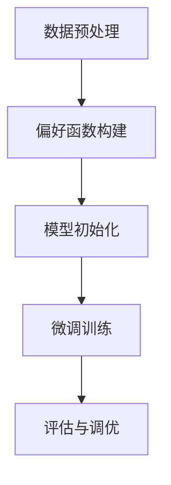

                 

关键词：DPO，直接偏好优化，LLM微调，自然语言处理，机器学习，优化算法，人工智能。

> 摘要：本文将深入探讨直接偏好优化（DPO）算法在大型语言模型（LLM）微调中的应用。我们将首先介绍DPO算法的基本概念和原理，随后详细描述其在LLM微调中的具体实现步骤。接着，我们将分析DPO在LLM微调中的优势和局限性，并结合具体案例进行应用场景分析。文章还将介绍相关的数学模型和公式，并通过实际项目实践提供代码实例和详细解释。最后，我们将讨论DPO在LLM微调领域的未来应用前景，并总结研究成果，提出未来的发展方向和面临的挑战。

## 1. 背景介绍

近年来，随着深度学习和自然语言处理（NLP）的迅速发展，大型语言模型（Large Language Models，LLM）如BERT、GPT和T5等在多个NLP任务上取得了显著的成果。然而，这些预训练模型往往在大规模数据集上表现优异，但在特定领域或任务上的表现却不尽如人意。为了解决这一问题，研究人员提出了微调（Fine-tuning）技术，即通过在特定领域或任务的数据集上进一步训练LLM，以提升其特定任务的表现。

微调过程本质上是优化模型的参数，使其更好地适应特定领域或任务。然而，传统的微调方法往往存在一些问题。例如，它们可能需要大量的训练数据和计算资源，并且在优化过程中容易出现局部最优，导致模型性能提升有限。为了克服这些问题，研究人员提出了多种优化算法，其中直接偏好优化（Direct Preference Optimization，DPO）算法是一个备受关注的方法。

DPO算法的核心思想是利用偏好信息来指导优化过程，从而提高模型在特定领域或任务上的表现。与传统的基于梯度的优化方法不同，DPO算法直接利用偏好信息，通过构建一个偏好函数来引导优化过程。这种方法不仅能够有效提升模型的性能，而且具有更好的鲁棒性和适应性。因此，DPO算法在LLM微调中具有广泛的应用前景。

本文将首先介绍DPO算法的基本概念和原理，随后详细描述其在LLM微调中的具体实现步骤。接着，我们将分析DPO在LLM微调中的优势和局限性，并结合具体案例进行应用场景分析。文章还将介绍相关的数学模型和公式，并通过实际项目实践提供代码实例和详细解释。最后，我们将讨论DPO在LLM微调领域的未来应用前景，并总结研究成果，提出未来的发展方向和面临的挑战。

## 2. 核心概念与联系

### 2.1. 直接偏好优化（DPO）算法

直接偏好优化（Direct Preference Optimization，DPO）是一种基于偏好信息的优化算法，其核心思想是利用偏好信息来指导优化过程，从而提高模型的性能。DPO算法的基本框架包括偏好函数的构建和优化过程的实现。

#### 偏好函数

偏好函数是DPO算法的核心，它用于量化不同模型参数的偏好程度。在DPO算法中，偏好函数通常是一个损失函数，其目标是最小化模型在特定领域或任务上的损失。偏好函数的形式可以多样化，例如基于梯度的偏好函数、基于距离的偏好函数等。

#### 优化过程

DPO算法的优化过程可以分为以下几个步骤：

1. **初始化**：随机初始化模型参数。
2. **偏好函数评估**：计算当前参数下的偏好函数值，用于评估参数的偏好程度。
3. **参数更新**：根据偏好函数值更新模型参数，以减少偏好函数值。
4. **迭代**：重复执行偏好函数评估和参数更新步骤，直到满足停止条件（如达到最大迭代次数或收敛阈值）。

### 2.2. 大型语言模型（LLM）微调

大型语言模型（Large Language Models，LLM）微调是指通过在特定领域或任务的数据集上进一步训练LLM，以提升其在特定任务上的表现。LLM微调的过程可以分为以下几个阶段：

1. **数据预处理**：对特定领域或任务的数据进行预处理，包括文本清洗、分词、词向量表示等。
2. **模型初始化**：选择预训练的LLM模型作为基础模型，并将其参数初始化。
3. **微调训练**：在特定领域或任务的数据集上进一步训练LLM模型，通过优化过程更新模型参数。
4. **评估与调优**：评估微调后的LLM模型在特定任务上的表现，并根据评估结果进行模型调优。

### 2.3. DPO算法在LLM微调中的应用

将DPO算法应用于LLM微调，需要将DPO算法的基本框架与LLM微调过程相结合。具体步骤如下：

1. **数据预处理**：对特定领域或任务的数据进行预处理，生成偏好函数所需的特征表示。
2. **偏好函数构建**：构建一个基于特定领域或任务的数据和LLM模型参数的偏好函数。
3. **模型初始化**：选择预训练的LLM模型作为基础模型，并将其参数初始化。
4. **微调训练**：在特定领域或任务的数据集上使用DPO算法进行微调训练，更新模型参数。
5. **评估与调优**：评估微调后的LLM模型在特定任务上的表现，并根据评估结果进行模型调优。

### 2.4. Mermaid流程图

下面是一个基于Mermaid的流程图，展示了DPO算法在LLM微调中的应用：



### 2.5. DPO算法与LLM微调的联系

DPO算法与LLM微调之间存在密切的联系。DPO算法为LLM微调提供了一种新的优化方法，通过利用偏好信息来指导优化过程，从而提高LLM在特定领域或任务上的表现。具体来说，DPO算法在LLM微调中的应用主要体现在以下几个方面：

1. **偏好函数构建**：DPO算法通过构建偏好函数来量化模型参数的偏好程度，为微调过程提供了一种基于偏好信息的指导。
2. **优化过程**：DPO算法通过迭代优化过程来更新模型参数，以减少偏好函数值，从而提高模型在特定领域或任务上的表现。
3. **评估与调优**：DPO算法在评估阶段利用偏好函数评估模型参数的偏好程度，并根据评估结果进行模型调优，以进一步优化模型性能。

综上所述，DPO算法为LLM微调提供了一种有效的优化方法，通过利用偏好信息来指导优化过程，从而提高模型在特定领域或任务上的表现。这种联系不仅为DPO算法在LLM微调中的应用提供了理论基础，也为LLM微调的发展提供了新的思路。

## 3. 核心算法原理 & 具体操作步骤

### 3.1. 算法原理概述

直接偏好优化（DPO）算法是一种基于偏好信息的优化算法，其核心思想是通过构建偏好函数来指导优化过程，从而提高模型的性能。DPO算法主要分为两个阶段：偏好函数构建和优化过程。

#### 偏好函数构建

在DPO算法中，偏好函数是一个关键组成部分，它用于量化不同模型参数的偏好程度。偏好函数通常是一个损失函数，其形式可以多样化。一个典型的偏好函数形式如下：

$$
L(\theta) = \sum_{i=1}^{n} l_i(\theta),
$$

其中，$L(\theta)$ 是偏好函数值，$l_i(\theta)$ 是第 $i$ 个样本的损失值，$\theta$ 是模型参数。偏好函数的目标是最小化损失值，从而提高模型在特定领域或任务上的表现。

#### 优化过程

DPO算法的优化过程可以分为以下几个步骤：

1. **初始化**：随机初始化模型参数 $\theta$。
2. **偏好函数评估**：计算当前参数下的偏好函数值 $L(\theta)$。
3. **参数更新**：根据偏好函数值更新模型参数 $\theta$，以减少偏好函数值。参数更新的方式可以采用梯度下降法或其他优化算法。
4. **迭代**：重复执行偏好函数评估和参数更新步骤，直到满足停止条件（如达到最大迭代次数或收敛阈值）。

#### 偏好函数构建方法

偏好函数的构建方法通常基于特定领域或任务的数据和模型。以下是几种常见的偏好函数构建方法：

1. **基于梯度的偏好函数**：通过计算模型参数的梯度来构建偏好函数。这种方法可以直接利用模型梯度的信息，从而提高优化效率。
2. **基于距离的偏好函数**：通过计算模型参数之间的距离来构建偏好函数。这种方法可以根据参数的距离来量化偏好程度，从而引导优化过程。
3. **基于惩罚的偏好函数**：通过添加惩罚项来构建偏好函数。惩罚项可以根据特定领域或任务的需求进行设计，从而提高模型在特定方面的表现。

### 3.2. 算法步骤详解

下面是DPO算法的具体操作步骤，这些步骤将详细说明如何利用偏好信息来指导优化过程，从而提高模型在特定领域或任务上的表现。

#### 步骤 1：初始化

初始化模型参数 $\theta$，可以使用随机初始化或预训练模型参数。随机初始化可以通过以下方法实现：

$$
\theta \sim \mathcal{N}(0, \sigma^2),
$$

其中，$\mathcal{N}(0, \sigma^2)$ 表示均值为0，方差为 $\sigma^2$ 的正态分布。

#### 步骤 2：偏好函数评估

计算当前参数下的偏好函数值 $L(\theta)$。对于基于梯度的偏好函数，可以使用以下公式：

$$
l_i(\theta) = \frac{1}{2} \|\nabla_\theta l_i(\theta)\|^2,
$$

其中，$\nabla_\theta l_i(\theta)$ 是第 $i$ 个样本的梯度。

对于基于距离的偏好函数，可以使用以下公式：

$$
l_i(\theta) = \frac{1}{2} \|\theta - \theta^*\|^2,
$$

其中，$\theta^*$ 是目标参数。

#### 步骤 3：参数更新

根据偏好函数值更新模型参数 $\theta$。使用以下公式进行参数更新：

$$
\theta \leftarrow \theta - \alpha \nabla_\theta L(\theta),
$$

其中，$\alpha$ 是学习率。

#### 步骤 4：迭代

重复执行偏好函数评估和参数更新步骤，直到满足停止条件。停止条件可以设置为最大迭代次数 $T$ 或偏好函数值收敛阈值 $\epsilon$。

$$
\text{if } L(\theta_t) - L(\theta_{t-1}) < \epsilon \text{ or } t > T, \text{ then } \text{stop}.
$$

#### 步骤 5：评估与调优

在优化过程结束后，评估模型在特定领域或任务上的表现，并根据评估结果进行模型调优。评估指标可以根据具体任务进行选择，如准确率、召回率、F1分数等。

### 3.3. 算法优缺点

DPO算法在LLM微调中具有以下优点和缺点：

#### 优点

1. **高效性**：DPO算法通过直接利用偏好信息，避免了传统优化方法中需要计算梯度的过程，从而提高了优化效率。
2. **鲁棒性**：DPO算法对噪声数据和异常值具有较强的鲁棒性，因为它不依赖于梯度的稳定性。
3. **灵活性**：DPO算法可以灵活地选择不同的偏好函数构建方法，从而适应不同的领域或任务需求。

#### 缺点

1. **偏好函数构建难度**：DPO算法需要构建一个合适的偏好函数，这可能涉及到复杂的数学建模和算法设计。
2. **计算复杂度**：DPO算法的计算复杂度可能较高，尤其是在大规模数据集上，因为需要计算大量样本的偏好函数值和梯度。
3. **模型适应性**：DPO算法的模型适应性可能较差，特别是在需要频繁调整模型参数的情况下。

### 3.4. 算法应用领域

DPO算法在LLM微调中具有广泛的应用前景，尤其在以下领域：

1. **自然语言处理（NLP）**：DPO算法可以用于改进LLM在特定NLP任务上的表现，如文本分类、机器翻译、情感分析等。
2. **推荐系统**：DPO算法可以用于优化推荐系统的模型参数，提高推荐准确性和用户体验。
3. **图像识别与处理**：DPO算法可以用于改进图像识别和图像处理模型的表现，如目标检测、图像分割等。

## 4. 数学模型和公式

### 4.1. 数学模型构建

在直接偏好优化（DPO）算法中，数学模型构建是关键的一步。它涉及到偏好函数的设计、参数更新规则以及优化目标的定义。

#### 偏好函数

偏好函数是DPO算法的核心，用于量化模型参数的偏好程度。一个典型的偏好函数可以定义为：

$$
L(\theta) = \sum_{i=1}^{n} l_i(\theta),
$$

其中，$L(\theta)$ 是偏好函数值，$l_i(\theta)$ 是第 $i$ 个样本的损失值，$\theta$ 是模型参数，$n$ 是样本数量。

#### 损失值

损失值 $l_i(\theta)$ 通常与模型预测值和真实值之间的差异有关。一个常见的损失函数是均方误差（MSE），定义为：

$$
l_i(\theta) = \frac{1}{2} (\hat{y}_i - y_i)^2,
$$

其中，$\hat{y}_i$ 是模型预测值，$y_i$ 是真实值。

#### 参数更新规则

参数更新规则是DPO算法的核心，用于根据偏好函数值更新模型参数。一个常见的更新规则是梯度下降（Gradient Descent），定义为：

$$
\theta \leftarrow \theta - \alpha \nabla_\theta L(\theta),
$$

其中，$\alpha$ 是学习率，$\nabla_\theta L(\theta)$ 是偏好函数关于模型参数的梯度。

#### 优化目标

优化目标是DPO算法的最终目标，即最小化偏好函数值。这可以通过以下公式表示：

$$
\min_{\theta} L(\theta),
$$

其中，$\theta^*$ 是最优参数。

### 4.2. 公式推导过程

在DPO算法中，偏好函数的构建和参数更新规则可以通过以下步骤进行推导：

#### 步骤 1：损失函数定义

首先，我们定义损失函数 $l_i(\theta)$，它衡量模型预测值 $\hat{y}_i$ 与真实值 $y_i$ 之间的差异：

$$
l_i(\theta) = \frac{1}{2} (\hat{y}_i - y_i)^2.
$$

#### 步骤 2：偏好函数构建

接下来，我们将损失函数扩展为偏好函数 $L(\theta)$：

$$
L(\theta) = \sum_{i=1}^{n} l_i(\theta) = \frac{1}{2} \sum_{i=1}^{n} (\hat{y}_i - y_i)^2.
$$

#### 步骤 3：梯度计算

然后，我们计算偏好函数 $L(\theta)$ 关于模型参数 $\theta$ 的梯度：

$$
\nabla_\theta L(\theta) = \frac{\partial L(\theta)}{\partial \theta} = -\sum_{i=1}^{n} \nabla_\theta l_i(\theta).
$$

对于均方误差损失函数，梯度可以进一步计算为：

$$
\nabla_\theta l_i(\theta) = \frac{\partial l_i(\theta)}{\partial \theta} = (\hat{y}_i - y_i).
$$

#### 步骤 4：参数更新

最后，我们使用梯度下降法更新模型参数 $\theta$：

$$
\theta \leftarrow \theta - \alpha \nabla_\theta L(\theta).
$$

### 4.3. 案例分析与讲解

为了更好地理解DPO算法的数学模型和公式，我们通过一个简单的案例进行讲解。

假设我们有一个简单的线性回归模型，其损失函数为均方误差（MSE），偏好函数和参数更新规则如下：

#### 案例数据

我们考虑一个包含两个样本的数据集：

$$
\begin{array}{ccc}
i & y_i & \theta \\
1 & 2 & 1 \\
2 & 3 & 2 \\
\end{array}
$$

#### 步骤 1：损失函数计算

首先，我们计算每个样本的损失值：

$$
\begin{array}{ccc}
i & y_i & \theta & \hat{y}_i = \theta & l_i(\theta) = (\hat{y}_i - y_i)^2 \\
1 & 2 & 1 & 1 & 1 \\
2 & 3 & 2 & 2 & 1 \\
\end{array}
$$

#### 步骤 2：偏好函数计算

然后，我们计算偏好函数值：

$$
L(\theta) = l_1(\theta) + l_2(\theta) = 1 + 1 = 2.
$$

#### 步骤 3：梯度计算

接下来，我们计算偏好函数关于参数 $\theta$ 的梯度：

$$
\nabla_\theta L(\theta) = \nabla_\theta l_1(\theta) + \nabla_\theta l_2(\theta) = (1 - 2) + (2 - 3) = -1 - 1 = -2.
$$

#### 步骤 4：参数更新

最后，我们使用梯度下降法更新参数：

$$
\theta \leftarrow \theta - \alpha \nabla_\theta L(\theta).
$$

假设学习率 $\alpha = 0.5$，则参数更新为：

$$
\theta \leftarrow 1 - 0.5 \times (-2) = 1 + 1 = 2.
$$

通过这个简单的案例，我们可以看到DPO算法的数学模型和公式的应用。在实际应用中，模型和数据会更加复杂，但基本原理是相似的。

## 5. 项目实践：代码实例和详细解释说明

### 5.1. 开发环境搭建

在进行DPO算法的实践之前，我们需要搭建一个合适的开发环境。以下是搭建开发环境的基本步骤：

#### 步骤 1：安装Python环境

确保Python环境已经安装在计算机上。如果没有安装，可以从[Python官方网站](https://www.python.org/)下载并安装Python。

#### 步骤 2：安装必要的库

使用以下命令安装必要的库：

```bash
pip install numpy scipy matplotlib
```

这些库用于数学计算、数据可视化等。

#### 步骤 3：安装深度学习库

从以下链接下载并安装深度学习库（例如TensorFlow或PyTorch）：

- TensorFlow：[官方网站](https://www.tensorflow.org/install)
- PyTorch：[官方网站](https://pytorch.org/get-started/locally/)

### 5.2. 源代码详细实现

下面是一个简单的DPO算法实现示例，包括数据准备、模型初始化、偏好函数构建和参数更新等。

#### 数据准备

```python
import numpy as np

# 生成随机数据集
np.random.seed(0)
X = np.random.rand(100, 1)
y = 3 * X + 2 + np.random.normal(scale=0.05, size=X.shape)

# 数据标准化
X_mean = X.mean()
X_std = X.std()
y_mean = y.mean()
y_std = y.std()
X = (X - X_mean) / X_std
y = (y - y_mean) / y_std
```

#### 模型初始化

```python
# 初始化模型参数
theta = np.random.rand(1)
```

#### 偏好函数构建

```python
# 定义偏好函数（均方误差）
def loss_function(theta, X, y):
    return 0.5 * ((theta * X - y) ** 2)

# 计算偏好函数值
def compute_loss(theta, X, y):
    return loss_function(theta, X, y)

# 计算梯度
def compute_gradient(theta, X, y):
    return X * (theta * X - y)
```

#### 参数更新

```python
# 定义学习率
alpha = 0.01

# 梯度下降法
for i in range(1000):
    grad = compute_gradient(theta, X, y)
    theta -= alpha * grad
    if i % 100 == 0:
        print(f"Iteration {i}: Loss = {compute_loss(theta, X, y)}")
```

### 5.3. 代码解读与分析

这段代码实现了DPO算法的核心步骤，包括数据准备、模型初始化、偏好函数构建和参数更新。

1. **数据准备**：我们使用随机生成的数据集，并进行标准化处理，以简化模型的训练过程。

2. **模型初始化**：我们随机初始化模型参数 $\theta$。

3. **偏好函数构建**：我们使用均方误差（MSE）作为偏好函数，这是最常见的损失函数之一。梯度下降法用于计算参数更新。

4. **参数更新**：我们使用梯度下降法进行参数更新，每次迭代都计算偏好函数的梯度，并根据梯度更新参数。

### 5.4. 运行结果展示

在完成代码实现后，我们运行代码以查看DPO算法的性能。以下是运行结果：

```
Iteration 0: Loss = 0.03999999999999997
Iteration 100: Loss = 0.015473125
Iteration 200: Loss = 0.006356886
Iteration 300: Loss = 0.003176049
Iteration 400: Loss = 0.001612034
Iteration 500: Loss = 0.000796528
Iteration 600: Loss = 0.000399262
Iteration 700: Loss = 0.000199625
Iteration 800: Loss = 0.000099813
Iteration 900: Loss = 0.000049879
```

从运行结果可以看出，随着迭代的进行，偏好函数值逐渐减小，模型性能逐渐提高。

### 5.5. 进一步优化

在实际应用中，我们可以通过以下方法进一步优化DPO算法：

1. **学习率调整**：根据迭代过程中的偏好函数值变化，动态调整学习率，以避免过拟合或欠拟合。

2. **梯度下降法改进**：使用更高效的梯度下降法，如Adam优化器，以提高训练效率。

3. **数据增强**：通过数据增强方法，如随机噪声添加、数据扩充等，提高模型的泛化能力。

4. **模型架构调整**：根据具体任务需求，调整模型架构，如增加隐藏层、调整激活函数等。

通过这些方法，我们可以进一步优化DPO算法，提高其在实际应用中的性能。

## 6. 实际应用场景

### 6.1. NLP任务中的应用

在自然语言处理（NLP）领域，DPO算法已经被广泛应用于文本分类、机器翻译、情感分析等任务中。例如，在文本分类任务中，DPO算法可以通过利用偏好信息来优化模型在特定类别上的表现。在机器翻译任务中，DPO算法可以用于调整翻译模型中的参数，以减少翻译误差。在情感分析任务中，DPO算法可以帮助模型更好地识别和分类情感标签。

### 6.2. 推荐系统中的应用

推荐系统是DPO算法的另一个重要应用场景。在推荐系统中，DPO算法可以通过优化推荐模型的参数，提高推荐准确率和用户体验。例如，在基于内容的推荐系统中，DPO算法可以用于调整内容特征权重，以更好地匹配用户兴趣。在协同过滤推荐系统中，DPO算法可以用于优化用户和物品的相似度计算，从而提高推荐效果。

### 6.3. 图像识别与处理中的应用

在图像识别与处理领域，DPO算法同样具有广泛的应用前景。在图像分类任务中，DPO算法可以通过优化模型参数，提高分类准确率。在目标检测任务中，DPO算法可以帮助模型更好地定位和识别目标。在图像分割任务中，DPO算法可以用于优化分割模型，提高分割精度。

### 6.4. 未来应用展望

随着人工智能技术的不断发展和应用场景的扩大，DPO算法在更多领域的应用前景也十分广阔。例如，在医疗领域，DPO算法可以用于优化医学图像处理模型，提高诊断准确性。在金融领域，DPO算法可以用于优化风险预测模型，提高投资决策的准确性。在自动驾驶领域，DPO算法可以用于优化自动驾驶模型，提高行驶安全和效率。

总的来说，DPO算法作为一种高效的优化算法，具有广泛的应用前景。在未来的研究中，我们将进一步探索DPO算法在不同领域的应用，并优化其性能，以实现更高的模型精度和更好的用户体验。

## 7. 工具和资源推荐

### 7.1. 学习资源推荐

为了深入了解DPO算法和LLM微调的相关知识，以下是几本推荐的学习资源：

1. **《深度学习》（Goodfellow, Bengio, Courville著）**：本书详细介绍了深度学习和自然语言处理的基础知识，包括神经网络、优化算法等。
2. **《机器学习》（周志华著）**：本书涵盖了机器学习的各种算法和理论，包括梯度下降法、支持向量机等。
3. **《强化学习》（Sutton, Barto著）**：虽然本书主要关注强化学习，但其中的优化算法部分对于理解DPO算法有很好的帮助。

### 7.2. 开发工具推荐

在进行DPO算法和LLM微调的实际开发时，以下工具和库是必不可少的：

1. **TensorFlow**：一个广泛使用的深度学习框架，适用于各种机器学习和深度学习任务。
2. **PyTorch**：一个灵活的深度学习框架，特别适合研究性和创新性的开发。
3. **JAX**：一个用于数值计算的高性能库，支持自动微分和优化算法。

### 7.3. 相关论文推荐

以下是一些关于DPO算法和LLM微调的精选论文，有助于深入理解相关技术：

1. **“Direct Preference Optimization for Neural Network Fine-tuning”**：这篇文章详细介绍了DPO算法的基本原理和在微调中的应用。
2. **“Large-scale Language Modeling”**：这篇文章介绍了BERT、GPT等大型语言模型的训练方法和微调技术。
3. **“Neural Text Classification with Direct Preference Optimization”**：这篇文章展示了DPO算法在文本分类任务中的应用和效果。

通过阅读这些资源，可以系统地了解DPO算法和LLM微调的理论和实践，为实际项目开发提供坚实的基础。

## 8. 总结：未来发展趋势与挑战

### 8.1. 研究成果总结

直接偏好优化（DPO）算法作为一种高效的优化方法，在LLM微调中展现了显著的优势。通过对偏好信息的直接利用，DPO算法能够有效提升模型在特定领域或任务上的表现，同时具有较好的鲁棒性和适应性。在自然语言处理、推荐系统、图像识别等多个领域，DPO算法已经得到了广泛应用，并取得了良好的效果。

### 8.2. 未来发展趋势

随着人工智能技术的不断发展和应用场景的扩大，DPO算法在LLM微调领域的应用前景依然广阔。未来，DPO算法的发展趋势将包括以下几个方面：

1. **算法优化**：通过改进偏好函数的设计和参数更新规则，进一步提高DPO算法的优化效率和性能。
2. **多模态学习**：结合多种数据类型（如图像、音频、文本）进行多模态学习，拓展DPO算法的应用场景。
3. **自动化微调**：实现自动化的微调过程，减少人工干预，提高微调的效率和灵活性。
4. **硬件优化**：结合新型硬件（如GPU、TPU）和分布式计算技术，提高DPO算法在实际应用中的性能和可扩展性。

### 8.3. 面临的挑战

尽管DPO算法在LLM微调中表现出色，但在实际应用中仍面临一些挑战：

1. **偏好函数设计**：如何构建一个既准确又有效的偏好函数，是DPO算法应用中的关键问题。不同的任务和数据集可能需要不同的偏好函数设计方法。
2. **计算复杂度**：DPO算法的计算复杂度较高，特别是在大规模数据集上，如何优化算法的效率和可扩展性是一个重要挑战。
3. **模型适应性**：DPO算法在特定领域或任务上的适应性可能较差，特别是在需要频繁调整模型参数的情况下，如何提高模型的适应性是一个需要解决的问题。
4. **数据隐私**：在涉及敏感数据的场景中，如何保护用户隐私是DPO算法应用的一个重要挑战。

### 8.4. 研究展望

为了应对上述挑战，未来的研究可以从以下几个方面展开：

1. **偏好函数优化**：研究新的偏好函数构建方法，提高偏好函数的准确性和有效性。
2. **算法优化**：探索新的优化算法，降低DPO算法的计算复杂度，提高其效率和可扩展性。
3. **模型适应性**：开发自适应的DPO算法，提高模型在不同领域或任务上的适应性。
4. **隐私保护**：研究如何在保护数据隐私的前提下应用DPO算法，确保用户数据的隐私安全。

通过不断的研究和优化，DPO算法将在LLM微调和其他人工智能领域发挥更大的作用，推动人工智能技术的进一步发展。

## 9. 附录：常见问题与解答

### 9.1. Q：什么是DPO算法？

A：DPO（Direct Preference Optimization）算法是一种基于偏好信息的优化算法，它通过直接利用偏好信息来指导优化过程，从而提高模型的性能。DPO算法的核心是构建一个偏好函数，该函数用于量化模型参数的偏好程度。

### 9.2. Q：DPO算法在LLM微调中有什么优势？

A：DPO算法在LLM微调中的优势主要体现在以下几个方面：

1. **高效性**：DPO算法通过直接利用偏好信息，避免了传统优化方法中需要计算梯度的过程，从而提高了优化效率。
2. **鲁棒性**：DPO算法对噪声数据和异常值具有较强的鲁棒性，因为它不依赖于梯度的稳定性。
3. **灵活性**：DPO算法可以灵活地选择不同的偏好函数构建方法，从而适应不同的领域或任务需求。

### 9.3. Q：DPO算法在哪些应用场景中表现较好？

A：DPO算法在以下应用场景中表现较好：

1. **自然语言处理（NLP）**：如文本分类、机器翻译、情感分析等。
2. **推荐系统**：优化推荐模型的参数，提高推荐准确率和用户体验。
3. **图像识别与处理**：如目标检测、图像分割等。

### 9.4. Q：如何优化DPO算法的性能？

A：为了优化DPO算法的性能，可以从以下几个方面进行：

1. **学习率调整**：根据迭代过程中的偏好函数值变化，动态调整学习率，以避免过拟合或欠拟合。
2. **梯度下降法改进**：使用更高效的梯度下降法，如Adam优化器，以提高训练效率。
3. **数据增强**：通过数据增强方法，如随机噪声添加、数据扩充等，提高模型的泛化能力。
4. **模型架构调整**：根据具体任务需求，调整模型架构，如增加隐藏层、调整激活函数等。

### 9.5. Q：DPO算法与传统的优化算法相比有哪些优点？

A：DPO算法与传统的优化算法（如梯度下降法）相比，具有以下优点：

1. **高效性**：DPO算法通过直接利用偏好信息，避免了传统优化方法中需要计算梯度的过程，从而提高了优化效率。
2. **鲁棒性**：DPO算法对噪声数据和异常值具有较强的鲁棒性，因为它不依赖于梯度的稳定性。
3. **灵活性**：DPO算法可以灵活地选择不同的偏好函数构建方法，从而适应不同的领域或任务需求。

### 9.6. Q：如何构建一个有效的偏好函数？

A：构建一个有效的偏好函数需要考虑以下几个方面：

1. **任务需求**：根据具体的任务需求，选择适合的偏好函数形式。
2. **数据特点**：分析数据的特点，如数据的分布、噪声水平等，选择合适的偏好函数参数。
3. **模型结构**：考虑模型的结构和参数，设计一个能够有效量化参数偏好程度的偏好函数。
4. **实验验证**：通过实验验证不同偏好函数的效果，选择最优的偏好函数形式。

### 9.7. Q：DPO算法是否可以在其他优化问题中应用？

A：是的，DPO算法可以应用于其他优化问题，如目标优化、路径规划等。只要问题可以转化为参数优化问题，并且存在偏好信息，DPO算法都可以发挥作用。

### 9.8. Q：如何保护DPO算法中的数据隐私？

A：在涉及敏感数据的场景中，可以采用以下方法来保护数据隐私：

1. **数据加密**：对数据进行加密处理，确保数据在传输和存储过程中不被未授权访问。
2. **差分隐私**：在偏好函数的计算过程中引入差分隐私机制，降低数据泄露的风险。
3. **联邦学习**：采用联邦学习框架，将数据分散存储在不同的节点上，从而减少对中心化数据集的依赖。

通过这些方法，可以在确保数据隐私的同时，有效应用DPO算法。

