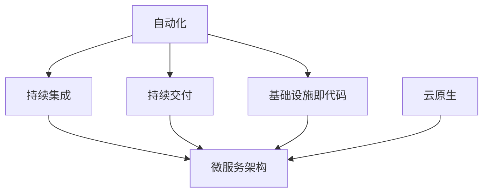

                 

在当今快速发展的信息技术领域，DevOps已经成为了一种不可忽视的软件开发和运营模式。它不仅改变了传统的软件开发流程，还极大地提升了软件交付的速度和质量。本文将深入探讨DevOps的理念、核心工具及其在软件开发和运维中的生态作用。

## 关键词

- DevOps
- 自动化
- 工具链
- 持续集成
- 持续交付
- 微服务
- 云原生
- 监控与日志

## 摘要

本文首先介绍了DevOps的起源和核心概念，随后详细讨论了DevOps工具链的组成及其在软件开发和运维中的作用。通过实际案例和代码实例，我们展示了如何利用DevOps实现高效的持续集成和持续交付。最后，本文对DevOps的未来发展趋势和面临的挑战进行了展望。

## 1. 背景介绍

### DevOps的起源

DevOps起源于2000年代初期，是由软件开发（Development）和IT运维（Operations）两个领域的碰撞与融合所产生的。它强调开发团队和运维团队之间的紧密协作，以实现更高效的软件交付。这种协作模式的出现，是为了解决传统软件开发过程中存在的手动操作、沟通不畅和效率低下等问题。

### DevOps的核心概念

- **自动化**：通过自动化工具和流程，减少手动操作，提高效率和稳定性。
- **持续集成（CI）**：通过频繁的代码集成和自动化测试，确保代码质量。
- **持续交付（CD）**：通过自动化的部署流程，实现快速、可靠的软件交付。
- **基础设施即代码（IaC）**：将基础设施的配置和管理通过代码进行定义和部署。
- **微服务架构**：将大型单体应用拆分成多个小型服务，提高系统的可扩展性和灵活性。
- **云原生**：利用云计算和容器技术，实现应用程序的动态部署和管理。

## 2. 核心概念与联系

### 概念联系图



### 自动化

自动化是DevOps的核心，通过自动化的工具和流程，可以显著提高开发、测试和部署的效率。常见的自动化工具包括Jenkins、GitLab CI/CD、CircleCI等。

### 持续集成

持续集成（CI）是指通过自动化构建和测试，将开发人员的代码合并到主干分支，确保代码库中的每一个提交都是可集成和可运行的。GitLab CI/CD和Jenkins是常用的CI工具。

### 持续交付

持续交付（CD）是在CI的基础上，通过自动化的部署流程，将软件快速、安全地交付到生产环境。常见的CD工具包括Jenkins、Docker、Kubernetes等。

### 基础设施即代码

基础设施即代码（IaC）是将基础设施的配置和管理通过代码进行定义和部署。常见的IaC工具包括Terraform、Ansible、Puppet等。

### 微服务架构

微服务架构是将大型单体应用拆分成多个小型服务，每个服务独立开发、部署和扩展。这种架构提高了系统的可扩展性和灵活性。

### 云原生

云原生是利用云计算和容器技术，实现应用程序的动态部署和管理。Docker和Kubernetes是常用的云原生工具。

## 3. 核心算法原理 & 具体操作步骤

### 3.1 算法原理概述

DevOps中的核心算法原理主要涉及自动化和持续集成/持续交付的流程设计。这些算法旨在通过高效的流程和工具，确保软件的高质量和高效率。

### 3.2 算法步骤详解

1. **代码提交**：开发人员将代码提交到版本控制系统中。
2. **构建**：自动化工具从版本控制系统中获取代码，进行编译和打包。
3. **测试**：自动化工具执行预定的测试脚本，包括单元测试、集成测试等。
4. **部署**：如果测试通过，自动化工具将构建好的软件部署到测试环境。
5. **测试环境验证**：在测试环境中进行功能和性能测试，确保软件符合预期。
6. **部署到生产环境**：如果测试通过，自动化工具将软件部署到生产环境。

### 3.3 算法优缺点

- **优点**：提高了开发效率和软件质量，减少了人为错误，加快了交付速度。
- **缺点**：初期部署和配置较为复杂，需要大量的人力资源和时间。

### 3.4 算法应用领域

DevOps的核心算法广泛应用于各类软件开发项目中，特别适合于互联网公司、金融科技公司和大型企业。

## 4. 数学模型和公式 & 详细讲解 & 举例说明

### 4.1 数学模型构建

在DevOps中，常见的数学模型包括计算资源利用率、响应时间、错误率等。以下是一个简单的资源利用率模型：

$$
U(t) = \frac{C(t)}{R(t)}
$$

其中，$U(t)$表示$t$时刻的资源利用率，$C(t)$表示$t$时刻的消耗资源，$R(t)$表示$t$时刻的总资源。

### 4.2 公式推导过程

资源利用率模型的推导基于资源的消耗和供给。假设$t=0$时刻，系统拥有固定数量的资源$R$，在$t$时刻，系统的消耗资源为$C(t)$。则$t$时刻的资源利用率为消耗资源与总资源的比值。

### 4.3 案例分析与讲解

假设一个系统有100个CPU核心，当前时刻消耗了70个CPU核心，则资源利用率为：

$$
U(t) = \frac{70}{100} = 0.7
$$

这表示当前系统的资源利用率达到了70%。

## 5. 项目实践：代码实例和详细解释说明

### 5.1 开发环境搭建

在本文中，我们将使用Docker和Kubernetes进行项目实践。首先，确保你的环境中安装了Docker和Kubernetes。

### 5.2 源代码详细实现

以下是一个简单的Dockerfile，用于构建一个简单的Web应用程序：

```dockerfile
FROM python:3.8

WORKDIR /app

COPY requirements.txt .

RUN pip install -r requirements.txt

COPY . .

CMD ["python", "app.py"]
```

### 5.3 代码解读与分析

这个Dockerfile中，我们首先从Python 3.8镜像开始构建，然后在应用目录中安装了依赖项，并将应用程序代码复制到容器中。最后，我们设置了容器的启动命令。

### 5.4 运行结果展示

通过以下命令，我们可以构建并运行Docker镜像：

```shell
docker build -t my-app .
docker run -d -p 8080:80 my-app
```

在浏览器中访问`http://localhost:8080`，应看到应用程序的输出。

## 6. 实际应用场景

### 6.1 高效的软件开发

通过DevOps，开发团队可以更快速地响应需求变化，提高软件交付的频率和质量。

### 6.2 持续集成和持续交付

持续集成和持续交付使得软件交付过程更加自动化和可靠，减少了人为干预的风险。

### 6.3 云原生和微服务架构

云原生和微服务架构使得软件系统更加灵活和可扩展，适应了现代互联网应用的需求。

### 6.4 未来应用展望

随着技术的不断发展，DevOps将在更多领域得到应用，如物联网、大数据和人工智能。

## 7. 工具和资源推荐

### 7.1 学习资源推荐

- 《DevOps实践指南》
- 《持续集成与持续交付实践》
- Kubernetes官方文档

### 7.2 开发工具推荐

- Jenkins
- GitLab CI/CD
- Docker
- Kubernetes

### 7.3 相关论文推荐

- “The Phoenix Project: A Novel About IT, DevOps, and Helping Your Business Win”
- “Accelerating the Software Delivery Pipeline”

## 8. 总结：未来发展趋势与挑战

### 8.1 研究成果总结

DevOps在过去几年中取得了显著成果，显著提升了软件开发和交付的效率。

### 8.2 未来发展趋势

随着云计算、大数据和人工智能的快速发展，DevOps将在更多领域得到应用。

### 8.3 面临的挑战

- DevOps的初期部署和配置较为复杂。
- 企业需要适应快速变化的技术环境。

### 8.4 研究展望

未来，DevOps将更加智能化和自动化，为软件开发和运维带来更大的便利。

## 9. 附录：常见问题与解答

### Q: 什么是DevOps？
A: DevOps是一种软件开发和运维的协作模式，强调开发团队和运维团队之间的紧密协作，以提高软件交付的效率和质量。

### Q: DevOps的核心工具有哪些？
A: DevOps的核心工具包括Jenkins、GitLab CI/CD、Docker、Kubernetes等。

### Q: 如何实现持续集成和持续交付？
A: 通过自动化工具和流程，将开发人员的代码频繁集成和测试，并通过自动化部署流程实现快速、可靠的软件交付。

---

感谢您的阅读，希望本文对您了解DevOps及其在软件开发和运维中的应用有所帮助。作者：禅与计算机程序设计艺术 / Zen and the Art of Computer Programming。

