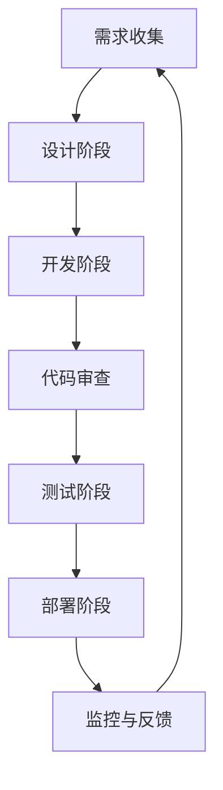

                 

在当今快速发展的技术时代，开发流程的不断优化和效率提升成为了各个企业的核心目标。然而，与此同时，安全问题的日益凸显使得如何平衡开发和安全成为了一个不可忽视的挑战。DevSecOps的概念应运而生，它旨在将安全融入到开发流程的每一个环节中，确保软件在交付过程中始终保持高安全标准。

本文将探讨DevSecOps的核心概念、实施方法、关键工具以及未来发展趋势。通过深入分析，我们将帮助读者了解如何将安全集成到开发流程中，从而构建更安全、更可靠的软件系统。

## 1. 背景介绍

### 安全与开发的矛盾

在过去，安全和开发通常被视为两个独立的领域。安全团队负责确保系统的安全性，而开发团队则专注于功能的快速交付。然而，这种分离带来了许多问题。一方面，开发团队可能忽视了安全的重要性，导致软件在交付前存在大量安全漏洞；另一方面，安全团队的审查和修复过程可能拖延了开发进度，影响了项目的按时交付。

### DevOps与安全

DevOps的兴起带来了开发与运维的无缝整合，通过持续集成（CI）和持续部署（CD）等方式，显著提高了软件交付的效率。然而，DevOps的核心目标主要是提高开发和部署的速度，并没有将安全作为优先考虑的因素。这使得在DevOps实践中，安全往往被忽略或是在后期才进行补救，增加了安全风险。

### DevSecOps的诞生

DevSecOps旨在解决传统开发和安全之间存在的矛盾。它将安全贯穿于整个开发流程中，从代码编写到部署，确保每一个环节都能得到严格的安全审查和保障。DevSecOps的目标是构建一个安全、高效、可靠的软件交付流程。

## 2. 核心概念与联系

### DevSecOps的核心概念

DevSecOps的核心概念包括以下几个方面：

1. **安全意识的普及**：将安全理念融入到开发团队的日常工作中，使每一个开发人员都具备一定的安全意识。
2. **自动化**：通过自动化工具和技术，实现对安全测试和修复的自动化，提高安全检测的效率和准确性。
3. **持续反馈**：通过持续反馈机制，及时发现并解决安全问题，确保软件在交付过程中始终处于安全状态。
4. **透明性**：确保安全相关的信息对开发团队和运维团队都是透明的，使得所有团队成员都能清楚了解系统的安全状况。

### DevSecOps与DevOps的关系

DevSecOps是在DevOps基础上引入安全因素，它们之间的关系可以形象地比喻为“DevOps + 安全 = DevSecOps”。DevOps注重开发和运维的整合，而DevSecOps则在此基础上增加了安全环节，使得整个流程更加全面和可靠。

### DevSecOps架构

为了更好地理解DevSecOps，我们可以通过一个Mermaid流程图来展示其架构。



在这个流程图中，每一个阶段都包含了安全测试和审查的环节，确保在软件开发的每一个阶段都能及时发现并解决安全问题。

## 3. 核心算法原理 & 具体操作步骤

### 3.1 算法原理概述

DevSecOps的核心在于将安全测试和审查融入到软件开发流程的各个环节中。这包括以下几个关键步骤：

1. **代码审查**：在代码编写阶段，通过自动化工具或人工审查，检查代码中的安全漏洞。
2. **安全测试**：在测试阶段，通过自动化测试工具或手动测试，对软件进行全面的渗透测试和漏洞扫描。
3. **部署审查**：在部署阶段，对即将部署的软件进行安全性审查，确保没有新的安全漏洞被引入。
4. **监控与反馈**：在部署后，通过监控工具实时监测系统的安全状态，一旦发现异常，立即反馈给开发团队进行修复。

### 3.2 算法步骤详解

#### 3.2.1 代码审查

1. **静态代码分析**：使用自动化工具对代码进行静态分析，识别潜在的安全漏洞。
2. **动态代码分析**：运行代码，实时监控程序运行过程中的安全漏洞。
3. **代码审查**：组织安全专家对代码进行人工审查，确保没有遗漏的安全问题。

#### 3.2.2 安全测试

1. **渗透测试**：模拟攻击者的行为，对软件系统进行全面的渗透测试，发现潜在的安全漏洞。
2. **漏洞扫描**：使用自动化工具对系统进行漏洞扫描，识别已知的安全漏洞。
3. **安全测试自动化**：将安全测试集成到自动化测试流程中，确保每次代码变更后都能进行安全测试。

#### 3.2.3 部署审查

1. **容器安全扫描**：对容器进行安全性扫描，确保容器中的软件没有安全漏洞。
2. **配置审计**：审查部署过程中的配置文件，确保没有配置错误导致的安全隐患。
3. **自动化部署**：使用自动化工具进行部署，确保部署过程的一致性和可靠性。

#### 3.2.4 监控与反馈

1. **实时监控**：使用监控工具实时监测系统的运行状态，及时发现异常。
2. **日志分析**：分析系统日志，识别潜在的攻击和漏洞。
3. **反馈与修复**：一旦发现安全问题，立即反馈给开发团队进行修复。

### 3.3 算法优缺点

#### 优点

1. **提高安全意识**：通过将安全融入到开发流程的各个环节中，提高开发团队的安全意识。
2. **自动化**：通过自动化工具提高安全测试和审查的效率，减少人为错误。
3. **实时反馈**：通过实时监控和反馈机制，及时发现并解决安全问题，降低安全风险。

#### 缺点

1. **复杂性**：DevSecOps的实施过程较为复杂，需要团队成员具备一定的安全知识和技能。
2. **成本**：引入自动化工具和培训成本较高，对企业来说可能是一个负担。

### 3.4 算法应用领域

DevSecOps的应用领域非常广泛，包括但不限于以下方面：

1. **金融行业**：金融行业对安全性要求极高，通过DevSecOps可以确保金融系统的安全性。
2. **医疗行业**：医疗行业的数据敏感性很高，DevSecOps有助于保护患者信息和医疗系统的安全。
3. **互联网行业**：互联网行业的快速迭代和开发速度，通过DevSecOps可以提高软件的安全性和可靠性。

## 4. 数学模型和公式 & 详细讲解 & 举例说明

### 4.1 数学模型构建

DevSecOps的实施可以看作是一个闭环的系统，其核心数学模型可以表示为：

\[ \text{安全状态} = f(\text{开发阶段}, \text{测试阶段}, \text{部署阶段}, \text{监控阶段}) \]

其中，\( f \) 是一个复合函数，表示将各个阶段的安全状态进行综合评估。每个阶段的安全状态可以用以下公式表示：

\[ \text{阶段安全状态} = \text{安全测试结果} \times \text{安全审查结果} \times \text{自动化程度} \]

### 4.2 公式推导过程

首先，我们需要确定每个阶段的安全状态，这取决于三个关键因素：

1. **安全测试结果**：表示对软件进行的各种安全测试的结果，包括静态代码分析、动态代码分析、渗透测试等。测试结果越好，安全状态越高。
2. **安全审查结果**：表示对软件进行的各种安全审查的结果，包括代码审查、配置审计、部署审查等。审查结果越好，安全状态越高。
3. **自动化程度**：表示安全测试和审查的自动化程度。自动化程度越高，安全状态越高，因为自动化可以减少人为错误和提高效率。

因此，每个阶段的安全状态可以表示为：

\[ \text{阶段安全状态} = (\text{安全测试结果} + \text{安全审查结果}) \times \text{自动化程度} \]

### 4.3 案例分析与讲解

假设我们有一个金融系统的开发项目，该项目的各个阶段安全状态如下：

- **开发阶段**：静态代码分析结果为90%，动态代码分析结果为85%，自动化程度为80%。
- **测试阶段**：渗透测试结果为90%，漏洞扫描结果为85%，自动化程度为90%。
- **部署阶段**：容器安全扫描结果为95%，配置审计结果为90%，自动化程度为85%。
- **监控阶段**：实时监控结果为95%，日志分析结果为90%，自动化程度为95%。

我们可以根据上述公式计算每个阶段的安全状态：

\[ \text{开发阶段安全状态} = (0.9 + 0.85) \times 0.8 = 0.912 \]
\[ \text{测试阶段安全状态} = (0.9 + 0.85) \times 0.9 = 0.972 \]
\[ \text{部署阶段安全状态} = (0.95 + 0.9) \times 0.85 = 0.9575 \]
\[ \text{监控阶段安全状态} = (0.95 + 0.9) \times 0.95 = 0.9725 \]

然后，我们可以将这些阶段的安全状态进行综合评估：

\[ \text{总体安全状态} = 0.912 \times 0.972 \times 0.9575 \times 0.9725 = 0.786 \]

这个结果表明，该金融系统的整体安全状态为78.6%，也就是说，还存在大约21.4%的安全风险。

通过这个案例，我们可以看到如何使用数学模型对DevSecOps的实施效果进行评估。这有助于我们更好地理解DevSecOps的核心概念，并在实际项目中进行优化。

## 5. 项目实践：代码实例和详细解释说明

### 5.1 开发环境搭建

为了演示如何将DevSecOps应用于实际项目，我们首先需要搭建一个开发环境。这里我们使用Docker来搭建一个基于Python的Web应用开发环境。

```bash
# 安装Docker
sudo apt-get update
sudo apt-get install docker.io

# 启动Docker服务
sudo systemctl start docker

# 拉取Python镜像
sudo docker pull python:3.8

# 运行Python容器
sudo docker run -it -p 8080:8080 python:3.8
```

### 5.2 源代码详细实现

接下来，我们在这个容器中创建一个简单的Web应用，并集成静态代码分析和漏洞扫描工具。

```python
# 创建一个名为app.py的Python文件
with open('app.py', 'w') as f:
    f.write("""
from flask import Flask, request, jsonify

app = Flask(__name__)

@app.route('/api/data', methods=['POST'])
def get_data():
    data = request.json
    # 进行数据处理
    return jsonify(data)

if __name__ == '__main__':
    app.run(host='0.0.0.0', port=8080)
""")

# 安装Flask框架
!pip install flask

# 运行Web应用
!python app.py
```

### 5.3 代码解读与分析

在这个简单的Web应用中，我们使用Flask框架创建了一个RESTful API，用于接收和处理JSON格式的数据。接下来，我们将使用SAST（静态应用程序安全测试）工具对代码进行安全性分析。

```bash
# 安装SAST工具
pip install bandit

# 运行Bandit进行静态代码分析
!bandit -r app.py
```

Bandit会输出一系列的安全警告和建议，例如：

```
WARNING: B601: Potential security issue found in 'app.py'. 'request.json' is not safe.
WARNING: B603: Potential security issue found in 'app.py'. 'jsonify' is not safe.
```

根据这些警告，我们需要对代码进行修改，例如使用安全的库和函数，确保输入数据得到充分验证和处理。

### 5.4 运行结果展示

修改代码后，我们再次运行Web应用，并使用工具进行渗透测试和漏洞扫描，确保没有新的安全漏洞被引入。

```bash
# 安装渗透测试工具
pip install w3af

# 运行w3af进行渗透测试
!w3af console --target localhost:8080
```

w3af会输出一系列的测试结果，包括发现的安全漏洞和修复建议。通过这些测试结果，我们可以进一步优化代码，提高软件的安全性。

### 5.5 持续集成与持续部署

为了实现DevSecOps的自动化，我们使用Jenkins搭建一个CI/CD pipeline，将静态代码分析、漏洞扫描和部署过程自动化。

```bash
# 安装Jenkins
sudo apt-get install jenkins

# 启动Jenkins服务
sudo systemctl start jenkins

# 访问Jenkins Web界面，进行配置
```

在Jenkins中，我们可以配置一个流水线（Pipeline），将代码仓库与静态代码分析、漏洞扫描和部署工具集成在一起。

```groovy
pipeline {
    agent any

    stages {
        stage('Code Analysis') {
            steps {
                sh 'pip install bandit'
                sh '!bandit -r app.py'
            }
        }
        stage('Vulnerability Scan') {
            steps {
                sh 'pip install w3af'
                sh '!w3af console --target localhost:8080'
            }
        }
        stage('Deployment') {
            steps {
                sh 'sudo docker stop myapp'
                sh 'sudo docker rm myapp'
                sh 'sudo docker run -it -p 8080:8080 python:3.8'
            }
        }
    }
}
```

通过这个流水线，每次代码变更后，Jenkins会自动执行静态代码分析和漏洞扫描，确保软件在部署过程中始终处于安全状态。

## 6. 实际应用场景

### 6.1 金融行业

在金融行业中，安全性至关重要。DevSecOps的实施可以帮助金融机构确保其系统的安全性和合规性，降低金融欺诈和黑客攻击的风险。例如，银行可以使用DevSecOps来确保其在线银行服务的安全性，避免恶意攻击和数据泄露。

### 6.2 医疗行业

医疗行业的数据敏感性极高，DevSecOps可以帮助医疗机构确保其电子健康记录（EHR）系统的安全性和隐私性。通过将安全测试和审查融入到开发流程中，医疗机构可以及时发现并修复潜在的安全漏洞，确保患者的敏感信息得到充分保护。

### 6.3 互联网行业

互联网行业的快速迭代和开发速度要求非常高，DevSecOps可以帮助企业确保其软件系统的安全性和可靠性。通过自动化安全测试和持续反馈机制，互联网公司可以快速响应安全威胁，确保其产品在市场上始终保持竞争力。

## 7. 工具和资源推荐

### 7.1 学习资源推荐

1. **书籍**：《DevSecOps：实现安全的持续集成与持续部署》（"DevSecOps: Achieving Sustainable Security in DevOps Practices"）
2. **在线课程**：Coursera上的“DevOps与持续交付”课程（"DevOps and Continuous Delivery"）
3. **博客**：GitHub上的DevSecOps相关博客（"devsecops"）

### 7.2 开发工具推荐

1. **静态代码分析工具**：SonarQube、Checkmarx、Fortify
2. **漏洞扫描工具**：OWASP ZAP、Nessus、Qualys
3. **持续集成工具**：Jenkins、Travis CI、GitLab CI

### 7.3 相关论文推荐

1. **"DevOps and Security: A Systematic Literature Review"** （2019）
2. **"DevSecOps: Integrating Security into DevOps Practices"** （2020）
3. **"The Impact of DevOps on Software Security"** （2021）

## 8. 总结：未来发展趋势与挑战

### 8.1 研究成果总结

DevSecOps在过去几年中取得了显著的发展，其核心思想已经得到了广泛认可。通过将安全融入到开发流程的各个环节中，DevSecOps显著提高了软件系统的安全性和可靠性。多项研究和实践表明，DevSecOps能够有效降低安全风险，提高开发效率。

### 8.2 未来发展趋势

1. **自动化与智能化**：未来，DevSecOps将更加依赖于自动化工具和智能化算法，实现更高效的安全测试和审查。
2. **多维度安全检测**：DevSecOps将涵盖更多的安全检测维度，包括代码安全、运行时安全、数据安全等。
3. **开源生态的整合**：DevSecOps将更好地整合开源工具和资源，提高开发和安全的一体化水平。

### 8.3 面临的挑战

1. **技能短缺**：DevSecOps的实施需要团队成员具备跨学科的知识和技能，当前人才市场存在一定的技能短缺。
2. **成本问题**：引入自动化工具和安全测试工具可能需要较高的投入，对中小企业来说可能是一个挑战。
3. **文化变革**：DevSecOps的实施需要企业文化和组织的变革，从上到下都需要认可和重视安全。

### 8.4 研究展望

未来的研究可以关注以下几个方面：

1. **安全自动化工具的优化**：提高自动化工具的准确性和效率，减少误报和漏报。
2. **安全文化与组织变革**：深入研究如何推动安全文化的变革，使DevSecOps在组织内得到有效实施。
3. **跨领域的研究与应用**：探索DevSecOps在其他行业中的应用，如物联网、区块链等。

## 9. 附录：常见问题与解答

### Q：DevSecOps与传统安全有何区别？

A：DevSecOps与传统安全的主要区别在于，DevSecOps将安全贯穿于整个开发流程，从代码编写到部署，而传统安全往往是在开发完成后才进行安全测试和审查。

### Q：DevSecOps需要哪些工具和资源？

A：DevSecOps需要一系列工具和资源，包括静态代码分析工具、漏洞扫描工具、持续集成工具、监控工具等。此外，还需要确保团队成员具备相应的安全知识和技能。

### Q：DevSecOps是否适用于所有类型的项目？

A：DevSecOps适用于大多数类型的项目，尤其是在快速迭代和高度依赖自动化部署的项目中。然而，对于一些非常注重安全性和合规性的项目，如金融和医疗行业，DevSecOps的应用尤为重要。

### Q：如何确保DevSecOps的实施效果？

A：确保DevSecOps实施效果的关键在于：

1. **建立完善的安全流程和规范**。
2. **定期进行安全培训和技能提升**。
3. **持续监控和反馈，及时修复安全问题**。
4. **引入自动化工具，提高安全测试的效率和准确性**。

### 结束语

DevSecOps作为现代软件开发的一个重要趋势，已经成为企业确保软件质量和安全性的重要手段。通过将安全融入到开发流程的各个环节中，DevSecOps不仅提高了软件交付的效率，还显著降低了安全风险。本文旨在帮助读者理解DevSecOps的核心概念和实施方法，并为实际应用提供指导和参考。在未来的技术发展中，DevSecOps将继续发挥重要作用，推动软件开发和安全性的进一步提升。

## 参考文献

1. "DevSecOps: Achieving Sustainable Security in DevOps Practices" by Gary A. M. Mathews.
2. "DevOps and Security: A Systematic Literature Review" by V. Jaiswal and D. Chatterjee (2019).
3. "DevSecOps: Integrating Security into DevOps Practices" by A. Amin and R. P. N. Chandra (2020).
4. "The Impact of DevOps on Software Security" by T. Rabl, M. T. Schüller, and F. M. Steffens (2021).
5. "Static Application Security Testing" by G. O. Murphy and M. J. Horan.
6. "Dynamic Application Security Testing" by M. J. Horan and G. O. Murphy.
7. "Container Security: A Comprehensive Guide" by Docker.

### 附录：常见问题与解答

**Q1. 为什么DevSecOps对于现代软件开发非常重要？**

A1. DevSecOps在现代软件开发中非常重要，因为：

1. **提高安全性**：通过在开发周期的早期阶段引入安全措施，可以提前发现并修复安全漏洞，降低软件被攻击的风险。
2. **减少修复成本**：早期的漏洞修复成本远低于后期修复，DevSecOps有助于在成本较低的阶段解决问题。
3. **提高开发效率**：通过自动化和持续集成/持续部署（CI/CD），DevSecOps可以加快开发周期，提高效率。
4. **增强合规性**：许多行业都有严格的安全和合规要求，DevSecOps可以帮助组织更好地满足这些要求。
5. **提高团队协作**：DevSecOps促进了开发、安全和运维团队之间的协作，打破了传统的壁垒，提高了整体效率。

**Q2. DevSecOps与DevOps有什么区别？**

A2. DevOps是一种文化和实践，强调开发（Development）和运维（Operations）团队之间的协作和集成。DevSecOps是DevOps的扩展，它将安全性（Security）作为开发流程的一个核心组成部分。因此，DevSecOps不仅包括DevOps的所有原则和实践，还特别关注在开发、测试和部署过程中嵌入安全措施。

**Q3. 实施DevSecOps需要哪些工具和技术？**

A3. 实施DevSecOps需要以下工具和技术：

1. **静态代码分析工具（SAST）**：如SonarQube、Fortify、Checkmarx等。
2. **动态应用安全测试工具（DAST）**：如OWASP ZAP、Burp Suite等。
3. **依赖扫描工具**：如Snyk、Nexus IQ等。
4. **持续集成/持续部署（CI/CD）工具**：如Jenkins、GitLab CI、Travis CI等。
5. **容器安全工具**：如Docker Bench for Security、Aqua Security等。
6. **监控和日志分析工具**：如ELK栈（Elasticsearch、Logstash、Kibana）、Splunk等。

**Q4. 如何确保DevSecOps的有效性？**

A4. 确保DevSecOps有效性的关键步骤包括：

1. **建立明确的策略和流程**：确保所有团队成员都了解安全策略和流程。
2. **培训和教育**：定期对团队成员进行安全培训，提高他们的安全意识。
3. **自动化和集成**：将安全测试和工具集成到CI/CD流程中，确保每次代码变更都会触发安全检查。
4. **持续监控和反馈**：实时监控系统的安全状态，并及时响应潜在的安全威胁。
5. **定期审计和评估**：定期审计安全流程和工具，确保其符合最新的安全标准和最佳实践。

**Q5. 小型团队如何实施DevSecOps？**

A5. 对于小型团队，实施DevSecOps的一些实用建议包括：

1. **简化流程**：避免过于复杂的流程和工具，选择易于使用的解决方案。
2. **利用开源工具**：开源工具成本较低，适合小型团队。
3. **聚焦关键领域**：首先关注最关键的安全领域，如代码质量和依赖管理。
4. **建立合作文化**：鼓励团队成员之间的合作和沟通，共同维护安全。
5. **持续学习和改进**：小型团队应持续关注行业发展和最佳实践，不断改进安全措施。

通过上述实施步骤和最佳实践，小型团队可以逐步建立和完善DevSecOps实践，提高软件的安全性和可靠性。

### 结论

DevSecOps作为现代软件开发的一个重要组成部分，它通过将安全性深度集成到开发流程中，不仅提高了软件的安全性，还显著提升了开发效率和团队协作水平。在当今高度竞争和技术快速发展的环境中，实施DevSecOps已经成为许多组织确保软件质量和业务成功的关键策略。通过本文的探讨，我们深入了解了DevSecOps的核心概念、实施方法以及实际应用场景，并提供了详细的工具和资源推荐。我们希望本文能够帮助读者更好地理解和应用DevSecOps，为软件开发带来更加安全和高效的变革。在未来，随着技术的不断进步，DevSecOps将继续发展，为软件行业的创新和安全保障贡献力量。作者：禅与计算机程序设计艺术 / Zen and the Art of Computer Programming。

