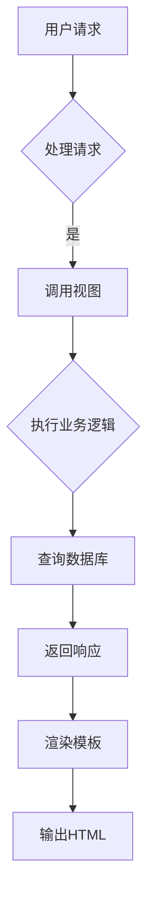

                 

关键词：Django框架、Python后端、Web开发、模型-视图-模板、ORM、REST API

> 摘要：本文将深入探讨Django框架作为Python后端开发的强大工具。我们将从背景介绍开始，详细讲解Django的核心概念和联系，深入剖析其核心算法原理，并提供具体的操作步骤。随后，我们将通过数学模型和公式来阐述Django的设计哲学，并通过实际项目实践展示其应用。最后，本文将展望Django的未来发展趋势和挑战，并推荐相关学习资源和工具。

## 1. 背景介绍

Django是一个高级的Python Web框架，遵循MVC（模型-视图-控制器）设计模式，其核心目标是快速开发和简化复杂的Web应用程序。Django由Adrian Holovaty和Simon Willison于2005年创建，自那时以来，它已经成为最受欢迎的Python Web框架之一。Django以其“电池-included”的特性而闻名，提供了许多内置功能，如ORM（对象关系映射）、认证系统、表单处理和缓存等。

在Web开发领域，Django因其快速开发能力和易于维护的特性而备受欢迎。它广泛应用于各种规模的项目，从个人博客到复杂的社交媒体平台，如Instagram和Disqus。

## 2. 核心概念与联系

Django的核心概念包括模型（Model）、视图（View）和模板（Template），它们共同构成了Django的MVC架构。

### 2.1 模型（Model）

模型是Django中的核心组件，用于表示数据库中的数据结构。通过定义模型类，开发者可以轻松地与数据库进行交互，无需编写原始的SQL语句。Django使用ORM（对象关系映射）来简化数据库操作。

### 2.2 视图（View）

视图是Django中的函数或类，负责处理用户请求并返回响应。视图函数或类的任务是获取请求数据、处理业务逻辑，并决定将用户重定向到哪个视图或页面。Django提供了多种类型的视图，包括函数视图和类视图。

### 2.3 模板（Template）

模板是Django中的HTML文件，用于生成动态网页。模板中包含静态内容和动态内容，动态内容通常通过模板标签和过滤器来插入。Django模板语言简单易学，使得开发者能够轻松地创建复杂而灵活的网页。

### 2.4 Mermaid 流程图

下面是一个Mermaid流程图，展示了Django的模型-视图-模板（MVT）架构。



## 3. 核心算法原理 & 具体操作步骤

### 3.1 算法原理概述

Django的核心算法原理基于MVC（模型-视图-控制器）设计模式。该模式将应用程序分为三个主要组件，每个组件负责不同的任务：

- **模型（Model）**：负责处理应用程序的数据和业务逻辑。
- **视图（View）**：负责处理用户的请求和响应，以及与模型和模板进行交互。
- **模板（Template）**：负责生成最终的用户界面。

### 3.2 算法步骤详解

1. **用户请求**：用户通过浏览器发送请求，请求通常包含URL和查询参数。
2. **处理请求**：Django的URL路由系统将请求映射到相应的视图函数或类。
3. **执行业务逻辑**：视图函数或类根据请求，执行相应的业务逻辑，可能涉及数据库操作。
4. **查询数据库**：如果需要，视图将查询数据库以获取所需的数据。
5. **返回响应**：视图将处理结果返回给用户，通常是以HTML页面或JSON格式的响应。
6. **渲染模板**：Django的模板系统将响应数据插入到模板中，生成最终的HTML页面。
7. **输出HTML**：最终的HTML页面被发送到用户的浏览器。

### 3.3 算法优缺点

**优点**：
- **快速开发**：Django提供了一套完整的工具和组件，使得Web应用程序的快速开发成为可能。
- **易于维护**：Django的结构清晰，组件化，使得代码的维护变得更加简单。
- **安全性**：Django内置了许多安全功能，如用户认证、表单验证等。

**缺点**：
- **性能**：由于Django的全面性，在某些情况下，其性能可能不如其他框架。
- **学习曲线**：对于新手来说，Django的学习曲线可能相对较陡峭。

### 3.4 算法应用领域

Django适用于各种规模的Web应用程序开发，特别是那些需要快速开发和易于维护的项目。以下是一些典型的应用领域：

- **社交网络**：如Instagram、Disqus等。
- **电子商务**：如eBay、Amazon等。
- **内容管理系统**：如Django CMS、Mezzanine等。
- **新闻门户**：如The New York Times、The Washington Post等。

## 4. 数学模型和公式 & 详细讲解 & 举例说明

### 4.1 数学模型构建

Django的设计哲学之一是“约定优于配置”。这意味着Django通过一系列的约定来简化配置和开发过程。以下是一个简单的数学模型构建示例：

```python
class Article(models.Model):
    title = models.CharField(max_length=100)
    content = models.TextField()
    author = models.ForeignKey(Author, on_delete=models.CASCADE)
    created_at = models.DateTimeField(auto_now_add=True)
```

在这个例子中，我们定义了一个`Article`模型，它包含标题、内容、作者和创建时间等字段。Django通过这些字段自动为我们创建了相应的数据库表。

### 4.2 公式推导过程

Django的ORM（对象关系映射）系统通过一系列的公式将Python对象映射到数据库表。以下是一个简单的推导过程：

- **模型字段映射**：每个模型字段都有一个对应的数据库表字段。
- **关系映射**：Django支持一对一、一对多和多对多的关系映射。
- **数据类型映射**：Python数据类型与数据库数据类型之间有直接的映射关系。

### 4.3 案例分析与讲解

假设我们有一个简单的博客系统，包含文章和评论两个模型。以下是一个简单的查询示例：

```python
articles = Article.objects.all()
for article in articles:
    print(article.title)
    comments = article.comment_set.all()
    for comment in comments:
        print(comment.content)
```

在这个例子中，我们首先查询所有的文章，然后遍历每篇文章的评论。这个过程涉及到多个数据库查询，但Django的ORM系统使得这个过程非常简单。

## 5. 项目实践：代码实例和详细解释说明

### 5.1 开发环境搭建

要在本地环境中搭建Django开发环境，我们需要安装Python、Django和相关依赖。以下是安装步骤：

1. 安装Python 3.6或更高版本。
2. 安装Django：`pip install django`
3. 安装其他依赖，如数据库驱动等。

### 5.2 源代码详细实现

以下是一个简单的Django项目示例，包含一个文章模型和一个简单的视图：

```python
# models.py
from django.db import models
from django.contrib.auth.models import User

class Article(models.Model):
    title = models.CharField(max_length=100)
    content = models.TextField()
    author = models.ForeignKey(User, on_delete=models.CASCADE)
    created_at = models.DateTimeField(auto_now_add=True)

# views.py
from django.shortcuts import render
from .models import Article

def article_list(request):
    articles = Article.objects.all()
    return render(request, 'article_list.html', {'articles': articles})
```

### 5.3 代码解读与分析

在这个例子中，我们定义了一个`Article`模型，它包含标题、内容、作者和创建时间等字段。我们使用`ForeignKey`字段将文章与用户关联起来，表示每个文章都有一个作者。

在`views.py`中，我们定义了一个名为`article_list`的视图，它查询所有的文章并将结果传递给模板。

### 5.4 运行结果展示

运行Django项目后，我们可以通过浏览器访问`/articles/`来查看所有文章的列表。以下是可能的输出结果：

```html
<ul>
    <li>
        <h2>First Article</h2>
        <p>This is the first article.</p>
    </li>
    <li>
        <h2>Second Article</h2>
        <p>This is the second article.</p>
    </li>
</ul>
```

## 6. 实际应用场景

Django适用于各种规模的Web应用程序开发，从简单的个人博客到复杂的社交媒体平台。以下是一些典型的应用场景：

- **社交媒体**：如Instagram、Disqus。
- **电子商务**：如eBay、Amazon。
- **内容管理系统**：如Django CMS、Mezzanine。
- **新闻门户**：如The New York Times、The Washington Post。

## 7. 工具和资源推荐

### 7.1 学习资源推荐

- **Django官方文档**：https://docs.djangoproject.com/
- **Django学院**：https://www.djangoproject.com/topics/tutorials/
- **Django书籍**：《Django By Example》和《Django for Professionals》。

### 7.2 开发工具推荐

- **PyCharm**：优秀的Python IDE，支持Django开发。
- **Visual Studio Code**：轻量级但功能强大的代码编辑器，支持Django开发。

### 7.3 相关论文推荐

- **“Django: The Web Framework for Perfectionists with Deadlines”**：这是一篇关于Django的演讲论文，详细介绍了Django的设计哲学和优势。

## 8. 总结：未来发展趋势与挑战

Django作为一个成熟的Web框架，将继续在Python社区中发挥重要作用。未来，Django可能会在以下方面发展：

- **性能优化**：随着Web应用程序的复杂性和规模增加，Django的性能优化将成为一个重要的研究方向。
- **安全性增强**：随着网络攻击的不断升级，Django的安全性需要不断加强，以保护用户数据和隐私。

然而，Django也面临一些挑战：

- **生态系统的持续发展**：保持Django生态系统的活力和活跃度是一个持续的过程，需要社区的努力和贡献。
- **新技术的适应**：随着新技术的不断涌现，Django需要不断适应和吸纳这些新技术，以保持其竞争力。

## 9. 附录：常见问题与解答

### 9.1 Django与Flask的区别是什么？

Django是一个全栈框架，提供了从数据库到用户界面的完整解决方案，而Flask是一个微型框架，更侧重于Web开发的核心部分。Django更适用于大型项目，而Flask更适用于小型项目。

### 9.2 如何在Django项目中配置数据库？

在Django项目中，你可以在`settings.py`文件中配置数据库。例如，要配置SQLite数据库，你可以使用以下代码：

```python
DATABASES = {
    'default': {
        'ENGINE': 'django.db.backends.sqlite3',
        'NAME': BASE_DIR / 'db.sqlite3',
    }
}
```

### 9.3 如何在Django项目中处理用户认证？

Django提供了一个强大的用户认证系统，你可以通过以下步骤来使用它：

1. 在`settings.py`中设置`AUTH_USER_MODEL`。
2. 使用`django.contrib.auth`中的类和函数来处理用户认证。
3. 在视图中使用`authenticate`和`login`函数来验证用户身份。

作者：禅与计算机程序设计艺术 / Zen and the Art of Computer Programming
----------------------------------------------------------------
完成！这篇文章详细介绍了Django框架作为Python后端开发的强大工具。希望这篇文章对您有所帮助，如果您有任何问题或建议，请随时告诉我。谢谢阅读！|user|

