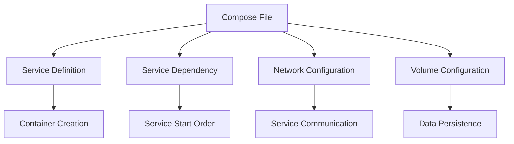

                 

关键词：Docker，Compose，服务编排，容器化，DevOps，微服务架构，多容器应用

## 摘要

随着容器技术的兴起，Docker成为了现代软件开发和部署的基石。本文将深入探讨Docker Compose这一强大的工具，它使得开发者能够轻松地管理多容器应用。本文将介绍Docker Compose的核心概念、如何使用Compose文件定义和编排服务、配置管理、网络和卷的使用，并通过具体案例演示其在多服务编排中的应用。最后，我们将展望Docker Compose的未来发展趋势以及面临的挑战。

## 1. 背景介绍

容器技术作为一种轻量级虚拟化技术，被广泛应用于现代软件开发和运维中。Docker作为容器技术的代表，通过提供简单、高效的容器化解决方案，极大地提升了开发效率和部署速度。Docker Compose则是在此基础上，为开发者提供了更加高级的多容器应用管理能力。

Docker Compose的设计理念是“一次定义，多次部署”，它允许开发者通过一个简单的YAML文件定义应用程序的各个服务，这些服务可以是Web应用、数据库、消息队列等。通过这个文件，开发者可以轻松地启动、停止和更新这些服务，而不需要手动管理每个容器的生命周期。

### 1.1 容器与容器化的基本概念

容器是一种轻量级的、可移植的、自给自足的计算环境。它包含了一个应用程序和其需要的依赖库、环境变量、配置文件等。容器与传统的虚拟机相比，具有更快的启动速度、更低的资源占用和更好的兼容性。

容器化是将应用程序及其运行时环境打包成一个可移植的容器镜像，这个镜像可以在任何支持Docker的操作系统上运行，无需额外的配置。这为开发者提供了极大的便利，使得应用程序的部署和运维变得更加简单和高效。

### 1.2 DevOps与微服务架构

DevOps是一种将软件开发（Dev）和运维（Ops）紧密结合的新兴文化、运动或实践。它强调通过自动化、协作和持续交付来提高软件交付的速度和质量。微服务架构则是一种将应用程序分解为多个独立的小服务的设计模式，每个服务负责特定的业务功能，这些服务可以通过轻量级的通信机制（如REST API）进行交互。

Docker和Docker Compose在这些实践中发挥了重要作用，通过容器化和服务编排，它们使得DevOps和微服务架构的实施变得更加简单和可行。

## 2. 核心概念与联系

### 2.1 Docker Compose文件

Docker Compose的核心是它的配置文件，通常命名为`docker-compose.yml`。这个文件定义了应用程序中所有服务的配置，包括容器名、镜像、端口映射、环境变量等。

```yaml
version: '3'
services:
  web:
    image: myapp-web
    ports:
      - "5000:5000"
    depends_on:
      - db
      - cache
  db:
    image: postgres:latest
    volumes:
      - db_data:/var/lib/postgresql/data
  cache:
    image: redis:latest
    volumes:
      - cache_data:/data
volumes:
  db_data:
  cache_data:
```

在这个配置文件中，`version`指定了Docker Compose文件使用的版本。`services`部分定义了应用程序中的各个服务，每个服务都有自己的配置。`depends_on`用于指定服务之间的依赖关系，确保某个服务在另一个服务启动之前已经启动。

### 2.2 服务编排

服务编排是指管理多个容器之间的依赖关系和交互过程。Docker Compose通过解析`docker-compose.yml`文件，自动启动和停止服务，确保它们按照正确的顺序运行。例如，如果Web服务依赖于数据库服务，那么数据库服务会在Web服务之前启动。

### 2.3 配置管理

Docker Compose提供了强大的配置管理功能，允许通过环境变量、配置文件和敏感数据文件等方式传递配置信息。这些配置可以在`docker-compose.yml`文件中指定，也可以通过命令行参数传递。

```yaml
version: '3'
services:
  web:
    image: myapp-web
    environment:
      - DATABASE_URL=postgres://user:password@db:5432/dbname
    volumes:
      - config:/etc/config
volumes:
  config:
    external: true
```

在这个示例中，`DATABASE_URL`环境变量用于配置数据库连接信息，`config`卷用于存储配置文件。

### 2.4 网络和卷的使用

Docker Compose允许通过配置文件定义网络和卷，用于服务之间的通信和持久化数据。

```yaml
version: '3'
services:
  web:
    image: myapp-web
    networks:
      - front
  db:
    image: postgres:latest
    networks:
      - back
networks:
  front:
  back:
```

在这个示例中，`front`和`back`是自定义网络，用于隔离不同的服务。

### 2.5 Mermaid 流程图



通过上述流程图，我们可以看到Docker Compose的核心概念和它们之间的联系。

## 3. 核心算法原理 & 具体操作步骤

### 3.1 算法原理概述

Docker Compose的核心算法基于对`docker-compose.yml`文件的解析和执行。其原理可以概括为以下几个步骤：

1. **解析配置文件**：Docker Compose首先解析`docker-compose.yml`文件，提取出所有服务的配置信息。
2. **创建容器**：根据解析结果，Docker Compose使用Docker API创建容器。
3. **启动容器**：在创建容器后，Docker Compose按照指定的依赖关系启动容器。
4. **网络和卷配置**：Docker Compose根据配置文件中的网络和卷信息，为容器配置网络连接和卷挂载。
5. **服务监控**：Docker Compose监控容器的状态，确保它们正常运行。

### 3.2 算法步骤详解

1. **解析配置文件**

   Docker Compose使用YAML解析器解析`docker-compose.yml`文件，提取出服务的配置信息，包括镜像名称、容器名称、端口映射、环境变量、依赖关系等。

2. **创建容器**

   Docker Compose使用Docker API创建容器。每个服务对应的容器都由Docker守护进程创建和管理。

3. **启动容器**

   Docker Compose根据`depends_on`字段指定的依赖关系，按照正确的顺序启动容器。如果某个服务依赖于另一个服务，那么它会在依赖的服务启动后再启动。

4. **网络和卷配置**

   Docker Compose为每个容器配置网络连接和卷挂载。网络连接通过自定义网络实现，卷挂载用于持久化数据。

5. **服务监控**

   Docker Compose监控容器的状态，如果容器出现故障，它会尝试重启容器。如果容器连续失败，Docker Compose会记录错误并退出。

### 3.3 算法优缺点

**优点：**

- 简单易用：Docker Compose使用简单的YAML文件定义服务，使得多容器应用的管理变得非常简单。
- 一致性：Docker Compose确保服务按照正确的顺序启动，减少了由于依赖关系导致的部署问题。
- 可移植性：Docker Compose定义的应用程序配置可以在不同的环境中轻松部署。

**缺点：**

- 单一节点部署：Docker Compose主要用于单节点部署，无法直接管理多节点集群。
- 依赖性限制：如果服务之间存在复杂的依赖关系，Docker Compose可能会变得难以管理。

### 3.4 算法应用领域

Docker Compose在以下领域有广泛应用：

- **开发环境**：开发者可以使用Docker Compose快速搭建开发环境，确保开发环境与生产环境保持一致。
- **持续集成/持续部署（CI/CD）**：Docker Compose可以在CI/CD管道中用于测试和部署应用程序。
- **微服务架构**：Docker Compose可以用于管理微服务架构中的多个服务，确保它们协同工作。

## 4. 数学模型和公式 & 详细讲解 & 举例说明

### 4.1 数学模型构建

Docker Compose的数学模型主要基于图论中的有向无环图（DAG）。在这个模型中，每个服务可以看作一个节点，服务之间的依赖关系可以用有向边表示。Docker Compose的核心任务是找到这个DAG的拓扑排序，即按照正确的顺序启动服务。

### 4.2 公式推导过程

假设有一个服务集合S = {s1, s2, ..., sn}和依赖关系集合D。我们可以使用以下公式推导出正确的启动顺序：

```
TopologicalSort(S, D) = {
    空集，如果D为空
    {si}，如果si不在D中
    TopologicalSort({s | s ∈ S - {si}, s不在D中}， D - {(si, sj) | si, sj ∈ S}) ∪ {si}
}
```

这个公式的推导过程如下：

1. 如果依赖关系集合D为空，则启动顺序为空集。
2. 如果服务si不在依赖关系集合D中，则可以直接启动。
3. 对于每个服务si，将其从服务集合S中移除，并更新依赖关系集合D，然后递归地执行拓扑排序。
4. 将si添加到拓扑排序的末尾。

### 4.3 案例分析与讲解

假设我们有一个简单的应用，包括三个服务：Web、Database和Cache。它们的依赖关系如下：

- Web服务依赖于Database服务。
- Database服务依赖于Cache服务。

我们可以使用上述公式推导出正确的启动顺序：

1. 首先，计算不依赖于其他服务的服务集合：{Web, Database, Cache}。
2. 将Database服务从服务集合中移除，并更新依赖关系集合：D = {(Web, Database), (Database, Cache)}。
3. 计算新的不依赖于其他服务的服务集合：{Web}。
4. 将Database服务从服务集合中移除，并更新依赖关系集合：D = {(Web, Database)}。
5. 计算新的不依赖于其他服务的服务集合：{}。
6. 将Cache服务从服务集合中移除，并更新依赖关系集合：D = {}。
7. 计算新的不依赖于其他服务的服务集合：{Cache}。

最终，正确的启动顺序为：Cache, Database, Web。

## 5. 项目实践：代码实例和详细解释说明

### 5.1 开发环境搭建

为了演示Docker Compose的多服务编排，我们首先需要搭建一个开发环境。在开始之前，请确保已经安装了Docker和Docker Compose。

1. 安装Docker：

   ```bash
   sudo apt-get update
   sudo apt-get install docker-ce docker-ce-cli containerd.io
   ```

2. 安装Docker Compose：

   ```bash
   sudo curl -L "https://github.com/docker/compose/releases/download/1.29.2/docker-compose-`uname -s`-`uname -m`" -o /usr/local/bin/docker-compose
   sudo chmod +x /usr/local/bin/docker-compose
   ```

### 5.2 源代码详细实现

在这个案例中，我们将创建一个简单的Web应用，包括一个Web服务、一个Database服务和Cache服务。下面是完整的`docker-compose.yml`文件：

```yaml
version: '3'
services:
  web:
    image: myapp-web
    ports:
      - "5000:5000"
    depends_on:
      - db
      - cache
  db:
    image: postgres:latest
    volumes:
      - db_data:/var/lib/postgresql/data
  cache:
    image: redis:latest
    volumes:
      - cache_data:/data
volumes:
  db_data:
  cache_data:
```

在这个配置文件中，我们定义了三个服务：Web、Database和Cache。每个服务都使用了官方的Docker镜像，并配置了端口映射和依赖关系。

### 5.3 代码解读与分析

在这个配置文件中，`version`指定了Docker Compose的版本。`services`部分定义了应用程序中的各个服务，包括镜像名称、端口映射和依赖关系。

- `web`服务使用`myapp-web`镜像，将容器的5000端口映射到宿主机的5000端口，并依赖于`db`和`cache`服务。
- `db`服务使用`postgres:latest`镜像，并配置了一个卷`db_data`用于持久化数据。
- `cache`服务使用`redis:latest`镜像，并配置了一个卷`cache_data`用于持久化数据。

### 5.4 运行结果展示

要启动这个应用，我们可以使用以下命令：

```bash
docker-compose up -d
```

这个命令会启动所有定义在`docker-compose.yml`文件中的服务。在启动完成后，我们可以通过浏览器访问本地5000端口来测试Web服务。

```bash
http://localhost:5000
```

如果一切正常，我们应该能看到Web服务的响应。

## 6. 实际应用场景

Docker Compose在实际应用场景中有着广泛的应用，以下是一些典型的应用场景：

### 6.1 开发环境部署

开发者可以使用Docker Compose快速搭建开发环境，确保开发环境与生产环境保持一致。通过定义一个简单的`docker-compose.yml`文件，开发者可以轻松地启动所有依赖服务，如数据库、消息队列等。

### 6.2 持续集成/持续部署（CI/CD）

在CI/CD管道中，Docker Compose可以用于测试和部署应用程序。通过配置`docker-compose.yml`文件，自动化工具可以在每次代码提交后自动构建应用程序镜像，并使用Docker Compose启动测试环境。如果测试通过，应用程序会被部署到生产环境。

### 6.3 微服务架构

在微服务架构中，Docker Compose可以用于管理多个微服务。每个微服务都可以定义在一个`docker-compose.yml`文件中，通过依赖关系确保它们按照正确的顺序启动。这使得微服务的部署和运维变得更加简单和高效。

## 7. 未来应用展望

Docker Compose的未来发展将主要集中在以下几个方面：

### 7.1 功能增强

Docker Compose将继续增强其功能，如添加对多节点集群的支持、提供更高级的监控和日志管理功能等。这将使得Docker Compose在更复杂的应用场景中具有更强的竞争力。

### 7.2 生态拓展

Docker Compose将与其他开源工具和平台进行集成，如Kubernetes、云服务提供商等。这将使得Docker Compose的应用范围更加广泛，为开发者提供更多的选择。

### 7.3 容器化技术演进

随着容器技术的不断演进，Docker Compose也将不断完善，以适应新的技术趋势。例如，对服务网格（Service Mesh）的支持，将对容器化的微服务架构带来新的变革。

## 8. 总结：未来发展趋势与挑战

Docker Compose在现代软件开发和运维中发挥着重要作用，其简单易用的特性深受开发者喜爱。未来，Docker Compose将继续在容器化技术的推动下，不断发展和完善。然而，随着应用场景的复杂化和容器化技术的演进，Docker Compose也面临一些挑战：

- **多节点集群支持**：Docker Compose需要更好地支持多节点集群，以满足大规模应用的部署需求。
- **监控与日志管理**：提供更强大的监控和日志管理功能，帮助开发者更好地了解应用的运行状态。
- **安全性和隔离性**：随着容器化技术的普及，安全性问题和隔离性将变得更加重要，Docker Compose需要提供更加安全可靠的解决方案。

总之，Docker Compose作为容器化技术的核心工具之一，将继续在软件开发和运维中发挥重要作用。通过不断的技术创新和优化，Docker Compose将为开发者带来更多的便利和高效。

## 9. 附录：常见问题与解答

### 9.1 Docker Compose与Docker的区别是什么？

Docker是一种容器化平台，它提供了容器镜像的创建和管理功能。而Docker Compose则是一个用于定义和编排多容器应用的工具。简单来说，Docker负责容器的创建和管理，而Docker Compose负责容器之间的依赖关系和协同工作。

### 9.2 Docker Compose文件中如何设置环境变量？

在Docker Compose文件中，可以通过`environment`字段设置环境变量。例如：

```yaml
services:
  web:
    image: myapp-web
    environment:
      - VAR1=value1
      - VAR2=value2
```

这样，容器启动时会将`VAR1`设置为`value1`，`VAR2`设置为`value2`。

### 9.3 如何在Docker Compose中管理卷？

在Docker Compose文件中，可以通过`volumes`字段定义卷。例如：

```yaml
services:
  web:
    image: myapp-web
    volumes:
      - web_data:/var/www/html
volumes:
  web_data:
```

这样，容器会挂载一个名为`web_data`的卷到`/var/www/html`路径。

### 9.4 Docker Compose如何处理服务之间的通信？

Docker Compose通过在配置文件中定义网络，实现了服务之间的通信。在`docker-compose.yml`文件中，可以定义自定义网络：

```yaml
services:
  web:
    image: myapp-web
    networks:
      - front
  db:
    image: postgres:latest
    networks:
      - back
networks:
  front:
  back:
```

在这个例子中，`front`和`back`是自定义网络，服务可以通过这些网络进行通信。

### 9.5 Docker Compose是否支持持续集成/持续部署（CI/CD）？

是的，Docker Compose可以与CI/CD工具集成，用于测试和部署应用程序。例如，可以使用Jenkins或GitLab CI等工具，在每次代码提交后自动构建应用程序镜像，并使用Docker Compose启动测试环境或生产环境。

---

作者：禅与计算机程序设计艺术 / Zen and the Art of Computer Programming

通过本文的深入探讨，我们了解了Docker Compose在多服务编排中的强大功能和应用场景。希望读者能够将所学知识应用到实际项目中，提高开发效率和运维质量。未来的技术发展将不断推动Docker Compose的完善和进步，让我们共同期待这一激动人心的时刻的到来。

