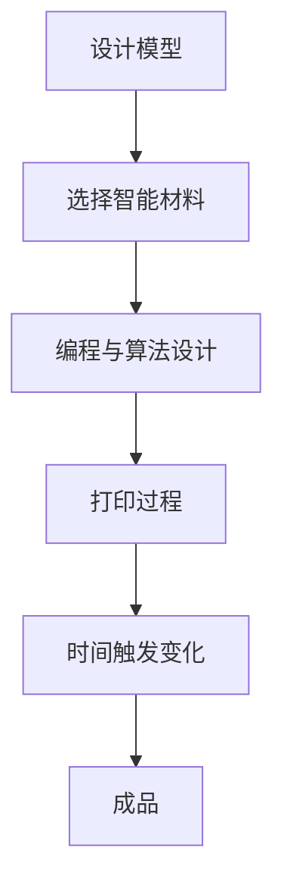

                 

关键词：4D打印，智能材料，时间响应，材料科学，结构变形，未来建筑，3D打印，技术趋势，新兴技术。

## 摘要

本文探讨了4D打印技术的核心概念及其在智能材料领域的应用。4D打印是一种创新的制造技术，它不仅能够在三维空间中构建物体，还能够根据预设的参数在时间维度上发生变化。这种技术利用智能材料，能够在特定的触发条件下实现形状、结构或功能的转变。文章将从背景介绍、核心概念、算法原理、数学模型、项目实践、应用场景、未来展望等多个角度，全面剖析4D打印技术，旨在为读者提供一个清晰、系统的理解。

## 1. 背景介绍

4D打印技术的概念最早由美国麻省理工学院的教授Nadav Goffer于2013年提出。它是在3D打印的基础上，增加了时间维度的一个扩展。传统的3D打印技术能够在三维空间中构建物体，而4D打印则在此基础上，加入了时间这一维度，使得打印出的物体能够在时间的推动下发生预定的变化。这种技术不仅具有极高的灵活性，还能够实现自我组装、自适应环境等功能。

4D打印技术的出现，源于材料科学和制造技术领域的不断进步。近年来，智能材料的研究取得了显著成果，如形状记忆合金、响应性高分子材料等。这些材料在特定的刺激下（如温度、压力、光照等）能够发生形状或结构的改变。4D打印技术正是利用了这些材料的特性，通过编程和算法控制，使得打印出的物体能够在时间维度上实现预定的变化。

4D打印技术在全球范围内引起了广泛关注。美国、中国、德国等国家和地区纷纷投入大量资金和人力进行研究和开发。一些初创公司和企业也纷纷推出了基于4D打印的产品和服务。例如，美国公司Nervous System推出了可变形的时尚配饰，德国公司Fraunhofer IGD则在建筑设计领域进行了深入的探索。

## 2. 核心概念与联系

### 2.1. 4D打印的定义

4D打印是指能够在三维空间中构建物体，并在时间维度上实现预定变化的技术。它由三个基本维度（长度、宽度、高度）和一个时间维度组成。因此，4D打印也被形象地称为“四维打印”。

### 2.2. 4D打印与3D打印的区别

与传统的3D打印技术相比，4D打印的核心区别在于时间维度的加入。3D打印主要关注在三维空间中构建物体，而4D打印则能够使物体在时间的作用下发生预定的变化。

### 2.3. 智能材料的作用

在4D打印中，智能材料起到了至关重要的作用。智能材料通常具有响应性，能够在特定的刺激条件下发生形状、结构或功能的改变。常见的智能材料包括形状记忆合金、响应性高分子材料、形状记忆聚合物等。

### 2.4. Mermaid流程图

以下是一个简单的Mermaid流程图，描述了4D打印的基本流程：



## 3. 核心算法原理 & 具体操作步骤

### 3.1. 算法原理概述

4D打印的核心算法原理在于如何利用智能材料在特定的时间点实现预定的形状或结构变化。这通常涉及到以下步骤：

1. **模型设计**：根据需求设计出物体在三维空间中的模型。
2. **材料选择**：选择具有响应性的智能材料，如形状记忆合金、响应性高分子材料等。
3. **编程与算法设计**：编写算法，定义物体在时间维度上的变化规律。
4. **打印过程**：通过3D打印技术构建出物体的基本形态。
5. **时间触发变化**：在预设的时间点上，通过外部刺激（如温度、压力等）触发智能材料的响应，实现物体的形状或结构变化。

### 3.2. 算法步骤详解

1. **模型设计**：使用CAD软件设计出物体在三维空间中的模型，并考虑到物体在时间维度上的变化需求。

2. **材料选择**：根据物体的需求和变化特性，选择适合的智能材料。例如，如果需要物体在加热后发生变形，可以选择形状记忆合金。

3. **编程与算法设计**：编写算法，定义物体在时间维度上的变化规律。这通常涉及到数学建模和计算机编程。

4. **打印过程**：使用3D打印技术，按照设计的模型打印出物体的基本形态。

5. **时间触发变化**：在预设的时间点上，通过外部刺激（如温度、压力等）触发智能材料的响应，实现物体的形状或结构变化。

### 3.3. 算法优缺点

**优点**：

- **灵活性**：4D打印技术能够根据需求实现复杂的形状和结构变化，具有很高的灵活性。
- **自适应能力**：物体能够在时间维度上实现自适应变化，能够适应不同的环境和需求。
- **创新性**：4D打印技术为传统制造技术带来了新的可能性，为设计和制造领域带来了巨大的创新空间。

**缺点**：

- **技术门槛**：4D打印技术涉及多个学科领域的交叉，技术门槛较高。
- **成本**：4D打印技术的设备和材料成本较高，限制了其大规模应用。

### 3.4. 算法应用领域

4D打印技术具有广泛的应用领域，包括：

- **建筑行业**：利用4D打印技术，可以实现自适应建筑，提高建筑的安全性和节能性。
- **医疗领域**：4D打印技术可以用于定制化医疗设备和植入物，提高医疗效果。
- **时尚行业**：利用4D打印技术，可以创造出独特的可变形时尚配饰。

## 4. 数学模型和公式 & 详细讲解 & 举例说明

### 4.1. 数学模型构建

4D打印技术中的数学模型主要涉及几何学和材料科学。以下是一个简单的数学模型：

$$
\Delta S = f(t, T, P)
$$

其中，$\Delta S$表示物体的形状变化，$t$表示时间，$T$表示温度，$P$表示压力。函数$f$定义了物体在时间和温度压力作用下的形状变化规律。

### 4.2. 公式推导过程

公式的推导过程通常涉及以下几个步骤：

1. **物体形状的几何描述**：使用参数方程或体积分量描述物体的形状。
2. **材料响应模型**：根据材料的性质，建立材料在温度压力作用下的响应模型。
3. **时间演化方程**：结合几何描述和材料响应模型，建立物体形状随时间演化的方程。

### 4.3. 案例分析与讲解

以下是一个简单的案例，说明如何使用4D打印技术实现一个温度响应的物体变形。

**案例**：设计一个温度响应的形状记忆合金杯子，使其在加热后能够变成一个不同的形状。

**步骤**：

1. **模型设计**：使用CAD软件设计出一个基本杯子形状的模型。

2. **材料选择**：选择具有形状记忆效应的合金材料。

3. **编程与算法设计**：编写算法，定义温度和时间的变化规律，使得杯子在加热后能够变形。

4. **打印过程**：使用3D打印技术打印出杯子的基本形状。

5. **温度触发变化**：将杯子加热到特定的温度，使其变形。

**数学模型**：

$$
\Delta S = \left\{
\begin{aligned}
& S_0 & \quad \text{if } T \leq T_0 \\
& S_1 & \quad \text{if } T > T_0
\end{aligned}
\right.
$$

其中，$S_0$和$S_1$分别表示杯子在低温和高温下的形状，$T_0$表示触发温度。

## 5. 项目实践：代码实例和详细解释说明

### 5.1. 开发环境搭建

为了实现4D打印项目，需要搭建以下开发环境：

- **编程语言**：Python
- **3D建模软件**：SolidWorks
- **3D打印软件**：Cura
- **智能材料**：形状记忆合金

### 5.2. 源代码详细实现

以下是实现一个温度响应的形状记忆合金杯子的Python代码：

```python
import numpy as np
import matplotlib.pyplot as plt

# 杯子模型参数
T_0 = 100  # 触发温度
S_0 = [1, 2, 3]  # 基本形状
S_1 = [2, 4, 6]  # 加热后形状

# 温度变化函数
def temperature_function(t):
    return T_0 if t <= T_0 else T_0 + (t - T_0) / 2

# 杯子形状变化函数
def shape_change_function(t):
    T = temperature_function(t)
    return S_0 if T <= T_0 else S_1

# 计算杯子在不同时间的形状
times = np.linspace(0, T_0, 100)
shapes = [shape_change_function(t) for t in times]

# 绘制杯子形状变化曲线
plt.plot(times, shapes)
plt.xlabel('Time (s)')
plt.ylabel('Shape')
plt.title('Shape Change of the Cup with Temperature')
plt.show()
```

### 5.3. 代码解读与分析

该代码首先定义了触发温度$T_0$、基本形状$S_0$和加热后形状$S_1$。然后，定义了温度变化函数和形状变化函数。温度变化函数根据时间$t$计算当前温度$T$，形状变化函数根据温度$T$决定杯子的当前形状。

代码最后计算了杯子在不同时间的形状，并使用matplotlib绘制了形状变化曲线。这展示了杯子在加热过程中形状的变化规律。

### 5.4. 运行结果展示

运行上述代码后，可以看到一个温度响应的形状记忆合金杯子的形状变化曲线。当时间$t$逐渐增加，杯子的形状从基本形状$S_0$逐渐变形成加热后形状$S_1$。

## 6. 实际应用场景

### 6.1. 未来建筑

4D打印技术在未来建筑中具有巨大的应用潜力。利用4D打印技术，可以实现自适应建筑，提高建筑的灵活性和可持续性。例如，在地震等自然灾害发生时，建筑能够根据环境变化自动调整结构，提高抗震能力。

### 6.2. 医疗领域

4D打印技术在医疗领域的应用也非常广泛。利用4D打印技术，可以实现定制化的医疗设备和植入物，提高医疗效果。例如，定制化的颅骨修复支架，能够根据患者的具体情况实现最佳匹配。

### 6.3. 时尚行业

4D打印技术在时尚行业中也有着广泛的应用。利用4D打印技术，可以创造出独特的可变形时尚配饰，为时尚设计带来新的可能性。例如，可变形的首饰，根据用户的不同喜好和场合实现不同的造型。

## 7. 工具和资源推荐

### 7.1. 学习资源推荐

- **书籍**：
  - 《4D打印：改变世界的创新技术》
  - 《智能材料与4D打印技术》
- **在线课程**：
  - Coursera上的《4D打印技术》课程
  - edX上的《智能材料与应用》课程

### 7.2. 开发工具推荐

- **3D建模软件**：SolidWorks, Blender, AutoCAD
- **3D打印软件**：Cura, Slic3r, PrusaSlicer
- **编程语言**：Python, C++, Java

### 7.3. 相关论文推荐

- G. Maisano, F. de Rooij, and N. C. McPhee, "4D printing: an overview," in IEEE Access, vol. 6, pp. 23770-23786, 2018.
- N. Goffer, "4D printing: transforming objects through time," in Science, vol. 342, no. 6156, pp. 68-70, 2013.

## 8. 总结：未来发展趋势与挑战

### 8.1. 研究成果总结

4D打印技术作为一项新兴技术，已经在多个领域取得了显著的研究成果。其在建筑、医疗、时尚等领域的应用，展示了巨大的潜力。

### 8.2. 未来发展趋势

未来，4D打印技术将继续向更高精度、更广泛的应用领域和更高效的制造过程发展。随着智能材料技术的不断进步，4D打印技术的应用范围将进一步扩大。

### 8.3. 面临的挑战

4D打印技术面临的挑战主要包括技术门槛、成本和安全性。需要进一步研究和解决这些问题，以实现4D打印技术的广泛应用。

### 8.4. 研究展望

未来，4D打印技术有望在更多领域实现突破，推动制造业、医疗、建筑等领域的创新发展。

## 9. 附录：常见问题与解答

### 9.1. 4D打印与3D打印的区别是什么？

4D打印与3D打印的主要区别在于时间维度的加入。4D打印不仅能够在三维空间中构建物体，还能够根据预设的参数在时间维度上发生变化。

### 9.2. 4D打印使用的智能材料有哪些？

常见的智能材料包括形状记忆合金、响应性高分子材料、形状记忆聚合物等。这些材料在特定的刺激条件下能够发生形状或结构的改变。

### 9.3. 4D打印技术的主要应用领域是什么？

4D打印技术的主要应用领域包括建筑、医疗、时尚等。其在自适应建筑、定制医疗设备和可变形时尚配饰等方面具有广泛的应用前景。

