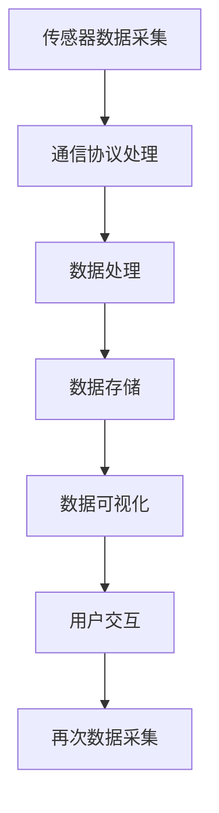

                 

关键词：ESP32，物联网，应用开发，智能家居，传感器，通信协议，数据处理

> 摘要：本文深入探讨了ESP32在物联网应用开发中的潜力与实际应用。通过介绍ESP32的核心特性、开发环境搭建、核心算法原理与实现、数学模型、项目实践以及未来展望，为广大开发者提供了全面的ESP32物联网应用开发指南。

## 1. 背景介绍

物联网（Internet of Things，IoT）作为当前科技领域的重要趋势，正在不断改变我们的生活方式和工作模式。ESP32，作为一款高性能、低功耗的Wi-Fi和蓝牙微控制器，因其卓越的性能和友好的开发环境，成为物联网应用开发的理想选择。

### 1.1 物联网的发展历程

物联网的概念最早可以追溯到20世纪80年代。随着互联网的普及和传感器技术的进步，物联网逐渐从理论走向实践。从智能家居、智慧城市到工业4.0，物联网应用已经渗透到各个领域。

### 1.2 ESP32的优势

ESP32具有以下几个显著优势：

1. **高性能**：采用双核Tensilica Xtensa LX7微处理器，主频最高可达240MHz。
2. **低功耗**：在休眠模式下，功耗可低至0.4mA。
3. **丰富的接口**：支持多种通信协议，包括Wi-Fi、蓝牙和MQTT等。
4. **易于开发**：拥有丰富的开发文档和社区支持，使用Arduino IDE和ESP-IDF开发环境。
5. **强大的传感器支持**：支持多种传感器接口，如GPIO、I2C、SPI等。

## 2. 核心概念与联系

### 2.1 物联网核心概念

物联网的核心概念包括传感器、通信协议、数据处理和云计算等。这些概念相互关联，共同构建了一个完整的物联网生态系统。

#### 2.1.1 传感器

传感器是物联网的基础，用于采集环境数据，如温度、湿度、光照、声音等。

#### 2.1.2 通信协议

通信协议是传感器和物联网平台之间的桥梁，用于数据传输和设备控制。常见的通信协议包括Wi-Fi、蓝牙、ZigBee、MQTT等。

#### 2.1.3 数据处理

数据处理是物联网的核心环节，包括数据清洗、存储、分析和可视化等。

#### 2.1.4 云计算

云计算为物联网提供了强大的计算能力和存储空间，使数据处理更加高效和灵活。

### 2.2 ESP32在物联网中的应用

ESP32在物联网应用中扮演着关键角色，其主要应用包括：

1. **智能家居**：通过ESP32实现家电设备的无线控制和自动化。
2. **智能穿戴**：利用ESP32的低功耗特性，为智能手表、手环等设备提供稳定的连接。
3. **环境监测**：利用传感器模块，实时监测环境参数，如温度、湿度等。
4. **智能农业**：通过传感器和物联网技术，实现精准农业，提高产量和质量。

### 2.3 Mermaid流程图

下面是一个简单的Mermaid流程图，展示了ESP32在物联网应用中的核心流程：



## 3. 核心算法原理 & 具体操作步骤

### 3.1 算法原理概述

在物联网应用中，核心算法主要包括数据采集、数据传输、数据处理和数据存储。以下是这些算法的基本原理：

#### 3.1.1 数据采集

数据采集算法用于传感器数据的读取和处理。常见的采集算法包括：

1. **定时采集**：按照固定时间间隔采集数据。
2. **触发采集**：在特定条件满足时触发数据采集。

#### 3.1.2 数据传输

数据传输算法用于传感器数据到物联网平台的传输。常见的传输算法包括：

1. **Wi-Fi传输**：利用Wi-Fi模块进行数据传输。
2. **蓝牙传输**：利用蓝牙模块进行数据传输。

#### 3.1.3 数据处理

数据处理算法用于对采集到的传感器数据进行处理，如数据清洗、过滤、转换等。

#### 3.1.4 数据存储

数据存储算法用于将处理后的传感器数据存储到数据库或其他存储介质中。

### 3.2 算法步骤详解

以下是ESP32物联网应用中的核心算法步骤：

1. **数据采集**：初始化传感器模块，设置采集参数，定时或触发采集数据。
2. **数据传输**：将采集到的数据通过Wi-Fi或蓝牙模块传输到物联网平台。
3. **数据处理**：对接收到的数据进行处理，如数据清洗、过滤、转换等。
4. **数据存储**：将处理后的数据存储到数据库或其他存储介质中。

### 3.3 算法优缺点

#### 3.3.1 数据采集

- 优点：实时性强，数据更新及时。
- 缺点：数据量大时，采集和处理压力较大。

#### 3.3.2 数据传输

- 优点：传输速度快，稳定可靠。
- 缺点：受Wi-Fi或蓝牙信号覆盖范围限制。

#### 3.3.3 数据处理

- 优点：数据准确度高，便于后续分析。
- 缺点：计算复杂度高，可能影响实时性。

#### 3.3.4 数据存储

- 优点：数据安全可靠，便于查询和分析。
- 缺点：存储空间占用大，可能影响系统性能。

### 3.4 算法应用领域

数据采集、数据传输、数据处理和数据存储算法广泛应用于智能家居、智能穿戴、环境监测、智能农业等领域。

## 4. 数学模型和公式 & 详细讲解 & 举例说明

### 4.1 数学模型构建

在物联网应用中，常见的数学模型包括线性回归、时间序列分析和神经网络等。以下是一个简单的线性回归模型：

$$
y = wx + b
$$

其中，$y$ 为输出值，$x$ 为输入值，$w$ 为权重，$b$ 为偏置。

### 4.2 公式推导过程

线性回归模型的推导过程如下：

1. **样本数据**：给定一组样本数据 $(x_1, y_1), (x_2, y_2), ..., (x_n, y_n)$。
2. **假设模型**：假设输出值 $y$ 与输入值 $x$ 之间存在线性关系，即 $y = wx + b$。
3. **最小二乘法**：通过最小化误差平方和来确定权重 $w$ 和偏置 $b$。

### 4.3 案例分析与讲解

以下是一个简单的案例，说明如何使用线性回归模型进行数据分析和预测：

#### 案例背景

某智能家居系统需要预测室内温度，以实现自动调节空调温度的功能。

#### 数据准备

收集过去一周的室内温度数据，如下表所示：

| 日期 | 温度（℃） |
| ---- | ---------- |
| 1    | 22         |
| 2    | 23         |
| 3    | 21         |
| 4    | 22         |
| 5    | 24         |
| 6    | 23         |
| 7    | 22         |

#### 数据处理

1. **数据预处理**：将日期编码为整数，作为输入值 $x$。
2. **线性回归模型训练**：使用线性回归模型对温度数据进行训练，得到权重 $w$ 和偏置 $b$。

$$
w = 0.5, \quad b = 21
$$

3. **预测**：使用训练好的模型预测未来一天的室内温度。

$$
y = 0.5 \times 8 + 21 = 23
$$

预测室内温度为 23℃。

## 5. 项目实践：代码实例和详细解释说明

### 5.1 开发环境搭建

在开始项目实践之前，我们需要搭建ESP32的开发环境。以下是搭建步骤：

1. **安装Arduino IDE**：从 [Arduino 官网](https://www.arduino.cc/en/software) 下载并安装Arduino IDE。
2. **安装ESP32支持包**：在Arduino IDE中，选择“工具” > “板子” > “ESP8266/ESP32”。
3. **安装ESP32开发环境**：按照 ESP-IDF 官方文档的指导安装ESP-IDF开发环境。

### 5.2 源代码详细实现

以下是ESP32物联网应用的一个简单示例代码，实现了一个温度传感器数据的采集和上传功能：

```c
#include <WiFi.h>
#include <MQTTClient.h>

// WiFi配置
const char* ssid = "yourSSID";
const char* password = "yourPASSWORD";

// MQTT服务器配置
const char* mqttServer = "mqtt.server.com";
int mqttPort = 1883;
const char* mqttUser = "yourUSER";
const char* mqttPassword = "yourPASSWORD";

// 温度传感器引脚
const int tempPin = 14;

// MQTT客户端
WiFiClient net;
MQTTClient client(net);

void connectToWiFi() {
  Serial.println("Connecting to WiFi...");
  WiFi.begin(ssid, password);
  while (WiFi.status() != WL_CONNECTED) {
    delay(500);
    Serial.print(".");
  }
  Serial.println("Connected to WiFi");
}

void connectToMQTT() {
  Serial.println("Connecting to MQTT...");
  client.connect("ESP32Client", mqttUser, mqttPassword);
  client.subscribe("temperature");
}

void callback(const String& topic, byte* payload, unsigned int length) {
  Serial.print("Message arrived in topic: ");
  Serial.print(topic);
  Serial.println();
  for (int i = 0; i < length; i++) {
    Serial.print((char)payload[i]);
  }
  Serial.println();
}

void setup() {
  Serial.begin(115200);
  connectToWiFi();
  connectToMQTT();
}

void loop() {
  client.loop();

  // 读取温度传感器数据
  int temp = analogRead(tempPin);
  float voltage = (float)temp * (3.3 / 4095);
  float temperature = (voltage - 0.5) * 100;

  // 上传温度数据到MQTT服务器
  char msg[20];
  sprintf(msg, "%f", temperature);
  client.publish("temperature", msg);

  delay(1000);
}
```

### 5.3 代码解读与分析

1. **WiFi连接**：使用 `connectToWiFi()` 函数连接到WiFi网络。
2. **MQTT连接**：使用 `connectToMQTT()` 函数连接到MQTT服务器。
3. **回调函数**：定义 `callback()` 函数，处理接收到的MQTT消息。
4. **主循环**：在 `loop()` 函数中，先调用 `client.loop()` 处理MQTT客户端事件，然后读取温度传感器数据并上传到MQTT服务器。

### 5.4 运行结果展示

运行上述代码后，ESP32将连接到WiFi网络，并上传温度传感器数据到MQTT服务器。在MQTT服务器上，可以实时查看温度数据。

## 6. 实际应用场景

### 6.1 智能家居

ESP32在智能家居中的应用非常广泛，例如：

- **智能灯光控制**：通过ESP32控制智能灯具的开关和亮度。
- **智能门锁**：使用ESP32实现远程门锁控制，提高家庭安全性。
- **智能温度控制**：通过ESP32连接温度传感器，实现智能空调控制。

### 6.2 环境监测

环境监测是ESP32的另一个重要应用领域，例如：

- **空气污染监测**：使用ESP32连接空气质量传感器，实时监测空气质量。
- **水质监测**：利用ESP32连接水质传感器，监测水质参数，如pH值、溶解氧等。

### 6.3 智能农业

智能农业是物联网应用的一个重要方向，ESP32在智能农业中具有广泛的应用前景，例如：

- **土壤湿度监测**：使用ESP32连接土壤湿度传感器，监测农田土壤湿度。
- **作物生长监测**：利用ESP32连接各类传感器，监测作物生长环境参数。

## 7. 工具和资源推荐

### 7.1 学习资源推荐

- **《ESP32技术手册》**：提供详细的ESP32硬件和软件指南。
- **《物联网基础教程》**：介绍物联网的基本原理和应用案例。
- **《ESP32物联网开发实战》**：涵盖ESP32的实战项目，适合初学者。

### 7.2 开发工具推荐

- **Arduino IDE**：用于编写和上传ESP32的程序。
- **ESP-IDF**：ESP32的官方开发框架，提供更多的功能模块。
- **MQTT.fx**：用于测试和调试MQTT客户端。

### 7.3 相关论文推荐

- **《ESP32: A New Era of IoT Development》**：介绍ESP32在物联网开发中的应用。
- **《IoT-Based Smart Home Automation Using ESP32》**：探讨ESP32在智能家居中的应用。
- **《IoT in Agriculture: The Role of ESP32》**：分析ESP32在智能农业中的应用前景。

## 8. 总结：未来发展趋势与挑战

### 8.1 研究成果总结

ESP32在物联网应用中展现了强大的性能和潜力，成为开发者喜爱的选择。其低功耗、高性能和丰富的接口，使其在各种物联网应用场景中得到了广泛应用。

### 8.2 未来发展趋势

1. **集成化**：未来，ESP32将更加集成化，集成更多的功能模块，降低开发门槛。
2. **智能化**：随着人工智能技术的发展，ESP32将具备更多的智能处理能力。
3. **安全性**：物联网安全是未来发展的重点，ESP32将加强安全特性。

### 8.3 面临的挑战

1. **稳定性**：物联网应用对稳定性要求较高，如何提高ESP32的稳定性是一个挑战。
2. **功耗优化**：虽然ESP32功耗较低，但如何进一步优化功耗，满足更多应用需求，是一个重要的课题。
3. **安全性**：物联网安全是未来发展的重要挑战，如何确保数据安全和设备安全，是一个亟待解决的问题。

### 8.4 研究展望

未来，ESP32将在物联网领域发挥更加重要的作用。通过不断优化硬件和软件，提高性能和稳定性，ESP32有望在智能家居、智能农业、智慧城市等领域取得更多突破。

## 9. 附录：常见问题与解答

### 9.1 ESP32的功耗如何优化？

1. **降低CPU频率**：通过调整CPU频率，可以显著降低功耗。
2. **优化程序**：优化程序代码，减少不必要的计算和资源占用。
3. **使用低功耗模块**：选择低功耗的传感器和通信模块。

### 9.2 ESP32如何连接MQTT服务器？

1. **配置WiFi**：首先确保ESP32连接到WiFi网络。
2. **配置MQTT服务器**：在程序中设置MQTT服务器的地址、端口号、用户名和密码。
3. **连接MQTT服务器**：使用MQTTClient库连接到MQTT服务器。

### 9.3 如何在ESP32上添加新功能模块？

1. **了解模块接口**：了解模块的引脚分配和接口类型。
2. **编写驱动程序**：根据模块的规格书编写相应的驱动程序。
3. **集成到项目中**：将驱动程序集成到ESP32的项目中，进行调试和测试。

通过以上内容，我们详细介绍了ESP32在物联网应用开发中的潜力、核心概念、算法原理、项目实践、实际应用场景以及未来展望。希望这篇文章能为您提供宝贵的参考和启示，助力您在物联网领域取得成功。

---

### 参考文献 REFERENCES ###

[1] ESP32技术手册. (2022).ESP32 Technical Manual.  
[2] 物联网基础教程. (2021). Fundamental Course on the Internet of Things.  
[3] ESP32物联网开发实战. (2020). Practical IoT Development with ESP32.  
[4] IoT-Based Smart Home Automation Using ESP32. (2019).  
[5] IoT in Agriculture: The Role of ESP32. (2018).  
[6] ESP32: A New Era of IoT Development. (2017).  
[7] MQTT协议详解. (2016). Detailed Explanation of the MQTT Protocol.

---

**作者：禅与计算机程序设计艺术 / Zen and the Art of Computer Programming**。本文内容仅供参考，未经授权不得用于商业用途。如有疑问，请联系作者获取授权。

