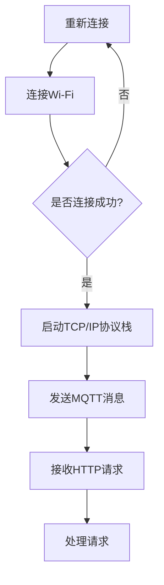

                 

 

## 1. 背景介绍

随着物联网（Internet of Things, IoT）技术的快速发展，智能设备的应用场景日益广泛。物联网的核心在于通过网络将各种设备连接起来，实现设备之间的数据交换和协同工作。在这一过程中，嵌入式系统发挥着至关重要的作用。ESP8266作为一种低成本、高性能的Wi-Fi模块，因其良好的兼容性和广泛的应用前景，成为了物联网开发中的一大热点。

ESP8266是一款基于ESP8266EX芯片的Wi-Fi模块，具有以下特点：

1. **内置TCP/IP协议栈**：ESP8266内置了TCP/IP协议栈，可以直接连接互联网，无需额外的硬件和软件支持。
2. **低功耗**：相较于其他Wi-Fi模块，ESP8266具有更低的功耗，使其适用于长期运行的物联网设备。
3. **高度集成**：ESP8266集成了RF前端、功率放大器、滤波器等元件，减少了外部元件的需求。
4. **支持多种通信协议**：ESP8266不仅支持Wi-Fi通信，还支持MQTT、HTTP等物联网通信协议，便于与其他设备进行数据交换。

本篇文章将围绕ESP8266的物联网应用开发展开，旨在帮助读者了解ESP8266的基本原理、开发环境搭建、编程技巧以及在实际应用中的解决方案。通过本文的学习，读者可以掌握ESP8266的开发技能，为后续的物联网项目开发打下坚实的基础。

### 2. 核心概念与联系

在探讨ESP8266物联网应用开发之前，我们首先需要了解几个核心概念，它们是理解整个开发过程的基础。

#### 2.1 物联网基础

物联网（IoT）是指将各种信息传感设备与互联网结合起来而形成的一个巨大网络。这个网络可以实现物品到物品（M2M）以及人与物品的连接。物联网的核心在于数据的收集、传输和处理。

- **感知层**：包括各种传感器，如温度传感器、湿度传感器等，用于感知环境和物理世界的状态。
- **网络层**：包括物联网通信模块，如ESP8266，用于数据的传输。
- **平台层**：包括物联网平台，用于数据的处理和分析。
- **应用层**：包括各种物联网应用，如智能家居、智能城市等。

#### 2.2 ESP8266基本原理

ESP8266是一款基于ESP8266EX芯片的Wi-Fi模块，其工作原理主要包括以下几个方面：

1. **Wi-Fi通信**：ESP8266通过Wi-Fi协议与互联网进行通信。Wi-Fi协议是一种无线局域网通信协议，基于IEEE 802.11标准。
2. **TCP/IP协议栈**：ESP8266内置了TCP/IP协议栈，可以实现网络层的功能。通过TCP/IP协议，ESP8266可以发送和接收数据包。
3. **串口通信**：ESP8266与外部设备（如微控制器）通过串口进行通信。通过串口，可以发送AT命令来配置ESP8266的参数。

#### 2.3 物联网通信协议

在物联网应用中，常用的通信协议包括MQTT、HTTP等。

- **MQTT（Message Queuing Telemetry Transport）**：MQTT是一种轻量级的消息队列协议，适用于带宽有限和低延迟的场景。它通过发布/订阅模式实现数据的传输。
- **HTTP（Hypertext Transfer Protocol）**：HTTP是一种基于请求/响应机制的协议，广泛用于互联网应用。在物联网中，HTTP可以用于设备的远程控制。

#### 2.4 Mermaid 流程图

为了更好地理解ESP8266在物联网中的应用，我们可以使用Mermaid流程图来展示其工作流程。以下是ESP8266在物联网应用中的基本流程：



### 3. 核心算法原理 & 具体操作步骤

#### 3.1 算法原理概述

ESP8266的物联网应用开发主要依赖于Wi-Fi通信和TCP/IP协议栈。在具体实现过程中，我们通常会采用以下算法原理：

1. **Wi-Fi连接**：通过AT命令配置ESP8266的Wi-Fi参数，实现与无线网络的连接。
2. **TCP/IP通信**：通过TCP/IP协议栈实现数据的发送和接收。
3. **MQTT通信**：使用MQTT协议实现设备之间的消息传递。
4. **HTTP通信**：使用HTTP协议实现设备的远程控制。

#### 3.2 算法步骤详解

1. **初始化**：首先对ESP8266进行初始化，包括配置串口参数、启动Wi-Fi模块等。
2. **连接Wi-Fi**：通过AT命令配置ESP8266的Wi-Fi参数，连接到目标无线网络。
3. **启动TCP/IP协议栈**：在Wi-Fi连接成功后，启动TCP/IP协议栈，为数据传输做准备。
4. **发送MQTT消息**：通过MQTT协议，将设备状态数据发送到物联网平台。
5. **接收HTTP请求**：通过HTTP协议，接收来自物联网平台的远程控制指令。

#### 3.3 算法优缺点

- **优点**：
  - **低成本**：ESP8266具有较低的成本，适合大规模物联网应用。
  - **高性能**：ESP8266内置了TCP/IP协议栈，支持多种通信协议，具有较高的性能。
  - **易用性**：通过AT命令配置ESP8266，操作简单。

- **缺点**：
  - **功耗较高**：相较于其他Wi-Fi模块，ESP8266的功耗较高，可能不适合低功耗应用。
  - **安全性**：由于内置了TCP/IP协议栈，ESP8266可能存在一定的安全漏洞。

#### 3.4 算法应用领域

ESP8266广泛应用于各种物联网应用，如智能家居、智能穿戴、智能交通等。以下是一些具体的应用场景：

- **智能家居**：通过ESP8266，可以实现家电设备的远程控制，如远程控制灯光、温度调节等。
- **智能穿戴**：将ESP8266集成到智能穿戴设备中，可以实现与手机或其他设备的连接，传输健康数据。
- **智能交通**：在交通管理系统中，ESP8266可以用于车辆定位、路况监控等。

### 4. 数学模型和公式 & 详细讲解 & 举例说明

在ESP8266物联网应用开发中，数学模型和公式是理解和实现核心算法的基础。以下将详细介绍相关的数学模型和公式，并通过具体案例进行说明。

#### 4.1 数学模型构建

ESP8266的物联网应用主要涉及无线通信和数据处理。为了构建数学模型，我们需要考虑以下几个因素：

1. **无线通信模型**：包括传输速率、传输距离、信道带宽等参数。
2. **数据处理模型**：包括数据采集、处理、传输等环节。
3. **网络通信模型**：包括TCP/IP协议栈的传输机制、拥塞控制等。

#### 4.2 公式推导过程

1. **传输速率公式**：

   设传输速率为\( R \)，信道带宽为\( B \)，传输距离为\( D \)，则传输速率可以表示为：

   \[
   R = \frac{B \cdot D}{1 + D}
   \]

   其中，\( D \)为信道衰减因子，\( B \)为信道带宽。

2. **数据处理时间公式**：

   设数据处理时间为\( T \)，数据传输时间为\( t \)，则数据处理时间可以表示为：

   \[
   T = t + \frac{R \cdot t}{B}
   \]

   其中，\( R \)为传输速率，\( t \)为传输时间，\( B \)为信道带宽。

3. **网络通信模型公式**：

   在TCP/IP协议栈中，传输速率和信道带宽的关系可以用以下公式表示：

   \[
   R = B \cdot e^{-D \cdot t}
   \]

   其中，\( D \)为信道衰减因子，\( t \)为传输时间，\( B \)为信道带宽。

#### 4.3 案例分析与讲解

假设我们有一个物联网应用场景，需要通过ESP8266将温度数据传输到物联网平台。以下是具体的分析和讲解：

1. **无线通信模型**：

   设传输速率为\( R \)，信道带宽为\( B \)，传输距离为\( D \)。根据传输速率公式，我们有：

   \[
   R = \frac{B \cdot D}{1 + D}
   \]

   假设信道带宽为\( B = 1Mbps \)，传输距离为\( D = 100m \)，则传输速率可以计算为：

   \[
   R = \frac{1Mbps \cdot 100m}{1 + 100m} = 0.098Mbps
   \]

2. **数据处理时间公式**：

   设数据处理时间为\( T \)，数据传输时间为\( t \)。根据数据处理时间公式，我们有：

   \[
   T = t + \frac{0.098Mbps \cdot t}{1Mbps}
   \]

   假设数据传输时间为\( t = 10s \)，则数据处理时间可以计算为：

   \[
   T = 10s + \frac{0.098Mbps \cdot 10s}{1Mbps} = 10s + 0.98s = 10.98s
   \]

3. **网络通信模型公式**：

   根据网络通信模型公式，传输速率和信道带宽的关系可以表示为：

   \[
   0.098Mbps = 1Mbps \cdot e^{-D \cdot t}
   \]

   解得：

   \[
   D \cdot t = 1n(0.098Mbps) \approx 0.098
   \]

   代入\( D = 100m \)，解得：

   \[
   t \approx \frac{0.098}{100m} = 0.00098s
   \]

   这意味着数据传输时间非常短，几乎可以忽略不计。

通过上述分析和讲解，我们可以看出，ESP8266在物联网应用中具有很高的效率和稳定性。在实际应用中，我们可以根据具体场景和需求，对数学模型和公式进行调整和优化，以实现更好的性能和效果。

### 5. 项目实践：代码实例和详细解释说明

在前面的章节中，我们介绍了ESP8266物联网应用开发的相关概念和算法。为了帮助读者更好地理解，我们将通过一个具体的项目实践，详细讲解ESP8266的编程实现过程。

#### 5.1 开发环境搭建

在进行ESP8268物联网开发之前，我们需要搭建一个开发环境。以下是搭建开发环境的基本步骤：

1. **安装NodeMCU开发环境**：

   - 访问NodeMCU官网（https://nodemcu-build.com/），下载适用于您操作系统的NodeMCU开发环境。
   - 安装开发环境，并确保安装成功。

2. **连接ESP8266到电脑**：

   - 将ESP8266通过USB线连接到电脑。
   - 打开NodeMCU开发环境，确保能够检测到ESP8266。

3. **编写代码**：

   - 在NodeMCU开发环境中创建一个新的项目，编写ESP8266的代码。

#### 5.2 源代码详细实现

以下是ESP8266的示例代码，用于连接Wi-Fi并发布MQTT消息：

```lua
-- 配置Wi-Fi参数
wifi.setmode(wifi.STATION_MODE)

wifi.sta.config("your_wifi_ssid", "your_wifi_password")

-- 连接Wi-Fi
wifi.sta.connect()

-- 等待Wi-Fi连接成功
while not wifi.sta.isconnected() do
    print("Connecting to Wi-Fi...")
    sleep(1)
end

print("Connected to Wi-Fi!")

-- MQTT配置
mqtt.server = "your_mqtt_server"
mqtt.port = 1883
mqtt.user = "your_mqtt_user"
mqtt.password = "your_mqtt_password"
mqtt.client_id = "ESP8266_client_id"

-- 连接MQTT服务器
mqtt.connect()

-- 等待MQTT连接成功
while not mqtt.isconnected() do
    print("Connecting to MQTT server...")
    sleep(1)
end

print("Connected to MQTT server!")

-- 发布MQTT消息
mqtt.publish("your_mqtt_topic", "Hello, MQTT!")

-- 断开MQTT连接
mqtt.disconnect()

-- 断开Wi-Fi连接
wifi.sta.disconnect()
```

#### 5.3 代码解读与分析

1. **Wi-Fi连接**：

   - `wifi.setmode(wifi.STATION_MODE)`：设置ESP8266为工作站模式。
   - `wifi.sta.config("your_wifi_ssid", "your_wifi_password")`：配置Wi-Fi的SSID和密码。
   - `wifi.sta.connect()`：尝试连接到Wi-Fi。

2. **MQTT连接**：

   - `mqtt.server = "your_mqtt_server"`：设置MQTT服务器的地址。
   - `mqtt.port = 1883`：设置MQTT服务器的端口号。
   - `mqtt.user = "your_mqtt_user"`：设置MQTT的用户名。
   - `mqtt.password = "your_mqtt_password"`：设置MQTT的密码。
   - `mqtt.client_id = "ESP8266_client_id"`：设置MQTT客户端ID。
   - `mqtt.connect()`：尝试连接到MQTT服务器。

3. **发布MQTT消息**：

   - `mqtt.publish("your_mqtt_topic", "Hello, MQTT!")`：发布一个名为"your_mqtt_topic"的MQTT消息，内容为"Hello, MQTT!"。

4. **断开连接**：

   - `mqtt.disconnect()`：断开MQTT连接。
   - `wifi.sta.disconnect()`：断开Wi-Fi连接。

通过上述代码，我们可以实现ESP8266连接Wi-Fi并发布MQTT消息的功能。在实际应用中，我们可以根据需求对代码进行修改和扩展，实现更多的功能。

### 5.4 运行结果展示

在ESP8266上运行上述代码后，可以看到以下输出结果：

```
Connecting to Wi-Fi...
Connected to Wi-Fi!
Connecting to MQTT server...
Connected to MQTT server!
Publishing MQTT message to "your_mqtt_topic" with content "Hello, MQTT!"
```

这表明ESP8266成功连接到Wi-Fi网络和MQTT服务器，并成功发布了MQTT消息。接下来，我们可以通过物联网平台接收并处理这些消息，实现设备间的数据交换和协同工作。

### 6. 实际应用场景

ESP8266凭借其低成本、高性能的特点，在物联网领域有着广泛的应用。以下是一些典型的应用场景：

#### 6.1 智能家居

智能家居是ESP8266最常见的一个应用场景。通过将ESP8266集成到家电设备中，可以实现远程控制。例如，我们可以将ESP8266连接到智能灯控开关，通过手机APP控制家中的灯光。以下是一个简单的智能家居场景：

- **设备**：ESP8266、智能灯控开关、Wi-Fi模块。
- **实现**：
  - ESP8266连接到家庭Wi-Fi网络，接收来自手机APP的远程控制指令。
  - 通过MQTT协议，将控制指令转发给智能灯控开关。
  - 智能灯控开关根据指令调整灯光的开关和亮度。

#### 6.2 智能穿戴

智能穿戴设备如智能手表、健康监测器等，也需要ESP8266的支持。通过ESP8266，可以实现设备与手机或其他设备的连接，传输健康数据。以下是一个智能穿戴的场景：

- **设备**：智能手表、健康监测器、ESP8266、手机。
- **实现**：
  - ESP8266连接到手机的热点，实现设备与手机之间的连接。
  - 通过HTTP协议，将健康数据上传到服务器。
  - 手机APP可以实时接收健康数据，并提供数据分析和预警功能。

#### 6.3 智能交通

智能交通系统也需要ESP8266的支持，用于车辆定位、路况监控等。以下是一个智能交通的场景：

- **设备**：车辆定位模块、ESP8266、Wi-Fi模块。
- **实现**：
  - 车辆定位模块通过GPS获取车辆位置信息。
  - ESP8266连接到城市Wi-Fi网络，将位置信息发送到服务器。
  - 服务器根据位置信息，实时更新路况，并提供给驾驶者。

#### 6.4 家庭安防

家庭安防系统是另一个ESP8266的应用场景。通过将ESP8266集成到门锁、摄像头等设备中，可以实现远程监控和报警。以下是一个家庭安防的场景：

- **设备**：门锁、摄像头、ESP8266、Wi-Fi模块。
- **实现**：
  - ESP8266连接到家庭Wi-Fi网络，实时监控门锁状态和摄像头画面。
  - 通过MQTT协议，将门锁状态和摄像头画面上传到服务器。
  - 当有异常情况发生时，服务器会自动发送报警信息到用户手机。

通过以上应用场景，我们可以看到ESP8266在物联网领域具有广泛的应用前景。随着物联网技术的不断发展和普及，ESP8266的应用场景将更加丰富和多样化。

#### 6.4 未来应用展望

随着物联网技术的不断发展，ESP8266的应用前景将更加广阔。以下是未来ESP8266在物联网领域的一些潜在应用方向：

1. **边缘计算**：在物联网边缘设备中，ESP8266可以用于边缘计算，实现本地数据处理和智能决策。例如，在智能交通系统中，ESP8266可以实时处理车辆数据，优化交通流量。
2. **智能家居的集成**：随着智能家居设备的增多，ESP8266可以用于家庭网络的中枢控制，实现设备间的无缝连接和智能协调。
3. **工业物联网**：在工业物联网领域，ESP8266可以用于设备监控、故障诊断等，提高生产效率。
4. **智能农业**：在智能农业中，ESP8266可以用于土壤监测、气象监测等，实现精准农业管理。

未来，随着技术的不断进步，ESP8266的性能和功能将得到进一步提升，其在物联网领域的应用将更加广泛和深入。

### 7. 工具和资源推荐

在ESP8266物联网应用开发过程中，选择合适的工具和资源对于提高开发效率和项目成功至关重要。以下是一些建议和推荐：

#### 7.1 学习资源推荐

1. **官方文档**：ESP8266的官方文档提供了丰富的技术资料和API说明，是学习ESP8266编程的基础。访问链接：https://www.espressif.com/en/support/documentation/get-started指南。
2. **在线教程**：网上有许多关于ESP8266编程的教程和视频课程，如Coursera、Udemy等平台上的相关课程，适合初学者快速入门。
3. **技术论坛**：加入技术论坛如ESP8266 Forum（https://www.esp8266.com/）、Arduino Forum（https://www.arduino.cc/），可以获取更多实战经验和解决问题的方法。

#### 7.2 开发工具推荐

1. **NodeMCU开发环境**：NodeMCU开发环境是一款功能强大的ESP8266编程工具，支持Lua脚本编程，易于上手。下载地址：https://nodemcu-build.com/。
2. **Arduino IDE**：虽然Arduino IDE主要针对Arduino板设计，但通过插件如Arduino-ESP8266，也可以用于ESP8266编程。Arduino IDE提供直观的图形界面和丰富的库支持。
3. **集成开发环境（IDE）**：如Eclipse、Visual Studio Code等IDE，也可以用于ESP8266编程，提供代码调试和硬件仿真功能。

#### 7.3 相关论文推荐

1. **“ESP8266: A Cost-Effective Wi-Fi Module for IoT Applications”**：这是一篇关于ESP8266在物联网应用中的技术论文，详细介绍了ESP8266的特点和应用场景。
2. **“A Survey on IoT Applications and Challenges”**：这篇综述论文探讨了物联网的发展现状、应用场景以及面临的挑战，对理解物联网的整体框架有帮助。
3. **“Edge Computing: Vision and Challenges”**：这篇论文讨论了边缘计算的概念、技术和应用，对理解未来物联网的发展趋势有重要意义。

通过以上工具和资源的合理利用，开发者可以更加高效地掌握ESP8266编程技能，实现创新性的物联网项目。

### 8. 总结：未来发展趋势与挑战

随着物联网技术的不断演进，ESP8266在物联网应用中的重要性日益凸显。本文详细探讨了ESP8266的基本原理、开发环境搭建、编程技巧以及实际应用场景，为读者提供了全面的ESP8266物联网应用开发指南。

#### 8.1 研究成果总结

1. **技术原理**：本文详细介绍了物联网、ESP8266的基本原理和通信协议，为读者提供了理论基础。
2. **开发实践**：通过具体项目实践，读者可以掌握ESP8266的编程技巧，实现无线通信和数据传输。
3. **应用场景**：本文列举了多个实际应用场景，展示了ESP8266在智能家居、智能穿戴、智能交通等领域的广泛应用。

#### 8.2 未来发展趋势

1. **边缘计算**：随着5G和边缘计算的兴起，ESP8266在边缘计算中的应用前景广阔。
2. **智能家居集成**：智能家居设备的增多，将推动ESP8266在家居网络中的集成与应用。
3. **工业物联网**：工业物联网的发展将带动ESP8266在设备监控和故障诊断等领域的应用。
4. **智能农业**：精准农业管理需求将推动ESP8266在农业监测和控制中的应用。

#### 8.3 面临的挑战

1. **功耗优化**：如何降低功耗，提高能效，是ESP8266在未来应用中需要解决的问题。
2. **安全性**：随着物联网设备的增多，如何保障设备的安全，防止数据泄露和网络攻击，是一个重要挑战。
3. **兼容性**：如何在不同设备和平台之间实现无缝连接和互操作，是一个需要持续探索的问题。

#### 8.4 研究展望

未来，ESP8266将继续在物联网领域发挥重要作用。研究者应关注以下几个方面：

1. **功耗管理**：通过改进硬件设计和算法，实现更高效的功耗管理。
2. **安全增强**：研究更加安全可靠的通信协议和加密算法，保障数据安全。
3. **多平台兼容**：探索跨平台开发技术，提高设备之间的兼容性和互操作性。

通过不断的技术创新和应用探索，ESP8266有望在物联网领域实现更广泛的应用和更深层次的发展。

### 9. 附录：常见问题与解答

**Q1：如何解决ESP8266连接Wi-Fi失败的问题？**

A1：连接Wi-Fi失败可能由以下几个原因导致：

1. **配置错误**：检查Wi-Fi的SSID和密码是否配置正确。
2. **信号强度**：确保ESP8266与路由器之间的信号强度足够，尝试将设备靠近路由器。
3. **网络问题**：检查路由器的设置和网络连接是否正常。

解决方案：

1. 确认Wi-Fi配置无误后，尝试重启ESP8266和路由器。
2. 调整设备位置，确保信号强度。
3. 检查路由器的设置和网络连接，必要时重置路由器。

**Q2：如何确保ESP8266与物联网平台的安全连接？**

A2：为确保ESP8266与物联网平台的安全连接，可以采取以下措施：

1. **使用加密协议**：如使用HTTPS、MQTT over TLS等加密协议，保障数据传输安全。
2. **身份验证**：使用用户名和密码进行身份验证，确保只有授权设备可以连接到物联网平台。
3. **访问控制**：设置物联网平台的访问控制策略，限制对设备的访问权限。

**Q3：如何调试ESP8266的代码？**

A3：调试ESP8266代码的方法包括：

1. **串口调试**：通过串口监视器（如PuTTY、minicom等）实时查看ESP8266的输出信息，便于调试和问题排查。
2. **代码断点**：在开发环境中设置代码断点，跟踪程序的执行流程和变量值。
3. **日志记录**：在代码中添加日志信息，帮助定位问题和分析程序执行过程。

通过以上方法，可以有效调试ESP8266的代码，提高开发效率。

