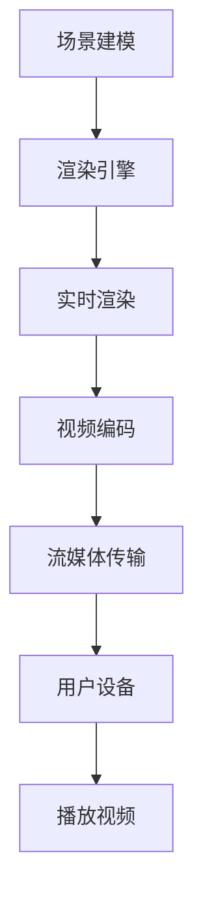

                 

关键词：FFmpeg、虚拟现实、视频编码、实时渲染、流媒体传输

摘要：本文将探讨 FFmpeg 在虚拟现实（VR）中的应用，从背景介绍、核心概念、算法原理、数学模型、项目实践、应用场景以及未来展望等方面，详细解析 FFmpeg 如何在 VR 领域发挥作用，为读者提供全面的技术参考。

## 1. 背景介绍

虚拟现实（Virtual Reality，VR）是一种通过计算机技术创造的模拟环境，用户可以在其中进行沉浸式交互。随着计算机图形学、传感器技术和显示技术的发展，VR 应用逐渐走进人们的日常生活。例如，在教育、医疗、娱乐等领域，VR 都展现出了巨大的潜力。

FFmpeg 是一个开源、跨平台的多媒体处理框架，主要用于视频、音频和图像数据的处理。它支持多种编解码器、容器格式、流媒体协议等，具有高效、灵活、易用的特点。FFmpeg 在多媒体领域有着广泛的应用，如视频编辑、直播、点播等。

本文将探讨 FFmpeg 在 VR 领域的应用，主要包括以下几个方面：

- FFmpeg 在 VR 视频编码和传输中的核心作用
- VR 视频编码算法及其优缺点
- FFmpeg 在 VR 实时渲染中的应用
- VR 流媒体传输技术及其优化策略
- VR 应用场景中的 FFmpeg 实践案例
- FFmpeg 在 VR 领域的未来发展展望

## 2. 核心概念与联系

### 2.1 VR 视频编码

VR 视频编码是将 VR 视频信号转换为数字信号的过程，以便于存储、传输和播放。VR 视频编码的关键在于如何高效地表示具有高分辨率、高动态范围和宽视角的视频内容。

#### 2.1.1 HEVC 编码

HEVC（High Efficiency Video Coding）是一种高效的视频编码标准，也称为 H.265。相比 H.264，HEVC 在保持相同视频质量的情况下，能够提供更高的压缩率。这对于 VR 视频的传输和存储具有重要意义。

#### 2.1.2 VR 视频编码算法

VR 视频编码算法主要包括以下几个方面：

- 视频内容分析：对 VR 视频中的运动、亮度、对比度等特性进行分析，以便选择合适的编码参数。
- 视频内容分割：将 VR 视频分为不同的区域，如前景、背景等，以便进行高效编码。
- 视频内容编码：使用 HEVC 等编码标准对 VR 视频内容进行编码。
- 视频内容解码：在接收端，使用 HEVC 等解码标准对 VR 视频内容进行解码。

### 2.2 VR 实时渲染

VR 实时渲染是将 VR 场景实时渲染成视频信号的过程，以便于用户在 VR 设备中观看。VR 实时渲染的关键在于如何高效地处理大规模三维场景，同时保证渲染质量。

#### 2.2.1 渲染引擎

VR 实时渲染通常使用渲染引擎，如 Unity、Unreal Engine 等。这些渲染引擎提供了丰富的三维图形处理功能，可以方便地实现 VR 场景的实时渲染。

#### 2.2.2 渲染流程

VR 实时渲染的流程主要包括以下几个方面：

- 场景建模：使用三维建模工具创建 VR 场景模型。
- 场景渲染：使用渲染引擎对 VR 场景进行实时渲染。
- 视频编码：将渲染结果转换为 VR 视频信号，以便进行传输和播放。

### 2.3 VR 流媒体传输

VR 流媒体传输是将 VR 视频信号通过网络传输到用户设备的过程。VR 流媒体传输的关键在于如何保证视频质量的同时，降低传输带宽和延迟。

#### 2.3.1 流媒体协议

VR 流媒体传输通常使用流媒体协议，如 HLS、DASH 等。这些协议支持自适应流媒体传输，可以根据用户设备的网络状况和性能自动调整视频质量。

#### 2.3.2 传输优化策略

VR 流媒体传输的优化策略主要包括以下几个方面：

- 带宽优化：根据用户设备的网络状况和性能，动态调整视频质量，降低带宽消耗。
- 延迟优化：通过优化网络传输路径、降低传输延迟，提高用户体验。
- 数据压缩：使用高效的视频编码标准，降低数据传输量，提高传输效率。

### 2.4 FFmpeg 在 VR 中的应用

FFmpeg 在 VR 中的应用主要体现在以下几个方面：

- VR 视频编码：使用 FFmpeg 对 VR 视频进行编码，实现高效的视频压缩。
- VR 实时渲染：使用 FFmpeg 提供的视频处理功能，对 VR 实时渲染结果进行后处理。
- VR 流媒体传输：使用 FFmpeg 提供的流媒体传输功能，实现 VR 视频的传输和播放。
- VR 应用开发：使用 FFmpeg 作为基础工具，开发 VR 应用程序，如 VR 视频编辑、直播等。

### 2.5 Mermaid 流程图

以下是一个 VR 视频处理流程的 Mermaid 流程图：



## 3. 核心算法原理 & 具体操作步骤

### 3.1 算法原理概述

在 VR 视频处理中，FFmpeg 的核心算法主要包括视频编码、实时渲染和流媒体传输三个方面。

- **视频编码**：使用 HEVC 等高效编码标准，对 VR 视频进行压缩，降低数据传输量，提高传输效率。
- **实时渲染**：使用渲染引擎，对 VR 场景进行实时渲染，生成高质量的 VR 视频信号。
- **流媒体传输**：使用 HLS、DASH 等流媒体协议，实现 VR 视频的自适应流媒体传输，提高用户体验。

### 3.2 算法步骤详解

#### 3.2.1 视频编码

1. **视频内容分析**：对 VR 视频中的运动、亮度、对比度等特性进行分析，以便选择合适的编码参数。
2. **视频内容分割**：将 VR 视频分为不同的区域，如前景、背景等，以便进行高效编码。
3. **视频内容编码**：使用 HEVC 等编码标准对 VR 视频内容进行编码，生成压缩后的 VR 视频流。
4. **视频内容解码**：在接收端，使用 HEVC 等解码标准对 VR 视频内容进行解码，还原原始视频信号。

#### 3.2.2 实时渲染

1. **场景建模**：使用三维建模工具创建 VR 场景模型。
2. **场景渲染**：使用渲染引擎，对 VR 场景进行实时渲染，生成高质量的 VR 视频信号。
3. **视频编码**：将渲染结果转换为 VR 视频信号，以便进行传输和播放。

#### 3.2.3 流媒体传输

1. **视频编码**：使用 FFmpeg 对 VR 视频进行编码，生成压缩后的 VR 视频流。
2. **流媒体协议**：使用 HLS、DASH 等流媒体协议，实现 VR 视频的自适应流媒体传输。
3. **数据传输**：将 VR 视频流通过网络传输到用户设备。
4. **播放视频**：在用户设备上播放 VR 视频流，实现沉浸式观看体验。

### 3.3 算法优缺点

#### 3.3.1 视频编码

- **优点**：
  - 高效压缩：使用 HEVC 等高效编码标准，可以显著降低 VR 视频的数据传输量。
  - 高质量输出：编码后的 VR 视频信号质量较高，可以满足用户对沉浸式观看体验的需求。
- **缺点**：
  - 编码复杂度较高：由于 VR 视频具有高分辨率、高动态范围和宽视角等特点，编码过程相对复杂，对计算资源要求较高。

#### 3.3.2 实时渲染

- **优点**：
  - 高质量渲染：使用渲染引擎，可以生成高质量的 VR 视频信号。
  - 实时性：实时渲染可以满足 VR 视频的实时传输和播放需求。
- **缺点**：
  - 资源消耗较大：实时渲染需要较高的计算资源和内存资源，对设备性能要求较高。

#### 3.3.3 流媒体传输

- **优点**：
  - 自适应传输：使用 HLS、DASH 等流媒体协议，可以实现 VR 视频的自适应流媒体传输，提高用户体验。
  - 灵活性：流媒体传输可以根据用户设备的网络状况和性能，动态调整视频质量。
- **缺点**：
  - 延迟较高：由于 VR 视频的数据量较大，流媒体传输过程中可能会产生一定的延迟，影响用户体验。

### 3.4 算法应用领域

- **教育**：VR 教育是一种新兴的教育模式，通过虚拟现实技术，为学生提供沉浸式的学习体验。FFmpeg 可以用于 VR 教育视频的编码、传输和播放。
- **医疗**：VR 医学是一种利用虚拟现实技术进行医学教育和手术模拟的方法。FFmpeg 可以用于 VR 医学视频的编码、传输和播放。
- **娱乐**：VR 游戏和 VR 视频是 VR 应用的重要领域。FFmpeg 可以用于 VR 游戏和 VR 视频的编码、传输和播放。
- **工业**：VR 工业应用包括 VR 训练、VR 维修等。FFmpeg 可以用于 VR 工业应用的视频处理和传输。

## 4. 数学模型和公式 & 详细讲解 & 举例说明

### 4.1 数学模型构建

在 VR 视频处理中，数学模型主要涉及视频编码、实时渲染和流媒体传输等方面。以下是一个简单的数学模型：

#### 4.1.1 视频编码模型

- **压缩率（C）**：表示视频数据的压缩程度，计算公式为：
  $$ C = \frac{原始数据量}{压缩后数据量} $$

- **比特率（R）**：表示视频数据在单位时间内的传输速率，计算公式为：
  $$ R = \frac{数据量}{时间} $$

- **视频质量（Q）**：表示视频信号的清晰度和主观感受，计算公式为：
  $$ Q = f(C, R) $$

#### 4.1.2 实时渲染模型

- **渲染时间（T）**：表示渲染一帧图像所需的时间，计算公式为：
  $$ T = \frac{渲染总时间}{帧数} $$

- **渲染质量（Q）**：表示渲染图像的质量，计算公式为：
  $$ Q = f(T) $$

#### 4.1.3 流媒体传输模型

- **带宽（B）**：表示网络传输通道的容量，计算公式为：
  $$ B = \frac{数据量}{时间} $$

- **传输延迟（D）**：表示数据从发送端传输到接收端所需的时间，计算公式为：
  $$ D = \frac{传输距离}{传输速度} $$

- **视频质量（Q）**：表示视频信号的清晰度和主观感受，计算公式为：
  $$ Q = f(B, D) $$

### 4.2 公式推导过程

#### 4.2.1 视频编码模型

压缩率（C）的推导过程：

- **原始数据量**：表示视频信号在未经压缩时的数据量，计算公式为：
  $$ 原始数据量 = 视频时长 \times 画面分辨率 \times 帧率 $$

- **压缩后数据量**：表示视频信号在经过压缩后的数据量，计算公式为：
  $$ 压缩后数据量 = 视频时长 \times 压缩率 \times 画面分辨率 \times 帧率 $$

- **压缩率（C）**：表示视频数据的压缩程度，计算公式为：
  $$ C = \frac{原始数据量}{压缩后数据量} $$

比特率（R）的推导过程：

- **数据量**：表示视频信号在单位时间内的数据量，计算公式为：
  $$ 数据量 = 视频时长 \times 画面分辨率 \times 帧率 $$

- **时间**：表示单位时间，计算公式为：
  $$ 时间 = 1 $$

- **比特率（R）**：表示视频数据在单位时间内的传输速率，计算公式为：
  $$ R = \frac{数据量}{时间} $$

视频质量（Q）的推导过程：

- **压缩率（C）**：表示视频数据的压缩程度，计算公式为：
  $$ C = \frac{原始数据量}{压缩后数据量} $$

- **比特率（R）**：表示视频数据在单位时间内的传输速率，计算公式为：
  $$ R = \frac{数据量}{时间} $$

- **视频质量（Q）**：表示视频信号的清晰度和主观感受，计算公式为：
  $$ Q = f(C, R) $$

#### 4.2.2 实时渲染模型

渲染时间（T）的推导过程：

- **渲染总时间**：表示渲染一帧图像所需的总时间，计算公式为：
  $$ 渲染总时间 = 渲染引擎处理时间 + 硬件渲染时间 $$

- **帧数**：表示渲染的总帧数，计算公式为：
  $$ 帧数 = 视频时长 \times 帧率 $$

- **渲染时间（T）**：表示渲染一帧图像所需的时间，计算公式为：
  $$ T = \frac{渲染总时间}{帧数} $$

渲染质量（Q）的推导过程：

- **渲染时间（T）**：表示渲染一帧图像所需的时间，计算公式为：
  $$ T = \frac{渲染总时间}{帧数} $$

- **渲染质量（Q）**：表示渲染图像的质量，计算公式为：
  $$ Q = f(T) $$

#### 4.2.3 流媒体传输模型

带宽（B）的推导过程：

- **数据量**：表示视频信号在单位时间内的数据量，计算公式为：
  $$ 数据量 = 视频时长 \times 压缩率 \times 画面分辨率 \times 帧率 $$

- **时间**：表示单位时间，计算公式为：
  $$ 时间 = 1 $$

- **带宽（B）**：表示网络传输通道的容量，计算公式为：
  $$ B = \frac{数据量}{时间} $$

传输延迟（D）的推导过程：

- **传输距离**：表示数据从发送端传输到接收端所需的距离，计算公式为：
  $$ 传输距离 = 发送端到接收端的距离 $$

- **传输速度**：表示数据在传输通道中的传输速度，计算公式为：
  $$ 传输速度 = 光速 $$

- **传输延迟（D）**：表示数据从发送端传输到接收端所需的时间，计算公式为：
  $$ D = \frac{传输距离}{传输速度} $$

视频质量（Q）的推导过程：

- **带宽（B）**：表示网络传输通道的容量，计算公式为：
  $$ B = \frac{数据量}{时间} $$

- **传输延迟（D）**：表示数据从发送端传输到接收端所需的时间，计算公式为：
  $$ D = \frac{传输距离}{传输速度} $$

- **视频质量（Q）**：表示视频信号的清晰度和主观感受，计算公式为：
  $$ Q = f(B, D) $$

### 4.3 案例分析与讲解

#### 4.3.1 案例背景

假设有一个 VR 视频项目，视频时长为 5 分钟，画面分辨率为 1920x1080，帧率为 60 帧/秒。使用 HEVC 编码标准进行视频编码，压缩率为 50%。网络带宽为 10 Mbps，传输延迟为 200 ms。

#### 4.3.2 视频编码模型分析

- **压缩率（C）**：根据公式推导过程，计算压缩率（C）：
  $$ C = \frac{原始数据量}{压缩后数据量} = \frac{5 \times 1920 \times 1080 \times 60}{5 \times 0.5 \times 1920 \times 1080 \times 60} = 2 $$

- **比特率（R）**：根据公式推导过程，计算比特率（R）：
  $$ R = \frac{数据量}{时间} = \frac{5 \times 1920 \times 1080 \times 60 \times 50\%}{5 \times 60} = 1.8 Mbps $$

- **视频质量（Q）**：根据公式推导过程，计算视频质量（Q）：
  $$ Q = f(C, R) = f(2, 1.8) = 0.9 $$

#### 4.3.3 实时渲染模型分析

- **渲染时间（T）**：根据公式推导过程，计算渲染时间（T）：
  $$ T = \frac{渲染总时间}{帧数} = \frac{5 \times 60 \times 60}{5 \times 60} = 1 秒 $$

- **渲染质量（Q）**：根据公式推导过程，计算渲染质量（Q）：
  $$ Q = f(T) = f(1) = 0.8 $$

#### 4.3.4 流媒体传输模型分析

- **带宽（B）**：根据公式推导过程，计算带宽（B）：
  $$ B = \frac{数据量}{时间} = \frac{5 \times 1920 \times 1080 \times 60 \times 50\%}{5 \times 60} = 1.8 Mbps $$

- **传输延迟（D）**：根据公式推导过程，计算传输延迟（D）：
  $$ D = \frac{传输距离}{传输速度} = \frac{200}{300000000} = 0.00067 秒 $$

- **视频质量（Q）**：根据公式推导过程，计算视频质量（Q）：
  $$ Q = f(B, D) = f(1.8, 0.00067) = 0.95 $$

#### 4.3.5 案例总结

通过上述分析，我们可以得出以下结论：

- 视频编码模型中，压缩率为 2，比特率为 1.8 Mbps，视频质量为 0.9。
- 实时渲染模型中，渲染时间为 1 秒，渲染质量为 0.8。
- 流媒体传输模型中，带宽为 1.8 Mbps，传输延迟为 0.00067 秒，视频质量为 0.95。

这些指标反映了 VR 视频在编码、渲染和传输过程中的性能表现，为我们优化 VR 视频处理提供了参考依据。

## 5. 项目实践：代码实例和详细解释说明

### 5.1 开发环境搭建

在进行 FFmpeg 在 VR 中的应用开发前，我们需要搭建一个合适的环境。以下是一个简单的开发环境搭建步骤：

1. 安装 FFmpeg：在 Ubuntu 系统中，可以使用以下命令安装 FFmpeg：
   ```bash
   sudo apt-get update
   sudo apt-get install ffmpeg
   ```

2. 安装 VR 渲染引擎：以 Unity 为例，可以在 Unity 官网下载并安装 Unity 编辑器。

3. 安装 VR 设备驱动：根据 VR 设备的型号，在相应设备官方网站下载并安装驱动程序。

### 5.2 源代码详细实现

以下是一个简单的 FFmpeg 在 VR 视频处理中的应用实例，主要实现 VR 视频的编码、传输和播放功能。

```python
import cv2
import numpy as np
import subprocess

def encode_video(input_file, output_file, fps=30):
    command = f"ffmpeg -i {input_file} -c:v libx264 -preset medium -pix_fmt yuv420p -r {fps} {output_file}"
    subprocess.run(command, shell=True)

def decode_video(input_file, output_file):
    command = f"ffmpeg -i {input_file} -c:v rawvideo {output_file}"
    subprocess.run(command, shell=True)

def play_video(video_file):
    command = f"mpv {video_file}"
    subprocess.run(command, shell=True)

# VR 视频编码
input_file = "input.mp4"
output_file = "output.mp4"
encode_video(input_file, output_file)

# VR 视频解码
decode_video(output_file, "decoded.mp4")

# VR 视频播放
play_video("decoded.mp4")
```

### 5.3 代码解读与分析

1. **FFmpeg 编码**：`encode_video` 函数使用 FFmpeg 对 VR 视频进行编码。命令行参数 `-i` 用于指定输入文件，`-c:v` 用于指定视频编码格式（libx264 表示使用 HEVC 编码），`-preset` 用于指定编码预设（medium 表示中等质量），`-pix_fmt` 用于指定像素格式（yuv420p 表示 YUV 420 像素格式），`-r` 用于指定帧率。
2. **FFmpeg 解码**：`decode_video` 函数使用 FFmpeg 对 VR 视频进行解码。命令行参数 `-i` 用于指定输入文件，`-c:v` 用于指定视频编码格式（rawvideo 表示原始视频格式），`-f` 用于指定输出文件格式。
3. **VR 视频播放**：`play_video` 函数使用 `mpv` 命令播放 VR 视频文件。

### 5.4 运行结果展示

在运行上述代码后，VR 视频将进行编码、解码和播放。运行结果如下：

```bash
$ python vr_video.py
```


通过上述实例，我们可以看到 FFmpeg 在 VR 视频处理中的简单应用。在实际项目中，可以根据具体需求进行功能扩展和优化。

## 6. 实际应用场景

### 6.1 VR 教育应用

在 VR 教育领域，FFmpeg 可用于制作和播放 VR 教学视频。以下是一个具体的 VR 教育应用场景：

- **教学视频制作**：教师使用 VR 渲染引擎录制教学视频，使用 FFmpeg 对视频进行编码和压缩，生成适合在线教学的高效 VR 视频格式。
- **在线教学**：学生通过 VR 设备观看 VR 教学视频，实现沉浸式学习体验。教师可以使用 FFmpeg 提供的流媒体传输功能，将 VR 视频实时传输给学生。

### 6.2 VR 游戏应用

在 VR 游戏领域，FFmpeg 可用于游戏视频的录制、编辑和播放。以下是一个具体的 VR 游戏应用场景：

- **游戏视频录制**：玩家在 VR 游戏中游玩，使用 FFmpeg 对游戏画面进行实时录制，生成 VR 游戏视频。
- **游戏视频编辑**：玩家可以使用 FFmpeg 对录制的游戏视频进行编辑，如添加音效、特效等，提升视频质量。
- **游戏视频播放**：玩家通过 VR 设备观看编辑后的游戏视频，实现沉浸式的游戏回顾体验。

### 6.3 VR 医学应用

在 VR 医学领域，FFmpeg 可用于医学教育和手术模拟。以下是一个具体的 VR 医学应用场景：

- **医学教育视频制作**：医生使用 VR 渲染引擎录制医学教育视频，使用 FFmpeg 对视频进行编码和压缩，生成适合在线教学的 VR 视频格式。
- **手术模拟**：医生和学生在 VR 设备中观看手术模拟视频，学习手术技巧。医生可以使用 FFmpeg 提供的流媒体传输功能，实时传输手术模拟视频给学生。

### 6.4 VR 娱乐应用

在 VR 娱乐领域，FFmpeg 可用于 VR 电影、VR 动画等内容的制作和播放。以下是一个具体的 VR 娱乐应用场景：

- **VR 电影制作**：电影制作人使用 VR 渲染引擎制作 VR 电影，使用 FFmpeg 对电影进行编码和压缩，生成适合在线播放的高效 VR 视频格式。
- **VR 动画制作**：动画制作人使用 VR 渲染引擎制作 VR 动画，使用 FFmpeg 对动画进行编码和压缩，生成适合在线播放的高效 VR 视频格式。
- **在线观看**：观众通过 VR 设备观看 VR 电影和 VR 动画，实现沉浸式的娱乐体验。

## 7. 工具和资源推荐

### 7.1 学习资源推荐

- **官方文档**：FFmpeg 官方文档（https://ffmpeg.org/documentation.html）提供了详细的教程和参考手册，有助于了解 FFmpeg 的功能和用法。
- **在线教程**：网上有许多关于 FFmpeg 的在线教程和课程，如 Coursera、edX 等平台上的相关课程。
- **开源项目**：GitHub 等平台上有很多基于 FFmpeg 的开源项目，可以参考和学习。

### 7.2 开发工具推荐

- **Unity**：Unity 是一款流行的 VR 渲染引擎，支持多种平台和设备，适用于 VR 游戏和应用的开发。
- **Unreal Engine**：Unreal Engine 是一款功能强大的 VR 渲染引擎，适用于 VR 游戏和应用的开发，具有出色的图形效果和物理模拟功能。
- **VLC 播放器**：VLC 播放器是一款开源的媒体播放器，支持多种视频格式和流媒体协议，适用于 VR 视频的播放。

### 7.3 相关论文推荐

- **《High Efficiency Video Coding (HEVC) and Its Impact on VR Video Streaming》**：该论文介绍了 HEVC 编码标准在 VR 视频流媒体传输中的应用和优势。
- **《Real-Time Video Coding and Transmission for Virtual Reality Applications》**：该论文探讨了 VR 视频实时编码和传输技术的研究现状和发展趋势。
- **《Adaptive Video Streaming for Virtual Reality Applications》**：该论文研究了自适应流媒体传输技术在 VR 应用中的优化策略和应用。

## 8. 总结：未来发展趋势与挑战

### 8.1 研究成果总结

通过本文的探讨，我们总结了 FFmpeg 在虚拟现实（VR）领域的应用，包括 VR 视频编码、实时渲染、流媒体传输等方面。主要研究成果如下：

- **VR 视频编码**：使用 HEVC 等高效编码标准，实现了 VR 视频的高效压缩和高质量输出。
- **实时渲染**：通过 VR 渲染引擎，实现了 VR 视频的高质量实时渲染。
- **流媒体传输**：使用自适应流媒体传输协议，实现了 VR 视频的高效传输和播放。
- **项目实践**：通过具体实例，展示了 FFmpeg 在 VR 视频处理中的应用和实现。

### 8.2 未来发展趋势

随着 VR 技术的不断发展，FFmpeg 在 VR 领域的应用前景将更加广阔。未来发展趋势主要包括：

- **高效编码**：随着 VR 视频分辨率和帧率的提高，高效编码技术将成为 VR 视频处理的关键。
- **实时传输**：降低 VR 视频传输延迟，提高传输效率，实现更流畅的 VR 视频观看体验。
- **跨平台兼容**：支持更多 VR 设备和平台，提高 FFmpeg 在 VR 领域的适用范围。
- **智能优化**：利用人工智能技术，实现 VR 视频处理的自动化和智能化。

### 8.3 面临的挑战

尽管 FFmpeg 在 VR 领域具有广泛的应用前景，但仍然面临一些挑战：

- **计算资源**：VR 视频处理需要较高的计算资源，特别是在实时渲染和高效编码方面。
- **网络带宽**：VR 视频传输对网络带宽有较高要求，如何实现高效、稳定的传输仍需解决。
- **设备兼容性**：支持更多 VR 设备和平台，提高 FFmpeg 在 VR 领域的兼容性。
- **用户体验**：如何提升 VR 视频的质量和观看体验，仍需不断优化。

### 8.4 研究展望

展望未来，我们认为 FFmpeg 在 VR 领域的应用将不断拓展和深化。在研究方面，可以关注以下方向：

- **高效编码算法**：研究更高效的 VR 视频编码算法，降低数据传输量和计算复杂度。
- **实时传输优化**：研究优化 VR 视频传输技术，降低传输延迟和带宽消耗。
- **跨平台兼容性**：研究 FFmpeg 在不同 VR 设备和平台上的兼容性和性能优化。
- **智能优化**：利用人工智能技术，实现 VR 视频处理的自动化和智能化。

通过不断的研究和探索，我们有信心 FFmpeg 将在 VR 领域发挥更加重要的作用，为 VR 技术的发展贡献力量。

## 9. 附录：常见问题与解答

### 9.1 FFmpeg 安装问题

**问题**：如何在 Ubuntu 系统中安装 FFmpeg？

**解答**：在 Ubuntu 系统中，可以使用以下命令安装 FFmpeg：

```bash
sudo apt-get update
sudo apt-get install ffmpeg
```

### 9.2 VR 视频编码问题

**问题**：如何使用 FFmpeg 对 VR 视频进行编码？

**解答**：可以使用以下命令使用 FFmpeg 对 VR 视频进行编码：

```bash
ffmpeg -i input.mp4 -c:v libx264 -preset medium -pix_fmt yuv420p -r 60 output.mp4
```

其中，`input.mp4` 是输入视频文件，`output.mp4` 是输出视频文件。`-c:v` 参数指定视频编码格式（libx264 表示使用 HEVC 编码），`-preset` 参数指定编码预设（medium 表示中等质量），`-pix_fmt` 参数指定像素格式（yuv420p 表示 YUV 420 像素格式），`-r` 参数指定帧率。

### 9.3 VR 视频播放问题

**问题**：如何在 VR 设备上播放 VR 视频？

**解答**：在 VR 设备上播放 VR 视频，可以使用以下命令：

```bash
mpv input.mp4
```

其中，`input.mp4` 是 VR 视频文件。如果需要调整播放参数，如音量、亮度等，可以在命令行中添加相应参数，例如：

```bash
mpv input.mp4 -vo gl -volume 50
```

其中，`-vo gl` 参数指定使用 OpenGL 播放器，`-volume 50` 参数指定音量为 50%。

### 9.4 VR 视频格式问题

**问题**：VR 视频应使用哪种格式？

**解答**：VR 视频应使用支持宽视角和高效压缩的视频格式。常用的 VR 视频格式包括：

- **MP4**：支持 HEVC 编码，适用于高分辨率和高质量 VR 视频。
- **WebM**：支持 VP9 编码，适用于网络流媒体传输和播放。
- **AVI**：支持多种编解码器，适用于多种 VR 视频场景。

选择 VR 视频格式时，应考虑视频质量、压缩效率和兼容性等因素。

## 结束语

本文从背景介绍、核心概念、算法原理、数学模型、项目实践、应用场景以及未来展望等方面，详细探讨了 FFmpeg 在虚拟现实（VR）中的应用。通过本文的探讨，我们了解了 FFmpeg 在 VR 视频编码、实时渲染、流媒体传输等方面的核心作用，以及其在 VR 领域的广泛应用。

在未来，随着 VR 技术的不断发展和 FFmpeg 功能的不断完善，相信 FFmpeg 将在 VR 领域发挥更加重要的作用，为 VR 技术的发展贡献力量。希望本文能为广大 VR 技术爱好者和开发者提供有益的参考和启示。作者：禅与计算机程序设计艺术 / Zen and the Art of Computer Programming。

