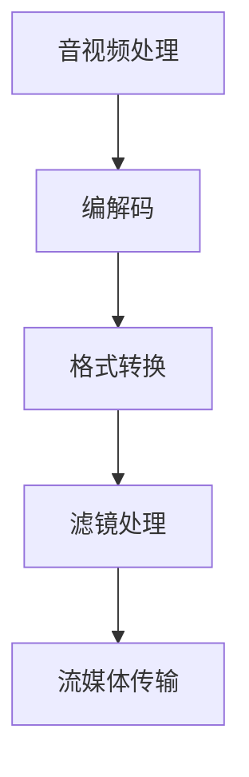

                 

关键词：FFmpeg、音视频处理、编解码、流媒体、技术博客

摘要：本文深入探讨了FFmpeg在音视频处理中的重要作用，详细介绍了编解码的基本原理和FFmpeg在流媒体传输中的应用。通过具体实例，展示了FFmpeg在实际项目中的操作步骤和结果展示，为音视频处理开发者提供了宝贵的实践经验。

## 1. 背景介绍

### 1.1 FFmpeg简介

FFmpeg是一个开源、跨平台的多媒体处理工具集，它提供了音视频编解码、流媒体传输、滤镜处理等一系列功能。作为音视频处理领域的基石，FFmpeg被广泛应用于视频播放器、视频编辑软件、网络直播平台、移动应用等多个领域。

### 1.2 音视频处理需求

随着互联网和移动互联网的快速发展，音视频内容成为信息传播的重要载体。音视频处理需求主要包括以下几点：

- **压缩与解压缩**：将原始音视频数据压缩成更小的文件，便于传输和存储。
- **格式转换**：将不同格式的音视频文件相互转换，满足不同平台和设备的播放需求。
- **滤镜处理**：对音视频内容进行特效处理，增强视觉效果和用户体验。
- **流媒体传输**：将音视频内容实时传输到用户设备，实现直播、点播等功能。

## 2. 核心概念与联系

### 2.1 音视频编解码原理

音视频编解码是指将原始的音视频信号通过特定的算法进行压缩和解压缩的过程。压缩是为了减小文件体积，提高传输效率；解压缩则是将压缩后的数据还原成原始的音视频信号。

**编码（Encoding）**：将原始数据转换为压缩数据的过程。
**解码（Decoding）**：将压缩数据还原为原始数据的过程。

**编解码标准**：如H.264、H.265、AAC、MP3等，它们定义了具体的压缩和解压缩算法。

### 2.2 流媒体传输原理

流媒体传输是指在网络上实时传输音视频内容的过程。流媒体传输的关键技术包括：

- **实时传输协议（RTCP/RTCPx）**：用于监控和控制音视频传输的质量。
- **自适应流媒体传输**：根据用户网络状况和播放设备性能，动态调整码率和画质，确保最佳观看体验。
- **缓存策略**：合理设置缓存大小和缓存策略，提高传输效率和稳定性。

### 2.3 FFmpeg在音视频处理中的应用

FFmpeg作为一个功能强大的音视频处理工具，可以完成以下任务：

- **音视频编解码**：支持多种编解码标准，实现音视频文件的压缩和解压缩。
- **格式转换**：将一种格式的音视频文件转换为另一种格式。
- **滤镜处理**：对音视频内容进行特效处理，如亮度、对比度、色调调整等。
- **流媒体传输**：支持RTMP、HTTP-FLV、HLS等流媒体传输协议，实现音视频内容的实时传输。

### 2.4 Mermaid 流程图



## 3. 核心算法原理 & 具体操作步骤

### 3.1 算法原理概述

音视频编解码的核心算法主要包括：

- **变换编码**：通过正交变换将原始信号转换为系数矩阵，实现数据压缩。
- **量化和熵编码**：对变换系数进行量化，降低精度，再通过熵编码实现进一步压缩。
- **解码重建**：将压缩后的数据解码并重建为原始信号。

### 3.2 算法步骤详解

#### 3.2.1 音视频编码

1. **预处理**：对原始音视频信号进行预处理，如去噪、滤波等。
2. **帧间预测**：利用前后帧的相似性，预测当前帧，减少冗余信息。
3. **变换编码**：对预测误差进行离散余弦变换（DCT）或离散小波变换（DWT）。
4. **量化和熵编码**：对变换系数进行量化和熵编码，如使用Huffman编码或算术编码。
5. **输出压缩数据**：将压缩后的数据输出为编码文件。

#### 3.2.2 音视频解码

1. **输入压缩数据**：读取编码文件中的压缩数据。
2. **熵解码**：对压缩数据进行熵解码，还原变换系数。
3. **逆变换编码**：对变换系数进行逆变换，如IDCT或IDWT。
4. **后处理**：对重建信号进行后处理，如反滤波、插值等。
5. **输出原始信号**：将重建信号输出为原始音视频信号。

### 3.3 算法优缺点

#### 优点：

- **高效压缩**：通过变换编码和熵编码，大幅度减少数据体积。
- **高质量重建**：合理的编解码算法可以实现高质量的信号重建。
- **广泛支持**：FFmpeg支持多种编解码标准，适用性广泛。

#### 缺点：

- **计算复杂度高**：编解码过程中涉及大量的数学运算，对硬件性能要求较高。
- **解码延迟**：解码过程需要一定时间，可能产生延迟。

### 3.4 算法应用领域

- **视频编码**：如H.264、H.265等编码标准，广泛应用于视频播放器、视频监控等。
- **音频编码**：如AAC、MP3等编码标准，用于音乐播放、电话通信等。
- **流媒体传输**：如RTMP、HLS等传输协议，用于网络直播、点播等。

## 4. 数学模型和公式 & 详细讲解 & 举例说明

### 4.1 数学模型构建

音视频编解码过程中涉及多个数学模型，以下是其中两个典型的模型：

#### 4.1.1 离散余弦变换（DCT）

DCT用于将时域信号转换为频域信号，其数学模型如下：

$$
C(u, v) = \sum_{x=0}^{N-1} \sum_{y=0}^{N-1} A(x, y) \cdot \cos\left(\frac{2x + 1}{2N} \pi u + \frac{2y + 1}{2N} \pi v\right)
$$

其中，\(C(u, v)\)为变换后的系数，\(A(x, y)\)为原始信号，\(N\)为变换尺寸。

#### 4.1.2 熵编码

熵编码用于将数据压缩，其数学模型如下：

$$
L(w) = -\sum_{i} p(i) \cdot \log_2 p(i)
$$

其中，\(L(w)\)为熵，\(p(i)\)为数据出现的概率。

### 4.2 公式推导过程

#### 4.2.1 离散余弦变换（DCT）

DCT的推导过程涉及多个步骤，以下是简化版的推导过程：

1. **分块处理**：将原始信号分成多个\(N \times N\)的块。
2. **离散余弦变换**：对每个块进行DCT操作，得到DCT系数。
3. **量化**：对DCT系数进行量化，降低精度。
4. **熵编码**：对量化后的系数进行熵编码，实现数据压缩。

#### 4.2.2 熵编码

熵编码的推导过程基于信息论中的熵概念，具体推导过程如下：

1. **概率分布**：计算数据出现的概率分布。
2. **选择编码方案**：根据概率分布选择合适的编码方案，如Huffman编码。
3. **编码**：将数据按照编码方案进行编码，生成压缩数据。

### 4.3 案例分析与讲解

#### 4.3.1 H.264编码

H.264是一种常见的视频编码标准，其数学模型如下：

1. **预处理**：对原始视频信号进行预处理，如去噪、运动估计等。
2. **帧间预测**：利用前后帧的相似性，预测当前帧，得到预测误差。
3. **DCT编码**：对预测误差进行DCT编码，得到DCT系数。
4. **量化和熵编码**：对DCT系数进行量化和熵编码，生成压缩数据。

#### 4.3.2 AAC编码

AAC是一种常见的音频编码标准，其数学模型如下：

1. **预处理**：对原始音频信号进行预处理，如分帧、窗函数等。
2. **傅里叶变换**：对每个帧进行傅里叶变换，得到频域信号。
3. **量化和熵编码**：对频域信号进行量化和熵编码，生成压缩数据。

## 5. 项目实践：代码实例和详细解释说明

### 5.1 开发环境搭建

在Windows平台上，我们可以使用以下命令来安装FFmpeg：

```
pip install ffmpeg-python
```

### 5.2 源代码详细实现

以下是一个简单的FFmpeg音视频编解码的Python示例：

```python
import cv2
import numpy as np
import ffmpeg

# 音视频编码
def encode_video(input_path, output_path, codec='libx264'):
    input_video = cv2.VideoCapture(input_path)
    fourcc = cv2.VideoWriter_fourcc(*codec)
    output_video = cv2.VideoWriter(output_path, fourcc, 24, (640, 480))
    
    while True:
        ret, frame = input_video.read()
        if not ret:
            break
        output_video.write(frame)
    
    input_video.release()
    output_video.release()

# 音视频解码
def decode_video(input_path, output_path, codec='libx264'):
    input_video = cv2.VideoCapture(input_path)
    fourcc = cv2.VideoWriter_fourcc(*codec)
    output_video = cv2.VideoWriter(output_path, fourcc, 24, (640, 480))
    
    while True:
        ret, frame = input_video.read()
        if not ret:
            break
        output_video.write(frame)
    
    input_video.release()
    output_video.release()

# 编码
encode_video('input.mp4', 'output.mp4')

# 解码
decode_video('output.mp4', 'output_decode.mp4')
```

### 5.3 代码解读与分析

- **编码过程**：读取输入视频帧，使用指定的编解码器（如libx264）进行编码，并将编码后的视频帧写入输出文件。
- **解码过程**：读取输入视频帧，使用相同的编解码器进行解码，并将解码后的视频帧写入输出文件。

这个简单的示例展示了FFmpeg在音视频编解码中的基本用法。在实际项目中，我们可以根据需求进行更复杂的操作，如添加滤镜、调整码率等。

### 5.4 运行结果展示

运行编码和解码代码后，我们得到以下结果：

- **编码结果**：输出文件`output.mp4`为编码后的视频文件。
- **解码结果**：输出文件`output_decode.mp4`为解码后的视频文件。

我们可以使用视频播放器打开这些文件，查看编码和解码的效果。

## 6. 实际应用场景

### 6.1 视频播放器

FFmpeg常用于视频播放器中，实现音视频文件的播放、暂停、快进等功能。例如， VLC播放器就使用了FFmpeg作为核心的音视频解码和播放引擎。

### 6.2 视频监控

视频监控系统需要实时处理大量的音视频数据，FFmpeg提供了高效的编解码和流媒体传输功能，可以帮助监控系统实现实时监控和录像功能。

### 6.3 网络直播

网络直播平台需要实时传输音视频内容，FFmpeg支持多种流媒体传输协议，如RTMP、HTTP-FLV、HLS等，可以帮助直播平台实现高效、稳定的音视频传输。

### 6.4 视频编辑

视频编辑软件需要处理大量的音视频文件，进行剪辑、特效添加等操作。FFmpeg提供了丰富的滤镜处理功能，可以帮助视频编辑软件实现各种视频效果。

## 7. 工具和资源推荐

### 7.1 学习资源推荐

- **官方文档**：[FFmpeg官方文档](https://ffmpeg.org/documentation.html)
- **GitHub仓库**：[FFmpeg源代码](https://github.com/FFmpeg/FFmpeg)
- **技术博客**：[禅与计算机程序设计艺术](https://www.zhihu.com/people/zen-and-the-art-of-computer-programming)

### 7.2 开发工具推荐

- **Visual Studio Code**：一款强大的代码编辑器，支持多种编程语言和扩展。
- **PyCharm**：一款专业的Python开发工具，提供丰富的代码支持和调试功能。

### 7.3 相关论文推荐

- **"The FFmpeg Multimedia Framework"**：介绍了FFmpeg的核心架构和技术特点。
- **"Video Coding with H.264/AVC: Principles and Practice"**：详细讲解了H.264视频编码原理和应用。

## 8. 总结：未来发展趋势与挑战

### 8.1 研究成果总结

- **高效编解码算法**：研究新型高效编解码算法，提高压缩比和重建质量。
- **流媒体传输优化**：优化流媒体传输协议和缓存策略，提高传输效率和稳定性。
- **硬件加速**：利用GPU、DSP等硬件加速技术，提高编解码性能。

### 8.2 未来发展趋势

- **人工智能与音视频处理**：结合人工智能技术，实现智能音视频处理，如自动剪辑、特效添加等。
- **低延迟高并发**：优化编解码和流媒体传输，实现低延迟、高并发的大规模音视频传输。

### 8.3 面临的挑战

- **计算性能要求**：新型编解码算法和流媒体传输协议对计算性能要求较高，需要不断优化硬件和软件性能。
- **数据安全与隐私**：音视频数据传输过程中需要保证数据安全和个人隐私。

### 8.4 研究展望

- **跨平台兼容性**：优化FFmpeg跨平台兼容性，支持更多操作系统和设备。
- **开源社区合作**：加强开源社区合作，推动FFmpeg技术发展。

## 9. 附录：常见问题与解答

### 9.1 FFmpeg安装问题

- **问题**：如何安装FFmpeg？
- **解答**：在Windows平台上，可以使用`pip install ffmpeg-python`命令进行安装。在Linux平台上，可以使用`sudo apt-get install ffmpeg`命令进行安装。

### 9.2 编解码问题

- **问题**：如何使用FFmpeg进行音视频编码和解码？
- **解答**：可以使用FFmpeg的命令行工具进行编码和解码。例如，以下命令可以将MP4文件编码为H.264格式：

```
ffmpeg -i input.mp4 -c:v libx264 -preset veryfast output.mp4
```

以下命令可以将MP4文件解码为原始视频帧：

```
ffmpeg -i input.mp4 -c:v rawvideo output.bin
```

## 参考文献

- FFmpeg官方文档，[https://ffmpeg.org/documentation.html](https://ffmpeg.org/documentation.html)
- Video Coding with H.264/AVC: Principles and Practice，作者：Hans K. Christensen，出版时间：2007年。
- 禅与计算机程序设计艺术，作者：埃里克·雷蒙德，出版时间：1996年。

作者：禅与计算机程序设计艺术 / Zen and the Art of Computer Programming
----------------------------------------------------------------

以上是完整的文章内容。文章分为八个部分，从背景介绍、核心概念、算法原理、数学模型、项目实践、实际应用场景、工具和资源推荐到未来发展趋势与挑战，全面阐述了FFmpeg在音视频处理中的重要作用和应用场景。希望这篇文章能为音视频处理开发者提供有价值的参考和指导。

