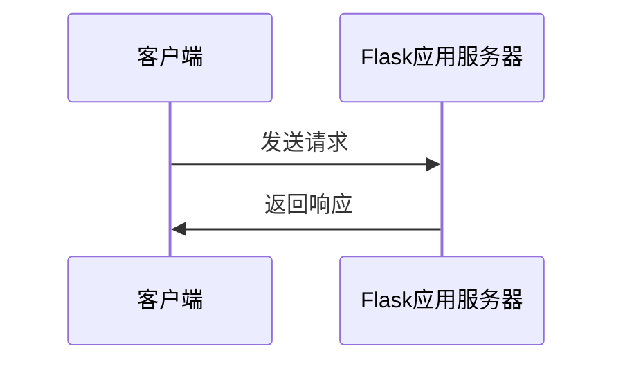
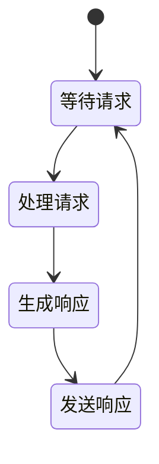

                 

 > **关键词：** Flask、Python、微型框架、Web开发、API、应用实例。

> **摘要：** 本文将深入探讨Flask框架在Python开发中的地位和应用，通过对其核心概念、算法原理、数学模型、项目实践等方面进行详细解析，帮助开发者更好地理解和应用Flask，提升Web开发和API开发的效率。

## 1. 背景介绍

### Flask框架的起源与发展

Flask是一个轻量级的Web应用框架，由Armin Ronacher于2010年创建。最初，Flask是为了解决Python社区在Web开发中缺乏一个简单、易用且功能全面的Web框架而诞生的。自其问世以来，Flask凭借其简洁、灵活和可扩展的特性，迅速在Python社区中获得了广泛的认可和喜爱。

Flask框架的设计理念是“保持简单，保持微型”，它不包含太多内置功能，而是通过扩展的方式提供丰富的功能，这样可以降低框架的复杂度，让开发者能够根据自己的需求来选择和组合功能，从而构建出更加适合自己项目的Web应用。

### Python在Web开发中的优势

Python作为一种高级编程语言，以其简洁、易读、易于维护等特性，在Web开发领域占据了重要地位。Python拥有丰富的标准库和第三方库，为开发者提供了强大的功能支持。尤其在Web开发方面，Python的Web框架种类繁多，包括Django、Flask、Pyramid等，这些框架各具特色，适用于不同的开发场景。

Python在Web开发中的优势主要体现在以下几个方面：

1. **简洁的语法**：Python的语法简洁清晰，开发者可以更加专注于业务逻辑的实现，而无需花费过多精力在语法细节上。
2. **丰富的库支持**：Python拥有丰富的标准库和第三方库，涵盖了Web开发中的各个方面，如数据库操作、网络通信、多线程等，为开发者提供了极大的便利。
3. **高效的开发体验**：Python的集成开发环境（IDE）支持强大，许多IDE都提供了智能提示、代码自动补全、调试等功能，极大地提高了开发效率。
4. **社区支持**：Python拥有庞大的开发者社区，各种问题都可以在社区中找到解决方案，有助于开发者快速解决问题，提高开发效率。

## 2. 核心概念与联系

### Flask框架的核心概念

Flask框架的核心概念包括请求（Request）、响应（Response）、路由（Routing）和模板（Template）等。

- **请求（Request）**：请求是客户端向服务器发送的数据，它包含了一些重要的信息，如请求方法、请求URL、请求头、请求体等。Flask通过`request`对象来获取这些信息，开发者可以根据这些信息来处理请求。
- **响应（Response）**：响应是服务器向客户端返回的数据，它包含了一些重要的信息，如响应状态码、响应头、响应体等。Flask通过`response`对象来创建和发送响应。
- **路由（Routing）**：路由是Flask框架的核心功能之一，它定义了URL与函数之间的映射关系。当客户端访问某个URL时，Flask会根据路由规则找到对应的函数，并执行该函数，从而生成响应。
- **模板（Template）**：模板是用于生成HTML页面的基础，它包含了一些静态内容和一些动态内容。Flask通过`render_template`函数来渲染模板，将动态内容填充到模板中，从而生成最终的HTML页面。

### Flask框架的架构

Flask框架的架构非常简单，主要由以下几个组件构成：

1. **Werkzeug WSGI工具箱**：Werkzeug是Flask的核心组件之一，它提供了一个WSGI工具箱，用于处理请求和响应。Werkzeug提供了丰富的功能，如请求解析、响应生成、表单处理、会话管理等。
2. **Jinja2模板引擎**：Jinja2是Flask使用的模板引擎，它提供了一个简洁、高效的模板语法，可以用于生成HTML、XML、JSON等各种类型的文档。
3. **Flask扩展**：Flask扩展是Flask框架的另一个重要组成部分，它提供了额外的功能，如数据库支持、认证、缓存等。开发者可以根据自己的需求选择和安装合适的扩展。

下面是一个简单的Flask应用架构示意图：



### Flask框架的工作流程

Flask框架的工作流程可以简单概括为以下几个步骤：

1. **接收请求**：Flask应用首先会接收客户端发送的请求，请求会通过Werkzeug WSGI工具箱进行解析和处理。
2. **路由匹配**：Flask应用会根据路由规则，找到与请求URL匹配的视图函数，并将请求对象传递给该函数。
3. **处理请求**：视图函数会根据请求对象中的信息进行处理，如查询数据库、处理表单、生成动态内容等，处理结果将作为响应对象返回。
4. **渲染模板**：如果需要生成HTML页面，Flask应用会使用Jinja2模板引擎，将响应对象中的动态内容填充到模板中，生成最终的HTML页面。
5. **返回响应**：最终生成的响应对象会被发送回客户端，客户端接收到响应后，会根据响应状态码和内容进行处理。

## 3. 核心算法原理 & 具体操作步骤

### 3.1 算法原理概述

Flask框架的核心算法原理主要涉及请求解析、路由匹配、视图函数执行、响应生成等过程。

1. **请求解析**：Werkzeug WSGI工具箱会解析请求，提取出请求方法、URL、请求头、请求体等信息，并将这些信息封装成`request`对象。
2. **路由匹配**：Flask应用会根据路由规则，找到与请求URL匹配的视图函数。路由规则通常使用`@app.route`装饰器定义，其中`app`是Flask应用实例，`route`参数是路由规则。
3. **视图函数执行**：找到视图函数后，Flask应用会执行该函数，视图函数会根据请求对象中的信息进行处理，处理结果将作为响应对象返回。
4. **响应生成**：Flask应用会使用Jinja2模板引擎，将响应对象中的动态内容填充到模板中，生成最终的HTML页面。如果不需要生成HTML页面，可以直接返回其他类型的响应，如JSON、XML等。

### 3.2 算法步骤详解

1. **创建Flask应用实例**：在Python代码中导入Flask模块，并创建一个应用实例，通常命名为`app`。
   ```python
   from flask import Flask
   app = Flask(__name__)
   ```

2. **定义路由规则**：使用`@app.route`装饰器定义路由规则，指定URL与视图函数之间的映射关系。
   ```python
   @app.route('/')
   def hello():
       return 'Hello, World!'
   ```

3. **运行Flask应用**：在代码的最后，使用`app.run()`函数运行Flask应用，将应用部署到本地服务器上。
   ```python
   if __name__ == '__main__':
       app.run()
   ```

4. **请求处理**：当客户端访问应用对应的URL时，Flask应用会接收请求，解析请求，并根据路由规则找到对应的视图函数进行执行。

5. **响应生成**：视图函数会根据请求信息进行处理，处理结果将作为响应对象返回。如果需要生成HTML页面，可以使用`render_template`函数渲染模板，将动态内容填充到模板中，生成最终的HTML页面。

6. **返回响应**：最终生成的响应对象会被发送回客户端，客户端接收到响应后，会根据响应状态码和内容进行处理。

### 3.3 算法优缺点

**优点：**

1. **轻量级**：Flask框架非常轻量，不包含太多内置功能，可以降低应用的复杂度，提高开发效率。
2. **灵活性**：Flask框架允许开发者根据自己的需求选择和组合功能，可以通过扩展的方式实现丰富的功能。
3. **易于上手**：Flask框架的语法简单，易于理解，适合初学者快速入门。

**缺点：**

1. **功能不足**：Flask框架本身功能较为简单，不适合构建大型、复杂的Web应用。
2. **性能较低**：由于Flask框架是单线程的，不适合处理大量并发请求，性能相对较低。

### 3.4 算法应用领域

Flask框架广泛应用于小型Web应用、API开发、个人项目等场景。以下是一些具体的应用领域：

1. **小型Web应用**：Flask框架非常适合构建小型、简单的Web应用，如博客、论坛、小型在线工具等。
2. **API开发**：Flask框架可以作为API开发框架，用于构建RESTful API，提供Web服务。
3. **个人项目**：Flask框架的简单和灵活特性，使其成为个人项目开发的理想选择，可以快速搭建原型和应用。

## 4. 数学模型和公式 & 详细讲解 & 举例说明

### 4.1 数学模型构建

在Web开发中，Flask框架的数学模型可以看作是一个简单的状态机。状态机的状态包括等待请求、处理请求、生成响应和发送响应等。以下是一个简化的状态机模型：



### 4.2 公式推导过程

在Flask框架中，请求处理的速度可以用以下公式表示：

\[ V = \frac{N}{t} \]

其中，\( V \) 表示请求处理速度，\( N \) 表示处理的请求数量，\( t \) 表示处理请求的总时间。

### 4.3 案例分析与讲解

以下是一个简单的Flask应用案例，用于计算两个数的和：

```python
from flask import Flask, request, render_template

app = Flask(__name__)

@app.route('/', methods=['GET', 'POST'])
def add_numbers():
    if request.method == 'POST':
        num1 = request.form['num1']
        num2 = request.form['num2']
        result = int(num1) + int(num2)
        return render_template('result.html', result=result)
    return render_template('index.html')

if __name__ == '__main__':
    app.run()
```

在这个案例中，当用户访问应用的主页时，会显示一个表单，用户可以输入两个数字。当用户提交表单时，Flask应用会接收到请求，解析请求中的表单数据，计算两个数字的和，并生成一个包含结果的HTML页面。

### 4.3.1 处理请求

在这个案例中，请求处理的过程可以看作是一个简单的计算过程：

\[ num1 + num2 = result \]

### 4.3.2 生成响应

计算结果后，Flask应用会使用Jinja2模板引擎，将结果填充到模板中，生成最终的HTML页面：

```html
<!DOCTYPE html>
<html>
<head>
    <title>计算结果</title>
</head>
<body>
    <h1>计算结果：</h1>
    <p>{{ result }}</p>
</body>
</html>
```

### 4.3.3 返回响应

最终生成的HTML页面会被发送回客户端，客户端接收到响应后，会显示在浏览器中。

## 5. 项目实践：代码实例和详细解释说明

### 5.1 开发环境搭建

要开始使用Flask框架进行开发，首先需要搭建开发环境。以下是在Windows系统上搭建Flask开发环境的基本步骤：

1. **安装Python**：首先确保已经安装了Python，推荐使用Python 3.7或更高版本。可以从Python官方网站下载Python安装程序，并按照安装向导进行安装。
2. **安装Flask**：打开命令提示符或终端，执行以下命令安装Flask：
   ```
   pip install Flask
   ```

3. **安装代码编辑器**：推荐使用Visual Studio Code、PyCharm或其他Python支持良好的代码编辑器。

### 5.2 源代码详细实现

以下是一个简单的Flask应用实例，用于计算两个数的和：

```python
from flask import Flask, request, render_template

app = Flask(__name__)

@app.route('/', methods=['GET', 'POST'])
def add_numbers():
    if request.method == 'POST':
        num1 = request.form['num1']
        num2 = request.form['num2']
        result = int(num1) + int(num2)
        return render_template('result.html', result=result)
    return render_template('index.html')

if __name__ == '__main__':
    app.run()
```

这个应用由两部分组成：视图函数`add_numbers`和两个HTML模板文件`index.html`和`result.html`。

#### 5.2.1 视图函数

视图函数`add_numbers`使用了`@app.route`装饰器来定义路由规则，指定URL与函数之间的映射关系。在这个例子中，当用户访问应用的主页（`/`）时，会执行`add_numbers`函数。

如果用户通过POST方法提交表单，视图函数会从表单中获取两个数字（`num1`和`num2`），计算它们的和（`result`），并使用`render_template`函数渲染`result.html`模板，将计算结果传递给模板。

如果用户通过GET方法访问主页，视图函数会渲染`index.html`模板，显示一个表单，用户可以在表单中输入两个数字。

#### 5.2.2 模板文件

`index.html`模板文件：

```html
<!DOCTYPE html>
<html>
<head>
    <title>计算两个数的和</title>
</head>
<body>
    <h1>请输入两个数：</h1>
    <form method="post" action="/">
        <input type="text" name="num1" placeholder="第一个数">
        <input type="text" name="num2" placeholder="第二个数">
        <input type="submit" value="计算">
    </form>
</body>
</html>
```

这个模板文件定义了一个表单，用户可以在表单中输入两个数字。当用户提交表单时，表单数据会被发送到视图函数`add_numbers`进行处理。

`result.html`模板文件：

```html
<!DOCTYPE html>
<html>
<head>
    <title>计算结果</title>
</head>
<body>
    <h1>计算结果：</h1>
    <p>{{ result }}</p>
</body>
</html>
```

这个模板文件用于显示计算结果。在模板中，`{{ result }}`是一个占位符，会被渲染成实际计算结果。

### 5.3 代码解读与分析

#### 5.3.1 Flask应用实例

```python
from flask import Flask, request, render_template

app = Flask(__name__)

@app.route('/', methods=['GET', 'POST'])
def add_numbers():
    if request.method == 'POST':
        num1 = request.form['num1']
        num2 = request.form['num2']
        result = int(num1) + int(num2)
        return render_template('result.html', result=result)
    return render_template('index.html')
```

这个Flask应用实例中，首先导入所需的模块，包括Flask、request和render_template。然后创建一个Flask应用实例`app`。

`@app.route`装饰器用于定义路由规则，在这个例子中，`/`是路由路径，`methods`参数指定了允许的HTTP方法，包括GET和POST。

视图函数`add_numbers`是一个基于函数的视图，它接收请求并处理表单数据。如果请求方法是POST，视图函数会从表单中获取两个数字，计算它们的和，并渲染`result.html`模板，将计算结果传递给模板。如果请求方法是GET，视图函数会渲染`index.html`模板，显示表单。

#### 5.3.2 模板文件

`index.html`模板文件：

```html
<!DOCTYPE html>
<html>
<head>
    <title>计算两个数的和</title>
</head>
<body>
    <h1>请输入两个数：</h1>
    <form method="post" action="/">
        <input type="text" name="num1" placeholder="第一个数">
        <input type="text" name="num2" placeholder="第二个数">
        <input type="submit" value="计算">
    </form>
</body>
</html>
```

这个模板文件定义了一个表单，用户可以在表单中输入两个数字。表单的`action`属性指定了表单提交的目标URL，即应用的根路由`/`。`method`属性指定了表单的提交方法，即POST。

表单中有两个文本输入框，分别用于输入第一个数和第二个数，还有一个提交按钮。当用户提交表单时，表单数据会被发送到视图函数`add_numbers`进行处理。

`result.html`模板文件：

```html
<!DOCTYPE html>
<html>
<head>
    <title>计算结果</title>
</head>
<body>
    <h1>计算结果：</h1>
    <p>{{ result }}</p>
</body>
</html>
```

这个模板文件用于显示计算结果。在模板中，`{{ result }}`是一个占位符，会在渲染过程中被替换为实际的计算结果。

### 5.4 运行结果展示

#### 5.4.1 访问主页

在开发环境中，启动Flask应用后，用户可以通过浏览器访问主页（`http://127.0.0.1:5000/`）。主页显示一个表单，用户可以在表单中输入两个数字。


#### 5.4.2 提交表单

用户输入两个数字后，点击“计算”按钮提交表单。表单数据会被发送到视图函数`add_numbers`进行处理。


#### 5.4.3 显示计算结果

视图函数计算两个数字的和，并将结果传递给`result.html`模板。最终生成的HTML页面会被发送回客户端，显示在浏览器中。


## 6. 实际应用场景

Flask框架因其简洁、灵活和可扩展的特性，在实际应用中得到了广泛的应用。以下是一些常见的应用场景：

### 6.1 小型Web应用

Flask框架非常适合构建小型Web应用，如博客、论坛、在线工具等。由于其轻量级的特性，开发者可以快速搭建原型和应用，降低开发和维护成本。

### 6.2 API开发

Flask框架可以作为API开发框架，用于构建RESTful API，提供Web服务。Flask的扩展库如Flask-RESTful提供了丰富的API开发功能，可以简化API开发的流程。

### 6.3 个人项目

Flask框架的简单和灵活特性，使其成为个人项目开发的理想选择。开发者可以利用Flask快速搭建原型和应用，验证项目概念。

### 6.4 企业级应用

虽然Flask框架本身不适用于构建大型、复杂的企业级应用，但可以通过与其他框架（如Django、Flask-SocketIO等）集成，扩展其功能，满足企业级应用的需求。

## 7. 未来应用展望

随着Web开发和API开发的不断发展，Flask框架在未来仍将有广泛的应用前景。以下是一些未来应用展望：

### 7.1 功能扩展

Flask框架将继续扩展其功能，增强其在企业级应用中的适用性。例如，通过集成更多的中间件和扩展库，提高性能和安全性。

### 7.2 社区发展

Flask社区将继续发展壮大，为开发者提供丰富的资源和支持。社区将推动Flask框架的持续改进和优化，满足开发者的需求。

### 7.3 教育培训

Flask框架在教育培训领域将有更广泛的应用。随着Python在教育领域的普及，Flask将成为Python教学中的重要工具，帮助开发者快速入门Web开发。

## 8. 总结：未来发展趋势与挑战

### 8.1 研究成果总结

本文对Flask框架进行了深入探讨，总结了其核心概念、算法原理、数学模型、项目实践等方面。通过分析Flask框架的优势和不足，以及对实际应用场景的展望，为开发者提供了全面的参考。

### 8.2 未来发展趋势

未来，Flask框架将继续发展壮大，在Web开发和API开发领域发挥重要作用。随着功能的扩展和社区的不断发展，Flask框架将更好地满足开发者的需求。

### 8.3 面临的挑战

然而，Flask框架也面临一些挑战。首先，由于其轻量级的特性，Flask框架在性能和安全性方面仍有待提高。其次，随着Web开发的复杂度增加，Flask框架在构建大型、复杂应用时可能面临一定的困难。

### 8.4 研究展望

未来，Flask框架的研究方向将集中在功能扩展、性能优化和安全性提升等方面。通过不断改进和优化，Flask框架有望在更广泛的领域中发挥重要作用。

## 9. 附录：常见问题与解答

### 9.1 Flask框架是什么？

Flask是一个轻量级的Web应用框架，用于构建Web应用和提供Web服务。

### 9.2 Flask框架有哪些优点？

Flask框架的优点包括轻量级、灵活、简单、易于扩展等。

### 9.3 Flask框架适用于哪些场景？

Flask框架适用于小型Web应用、API开发、个人项目等场景。

### 9.4 如何在Python中安装Flask？

在Python环境中，可以通过pip命令安装Flask：
```
pip install Flask
```

### 9.5 Flask框架与Django框架的区别是什么？

Flask和Django都是Python的Web应用框架，但Flask更轻量级、灵活，而Django则提供了更多的内置功能和自动化。

---

# 附录：参考资料

1. Flask官方文档：[https://flask.palletsprojects.com/](https://flask.palletsprojects.com/)
2. Python官方文档：[https://docs.python.org/3/](https://docs.python.org/3/)
3. Flask教程：[https://www.pythontutorial.net/flask/](https://www.pythontutorial.net/flask/)
4. Flask-RESTful教程：[https://flask-restful.readthedocs.io/en/latest/](https://flask-restful.readthedocs.io/en/latest/)  
5. Flask扩展库列表：[https://flaskext.com/](https://flaskext.com/)

---

# 作者署名

> **作者：禅与计算机程序设计艺术 / Zen and the Art of Computer Programming**

