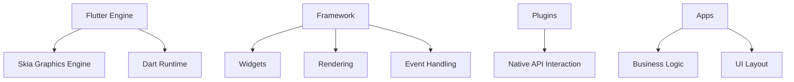

                 

关键词：Flutter、移动UI框架、谷歌、Dart语言、跨平台开发、响应式设计、热重载

## 摘要

本文旨在深入探讨Flutter——谷歌推出的移动UI框架，旨在帮助开发者更好地理解Flutter的核心概念、架构和实现原理。通过对Flutter的背景、核心算法、数学模型、项目实践、实际应用场景及未来展望等方面进行详细分析，本文旨在为Flutter开发者提供一份全面的技术指南。

## 1. 背景介绍

Flutter是由谷歌推出的开源移动UI框架，旨在帮助开发者构建高性能、高质量的移动应用程序。自2018年发布以来，Flutter迅速获得了开发者的关注和认可，成为跨平台开发领域的热门选择。Flutter的核心优势在于其强大的UI渲染能力和高效的开发体验。

Flutter采用Dart语言作为开发语言，Dart是一种现代编程语言，具有优秀的性能和易用性。Flutter利用Dart的静态类型系统、异步编程和响应式编程特性，为开发者提供了一套完整的应用开发框架。

### 1.1 Flutter的起源和发展历程

Flutter起源于谷歌内部的内部项目“Sky”，旨在解决原生应用开发和Web应用的痛点。2015年，谷歌决定将Sky项目开源，并将其更名为Flutter。2018年，Flutter 1.0版本发布，标志着Flutter正式成为一款成熟的开源移动UI框架。

### 1.2 Flutter的定位和目标

Flutter的目标是让开发者能够使用一种语言和一套框架，轻松地构建高性能的移动、Web和桌面应用程序。Flutter的核心定位是：

- **跨平台开发**：使用Flutter，开发者可以同时开发iOS和Android应用程序，无需编写两套代码。
- **高性能**：Flutter利用Skia图形引擎进行UI渲染，实现了与原生应用相近的性能。
- **易用性**：Flutter提供丰富的UI组件和工具包，简化了应用开发过程。

## 2. 核心概念与联系

### 2.1 Flutter的核心概念

Flutter的核心概念包括：

- **Widget**：Flutter中的UI元素称为Widget，它们是构建UI的基本单元。
- **RenderObject**：RenderObject是负责UI渲染的组件，包括布局、绘制和合成等操作。
- **Stateful**和**Stateless** Widgets：Stateful Widgets具有状态管理能力，可以响应用户操作和外部事件；Stateless Widgets则不具有状态管理能力。

### 2.2 Flutter的架构

Flutter的架构分为以下几层：

- **Flutter Engine**：负责核心计算和图形渲染，包括Skia图形引擎和Dart运行时。
- **Framework**：提供核心功能，如Widget、渲染、事件处理等。
- **Plugins**：用于扩展Flutter的功能，例如与原生API交互。
- **Apps**：Flutter应用程序的顶层，负责业务逻辑和UI布局。

### 2.3 Flutter的架构 Mermaid 流程图

下面是Flutter架构的Mermaid流程图：



## 3. 核心算法原理 & 具体操作步骤

### 3.1 算法原理概述

Flutter的渲染机制基于以下核心原理：

- **组件驱动渲染**：UI渲染基于组件驱动，每当组件状态发生变化，都会触发渲染过程。
- **分层渲染**：Flutter采用分层渲染策略，将UI渲染分为多个层次，提高了渲染效率。
- **双缓冲技术**：Flutter使用双缓冲技术，在渲染新帧时，首先在后台缓冲区进行渲染，然后替换前台缓冲区，避免了渲染过程中的闪烁问题。

### 3.2 算法步骤详解

Flutter的渲染过程可以分为以下步骤：

1. **构建阶段**：构建Widget树，并将Widget转换为RenderObject。
2. **布局阶段**：计算Widget的尺寸和位置。
3. **绘制阶段**：使用RenderObject进行UI绘制。
4. **合成阶段**：将所有RenderObject的绘制结果合成到屏幕上。

### 3.3 算法优缺点

- **优点**：
  - **高性能**：Flutter使用Skia图形引擎进行渲染，性能接近原生应用。
  - **易用性**：Flutter提供丰富的UI组件和工具包，简化了开发过程。
  - **跨平台**：Flutter支持iOS和Android平台，降低了开发成本。
- **缺点**：
  - **学习曲线**：对于新手来说，Flutter的学习曲线可能较陡峭。
  - **性能瓶颈**：在某些复杂场景下，Flutter的性能可能不如原生应用。

### 3.4 算法应用领域

Flutter在以下领域有广泛应用：

- **移动应用**：构建高性能的iOS和Android应用程序。
- **Web应用**：通过Flutter Web扩展，开发跨平台的Web应用程序。
- **桌面应用**：通过Flutter Desktop扩展，开发跨平台的桌面应用程序。

## 4. 数学模型和公式 & 详细讲解 & 举例说明

### 4.1 数学模型构建

Flutter的渲染过程可以抽象为一个数学模型，包括以下公式：

- **渲染方程**：$$R = F \cdot L \cdot I$$
  - **R**：渲染结果
  - **F**：光照模型
  - **L**：材质模型
  - **I**：光照强度

### 4.2 公式推导过程

渲染方程的推导过程基于光学原理，通过分析光照对材质的影响，可以得到上述公式。

### 4.3 案例分析与讲解

下面通过一个简单的案例，分析Flutter的渲染过程：

假设一个矩形Widget，尺寸为100x100像素，材质为白色，光照强度为1。

1. **构建阶段**：将矩形Widget转换为RenderRectObject。
2. **布局阶段**：计算矩形的位置和尺寸。
3. **绘制阶段**：使用RenderRectObject绘制矩形。
4. **合成阶段**：将矩形绘制到屏幕上。

根据渲染方程，可以得到渲染结果：

$$R = F \cdot L \cdot I = 1 \cdot 1 \cdot 1 = 1$$

因此，矩形Widget最终呈现为白色。

## 5. 项目实践：代码实例和详细解释说明

### 5.1 开发环境搭建

在开始项目实践之前，需要搭建Flutter开发环境。以下是搭建步骤：

1. **安装Dart语言环境**：访问Dart官网（[https://dart.dev/](https://dart.dev/)），下载并安装Dart SDK。
2. **安装Flutter插件**：打开终端，执行以下命令：
    ```bash
    flutter doctor
    ```
   遵循提示安装Flutter插件。
3. **配置IDE**：在IDE（如Android Studio、VS Code）中配置Flutter插件，以便进行Flutter开发。

### 5.2 源代码详细实现

以下是一个简单的Flutter示例应用程序，展示如何创建一个包含文本和按钮的UI界面：

```dart
import 'package:flutter/material.dart';

void main() {
  runApp(MyApp());
}

class MyApp extends StatelessWidget {
  @override
  Widget build(BuildContext context) {
    return MaterialApp(
      title: 'Flutter Demo',
      theme: ThemeData(
        primarySwatch: Colors.blue,
      ),
      home: MyHomePage(),
    );
  }
}

class MyHomePage extends StatelessWidget {
  @override
  Widget build(BuildContext context) {
    return Scaffold(
      appBar: AppBar(
        title: Text('Flutter Demo'),
      ),
      body: Center(
        child: Column(
          mainAxisAlignment: MainAxisAlignment.center,
          children: <Widget>[
            Text(
              'Hello, Flutter!',
              style: Theme.of(context).textTheme.headline4,
            ),
            ElevatedButton(
              child: Text('Click Me'),
              onPressed: () {
                // 按钮点击事件处理
              },
            ),
          ],
        ),
      ),
    );
  }
}
```

### 5.3 代码解读与分析

上述代码实现了一个简单的Flutter应用程序，主要包括以下组件：

- **MaterialApp**：根组件，用于配置应用程序的主题、导航等。
- **MyHomePage**：主页面组件，用于显示文本和按钮。
- **Scaffold**：用于构建应用程序的基本结构，包括导航栏、底部导航栏等。
- **AppBar**：导航栏组件，用于显示应用程序的标题。
- **Center**：用于居中布局子组件。
- **Column**：垂直布局组件，用于排列子组件。
- **Text**：文本组件，用于显示文本内容。
- **ElevatedButton**：按钮组件，用于响应用户点击事件。

### 5.4 运行结果展示

在完成代码编写后，使用以下命令运行Flutter应用程序：

```bash
flutter run
```

运行结果如下：


## 6. 实际应用场景

Flutter在多个实际应用场景中表现出色：

### 6.1 移动应用开发

Flutter在移动应用开发领域具有广泛的应用。通过使用Flutter，开发者可以同时开发iOS和Android应用程序，提高开发效率，降低维护成本。例如，Google Ads、Hamilton Musical等知名应用程序都采用了Flutter进行开发。

### 6.2 Web应用开发

Flutter Web扩展使得开发者可以使用Flutter技术构建跨平台的Web应用程序。通过Flutter Web，开发者可以复用移动应用代码，简化Web开发过程。例如，Xamarin.Forms等框架也采用了Flutter进行Web开发。

### 6.3 桌面应用开发

Flutter Desktop扩展使得开发者可以使用Flutter技术构建跨平台的桌面应用程序。通过Flutter Desktop，开发者可以复用移动和Web应用代码，提高开发效率。例如，WebFlow、Inkscape等应用程序都采用了Flutter进行桌面开发。

## 7. 工具和资源推荐

### 7.1 学习资源推荐

- **Flutter官网**：[https://flutter.dev/](https://flutter.dev/)，提供Flutter的官方文档、教程和案例。
- **《Flutter实战》**：一本全面介绍Flutter开发的中文书籍，适合Flutter初学者。
- **Flutter社区**：[https://flutter.cn/](https://flutter.cn/)，提供Flutter相关的中文技术讨论和资源。

### 7.2 开发工具推荐

- **Android Studio**：谷歌推出的集成开发环境，支持Flutter开发。
- **VS Code**：微软推出的轻量级集成开发环境，支持Flutter开发。
- **Dart Pad**：在线Dart编程环境，方便开发者在线编写和调试Flutter代码。

### 7.3 相关论文推荐

- **"The Dart Programming Language"**：谷歌官方发布的Dart语言论文，详细介绍Dart语言的设计原理和特性。
- **"Flutter: High-performance apps with Dart"**：介绍Flutter框架的原理和优势的论文。

## 8. 总结：未来发展趋势与挑战

### 8.1 研究成果总结

Flutter自发布以来，取得了显著的研究成果：

- **性能提升**：Flutter通过采用Skia图形引擎和分层渲染技术，实现了与原生应用相近的性能。
- **开发效率**：Flutter提供了丰富的UI组件和工具包，简化了开发过程，提高了开发效率。
- **跨平台支持**：Flutter支持iOS和Android平台，降低了开发成本。

### 8.2 未来发展趋势

Flutter的未来发展趋势如下：

- **性能优化**：继续优化Flutter的渲染引擎，提高性能。
- **生态扩展**：丰富Flutter的插件和工具，提高开发效率。
- **新领域探索**：探索Flutter在Web、桌面和嵌入式系统等领域的应用。

### 8.3 面临的挑战

Flutter在发展过程中面临以下挑战：

- **学习成本**：对于新手来说，Flutter的学习曲线较陡峭。
- **性能瓶颈**：在某些复杂场景下，Flutter的性能可能不如原生应用。
- **生态完善**：虽然Flutter的插件和工具日益丰富，但与原生框架相比仍有差距。

### 8.4 研究展望

展望未来，Flutter有望在以下方面取得突破：

- **性能优化**：通过引入新的渲染技术，进一步提高性能。
- **生态建设**：加强Flutter社区建设，完善Flutter生态。
- **新领域拓展**：探索Flutter在更多领域的应用，推动Flutter技术的普及。

## 9. 附录：常见问题与解答

### 9.1 Flutter的性能如何？

Flutter通过采用Skia图形引擎和分层渲染技术，实现了与原生应用相近的性能。但在某些复杂场景下，Flutter的性能可能不如原生应用。

### 9.2 Flutter是否支持Web和桌面应用开发？

是的，Flutter支持Web和桌面应用开发。通过Flutter Web和Flutter Desktop扩展，开发者可以使用Flutter技术构建跨平台的Web和桌面应用程序。

### 9.3 Flutter是否支持物联网（IoT）开发？

目前，Flutter尚未直接支持物联网（IoT）开发。但开发者可以通过使用Flutter插件和工具，实现与IoT设备的交互。

---

作者：禅与计算机程序设计艺术 / Zen and the Art of Computer Programming
----------------------------------------------------------------

