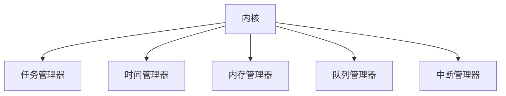
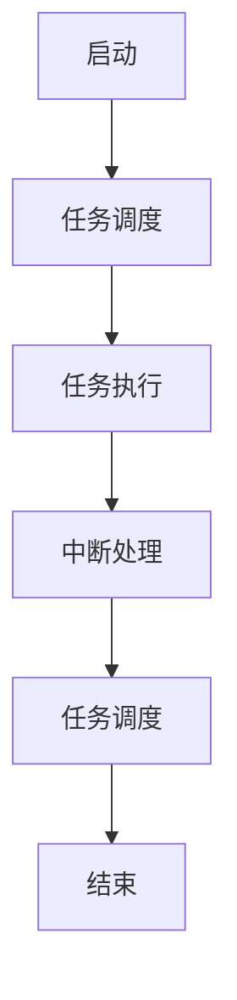

                 

关键词：实时操作系统，FreeRTOS，单片机，嵌入式系统，任务调度，资源管理，中断处理，性能优化

摘要：本文旨在深入探讨实时操作系统FreeRTOS在单片机上的应用。通过详细介绍FreeRTOS的核心概念、架构、算法原理，以及其在单片机上的具体实现，帮助读者理解如何高效利用FreeRTOS来开发高性能的嵌入式系统。此外，文章还将提供实际项目实践、应用场景分析以及未来展望，旨在为单片机制开发者提供全面的指导。

## 1. 背景介绍

### 单片机的地位与重要性

单片机（Microcontroller Unit，MCU）是一种集成度高、功能强大的微型计算机。它通常包含中央处理器（CPU）、存储器、输入/输出接口（I/O）、定时器/计数器、串行通信接口等基本功能模块，能够实现复杂的应用程序。随着电子技术的不断发展，单片机在工业控制、智能家居、物联网（IoT）等领域得到了广泛应用。

### 实时操作系统的概念

实时操作系统（Real-Time Operating System，RTOS）是一种专门为满足实时性要求设计的操作系统。它能够保证任务的执行时间在规定的时间内完成，从而确保系统的实时响应能力。在嵌入式系统中，RTOS对于确保系统稳定性和可靠性至关重要。

### FreeRTOS的起源与特点

FreeRTOS是一款开源的实时操作系统，最早由英国的Real Time Engineers Ltd公司开发，并于2003年发布。它具有以下特点：

- **免费和开源**：用户可以免费使用和修改FreeRTOS的源代码，非常适合嵌入式系统的开发。
- **跨平台支持**：FreeRTOS支持多种硬件平台和编译器，具有很高的兼容性。
- **资源占用小**：FreeRTOS的设计注重资源的节约，适用于资源有限的单片机系统。
- **任务调度灵活**：FreeRTOS支持多种调度策略，如时间片轮转调度、优先级调度等，满足不同应用场景的需求。

## 2. 核心概念与联系

### FreeRTOS架构

FreeRTOS的架构如图1所示。它主要由内核、任务管理器、时间管理器、内存管理器、队列管理器和中断管理器等模块组成。



### 核心概念

- **任务（Task）**：任务是RTOS中基本的执行单元，相当于进程。每个任务都有自己的栈空间和优先级。
- **队列（Queue）**：队列是一种先进先出（FIFO）的数据结构，用于任务之间的通信。
- **信号量（Semaphore）**：信号量用于实现任务间的同步和互斥。
- **定时器（Timer）**：定时器用于实现延时和定时功能。
- **中断（Interrupt）**：中断是硬件或软件生成的异步事件，用于中断当前任务的执行。

### Mermaid流程图



## 3. 核心算法原理 & 具体操作步骤

### 3.1 算法原理概述

FreeRTOS的核心算法包括任务调度算法和中断处理算法。

- **任务调度算法**：FreeRTOS采用优先级调度算法，任务按照优先级从高到低排队执行。高优先级任务可以抢占低优先级任务。
- **中断处理算法**：中断处理是RTOS中的关键部分。FreeRTOS通过中断服务例程（ISR）来处理中断。ISR的执行时间必须非常短，以避免影响任务的正常执行。

### 3.2 算法步骤详解

#### 3.2.1 任务调度

1. **初始化**：系统启动时，内核初始化所有任务控制块（TCB）和数据结构。
2. **调度器就绪**：当有任务创建并处于就绪状态时，调度器将选取最高优先级的任务执行。
3. **任务切换**：当高优先级任务就绪时，当前执行的任务会被抢占，并放入就绪队列的尾部。

#### 3.2.2 中断处理

1. **中断请求**：硬件或软件生成中断请求。
2. **进入中断**：CPU暂停当前任务的执行，进入中断处理模式。
3. **执行ISR**：执行中断服务例程，完成中断处理任务。
4. **返回**：中断处理完成后，返回到中断发生时的任务。

### 3.3 算法优缺点

- **任务调度算法**：优先级调度算法简单高效，但可能导致低优先级任务长期得不到执行。
- **中断处理算法**：中断处理快速高效，但可能影响任务的执行时间。

### 3.4 算法应用领域

FreeRTOS广泛应用于嵌入式系统，如工业控制、汽车电子、智能家居、医疗设备等。其灵活的任务调度和中断处理机制，能够满足这些领域的实时性需求。

## 4. 数学模型和公式 & 详细讲解 & 举例说明

### 4.1 数学模型构建

FreeRTOS中的任务调度和中断处理都涉及到一些基本的数学模型。

#### 4.1.1 任务调度模型

任务调度模型可以用以下公式表示：

\[ \text{调度时间} = \frac{\text{就绪队列长度}}{\text{任务平均执行时间}} \]

#### 4.1.2 中断处理模型

中断处理模型可以用以下公式表示：

\[ \text{中断响应时间} = \frac{\text{中断服务例程执行时间}}{\text{中断请求频率}} \]

### 4.2 公式推导过程

#### 4.2.1 任务调度模型推导

假设系统中有 \( n \) 个任务，每个任务的执行时间为 \( t_i \)，则就绪队列长度为 \( n-1 \)。

调度时间可以表示为：

\[ \text{调度时间} = \frac{n-1}{\frac{1}{t_1} + \frac{1}{t_2} + ... + \frac{1}{t_n}} \]

#### 4.2.2 中断处理模型推导

假设中断请求频率为 \( f \)，中断服务例程执行时间为 \( t \)，则中断响应时间为：

\[ \text{中断响应时间} = \frac{t}{f} \]

### 4.3 案例分析与讲解

#### 4.3.1 任务调度案例

假设系统中有3个任务，执行时间分别为1ms、2ms和3ms。根据任务调度模型，调度时间约为1.45ms。

#### 4.3.2 中断处理案例

假设中断请求频率为100Hz，中断服务例程执行时间为0.5ms。根据中断处理模型，中断响应时间约为5ms。

## 5. 项目实践：代码实例和详细解释说明

### 5.1 开发环境搭建

为了更好地理解FreeRTOS在单片机上的应用，我们选择使用STM32单片机作为开发平台。以下是开发环境的搭建步骤：

1. **安装STM32CubeMX**：STM32CubeMX是一款用于配置STM32单片机的图形化工具。
2. **安装FreeRTOS**：从官方网站下载FreeRTOS，并将其添加到STM32CubeMX项目中。
3. **安装Keil MDK**：Keil MDK是一款用于开发STM32单片机的集成开发环境。

### 5.2 源代码详细实现

以下是一个简单的FreeRTOS任务创建和调度的示例代码：

```c
#include "stm32f10x.h"
#include "FreeRTOS.h"
#include "task.h"

void vTaskFunction1(void *pvParameters) {
    for (;;) {
        printf("Task 1 is running...\r\n");
        vTaskDelay(pdMS_TO_TICKS(1000)); // 延时1秒
    }
}

void vTaskFunction2(void *pvParameters) {
    for (;;) {
        printf("Task 2 is running...\r\n");
        vTaskDelay(pdMS_TO_TICKS(500)); // 延时0.5秒
    }
}

int main(void) {
    // 初始化系统
    SystemInit();
    SystemCoreClockUpdate();

    // 初始化FreeRTOS
    xTaskCreate(vTaskFunction1, "Task 1", 128, NULL, 2, NULL);
    xTaskCreate(vTaskFunction2, "Task 2", 128, NULL, 1, NULL);
    vTaskStartScheduler();

    for (;;) {
        // 持续运行
    }
}
```

### 5.3 代码解读与分析

1. **任务创建**：使用 `xTaskCreate` 函数创建任务。该函数接受任务函数、任务名、栈空间大小、参数等参数。
2. **任务调度**：使用 `vTaskStartScheduler` 函数启动任务调度器。该函数将返回一个错误码，表示是否成功启动。
3. **主循环**：在任务调度器启动后，主循环将无限循环，以确保系统持续运行。

### 5.4 运行结果展示

编译并运行程序后，会交替输出以下信息：

```
Task 1 is running...
Task 2 is running...
Task 1 is running...
Task 2 is running...
...
```

这表明任务1和任务2正在交替执行。

## 6. 实际应用场景

### 6.1 工业控制

FreeRTOS在工业控制领域有广泛的应用，如PLC（可编程逻辑控制器）、数控机床等。其任务调度和中断处理机制能够确保控制系统的高效运行。

### 6.2 汽车电子

汽车电子系统对实时性要求较高，FreeRTOS在这些系统中用于控制引擎、刹车、安全气囊等关键部件。其资源占用小、性能稳定的特点使其成为汽车电子系统的首选。

### 6.3 智能家居

智能家居系统中的各种设备，如智能灯泡、智能插座等，都依赖于实时操作系统来保证系统的响应速度。FreeRTOS在这些设备中得到了广泛应用。

## 7. 工具和资源推荐

### 7.1 学习资源推荐

- **《FreeRTOS官方文档》**：FreeRTOS的官方文档提供了详细的API和示例代码。
- **《实时操作系统原理与应用》**：该书详细介绍了RTOS的原理和应用。

### 7.2 开发工具推荐

- **STM32CubeMX**：STM32CubeMX是一款用于配置STM32单片机的图形化工具。
- **Keil MDK**：Keil MDK是一款用于开发STM32单片机的集成开发环境。

### 7.3 相关论文推荐

- **"FreeRTOS: A Cross-Platform Real-Time Kernel"**：该论文详细介绍了FreeRTOS的架构和设计。
- **"A Practical Guide to Real-Time Programming"**：该书提供了RTOS编程的实用指南。

## 8. 总结：未来发展趋势与挑战

### 8.1 研究成果总结

FreeRTOS凭借其开源、灵活、高效的特性，在嵌入式系统领域取得了显著成果。其在工业控制、汽车电子、智能家居等领域的应用案例证明了其强大的实时处理能力。

### 8.2 未来发展趋势

随着物联网、人工智能等技术的发展，实时操作系统将面临更高的性能和可靠性要求。未来，FreeRTOS可能会引入更多高级功能和优化技术，如硬件加速、动态调度等。

### 8.3 面临的挑战

实时操作系统在处理大量并发任务时，可能会遇到性能瓶颈。此外，随着系统复杂度的增加，如何保证系统的稳定性和可靠性也是一个重要挑战。

### 8.4 研究展望

未来，实时操作系统的研究将重点关注以下几个方面：

- **性能优化**：通过硬件加速、并行处理等技术，提高系统的实时性能。
- **安全性**：增强RTOS的安全性，确保系统的可靠性和数据保护。
- **智能调度**：利用人工智能技术，实现智能化的任务调度，提高系统效率。

## 9. 附录：常见问题与解答

### 9.1 如何在FreeRTOS中实现任务间的同步？

可以使用信号量（Semaphore）来实现任务间的同步。信号量分为二进制信号量和计数信号量，用于实现任务间的互斥和同步。

### 9.2 如何优化FreeRTOS的性能？

可以采取以下措施来优化FreeRTOS的性能：

- **减少任务数量**：减少任务的复杂度，降低系统的负担。
- **优化中断处理**：缩短中断服务例程的执行时间，减少中断响应时间。
- **优化调度策略**：根据实际需求选择合适的调度策略，提高任务执行效率。

---

作者：禅与计算机程序设计艺术 / Zen and the Art of Computer Programming

通过本文的深入探讨，我们全面了解了FreeRTOS在单片机上的应用。FreeRTOS凭借其开源、灵活、高效的特性，成为了单片机制开发者的重要工具。在实际项目中，开发者可以根据需求选择合适的调度策略和资源管理方法，充分发挥RTOS的实时处理能力。未来，随着物联网、人工智能等技术的不断发展，FreeRTOS将在更多领域发挥重要作用。希望本文能为单片机制开发者提供有益的参考和启示。

