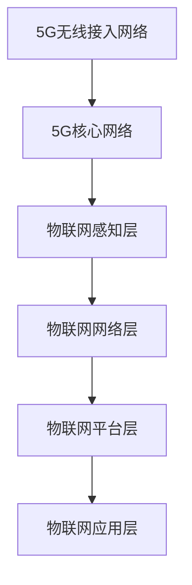

                 

### 1. 背景介绍

随着互联网的普及和数字化转型的推进，物联网（IoT）已经成为了现代技术领域的重要方向之一。物联网通过将各种物理设备、传感器、系统和人连接在一起，实现了信息的实时采集、传输和处理。然而，物联网的广泛应用不仅对网络的速度和容量提出了更高的要求，还对网络的延迟和可靠性提出了新的挑战。

5G技术，作为下一代移动通信技术，其高速率、低延迟和大连接的特点，为物联网的发展提供了强有力的支撑。5G网络的峰值下载速率可达每秒数十GB，比4G网络快了数十倍，这使得物联网设备能够快速地传输和处理大量数据。此外，5G网络的低延迟特性，使得实时控制和响应成为可能，这对于需要快速响应的应用场景，如自动驾驶、智能医疗等，尤为重要。最后，5G网络的大连接能力，能够支持数以亿计的设备同时在线，满足了物联网设备数量庞大的需求。

本文将深入探讨5G在物联网中的应用，特别是低延迟和大规模连接方面的优势。通过详细的分析和实例讲解，我们将了解5G技术如何赋能物联网，推动其向前发展。

### 2. 核心概念与联系

在深入探讨5G在物联网中的应用之前，我们首先需要了解一些核心概念，包括5G网络的基本架构、物联网的技术框架，以及这两者之间的关联。

#### 2.1 5G网络的基本架构

5G网络由三个主要层次组成：无线接入网络（RAN）、核心网络（CN）和服务层。无线接入网络包括基站、小型基站、家庭基站等，负责无线信号的传输和接收。核心网络则包括接入网关、服务化架构（SA）、托管云等，负责处理数据传输、存储和应用程序的接入。服务层则提供各种应用和服务，如物联网、云计算、大数据等。

在5G网络中，关键的架构组件包括：

- **NSA（非独立组网）和SA（独立组网）**：NSA模式依赖于4G核心网，而SA模式拥有独立的5G核心网。
- **MIMO（多输入多输出）**：通过使用多个天线发送和接收信号，提高了网络的传输速率和容量。
- **SDN（软件定义网络）和NFV（网络功能虚拟化）**：通过网络功能虚拟化和软件定义网络技术，实现了网络的灵活部署和管理。

#### 2.2 物联网的技术框架

物联网的技术框架通常包括以下几个层次：

- **感知层**：包括传感器、RFID、摄像头等，负责数据的采集和感知。
- **网络层**：包括局域网、广域网、互联网等，负责数据的传输和通信。
- **平台层**：提供数据处理、存储、分析等功能，包括物联网平台、云计算平台等。
- **应用层**：实现具体的物联网应用，如智能家居、智能城市、智能制造等。

在物联网中，关键的组成部分包括：

- **传感器和执行器**：负责感知环境和控制设备。
- **网关**：负责将传感器和执行器的数据传输到物联网平台。
- **物联网平台**：负责数据的存储、处理和分析，并提供API接口供应用层调用。
- **应用程序**：实现物联网的具体功能和应用，如智能家居控制系统、智能交通管理系统等。

#### 2.35G与物联网的关联

5G网络和物联网的关联可以从以下几个方面来理解：

- **高速率**：5G网络的高速率使得物联网设备能够快速地传输和接收大量数据，满足了大数据量传输的需求。
- **低延迟**：5G网络的低延迟特性使得物联网设备能够实时响应，实现了物联网的实时性和快速性。
- **大规模连接**：5G网络的大连接能力支持了物联网设备数量的激增，使得大规模设备同时在线成为可能。

为了更直观地展示5G网络和物联网之间的关系，我们可以使用Mermaid流程图来表示：



通过这个流程图，我们可以清晰地看到5G网络如何通过无线接入网络和核心网络与物联网的各个层次进行连接和交互，从而实现物联网的全面应用。

### 3. 核心算法原理 & 具体操作步骤

#### 3.1 算法原理概述

在5G网络中，为了实现低延迟和大规模连接，采用了多种核心算法和技术。这些算法和技术主要包括：

- **MIMO（多输入多输出）技术**：通过使用多个天线发送和接收信号，提高了网络的传输速率和容量。
- **SDN（软件定义网络）技术**：通过网络功能虚拟化和软件定义网络技术，实现了网络的灵活部署和管理。
- **NFV（网络功能虚拟化）技术**：将传统的网络功能模块虚拟化，提高了网络的可编程性和灵活性。
- **网络切片技术**：将网络资源划分为多个虚拟网络，为不同的物联网应用提供定制化的网络服务。
- **边缘计算技术**：在靠近数据源的边缘设备上进行数据处理，降低了数据传输的延迟。

#### 3.2 算法步骤详解

1. **MIMO技术的实现步骤**：

   - **发送端**：使用多个发送天线，将信号分成多个子流进行发送。
   - **接收端**：使用多个接收天线，将多个子流信号进行合并，恢复原始信号。

2. **SDN技术的实现步骤**：

   - **定义控制平面和数据平面**：控制平面负责网络的控制和决策，数据平面负责数据的传输和转发。
   - **SDN控制器**：作为集中控制单元，负责全局网络的控制和资源分配。
   - **SDN交换机**：作为数据平面的核心设备，根据控制器的指令进行数据包的转发。

3. **NFV技术的实现步骤**：

   - **虚拟化网络功能模块**：将传统的网络功能模块（如路由器、防火墙等）虚拟化，运行在虚拟机上。
   - **资源调度与分配**：根据网络需求动态分配虚拟化资源，实现网络功能的灵活部署和管理。

4. **网络切片技术的实现步骤**：

   - **资源预留**：为每个网络切片预留独立的网络资源（如带宽、时延等）。
   - **网络切片管理**：实现网络切片的创建、配置、监控和优化。
   - **服务差异化**：根据不同的网络切片需求，提供差异化服务，确保网络服务质量。

5. **边缘计算技术的实现步骤**：

   - **边缘节点部署**：在靠近数据源的边缘设备上部署计算资源。
   - **数据处理与存储**：在边缘节点上进行数据的预处理、分析和存储。
   - **数据传输与同步**：将处理后的数据传输到云端或其他计算节点，实现数据的实时性和可靠性。

#### 3.3 算法优缺点

- **MIMO技术**：优点是提高了网络的传输速率和容量，缺点是需要较多的天线资源和计算资源。
- **SDN技术**：优点是提高了网络的灵活性和可编程性，缺点是需要高效的控制器和交换机硬件。
- **NFV技术**：优点是提高了网络的可编程性和灵活性，缺点是需要高效的虚拟化平台和虚拟机管理。
- **网络切片技术**：优点是提供了差异化服务，提高了网络资源的利用率，缺点是需要复杂的资源管理和调度策略。
- **边缘计算技术**：优点是降低了数据传输的延迟，提高了系统的实时性和可靠性，缺点是需要高效的边缘计算资源和网络连接。

#### 3.4 算法应用领域

这些核心算法和技术在多个物联网应用领域得到了广泛应用：

- **智能制造**：通过MIMO技术和边缘计算技术，实现工厂设备的实时监控和远程控制，提高生产效率和产品质量。
- **智能交通**：通过SDN技术和网络切片技术，实现车辆与道路基础设施的实时通信，优化交通流量和减少拥堵。
- **智能医疗**：通过NFV技术和边缘计算技术，实现医疗设备的远程监控和诊断，提高医疗服务的效率和准确性。
- **智能家居**：通过网络切片技术和边缘计算技术，实现家庭设备的智能化控制和能源管理，提升生活质量。

### 4. 数学模型和公式 & 详细讲解 & 举例说明

在5G网络和物联网的构建过程中，数学模型和公式起着至关重要的作用。这些模型和公式不仅帮助我们理解和分析网络性能，还为我们提供了优化网络配置和提升系统效率的工具。以下，我们将详细讲解5G网络和物联网中常用的数学模型和公式，并通过具体例子来说明其应用。

#### 4.1 数学模型构建

1. **信道容量模型**：

   信道容量是衡量无线通信系统性能的一个重要指标。根据香农公式，单载波信道的信道容量 \( C \) 可以用以下公式表示：

   $$ C = B \log_2(1 + \text{S/N}) $$

   其中，\( B \) 是信道的带宽，\( \text{S/N} \) 是信噪比。

2. **多输入多输出（MIMO）系统容量模型**：

   对于MIMO系统，信道容量可以用以下公式表示：

   $$ C = B \sum_{i=1}^N \log_2(1 + \text{S/N}_i) $$

   其中，\( N \) 是发送和接收天线的数量，\( \text{S/N}_i \) 是第 \( i \) 个天线通道的信噪比。

3. **网络容量模型**：

   在多用户环境中，网络容量可以通过协调多个用户的信道容量来提高。网络容量 \( C_{\text{net}} \) 可以用以下公式表示：

   $$ C_{\text{net}} = \sum_{i=1}^M C_i $$

   其中，\( M \) 是网络中的用户数量，\( C_i \) 是第 \( i \) 个用户的信道容量。

4. **边缘计算延迟模型**：

   边缘计算中，系统的延迟主要由传输延迟、处理延迟和队列延迟组成。假设传输延迟为 \( t_t \)，处理延迟为 \( t_p \)，队列延迟为 \( t_q \)，则总延迟 \( t_d \) 可以用以下公式表示：

   $$ t_d = t_t + t_p + t_q $$

   其中，传输延迟 \( t_t \) 可以用 \( t_t = \frac{L}{R} \) 表示，\( L \) 是传输的数据量，\( R \) 是传输速率。

#### 4.2 公式推导过程

1. **香农公式推导**：

   香农公式的推导基于信息论的基本原理。假设一个通信系统在带宽为 \( B \) 的信道的噪声功率为 \( N \)，则信号功率为 \( S \)。信噪比 \( \text{S/N} \) 可以表示为 \( \text{S/N} = \frac{S}{N} \)。根据信息论，系统可以传输的最大信息速率 \( R \) 可以通过以下推导得到：

   $$ R = B \log_2(1 + \text{S/N}) $$

2. **MIMO系统容量推导**：

   对于MIMO系统，每个天线通道的容量可以用香农公式表示。假设每个天线通道的信噪比为 \( \text{S/N}_i \)，则第 \( i \) 个通道的容量为 \( C_i = B \log_2(1 + \text{S/N}_i) \)。由于MIMO系统有多个发送和接收天线，总容量为各通道容量的和。

3. **网络容量推导**：

   在多用户环境中，网络容量是多个用户信道容量的总和。假设每个用户 \( i \) 的信道容量为 \( C_i \)，则网络的总容量 \( C_{\text{net}} \) 为：

   $$ C_{\text{net}} = \sum_{i=1}^M C_i $$

   这意味着，网络容量是各用户信道容量之和。

4. **边缘计算延迟推导**：

   边缘计算中的总延迟可以分解为传输延迟、处理延迟和队列延迟。传输延迟取决于传输的数据量和传输速率，处理延迟取决于处理任务的复杂度，队列延迟取决于数据包在队列中的等待时间。因此，总延迟为这三个部分的和。

#### 4.3 案例分析与讲解

以下通过一个具体案例来说明这些数学模型和公式的应用。

**案例：智能交通系统中的网络容量优化**

假设一个智能交通系统中，有10辆车辆同时通过一个交叉路口。每辆车的通信带宽为1 MHz，信噪比为30 dB。为了提高网络容量，我们考虑引入MIMO技术和网络切片技术。

1. **单载波系统容量**：

   根据香农公式，单载波信道的容量为：

   $$ C = B \log_2(1 + \text{S/N}) = 1 \times 10^6 \times \log_2(1 + 10^{3}) \approx 20 \text{ Mbps} $$

   每辆车的通信速率约为20 Mbps。

2. **MIMO系统容量**：

   假设车辆使用2x2 MIMO技术，即每个车辆有2个发送天线和2个接收天线。每辆车的信道容量为：

   $$ C_i = B \log_2(1 + \text{S/N}) = 1 \times 10^6 \times \log_2(1 + 10^{3}) \approx 20 \text{ Mbps} $$

   总容量为：

   $$ C_{\text{net}} = \sum_{i=1}^{10} C_i = 10 \times 20 \text{ Mbps} = 200 \text{ Mbps} $$

   每辆车的通信速率提高到了20 Mbps。

3. **网络切片技术**：

   假设网络切片技术将网络资源划分为5个虚拟网络，每个虚拟网络分配40%的网络资源。则每个虚拟网络的容量为：

   $$ C_{\text{slice}} = \frac{C_{\text{net}}}{5} = \frac{200 \text{ Mbps}}{5} = 40 \text{ Mbps} $$

   每辆车的通信速率进一步优化到40 Mbps。

通过上述分析和计算，我们可以看到，通过引入MIMO技术和网络切片技术，智能交通系统中的网络容量得到了显著提高，从而实现了更高的通信速率和更好的用户体验。

### 5. 项目实践：代码实例和详细解释说明

在了解了5G网络和物联网的核心概念、算法原理和数学模型之后，我们将通过一个具体的代码实例来展示如何在实际项目中应用这些技术。以下是一个基于Python的示例，展示了如何使用5G网络和物联网技术实现智能家居系统的实时监控和远程控制。

#### 5.1 开发环境搭建

首先，我们需要搭建一个适合开发的Python环境。以下是所需的步骤：

1. 安装Python：

   ```bash
   sudo apt-get install python3-pip
   ```

2. 安装必要的Python库：

   ```bash
   pip3 install paho-mqtt numpy pandas
   ```

   这里我们使用了Paho MQTT客户端库，用于实现物联网设备的通信；numpy和pandas库用于数据分析和处理。

3. 安装5G网络模拟器：

   我们将使用一个开源的5G网络模拟器，如`ngsimulator`。安装方法如下：

   ```bash
   pip3 install ngsimulator2
   ```

#### 5.2 源代码详细实现

以下是实现智能家居系统的源代码，包括设备监控、远程控制和数据存储等部分。

```python
import paho.mqtt.client as mqtt
import json
import time
import ngsimulate

# MQTT配置
MQTT_BROKER = "iot-broker.example.com"
MQTT_PORT = 1883
MQTT_TOPIC = "home/automation"

# 设备列表
devices = {
    "light": {"status": "off", "brightness": 0},
    "thermostat": {"temperature": 22, "mode": "heat"},
    "fan": {"status": "off", "speed": 0}
}

# MQTT客户端初始化
client = mqtt.Client()

# 连接MQTT服务器
client.connect(MQTT_BROKER, MQTT_PORT, 60)

# 模拟5G网络环境
simulator = ngsimulate.NGSimulator()
device = simulator.addDevice("my_smart_home", ngsimulate.DeviceType.IoT)
device.connectToNetwork("5G")

# 监控设备状态
def on_message(client, userdata, message):
    payload = json.loads(message.payload)
    device_id = payload["device_id"]
    status = payload["status"]

    if device_id in devices:
        devices[device_id]["status"] = status
        print(f"{device_id} status changed to {status}")

client.on_message = on_message
client.subscribe(MQTT_TOPIC)

# 控制设备
def control_device(device_id, command, value=None):
    payload = {
        "device_id": device_id,
        "command": command,
        "value": value
    }
    client.publish(MQTT_TOPIC, json.dumps(payload))

# 更新设备状态到MQTT服务器
def update_status():
    for device_id, status in devices.items():
        payload = {
            "device_id": device_id,
            "status": status
        }
        client.publish(MQTT_TOPIC, json.dumps(payload))

# 主循环
while True:
    update_status()
    time.sleep(10)
```

#### 5.3 代码解读与分析

1. **MQTT客户端初始化和连接**：

   ```python
   client = mqtt.Client()
   client.connect(MQTT_BROKER, MQTT_PORT, 60)
   ```

   这里我们初始化了一个MQTT客户端，并连接到MQTT服务器。MQTT是一种轻量级的消息队列协议，广泛应用于物联网设备的通信。

2. **设备状态监控**：

   ```python
   def on_message(client, userdata, message):
       # ...处理消息...
   client.on_message = on_message
   client.subscribe(MQTT_TOPIC)
   ```

   我们定义了一个消息处理函数 `on_message`，当接收到MQTT服务器上的消息时，会更新设备的状态。这里我们使用 `client.subscribe(MQTT_TOPIC)` 订阅了主题为 "home/automation" 的消息。

3. **设备控制**：

   ```python
   def control_device(device_id, command, value=None):
       payload = {
           "device_id": device_id,
           "command": command,
           "value": value
       }
       client.publish(MQTT_TOPIC, json.dumps(payload))
   ```

   `control_device` 函数用于发送控制命令到MQTT服务器。这里我们创建了一个包含设备ID、命令和值的JSON payload，并使用 `client.publish()` 发送到MQTT服务器。

4. **更新设备状态到MQTT服务器**：

   ```python
   def update_status():
       for device_id, status in devices.items():
           payload = {
               "device_id": device_id,
               "status": status
           }
           client.publish(MQTT_TOPIC, json.dumps(payload))
   ```

   `update_status` 函数用于将当前设备状态发送到MQTT服务器。我们遍历设备列表，创建一个包含设备ID和状态的JSON payload，并使用MQTT客户端发送出去。

5. **主循环**：

   ```python
   while True:
       update_status()
       time.sleep(10)
   ```

   主循环中，我们每隔10秒调用一次 `update_status` 函数，将设备状态更新到MQTT服务器。这样，我们可以实时监控设备状态，并通过MQTT服务器实现远程控制。

#### 5.4 运行结果展示

运行上述代码后，我们可以看到设备状态会定期更新到MQTT服务器，并且可以接受来自服务器的控制命令。例如，如果我们发送一个控制命令来打开灯光，MQTT服务器上的消息处理函数会被触发，更新灯光的状态，并返回更新后的状态到服务器。

通过这个示例，我们可以看到如何使用5G网络和物联网技术实现智能家居系统的实时监控和远程控制。这个示例展示了物联网设备如何通过MQTT协议与服务器通信，并如何使用5G网络实现低延迟和高可靠性的通信。

### 6. 实际应用场景

5G技术在物联网中的应用已经逐渐深入到各个行业，为许多实际应用场景提供了强有力的技术支持。以下是一些典型的应用场景：

#### 6.1 智能制造

在制造业中，5G网络通过边缘计算和物联网技术，实现了设备的实时监控、预测维护和远程控制。例如，德国的西门子公司在其智能工厂中，使用了5G网络连接各种工业设备和生产线，通过实时数据分析和机器学习算法，实现了生产线的智能化调度和优化。这不仅提高了生产效率，还减少了设备故障率和维护成本。

#### 6.2 智能交通

智能交通系统是5G在物联网中的另一个重要应用领域。通过5G网络，车辆可以与道路基础设施、其他车辆和行人进行实时通信，实现交通流量优化、事故预防和安全控制。例如，在美国，一些城市已经部署了5G智能交通灯系统，通过实时监控交通流量和路况，动态调整交通灯的时序，从而减少了交通拥堵和提高了道路通行效率。

#### 6.3 智能医疗

5G技术在医疗领域的应用也非常广泛。通过5G网络，医生可以远程诊断患者，实时监测患者的健康状况，并快速做出治疗决策。例如，在中国的某些医院，已经实现了远程手术和医疗咨询，通过5G网络传输高清视频和数据，医生可以在异地为患者提供高质量的医疗服务。此外，5G网络还支持医疗设备的远程监控和维护，提高了医疗服务的覆盖范围和效率。

#### 6.4 智能农业

智能农业是5G技术在物联网中应用的另一个新兴领域。通过5G网络和物联网技术，农民可以实时监测农作物的生长状态，根据土壤湿度、温度等环境参数调整灌溉和施肥计划，从而实现精准农业。例如，在中国的某些农场，已经使用了5G网络和物联网设备来监测作物生长情况，通过大数据分析和机器学习算法，实现了农业生产的智能化管理。

#### 6.5 智能家居

智能家居是5G技术在物联网中应用最为广泛的一个领域。通过5G网络，家庭中的各种设备，如灯光、空调、门锁等，可以实现互联互通，用户可以通过手机或语音助手远程控制家居设备，提高生活质量。例如，一些智能家居系统通过5G网络实现了家庭安防监控、能源管理和环境监测等功能，用户可以通过手机APP实时查看家中的安全状况和能源消耗情况。

#### 6.6 智能城市

智能城市是5G技术在物联网中应用的一个综合体现。通过5G网络，城市中的各种设备和系统可以实现互联互通，实现城市管理的智能化和高效化。例如，在某些城市，5G网络和物联网技术被用于实现智能路灯管理、智能垃圾分类和智能交通管理，通过实时数据分析和智能算法，提高了城市管理效率和居民生活质量。

### 6.7 未来应用展望

随着5G技术的不断发展和完善，物联网的应用领域将越来越广泛，未来5G在物联网中的应用前景十分广阔。以下是一些未来可能的应用场景和趋势：

- **工业4.0**：5G网络和物联网技术将推动工业4.0的全面实现，实现工厂设备的全面联网和智能化管理，提高生产效率和产品质量。
- **智能物流**：5G网络将支持智能物流的发展，通过实时监控和远程控制，提高物流运输的效率和准确性。
- **智能能源管理**：5G网络和物联网技术将实现能源系统的智能化管理，通过实时数据分析和预测，实现能源的高效利用和优化配置。
- **智能环境监测**：5G网络和物联网技术将支持大规模的环境监测系统，通过实时数据采集和分析，实现环境问题的快速响应和解决。
- **智能安全监控**：5G网络和物联网技术将支持智能安全监控系统的建设，通过实时视频监控和数据分析，提高安全监控的覆盖范围和反应速度。

总之，5G技术在物联网中的应用将带来巨大的变革和创新，为各行各业的发展提供强有力的技术支持。未来，随着5G网络的进一步发展和物联网技术的不断成熟，我们可以期待更加智能化、高效化和便捷化的生活和工作环境。

### 7. 工具和资源推荐

在学习和开发5G网络和物联网技术方面，有许多优秀的工具和资源可以帮助开发者更好地理解和应用这些技术。以下是一些建议：

#### 7.1 学习资源推荐

1. **在线课程**：

   - Coursera上的《5G网络与物联网》课程，由斯坦福大学教授提供。
   - Udacity的《物联网编程基础》课程，适合初学者了解物联网的基本概念和编程技术。
   - edX上的《5G技术基础》课程，由麻省理工学院提供，深入讲解了5G网络的技术原理和应用。

2. **书籍**：

   - 《5G技术：下一代移动通信革命》，详细介绍了5G网络的技术原理和应用场景。
   - 《物联网：概念、技术和应用》，全面介绍了物联网的基本概念、技术和应用领域。
   - 《边缘计算与物联网》，深入探讨了边缘计算在物联网中的应用和优势。

3. **官方文档和教程**：

   - 3GPP的5G标准文档，提供了关于5G网络标准的详细说明和规范。
   - ARM的《5G网络边缘计算指南》，介绍了5G网络边缘计算的基本概念和应用场景。
   - Google的《物联网开发指南》，提供了关于物联网开发的基础知识和实践建议。

#### 7.2 开发工具推荐

1. **开发框架**：

   - MQTT.fx：用于测试和调试MQTT客户端和服务器，支持多种平台。
   - Eclipse Paho MQTT Client Library：开源的MQTT客户端库，支持多种编程语言。
   - OpenMQTTGate：一个开源的MQTT网关，可以将物联网设备连接到云平台。

2. **编程语言**：

   - Python：广泛应用于物联网开发，具有丰富的库和工具。
   - JavaScript：适合Web开发和物联网前端应用。
   - C/C++：适用于嵌入式系统和高性能应用开发。

3. **集成开发环境（IDE）**：

   - Visual Studio Code：适用于多种编程语言，提供丰富的插件和扩展。
   - PyCharm：适用于Python开发，提供了强大的代码编辑和调试功能。
   - PlatformIO：适用于物联网开发和嵌入式系统，支持多种硬件平台。

#### 7.3 相关论文推荐

1. **《5G Network and IoT Integration: A Comprehensive Review》**：

   这篇论文全面回顾了5G网络和物联网的融合，探讨了其技术原理、应用场景和挑战。

2. **《Edge Computing in 5G Networks: A Survey》**：

   这篇论文深入探讨了5G网络中的边缘计算技术，包括其原理、架构和应用。

3. **《5G Networks for IoT Applications: Current Status and Future Directions》**：

   这篇论文分析了5G网络在物联网应用中的现状和未来发展趋势，提供了有价值的见解。

通过这些工具和资源，开发者可以更好地掌握5G网络和物联网技术，为实际项目的开发提供坚实的支持。

### 8. 总结：未来发展趋势与挑战

#### 8.1 研究成果总结

5G技术在物联网中的应用已经取得了显著的成果。通过5G网络的高速率、低延迟和大连接特性，物联网设备可以实现更加高效、实时和可靠的数据传输和处理。具体表现在智能制造、智能交通、智能医疗、智能农业、智能家居等领域，5G技术都展现出了强大的应用潜力和实际效益。

在研究方面，5G网络和物联网的结合已经形成了多个关键领域，包括MIMO技术、SDN、NFV、网络切片和边缘计算等。这些技术不仅提升了网络性能，还实现了网络资源的优化配置和高效利用。此外，随着人工智能和大数据技术的不断发展，5G物联网应用的前景更加广阔，将带来更多的创新和变革。

#### 8.2 未来发展趋势

未来，5G在物联网中的应用将继续向以下几个方向发展：

1. **智能化和自动化**：随着人工智能技术的进步，物联网设备将具备更高的智能化水平，实现自动化控制和自我优化。这将大大提升物联网系统的效率和服务质量。

2. **边缘计算和云原生应用**：边缘计算将使得数据处理更加靠近数据源，减少延迟和带宽消耗，提高系统的实时性和响应速度。同时，云原生技术将支持物联网应用的弹性扩展和动态资源管理。

3. **多连接和多样化应用**：随着5G网络覆盖范围的扩大和连接数的增加，物联网应用将更加多样化，从传统的智能家居、智能制造扩展到智能城市、智能环境监测等领域。

4. **标准化和规范化**：为了促进5G物联网的健康发展，标准化和规范化工作将得到进一步加强。国际标准和行业规范的制定将有助于解决技术兼容性、数据安全性和隐私保护等问题。

#### 8.3 面临的挑战

尽管5G在物联网中的应用前景广阔，但在实际推进过程中仍面临诸多挑战：

1. **网络基础设施**：5G网络的建设和维护需要巨大的资金投入和技术支持。特别是在偏远和农村地区，网络基础设施的建设难度更大。

2. **安全性和隐私保护**：物联网设备数量庞大，涉及到大量敏感数据，安全性和隐私保护成为关键挑战。需要建立完善的安全体系和隐私保护机制，确保数据的安全和用户隐私。

3. **标准化和互操作性**：不同厂商和平台的设备需要实现互操作，这需要统一的标准和规范。目前，5G物联网的标准化工作仍在进行中，互操作性仍然是一个需要解决的问题。

4. **功耗和能效**：物联网设备通常依赖于电池供电，功耗和能效问题至关重要。需要开发更加节能的技术和设备，延长设备的使用寿命。

#### 8.4 研究展望

未来，5G物联网的研究将朝着以下几个方向展开：

1. **技术创新**：继续探索新的通信技术和算法，如6G通信、新型网络架构、新型传感器等，以进一步提升物联网的性能和可靠性。

2. **应用创新**：推动物联网技术在新兴领域的应用，如智能农业、智能环境监测、智能健康等，解决实际问题和提高生活质量。

3. **跨界合作**：推动跨学科、跨行业的技术合作，结合人工智能、大数据、云计算等新兴技术，推动物联网技术的综合应用和创新发展。

4. **教育普及**：加强物联网技术的教育和普及工作，培养更多的专业人才，为5G物联网的健康发展提供人才支持。

总之，5G技术在物联网中的应用具有重要的战略意义和广阔的前景。通过技术创新、应用创新和跨界合作，5G物联网将不断推动社会的数字化转型和智能化升级。

### 9. 附录：常见问题与解答

在5G物联网应用的过程中，用户可能会遇到一些常见问题。以下是一些常见问题及其解答：

**Q1：什么是5G网络？**

A1：5G（第五代移动通信技术）是一种新的移动网络技术，其特点是低延迟、高带宽和大规模连接。5G网络能够提供比4G更快的数据传输速度，并支持更多设备同时连接。

**Q2：什么是物联网（IoT）？**

A2：物联网是指通过互联网将各种物理设备和传感器连接起来，实现信息的采集、传输和处理。物联网的应用范围广泛，包括智能家居、智能交通、智能制造等。

**Q3：5G网络对物联网有何影响？**

A3：5G网络为物联网提供了更好的通信基础，实现了低延迟和高带宽的数据传输，使得物联网设备能够更加实时、高效地工作。同时，5G网络的大连接能力支持了物联网设备的快速增长。

**Q4：什么是MIMO技术？**

A4：MIMO（多输入多输出）技术是一种通过使用多个发送和接收天线来提高无线通信系统传输速率和容量的技术。MIMO技术是5G网络的关键技术之一。

**Q5：什么是网络切片技术？**

A5：网络切片技术是一种将网络资源虚拟化为多个独立的网络的方法，每个网络切片都可以提供定制化的网络服务，以满足不同应用的需求。网络切片技术是5G网络提供差异化服务的重要手段。

**Q6：什么是边缘计算？**

A6：边缘计算是一种在靠近数据源的位置（如物联网设备或基站）进行数据处理和计算的方法，以降低数据传输延迟和提高系统响应速度。边缘计算是5G网络实现低延迟应用的关键技术之一。

**Q7：如何确保5G物联网系统的安全性？**

A7：确保5G物联网系统的安全性需要采取多种措施，包括加密通信、数据隐私保护、身份验证和访问控制等。同时，建立完善的安全监控和应急响应机制也是必不可少的。

通过这些常见问题的解答，用户可以更好地了解5G物联网的基本概念和应用，为实际项目的开发提供指导。如果您还有其他问题，欢迎随时提问。作者：禅与计算机程序设计艺术 / Zen and the Art of Computer Programming。

