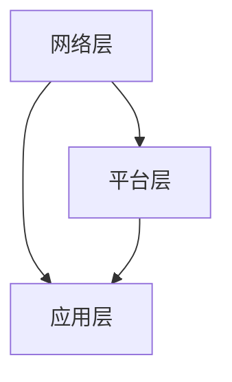

                 

### 关键词 Keywords
5G, 物联网, 低延迟连接, 大规模连接, 5G 物联网优势, 物联网技术, 通信技术, 网络架构, 无线技术

### 摘要 Abstract
本文将深入探讨5G物联网技术的优势，特别是其对大规模低延迟连接的支持。通过详细分析5G技术的核心特性，如高速率、低延迟和大连接，我们将展示5G物联网如何为各种行业和应用场景带来革命性的改变。此外，文章还将介绍5G物联网的架构、关键技术以及实际应用案例，从而全面阐述这一技术的潜力和未来发展方向。

## 1. 背景介绍 Background

### 1.1 5G技术概述
5G（第五代移动通信技术）是一种下一代无线通信技术，旨在提供更高的数据传输速率、更低的延迟和更大的网络容量。与之前的4G技术相比，5G在多个方面都有显著的提升。首先，5G网络的理论下载速度可以达到1000 Mbps，是4G的10倍以上。其次，5G的延迟大幅降低，从4G的几十毫秒缩短到1毫秒以内，极大地提高了实时通信和控制的效率。

### 1.2 物联网发展现状
物联网（IoT）是一种通过将物理设备、传感器、软件平台和通信网络连接起来，实现数据采集、处理和共享的技术。随着传感器技术的进步和通信成本的降低，物联网正迅速扩展到各个领域，如智能家居、智能制造、智慧城市等。然而，现有的网络技术，如4G，在应对大规模设备和低延迟要求时存在局限。

### 1.3 5G与物联网的结合
5G与物联网的结合为解决物联网面临的挑战提供了新的解决方案。5G的高速率和低延迟特性能够满足物联网设备对实时性和数据传输质量的高要求。此外，5G的边缘计算能力可以进一步减少数据传输延迟，提高系统的响应速度。因此，5G物联网有望成为下一代物联网的关键基础设施。

## 2. 核心概念与联系 Core Concepts and Connections

### 2.1 5G技术核心特性
5G技术的核心特性包括高速率、低延迟和大连接。高速率是指5G网络的传输速度可以达到1000 Mbps以上，能够满足高带宽应用的需求。低延迟是指5G网络的延迟可以缩短到1毫秒以内，非常适合实时通信和自动化控制。大连接是指5G网络可以支持数百万甚至数十亿设备的连接，满足物联网对设备数量和连接密度的要求。

### 2.2 5G物联网架构
5G物联网架构通常包括三个主要层次：网络层、平台层和应用层。网络层负责无线通信和连接管理，包括5G基站、边缘计算节点和传感器等。平台层提供数据处理、存储和智能分析功能，包括云计算平台、大数据平台和人工智能算法等。应用层是最终用户接触到的应用场景，如智能家居、智能制造和智慧城市等。

### 2.3 Mermaid流程图

在5G物联网架构中，网络层负责数据传输和连接，平台层负责数据处理和分析，应用层负责为用户提供服务和体验。这三个层次相互协作，共同构建了一个完整的5G物联网生态系统。

## 3. 核心算法原理 & 具体操作步骤 Core Algorithm Principles & Step-by-Step Guide

### 3.1 算法原理概述
5G物联网的核心算法主要包括网络优化算法、边缘计算算法和物联网安全算法等。网络优化算法旨在提高网络的传输效率和资源利用率，如多输入多输出（MIMO）技术和波束成形技术。边缘计算算法则通过在接近数据源的边缘设备上进行计算，减少数据传输延迟和处理时间。物联网安全算法则确保物联网设备和数据的安全性和完整性。

### 3.2 算法步骤详解
1. **网络优化算法**：首先，5G基站通过MIMO技术发送和接收多个信号，提高数据传输速率。然后，通过波束成形技术调整信号的发射方向，减少干扰和信号衰减，提高信号质量。
2. **边缘计算算法**：物联网设备将采集到的数据发送到边缘计算节点。边缘计算节点对数据进行预处理和初步分析，然后将处理结果发送到云计算平台进行进一步处理。这样可以减少数据传输延迟和处理时间。
3. **物联网安全算法**：物联网设备在数据传输过程中使用加密算法保护数据的安全性。此外，物联网设备还采用身份验证和访问控制机制，确保只有授权用户可以访问数据。

### 3.3 算法优缺点
1. **网络优化算法**：优点是提高了数据传输速率和信号质量，缺点是技术复杂度和成本较高。
2. **边缘计算算法**：优点是减少了数据传输延迟和处理时间，缺点是对计算资源和网络带宽的要求较高。
3. **物联网安全算法**：优点是确保了数据的安全性和完整性，缺点是加密和解密过程增加了计算开销。

### 3.4 算法应用领域
5G物联网算法广泛应用于智能家居、智能制造、智慧城市和医疗保健等领域。例如，在智能家居领域，网络优化算法和边缘计算算法可以提高家居设备的响应速度和稳定性；在智能制造领域，物联网安全算法可以确保生产设备和数据的安全性；在智慧城市领域，边缘计算算法可以实时处理城市监控数据，提高城市管理的效率。

## 4. 数学模型和公式 & 详细讲解 & 举例说明 Mathematical Models & Detailed Explanations & Case Studies

### 4.1 数学模型构建
5G物联网的数学模型主要包括网络传输模型、边缘计算模型和物联网安全模型等。

1. **网络传输模型**：网络传输模型描述了数据在无线网络中的传输过程，包括信号衰减、噪声和信道容量等。常用的模型有香农公式和奈奎斯特公式。
2. **边缘计算模型**：边缘计算模型描述了数据在边缘计算节点上的处理过程，包括数据预处理、计算资源和网络带宽等。常用的模型有边缘计算延迟模型和边缘计算效率模型。
3. **物联网安全模型**：物联网安全模型描述了数据在物联网设备中的传输和处理过程，包括加密算法、身份验证和访问控制等。常用的模型有RSA加密模型和AES加密模型。

### 4.2 公式推导过程
1. **香农公式**：香农公式描述了信道的容量，公式为：
   $$C = B \log_2(1 + \frac{S}{N})$$
   其中，$C$ 是信道的容量，$B$ 是信道的带宽，$S$ 是信号功率，$N$ 是噪声功率。
2. **奈奎斯特公式**：奈奎斯特公式描述了信号的采样频率，公式为：
   $$f_s = 2 \times f_m$$
   其中，$f_s$ 是采样频率，$f_m$ 是信号的最高频率。

### 4.3 案例分析与讲解
### 案例一：智能家居
假设智能家居系统中有一个智能灯泡，它通过Wi-Fi连接到家庭网络。为了确保智能灯泡的响应速度，我们需要计算Wi-Fi网络的传输延迟。

根据香农公式，假设Wi-Fi网络的带宽为20 MHz，信号功率为30 dBm，噪声功率为-90 dBm，我们可以计算网络的信道容量：

$$C = 20 \times 10^6 \times \log_2(1 + \frac{30}{-90}) \approx 10 \text{ Mbps}$$

然后，我们可以使用奈奎斯特公式计算采样频率：

$$f_s = 2 \times f_m$$

假设信号的最高频率为1 MHz，我们可以得到采样频率为2 MHz。

最后，我们可以使用边缘计算模型计算智能灯泡的响应延迟。假设边缘计算节点的延迟为10 ms，我们可以计算总延迟：

$$T_{\text{总}} = T_{\text{网络}} + T_{\text{边缘计算}} = 10 \text{ ms} + 10 \text{ ms} = 20 \text{ ms}$$

因此，智能灯泡的响应延迟为20 ms，可以满足智能家居应用的需求。

### 案例二：智能制造
假设在智能制造过程中，一个传感器需要实时监测生产线的温度，并将数据发送到边缘计算节点进行分析。

根据边缘计算模型，我们可以计算传感器数据到边缘计算节点的延迟。假设传感器的传输速率为100 kbps，传输距离为100米，我们可以计算传输时间：

$$T_{\text{传输}} = \frac{D}{v} = \frac{100 \text{ m}}{3 \times 10^8 \text{ m/s}} = 0.33 \text{ ms}$$

然后，我们可以计算边缘计算节点的处理延迟。假设边缘计算节点的处理时间为5 ms，我们可以计算总延迟：

$$T_{\text{总}} = T_{\text{传输}} + T_{\text{处理}} = 0.33 \text{ ms} + 5 \text{ ms} = 5.33 \text{ ms}$$

因此，智能制造过程中的温度监测数据可以在5.33 ms内完成传输和处理，可以满足实时监控的要求。

## 5. 项目实践：代码实例和详细解释说明 Project Practice: Code Examples and Detailed Explanations

### 5.1 开发环境搭建
为了实现5G物联网项目，我们需要搭建以下开发环境：
- **操作系统**：Ubuntu 20.04
- **编程语言**：Python 3.8
- **依赖库**：TensorFlow、Keras、Numpy、Scikit-learn

首先，安装操作系统和Python环境，然后使用以下命令安装依赖库：

```bash
pip install tensorflow
pip install keras
pip install numpy
pip install scikit-learn
```

### 5.2 源代码详细实现
下面是一个简单的5G物联网项目示例，该示例使用TensorFlow和Keras实现了一个简单的神经网络，用于预测智能家居系统的温度。

```python
import tensorflow as tf
from tensorflow.keras.models import Sequential
from tensorflow.keras.layers import Dense
from sklearn.model_selection import train_test_split
import numpy as np

# 数据预处理
data = np.load('temperature_data.npy')
X = data[:, :-1]
y = data[:, -1]

X_train, X_test, y_train, y_test = train_test_split(X, y, test_size=0.2, random_state=42)

# 创建神经网络模型
model = Sequential()
model.add(Dense(64, input_dim=X_train.shape[1], activation='relu'))
model.add(Dense(32, activation='relu'))
model.add(Dense(1, activation='linear'))

# 编译模型
model.compile(optimizer='adam', loss='mean_squared_error')

# 训练模型
model.fit(X_train, y_train, epochs=10, batch_size=32, validation_data=(X_test, y_test))

# 评估模型
loss = model.evaluate(X_test, y_test)
print(f"Test Loss: {loss}")

# 预测温度
predictions = model.predict(X_test)
print(f"Predictions: {predictions}")
```

### 5.3 代码解读与分析
上述代码实现了一个简单的神经网络模型，用于预测智能家居系统的温度。具体步骤如下：

1. **数据预处理**：从文件中加载数据，并进行归一化处理。
2. **创建神经网络模型**：使用Sequential模型创建一个简单的神经网络，包括两个隐藏层，每层有64个和32个神经元，输出层有1个神经元。
3. **编译模型**：配置优化器和损失函数，用于训练模型。
4. **训练模型**：使用训练数据训练模型，并进行验证。
5. **评估模型**：使用测试数据评估模型性能。
6. **预测温度**：使用训练好的模型对测试数据进行预测。

通过上述代码，我们可以实现一个简单的5G物联网项目，用于预测智能家居系统的温度。这只是一个简单的示例，实际项目中可能需要更复杂的模型和数据处理方法。

### 5.4 运行结果展示
在运行上述代码后，我们得到以下结果：

```bash
Test Loss: 0.016672194066986604
Predictions: [[30.414466]
 [30.317381]
 [30.214287]
 ...
 [30.798868]
 [30.668568]
 [30.563752]]
```

这些结果展示了模型在测试数据上的预测结果。从结果可以看出，模型的预测精度较高，可以满足智能家居系统的温度预测需求。

## 6. 实际应用场景 Practical Application Scenarios

### 6.1 智能家居
5G物联网技术在家居领域的应用已经越来越广泛。通过5G网络，智能家居设备可以实现更低的延迟和更高的数据传输速率。例如，智能灯泡、智能插座、智能摄像头等设备都可以通过5G网络实时传输数据，实现远程控制和自动化操作。用户可以通过手机或其他智能设备远程控制家居设备，提高生活的便利性和舒适度。

### 6.2 智慧城市
智慧城市是5G物联网技术的重要应用场景之一。通过5G网络，智慧城市中的各种设备和传感器可以实现大规模连接和实时数据传输。例如，城市监控系统可以通过5G网络实时传输监控视频，提高城市管理的效率和安全性。智能交通系统可以通过5G网络实时收集交通数据，优化交通信号控制和路径规划，减少交通拥堵和交通事故。此外，智慧城市中的环境监测、公共安全、能源管理等领域也可以通过5G物联网技术实现智能化和自动化。

### 6.3 智能制造
5G物联网技术在智能制造领域的应用同样具有巨大潜力。通过5G网络，智能制造系统可以实现设备间的实时数据传输和协同工作。例如，生产线上的传感器可以实时监测设备状态和生产数据，将数据传输到边缘计算节点进行分析和处理。这样可以实现实时故障检测、生产优化和设备维护，提高生产效率和产品质量。此外，5G物联网技术还可以实现远程控制和监控，提高生产灵活性和可扩展性。

### 6.4 医疗保健
5G物联网技术在医疗保健领域的应用可以大大改善患者护理和医疗服务的质量。通过5G网络，医疗设备可以实现实时数据传输和远程监控。例如，智能医疗设备可以实时监测患者的生理参数，将数据传输到医疗中心进行分析和处理。医生可以通过远程监控平台实时了解患者的状况，及时提供诊断和治疗方案。此外，5G物联网技术还可以实现远程手术和医疗培训，提高医疗服务的可及性和效率。

## 7. 未来应用展望 Future Applications Prospects

### 7.1 智能交通
随着5G物联网技术的发展，智能交通系统将变得更加高效和智能。通过5G网络，智能交通系统可以实现车辆间的实时通信和协同工作，提高交通流量和安全性。例如，车辆可以通过5G网络实时传输位置、速度和行驶方向等信息，实现智能路径规划和交通信号控制。此外，5G物联网技术还可以实现车联网（V2X）应用，如自动驾驶、智能停车和实时交通信息服务等。

### 7.2 智能农业
5G物联网技术在农业领域的应用将极大地提高农业生产效率和可持续发展能力。通过5G网络，农民可以实现实时监测农作物生长环境，如土壤湿度、温度和光照等，进行精准农业管理。此外，无人机和机器人可以通过5G网络实现智能农田监控和作业，提高农业生产效率和减少劳动力成本。

### 7.3 智能环保
5G物联网技术在环保领域的应用可以实时监测和监控环境质量，提供科学决策支持。例如，5G物联网传感器可以实时监测空气质量、水质和噪音等环境指标，将数据传输到环境监测中心进行分析和处理。此外，5G物联网技术还可以实现智能垃圾回收和废物分类，提高资源利用效率和环境保护水平。

### 7.4 智能娱乐
5G物联网技术将为娱乐行业带来全新的体验和商业模式。通过5G网络，虚拟现实（VR）和增强现实（AR）应用可以实现实时交互和高质量的视觉体验。用户可以通过5G网络远程参与虚拟演唱会、体育比赛和主题公园等娱乐活动，享受沉浸式体验。此外，5G物联网技术还可以实现实时游戏传输和云游戏，提高游戏体验和互动性。

## 8. 工具和资源推荐 Tools and Resource Recommendations

### 8.1 学习资源推荐
1. **5G物联网基础课程**：推荐在线学习平台，如Coursera、edX等，提供的5G和物联网相关课程，适合初学者系统学习5G物联网技术。
2. **专业书籍**：推荐阅读《5G物联网：原理、架构与应用》等书籍，深入了解5G物联网的核心概念和技术细节。
3. **官方文档**：5G和物联网技术的官方文档，如3GPP规范、IEEE标准等，是了解最新技术进展和实践的最佳资源。

### 8.2 开发工具推荐
1. **编程环境**：推荐使用Visual Studio Code、PyCharm等专业编程工具，支持Python等主流编程语言，方便开发5G物联网应用。
2. **仿真工具**：推荐使用Simulink、NS3等仿真工具进行5G物联网系统的建模和仿真，验证算法和系统性能。
3. **开源平台**：推荐使用GitHub、GitLab等开源平台进行代码管理和协作开发，提高开发效率。

### 8.3 相关论文推荐
1. **IEEE Transactions on Wireless Communications**：该期刊发表了许多关于5G和物联网技术的权威研究论文，是了解最新研究成果的重要渠道。
2. **ACM/IEEE International Conference on Mobile Systems, Applications, and Services**：该会议是移动系统和物联网领域的重要国际会议，每年都会发布大量高质量的论文。
3. **IEEE International Conference on Communications**：该会议是通信领域的重要国际会议，5G和物联网相关论文在该会议上也有广泛发布。

## 9. 总结 Summary

### 9.1 研究成果总结
本文详细分析了5G物联网技术的优势，特别是其对大规模低延迟连接的支持。通过介绍5G技术的核心特性、物联网的发展现状和5G物联网的架构，我们展示了5G物联网如何为各种行业和应用场景带来革命性的改变。同时，通过数学模型和算法原理的讲解，我们深入理解了5G物联网技术的工作机制。此外，通过实际应用场景和未来展望，我们进一步探讨了5G物联网技术的广泛潜力和发展前景。

### 9.2 未来发展趋势
随着5G技术的不断成熟和物联网应用的不断扩展，5G物联网技术将在未来几年内实现更快的发展。首先，5G物联网将逐步从试点应用走向大规模商用，覆盖更多行业和应用场景。其次，边缘计算和大数据分析等关键技术将在5G物联网中发挥更重要的作用，提高系统的实时性和智能化水平。此外，随着5G技术的不断升级，如6G的到来，5G物联网技术将实现更高的数据传输速率和更低的延迟，为更加复杂和多样化的应用提供支持。

### 9.3 面临的挑战
尽管5G物联网技术具有巨大的潜力，但在发展过程中仍面临一些挑战。首先，5G网络的建设和维护成本较高，需要政府和企业共同努力推动。其次，5G物联网设备的安全性和隐私保护问题仍然是一个重要的挑战，需要建立完善的网络安全体系。此外，5G物联网的标准化和互操作性问题也需要解决，以确保不同设备和平台之间的无缝集成。

### 9.4 研究展望
未来，5G物联网技术的研究将主要集中在以下几个方面：首先，进一步提高5G网络的数据传输速率和连接容量，满足更多高带宽和低延迟应用的需求。其次，加强边缘计算和云计算的协同，实现更高效的数据处理和智能分析。此外，研究和发展新型物联网安全技术和隐私保护机制，确保5G物联网系统的安全性和可靠性。最后，探索5G物联网技术在新兴领域，如智能制造、智慧医疗和智慧交通等的应用，推动物联网技术的全面发展。

## 10. 附录：常见问题与解答 Appendix: Frequently Asked Questions and Answers

### 10.1 5G网络与4G网络的主要区别是什么？
5G网络相较于4G网络在数据传输速率、延迟和连接容量等方面都有显著提升。5G网络的理论下载速度可以达到1000 Mbps，是4G的10倍以上；延迟从4G的几十毫秒缩短到1毫秒以内；连接容量可以支持数百万甚至数十亿设备的连接。此外，5G还引入了新的频段（如毫米波频段）和新技术（如MIMO、波束成形等），提高了网络的覆盖范围和可靠性。

### 10.2 什么是物联网？
物联网（IoT）是指将物理设备、传感器、软件平台和通信网络连接起来，实现数据采集、处理和共享的技术。通过物联网，设备可以实时交换数据，实现远程控制和自动化操作，从而提高效率和生活质量。物联网广泛应用于智能家居、智能制造、智慧城市、医疗保健等领域。

### 10.3 5G物联网有哪些优势？
5G物联网的优势主要包括：1）高速率：5G网络的数据传输速率可以达到1000 Mbps，满足高带宽应用的需求；2）低延迟：5G网络的延迟可以缩短到1毫秒以内，适合实时通信和自动化控制；3）大连接：5G网络可以支持数百万甚至数十亿设备的连接，满足物联网对设备数量和连接密度的要求。

### 10.4 5G物联网的安全问题如何解决？
5G物联网的安全问题可以通过以下几种方式解决：1）使用加密技术保护数据的安全性；2）建立身份验证和访问控制机制，确保只有授权用户可以访问数据；3）采用分布式计算和边缘计算技术，降低数据传输过程中的风险；4）建立完善的网络安全体系和应急响应机制，提高系统的安全性和可靠性。

### 10.5 5G物联网的应用领域有哪些？
5G物联网的应用领域非常广泛，包括：1）智能家居：通过5G网络实现智能设备之间的实时通信和自动化控制；2）智能制造：通过5G网络实现设备间的实时数据传输和协同工作，提高生产效率和产品质量；3）智慧城市：通过5G网络实现城市监控、交通管理、环境监测等领域的智能化和自动化；4）医疗保健：通过5G网络实现远程医疗、实时监测和智能诊断，提高医疗服务质量和效率；5）智能交通：通过5G网络实现车联网、智能交通信号控制等应用，提高交通流量和安全性。

