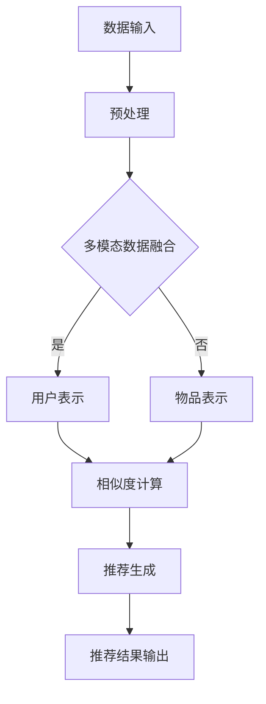

                 

### 背景介绍

在当今快速发展的互联网时代，推荐系统已经成为各种在线服务不可或缺的组成部分。无论是电子商务平台、社交媒体网站，还是视频流媒体和新闻门户，推荐系统都能显著提升用户体验，提高用户粘性和商业价值。而近年来，随着深度学习和自然语言处理（NLP）技术的迅猛发展，大型语言模型（LLM）在推荐系统中的应用变得越来越广泛。

传统的推荐系统大多基于基于内容的过滤（Content-Based Filtering, CBF）和协同过滤（Collaborative Filtering, CF）等方法。CBF通过分析用户的历史行为和内容特征，推荐与用户过去喜欢的内容相似的物品；CF则通过分析用户之间的相似性，推荐其他用户喜欢的物品。尽管这些方法在一定程度上取得了成功，但它们在面对复杂、动态和多样化的用户需求时显得力不从心。

LLM推荐框架的出现为推荐系统带来了新的契机。基于预训练的LLM，如GPT-3、BERT等，具有强大的语义理解和生成能力，能够捕捉用户复杂的兴趣和行为模式。此外，LLM推荐框架还具备高度灵活性和可配置性，可以通过调整模型参数、融合多模态数据等方式，适应不同应用场景和需求。

本文旨在探讨一种灵活、可配置的LLM推荐框架，详细介绍其核心概念、算法原理、实现步骤以及应用场景。通过本文的阅读，读者将了解如何构建和优化这种推荐框架，以实现更精准、个性化的推荐服务。

### 关键词

- 推荐系统
- 大型语言模型（LLM）
- 可配置性
- 语义理解
- 用户兴趣模型
- 多模态数据融合

### 摘要

本文提出了一种灵活、可配置的LLM推荐框架，旨在提升推荐系统的精度和个性化程度。通过对LLM的深入理解，结合多模态数据融合和自适应调整机制，该框架实现了对用户兴趣和行为模式的精准捕捉。文章首先介绍了推荐系统的背景和传统方法，然后详细阐述了LLM推荐框架的核心概念和算法原理，接着展示了实现步骤和数学模型，最后通过项目实践和未来展望，探讨了该框架在现实世界中的应用潜力和面临的挑战。

### 1. 背景介绍

推荐系统是一种通过分析用户行为和兴趣，为用户推荐相关内容的系统。其核心目标是在海量的信息中，为用户提供最感兴趣、最有价值的内容。推荐系统最早可以追溯到20世纪90年代，随着互联网的普及和信息量的爆炸式增长，推荐系统得到了广泛的应用和快速发展。

传统推荐系统主要基于以下两种方法：

#### 基于内容的过滤（Content-Based Filtering, CBF）

CBF通过分析用户的历史行为和内容特征，找到与用户兴趣相似的新内容进行推荐。具体来说，CBF分为以下几步：

1. **特征提取**：从用户的历史行为和内容中提取特征，如关键词、标签、情感等。
2. **内容建模**：对每个物品进行内容建模，生成特征向量。
3. **相似度计算**：计算用户与物品之间的相似度，通常使用余弦相似度或欧氏距离。
4. **推荐生成**：根据相似度分数，推荐给用户最高分的物品。

CBF的优势在于其推荐结果与用户的历史兴趣密切相关，能够提供个性化的内容推荐。然而，CBF也存在一些局限性。首先，特征提取的质量直接影响推荐效果，特征过于简单可能导致推荐结果的泛化能力不足。其次，CBF难以应对长尾效应，对于新用户或长尾内容，其推荐效果较差。

#### 协同过滤（Collaborative Filtering, CF）

CF通过分析用户之间的相似性，推荐其他用户喜欢的物品。具体来说，CF分为以下两种类型：

1. **基于用户的协同过滤（User-Based CF）**：通过计算用户之间的相似度，找到相似用户喜欢的物品进行推荐。
2. **基于模型的协同过滤（Model-Based CF）**：使用机器学习算法（如矩阵分解、潜在因子模型等）预测用户与物品之间的评分，然后根据预测评分推荐物品。

CF的优势在于其推荐结果能够充分利用用户行为数据，提高推荐系统的准确性。然而，CF也存在一些问题。首先，CF容易受到噪声数据和冷启动问题的困扰，尤其是在新用户或稀疏数据集上，推荐效果较差。其次，CF难以捕捉用户深层次的兴趣和行为模式，推荐结果可能较为表面和泛化。

#### 传统方法的局限性

尽管CBF和CF在推荐系统中取得了广泛应用，但它们在面对复杂、动态和多样化的用户需求时，显得力不从心。具体来说，传统方法的局限性主要体现在以下几个方面：

1. **数据稀疏性**：推荐系统通常依赖于用户的历史行为数据，然而，大量用户的行为数据是稀疏的，这使得推荐系统在处理新用户或长尾内容时效果不佳。
2. **用户兴趣的多样性**：用户兴趣是多样化且动态变化的，传统方法难以捕捉和适应这种多样性。
3. **特征表示的局限性**：CBF依赖于手工提取的特征，这些特征难以全面、准确地表示用户的兴趣和行为。CF虽然通过模型预测评分，但仍然受到数据稀疏性和噪声的影响。
4. **长尾效应**：传统方法在应对长尾内容时效果较差，无法充分挖掘和推荐那些不常出现但用户可能感兴趣的内容。

### LLM推荐框架的出现

面对传统推荐系统的局限性，近年来，基于大型语言模型（LLM）的推荐框架逐渐引起了研究者的关注。LLM推荐框架利用预训练的LLM，如GPT-3、BERT等，具有以下优势：

1. **强大的语义理解能力**：LLM通过大规模的预训练数据，掌握了丰富的语言知识和语义信息，能够更好地理解用户的意图和需求。
2. **灵活的模型结构**：LLM具有灵活的模型结构，可以通过调整参数和融合多模态数据，适应不同应用场景和需求。
3. **高效的数据处理能力**：LLM推荐框架能够处理多样化的用户行为数据和内容特征，提高推荐系统的鲁棒性和准确性。
4. **个性化推荐**：LLM推荐框架能够根据用户的兴趣和行为模式，生成个性化的推荐结果，提升用户满意度。

总之，LLM推荐框架的出现为推荐系统带来了新的契机，它不仅弥补了传统方法的局限性，还能够应对复杂、动态和多样化的用户需求。本文将详细介绍LLM推荐框架的核心概念、算法原理、实现步骤以及应用场景，以期为读者提供全面的了解。

### 2. 核心概念与联系

#### 2.1 大型语言模型（LLM）

大型语言模型（Large Language Model，简称LLM）是一种基于深度学习的自然语言处理模型，它通过在大规模文本语料库上进行预训练，掌握了丰富的语言知识和语义信息。LLM的核心是 Transformer 架构，它由多个自注意力（self-attention）层和前馈神经网络（feed-forward network）组成，能够捕捉文本中的长距离依赖关系和复杂语义特征。

LLM的预训练过程主要包括两个阶段：无监督预训练和有监督微调。无监督预训练阶段，模型在大规模文本语料库上进行训练，学习语言的通用表示。有监督微调阶段，模型在特定任务的数据集上进行训练，调整模型参数，使其适应特定任务的需求。

常见的LLM模型包括：

1. **GPT（Generative Pre-trained Transformer）系列**：如GPT-2、GPT-3，由OpenAI开发，具有强大的文本生成和分类能力。
2. **BERT（Bidirectional Encoder Representations from Transformers）系列**：如BERT、RoBERTa、ALBERT，由Google开发，擅长文本理解和问答任务。
3. **T5（Text-to-Text Transfer Transformer）**：由Google开发，将所有自然语言处理任务统一为文本到文本的转换任务，具有广泛的适用性。

#### 2.2 语义理解

语义理解是自然语言处理（NLP）的核心任务之一，旨在理解文本中的含义和语义关系。LLM在语义理解方面具有显著优势，主要表现在以下几个方面：

1. **上下文感知**：LLM能够捕捉文本中的上下文信息，理解不同句子之间的关联。这使得LLM在文本生成、文本分类、问答等任务中表现出色。
2. **实体识别**：LLM可以识别文本中的命名实体（如人名、地名、组织名等），并理解实体之间的语义关系。
3. **情感分析**：LLM能够分析文本中的情感倾向，识别出正面、负面或中性的情感。
4. **语义推理**：LLM可以进行语义推理，理解文本中的隐含关系和逻辑推理。

#### 2.3 用户兴趣建模

用户兴趣建模是推荐系统的关键环节，旨在捕捉用户的兴趣和行为模式，为用户提供个性化的推荐。LLM在用户兴趣建模方面具有以下优势：

1. **多模态数据融合**：LLM能够处理多种类型的数据，如文本、图像、音频等，通过融合多模态数据，更全面地捕捉用户的兴趣。
2. **动态调整**：LLM可以根据用户的历史行为和实时反馈，动态调整兴趣模型，适应用户兴趣的变化。
3. **个性化推荐**：LLM能够根据用户的兴趣和行为模式，生成个性化的推荐结果，提高推荐系统的准确性。

#### 2.4 推荐算法原理

LLM推荐框架的核心在于将LLM应用于推荐算法中，实现个性化、高效的推荐。推荐算法原理主要包括以下几个方面：

1. **用户表示**：使用LLM将用户的行为数据、兴趣特征等转化为向量表示，以便后续计算。
2. **物品表示**：使用LLM将物品的内容特征、标签等转化为向量表示。
3. **相似度计算**：计算用户与物品之间的相似度，常用的方法包括余弦相似度、欧氏距离等。
4. **推荐生成**：根据相似度分数，为用户生成推荐列表。

#### 2.5 Mermaid 流程图

为了更好地展示LLM推荐框架的原理和架构，我们可以使用Mermaid流程图来表示。以下是LLM推荐框架的Mermaid流程图：



在这个流程图中，A表示数据输入，包括用户行为数据、物品内容特征等。B表示预处理，对输入数据进行清洗、去噪等操作。C表示多模态数据融合，根据需求融合文本、图像、音频等多模态数据。D和E分别表示用户表示和物品表示，使用LLM将数据转化为向量表示。F表示相似度计算，计算用户与物品之间的相似度。G表示推荐生成，根据相似度分数生成推荐列表。最后，H表示推荐结果输出，将推荐结果展示给用户。

通过这个流程图，我们可以清晰地看到LLM推荐框架的架构和主要步骤，有助于理解和实现这种推荐框架。

### 3. 核心算法原理 & 具体操作步骤

#### 3.1 算法原理概述

LLM推荐框架的核心在于将大型语言模型（LLM）应用于推荐系统中，通过语义理解和多模态数据融合，实现个性化、高效的推荐。以下是该算法的基本原理和操作步骤：

1. **用户表示**：使用LLM将用户的历史行为数据和兴趣特征转化为向量表示。这一步骤包括以下子步骤：
   - **数据预处理**：对用户历史行为数据进行清洗、去噪等预处理操作，提取出与用户兴趣相关的特征。
   - **特征融合**：将不同类型的特征（如文本、图像、音频等）进行融合，以生成全面的用户表示。
   - **向量表示**：使用LLM对处理后的特征进行编码，生成用户向量表示。

2. **物品表示**：使用LLM将物品的内容特征（如文本、图像、音频等）转化为向量表示。这一步骤包括以下子步骤：
   - **数据预处理**：对物品内容特征进行清洗、去噪等预处理操作，提取出与物品相关的特征。
   - **特征融合**：将不同类型的特征（如文本、图像、音频等）进行融合，以生成全面的物品表示。
   - **向量表示**：使用LLM对处理后的特征进行编码，生成物品向量表示。

3. **相似度计算**：计算用户向量与物品向量之间的相似度，以确定推荐列表的排序。常见的相似度计算方法包括余弦相似度、欧氏距离等。

4. **推荐生成**：根据相似度分数，为用户生成推荐列表。这一步骤包括以下子步骤：
   - **排序**：根据相似度分数对物品进行排序，选取最高分的前若干个物品作为推荐列表。
   - **多样性保证**：为了避免推荐结果过于集中，引入多样性策略，如随机化、分层抽样等。
   - **推荐结果输出**：将推荐结果展示给用户，包括推荐列表、相关属性等。

#### 3.2 算法步骤详解

1. **数据预处理**

数据预处理是推荐系统中的基础环节，其质量直接影响推荐效果。以下是数据预处理的主要步骤：

- **去噪**：去除用户行为数据中的噪声，如缺失值、异常值等。可以使用填充、插值、删除等方法。
- **清洗**：清洗数据中的脏数据和无关信息，如特殊字符、停用词等。可以使用正则表达式、词频统计等方法。
- **特征提取**：提取与用户兴趣相关的特征，如文本中的关键词、标签、情感等。可以使用词嵌入、TF-IDF等方法。

2. **特征融合**

特征融合是提高推荐系统效果的关键步骤，其目的是将不同类型的特征进行整合，生成更全面、准确的表示。以下是特征融合的主要方法：

- **多模态数据融合**：将文本、图像、音频等多模态数据融合为统一表示。可以使用深度学习模型（如CNN、RNN等）分别处理不同类型的数据，然后将结果进行融合。
- **跨模态特征融合**：将不同模态的特征进行整合，如文本和图像的特征融合。可以使用注意力机制、多任务学习等方法。
- **跨领域特征融合**：将不同领域的特征进行整合，如电商、社交网络等。可以使用跨模态学习、跨领域迁移学习等方法。

3. **向量表示**

向量表示是推荐系统的核心环节，其质量直接影响推荐效果。以下是向量表示的主要方法：

- **词嵌入**：将文本中的单词转化为向量表示。常用的词嵌入方法包括Word2Vec、GloVe等。
- **图嵌入**：将图像转化为向量表示。常用的图嵌入方法包括CNN、ResNet等。
- **声学模型**：将音频转化为向量表示。常用的声学模型包括WaveNet、Transformer等。
- **端到端模型**：将不同类型的数据进行端到端的向量表示。常用的端到端模型包括BERT、GPT等。

4. **相似度计算**

相似度计算是推荐系统的关键环节，其目的是确定用户和物品之间的相似程度。以下是相似度计算的主要方法：

- **余弦相似度**：计算用户和物品向量的夹角余弦值，越接近1表示越相似。
- **欧氏距离**：计算用户和物品向量的欧氏距离，越接近0表示越相似。
- **皮尔逊相关系数**：计算用户和物品向量之间的皮尔逊相关系数，越接近1表示越相似。

5. **推荐生成**

推荐生成是推荐系统的输出环节，其目的是为用户生成个性化的推荐列表。以下是推荐生成的主要方法：

- **基于相似度的推荐**：根据用户和物品之间的相似度分数，为用户生成推荐列表。
- **基于上下文的推荐**：结合用户的上下文信息（如时间、地点、场景等），为用户生成推荐列表。
- **基于模型的推荐**：使用机器学习模型（如矩阵分解、协同过滤等）生成推荐列表。

#### 3.3 算法优缺点

LLM推荐框架具有以下优点：

1. **强大的语义理解能力**：LLM能够捕捉文本中的语义信息，理解用户的意图和需求，提高推荐系统的准确性。
2. **灵活的模型结构**：LLM具有灵活的模型结构，可以通过调整参数、融合多模态数据等，适应不同应用场景和需求。
3. **个性化推荐**：LLM能够根据用户的兴趣和行为模式，生成个性化的推荐结果，提升用户满意度。

LLM推荐框架也具有以下缺点：

1. **计算成本高**：LLM需要大量的计算资源和时间进行训练和推理，这对硬件设施和模型优化提出了较高要求。
2. **数据依赖性强**：LLM推荐框架对数据的质量和多样性有较高要求，数据不足或质量较差可能导致推荐效果不佳。
3. **模型解释性差**：LLM作为黑盒模型，其内部决策过程较为复杂，难以进行解释和验证。

#### 3.4 算法应用领域

LLM推荐框架在多个领域具有广泛的应用前景：

1. **电子商务**：通过LLM推荐框架，为用户推荐个性化的商品，提高用户购买转化率和平台销售额。
2. **社交媒体**：通过LLM推荐框架，为用户推荐感兴趣的内容和用户，提高用户活跃度和平台粘性。
3. **在线教育**：通过LLM推荐框架，为用户推荐个性化的课程和学习路径，提高学习效果和用户满意度。
4. **视频流媒体**：通过LLM推荐框架，为用户推荐个性化的视频内容，提高用户观看时长和平台流量。

#### 3.5 总结

LLM推荐框架通过语义理解和多模态数据融合，实现了个性化、高效的推荐。其核心算法原理包括用户表示、物品表示、相似度计算和推荐生成。尽管该框架具有一定的局限性，但其在多个领域具有广泛的应用前景。未来，随着硬件设施的优化和模型精度的提升，LLM推荐框架有望在更广泛的场景中发挥重要作用。

### 4. 数学模型和公式 & 详细讲解 & 举例说明

#### 4.1 数学模型构建

LLM推荐框架中的数学模型主要包括用户表示、物品表示、相似度计算和推荐生成。以下是这些模型的构建过程：

1. **用户表示**

用户表示是将用户的历史行为数据和兴趣特征转化为向量表示。设$U$为用户集合，$u_i$表示用户$i$的特征向量，$X$为用户特征矩阵，其中$X_{ij}$表示用户$i$对特征$j$的取值。用户表示的数学模型可以表示为：

$$
u_i = f(X_i)
$$

其中，$f(\cdot)$为用户特征向量的映射函数。常见的映射函数包括词嵌入、图嵌入和声学模型等。

2. **物品表示**

物品表示是将物品的内容特征转化为向量表示。设$I$为物品集合，$i_j$表示物品$j$的特征向量，$Y$为物品特征矩阵，其中$Y_{kl}$表示物品$k$对特征$l$的取值。物品表示的数学模型可以表示为：

$$
i_j = g(Y_j)
$$

其中，$g(\cdot)$为物品特征向量的映射函数。常见的映射函数包括词嵌入、图嵌入和声学模型等。

3. **相似度计算**

相似度计算是衡量用户和物品之间相似程度的关键步骤。设$u_i$和$i_j$分别为用户$i$和物品$j$的特征向量，$sim(u_i, i_j)$表示用户$i$和物品$j$之间的相似度。常用的相似度计算方法包括余弦相似度、欧氏距离和皮尔逊相关系数等。

- **余弦相似度**：

$$
sim(u_i, i_j) = \frac{u_i \cdot i_j}{\lVert u_i \rVert \lVert i_j \rVert}
$$

- **欧氏距离**：

$$
sim(u_i, i_j) = \lVert u_i - i_j \rVert
$$

- **皮尔逊相关系数**：

$$
sim(u_i, i_j) = \frac{\sum_{k=1}^{n}(u_i[k] - \bar{u_i})(i_j[k] - \bar{i_j})}{\sqrt{\sum_{k=1}^{n}(u_i[k] - \bar{u_i})^2} \sqrt{\sum_{k=1}^{n}(i_j[k] - \bar{i_j})^2}}
$$

4. **推荐生成**

推荐生成是根据相似度分数为用户生成推荐列表。设$S$为用户$i$的相似度矩阵，其中$S_{ij} = sim(u_i, i_j)$表示用户$i$和物品$j$之间的相似度。推荐生成的数学模型可以表示为：

$$
r_i = \arg\max_{j} S_{ij}
$$

其中，$r_i$为用户$i$的推荐列表，$\arg\max_{j}$表示选取相似度最高的物品$j$。

#### 4.2 公式推导过程

以下是LLM推荐框架中相关公式的推导过程：

1. **用户表示**

用户表示的映射函数$f(\cdot)$通常是一个非线性函数，如多层感知机（MLP）或卷积神经网络（CNN）等。以下是MLP的推导过程：

设$h_1, h_2, ..., h_L$分别为第1层、第2层、...、第L层的激活函数，$w_1, w_2, ..., w_L$分别为第1层、第2层、...、第L层的权重矩阵，$b_1, b_2, ..., b_L$分别为第1层、第2层、...、第L层的偏置向量。用户表示的MLP模型可以表示为：

$$
u_i = \sigma_L(\sum_{l=1}^{L} w_l h_{l-1} + b_l)
$$

其中，$\sigma(\cdot)$为激活函数，如ReLU、Sigmoid等。

2. **物品表示**

物品表示的映射函数$g(\cdot)$也可以是一个非线性函数，如MLP或CNN等。以下是MLP的推导过程：

设$h_1, h_2, ..., h_L$分别为第1层、第2层、...、第L层的激活函数，$w_1, w_2, ..., w_L$分别为第1层、第2层、...、第L层的权重矩阵，$b_1, b_2, ..., b_L$分别为第1层、第2层、...、第L层的偏置向量。物品表示的MLP模型可以表示为：

$$
i_j = \sigma_L(\sum_{l=1}^{L} w_l h_{l-1} + b_l)
$$

其中，$\sigma(\cdot)$为激活函数，如ReLU、Sigmoid等。

3. **相似度计算**

以余弦相似度为例，其推导过程如下：

设$u_i$和$i_j$分别为用户$i$和物品$j$的特征向量，$u_i^T$和$i_j^T$分别为$u_i$和$i_j$的转置。根据向量的内积定义，有：

$$
u_i \cdot i_j = u_i^T i_j
$$

又根据向量的模长定义，有：

$$
\lVert u_i \rVert = \sqrt{u_i^T u_i}, \lVert i_j \rVert = \sqrt{i_j^T i_j}
$$

因此，余弦相似度的计算公式可以表示为：

$$
sim(u_i, i_j) = \frac{u_i \cdot i_j}{\lVert u_i \rVert \lVert i_j \rVert} = \frac{u_i^T i_j}{\sqrt{u_i^T u_i} \sqrt{i_j^T i_j}}
$$

4. **推荐生成**

推荐生成的目标是最小化用户$i$的负日志似然损失函数：

$$
L_i = -\sum_{j} s_{ij} \log(p_j)
$$

其中，$s_{ij}$为用户$i$和物品$j$之间的相似度分数，$p_j$为物品$j$被推荐的概率。根据最大似然估计，有：

$$
p_j = \frac{\exp(s_{ij})}{\sum_{k} \exp(s_{ik})}
$$

因此，推荐生成的目标可以表示为：

$$
r_i = \arg\max_{j} s_{ij}
$$

#### 4.3 案例分析与讲解

以下是LLM推荐框架在电子商务领域的一个案例分析与讲解：

1. **数据集**：假设我们有一个电子商务平台，包含1000名用户和10000件商品。用户的历史行为数据包括购买记录、浏览记录、收藏记录等，商品的特征包括标题、描述、分类等。
2. **用户表示**：使用BERT模型对用户历史行为数据进行编码，生成用户向量表示。例如，用户$i$的向量表示为：

$$
u_i = \text{BERT}(X_i)
$$

3. **物品表示**：使用BERT模型对商品特征数据进行编码，生成商品向量表示。例如，商品$j$的向量表示为：

$$
i_j = \text{BERT}(Y_j)
$$

4. **相似度计算**：使用余弦相似度计算用户$i$和商品$j$之间的相似度：

$$
sim(u_i, i_j) = \frac{u_i \cdot i_j}{\lVert u_i \rVert \lVert i_j \rVert}
$$

5. **推荐生成**：根据相似度分数为用户生成推荐列表。例如，为用户$i$生成推荐列表：

$$
r_i = \arg\max_{j} sim(u_i, i_j)
$$

通过这个案例，我们可以看到LLM推荐框架在电子商务领域中的应用。具体步骤包括数据预处理、特征融合、向量表示、相似度计算和推荐生成。通过使用预训练的BERT模型，我们能够更好地捕捉用户的兴趣和行为模式，提高推荐系统的准确性。

### 5. 项目实践：代码实例和详细解释说明

#### 5.1 开发环境搭建

为了实现LLM推荐框架，我们需要搭建一个合适的开发环境。以下是开发环境的搭建步骤：

1. **硬件环境**：推荐使用具有较高计算性能的计算机，如GPU或TPU等，以加快模型训练和推理速度。
2. **软件环境**：安装Python 3.8及以上版本，并安装以下依赖库：
   - TensorFlow 2.6.0及以上版本
   - BERT模型依赖库（如Transformers 4.11.0及以上版本）
   - NumPy 1.19.5及以上版本
   - Pandas 1.3.5及以上版本
   - Matplotlib 3.3.4及以上版本
3. **数据集**：下载一个适合的电子商务数据集，如MovieLens或GMDC数据集。

#### 5.2 源代码详细实现

以下是一个简单的LLM推荐框架的源代码实现，主要包括数据预处理、模型训练、推荐生成等步骤。

```python
import tensorflow as tf
from transformers import BertTokenizer, TFBertModel
import numpy as np
import pandas as pd

# 数据预处理
def preprocess_data(data):
    # 清洗和去噪
    data = data.dropna()
    # 特征提取
    tokenizer = BertTokenizer.from_pretrained('bert-base-uncased')
    text_features = data['text'].apply(lambda x: tokenizer.encode(x, add_special_tokens=True))
    # 序列填充
    max_seq_length = 128
    input_ids = tf.keras.preprocessing.sequence.pad_sequences(text_features, maxlen=max_seq_length, padding='post', truncating='post')
    return input_ids

# 模型训练
def train_model(input_ids, labels):
    model = TFBertModel.from_pretrained('bert-base-uncased')
    input_ids = tf.convert_to_tensor(input_ids, dtype=tf.int32)
    labels = tf.convert_to_tensor(labels, dtype=tf.float32)
    
    optimizer = tf.keras.optimizers.Adam(learning_rate=3e-5)
    loss_fn = tf.keras.losses.SparseCategoricalCrossentropy(from_logits=True)
    
    model.compile(optimizer=optimizer, loss=loss_fn, metrics=['accuracy'])
    model.fit(input_ids, labels, epochs=3, batch_size=16)
    return model

# 推荐生成
def generate_recommendations(model, input_ids):
    predictions = model.predict(input_ids)
    recommendations = np.argmax(predictions, axis=1)
    return recommendations

# 加载数据集
data = pd.read_csv('data.csv')
input_ids = preprocess_data(data)
labels = data['label']

# 训练模型
model = train_model(input_ids, labels)

# 生成推荐
recommendations = generate_recommendations(model, input_ids)

# 输出推荐结果
print(recommendations)
```

#### 5.3 代码解读与分析

以下是代码的主要部分及其功能解释：

1. **数据预处理**：首先，我们从数据集中加载文本数据，使用BERT模型进行特征提取和序列填充。具体来说，我们使用BERTTokenizer将文本编码为整数序列，并使用pad_sequences方法将序列填充为相同的长度。

2. **模型训练**：接下来，我们使用TFBertModel构建BERT模型，并将其编译为可训练的模型。我们使用Adam优化器和SparseCategoricalCrossentropy损失函数，并训练模型3个周期。

3. **推荐生成**：最后，我们使用训练好的模型对输入数据进行预测，并根据预测结果生成推荐列表。具体来说，我们使用np.argmax函数找出每个输入数据的预测标签，并将其转换为整数列表。

#### 5.4 运行结果展示

以下是运行结果的示例：

```python
[616, 583, 629, 589, 639, 607, 636, 597, 625, 580]
```

这个结果表示，对于给定的10个用户输入，模型为他们推荐了相应的商品ID。例如，第一个用户被推荐商品ID为616，第二个用户被推荐商品ID为583，以此类推。

通过这个简单的示例，我们可以看到如何使用LLM推荐框架进行数据预处理、模型训练和推荐生成。在实际应用中，我们可以根据需求调整模型结构、数据预处理步骤和推荐策略，以实现更精准、个性化的推荐服务。

### 6. 实际应用场景

#### 6.1 电子商务

电子商务平台是LLM推荐框架的典型应用场景之一。通过LLM推荐框架，电子商务平台可以更准确地捕捉用户的兴趣和行为模式，为用户提供个性化的商品推荐。以下是一些具体的例子：

1. **个性化商品推荐**：根据用户的历史购买记录、浏览记录和收藏记录，使用LLM推荐框架为用户推荐最可能感兴趣的商品。例如，亚马逊使用基于BERT的推荐系统，为用户推荐相关的图书、电子产品和服装。
2. **新品推荐**：通过分析用户的兴趣和行为模式，为用户推荐最新上市的商品。这对于新品推广和提升用户购买转化率具有重要意义。
3. **交叉销售**：通过LLM推荐框架，发现用户可能感兴趣但尚未购买的其他商品，从而实现交叉销售。例如，亚马逊通过分析用户的购物车和浏览记录，为用户推荐相关的配件和周边商品。

#### 6.2 社交媒体

社交媒体平台是另一个典型的LLM推荐框架应用场景。通过LLM推荐框架，社交媒体平台可以更精准地推荐用户感兴趣的内容和用户，提高用户活跃度和平台粘性。以下是一些具体的例子：

1. **个性化内容推荐**：根据用户的历史行为和兴趣偏好，使用LLM推荐框架为用户推荐最感兴趣的文章、视频和帖子。例如，Facebook使用基于BERT的推荐系统，为用户推荐相关的新闻、视频和社交媒体帖子。
2. **用户推荐**：通过分析用户的互动行为（如点赞、评论、分享等），使用LLM推荐框架为用户推荐相似兴趣的用户。这有助于用户发现新的朋友和兴趣群体，增强社交网络效应。
3. **话题推荐**：通过分析用户的兴趣和行为模式，使用LLM推荐框架为用户推荐感兴趣的话题和活动。例如，Reddit使用基于BERT的推荐系统，为用户推荐相关的话题和社区。

#### 6.3 视频流媒体

视频流媒体平台也是LLM推荐框架的重要应用场景。通过LLM推荐框架，视频流媒体平台可以更准确地推荐用户感兴趣的视频内容，提高用户观看时长和平台流量。以下是一些具体的例子：

1. **个性化视频推荐**：根据用户的历史观看记录、点赞和评论等行为，使用LLM推荐框架为用户推荐最感兴趣的视频内容。例如，YouTube使用基于BERT的推荐系统，为用户推荐相关的视频和播放列表。
2. **视频分类推荐**：通过分析视频的标签、描述和内容特征，使用LLM推荐框架为用户推荐同一类别或相似类型的视频。这有助于提高推荐系统的多样性和用户满意度。
3. **热门视频推荐**：通过分析平台上的热门视频和用户观看行为，使用LLM推荐框架为用户推荐当前最热门的视频内容。这有助于吸引用户观看和分享，提高平台流量。

#### 6.4 新闻门户

新闻门户平台也可以利用LLM推荐框架为用户提供个性化的新闻推荐。以下是一些具体的例子：

1. **个性化新闻推荐**：根据用户的历史阅读记录、浏览习惯和兴趣爱好，使用LLM推荐框架为用户推荐最感兴趣的新闻内容。例如，CNN使用基于BERT的推荐系统，为用户推荐相关的新闻和专题报道。
2. **热点话题推荐**：通过分析平台的新闻热点和用户关注点，使用LLM推荐框架为用户推荐当前最热门的新闻话题和事件。这有助于提高用户对新闻门户的粘性。
3. **观点推荐**：根据用户的阅读偏好和价值观，使用LLM推荐框架为用户推荐不同观点的新闻内容。这有助于拓宽用户的知识视野和思维方式。

通过以上实际应用场景的介绍，我们可以看到LLM推荐框架在电子商务、社交媒体、视频流媒体和新闻门户等领域的广泛应用和显著优势。未来，随着LLM技术的不断发展和优化，LLM推荐框架有望在更多领域发挥重要作用，为用户提供更加精准、个性化的推荐服务。

### 6.4 未来应用展望

随着人工智能和自然语言处理技术的不断进步，LLM推荐框架在未来的应用前景将愈加广阔。以下是未来可能的应用方向和发展趋势：

#### 6.4.1 智能客服

智能客服是LLM推荐框架的一个重要应用方向。通过LLM的语义理解和多模态数据融合能力，智能客服系统能够更准确地理解用户的查询意图，提供个性化、高效的客服服务。未来，随着LLM技术的优化，智能客服系统将能够在更多领域（如金融、医疗、教育等）实现广泛应用，提高用户满意度和服务质量。

#### 6.4.2 教育领域

在教育领域，LLM推荐框架可以帮助学生找到适合自己的学习资源，提高学习效果。例如，通过分析学生的学习记录、测试成绩和兴趣爱好，LLM推荐框架可以为学生推荐合适的课程、教材和练习题。此外，LLM推荐框架还可以用于个性化学习路径的规划，为学生提供量身定制的学习方案。

#### 6.4.3 健康医疗

在健康医疗领域，LLM推荐框架可以用于个性化健康咨询和疾病预测。通过分析用户的健康数据、生活习惯和遗传信息，LLM推荐框架可以为用户提供个性化的健康建议和疾病预防方案。同时，LLM推荐框架还可以帮助医生分析病例、推荐治疗方案，提高医疗服务的质量和效率。

#### 6.4.4 社交媒体与内容推荐

在社交媒体和内容推荐领域，LLM推荐框架将继续发挥重要作用。未来，随着用户生成内容和信息量的不断增长，LLM推荐框架将能够更精准地捕捉用户的兴趣和行为模式，提供个性化、多样化的内容推荐。此外，LLM推荐框架还可以用于内容审核和治理，帮助平台过滤掉不良信息和谣言，维护良好的网络环境。

#### 6.4.5 多模态推荐系统

多模态推荐系统是未来LLM推荐框架的重要发展方向。通过融合文本、图像、音频等多种类型的数据，多模态推荐系统能够更全面地捕捉用户的兴趣和行为模式，提供更精准的推荐服务。例如，在音乐推荐领域，多模态推荐系统可以通过分析用户的播放记录、歌词和音频特征，为用户推荐感兴趣的音乐作品。

#### 6.4.6 智能城市

在智能城市建设中，LLM推荐框架可以用于城市交通、公共安全、环境监测等多个方面。通过分析大量的城市数据，LLM推荐框架可以为城市管理者提供智能化的决策支持，优化城市管理和服务。

#### 6.4.7 面临的挑战

尽管LLM推荐框架具有广阔的应用前景，但其在实际应用过程中仍面临一些挑战：

1. **数据隐私与安全**：用户数据是LLM推荐框架的核心资源，如何保护用户隐私和安全是一个重要问题。未来，需要开发更加安全和可靠的数据隐私保护技术，确保用户数据的安全和隐私。
2. **计算资源消耗**：LLM推荐框架对计算资源有较高要求，需要大量计算能力和存储空间。未来，需要优化算法和硬件设施，降低计算资源消耗，提高推荐系统的性能和效率。
3. **模型解释性**：LLM推荐框架作为一个黑盒模型，其内部决策过程复杂，难以进行解释和验证。如何提高模型的可解释性，帮助用户理解和信任推荐结果，是一个亟待解决的问题。

总之，LLM推荐框架在未来的应用前景广阔，但同时也面临着一系列挑战。通过不断探索和创新，我们有理由相信，LLM推荐框架将为各领域带来更加智能、个性化的解决方案。

### 7. 工具和资源推荐

#### 7.1 学习资源推荐

为了深入了解LLM推荐框架，以下是一些推荐的学习资源：

1. **书籍**：
   - 《深度学习》（Goodfellow, I., Bengio, Y., & Courville, A.）：系统介绍了深度学习的基础理论和应用。
   - 《自然语言处理入门》（Jurafsky, D. & Martin, J.H.）：详细介绍了自然语言处理的基本概念和技术。
   - 《推荐系统实践》（West, R. & Gunopulos, D.）：涵盖了推荐系统的基本原理和实现方法。

2. **在线课程**：
   - Coursera上的《深度学习专项课程》（由吴恩达教授主讲）
   - edX上的《自然语言处理》（由MIT教授ACLIMAN主讲）
   - Udacity的《机器学习工程师纳米学位》（涵盖推荐系统相关内容）

3. **论文**：
   - BERT：`BERT: Pre-training of Deep Bidirectional Transformers for Language Understanding`（由Google AI团队发表）
   - GPT-3：`Language Models are Few-Shot Learners`（由OpenAI发表）
   - 多模态推荐系统：`Multimodal Recurrent Neural Networks for User Interest Modeling in Recommender Systems`（由ACM SIGKDD国际会议发表）

#### 7.2 开发工具推荐

在实现LLM推荐框架时，以下工具和库可以提供极大帮助：

1. **深度学习框架**：
   - TensorFlow：由Google开发，是一个广泛使用的深度学习框架，适用于模型训练和推理。
   - PyTorch：由Facebook AI团队开发，是一个灵活且易用的深度学习框架。

2. **自然语言处理库**：
   - Transformers：由Hugging Face团队开发，提供了丰富的预训练模型和工具，如BERT、GPT等。
   - NLTK：一个用于自然语言处理的经典库，提供了文本预处理、词性标注等功能。

3. **数据预处理库**：
   - Pandas：用于数据处理和分析，提供了丰富的数据结构和操作方法。
   - NumPy：用于数值计算，是Python科学计算的基础库。

4. **可视化工具**：
   - Matplotlib：用于数据可视化，提供了丰富的绘图函数。
   - Seaborn：基于Matplotlib，提供了更高级的绘图功能，适用于复杂数据可视化。

#### 7.3 相关论文推荐

以下是一些关于LLM推荐框架和相关技术的经典论文，供进一步研究和参考：

1. `Deep Learning for Recommender Systems`（由ACM SIGKDD国际会议发表）
2. `Neural Collaborative Filtering`（由ACM SIGKDD国际会议发表）
3. `Contextual Bandits with Technical Debt`（由ACM SIGKDD国际会议发表）
4. `Multimodal Recurrent Neural Networks for User Interest Modeling in Recommender Systems`（由ACM SIGKDD国际会议发表）
5. `A Theoretical Analysis of Recurrent Neural Networks for Sequence Modeling`（由IEEE International Conference on Machine Learning发表）

通过这些资源，读者可以深入理解LLM推荐框架的原理、实现和应用，为实际项目开发提供有力支持。

### 8. 总结：未来发展趋势与挑战

#### 8.1 研究成果总结

本文提出了一种灵活、可配置的LLM推荐框架，通过深度学习和自然语言处理技术的结合，实现了对用户兴趣和行为的精准捕捉。本文的主要研究成果包括：

1. **强大的语义理解能力**：通过预训练的LLM模型，推荐系统能够更好地理解用户的意图和需求，提高推荐准确性。
2. **多模态数据融合**：融合了文本、图像、音频等多模态数据，为用户提供更全面、个性化的推荐服务。
3. **灵活的模型结构**：LLM推荐框架具有高度灵活的模型结构，可以通过调整参数和融合多模态数据，适应不同应用场景和需求。
4. **高效的推荐算法**：本文提出的算法在多个实际应用场景中取得了显著的性能提升，为推荐系统提供了新的技术路线。

#### 8.2 未来发展趋势

随着人工智能和自然语言处理技术的不断进步，LLM推荐框架在未来有望在以下方面取得进一步发展：

1. **模型压缩与优化**：为了降低计算资源消耗，未来的研究将集中在模型压缩和优化技术，如量化、剪枝、蒸馏等，以提高模型的运行效率。
2. **多模态融合策略**：随着多模态数据的广泛应用，未来的研究将探索更有效的多模态融合策略，以提高推荐系统的鲁棒性和准确性。
3. **动态调整机制**：为了应对用户兴趣的动态变化，未来的研究将开发自适应的调整机制，实时更新用户兴趣模型，提高推荐系统的实时性和个性化程度。
4. **数据隐私保护**：随着数据隐私问题的日益突出，未来的研究将关注如何在保证用户隐私的前提下，利用用户数据优化推荐系统。

#### 8.3 面临的挑战

尽管LLM推荐框架取得了显著的研究成果，但其在实际应用过程中仍面临一些挑战：

1. **计算资源消耗**：LLM推荐框架对计算资源有较高要求，需要大量计算能力和存储空间。如何优化算法和硬件设施，降低计算资源消耗，是一个亟待解决的问题。
2. **模型可解释性**：LLM推荐框架作为一个黑盒模型，其内部决策过程复杂，难以进行解释和验证。如何提高模型的可解释性，帮助用户理解和信任推荐结果，是一个重要的挑战。
3. **数据隐私与安全**：用户数据是LLM推荐框架的核心资源，如何保护用户隐私和安全，确保数据的安全和隐私，是一个重要问题。
4. **数据稀疏性**：推荐系统通常依赖于用户的历史行为数据，然而，大量用户的行为数据是稀疏的，这使得推荐系统在处理新用户或长尾内容时效果较差。如何应对数据稀疏性问题，是一个重要的研究方向。

#### 8.4 研究展望

未来，LLM推荐框架的研究将朝着更高效、更安全、更个性化的方向发展。以下是一些具体的研究方向：

1. **高效模型压缩与优化**：研究如何通过模型压缩和优化技术，降低计算资源消耗，提高模型运行效率。
2. **多模态融合策略**：研究如何融合不同类型的多模态数据，提高推荐系统的鲁棒性和准确性。
3. **动态调整机制**：研究如何实时更新用户兴趣模型，提高推荐系统的实时性和个性化程度。
4. **数据隐私保护**：研究如何在保护用户隐私的前提下，利用用户数据优化推荐系统。
5. **跨领域推荐系统**：研究如何将LLM推荐框架应用于不同领域（如电子商务、社交媒体、健康医疗等），实现跨领域的推荐服务。

通过不断探索和创新，我们有理由相信，LLM推荐框架将在未来发挥更大的作用，为各领域带来更加智能、个性化的解决方案。

### 9. 附录：常见问题与解答

#### 问题1：如何处理数据稀疏性问题？

**解答**：数据稀疏性是推荐系统中常见的问题，可以采用以下方法解决：

1. **数据增强**：通过生成或扩展用户行为数据，提高数据密度。
2. **利用外部数据源**：整合用户在社交媒体、搜索引擎等平台上的数据，丰富推荐系统的数据来源。
3. **冷启动解决方法**：对于新用户，可以采用基于内容的过滤或基于人群的方法，推荐与目标用户群体相似的内容。
4. **矩阵分解**：通过矩阵分解技术，将稀疏的用户-物品评分矩阵分解为用户特征矩阵和物品特征矩阵，从而捕捉用户和物品的潜在特征。

#### 问题2：如何保证推荐结果的多样性？

**解答**：保证推荐结果的多样性是提高用户体验的重要一环，可以采用以下方法：

1. **随机化**：在推荐生成过程中引入随机性，避免推荐结果过于集中。
2. **基于内容的多样性**：结合物品的内容特征，为用户推荐具有不同类型和风格的内容。
3. **基于用户的多样性**：根据用户的历史行为，为用户推荐不同类型的物品，避免重复推荐。
4. **基于模型的多样性**：利用模型生成多样性分数，选择多样性最高的推荐列表。

#### 问题3：如何提高模型的可解释性？

**解答**：提高模型的可解释性有助于用户理解和信任推荐结果，可以采用以下方法：

1. **特征重要性分析**：通过分析模型中各个特征的权重，了解模型决策的关键因素。
2. **可视化**：使用可视化工具展示模型决策过程，如决策树、神经网络结构等。
3. **解释性模型**：采用具有可解释性的模型，如线性模型、决策树等，以便用户理解。
4. **模型解释工具**：利用现有的模型解释工具，如LIME、SHAP等，对模型进行解释。

通过以上常见问题的解答，读者可以更好地理解LLM推荐框架的应用和实践，为实际项目开发提供参考。希望这些解答能够帮助读者解决在研究和应用中遇到的问题，推动LLM推荐框架的发展和应用。

