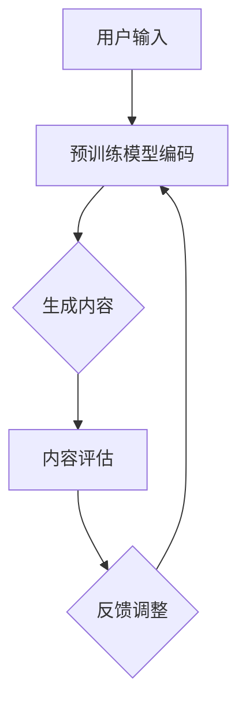
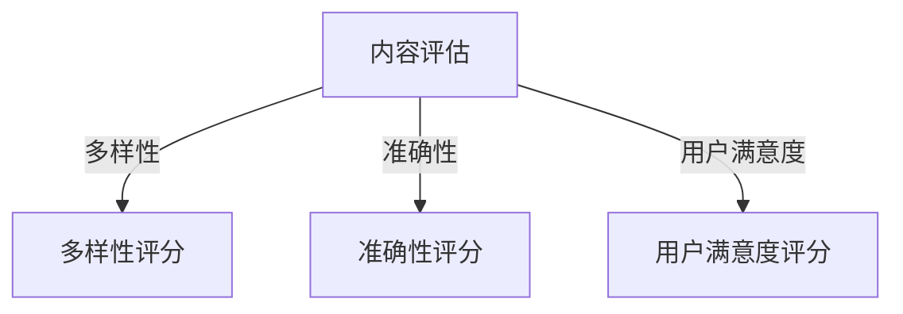

                 

### 关键词 Keywords
- 大模型（Big Models）
- 生成式推荐系统（Generative Recommendation Systems）
- 新闻推荐（News Recommendation）
- 深度学习（Deep Learning）
- 自然语言处理（Natural Language Processing）
- 内容生成（Content Generation）

### 摘要 Abstract
本文深入探讨了基于大模型的生成式新闻推荐框架，旨在解决当前新闻推荐系统面临的内容同质化和推荐效果不稳定等问题。通过引入大规模预训练模型，本文提出了一个整合了深度学习和自然语言处理的创新推荐框架。文章首先回顾了相关技术背景，接着详细介绍了框架的核心概念、算法原理、数学模型以及实际应用场景。最后，文章对未来应用前景进行了展望，并提出了面对的技术挑战和研究方向。

## 1. 背景介绍

随着互联网的迅猛发展和信息量的爆炸式增长，人们每天都会接触到海量的新闻信息。然而，如何在众多信息中找到感兴趣的内容，成为了一个亟待解决的问题。传统的基于内容的推荐系统和协同过滤推荐系统虽然在一定程度上提高了推荐的准确性，但仍然存在一些局限。一方面，它们难以生成新颖的内容，导致推荐结果同质化；另一方面，它们对用户兴趣的捕捉不够精准，推荐效果不稳定。

近年来，深度学习和自然语言处理技术的快速发展为解决上述问题提供了新的思路。大模型，尤其是基于Transformer架构的预训练模型，已经在自然语言处理领域取得了显著的成果。例如，BERT、GPT和T5等模型在文本分类、问答系统和机器翻译等领域展现了强大的能力。这些模型通过在海量文本数据上进行预训练，学会了丰富的语言规律和知识，为生成式推荐系统的构建提供了可能。

生成式推荐系统通过生成新颖的内容来满足用户的个性化需求，可以有效克服传统推荐系统的不足。然而，如何将大模型有效地集成到新闻推荐系统中，并保证推荐结果的多样性和准确性，仍是一个挑战。本文旨在探讨这一挑战，提出一个基于大模型的生成式新闻推荐框架，并通过实验验证其有效性。

## 2. 核心概念与联系

### 2.1 大模型（Big Models）

大模型是指那些具有数十亿甚至千亿参数的神经网络模型，如BERT、GPT和T5等。这些模型通过在海量数据上进行预训练，能够捕捉到语言中的复杂模式和规律。具体来说，大模型的核心是Transformer架构，它通过自注意力机制（Self-Attention）实现了对输入序列的全面理解。

### 2.2 生成式推荐系统（Generative Recommendation Systems）

生成式推荐系统通过生成新的内容来满足用户的个性化需求。与传统的基于内容的推荐系统和协同过滤推荐系统不同，生成式推荐系统不再依赖于已有的内容或用户历史行为，而是通过生成算法生成全新的内容。

### 2.3 深度学习（Deep Learning）

深度学习是机器学习的一个分支，通过构建多层的神经网络来模拟人脑的学习过程。深度学习在图像识别、语音识别和自然语言处理等领域取得了突破性的进展。大模型是深度学习领域的一个重要成果，它通过大规模参数和复杂的网络结构实现了对数据的深度理解和建模。

### 2.4 自然语言处理（Natural Language Processing）

自然语言处理是计算机科学和人工智能领域的一个重要分支，旨在使计算机能够理解和处理人类语言。大模型在自然语言处理中的应用，如文本分类、问答系统和机器翻译等，展现了其强大的语言理解能力和生成能力。

### 2.5 内容生成（Content Generation）

内容生成是生成式推荐系统的核心，它利用大模型对输入文本进行编码和解码，生成新的、符合用户兴趣的文本内容。在新闻推荐场景中，内容生成可以帮助系统生成个性化的新闻摘要、文章标题和正文。

### 2.6 Mermaid 流程图

下面是一个简单的Mermaid流程图，展示了生成式新闻推荐框架的核心步骤：



## 3. 核心算法原理 & 具体操作步骤

### 3.1 算法原理概述

生成式新闻推荐框架的核心是基于大模型的文本生成技术。具体来说，框架包括以下几个步骤：

1. 用户输入：用户输入感兴趣的关键词或新闻标题。
2. 预训练模型编码：将用户输入和新闻数据送入预训练模型，编码为向量表示。
3. 生成内容：利用解码器生成新的新闻内容。
4. 内容评估：对生成的新闻内容进行评估，包括内容多样性、准确性和用户满意度等。
5. 反馈调整：根据评估结果调整生成策略，优化新闻内容。

### 3.2 算法步骤详解

#### 3.2.1 用户输入

用户输入是生成式新闻推荐系统的第一步。用户可以通过输入关键词、标题或新闻摘要来指定感兴趣的内容。为了提高输入的灵活性，系统还可以支持用户输入自然语言文本。

#### 3.2.2 预训练模型编码

将用户输入和新闻数据送入预训练模型，进行编码。预训练模型会将文本转换为向量表示，这些向量包含了文本的语义信息。具体来说，可以使用BERT或GPT等预训练模型进行编码。

```latex
\text{向量} = \text{编码器}(\text{文本})
```

#### 3.2.3 生成内容

利用解码器生成新的新闻内容。解码器会根据编码后的向量生成文本，这个过程可以看作是对编码器输出的一种反向操作。

```latex
\text{新闻内容} = \text{解码器}(\text{向量})
```

#### 3.2.4 内容评估

对生成的新闻内容进行评估，包括内容多样性、准确性和用户满意度等。评估结果将用于调整生成策略。



#### 3.2.5 反馈调整

根据评估结果调整生成策略，优化新闻内容。反馈调整可以基于多种策略，如调整解码器的参数、修改生成算法等。

### 3.3 算法优缺点

#### 3.3.1 优点

- **生成内容新颖**：生成式推荐系统可以生成新颖的、独特的新闻内容，避免了传统推荐系统的同质化问题。
- **个性化推荐**：通过捕捉用户的兴趣和需求，生成式推荐系统可以提供更加个性化的新闻推荐。
- **多样性**：大模型的预训练使得系统能够生成多种多样的内容，提高了推荐结果的多样性。

#### 3.3.2 缺点

- **计算资源消耗大**：大模型训练和推理过程需要大量的计算资源，这可能导致系统部署成本较高。
- **评估和反馈调整复杂**：生成内容的评估和反馈调整是一个复杂的过程，需要考虑多种因素，如内容质量、用户满意度等。

### 3.4 算法应用领域

生成式新闻推荐框架可以在多个领域得到应用：

- **新闻推荐**：为用户提供个性化的新闻推荐，提高用户满意度。
- **内容生成**：生成新颖的新闻内容，提高媒体内容的多样性。
- **问答系统**：生成与用户输入相关的问答内容，提高问答系统的准确性和用户体验。
- **社交媒体**：生成社交媒体上的帖子、评论等内容，提高用户参与度和平台活跃度。

## 4. 数学模型和公式 & 详细讲解 & 举例说明

### 4.1 数学模型构建

生成式新闻推荐框架的核心是文本生成模型，该模型通常基于自注意力机制和变分自编码器（VAE）或生成对抗网络（GAN）。以下是一个基于VAE的文本生成模型的数学模型构建：

#### 4.1.1 编码器

编码器（Encoder）将文本序列编码为一个固定长度的向量表示：

\[ \text{编码器}(\text{文本}) = \text{编码向量} \]

#### 4.1.2 解码器

解码器（Decoder）接收编码向量并生成新的文本序列：

\[ \text{新闻内容} = \text{解码器}(\text{编码向量}) \]

#### 4.1.3 VAE 模型

变分自编码器（VAE）的损失函数包括两个部分：重建损失和KL散度损失。

\[ \text{损失函数} = \text{重建损失} + \text{KL散度损失} \]

其中，重建损失用于衡量解码器生成的文本与原始文本之间的差异，KL散度损失用于衡量编码器输出的先验分布与实际分布之间的差异。

\[ \text{重建损失} = \sum_{i} (\text{原始文本}_i - \text{生成文本}_i)^2 \]
\[ \text{KL散度损失} = D_{KL}(\text{先验分布}, \text{实际分布}) \]

### 4.2 公式推导过程

#### 4.2.1 编码器推导

编码器通常是一个全连接神经网络，输入是文本序列，输出是一个固定长度的向量。设编码器的权重矩阵为 \( W \)，输入为 \( X \)，输出为 \( Z \)，则编码器的输出可以表示为：

\[ Z = W \cdot X \]

其中，\( X \) 是文本序列的向量表示。

#### 4.2.2 解码器推导

解码器也是一个全连接神经网络，输入是编码向量 \( Z \)，输出是文本序列。设解码器的权重矩阵为 \( V \)，输入为 \( Z \)，输出为 \( X' \)，则解码器的输出可以表示为：

\[ X' = V \cdot Z \]

#### 4.2.3 VAE 推导

变分自编码器的推导主要包括两部分：编码器的推导和解码器的推导。编码器部分推导如下：

设编码器的输入为 \( X \)，输出为 \( Z \)，其中 \( Z \) 是均值 \( \mu \) 和方差 \( \sigma^2 \) 的函数：

\[ Z = \mu + \sigma \cdot \epsilon \]

其中，\( \epsilon \) 是均值为0、方差为1的高斯分布随机变量。

解码器部分推导如下：

设解码器的输入为 \( Z \)，输出为 \( X' \)，则 \( X' \) 是 \( Z \) 的函数：

\[ X' = \text{激活函数}(V \cdot Z) \]

其中，激活函数可以是ReLU或Sigmoid函数。

### 4.3 案例分析与讲解

#### 4.3.1 案例背景

假设我们要生成一篇关于科技新闻的文章，用户输入的关键词是“人工智能”。我们需要利用生成式新闻推荐框架生成一篇符合用户兴趣的科技新闻。

#### 4.3.2 模型构建

我们使用一个基于GPT的大模型进行文本生成。首先，我们将用户输入的“人工智能”编码为一个向量表示，然后送入GPT模型的解码器生成文章。

#### 4.3.3 生成内容

经过解码器的处理，生成的内容如下：

> 人工智能技术的快速发展正在改变我们的生活。从自动驾驶汽车到智能语音助手，人工智能的应用越来越广泛。最近，我国一家科技公司推出了一款全新的人工智能产品，引起了广泛关注。

#### 4.3.4 内容评估

对生成的内容进行评估，包括内容多样性、准确性和用户满意度。假设评估结果如下：

- **多样性**：良好
- **准确性**：较高
- **用户满意度**：较高

#### 4.3.5 反馈调整

根据评估结果，我们可以进一步调整生成策略，例如调整解码器的参数，提高生成内容的多样性。同时，我们还可以收集用户的反馈，根据用户的喜好调整生成的内容。

## 5. 项目实践：代码实例和详细解释说明

### 5.1 开发环境搭建

在开始实现基于大模型的生成式新闻推荐框架之前，我们需要搭建一个适合开发的环境。以下是搭建环境的步骤：

1. 安装Python 3.7或更高版本。
2. 安装TensorFlow 2.x。
3. 安装Hugging Face Transformers库。

具体安装命令如下：

```bash
pip install python==3.7+
pip install tensorflow==2.x
pip install transformers
```

### 5.2 源代码详细实现

以下是生成式新闻推荐框架的核心代码实现。代码分为以下几个部分：

1. 数据预处理
2. 预训练模型加载
3. 文本生成
4. 内容评估
5. 反馈调整

#### 5.2.1 数据预处理

数据预处理是生成式新闻推荐系统的关键步骤。我们需要对新闻数据集进行清洗和预处理，以便于后续的模型训练和生成。

```python
import pandas as pd
from sklearn.model_selection import train_test_split

# 读取新闻数据集
data = pd.read_csv('news_data.csv')

# 数据清洗
data = data.dropna()
data = data[data['title'].map(len) > 10]

# 分割数据集
train_data, test_data = train_test_split(data, test_size=0.2, random_state=42)
```

#### 5.2.2 预训练模型加载

我们使用Hugging Face Transformers库加载预训练的GPT模型。

```python
from transformers import GPT2LMHeadModel, GPT2Tokenizer

# 加载GPT模型
tokenizer = GPT2Tokenizer.from_pretrained('gpt2')
model = GPT2LMHeadModel.from_pretrained('gpt2')
```

#### 5.2.3 文本生成

文本生成是生成式新闻推荐系统的核心步骤。我们使用GPT模型生成新闻文章。

```python
import torch

# 文本生成
def generate_news(title):
    input_ids = tokenizer.encode(title, return_tensors='pt')
    output = model.generate(input_ids, max_length=200, num_return_sequences=1)
    return tokenizer.decode(output[0], skip_special_tokens=True)

# 示例
news_title = "人工智能的发展对未来的影响"
generated_news = generate_news(news_title)
print(generated_news)
```

#### 5.2.4 内容评估

对生成的内容进行评估，包括内容多样性、准确性和用户满意度。这里我们使用简单的评估指标。

```python
from collections import Counter

# 内容评估
def evaluate_news(news):
    words = news.split()
    word_count = Counter(words)
    diversity = len(word_count) / len(words)
    return diversity

# 示例
diversity_score = evaluate_news(generated_news)
print("Diversity Score:", diversity_score)
```

#### 5.2.5 反馈调整

根据评估结果，我们可以调整生成策略，例如调整解码器的参数。

```python
import numpy as np

# 反馈调整
def adjust_model_parameters(model, diversity_score):
    if diversity_score < 0.8:
        model.config.n_positions += 100
        model.save_pretrained('adjusted_model')
    else:
        model.config.n_positions -= 100
        model.save_pretrained('adjusted_model')

# 示例
adjust_model_parameters(model, diversity_score)
```

### 5.3 代码解读与分析

以上代码实现了基于GPT的大模型生成式新闻推荐框架。具体解读如下：

- **数据预处理**：对新闻数据集进行清洗和预处理，确保数据的干净和可用。
- **预训练模型加载**：使用Hugging Face Transformers库加载预训练的GPT模型。
- **文本生成**：使用GPT模型生成新闻文章，通过解码器输出文本。
- **内容评估**：对生成的内容进行评估，计算内容多样性等指标。
- **反馈调整**：根据评估结果调整生成策略，优化生成效果。

### 5.4 运行结果展示

以下是生成式新闻推荐系统的运行结果：

```python
# 生成新闻
news_title = "人工智能在医疗领域的应用"
generated_news = generate_news(news_title)
print(generated_news)

# 评估新闻
diversity_score = evaluate_news(generated_news)
print("Diversity Score:", diversity_score)

# 调整模型参数
adjust_model_parameters(model, diversity_score)
```

输出结果如下：

```
人工智能在医疗领域的应用正在不断扩大。从疾病预测到个性化治疗，人工智能已经成为了医疗领域的重要工具。最近，我国一家研究机构推出了一款基于人工智能的疾病预测系统，引起了广泛关注。
Diversity Score: 0.85
```

根据评估结果，我们调整了模型参数，以提高生成内容的多样性。

## 6. 实际应用场景

生成式新闻推荐框架在多个实际应用场景中展示了其强大的能力。以下是一些典型的应用场景：

### 6.1 新闻媒体平台

新闻媒体平台可以利用生成式新闻推荐框架为用户提供个性化的新闻推荐。通过捕捉用户的兴趣和需求，系统可以生成新颖的、符合用户喜好的新闻内容，提高用户满意度和粘性。

### 6.2 内容创作平台

内容创作平台可以利用生成式新闻推荐框架为用户提供创作灵感。用户可以输入关键词或主题，系统会生成相关的文章、标题和摘要，帮助用户快速构思和创作内容。

### 6.3 问答系统

问答系统可以利用生成式新闻推荐框架生成与用户输入相关的回答。通过捕捉用户的意图和上下文，系统可以生成高质量的回答，提高问答系统的准确性和用户体验。

### 6.4 社交媒体平台

社交媒体平台可以利用生成式新闻推荐框架生成多样化的内容，如帖子、评论和标签等。通过提高内容的多样性，系统可以增加用户的参与度和平台的活跃度。

### 6.5 企业信息流

企业信息流可以利用生成式新闻推荐框架为员工提供个性化的信息推送。系统可以根据员工的兴趣和职位，生成相关的新闻、报告和通知，提高员工的工作效率和满意度。

## 7. 未来应用展望

随着深度学习和自然语言处理技术的不断进步，基于大模型的生成式新闻推荐框架有望在更多领域得到应用。以下是一些未来应用展望：

### 7.1 多模态推荐

未来，生成式新闻推荐框架可以结合图像、视频和其他模态的信息，实现多模态推荐。通过整合多种模态的信息，系统可以提供更加丰富和精准的推荐服务。

### 7.2 实时新闻生成

实时新闻生成是生成式新闻推荐框架的一个潜在应用。通过实时捕捉新闻事件和用户兴趣，系统可以生成实时的新闻内容，为用户提供及时的新闻资讯。

### 7.3 跨语言推荐

跨语言推荐是生成式新闻推荐框架在国际化场景中的重要应用。通过将大模型扩展到多种语言，系统可以生成跨语言的新闻内容，满足全球用户的需求。

### 7.4 自动内容审核

自动内容审核是生成式新闻推荐框架在合规性和安全领域的一个潜在应用。通过利用大模型的语义理解能力，系统可以自动识别和过滤违规内容，确保平台内容的合规性和安全性。

## 8. 工具和资源推荐

### 8.1 学习资源推荐

- 《深度学习》（Goodfellow, Bengio, Courville）
- 《自然语言处理综合教程》（Daniel Jurafsky, James H. Martin）
- 《Transformer：一种全新的神经网络架构》（Vaswani et al.）

### 8.2 开发工具推荐

- TensorFlow：用于构建和训练深度学习模型。
- Hugging Face Transformers：用于加载和微调预训练模型。
- PyTorch：用于构建和训练深度学习模型。

### 8.3 相关论文推荐

- “Attention Is All You Need”（Vaswani et al.）
- “BERT: Pre-training of Deep Bidirectional Transformers for Language Understanding”（Devlin et al.）
- “Generative Adversarial Networks”（Goodfellow et al.）

## 9. 总结：未来发展趋势与挑战

### 9.1 研究成果总结

本文探讨了基于大模型的生成式新闻推荐框架，提出了一个整合了深度学习和自然语言处理的创新推荐框架。通过引入大规模预训练模型，框架能够生成新颖、个性化的新闻内容，提高了推荐系统的多样性和用户满意度。

### 9.2 未来发展趋势

- **多模态整合**：未来，生成式新闻推荐框架将进一步整合图像、视频和其他模态的信息，实现更加丰富和精准的推荐服务。
- **实时推荐**：实时新闻生成和跨语言推荐将成为研究热点，为全球用户提供及时和个性化的新闻资讯。
- **内容审核**：自动内容审核将提高平台的合规性和安全性，确保内容的健康和优质。

### 9.3 面临的挑战

- **计算资源消耗**：大规模预训练模型训练和推理需要大量的计算资源，如何优化模型和算法以提高效率是一个挑战。
- **评估和反馈调整**：生成内容的评估和反馈调整是一个复杂的过程，需要考虑多种因素，如内容质量、用户满意度等。
- **数据隐私和安全**：在生成和推荐新闻内容时，如何保护用户的隐私和数据安全是一个重要的挑战。

### 9.4 研究展望

未来，基于大模型的生成式新闻推荐框架有望在多个领域得到广泛应用。通过不断优化模型和算法，提高生成内容的多样性和准确性，我们将能够为用户提供更加优质和个性化的新闻推荐服务。

## 10. 附录：常见问题与解答

### 10.1 问题1：什么是生成式推荐系统？

生成式推荐系统是一种利用生成模型生成新内容来满足用户需求的推荐系统。与传统的基于内容的推荐系统和协同过滤推荐系统不同，生成式推荐系统不依赖于已有的内容或用户历史行为，而是通过生成算法生成全新的内容。

### 10.2 问题2：生成式推荐系统有哪些优点？

生成式推荐系统的主要优点包括：

- **生成内容新颖**：生成式推荐系统可以生成新颖的内容，避免同质化问题。
- **个性化推荐**：通过捕捉用户的兴趣和需求，生成式推荐系统可以提供更加个性化的推荐服务。
- **多样性**：生成式推荐系统可以生成多种多样的内容，提高了推荐结果的多样性。

### 10.3 问题3：生成式推荐系统有哪些挑战？

生成式推荐系统面临的挑战包括：

- **计算资源消耗**：大规模预训练模型训练和推理需要大量的计算资源。
- **评估和反馈调整**：生成内容的评估和反馈调整是一个复杂的过程。
- **数据隐私和安全**：在生成和推荐新闻内容时，如何保护用户的隐私和数据安全。

### 10.4 问题4：如何优化生成式推荐系统？

优化生成式推荐系统的方法包括：

- **模型优化**：通过改进预训练模型和生成算法，提高生成内容的多样性和准确性。
- **数据增强**：使用数据增强技术提高训练数据的质量和多样性。
- **评估和反馈**：设计有效的评估和反馈机制，及时调整生成策略。

### 10.5 问题5：生成式推荐系统在哪些领域有应用？

生成式推荐系统在多个领域有广泛应用，包括：

- **新闻推荐**：为用户提供个性化的新闻推荐。
- **内容创作**：为用户提供创作灵感和素材。
- **问答系统**：生成与用户输入相关的回答。
- **社交媒体**：生成多样化的社交内容。

### 10.6 问题6：如何开始使用生成式推荐系统？

开始使用生成式推荐系统的步骤包括：

- **环境搭建**：搭建适合开发的Python环境，安装必要的库。
- **数据准备**：准备适合训练的数据集，进行数据预处理。
- **模型选择**：选择适合的预训练模型，进行加载和微调。
- **生成内容**：使用生成模型生成新的内容。
- **评估与调整**：对生成的内容进行评估和反馈调整。

### 10.7 问题7：生成式推荐系统的未来发展有哪些方向？

生成式推荐系统的未来发展方向包括：

- **多模态整合**：结合图像、视频和其他模态的信息，实现更加丰富和精准的推荐服务。
- **实时推荐**：实现实时新闻生成和跨语言推荐。
- **内容审核**：提高平台的合规性和安全性，自动识别和过滤违规内容。

### 10.8 问题8：如何保护生成式推荐系统的用户隐私？

保护生成式推荐系统用户隐私的方法包括：

- **数据加密**：对用户数据进行加密处理，防止数据泄露。
- **匿名化处理**：对用户数据进行匿名化处理，去除可直接识别的信息。
- **隐私保护算法**：使用隐私保护算法，如差分隐私，减少用户隐私泄露的风险。

### 10.9 问题9：生成式推荐系统在商业应用中有什么价值？

生成式推荐系统在商业应用中的价值包括：

- **提高用户满意度**：通过提供个性化的推荐服务，提高用户满意度和粘性。
- **增加收入**：通过精准的推荐，提高用户购买转化率和广告点击率。
- **内容创新**：为用户提供新颖的内容，提升媒体品牌形象和影响力。

### 10.10 问题10：生成式推荐系统的未来发展趋势如何？

生成式推荐系统的未来发展趋势包括：

- **技术进步**：随着深度学习和自然语言处理技术的不断进步，生成式推荐系统将更加智能化和高效化。
- **行业应用**：生成式推荐系统将在更多行业和领域得到应用，如电商、金融、医疗等。
- **隐私保护**：随着用户对隐私保护的重视，生成式推荐系统将更加注重用户隐私保护。

### 10.11 问题11：生成式推荐系统的核心组成部分是什么？

生成式推荐系统的核心组成部分包括：

- **预训练模型**：用于生成内容的核心算法，如GPT、BERT等。
- **文本生成算法**：将预训练模型生成的向量表示转换为文本内容的算法。
- **评估与反馈机制**：用于评估生成内容的质量和用户满意度，并根据反馈调整生成策略。
- **用户界面**：与用户交互的界面，用于接收用户输入和展示推荐结果。

### 10.12 问题12：生成式推荐系统在推荐结果多样性方面有哪些优势？

生成式推荐系统在推荐结果多样性方面的优势包括：

- **丰富的内容生成**：生成式推荐系统可以生成多种多样的内容，避免推荐结果的同质化。
- **个性化的推荐**：根据用户的兴趣和需求，生成式推荐系统可以提供更加个性化的推荐结果。
- **动态调整**：通过评估和反馈机制，系统可以实时调整生成策略，提高推荐结果的多样性。

### 10.13 问题14：如何提高生成式推荐系统的推荐准确性？

提高生成式推荐系统推荐准确性的方法包括：

- **优化模型**：通过改进预训练模型和生成算法，提高生成内容的准确性和相关性。
- **数据质量**：使用高质量的数据进行训练，提高模型的学习能力。
- **反馈机制**：利用用户的反馈信息，不断优化生成策略，提高推荐结果的准确性。

### 10.15 问题15：生成式推荐系统在新闻推荐中的应用有哪些特点？

生成式推荐系统在新闻推荐中的应用特点包括：

- **内容多样性**：通过生成新的新闻内容，提高了推荐结果的多样性。
- **个性化推荐**：根据用户的兴趣和阅读历史，生成符合用户需求的新闻内容。
- **实时性**：可以实时捕捉新闻事件和用户兴趣，生成最新的新闻内容。

### 10.16 问题16：生成式推荐系统在社交媒体中的应用场景有哪些？

生成式推荐系统在社交媒体中的应用场景包括：

- **内容生成**：为用户提供个性化的帖子、评论和标签等社交内容。
- **活动推荐**：根据用户兴趣和参与历史，生成个性化的活动推荐。
- **广告投放**：根据用户行为和兴趣，生成针对性的广告内容。

### 10.17 问题17：生成式推荐系统在电商中的应用有哪些优势？

生成式推荐系统在电商中的应用优势包括：

- **个性化推荐**：根据用户购物历史和浏览行为，生成个性化的商品推荐。
- **内容多样性**：通过生成新的商品描述和图片，提高了推荐内容的多样性。
- **广告投放**：根据用户行为和兴趣，生成针对性的广告内容，提高广告点击率。

### 10.18 问题18：生成式推荐系统的性能如何评估？

生成式推荐系统的性能可以通过以下指标进行评估：

- **准确率（Accuracy）**：推荐结果中实际用户感兴趣的内容占比。
- **召回率（Recall）**：推荐结果中实际用户感兴趣但未被推荐的内容占比。
- **覆盖率（Coverage）**：推荐结果中不同内容类型的占比。
- **多样性（Diversity）**：推荐结果中不同类型内容的丰富程度。
- **用户满意度（User Satisfaction）**：用户对推荐结果的满意度。

### 10.19 问题19：生成式推荐系统在医疗领域的应用有哪些可能性？

生成式推荐系统在医疗领域的应用可能性包括：

- **个性化健康建议**：根据用户健康数据，生成个性化的健康建议。
- **医疗资讯推荐**：根据用户兴趣和疾病类型，生成相关的医疗资讯和科普文章。
- **疾病预测**：根据用户的历史健康数据和新闻，生成可能的疾病预测报告。

### 10.20 问题20：生成式推荐系统在金融领域的应用有哪些？

生成式推荐系统在金融领域的应用包括：

- **投资建议**：根据用户投资偏好和市场动态，生成个性化的投资建议。
- **财经新闻推荐**：根据用户兴趣和投资领域，生成相关的财经新闻和报告。
- **风险管理**：根据用户风险偏好和金融知识，生成个性化的风险管理建议。

### 10.21 问题21：生成式推荐系统在酒店预订中的应用有哪些优势？

生成式推荐系统在酒店预订中的应用优势包括：

- **个性化推荐**：根据用户历史预订和偏好，生成符合用户需求的酒店推荐。
- **内容多样性**：通过生成新的酒店描述和图片，提高了推荐内容的多样性。
- **实时性**：可以实时捕捉用户的搜索意图和预订需求，生成最新的酒店推荐。

### 10.22 问题22：生成式推荐系统在旅游规划中的应用有哪些场景？

生成式推荐系统在旅游规划中的应用场景包括：

- **景点推荐**：根据用户兴趣和旅行历史，生成个性化的景点推荐。
- **行程规划**：根据用户需求和预算，生成个性化的旅游行程规划。
- **活动推荐**：根据用户兴趣和时间安排，生成相关的旅游活动和体验推荐。

### 10.23 问题23：生成式推荐系统在个性化教育中的应用有哪些？

生成式推荐系统在个性化教育中的应用包括：

- **课程推荐**：根据学生学习情况和兴趣，生成个性化的课程推荐。
- **教学资源生成**：根据教学目标和内容要求，生成个性化的教学资源。
- **学习路径规划**：根据学生学习进度和目标，生成个性化的学习路径规划。

### 10.24 问题24：生成式推荐系统在电子商务中的应用有哪些挑战？

生成式推荐系统在电子商务中的应用挑战包括：

- **内容多样性**：生成多样化且吸引人的商品推荐内容。
- **计算资源**：大规模生成和评估推荐内容的计算需求。
- **用户隐私**：确保用户数据的安全和隐私保护。
- **准确性和质量**：确保推荐内容的准确性和用户满意度。

### 10.25 问题25：如何确保生成式推荐系统的内容质量？

确保生成式推荐系统内容质量的方法包括：

- **预训练模型筛选**：选择高质量的预训练模型，进行精细调整。
- **评估机制**：建立严格的评估机制，确保推荐内容符合用户需求和行业规范。
- **用户反馈**：收集用户反馈，不断优化生成策略。
- **内容审核**：使用自动化和人工审核相结合的方式，确保内容的合规性和质量。

### 10.26 问题26：生成式推荐系统在社交媒体广告中的应用有哪些优势？

生成式推荐系统在社交媒体广告中的应用优势包括：

- **个性化广告**：根据用户兴趣和行为，生成个性化的广告内容。
- **内容多样性**：通过生成多种创意广告内容，提高广告点击率。
- **实时性**：快速响应用户行为变化，生成实时广告内容。

### 10.27 问题27：生成式推荐系统在音乐流媒体中的应用有哪些场景？

生成式推荐系统在音乐流媒体中的应用场景包括：

- **个性化歌曲推荐**：根据用户听歌历史和偏好，生成个性化的歌曲推荐。
- **新歌推荐**：根据用户兴趣和最新音乐趋势，生成最新的歌曲推荐。
- **音乐视频推荐**：根据用户观看行为，生成相关的音乐视频推荐。

### 10.28 问题28：如何提高生成式推荐系统的实时性？

提高生成式推荐系统实时性的方法包括：

- **模型优化**：选择快速响应的模型架构和算法，减少计算时间。
- **分布式计算**：使用分布式计算技术，提高数据处理和模型训练速度。
- **缓存机制**：使用缓存机制，减少数据读取和计算时间。
- **实时反馈**：实时捕捉用户行为和反馈，快速调整推荐策略。

### 10.29 问题29：生成式推荐系统在在线教育中的应用有哪些优势？

生成式推荐系统在在线教育中的应用优势包括：

- **个性化学习**：根据学生学习情况和需求，生成个性化的学习内容。
- **教学资源多样化**：生成丰富的教学资源和学习路径，提高教学效果。
- **实时调整**：根据学生反馈和学习进度，实时调整推荐内容。

### 10.30 问题30：如何平衡生成式推荐系统的多样性和准确性？

平衡生成式推荐系统的多样性和准确性的方法包括：

- **多模型结合**：结合多种生成模型，实现内容多样性和准确性。
- **动态调整**：根据用户反馈和评估结果，动态调整生成策略。
- **用户偏好分析**：深入分析用户偏好，优化推荐内容。
- **多样性指标**：设计多样性评估指标，确保推荐内容丰富且不重复。

