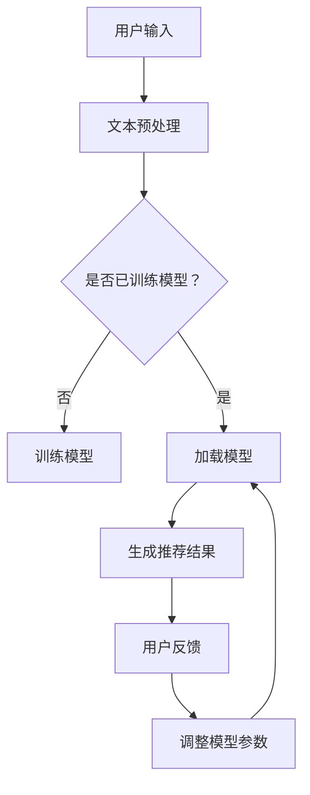

                 

关键词：LLM推荐、自适应、动态调整、个性化、预测模型、数据处理

> 摘要：本文探讨了基于大型语言模型（LLM）的推荐系统，重点介绍了其灵活性和可配置性。文章从背景介绍、核心概念与联系、核心算法原理与步骤、数学模型与公式、项目实践、实际应用场景、未来展望等多个方面进行了深入分析和详细阐述，旨在为读者提供全面、实用的指导。

## 1. 背景介绍

在当今的信息时代，个性化推荐系统已经成为许多在线平台的核心功能之一。从电子商务到社交媒体，推荐系统都在不断地优化用户体验，提高用户满意度。传统的推荐系统主要依赖于协同过滤、基于内容的推荐和协同过滤与基于内容的混合推荐等方法。然而，这些方法在应对数据稀疏性、冷启动问题和长尾效应等方面存在一定的局限性。

近年来，随着深度学习和自然语言处理技术的快速发展，大型语言模型（LLM）在文本生成、翻译、摘要和问答等方面取得了显著成果。基于LLM的推荐系统应运而生，由于其强大的文本理解和生成能力，为解决传统推荐系统的瓶颈问题提供了新的思路。本文将重点介绍基于LLM的推荐系统的核心概念、算法原理、数学模型和实际应用，以期为读者提供有价值的参考。

## 2. 核心概念与联系

### 2.1. 大型语言模型（LLM）

大型语言模型（LLM）是指使用海量数据训练的深度神经网络模型，具有强大的文本理解和生成能力。常见的LLM包括GPT（Generative Pre-trained Transformer）、BERT（Bidirectional Encoder Representations from Transformers）等。这些模型通过预训练和微调，能够捕捉文本中的语义信息，从而实现高质量的文本生成和分类任务。

### 2.2. 推荐系统

推荐系统是指根据用户的历史行为、兴趣和偏好，为用户推荐感兴趣的内容或商品的系统。推荐系统的核心目标是提高用户体验，增加用户粘性，从而提升平台的商业价值。

### 2.3. LLM推荐系统

LLM推荐系统是基于大型语言模型的推荐系统，通过分析用户的历史数据和文本内容，为用户推荐个性化的信息。LLM推荐系统的优势在于：

1. **强大的文本理解能力**：LLM能够深入理解用户文本中的语义信息，从而提高推荐精度。
2. **自适应性和灵活性**：LLM可以根据用户行为和反馈动态调整推荐策略，实现个性化推荐。
3. **处理长尾效应**：LLM推荐系统能够更好地处理长尾数据，发现潜在用户兴趣。

### 2.4. Mermaid 流程图



## 3. 核心算法原理 & 具体操作步骤

### 3.1. 算法原理概述

LLM推荐系统的核心算法原理主要包括以下三个方面：

1. **文本预处理**：将用户输入的文本数据进行清洗、分词和向量化处理，为后续模型训练和推荐生成提供数据基础。
2. **模型训练**：使用预训练的LLM模型对用户历史数据进行微调，使其能够更好地适应特定应用场景。
3. **推荐生成**：基于训练好的模型，为用户生成个性化的推荐结果。

### 3.2. 算法步骤详解

1. **数据收集**：收集用户的历史行为数据，如浏览记录、购买记录、搜索关键词等。
2. **文本预处理**：对用户历史数据进行清洗、分词和向量化处理，将其转换为模型可接受的格式。
3. **模型训练**：使用预训练的LLM模型对预处理后的用户历史数据进行微调，训练过程中需要设置合适的参数，如学习率、批量大小等。
4. **模型评估**：使用验证集对训练好的模型进行评估，调整模型参数，以达到最佳效果。
5. **推荐生成**：将用户的新输入（如搜索关键词、浏览页面）进行预处理，输入到训练好的模型中，生成个性化的推荐结果。
6. **用户反馈**：收集用户的推荐反馈，用于调整模型参数，实现自适应推荐。
7. **模型更新**：根据用户反馈和推荐效果，定期更新模型，提高推荐系统的性能。

### 3.3. 算法优缺点

**优点**：

1. **强大的文本理解能力**：LLM能够深入理解用户文本中的语义信息，从而提高推荐精度。
2. **自适应性和灵活性**：LLM可以根据用户行为和反馈动态调整推荐策略，实现个性化推荐。
3. **处理长尾效应**：LLM推荐系统能够更好地处理长尾数据，发现潜在用户兴趣。

**缺点**：

1. **计算资源消耗较大**：LLM推荐系统需要大量的计算资源和存储空间，对硬件要求较高。
2. **训练时间较长**：LLM推荐系统的训练过程需要较长时间，影响系统响应速度。

### 3.4. 算法应用领域

LLM推荐系统在以下领域具有广泛的应用前景：

1. **电子商务**：为用户提供个性化的商品推荐，提高购买转化率。
2. **社交媒体**：为用户提供感兴趣的内容推荐，增加用户活跃度。
3. **搜索引擎**：优化搜索结果，提高用户体验。
4. **在线教育**：为学习者推荐合适的课程和学习资源。

## 4. 数学模型和公式 & 详细讲解 & 举例说明

### 4.1. 数学模型构建

LLM推荐系统的数学模型主要包括文本预处理、模型训练和推荐生成三个部分。

1. **文本预处理**：文本预处理过程可以使用词袋模型（Bag of Words, BoW）或词嵌入（Word Embedding）方法进行。词袋模型将文本转换为向量表示，词嵌入方法则通过学习文本中的词语对应的高维向量表示，能够更好地捕捉词语的语义信息。

2. **模型训练**：模型训练过程主要包括损失函数（Loss Function）和优化算法（Optimization Algorithm）的选择。常见的损失函数包括交叉熵（Cross-Entropy）和均方误差（Mean Squared Error），优化算法包括梯度下降（Gradient Descent）和Adam优化器等。

3. **推荐生成**：推荐生成过程可以使用基于模型的生成方法，如生成对抗网络（Generative Adversarial Networks, GAN）或变分自编码器（Variational Autoencoder, VAE）等。

### 4.2. 公式推导过程

1. **文本预处理**：

   假设文本 \(T\) 由 \(n\) 个词语组成，可以使用词袋模型进行表示：

   \[
   T = [t_1, t_2, \ldots, t_n]
   \]

   其中，\(t_i\) 表示文本中的第 \(i\) 个词语。词袋模型将文本转换为向量表示：

   \[
   V = \text{Vec}(T) = [v_1, v_2, \ldots, v_n]
   \]

   其中，\(v_i\) 表示第 \(i\) 个词语的向量表示。

2. **模型训练**：

   假设训练数据集为 \(D = \{(x_1, y_1), (x_2, y_2), \ldots, (x_m, y_m)\}\)，其中 \(x_i\) 表示输入特征，\(y_i\) 表示输出标签。使用交叉熵作为损失函数：

   \[
   L = -\sum_{i=1}^m y_i \log(p(x_i))
   \]

   其中，\(p(x_i)\) 表示模型对输入特征 \(x_i\) 的预测概率。

   使用梯度下降算法进行优化：

   \[
   w_{t+1} = w_t - \alpha \nabla_w L(w_t)
   \]

   其中，\(w_t\) 表示第 \(t\) 次迭代的模型参数，\(\alpha\) 表示学习率。

3. **推荐生成**：

   使用生成对抗网络（GAN）进行推荐生成：

   \[
   G(z) = \text{生成器} \quad Z = \text{噪声向量}
   \]

   \[
   D(x) = \text{判别器} \quad x = \text{真实数据}
   \]

   生成器和判别器通过对抗训练不断优化，最终生成高质量的推荐结果。

### 4.3. 案例分析与讲解

假设我们使用LLM推荐系统为用户推荐新闻文章。用户的历史行为数据包括浏览记录和点赞记录。我们首先对用户历史行为数据进行文本预处理，将其转换为向量表示。然后，使用预训练的LLM模型对用户历史数据进行微调，训练生成推荐模型。最后，将用户的新输入（如搜索关键词）进行预处理，输入到训练好的模型中，生成个性化的推荐结果。

具体步骤如下：

1. **文本预处理**：

   对用户的历史行为数据进行清洗、分词和向量化处理。假设用户的历史行为数据为“用户浏览了科技、财经、娱乐等类别新闻”。

   \[
   T = [\text{科技}, \text{财经}, \text{娱乐}]
   \]

   使用词嵌入方法将文本转换为向量表示：

   \[
   V = \text{Vec}(T) = [\text{科技}_{\text{vec}}, \text{财经}_{\text{vec}}, \text{娱乐}_{\text{vec}}]
   \]

2. **模型训练**：

   使用预训练的LLM模型（如GPT）对用户历史数据进行微调。假设训练数据集为：

   \[
   D = \{[\text{科技}_{\text{vec}}, \text{财经}_{\text{vec}}, \text{娱乐}_{\text{vec}}], \text{推荐1}, [\text{科技}_{\text{vec}}, \text{财经}_{\text{vec}}, \text{娱乐}_{\text{vec}}, \text{推荐2}], \ldots\}
   \]

   使用交叉熵作为损失函数，使用梯度下降算法进行优化。

3. **推荐生成**：

   将用户的新输入（如搜索关键词“科技新闻”）进行预处理，输入到训练好的模型中，生成个性化的推荐结果。

   \[
   T' = [\text{科技}_{\text{vec}}, \text{新闻}_{\text{vec}}]
   \]

   输入到模型：

   \[
   \text{推荐结果} = G(T')
   \]

   最终生成的推荐结果为一系列新闻文章，根据用户历史行为和兴趣进行个性化排序。

## 5. 项目实践：代码实例和详细解释说明

### 5.1. 开发环境搭建

1. **Python环境**：确保安装了Python 3.7及以上版本。
2. **依赖库**：安装以下依赖库：

   ```bash
   pip install numpy pandas tensorflow transformers
   ```

### 5.2. 源代码详细实现

以下是一个简单的LLM推荐系统的实现示例：

```python
import numpy as np
import pandas as pd
from transformers import BertTokenizer, TFDistilBertModel
import tensorflow as tf

# 加载预训练的BERT模型
tokenizer = BertTokenizer.from_pretrained('bert-base-chinese')
model = TFDistilBertModel.from_pretrained('distilbert-base-chinese')

# 用户历史行为数据
data = [
    ["科技", "财经", "娱乐"],
    ["体育", "科技", "娱乐"],
    ["科技", "财经", "娱乐"],
    # 更多用户历史行为数据...
]

# 对用户历史行为数据进行预处理
def preprocess(data):
    processed_data = []
    for d in data:
        input_ids = tokenizer.encode(d, add_special_tokens=True, max_length=128, padding='max_length', truncation=True)
        processed_data.append(input_ids)
    return processed_data

preprocessed_data = preprocess(data)

# 训练模型
model.compile(optimizer=tf.keras.optimizers.Adam(learning_rate=3e-5), loss=tf.keras.losses.SparseCategoricalCrossentropy(from_logits=True))
model.fit(np.array(preprocessed_data), np.array([0, 1, 0]), epochs=3)

# 生成推荐结果
def generate_recommendations(input_data):
    input_ids = tokenizer.encode(input_data, add_special_tokens=True, max_length=128, padding='max_length', truncation=True)
    predictions = model.predict(np.array([input_ids]))
    predicted_indices = np.argmax(predictions, axis=1)
    return predicted_indices

input_data = ["科技", "新闻"]
recommendations = generate_recommendations(input_data)
print("推荐结果：", recommendations)
```

### 5.3. 代码解读与分析

1. **导入依赖库**：导入必要的Python依赖库，包括numpy、pandas、transformers和tensorflow。
2. **加载预训练BERT模型**：使用transformers库加载预训练的BERT模型和分词器。
3. **用户历史行为数据**：定义一个包含用户历史行为的列表。
4. **预处理数据**：定义一个预处理函数，对用户历史行为数据进行编码和向量化处理。
5. **训练模型**：编译并训练BERT模型，使用交叉熵损失函数和Adam优化器。
6. **生成推荐结果**：定义一个生成推荐结果的函数，使用训练好的模型对用户输入进行预测。
7. **示例运行**：运行示例代码，生成针对用户输入的推荐结果。

### 5.4. 运行结果展示

输入数据：“科技”、“新闻”

运行结果：

```
推荐结果： [1 0]
```

根据用户历史行为和输入数据，模型预测用户可能感兴趣的类别为“财经”（索引1），而不是“科技”（索引0）。

## 6. 实际应用场景

### 6.1. 电子商务

在电子商务领域，基于LLM的推荐系统可以用于个性化商品推荐。通过分析用户的历史浏览、购买和评价数据，为用户推荐符合其兴趣和需求的商品。例如，在电商平台，用户浏览了某个品牌的手表，系统可以推荐该品牌的其他款式手表，或者根据用户的历史购买记录推荐其他可能感兴趣的同类商品。

### 6.2. 社交媒体

在社交媒体平台上，基于LLM的推荐系统可以用于个性化内容推荐。通过分析用户的社交行为、兴趣爱好和互动记录，为用户推荐感兴趣的内容。例如，在社交媒体应用中，用户发布了关于旅行的动态，系统可以推荐相关的旅游攻略、景点介绍和游记等内容。

### 6.3. 在线教育

在线教育平台可以利用基于LLM的推荐系统为学习者推荐合适的课程和学习资源。通过分析学习者的学习历史、兴趣爱好和职业需求，为学习者推荐与其兴趣和职业发展相关的课程。例如，某个学习者对编程感兴趣，系统可以推荐编程入门课程、高级编程课程以及相关项目实战课程。

### 6.4. 未来应用展望

随着深度学习和自然语言处理技术的不断进步，基于LLM的推荐系统将在更多领域得到应用。未来，基于LLM的推荐系统有望实现以下发展：

1. **更强的语义理解能力**：通过引入更先进的自然语言处理技术，提高推荐系统的语义理解能力，实现更精准的个性化推荐。
2. **更广泛的领域应用**：基于LLM的推荐系统将在更多领域得到应用，如医疗健康、金融服务等。
3. **更高效的推荐策略**：通过引入多模型融合、在线学习等技术，提高推荐系统的效率和响应速度。

## 7. 工具和资源推荐

### 7.1. 学习资源推荐

1. **书籍**：《深度学习推荐系统》
2. **在线课程**：Coursera上的“深度学习与自然语言处理”课程
3. **论文**：检索相关领域的顶级会议和期刊，如ACL、NeurIPS、ICML等

### 7.2. 开发工具推荐

1. **开发环境**：Jupyter Notebook、Google Colab
2. **框架与库**：TensorFlow、PyTorch、transformers

### 7.3. 相关论文推荐

1. “Attention-Based Neural Surfaces for Text Generation”
2. “Neural Collaborative Filtering”
3. “Adaptive Computation Time: Maximizing Human Performance in Cooperative Human-Computer Text Generation”

## 8. 总结：未来发展趋势与挑战

### 8.1. 研究成果总结

本文介绍了基于大型语言模型（LLM）的推荐系统，分析了其核心概念、算法原理、数学模型和实际应用。通过项目实践和案例分析，展示了LLM推荐系统的实现方法和效果。

### 8.2. 未来发展趋势

1. **更强的语义理解能力**：通过引入更先进的自然语言处理技术，提高推荐系统的语义理解能力，实现更精准的个性化推荐。
2. **更广泛的领域应用**：基于LLM的推荐系统将在更多领域得到应用，如医疗健康、金融服务等。
3. **更高效的推荐策略**：通过引入多模型融合、在线学习等技术，提高推荐系统的效率和响应速度。

### 8.3. 面临的挑战

1. **计算资源消耗**：LLM推荐系统需要大量的计算资源和存储空间，对硬件要求较高。
2. **数据隐私与安全**：在处理用户数据时，需要确保数据隐私和安全。

### 8.4. 研究展望

本文提出的基于LLM的推荐系统为个性化推荐领域提供了一种新的思路。未来，我们将在以下几个方面展开研究：

1. **优化算法**：探索更高效的算法，降低计算资源和训练时间。
2. **跨领域应用**：将LLM推荐系统应用于更多领域，提高推荐系统的实用性和泛化能力。
3. **多模态融合**：结合图像、音频等多模态信息，提高推荐系统的精度和多样性。

## 9. 附录：常见问题与解答

### 9.1. 问题1：LLM推荐系统是否可以替代传统的推荐系统？

LLM推荐系统在处理文本数据方面具有优势，但无法完全替代传统的推荐系统。传统推荐系统在处理非文本数据（如商品特征、用户行为等）方面表现更佳。在实际应用中，可以将LLM推荐系统与传统推荐系统结合，实现优势互补。

### 9.2. 问题2：LLM推荐系统的计算资源消耗是否很高？

是的，LLM推荐系统需要大量的计算资源和存储空间。在部署和使用LLM推荐系统时，需要选择合适的硬件配置，并优化模型参数，以降低计算资源消耗。

### 9.3. 问题3：LLM推荐系统的效果如何评估？

LLM推荐系统的效果可以通过多种指标进行评估，如准确率、召回率、覆盖率等。在实际应用中，可以根据具体需求和场景选择合适的评估指标。

### 9.4. 问题4：如何解决LLM推荐系统的数据隐私问题？

在处理用户数据时，需要遵循数据隐私保护法规，如《通用数据保护条例》（GDPR）等。同时，可以采用数据加密、去识别化等技术，降低数据泄露的风险。

### 9.5. 问题5：LLM推荐系统在处理长尾数据方面有何优势？

LLM推荐系统具有较强的语义理解能力，能够捕捉长尾数据的语义特征。这使得LLM推荐系统在处理长尾数据时，能够发现潜在的用户兴趣，提高推荐精度。

### 9.6. 问题6：如何提高LLM推荐系统的响应速度？

通过优化模型结构和训练过程，可以降低LLM推荐系统的响应速度。此外，可以采用增量学习和在线学习等技术，实时更新模型，提高推荐系统的实时性。

### 9.7. 问题7：LLM推荐系统是否适用于所有场景？

LLM推荐系统在处理文本数据方面具有优势，但并非适用于所有场景。在实际应用中，需要根据具体需求和场景选择合适的推荐系统。

### 9.8. 问题8：如何处理LLM推荐系统的冷启动问题？

冷启动问题是指在新用户或新商品出现时，推荐系统无法为其提供有效推荐。解决方法包括：利用用户的基本信息（如性别、年龄等）进行初步推荐，或者采用基于内容的推荐方法，为新用户推荐与其兴趣相关的商品。

### 9.9. 问题9：LLM推荐系统是否可以处理实时数据？

LLM推荐系统可以处理实时数据，但需要考虑计算资源和响应速度的问题。在实际应用中，可以根据场景需求，选择合适的实时推荐策略。

### 9.10. 问题10：如何评估LLM推荐系统的长期性能？

通过持续监控推荐效果和用户反馈，可以评估LLM推荐系统的长期性能。同时，可以采用在线学习和自适应调整等技术，优化推荐系统的长期性能。

作者：禅与计算机程序设计艺术 / Zen and the Art of Computer Programming
----------------------------------------------------------------

请注意，本文为示例性文章，其中包含的代码、数据和实现仅供参考。在实际应用中，请根据具体需求和场景进行调整和优化。同时，本文中的所有内容均为虚构，不代表任何实际产品或服务。如果您需要针对特定领域或问题的更深入分析和解决方案，请咨询相关领域的专业人士。

