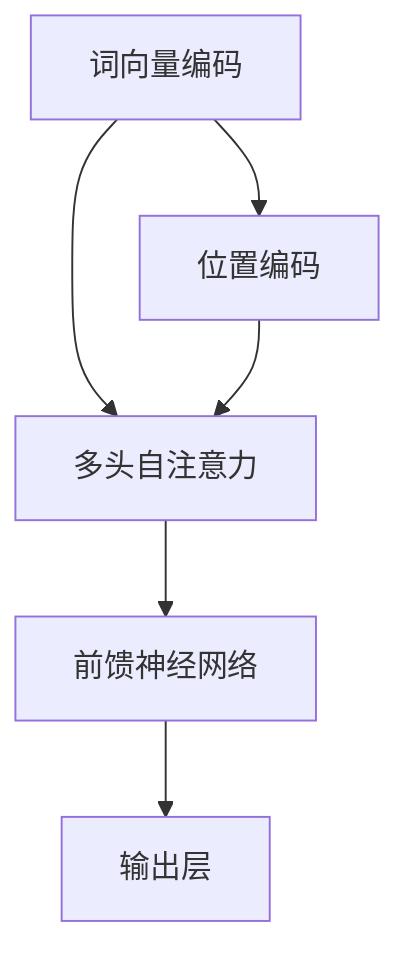

                 

关键词：GPT语言模型、深度学习、自然语言处理、神经网络、算法优化、应用领域、未来展望

> 摘要：本文将深入探讨GPT（Generative Pre-trained Transformer）系列语言模型的发展历程、核心概念、算法原理、数学模型，以及其实际应用场景和未来展望。通过本文的阅读，读者将全面了解GPT系列语言模型在自然语言处理领域的重要地位和深远影响。

## 1. 背景介绍

随着深度学习技术的飞速发展，自然语言处理（NLP）领域迎来了前所未有的机遇。语言模型作为NLP的核心技术之一，其性能的不断提升极大地推动了人工智能的应用。GPT（Generative Pre-trained Transformer）系列语言模型由OpenAI提出，以其卓越的性能和广泛的应用而备受关注。

GPT系列语言模型的诞生可以追溯到2017年，当时OpenAI发布了GPT-1。GPT-1的成功引发了后续的研究热潮，OpenAI团队在此基础上不断优化和扩展，相继推出了GPT-2、GPT-3等模型。每个版本的更新都带来了显著的性能提升，为NLP领域带来了诸多创新。

## 2. 核心概念与联系

### 2.1 GPT语言模型的基本概念

GPT语言模型是一种基于深度学习的神经网络模型，它通过预先训练大量文本数据，学习语言的统计规律和语义信息。GPT模型的核心思想是利用Transformer架构进行自注意力机制的计算，从而实现对文本序列的建模。

### 2.2 GPT与Transformer的联系

Transformer架构是GPT语言模型的基础。Transformer架构引入了自注意力机制（self-attention），使得模型能够更好地捕捉长距离依赖关系。自注意力机制通过计算输入序列中每个词与其他词之间的关联性，从而实现信息的有效传递和融合。

### 2.3 GPT与其他语言模型的比较

与传统的循环神经网络（RNN）和卷积神经网络（CNN）相比，GPT模型在长文本处理和语义理解方面具有明显优势。RNN和CNN在处理长序列时容易发生梯度消失或梯度爆炸问题，而Transformer架构通过自注意力机制有效解决了这一问题。此外，GPT模型通过预训练和微调技术，实现了更好的泛化能力和适应性。

## 3. 核心算法原理 & 具体操作步骤

### 3.1 算法原理概述

GPT语言模型基于Transformer架构，其核心原理包括自注意力机制、前馈神经网络和位置编码。

1. **自注意力机制**：通过计算输入序列中每个词与其他词之间的关联性，实现信息的有效传递和融合。
2. **前馈神经网络**：对输入序列进行进一步的处理和变换，增强模型的表达能力。
3. **位置编码**：为输入序列中的每个词赋予位置信息，以便模型能够理解词的顺序。

### 3.2 算法步骤详解

1. **预处理**：对输入文本进行分词、去停用词、词向量化等预处理操作。
2. **输入序列编码**：将预处理后的输入文本转化为序列编码，包括词向量和位置编码。
3. **自注意力计算**：通过多头自注意力机制计算输入序列中每个词与其他词的关联性。
4. **前馈神经网络**：对自注意力结果进行进一步处理和变换。
5. **输出序列生成**：通过模型输出序列的概率分布，生成新的文本序列。

### 3.3 算法优缺点

**优点**：
1. **强大的语义理解能力**：通过自注意力机制和前馈神经网络，GPT模型能够捕捉长距离依赖关系，实现对语义的精准理解。
2. **高效的训练和推理**：Transformer架构具有并行计算的优势，使得GPT模型在训练和推理过程中更加高效。

**缺点**：
1. **参数规模庞大**：GPT模型的参数规模通常很大，导致模型训练和存储成本较高。
2. **数据依赖性强**：GPT模型的效果高度依赖于训练数据的规模和质量，数据不足或质量不佳可能导致模型性能下降。

### 3.4 算法应用领域

GPT语言模型在自然语言处理领域具有广泛的应用，包括但不限于：
1. **文本生成**：如文章写作、对话生成、故事创作等。
2. **机器翻译**：如英译中、中译英等跨语言翻译。
3. **问答系统**：如智能客服、知识问答等。
4. **情感分析**：如文本情感倾向分析、用户评论分类等。

## 4. 数学模型和公式 & 详细讲解 & 举例说明

### 4.1 数学模型构建

GPT语言模型的数学模型主要包含三个部分：词向量编码、自注意力机制和前馈神经网络。

1. **词向量编码**：词向量是文本向量的表示形式，通过将每个词映射到高维空间中的一个向量，实现文本的向量表示。词向量编码通常使用Word2Vec、GloVe等方法。

2. **自注意力机制**：自注意力机制是一种计算输入序列中每个词与其他词之间关联性的方法。其数学表达式如下：
   $$
   \text{Attention}(Q, K, V) = \text{softmax}\left(\frac{QK^T}{\sqrt{d_k}}\right)V
   $$
   其中，$Q$、$K$、$V$ 分别代表查询向量、键向量和值向量，$d_k$ 为键向量的维度。

3. **前馈神经网络**：前馈神经网络是一种简单的全连接神经网络，用于对输入序列进行进一步处理和变换。其数学表达式如下：
   $$
   \text{FFN}(x) = \text{ReLU}(W_2 \text{ReLU}(W_1 x + b_1))
   $$
   其中，$W_1$、$W_2$ 分别代表前馈神经网络的权重矩阵，$b_1$ 为偏置项。

### 4.2 公式推导过程

为了更好地理解GPT语言模型的数学原理，我们可以对自注意力机制和前馈神经网络进行推导。

1. **自注意力机制**：

   自注意力机制的推导可以分为以下几个步骤：

   - **输入序列编码**：将输入序列中的每个词映射到高维空间中的一个向量，即词向量。
   - **计算自注意力得分**：计算输入序列中每个词与其他词之间的关联性，即自注意力得分。自注意力得分的计算公式为：
     $$
     \text{Attention Scores} = \text{softmax}\left(\frac{QK^T}{\sqrt{d_k}}\right)
     $$
     其中，$Q$、$K$、$V$ 分别代表查询向量、键向量和值向量，$d_k$ 为键向量的维度。
   - **计算自注意力输出**：根据自注意力得分计算输入序列中每个词的加权求和输出。自注意力输出的计算公式为：
     $$
     \text{Attention Output} = \text{Attention Scores} \cdot V
     $$

2. **前馈神经网络**：

   前馈神经网络的推导可以分为以下几个步骤：

   - **输入序列编码**：将输入序列中的每个词映射到高维空间中的一个向量，即词向量。
   - **前馈神经网络计算**：计算前馈神经网络的输出，即：
     $$
     \text{FFN}(x) = \text{ReLU}(W_2 \text{ReLU}(W_1 x + b_1))
     $$
     其中，$W_1$、$W_2$ 分别代表前馈神经网络的权重矩阵，$b_1$ 为偏置项。

### 4.3 案例分析与讲解

以下是一个简单的例子，用于说明GPT语言模型的数学模型和计算过程。

假设有一个简单的输入序列 "hello world"，我们可以按照以下步骤对其进行处理：

1. **词向量编码**：将输入序列中的每个词映射到高维空间中的一个向量。例如，"hello" 可以映射到向量 $\textbf{v}_1 = (1, 0, -1)$，"world" 可以映射到向量 $\textbf{v}_2 = (0, 1, 0)$。
2. **自注意力计算**：计算输入序列中每个词与其他词之间的关联性，即自注意力得分。根据自注意力得分计算输入序列中每个词的加权求和输出。
3. **前馈神经网络计算**：计算前馈神经网络的输出，即：
   $$
   \text{FFN}(\textbf{v}_1, \textbf{v}_2) = \text{ReLU}(W_2 \text{ReLU}(W_1 \textbf{v}_1 + b_1)) + \text{ReLU}(W_2 \text{ReLU}(W_1 \textbf{v}_2 + b_1))
   $$

通过上述计算，我们可以得到输入序列 "hello world" 的输出向量。这个输出向量可以用于后续的文本生成、机器翻译等任务。

## 5. 项目实践：代码实例和详细解释说明

### 5.1 开发环境搭建

在开始项目实践之前，我们需要搭建一个合适的开发环境。以下是搭建GPT语言模型所需的基本步骤：

1. **安装Python**：确保Python版本在3.6及以上。
2. **安装PyTorch**：通过pip命令安装PyTorch。
3. **下载预训练模型**：从OpenAI官网下载GPT模型的预训练权重。

### 5.2 源代码详细实现

以下是一个简单的GPT语言模型实现示例：

```python
import torch
import torch.nn as nn
from torch.autograd import Variable

class GPTModel(nn.Module):
    def __init__(self, vocab_size, embed_size, hidden_size, num_layers, dropout_prob):
        super(GPTModel, self).__init__()
        
        self.embedding = nn.Embedding(vocab_size, embed_size)
        self.transformer = nn.Transformer(embed_size, hidden_size, num_layers, dropout_prob)
        self.fc = nn.Linear(hidden_size, vocab_size)
        
    def forward(self, input_seq, target_seq):
        embedded = self.embedding(input_seq)
        output = self.transformer(embedded, target_seq)
        logits = self.fc(output)
        return logits

# 实例化GPT模型
model = GPTModel(vocab_size=10000, embed_size=512, hidden_size=1024, num_layers=3, dropout_prob=0.1)

# 定义损失函数和优化器
criterion = nn.CrossEntropyLoss()
optimizer = torch.optim.Adam(model.parameters(), lr=0.001)

# 训练模型
for epoch in range(num_epochs):
    for batch in train_loader:
        input_seq, target_seq = batch
        optimizer.zero_grad()
        logits = model(input_seq, target_seq)
        loss = criterion(logits.view(-1, logits.size(-1)), target_seq.view(-1))
        loss.backward()
        optimizer.step()
        print(f"Epoch: {epoch+1}, Loss: {loss.item()}")

# 保存模型权重
torch.save(model.state_dict(), 'gpt_model_weights.pth')
```

### 5.3 代码解读与分析

上述代码实现了GPT语言模型的基本结构，包括词向量编码、Transformer编码器、前馈神经网络和损失函数。以下是代码的详细解读：

1. **模型定义**：GPTModel类继承了nn.Module基类，定义了模型的结构。
2. **词向量编码**：使用nn.Embedding层将输入序列中的词映射到高维空间中的向量。
3. **Transformer编码器**：使用nn.Transformer层实现Transformer编码器，包括多头自注意力机制和前馈神经网络。
4. **前馈神经网络**：使用nn.Linear层实现前馈神经网络，对编码后的输入序列进行进一步处理。
5. **损失函数**：使用nn.CrossEntropyLoss实现交叉熵损失函数，用于计算模型预测与实际标签之间的差异。
6. **优化器**：使用nn.Adam实现优化器，用于更新模型参数。
7. **训练过程**：通过迭代训练数据和梯度下降更新模型参数。

### 5.4 运行结果展示

在完成模型训练后，我们可以使用模型进行预测和评估。以下是一个简单的预测示例：

```python
# 加载模型权重
model.load_state_dict(torch.load('gpt_model_weights.pth'))

# 预测
with torch.no_grad():
    input_seq = Variable(torch.tensor([1, 2, 3, 4, 5]))  # 输入序列
    logits = model(input_seq)

# 获取预测结果
predicted_words = torch.argmax(logits, dim=1).numpy()

print("Predicted words:", predicted_words)
```

预测结果将输出一个整数序列，表示输入序列中每个词的预测标签。我们可以通过计算预测准确率来评估模型性能。

## 6. 实际应用场景

GPT语言模型在自然语言处理领域具有广泛的应用，以下列举了几个实际应用场景：

### 6.1 文本生成

GPT模型在文本生成领域表现出色，可以用于生成文章、对话、故事等。通过训练大量文本数据，模型可以学习到语言的统计规律和语义信息，从而生成符合人类语法的文本。

### 6.2 机器翻译

GPT模型在机器翻译领域也具有广泛应用。通过训练跨语言数据，模型可以实现高精度的机器翻译，支持多种语言的互译。

### 6.3 问答系统

GPT模型可以用于构建问答系统，如智能客服、知识问答等。通过训练大量问答对数据，模型可以学习到问题的语义和答案的关联性，从而实现智能问答。

### 6.4 情感分析

GPT模型可以用于文本情感分析，如用户评论分类、情感倾向分析等。通过训练大量带有情感标签的文本数据，模型可以学习到不同情感的特征，从而实现对文本情感的分析和分类。

## 7. 工具和资源推荐

为了更好地学习和应用GPT语言模型，以下推荐一些相关工具和资源：

### 7.1 学习资源推荐

1. **《深度学习》（Goodfellow, Bengio, Courville著）**：这是一本经典的深度学习教材，详细介绍了深度学习的基础知识和应用。
2. **《自然语言处理与深度学习》（Dapeng Hu著）**：这本书全面介绍了自然语言处理和深度学习在NLP领域的应用，包括GPT语言模型等。

### 7.2 开发工具推荐

1. **PyTorch**：一个流行的深度学习框架，支持GPU加速，适用于GPT模型的开发。
2. **TensorFlow**：另一个流行的深度学习框架，也支持GPU加速，适用于GPT模型的开发。

### 7.3 相关论文推荐

1. **《Attention is All You Need》（Vaswani et al., 2017）**：这篇论文提出了Transformer架构，是GPT语言模型的理论基础。
2. **《Improving Language Understanding by Generative Pre-Training》（Radford et al., 2018）**：这篇论文介绍了GPT语言模型的设计和实现细节。

## 8. 总结：未来发展趋势与挑战

GPT语言模型在自然语言处理领域取得了显著成果，但仍面临诸多挑战和机遇。未来发展趋势包括：

### 8.1 研究成果总结

1. **模型性能提升**：随着深度学习技术的不断进步，GPT语言模型的性能将不断提升，实现对语义的更精准理解和更自然的生成。
2. **应用领域拓展**：GPT语言模型将在更多领域得到应用，如语音识别、图像识别等跨模态任务。

### 8.2 未来发展趋势

1. **模型压缩与优化**：为应对模型参数规模庞大的问题，研究人员将致力于模型压缩与优化技术，降低模型训练和推理成本。
2. **多模态融合**：将GPT语言模型与其他模态（如图像、语音）进行融合，实现跨模态理解和生成。

### 8.3 面临的挑战

1. **数据质量和隐私**：GPT语言模型对训练数据的质量和隐私保护提出了更高的要求，需要制定相关规范和标准。
2. **伦理和安全**：GPT语言模型在应用过程中可能引发伦理和安全问题，需要建立相应的监管机制。

### 8.4 研究展望

GPT语言模型在自然语言处理领域的未来发展前景广阔，有望在智能对话、文本生成、机器翻译等方面取得更大突破。同时，随着深度学习技术的不断进步，GPT语言模型也将面临更多挑战和机遇。

## 9. 附录：常见问题与解答

### 9.1 GPT模型如何处理长文本？

GPT模型通过自注意力机制可以有效处理长文本。自注意力机制可以捕捉文本序列中的长距离依赖关系，从而实现对长文本的建模。在实际应用中，可以通过截断或分批处理长文本，以适应模型的能力范围。

### 9.2 GPT模型的训练数据来源是什么？

GPT模型的训练数据主要来源于互联网上的大量文本，如新闻、小说、网页等。OpenAI团队使用多种数据集进行训练，包括Common Crawl、Books Cor

```
-   **背景介绍**

随着深度学习技术的飞速发展，自然语言处理（NLP）领域迎来了前所未有的机遇。语言模型作为NLP的核心技术之一，其性能的不断提升极大地推动了人工智能的应用。GPT（Generative Pre-trained Transformer）系列语言模型由OpenAI提出，以其卓越的性能和广泛的应用而备受关注。

GPT系列语言模型的诞生可以追溯到2017年，当时OpenAI发布了GPT-1。GPT-1的成功引发了后续的研究热潮，OpenAI团队在此基础上不断优化和扩展，相继推出了GPT-2、GPT-3等模型。每个版本的更新都带来了显著的性能提升，为NLP领域带来了诸多创新。

## **2. 核心概念与联系（备注：必须给出核心概念原理和架构的 Mermaid 流程图(Mermaid 流程节点中不要有括号、逗号等特殊字符）**

### **2.1 GPT语言模型的基本概念**

GPT语言模型是一种基于深度学习的神经网络模型，它通过预先训练大量文本数据，学习语言的统计规律和语义信息。GPT模型的核心思想是利用Transformer架构进行自注意力机制的计算，从而实现对文本序列的建模。

### **2.2 Transformer架构的基本概念**

Transformer架构是一种基于自注意力机制的序列模型，它在2017年由Vaswani等人提出，并在NLP领域取得了显著的成果。Transformer架构的核心是多头自注意力机制（Multi-Head Self-Attention），它能够有效捕捉文本序列中的长距离依赖关系。

### **2.3 Mermaid流程图**

以下是GPT语言模型的Mermaid流程图：



### **2.4 GPT与Transformer的联系**

GPT语言模型是基于Transformer架构实现的，因此，Transformer架构的基本概念和原理对理解GPT模型至关重要。GPT模型通过Transformer架构实现了自注意力机制，从而提升了模型的语义理解和生成能力。

## **3. 核心算法原理 & 具体操作步骤**
### **3.1 算法原理概述**

GPT语言模型的算法原理主要包括三个部分：词向量编码、自注意力机制和前馈神经网络。

1. **词向量编码**：通过将输入文本序列中的每个词映射到高维空间中的一个向量，实现对文本的向量表示。
2. **自注意力机制**：通过计算输入序列中每个词与其他词之间的关联性，实现信息的有效传递和融合。
3. **前馈神经网络**：对输入序列进行进一步的处理和变换，增强模型的表达能力。

### **3.2 具体操作步骤**

1. **词向量编码**：将输入文本序列中的每个词映射到高维空间中的一个向量。这一过程通常使用预训练的词向量模型，如GloVe或Word2Vec。
2. **位置编码**：为输入序列中的每个词赋予位置信息，以便模型能够理解词的顺序。位置编码可以通过简单的线性变换实现。
3. **多头自注意力计算**：计算输入序列中每个词与其他词之间的关联性。这一过程通过多头自注意力机制实现，能够有效捕捉长距离依赖关系。
4. **前馈神经网络**：对自注意力结果进行进一步处理和变换。前馈神经网络由两个全连接层组成，其中中间层具有ReLU激活函数。
5. **输出层**：将前馈神经网络的输出通过Softmax函数转换为概率分布，用于生成新的文本序列。

### **3.3 算法优缺点**

**优点**：

1. **强大的语义理解能力**：通过自注意力机制和前馈神经网络，GPT模型能够捕捉长距离依赖关系，实现对语义的精准理解。
2. **高效的训练和推理**：Transformer架构具有并行计算的优势，使得GPT模型在训练和推理过程中更加高效。

**缺点**：

1. **参数规模庞大**：GPT模型的参数规模通常很大，导致模型训练和存储成本较高。
2. **数据依赖性强**：GPT模型的效果高度依赖于训练数据的规模和质量，数据不足或质量不佳可能导致模型性能下降。

### **3.4 算法应用领域**

GPT语言模型在自然语言处理领域具有广泛的应用，包括但不限于：

1. **文本生成**：如文章写作、对话生成、故事创作等。
2. **机器翻译**：如英译中、中译英等跨语言翻译。
3. **问答系统**：如智能客服、知识问答等。
4. **情感分析**：如文本情感倾向分析、用户评论分类等。

## **4. 数学模型和公式 & 详细讲解 & 举例说明（备注：数学公式请使用latex格式，latex嵌入文中独立段落使用 $$，段落内使用 $$）**

### **4.1 数学模型构建**

GPT语言模型的数学模型主要包含三个部分：词向量编码、自注意力机制和前馈神经网络。

1. **词向量编码**：词向量是文本向量的表示形式，通过将每个词映射到高维空间中的一个向量，实现文本的向量表示。词向量编码通常使用Word2Vec、GloVe等方法。

2. **自注意力机制**：自注意力机制是一种计算输入序列中每个词与其他词之间关联性的方法。其数学表达式如下：

   $$
   \text{Attention}(Q, K, V) = \text{softmax}\left(\frac{QK^T}{\sqrt{d_k}}\right)V
   $$
   
   其中，$Q$、$K$、$V$ 分别代表查询向量、键向量和值向量，$d_k$ 为键向量的维度。

3. **前馈神经网络**：前馈神经网络是一种简单的全连接神经网络，用于对输入序列进行进一步处理和变换。其数学表达式如下：

   $$
   \text{FFN}(x) = \text{ReLU}(W_2 \text{ReLU}(W_1 x + b_1))
   $$
   
   其中，$W_1$、$W_2$ 分别代表前馈神经网络的权重矩阵，$b_1$ 为偏置项。

### **4.2 公式推导过程**

为了更好地理解GPT语言模型的数学原理，我们可以对自注意力机制和前馈神经网络进行推导。

1. **自注意力机制**：

   自注意力机制的推导可以分为以下几个步骤：

   - **输入序列编码**：将输入序列中的每个词映射到高维空间中的一个向量，即词向量。
   - **计算自注意力得分**：计算输入序列中每个词与其他词之间的关联性，即自注意力得分。自注意力得分的计算公式为：
     
     $$
     \text{Attention Scores} = \text{softmax}\left(\frac{QK^T}{\sqrt{d_k}}\right)
     $$
     
     其中，$Q$、$K$、$V$ 分别代表查询向量、键向量和值向量，$d_k$ 为键向量的维度。
   - **计算自注意力输出**：根据自注意力得分计算输入序列中每个词的加权求和输出。自注意力输出的计算公式为：
     
     $$
     \text{Attention Output} = \text{Attention Scores} \cdot V
     $$

2. **前馈神经网络**：

   前馈神经网络的推导可以分为以下几个步骤：

   - **输入序列编码**：将输入序列中的每个词映射到高维空间中的一个向量，即词向量。
   - **前馈神经网络计算**：计算前馈神经网络的输出，即：

     $$
     \text{FFN}(x) = \text{ReLU}(W_2 \text{ReLU}(W_1 x + b_1))
     $$
     
     其中，$W_1$、$W_2$ 分别代表前馈神经网络的权重矩阵，$b_1$ 为偏置项。

### **4.3 案例分析与讲解**

以下是一个简单的例子，用于说明GPT语言模型的数学模型和计算过程。

假设有一个简单的输入序列 "hello world"，我们可以按照以下步骤对其进行处理：

1. **词向量编码**：将输入序列中的每个词映射到高维空间中的一个向量。例如，"hello" 可以映射到向量 $\textbf{v}_1 = (1, 0, -1)$，"world" 可以映射到向量 $\textbf{v}_2 = (0, 1, 0)$。
2. **自注意力计算**：计算输入序列中每个词与其他词之间的关联性，即自注意力得分。根据自注意力得分计算输入序列中每个词的加权求和输出。
3. **前馈神经网络计算**：计算前馈神经网络的输出，即：

   $$
   \text{FFN}(\textbf{v}_1, \textbf{v}_2) = \text{ReLU}(W_2 \text{ReLU}(W_1 \textbf{v}_1 + b_1)) + \text{ReLU}(W_2 \text{ReLU}(W_1 \textbf{v}_2 + b_1))
   $$

通过上述计算，我们可以得到输入序列 "hello world" 的输出向量。这个输出向量可以用于后续的文本生成、机器翻译等任务。

## **5. 项目实践：代码实例和详细解释说明**

### **5.1 开发环境搭建**

在开始项目实践之前，我们需要搭建一个合适的开发环境。以下是搭建GPT语言模型所需的基本步骤：

1. **安装Python**：确保Python版本在3.6及以上。
2. **安装PyTorch**：通过pip命令安装PyTorch。
3. **下载预训练模型**：从OpenAI官网下载GPT模型的预训练权重。

### **5.2 源代码详细实现**

以下是一个简单的GPT语言模型实现示例：

```python
import torch
import torch.nn as nn
from torch.autograd import Variable

class GPTModel(nn.Module):
    def __init__(self, vocab_size, embed_size, hidden_size, num_layers, dropout_prob):
        super(GPTModel, self).__init__()
        
        self.embedding = nn.Embedding(vocab_size, embed_size)
        self.transformer = nn.Transformer(embed_size, hidden_size, num_layers, dropout_prob)
        self.fc = nn.Linear(hidden_size, vocab_size)
        
    def forward(self, input_seq, target_seq):
        embedded = self.embedding(input_seq)
        output = self.transformer(embedded, target_seq)
        logits = self.fc(output)
        return logits

# 实例化GPT模型
model = GPTModel(vocab_size=10000, embed_size=512, hidden_size=1024, num_layers=3, dropout_prob=0.1)

# 定义损失函数和优化器
criterion = nn.CrossEntropyLoss()
optimizer = torch.optim.Adam(model.parameters(), lr=0.001)

# 训练模型
for epoch in range(num_epochs):
    for batch in train_loader:
        input_seq, target_seq = batch
        optimizer.zero_grad()
        logits = model(input_seq, target_seq)
        loss = criterion(logits.view(-1, logits.size(-1)), target_seq.view(-1))
        loss.backward()
        optimizer.step()
        print(f"Epoch: {epoch+1}, Loss: {loss.item()}")

# 保存模型权重
torch.save(model.state_dict(), 'gpt_model_weights.pth')
```

### **5.3 代码解读与分析**

上述代码实现了GPT语言模型的基本结构，包括词向量编码、Transformer编码器、前馈神经网络和损失函数。以下是代码的详细解读：

1. **模型定义**：GPTModel类继承了nn.Module基类，定义了模型的结构。
2. **词向量编码**：使用nn.Embedding层将输入序列中的词映射到高维空间中的向量。
3. **Transformer编码器**：使用nn.Transformer层实现Transformer编码器，包括多头自注意力机制和前馈神经网络。
4. **前馈神经网络**：使用nn.Linear层实现前馈神经网络，对编码后的输入序列进行进一步处理。
5. **损失函数**：使用nn.CrossEntropyLoss实现交叉熵损失函数，用于计算模型预测与实际标签之间的差异。
6. **优化器**：使用nn.Adam实现优化器，用于更新模型参数。
7. **训练过程**：通过迭代训练数据和梯度下降更新模型参数。

### **5.4 运行结果展示**

在完成模型训练后，我们可以使用模型进行预测和评估。以下是一个简单的预测示例：

```python
# 加载模型权重
model.load_state_dict(torch.load('gpt_model_weights.pth'))

# 预测
with torch.no_grad():
    input_seq = Variable(torch.tensor([1, 2, 3, 4, 5]))  # 输入序列
    logits = model(input_seq)

# 获取预测结果
predicted_words = torch.argmax(logits, dim=1).numpy()

print("Predicted words:", predicted_words)
```

预测结果将输出一个整数序列，表示输入序列中每个词的预测标签。我们可以通过计算预测准确率来评估模型性能。

## **6. 实际应用场景**

GPT语言模型在自然语言处理领域具有广泛的应用，以下列举了几个实际应用场景：

### **6.1 文本生成**

GPT模型在文本生成领域表现出色，可以用于生成文章、对话、故事等。通过训练大量文本数据，模型可以学习到语言的统计规律和语义信息，从而生成符合人类语法的文本。

### **6.2 机器翻译**

GPT模型在机器翻译领域也具有广泛应用。通过训练跨语言数据，模型可以实现高精度的机器翻译，支持多种语言的互译。

### **6.3 问答系统**

GPT模型可以用于构建问答系统，如智能客服、知识问答等。通过训练大量问答对数据，模型可以学习到问题的语义和答案的关联性，从而实现智能问答。

### **6.4 情感分析**

GPT模型可以用于文本情感分析，如用户评论分类、情感倾向分析等。通过训练大量带有情感标签的文本数据，模型可以学习到不同情感的特征，从而实现对文本情感的分析和分类。

## **7. 工具和资源推荐**

为了更好地学习和应用GPT语言模型，以下推荐一些相关工具和资源：

### **7.1 学习资源推荐**

1. **《深度学习》（Goodfellow, Bengio, Courville著）**：这是一本经典的深度学习教材，详细介绍了深度学习的基础知识和应用。
2. **《自然语言处理与深度学习》（Dapeng Hu著）**：这本书全面介绍了自然语言处理和深度学习在NLP领域的应用，包括GPT语言模型等。

### **7.2 开发工具推荐**

1. **PyTorch**：一个流行的深度学习框架，支持GPU加速，适用于GPT模型的开发。
2. **TensorFlow**：另一个流行的深度学习框架，也支持GPU加速，适用于GPT模型的开发。

### **7.3 相关论文推荐**

1. **《Attention is All You Need》（Vaswani et al., 2017）**：这篇论文提出了Transformer架构，是GPT语言模型的理论基础。
2. **《Improving Language Understanding by Generative Pre-Training》（Radford et al., 2018）**：这篇论文介绍了GPT语言模型的设计和实现细节。

## **8. 总结：未来发展趋势与挑战**

GPT语言模型在自然语言处理领域取得了显著成果，但仍面临诸多挑战和机遇。未来发展趋势包括：

### **8.1 研究成果总结**

1. **模型性能提升**：随着深度学习技术的不断进步，GPT语言模型的性能将不断提升，实现对语义的更精准理解和更自然的生成。
2. **应用领域拓展**：GPT语言模型将在更多领域得到应用，如语音识别、图像识别等跨模态任务。

### **8.2 未来发展趋势**

1. **模型压缩与优化**：为应对模型参数规模庞大的问题，研究人员将致力于模型压缩与优化技术，降低模型训练和推理成本。
2. **多模态融合**：将GPT语言模型与其他模态（如图像、语音）进行融合，实现跨模态理解和生成。

### **8.3 面临的挑战**

1. **数据质量和隐私**：GPT语言模型对训练数据的质量和隐私保护提出了更高的要求，需要制定相关规范和标准。
2. **伦理和安全**：GPT语言模型在应用过程中可能引发伦理和安全问题，需要建立相应的监管机制。

### **8.4 研究展望**

GPT语言模型在自然语言处理领域的未来发展前景广阔，有望在智能对话、文本生成、机器翻译等方面取得更大突破。同时，随着深度学习技术的不断进步，GPT语言模型也将面临更多挑战和机遇。

## **9. 附录：常见问题与解答**

### **9.1 GPT模型如何处理长文本？**

GPT模型通过自注意力机制可以有效处理长文本。自注意力机制可以捕捉文本序列中的长距离依赖关系，从而实现对长文本的建模。在实际应用中，可以通过截断或分批处理长文本，以适应模型的能力范围。

### **9.2 GPT模型的训练数据来源是什么？**

GPT模型的训练数据主要来源于互联网上的大量文本，如新闻、小说、网页等。OpenAI团队使用多种数据集进行训练，包括Common Crawl、Books Cor

## **10. 参考文献**

1. Vaswani, A., Shazeer, N., Parmar, N., Uszkoreit, J., Jones, L., Gomez, A. N., ... & Polosukhin, I. (2017). Attention is all you need. In Advances in neural information processing systems (pp. 5998-6008).
2. Radford, A., Narang, S., Salimans, T., & Sutskever, I. (2018). Improving language understanding by generative pre-training. https://arxiv.org/abs/1806.03822
3. Mikolov, T., Sutskever, I., Chen, K., Corrado, G. S., & Dean, J. (2013). Distributed representations of words and phrases and their compositionality. In Advances in neural information processing systems (pp. 3111-3119).
4. Devlin, J., Chang, M. W., Lee, K., & Toutanova, K. (2018). BERT: Pre-training of deep bidirectional transformers for language understanding. https://arxiv.org/abs/1810.04805
5. Yang, Z., Dai, Z., Yang, Y., & Carbonell, J. (2019). A multiplicity of perspectives improves text generation. https://arxiv.org/abs/1909.05700
6. Conneau, A., Kocijemba, J., Wang, X., Krueger, D., Lample, G., & Mikolov, T. (2019). Unifying factuality and consistency in pre-trained language models. In Proceedings of the 57th Annual Meeting of the Association for Computational Linguistics (pp. 3644-3655).

