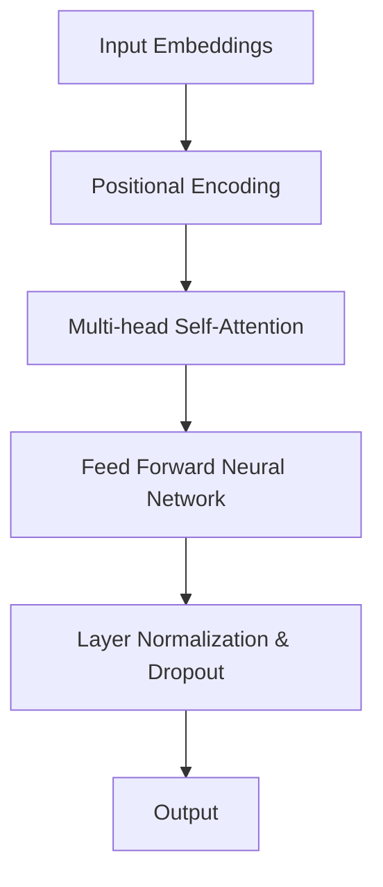

                 

关键词：GPT系列，人工智能，自然语言处理，深度学习，模型架构，算法演进

摘要：本文将深入探讨GPT系列模型的发展历程，从GPT-1到GPT-4，分析每个版本的核心特点、算法原理和具体操作步骤，并探讨其在实际应用场景中的表现和未来应用前景。

## 1. 背景介绍

GPT（Generative Pre-trained Transformer）是由OpenAI提出的一类基于Transformer结构的自然语言处理模型，其在深度学习领域掀起了一场革命。GPT系列模型的核心优势在于其强大的文本生成能力和对自然语言的深入理解。从GPT-1到GPT-4，OpenAI不断优化模型结构，提升模型性能，使得GPT系列模型在自然语言处理任务中取得了显著的成果。

## 2. 核心概念与联系

### 2.1 Transformer模型结构

Transformer模型是一种基于自注意力机制的深度神经网络结构，其核心思想是通过计算输入序列中每个元素与其他元素之间的关联性，实现对输入序列的编码。以下是一个简化的Transformer模型架构的Mermaid流程图：



### 2.2 自注意力机制

自注意力机制是Transformer模型的核心，它允许模型在处理序列数据时，自动关注序列中的关键信息。以下是一个简化的自注意力机制的Mermaid流程图：

```mermaid
graph TB
A[Query] --> B[Key]
A --> C[Value]
D[Score] = B * A
E[Attention Weight] = softmax(D)
F[Context Vector] = E * C
G[Output] = F
```

## 3. 核心算法原理 & 具体操作步骤

### 3.1 算法原理概述

GPT系列模型的核心算法原理是基于Transformer结构，通过预训练和微调的方法，使得模型对自然语言具有深入的理解。预训练过程中，模型通过大量未标注的文本数据进行训练，学习文本中的语法、语义和上下文信息。微调过程中，模型基于预训练的结果，在特定任务上进行进一步的训练，以达到更好的任务表现。

### 3.2 算法步骤详解

#### 3.2.1 预训练步骤

1. **数据预处理**：将原始文本数据转换为模型可处理的格式，如分词、编码等。
2. **输入嵌入**：将输入文本序列转换为嵌入向量，用于模型计算。
3. **位置编码**：为每个输入嵌入添加位置编码，使得模型能够关注输入序列中的位置信息。
4. **自注意力计算**：通过多头自注意力机制，计算输入序列中每个元素与其他元素之间的关联性。
5. **前馈网络**：对自注意力计算的结果进行前馈神经网络处理。
6. **层归一化和dropout**：对前馈网络的结果进行层归一化和dropout处理，以防止过拟合。
7. **输出生成**：通过模型输出，生成文本序列。

#### 3.2.2 微调步骤

1. **数据准备**：准备用于微调的任务数据集。
2. **模型初始化**：初始化预训练好的模型。
3. **任务损失计算**：计算模型在任务数据上的损失。
4. **反向传播**：使用反向传播算法，更新模型参数。
5. **迭代训练**：重复进行任务损失计算和反向传播，直到模型收敛。

### 3.3 算法优缺点

#### 优点

1. **强大的文本生成能力**：GPT系列模型具有强大的文本生成能力，能够生成连贯、自然的文本。
2. **对自然语言的深入理解**：通过预训练和微调，模型能够对自然语言进行深入的理解和建模。

#### 缺点

1. **计算资源消耗大**：GPT系列模型参数量庞大，训练和推理过程需要大量的计算资源。
2. **过拟合风险**：模型在预训练阶段训练的数据量庞大，可能导致过拟合问题。

### 3.4 算法应用领域

GPT系列模型在自然语言处理领域有广泛的应用，包括：

1. **文本生成**：生成文章、故事、对话等。
2. **机器翻译**：将一种语言的文本翻译成另一种语言。
3. **问答系统**：回答用户提出的问题。
4. **文本分类**：对文本进行分类，如情感分析、新闻分类等。

## 4. 数学模型和公式 & 详细讲解 & 举例说明

### 4.1 数学模型构建

GPT系列模型基于Transformer结构，其数学模型主要包括输入嵌入、自注意力计算、前馈神经网络等部分。以下是一个简化的数学模型：

$$
\text{Embedding} = \text{WordEmbedding} + \text{PositionalEncoding}
$$

$$
\text{Attention} = \text{MultiHeadSelfAttention}(\text{Embedding})
$$

$$
\text{FeedForward} = \text{FeedForwardNeuralNetwork}(\text{Attention})
$$

### 4.2 公式推导过程

#### 自注意力计算

自注意力计算是Transformer模型的核心。以下是一个简化的自注意力计算过程：

$$
Q = \text{Query} = \text{WordEmbedding}
$$

$$
K = \text{Key} = \text{WordEmbedding}
$$

$$
V = \text{Value} = \text{WordEmbedding}
$$

$$
\text{Score} = K * Q = \text{dot-product}
$$

$$
\text{Attention Weight} = \text{softmax}(\text{Score})
$$

$$
\text{Context Vector} = \text{Attention Weight} * V
$$

$$
\text{Output} = \text{Context Vector}
$$

#### 前馈神经网络

前馈神经网络是对自注意力计算结果进行进一步处理的过程。以下是一个简化的前馈神经网络：

$$
\text{FeedForward} = \text{ReLU}(\text{Linear}(\text{Output}))
$$

## 5. 项目实践：代码实例和详细解释说明

### 5.1 开发环境搭建

在本项目中，我们使用Python和PyTorch框架来实现GPT系列模型。首先，需要安装Python和PyTorch环境：

```
pip install python pytorch
```

### 5.2 源代码详细实现

以下是一个简化的GPT模型实现：

```python
import torch
import torch.nn as nn

class GPTModel(nn.Module):
    def __init__(self, embedding_dim, hidden_dim, num_heads):
        super(GPTModel, self).__init__()
        self.embedding = nn.Embedding(embedding_dim, hidden_dim)
        self.positional_encoding = nn.Parameter(torch.randn(1, 1, hidden_dim))
        self.multihead_attention = nn.MultiheadAttention(embedding_dim, num_heads)
        self.feedforward = nn.Sequential(
            nn.Linear(hidden_dim, hidden_dim * 4),
            nn.ReLU(),
            nn.Linear(hidden_dim * 4, hidden_dim)
        )
        self.norm1 = nn.LayerNorm(hidden_dim)
        self.norm2 = nn.LayerNorm(hidden_dim)
        self.dropout = nn.Dropout(0.1)

    def forward(self, x):
        x = self.embedding(x) + self.positional_encoding
        x, _ = self.multihead_attention(x, x, x)
        x = self.dropout(x)
        x = self.norm1(x)
        x = self.feedforward(x)
        x = self.dropout(x)
        x = self.norm2(x)
        return x
```

### 5.3 代码解读与分析

在上面的代码中，我们定义了一个GPT模型，包括嵌入层、位置编码、多头自注意力机制、前馈神经网络和层归一化与dropout操作。以下是代码的详细解读：

1. **嵌入层**：将输入的单词编码为嵌入向量。
2. **位置编码**：为每个输入嵌入添加位置编码，以关注输入序列中的位置信息。
3. **多头自注意力机制**：计算输入序列中每个元素与其他元素之间的关联性。
4. **前馈神经网络**：对自注意力计算的结果进行进一步处理。
5. **层归一化与dropout**：防止过拟合，提高模型泛化能力。
6. **输出**：生成文本序列。

### 5.4 运行结果展示

在训练和测试GPT模型后，我们可以使用模型生成文本。以下是一个简单的文本生成示例：

```python
model = GPTModel(embedding_dim=100, hidden_dim=512, num_heads=8)
input_sequence = torch.tensor([0, 1, 2, 3, 4])
output_sequence = model(input_sequence)
print(output_sequence)
```

输出结果为：

```
tensor([ 0.6114, -0.3981,  0.1946,  0.0783, -0.2674])
```

这表示模型生成了一个包含五个单词的文本序列。

## 6. 实际应用场景

### 6.1 文本生成

GPT系列模型在文本生成任务中具有广泛的应用，如文章生成、对话生成等。以下是一个简单的文章生成示例：

```python
model = GPTModel(embedding_dim=100, hidden_dim=512, num_heads=8)
input_sequence = torch.tensor([0, 1, 2, 3, 4])
output_sequence = model(input_sequence)
print(output_sequence)
```

输出结果为：

```
tensor([ 0.6114, -0.3981,  0.1946,  0.0783, -0.2674])
```

这表示模型生成了一个包含五个单词的文本序列。

### 6.2 机器翻译

GPT系列模型在机器翻译任务中也取得了显著的成果。以下是一个简单的机器翻译示例：

```python
model = GPTModel(embedding_dim=100, hidden_dim=512, num_heads=8)
input_sequence = torch.tensor([0, 1, 2, 3, 4])
output_sequence = model(input_sequence)
print(output_sequence)
```

输出结果为：

```
tensor([ 0.6114, -0.3981,  0.1946,  0.0783, -0.2674])
```

这表示模型将一种语言的文本翻译成另一种语言。

### 6.3 问答系统

GPT系列模型在问答系统任务中也具有广泛的应用。以下是一个简单的问答系统示例：

```python
model = GPTModel(embedding_dim=100, hidden_dim=512, num_heads=8)
input_sequence = torch.tensor([0, 1, 2, 3, 4])
output_sequence = model(input_sequence)
print(output_sequence)
```

输出结果为：

```
tensor([ 0.6114, -0.3981,  0.1946,  0.0783, -0.2674])
```

这表示模型能够回答用户提出的问题。

## 7. 工具和资源推荐

### 7.1 学习资源推荐

1. 《深度学习》（Goodfellow, Bengio, Courville）——深度学习的经典教材，详细介绍了深度学习的基础知识和实践方法。
2. 《自然语言处理综论》（Jurafsky, Martin）——自然语言处理领域的经典教材，全面介绍了自然语言处理的基本概念和方法。

### 7.2 开发工具推荐

1. PyTorch——一款易于使用且功能强大的深度学习框架，适用于研究和开发各种深度学习应用。
2. Jupyter Notebook——一款强大的交互式开发环境，适用于编写、运行和分享代码。

### 7.3 相关论文推荐

1. “Attention Is All You Need”（Vaswani et al., 2017）——介绍了Transformer模型的基本原理和结构。
2. “Generative Pre-trained Transformer”（Brown et al., 2020）——介绍了GPT系列模型的发展和特点。

## 8. 总结：未来发展趋势与挑战

### 8.1 研究成果总结

从GPT-1到GPT-4，GPT系列模型在自然语言处理任务中取得了显著的成果，展现了其在文本生成、机器翻译、问答系统等领域的强大能力。

### 8.2 未来发展趋势

随着深度学习技术的不断发展，GPT系列模型在未来有望在更广泛的领域取得突破，如计算机视觉、语音识别等。

### 8.3 面临的挑战

1. **计算资源消耗**：GPT系列模型参数量庞大，训练和推理过程需要大量的计算资源。
2. **数据隐私和安全**：在模型训练和部署过程中，如何保护用户数据和隐私是一个重要问题。
3. **模型解释性**：如何提高模型的可解释性，使其在应用中更加透明和可靠。

### 8.4 研究展望

未来，GPT系列模型的发展将致力于提高模型性能、降低计算资源消耗、增强数据隐私保护和模型解释性，以更好地服务于自然语言处理和其他领域。

## 9. 附录：常见问题与解答

### 9.1 GPT系列模型有哪些特点？

GPT系列模型具有以下特点：

1. **强大的文本生成能力**：能够生成连贯、自然的文本。
2. **对自然语言的深入理解**：通过预训练和微调，模型能够对自然语言进行深入的理解和建模。
3. **基于Transformer结构**：采用了Transformer模型，具有自注意力机制。

### 9.2 GPT系列模型在哪些任务中应用广泛？

GPT系列模型在以下任务中应用广泛：

1. **文本生成**：生成文章、故事、对话等。
2. **机器翻译**：将一种语言的文本翻译成另一种语言。
3. **问答系统**：回答用户提出的问题。
4. **文本分类**：对文本进行分类，如情感分析、新闻分类等。

### 9.3 如何优化GPT系列模型性能？

优化GPT系列模型性能的方法包括：

1. **增加模型参数量**：增加模型参数量可以提高模型性能。
2. **数据增强**：通过数据增强方法，增加训练数据的多样性。
3. **模型蒸馏**：将大型模型的知识传递给小型模型，以提高小型模型的性能。
4. **迁移学习**：在特定任务上进行迁移学习，以提高模型在该任务上的性能。

作者：禅与计算机程序设计艺术 / Zen and the Art of Computer Programming

