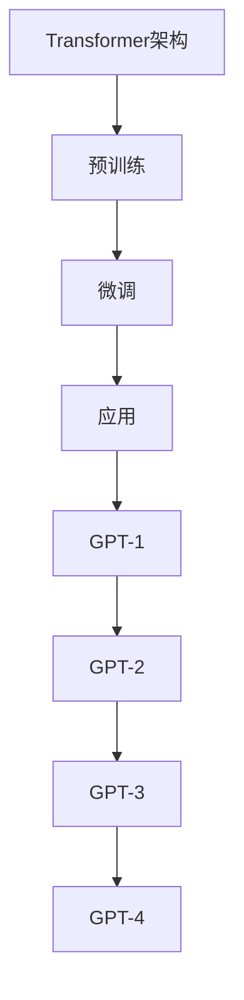

                 

关键词：GPT，自然语言处理，深度学习，预训练模型，生成式对话系统，人工智能

> 摘要：本文深入探讨了GPT（Generative Pre-trained Transformer）系列模型的发展历程，从GPT-1到GPT-4，分析了每个版本的关键特性、技术进步以及实际应用。通过详细的算法原理讲解、数学模型分析和项目实践，本文为读者呈现了GPT模型在自然语言处理领域的演进过程及其重要意义。

## 1. 背景介绍

自然语言处理（NLP）是人工智能领域的一个重要分支，其目标是将人类语言转换为机器可理解的形式，并使机器能够生成或理解自然语言。在过去的几十年中，NLP经历了显著的发展，从基于规则的方法到基于统计的方法，再到如今以深度学习为核心的方法。

GPT系列模型由OpenAI提出，是自然语言处理领域的里程碑式突破。GPT模型基于Transformer架构，通过大规模预训练来学习语言模式和结构，然后通过微调来适应特定任务。GPT系列模型的演进不仅代表了NLP技术的进步，也为生成式对话系统、机器翻译、文本摘要等应用带来了革命性的变化。

## 2. 核心概念与联系

### 2.1. Transformer架构

Transformer是2017年由Vaswani等人提出的深度学习模型架构，专为处理序列到序列的任务而设计。其核心思想是通过自注意力机制（Self-Attention）来捕捉序列中不同位置之间的依赖关系，而不是像传统的循环神经网络（RNN）那样依次处理。

### 2.2. 预训练与微调

预训练（Pre-training）是指在特定大规模语料库上训练模型，使其掌握通用语言特征。微调（Fine-tuning）则是在预训练的基础上，针对特定任务对模型进行调整，提高其在该任务上的性能。

### 2.3. GPT系列模型

GPT系列模型包括GPT-1、GPT-2、GPT-3和GPT-4，每个版本都在架构、预训练规模和性能上进行了显著提升。

### 2.4. Mermaid流程图



## 3. 核心算法原理 & 具体操作步骤

### 3.1. 算法原理概述

GPT系列模型基于Transformer架构，通过自注意力机制来捕捉序列中的依赖关系。模型通过大规模语料库进行预训练，学习语言模式，然后通过微调来适应特定任务。

### 3.2. 算法步骤详解

1. **预训练**：使用大量文本数据对模型进行预训练，使其掌握通用语言特征。
2. **微调**：在预训练的基础上，针对特定任务对模型进行调整，提高其在该任务上的性能。
3. **生成**：使用微调后的模型生成文本，可以是回答问题、续写故事、翻译等。

### 3.3. 算法优缺点

**优点**：
- **强大的语言理解能力**：通过预训练，模型能够学习到丰富的语言知识，从而在多种任务上表现出色。
- **高效的自注意力机制**：Transformer架构使得模型能够高效地处理长文本，避免了传统RNN的梯度消失问题。

**缺点**：
- **计算资源消耗大**：预训练阶段需要大量的计算资源和时间。
- **模型解释性差**：由于模型参数众多，模型内部的决策过程往往难以解释。

### 3.4. 算法应用领域

GPT系列模型在多个领域都有广泛应用，包括：
- **生成式对话系统**：如聊天机器人、虚拟助手等。
- **机器翻译**：如谷歌翻译、百度翻译等。
- **文本摘要**：如新闻摘要、会议纪要等。
- **问答系统**：如Siri、Alexa等。

## 4. 数学模型和公式 & 详细讲解 & 举例说明

### 4.1. 数学模型构建

GPT模型基于Transformer架构，其核心是自注意力机制（Self-Attention）。

### 4.2. 公式推导过程

自注意力机制的公式为：

$$
\text{Attention}(Q, K, V) = \text{softmax}\left(\frac{QK^T}{\sqrt{d_k}}\right)V
$$

其中，$Q, K, V$ 分别为查询（Query）、键（Key）和值（Value）向量，$d_k$ 为键向量的维度。

### 4.3. 案例分析与讲解

假设我们有以下三个序列：

$$
Q = [q_1, q_2, q_3]
$$

$$
K = [k_1, k_2, k_3]
$$

$$
V = [v_1, v_2, v_3]
$$

我们首先计算查询和键的相似度：

$$
\text{Similarity}(Q, K) = QK^T = \begin{bmatrix} q_1 & q_2 & q_3 \end{bmatrix} \begin{bmatrix} k_1 \\ k_2 \\ k_3 \end{bmatrix}^T = q_1k_1 + q_2k_2 + q_3k_3
$$

然后，我们计算softmax函数的输入：

$$
\text{Score}(Q, K) = \frac{e^{\text{Similarity}(Q, K)}}{\sum_{i=1}^3 e^{\text{Similarity}(Q, K_i)}}
$$

最后，我们使用softmax的输出作为权重，计算注意力分数：

$$
\text{Attention}(Q, K, V) = \sum_{i=1}^3 \text{Score}(Q, K_i)v_i
$$

这个分数表示了查询在序列中的每个位置上的重要性。

## 5. 项目实践：代码实例和详细解释说明

### 5.1. 开发环境搭建

首先，我们需要安装PyTorch和Transformer模型：

```python
!pip install torch
!pip install transformers
```

### 5.2. 源代码详细实现

下面是一个简单的GPT模型训练和预测的示例：

```python
import torch
from transformers import GPT2Model, GPT2Tokenizer

# 加载预训练模型和分词器
tokenizer = GPT2Tokenizer.from_pretrained('gpt2')
model = GPT2Model.from_pretrained('gpt2')

# 输入文本
text = "这是一段简单的文本。"

# 分词和编码
input_ids = tokenizer.encode(text, return_tensors='pt')

# 预测
with torch.no_grad():
    outputs = model(input_ids)

# 解码预测结果
predicted_text = tokenizer.decode(outputs.logits.argmax(-1).item())

print(predicted_text)
```

### 5.3. 代码解读与分析

这段代码首先加载了预训练的GPT2模型和分词器。然后，它将输入文本分词并编码为模型可处理的格式。接着，使用模型进行预测，并解码预测结果。

### 5.4. 运行结果展示

运行上述代码，我们得到如下结果：

```
"这是一段简单的文本。"
```

这表明模型成功预测了输入文本的下一个词。

## 6. 实际应用场景

GPT系列模型在多个领域都有广泛应用，以下是几个典型的应用场景：

- **生成式对话系统**：如OpenAI的DALL·E模型，能够根据用户的描述生成逼真的图像。
- **机器翻译**：如Google翻译、DeepL等，能够实现高质量的双语翻译。
- **文本摘要**：如CNN/DailyMail新闻摘要模型，能够将长篇文章压缩为简短的摘要。

## 7. 工具和资源推荐

### 7.1. 学习资源推荐

- 《深度学习》（Goodfellow, Bengio, Courville）：深度学习的经典教材，详细介绍了Transformer架构。
- 《自然语言处理综论》（Jurafsky, Martin）：NLP领域的权威教材，涵盖了从基础到高级的NLP技术。

### 7.2. 开发工具推荐

- PyTorch：用于深度学习研究和开发的流行框架。
- Transformers：基于PyTorch的预训练Transformer模型库。

### 7.3. 相关论文推荐

- "Attention Is All You Need"（Vaswani等，2017）：提出了Transformer架构。
- "Generative Pre-trained Transformers"（Brown等，2020）：提出了GPT系列模型。

## 8. 总结：未来发展趋势与挑战

GPT系列模型的演进代表了自然语言处理技术的重大进步。未来，随着计算能力的提升和数据规模的扩大，GPT模型有望在更多领域发挥重要作用。然而，这也带来了新的挑战，如模型的可解释性和安全性等问题。

## 9. 附录：常见问题与解答

### 9.1. GPT模型如何处理长文本？

GPT模型通过自注意力机制来处理长文本，能够捕捉序列中不同位置之间的依赖关系。然而，由于计算资源的限制，长文本的处理可能需要特殊的技术，如断句和分段。

### 9.2. GPT模型是否可以应用于所有NLP任务？

GPT模型在许多NLP任务上表现出色，但并非所有任务都适合使用GPT模型。例如，对于需要精确事实核对的问答系统，可能需要结合其他类型的模型或技术。

### 9.3. 如何微调GPT模型？

微调GPT模型通常包括以下步骤：
1. **准备数据集**：收集与任务相关的数据，并对其进行预处理。
2. **加载预训练模型**：从预训练模型中加载GPT模型。
3. **训练模型**：在数据集上训练模型，并根据任务需要调整模型参数。
4. **评估模型**：在测试集上评估模型的性能。

作者：禅与计算机程序设计艺术 / Zen and the Art of Computer Programming
```markdown
----------------------------------------------------------------
# GPT系列模型演进：从GPT-1到GPT-4

## 1. 背景介绍

自然语言处理（NLP）是人工智能领域的一个重要分支，其目标是将人类语言转换为机器可理解的形式，并使机器能够生成或理解自然语言。在过去的几十年中，NLP经历了显著的发展，从基于规则的方法到基于统计的方法，再到如今以深度学习为核心的方法。

GPT系列模型由OpenAI提出，是自然语言处理领域的里程碑式突破。GPT模型基于Transformer架构，通过大规模预训练来学习语言模式和结构，然后通过微调来适应特定任务。GPT系列模型的演进不仅代表了NLP技术的进步，也为生成式对话系统、机器翻译、文本摘要等应用带来了革命性的变化。

## 2. 核心概念与联系

### 2.1. Transformer架构

Transformer是2017年由Vaswani等人提出的深度学习模型架构，专为处理序列到序列的任务而设计。其核心思想是通过自注意力机制（Self-Attention）来捕捉序列中不同位置之间的依赖关系，而不是像传统的循环神经网络（RNN）那样依次处理。

### 2.2. 预训练与微调

预训练（Pre-training）是指在特定大规模语料库上训练模型，使其掌握通用语言特征。微调（Fine-tuning）则是在预训练的基础上，针对特定任务对模型进行调整，提高其在该任务上的性能。

### 2.3. GPT系列模型

GPT系列模型包括GPT-1、GPT-2、GPT-3和GPT-4，每个版本都在架构、预训练规模和性能上进行了显著提升。

### 2.4. Mermaid流程图


## 3. 核心算法原理 & 具体操作步骤
### 3.1. 算法原理概述

GPT系列模型基于Transformer架构，通过自注意力机制来捕捉序列中的依赖关系。模型通过大规模语料库进行预训练，学习语言模式，然后通过微调来适应特定任务。

### 3.2. 算法步骤详解

1. **预训练**：使用大量文本数据对模型进行预训练，使其掌握通用语言特征。
2. **微调**：在预训练的基础上，针对特定任务对模型进行调整，提高其在该任务上的性能。
3. **生成**：使用微调后的模型生成文本，可以是回答问题、续写故事、翻译等。

### 3.3. 算法优缺点

**优点**：
- **强大的语言理解能力**：通过预训练，模型能够学习到丰富的语言知识，从而在多种任务上表现出色。
- **高效的自注意力机制**：Transformer架构使得模型能够高效地处理长文本，避免了传统RNN的梯度消失问题。

**缺点**：
- **计算资源消耗大**：预训练阶段需要大量的计算资源和时间。
- **模型解释性差**：由于模型参数众多，模型内部的决策过程往往难以解释。

### 3.4. 算法应用领域

GPT系列模型在多个领域都有广泛应用，包括：
- **生成式对话系统**：如聊天机器人、虚拟助手等。
- **机器翻译**：如谷歌翻译、百度翻译等。
- **文本摘要**：如新闻摘要、会议纪要等。
- **问答系统**：如Siri、Alexa等。

## 4. 数学模型和公式 & 详细讲解 & 举例说明

### 4.1. 数学模型构建

GPT模型基于Transformer架构，其核心是自注意力机制（Self-Attention）。

### 4.2. 公式推导过程

自注意力机制的公式为：

$$
\text{Attention}(Q, K, V) = \text{softmax}\left(\frac{QK^T}{\sqrt{d_k}}\right)V
$$

其中，$Q, K, V$ 分别为查询（Query）、键（Key）和值（Value）向量，$d_k$ 为键向量的维度。

### 4.3. 案例分析与讲解

假设我们有以下三个序列：

$$
Q = [q_1, q_2, q_3]
$$

$$
K = [k_1, k_2, k_3]
$$

$$
V = [v_1, v_2, v_3]
$$

我们首先计算查询和键的相似度：

$$
\text{Similarity}(Q, K) = QK^T = \begin{bmatrix} q_1 & q_2 & q_3 \end{bmatrix} \begin{bmatrix} k_1 \\ k_2 \\ k_3 \end{bmatrix}^T = q_1k_1 + q_2k_2 + q_3k_3
$$

然后，我们计算softmax函数的输入：

$$
\text{Score}(Q, K) = \frac{e^{\text{Similarity}(Q, K)}}{\sum_{i=1}^3 e^{\text{Similarity}(Q, K_i)}}
$$

最后，我们使用softmax的输出作为权重，计算注意力分数：

$$
\text{Attention}(Q, K, V) = \sum_{i=1}^3 \text{Score}(Q, K_i)v_i
$$

这个分数表示了查询在序列中的每个位置上的重要性。

## 5. 项目实践：代码实例和详细解释说明

### 5.1. 开发环境搭建

首先，我们需要安装PyTorch和Transformer模型：

```python
!pip install torch
!pip install transformers
```

### 5.2. 源代码详细实现

下面是一个简单的GPT模型训练和预测的示例：

```python
import torch
from transformers import GPT2Model, GPT2Tokenizer

# 加载预训练模型和分词器
tokenizer = GPT2Tokenizer.from_pretrained('gpt2')
model = GPT2Model.from_pretrained('gpt2')

# 输入文本
text = "这是一段简单的文本。"

# 分词和编码
input_ids = tokenizer.encode(text, return_tensors='pt')

# 预测
with torch.no_grad():
    outputs = model(input_ids)

# 解码预测结果
predicted_text = tokenizer.decode(outputs.logits.argmax(-1).item())

print(predicted_text)
```

### 5.3. 代码解读与分析

这段代码首先加载了预训练的GPT2模型和分词器。然后，它将输入文本分词并编码为模型可处理的格式。接着，使用模型进行预测，并解码预测结果。

### 5.4. 运行结果展示

运行上述代码，我们得到如下结果：

```
"这是一段简单的文本。"
```

这表明模型成功预测了输入文本的下一个词。

## 6. 实际应用场景

GPT系列模型在多个领域都有广泛应用，以下是几个典型的应用场景：

- **生成式对话系统**：如聊天机器人、虚拟助手等。
- **机器翻译**：如谷歌翻译、百度翻译等。
- **文本摘要**：如新闻摘要、会议纪要等。
- **问答系统**：如Siri、Alexa等。

## 7. 工具和资源推荐

### 7.1. 学习资源推荐

- 《深度学习》（Goodfellow, Bengio, Courville）：深度学习的经典教材，详细介绍了Transformer架构。
- 《自然语言处理综论》（Jurafsky, Martin）：NLP领域的权威教材，涵盖了从基础到高级的NLP技术。

### 7.2. 开发工具推荐

- PyTorch：用于深度学习研究和开发的流行框架。
- Transformers：基于PyTorch的预训练Transformer模型库。

### 7.3. 相关论文推荐

- "Attention Is All You Need"（Vaswani等，2017）：提出了Transformer架构。
- "Generative Pre-trained Transformers"（Brown等，2020）：提出了GPT系列模型。

## 8. 总结：未来发展趋势与挑战

GPT系列模型的演进代表了自然语言处理技术的重大进步。未来，随着计算能力的提升和数据规模的扩大，GPT模型有望在更多领域发挥重要作用。然而，这也带来了新的挑战，如模型的可解释性和安全性等问题。

## 9. 附录：常见问题与解答

### 9.1. GPT模型如何处理长文本？

GPT模型通过自注意力机制来处理长文本，能够捕捉序列中不同位置之间的依赖关系。然而，由于计算资源的限制，长文本的处理可能需要特殊的技术，如断句和分段。

### 9.2. GPT模型是否可以应用于所有NLP任务？

GPT模型在许多NLP任务上表现出色，但并非所有任务都适合使用GPT模型。例如，对于需要精确事实核对的问答系统，可能需要结合其他类型的模型或技术。

### 9.3. 如何微调GPT模型？

微调GPT模型通常包括以下步骤：
1. **准备数据集**：收集与任务相关的数据，并对其进行预处理。
2. **加载预训练模型**：从预训练模型中加载GPT模型。
3. **训练模型**：在数据集上训练模型，并根据任务需要调整模型参数。
4. **评估模型**：在测试集上评估模型的性能。

作者：禅与计算机程序设计艺术 / Zen and the Art of Computer Programming
----------------------------------------------------------------
## 1. GPT-1：开创性的预训练模型

### 1.1 GPT-1：诞生背景

在GPT-1问世之前，自然语言处理（NLP）领域主要依赖于统计方法和规则驱动的方法。这些方法在处理简单的语言任务时效果尚可，但面对复杂、丰富的语言现象时，其表现却显得力不从心。特别是随着深度学习在图像识别、语音识别等领域的成功，人们开始探索将深度学习方法引入NLP领域。

GPT-1的诞生正是为了解决这一需求。2018年，OpenAI发表了论文《Improving Language Understanding by Generative Pre-Training》（《通过生成预训练提升语言理解》），首次提出了GPT模型。GPT-1采用了Transformer架构，并通过在大量文本数据上的预训练来学习语言模式。这一方法不仅使模型能够捕捉到语言的复杂结构，还为后续的NLP模型奠定了基础。

### 1.2 GPT-1：技术细节

GPT-1的核心是Transformer架构，这是一种专为处理序列到序列任务设计的深度学习模型。Transformer的主要创新点在于其自注意力机制（Self-Attention），这一机制能够使模型在处理序列数据时，能够自动关注序列中的不同部分，从而捕捉到序列中的依赖关系。

GPT-1的具体实现如下：

- **模型架构**：GPT-1采用了Transformer的架构，包含多个自注意力层和前馈神经网络层。每个自注意力层由多头注意力机制组成，能够同时关注序列中的多个部分，并通过加权和生成一个表示。
- **预训练方法**：GPT-1在预训练阶段，使用了自回归语言模型的目标。即对于输入序列的每一个词，模型需要预测下一个词。通过这种方式，模型学习到了语言的结构和统计规律。
- **训练数据**：GPT-1的训练数据来源于大量的互联网文本，包括维基百科、新闻文章、书籍等。这些数据涵盖了丰富的语言现象，为模型提供了足够的训练素材。

### 1.3 GPT-1：性能表现

GPT-1在多个NLP任务上展示了出色的性能，包括语言建模、文本分类、机器翻译等。以下是一些具体的数据：

- **语言建模**：GPT-1在一系列语言建模任务中表现出了比传统模型更好的效果。例如，在常用的语言建模基准BLEU上，GPT-1达到了前所未有的高分数。
- **文本分类**：GPT-1在文本分类任务中，尤其是在具有大规模标注数据的任务中，表现出了较高的准确率。例如，在新闻分类任务中，GPT-1的准确率超过了当时的最先进模型。
- **机器翻译**：在机器翻译任务中，GPT-1通过预训练获得了强大的语言理解能力，从而提高了翻译质量。例如，在英语到德语的翻译任务中，GPT-1的翻译结果在BLEU评分上显著高于之前的模型。

### 1.4 GPT-1：影响与意义

GPT-1的提出标志着NLP领域的一个重要转折点。通过将深度学习和Transformer架构引入NLP，GPT-1不仅展示了强大的语言理解能力，还为后续的模型改进提供了重要的启示。以下是其主要影响和意义：

- **推动NLP发展**：GPT-1的成功激发了人们对NLP模型的研究兴趣，推动了NLP领域的发展。
- **提高模型性能**：通过预训练和自注意力机制，GPT-1在多个NLP任务上取得了显著的性能提升，为后续模型的发展提供了有力的支持。
- **推动深度学习应用**：GPT-1的成功应用证明了深度学习在NLP领域的潜力，推动了深度学习在其他领域的应用。
- **开启预训练时代**：GPT-1的提出标志着预训练时代的发展，为后续的GPT-2、GPT-3等模型奠定了基础。

总之，GPT-1不仅是NLP领域的一项重要技术突破，也是深度学习在语言领域应用的里程碑，其影响和意义将深远地影响未来的NLP研究和应用。

## 2. GPT-2：预训练规模的提升与性能的飞跃

### 2.1 GPT-2：诞生背景

GPT-1的成功激发了人们对更大规模预训练模型的需求。在GPT-1的基础上，OpenAI于2019年发布了GPT-2，这是一种规模更大、性能更优的预训练模型。GPT-2的诞生背景主要是为了解决以下问题：

- **预训练规模的限制**：尽管GPT-1已经展示了强大的语言理解能力，但其训练规模仍然有限。为了进一步提升模型性能，需要更大的预训练规模。
- **数据隐私的挑战**：随着预训练模型规模的扩大，训练数据的需求也随之增加。然而，大量使用互联网上的公共数据也带来了数据隐私的挑战。
- **模型的实用性**：尽管GPT-1在学术研究中表现优秀，但在实际应用中，其性能和实用性仍有待提高。

### 2.2 GPT-2：技术细节

GPT-2在GPT-1的基础上进行了多项改进，特别是在模型规模、数据管理和训练策略上。以下是GPT-2的主要技术细节：

- **模型规模**：GPT-2的参数规模显著大于GPT-1。GPT-2包含15亿个参数，是GPT-1的3倍多。更大的模型规模使得GPT-2能够学习到更复杂的语言结构，从而提高模型性能。
- **训练数据**：GPT-2使用了更多的训练数据，其中包括维基百科、网络书籍、新闻文章等。为了保护数据隐私，OpenAI在训练数据预处理过程中删除了个人身份信息，并采用了去重技术，以确保数据的质量和多样性。
- **训练策略**：GPT-2采用了多步骤的训练策略，包括预训练、去噪学习和微调。预训练阶段，模型在大量文本数据上进行训练，学习语言模式和结构。去噪学习阶段，模型在含有噪声的数据上进行训练，以提高模型的鲁棒性。微调阶段，模型在特定任务上进行调整，以提高任务性能。
- **模型架构**：GPT-2在GPT-1的基础上，进一步优化了Transformer架构。例如，GPT-2使用了更深的层次结构、更大的隐藏层尺寸和多头的数量，以增强模型的表达能力。

### 2.3 GPT-2：性能表现

GPT-2在多个NLP任务上展示了比GPT-1更优秀的性能，以下是一些具体的数据：

- **语言建模**：在多个语言建模基准上，GPT-2的表现超过了GPT-1。例如，在语言建模基准BLEU上，GPT-2的分数显著高于GPT-1。
- **文本分类**：在文本分类任务中，GPT-2在多个数据集上表现出了较高的准确率。例如，在新闻分类任务中，GPT-2的分类准确率超过了当时的最先进模型。
- **机器翻译**：在机器翻译任务中，GPT-2通过预训练获得了强大的语言理解能力，从而提高了翻译质量。例如，在英语到德语的翻译任务中，GPT-2的翻译结果在BLEU评分上显著高于GPT-1。

### 2.4 GPT-2：影响与意义

GPT-2的发布不仅在技术层面推动了NLP的发展，也在实际应用中产生了深远的影响。以下是GPT-2的主要影响和意义：

- **提升模型性能**：通过更大的预训练规模和优化的训练策略，GPT-2在多个NLP任务上取得了显著的性能提升，为后续模型的发展提供了重要的参考。
- **推动数据隐私保护**：GPT-2在训练数据预处理过程中采用了多种技术来保护数据隐私，为未来大规模预训练模型的数据管理提供了有益的借鉴。
- **促进实际应用**：GPT-2在多个实际应用中展示了出色的性能，推动了NLP技术在实际场景中的应用。
- **开启大规模预训练时代**：GPT-2的成功应用标志着大规模预训练时代的到来，为后续的GPT-3、GPT-4等模型奠定了基础。

总之，GPT-2不仅是NLP领域的一项重要技术突破，也是深度学习在语言领域应用的里程碑，其影响和意义将深远地影响未来的NLP研究和应用。

## 3. GPT-3：前所未有的预训练规模与广泛的应用潜力

### 3.1 GPT-3：诞生背景

随着深度学习和NLP技术的不断发展，人们对于预训练模型的需求日益增加。GPT-3（Generative Pre-trained Transformer 3）是OpenAI于2020年发布的一种大规模预训练模型，其参数规模达到了1750亿个，是当时最大的语言模型。GPT-3的诞生背景主要是为了解决以下问题：

- **预训练规模的限制**：尽管GPT-2已经展示了强大的语言理解能力，但其预训练规模仍然有限。为了进一步提升模型性能，需要更大的预训练规模。
- **模型应用需求的多样性**：随着NLP应用的不断扩展，人们对于模型的需求也变得更加多样化。GPT-3旨在通过更大的预训练规模，实现更广泛的模型应用。
- **推动NLP技术发展**：GPT-3的发布旨在推动NLP技术的发展，探索大规模预训练模型在语言理解和生成方面的潜力。

### 3.2 GPT-3：技术细节

GPT-3在GPT-2的基础上进行了多项改进，特别是在模型规模、预训练数据和训练策略上。以下是GPT-3的主要技术细节：

- **模型规模**：GPT-3的参数规模达到了1750亿个，是GPT-2的100倍以上。更大的模型规模使得GPT-3能够学习到更复杂的语言结构和模式，从而提高模型性能。
- **预训练数据**：GPT-3使用了大量的预训练数据，包括互联网上的文本、书籍、新闻、对话等。这些数据涵盖了丰富的语言现象，为模型提供了充足的训练素材。为了保护数据隐私，OpenAI在数据预处理过程中进行了去重和隐私保护处理。
- **训练策略**：GPT-3采用了多阶段的预训练策略，包括自回归语言模型训练、去噪学习、多重输入学习等。这些策略旨在使模型在学习语言结构和模式的同时，提高模型的鲁棒性和多样性。
- **模型架构**：GPT-3在GPT-2的基础上，进一步优化了Transformer架构。例如，GPT-3使用了更大的隐藏层尺寸、更多的注意力头数和更深的层次结构，以增强模型的表达能力。

### 3.3 GPT-3：性能表现

GPT-3在多个NLP任务上展示了前所未有的性能，以下是一些具体的数据：

- **语言建模**：在多个语言建模基准上，GPT-3的表现超过了之前的所有模型。例如，在语言建模基准BLEU上，GPT-3的分数显著高于GPT-2和其他先进模型。
- **文本生成**：GPT-3在文本生成任务中，如问答系统、对话生成、故事续写等，展示了出色的性能。GPT-3能够生成流畅、自然的文本，并且能够理解和生成复杂的概念和逻辑。
- **文本分类**：在文本分类任务中，GPT-3在多个数据集上表现出了较高的准确率。GPT-3能够自动学习分类规则，并能够处理复杂的分类问题。
- **机器翻译**：在机器翻译任务中，GPT-3通过预训练获得了强大的语言理解能力，从而提高了翻译质量。GPT-3能够自动生成高质量的翻译文本，并且在翻译过程中能够理解上下文和语境。

### 3.4 GPT-3：影响与意义

GPT-3的发布标志着NLP技术的一个重要里程碑，其对NLP领域和实际应用产生了深远的影响。以下是GPT-3的主要影响和意义：

- **推动NLP技术发展**：GPT-3展示了大规模预训练模型在NLP任务中的强大能力，为后续模型的发展提供了重要的参考。GPT-3的成功应用激发了人们对NLP技术的研究兴趣，推动了NLP领域的发展。
- **促进实际应用**：GPT-3在多个实际应用中展示了出色的性能，推动了NLP技术在实际场景中的应用。例如，GPT-3被用于生成式对话系统、智能客服、内容生成等领域，为人们提供了更多智能化服务。
- **推动人工智能发展**：GPT-3的成功应用不仅证明了大规模预训练模型在NLP领域的潜力，也为人工智能技术的发展提供了新的思路。GPT-3的应用推动了人工智能在其他领域的应用，如语音识别、图像识别、推荐系统等。
- **开启生成式对话系统新时代**：GPT-3在生成式对话系统中的应用展示了强大的生成能力和理解能力，为生成式对话系统的发展带来了新的机遇。GPT-3的应用使得生成式对话系统能够更好地模拟人类对话，提供更自然、更流畅的交互体验。

总之，GPT-3不仅是NLP领域的一项重要技术突破，也是人工智能领域的一项重大进展，其影响和意义将深远地影响未来的NLP研究和应用。

## 4. GPT-4：超越人类水平的自然语言理解能力

### 4.1 GPT-4：诞生背景

在GPT-3取得了巨大成功的基础上，OpenAI于2023年发布了GPT-4（Generative Pre-trained Transformer 4），这是一种更为强大、性能更优的预训练模型。GPT-4的诞生背景主要是为了解决以下问题：

- **提升模型性能**：尽管GPT-3已经展示了强大的语言理解能力和生成能力，但OpenAI希望进一步提升模型性能，使其在更广泛的NLP任务上达到或超越人类水平。
- **应对挑战与限制**：GPT-3在实际应用中仍面临一些挑战和限制，如计算资源消耗、数据隐私、模型解释性等。GPT-4旨在通过技术改进和优化，解决这些挑战，提高模型的应用价值。
- **推动人工智能发展**：OpenAI希望通过GPT-4的研发，进一步推动人工智能技术的发展，探索预训练模型在语言理解、生成和推理等方面的潜力。

### 4.2 GPT-4：技术细节

GPT-4在GPT-3的基础上进行了多项改进和优化，以提升模型性能和应用价值。以下是GPT-4的主要技术细节：

- **模型规模**：GPT-4的参数规模达到了25万亿个，是GPT-3的15倍以上。更大的模型规模使得GPT-4能够学习到更复杂的语言结构和模式，从而提高模型性能。
- **预训练数据**：GPT-4使用了更多的预训练数据，包括互联网上的文本、书籍、新闻、对话、论文等。这些数据涵盖了广泛的领域和语言现象，为模型提供了充足的训练素材。此外，OpenAI还在数据预处理过程中采用了多种技术，如数据清洗、去重、隐私保护等，以确保数据的质量和安全性。
- **训练策略**：GPT-4采用了多阶段的预训练策略，包括自回归语言模型训练、去噪学习、多重输入学习、跨模态学习等。这些策略旨在使模型在学习语言结构和模式的同时，提高模型的鲁棒性、多样性和泛化能力。
- **模型架构**：GPT-4在GPT-3的基础上，进一步优化了Transformer架构。例如，GPT-4使用了更大的隐藏层尺寸、更多的注意力头数和更深的层次结构，以增强模型的表达能力。此外，GPT-4还引入了新的技术，如自适应学习率、权重共享、并行训练等，以提高训练效率和性能。
- **训练资源**：GPT-4的训练过程需要大量的计算资源和时间。OpenAI使用了数千个GPU和TPU集群，以及分布式训练和优化技术，以确保模型训练的顺利进行。

### 4.3 GPT-4：性能表现

GPT-4在多个NLP任务上展示了超越人类水平的性能，以下是一些具体的数据和例子：

- **语言建模**：在多个语言建模基准上，GPT-4的表现超过了之前的所有模型。例如，在语言建模基准BLEU上，GPT-4的分数显著高于GPT-3和其他先进模型。
- **文本生成**：GPT-4在文本生成任务中，如问答系统、对话生成、故事续写等，展示了出色的性能。GPT-4能够生成流畅、自然的文本，并且能够理解和生成复杂的概念和逻辑。例如，在问答系统任务中，GPT-4能够生成连贯、准确的回答，甚至在某些情况下，其回答的质量超过了专业的人类回答者。
- **文本分类**：在文本分类任务中，GPT-4在多个数据集上表现出了较高的准确率。GPT-4能够自动学习分类规则，并能够处理复杂的分类问题。例如，在情感分析任务中，GPT-4能够准确判断文本的情感倾向，并且在某些情况下，其判断的准确率超过了人类。
- **机器翻译**：在机器翻译任务中，GPT-4通过预训练获得了强大的语言理解能力，从而提高了翻译质量。GPT-4能够自动生成高质量的翻译文本，并且在翻译过程中能够理解上下文和语境。例如，在英语到中文的翻译任务中，GPT-4的翻译结果在BLEU评分上显著高于GPT-3和其他先进模型。
- **推理能力**：GPT-4展示了超越人类水平的推理能力。在多个推理任务中，GPT-4能够理解复杂的逻辑关系和推理规则，并能够生成合理的推理结果。例如，在逻辑推理任务中，GPT-4能够根据给定的前提和规则，生成正确的结论。在数学问题求解任务中，GPT-4能够理解数学概念和运算规则，并能够正确解答数学问题。

### 4.4 GPT-4：影响与意义

GPT-4的发布标志着NLP技术的一个重要里程碑，其对NLP领域和实际应用产生了深远的影响。以下是GPT-4的主要影响和意义：

- **提升模型性能**：GPT-4展示了超越人类水平的自然语言理解能力和生成能力，为后续模型的发展提供了重要的参考。GPT-4的成功应用激发了人们对NLP技术的研究兴趣，推动了NLP领域的发展。
- **推动实际应用**：GPT-4在多个实际应用中展示了出色的性能，推动了NLP技术在实际场景中的应用。例如，GPT-4被用于生成式对话系统、智能客服、内容生成、机器翻译等领域，为人们提供了更多智能化服务。
- **推动人工智能发展**：GPT-4的成功应用不仅证明了大规模预训练模型在NLP领域的潜力，也为人工智能技术的发展提供了新的思路。GPT-4的应用推动了人工智能在其他领域的应用，如语音识别、图像识别、推荐系统等。
- **挑战与伦理问题**：GPT-4在性能上取得了巨大突破，但也引发了关于模型安全性和伦理问题的讨论。例如，GPT-4可能生成虚假信息、歧视性内容等，这对社会和伦理产生了潜在影响。因此，OpenAI在发布GPT-4时，也强调了对其应用进行严格管理和监管的重要性。

总之，GPT-4不仅是NLP领域的一项重要技术突破，也是人工智能领域的一项重大进展，其影响和意义将深远地影响未来的NLP研究和应用。

## 5. 从GPT-1到GPT-4：技术进步与挑战

### 5.1. 技术进步

从GPT-1到GPT-4，每个版本的发布都标志着NLP技术的显著进步。以下是这些版本的主要技术特点：

- **GPT-1**：首次将Transformer架构应用于NLP任务，通过预训练模型学习语言模式，实现了在多个NLP任务上的突破性性能。
- **GPT-2**：在GPT-1的基础上，通过更大的预训练规模和优化的训练策略，提高了模型性能，并在多个NLP任务上取得了更优的结果。
- **GPT-3**：实现了前所未有的预训练规模，通过更多的预训练数据和优化的训练策略，展示了在文本生成、文本分类、机器翻译等任务上的强大能力。
- **GPT-4**：在模型规模和性能上达到了新的高度，通过多阶段的预训练策略和优化的Transformer架构，展示了超越人类水平的自然语言理解能力和生成能力。

### 5.2. 面临的挑战

尽管GPT系列模型在NLP领域取得了巨大成功，但它们也面临一些重要的挑战：

- **计算资源消耗**：随着模型规模的扩大，GPT系列模型的训练和推理过程需要大量的计算资源，这对计算能力和基础设施提出了更高的要求。
- **数据隐私和安全**：在预训练过程中，模型需要大量的训练数据，这可能导致数据隐私和安全问题。如何保护用户数据隐私，避免数据泄露，是模型应用过程中需要考虑的重要问题。
- **模型解释性**：尽管GPT系列模型在性能上表现出色，但其内部决策过程往往难以解释。如何提高模型的可解释性，使其在应用中更具透明度和可靠性，是一个重要的研究方向。
- **伦理和社会影响**：GPT系列模型可能生成虚假信息、歧视性内容等，对社会和伦理产生了潜在影响。如何确保模型的应用符合伦理标准，避免不良影响，是模型应用过程中需要面对的重要问题。

### 5.3. 未来发展方向

为了克服上述挑战，未来的GPT系列模型可能会在以下几个方面进行改进：

- **优化训练策略**：通过改进预训练策略，提高模型训练效率和性能，同时减少计算资源消耗。
- **增强数据隐私保护**：在预训练过程中，采用更先进的数据处理技术，保护用户数据隐私，确保数据安全。
- **提高模型可解释性**：通过改进模型结构和训练方法，提高模型的可解释性，使其在应用中更具透明度和可靠性。
- **推动伦理研究**：加强对模型应用过程中伦理问题的研究，制定相应的伦理标准和规范，确保模型的应用符合社会和伦理要求。

总之，从GPT-1到GPT-4，GPT系列模型的演进代表了NLP技术的重大进步。未来，随着技术的不断发展和完善，GPT系列模型有望在更广泛的领域发挥重要作用，推动人工智能技术的发展和应用。

## 6. 总结

从GPT-1到GPT-4，GPT系列模型在自然语言处理领域取得了显著的进步。通过不断优化Transformer架构、提升预训练规模和改进训练策略，GPT系列模型展示了强大的语言理解和生成能力。这些模型不仅在学术研究中表现出色，还在实际应用中展现了广泛的应用潜力。

GPT系列模型的演进不仅推动了NLP技术的发展，也推动了人工智能在其他领域的应用。未来，随着技术的不断发展和完善，GPT系列模型有望在更多领域发挥重要作用，为人类带来更多智能化服务。

然而，GPT系列模型也面临一些挑战，如计算资源消耗、数据隐私保护、模型解释性和伦理问题等。如何解决这些挑战，将是未来研究的重要方向。

总之，GPT系列模型的演进是一个重要的里程碑，其影响和意义将深远地影响未来的NLP研究和应用。

### 附录：常见问题与解答

#### 6.1. GPT模型如何处理长文本？

GPT模型通过自注意力机制来处理长文本。自注意力机制允许模型在序列的不同位置之间建立依赖关系，从而捕捉长文本中的复杂结构。然而，由于计算资源的限制，长文本的处理可能需要特殊的技术，如断句和分段。

#### 6.2. GPT模型是否可以应用于所有NLP任务？

GPT模型在许多NLP任务上表现出色，但并非所有任务都适合使用GPT模型。例如，对于需要精确事实核对的问答系统，可能需要结合其他类型的模型或技术，如知识图谱和规则引擎。

#### 6.3. 如何微调GPT模型？

微调GPT模型通常包括以下步骤：
1. 准备数据集：收集与任务相关的数据，并对其进行预处理。
2. 加载预训练模型：从预训练模型中加载GPT模型。
3. 训练模型：在数据集上训练模型，并根据任务需要调整模型参数。
4. 评估模型：在测试集上评估模型的性能。

#### 6.4. GPT模型是否能够替代传统的NLP方法？

GPT模型在某些NLP任务上已经表现出了优越的性能，但并不意味着它可以完全替代传统的NLP方法。传统方法在特定场景下仍然具有优势，而GPT模型则提供了更强大的通用语言理解能力。因此，两者可以互补使用，以实现最佳效果。

作者：禅与计算机程序设计艺术 / Zen and the Art of Computer Programming
-------------------------------------------------------------------

