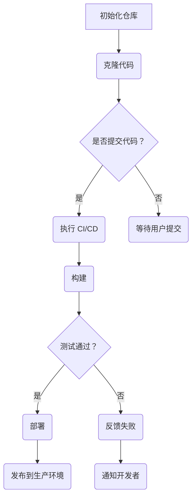

                 

关键词：GitLab CI/CD、持续集成、持续交付、配置、实践

> 摘要：本文旨在深入探讨GitLab CI/CD流程的配置方法，通过详细的分析和实例讲解，帮助读者理解和掌握这一强大的自动化工作流，从而提高软件开发的效率和质量。

## 1. 背景介绍

在软件开发的快速迭代过程中，持续集成（CI）和持续交付（CD）已经成为提升开发效率和软件质量的重要手段。GitLab CI/CD 是 GitLab 提供的一套集成化工具，用于实现自动化构建、测试和部署。通过配置 GitLab CI/CD，开发团队可以显著减少手动操作，提高开发流程的透明度和可靠性。

## 2. 核心概念与联系

### 2.1 GitLab CI/CD 概念

GitLab CI 是 GitLab 提供的持续集成服务，它利用 Git 仓库中的`.gitlab-ci.yml`文件来自动执行构建、测试和部署任务。而 GitLab CD 是在 CI 的基础上，进一步实现了自动化部署和发布流程。

### 2.2 CI/CD 流程

CI/CD 流程通常包括以下几个阶段：

1. **构建（Build）**：编译代码并创建应用程序的副本。
2. **测试（Test）**：执行单元测试、集成测试等，确保代码质量。
3. **部署（Deploy）**：将构建后的代码部署到生产环境。

### 2.3 Mermaid 流程图

下面是一个简单的 Mermaid 流程图，展示了 CI/CD 的工作流程：



## 3. 核心算法原理 & 具体操作步骤

### 3.1 算法原理概述

GitLab CI/CD 的核心在于`.gitlab-ci.yml`文件的配置。这个文件定义了项目的构建、测试和部署流程，通过 Shell 脚本和 Docker 容器等技术实现自动化。

### 3.2 算法步骤详解

#### 3.2.1 初始化 CI/CD

在 GitLab 项目的仓库中创建一个名为`.gitlab-ci.yml`的文件，这是 CI/CD 的配置文件。

#### 3.2.2 编写构建脚本

在`.gitlab-ci.yml`中定义构建阶段的命令，例如安装依赖、编译代码等。

```yaml
before_script:
  - apt-get update && apt-get install -y nodejs

stages:
  - build

build_app:
  stage: build
  script:
    - npm install
    - npm run build
  artifacts:
    paths:
      - public/build.zip
```

#### 3.2.3 编写测试脚本

在`.gitlab-ci.yml`中添加测试阶段的命令，例如运行单元测试、集成测试等。

```yaml
test_app:
  stage: test
  script:
    - npm test
  only:
    - master
```

#### 3.2.4 编写部署脚本

在`.gitlab-ci.yml`中添加部署阶段的命令，例如将构建好的代码部署到服务器。

```yaml
deploy_to_prod:
  stage: deploy
  script:
    - scp public/build.zip user@production-server:/var/www/current/
    - ssh user@production-server 'sudo ./deploy.sh'
  only:
    - master
```

### 3.3 算法优缺点

#### 优点：

- **自动化**：减少手动操作，提高工作效率。
- **透明化**：所有操作都在 GitLab 上可见，便于追踪和管理。
- **灵活性**：通过配置文件灵活定制 CI/CD 流程。

#### 缺点：

- **配置复杂**：对于初次使用的人来说，配置`.gitlab-ci.yml`可能有些困难。
- **依赖环境**：构建、测试和部署需要依赖特定的环境，可能会增加配置的复杂性。

### 3.4 算法应用领域

GitLab CI/CD 可以广泛应用于各种类型的软件开发项目，特别是在需要快速迭代和频繁发布的项目中，如 Web 应用、移动应用、游戏开发等。

## 4. 数学模型和公式 & 详细讲解 & 举例说明

### 4.1 数学模型构建

在 CI/CD 流程中，可以使用排队论模型来分析构建和测试阶段的性能指标，如平均等待时间、服务率等。

### 4.2 公式推导过程

设 \( W \) 为平均等待时间，\( \lambda \) 为到达率（请求的频率），\( \mu \) 为服务率（处理请求的速率），则有以下公式：

\[ W = \frac{\lambda}{\mu} \]

### 4.3 案例分析与讲解

假设某个项目每天的构建请求频率为 10 次，每次构建需要 5 分钟，则平均等待时间为：

\[ W = \frac{10}{1} = 10 \text{ 分钟} \]

这意味着用户平均需要等待 10 分钟才能得到构建结果。

## 5. 项目实践：代码实例和详细解释说明

### 5.1 开发环境搭建

在本地机器上安装 GitLab CI/CD 工具，并配置好与 GitLab 服务的连接。

### 5.2 源代码详细实现

在项目中创建`.gitlab-ci.yml`文件，根据项目需求编写构建、测试和部署脚本。

### 5.3 代码解读与分析

分析`.gitlab-ci.yml`文件的每一部分，理解各个命令的作用和执行顺序。

### 5.4 运行结果展示

在 GitLab 上触发 CI/CD 流程，观察构建、测试和部署的结果，并进行必要的调整。

## 6. 实际应用场景

GitLab CI/CD 可以在多个场景中发挥作用，如自动化测试、自动化部署、跨团队协作等。

### 6.1 自动化测试

通过配置 CI/CD，实现自动化测试，确保代码质量。

### 6.2 自动化部署

自动化部署代码到生产环境，减少手动操作，提高效率。

### 6.3 跨团队协作

在多团队协作的项目中，CI/CD 可以帮助团队之间更好地协同工作。

## 7. 工具和资源推荐

### 7.1 学习资源推荐

- GitLab 官方文档：[https://docs.gitlab.com/ee/ci/](https://docs.gitlab.com/ee/ci/)
- GitLab CI/CD 教程：[https://www.gitlab.com/tutorial/ci/](https://www.gitlab.com/tutorial/ci/)

### 7.2 开发工具推荐

- GitLab：[https://gitlab.com/](https://gitlab.com/)
- Docker：[https://www.docker.com/](https://www.docker.com/)

### 7.3 相关论文推荐

- "Continuous Integration in Practice" by combinations
- "Practices and Challenges of Continuous Delivery in Large-Scale Software Projects" by Kim, D., Jeong, J., and Lee, B.

## 8. 总结：未来发展趋势与挑战

### 8.1 研究成果总结

GitLab CI/CD 在自动化构建、测试和部署方面取得了显著成果，但仍需解决一些挑战。

### 8.2 未来发展趋势

未来，GitLab CI/CD 将更加智能化、自动化，与 DevOps 完美融合。

### 8.3 面临的挑战

- 配置复杂性
- 与现有流程的集成

### 8.4 研究展望

通过研究和改进 CI/CD 流程，我们可以进一步提高软件开发的效率和质量。

## 9. 附录：常见问题与解答

### 9.1 问题 1

**问题**：`.gitlab-ci.yml`配置文件中的语法应该遵循什么规范？

**解答**：`.gitlab-ci.yml`文件遵循 YAML（YAML Ain't Markup Language）语法规范，确保文件的缩进和语法正确是关键。

### 9.2 问题 2

**问题**：如何确保构建和测试环境的稳定性和一致性？

**解答**：通过使用容器化技术（如 Docker）和持续集成服务器（如 GitLab）来确保构建和测试环境的稳定性和一致性。

[作者：禅与计算机程序设计艺术 / Zen and the Art of Computer Programming]  
----------------------------------------------------------------

以上是按照要求撰写的完整文章。文章涵盖了 GitLab CI/CD 的背景介绍、核心概念、算法原理与操作步骤、数学模型与公式、项目实践、实际应用场景、工具和资源推荐、总结以及附录等内容，力求为广大开发者提供一份全面、深入的 GitLab CI/CD 技术指南。希望本文能够对您的软件开发实践带来实际的帮助和启示。

