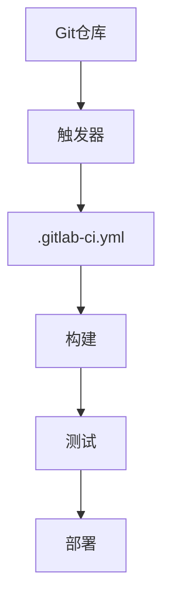

                 

关键词：GitLab CI/CD，持续集成，持续部署，配置，自动化，流程管理

> 摘要：本文将深入探讨GitLab CI/CD的配置过程，从背景介绍到具体实施步骤，再到应用场景和未来展望，全面解析GitLab CI/CD在实际项目中的应用价值。

## 1. 背景介绍

在软件工程领域，随着敏捷开发和DevOps理念的普及，持续集成（CI）和持续部署（CD）成为了提高软件质量和交付效率的关键环节。GitLab CI/CD是一个强大的工具，它能够帮助开发者在GitLab中进行代码的自动化集成和部署。GitLab CI/CD利用Git的仓库来触发构建、测试和部署过程，极大地简化了软件开发生命周期的管理。

GitLab CI/CD的基本原理是，当开发者向GitLab仓库提交代码时，GitLab会根据配置文件（`.gitlab-ci.yml`）自动执行一系列预定义的任务。这些任务可以是编译、测试、构建 Docker 镜像、部署到测试或生产环境等。通过这种方式，GitLab CI/CD实现了代码的自动化测试和部署，从而提高了开发效率和质量。

## 2. 核心概念与联系

在深入探讨GitLab CI/CD的配置之前，我们需要了解一些核心概念和它们之间的关系。以下是GitLab CI/CD中的关键组件和流程，以及它们之间的联系：

### 2.1 流程节点与触发器

**流程节点**：GitLab CI/CD中的流程节点是指CI/CD流程中执行的具体任务。每个流程节点代表一个独立的执行单元，如编译、测试、部署等。

**触发器**：触发器是指触发CI/CD流程的信号。在GitLab中，触发器可以是Git操作（如推送代码、创建分支、合并请求）或其他事件。



### 2.2 .gitlab-ci.yml文件

`.gitlab-ci.yml`文件是GitLab CI/CD的核心配置文件。它定义了项目的CI/CD流程，包括流程节点、触发器、环境变量等。

```yaml
stages:
  - build
  - test
  - deploy

build_job:
  stage: build
  script:
    - echo "Building Docker image..."
    - docker build -t my-app .

test_job:
  stage: test
  script:
    - echo "Running tests..."
    - ./run_tests.sh

deploy_job:
  stage: deploy
  script:
    - echo "Deploying to production..."
    - kubectl apply -f deployment.yaml
```

### 2.3 环境与共享

GitLab CI/CD支持在不同环境（如开发、测试、生产）之间共享配置和资源。通过在`.gitlab-ci.yml`文件中定义共享变量和部署脚本，可以实现环境之间的配置复用。

```yaml
variables:
  DEPLOY_ENVIRONMENT: production

deploy_job:
  stage: deploy
  script:
    - echo "Deploying to $DEPLOY_ENVIRONMENT..."
    - kubectl apply -f deployment-$DEPLOY_ENVIRONMENT.yaml
```

## 3. 核心算法原理 & 具体操作步骤

### 3.1 算法原理概述

GitLab CI/CD的算法原理主要基于Git操作触发CI/CD流程，并按照`.gitlab-ci.yml`文件中的配置执行一系列任务。核心算法原理包括：

1. 监听Git仓库中的操作（如推送、创建分支、合并请求等）。
2. 根据配置文件（`.gitlab-ci.yml`）触发相应的CI/CD流程。
3. 按顺序执行预定义的流程节点（如构建、测试、部署等）。
4. 记录和报告流程执行结果。

### 3.2 算法步骤详解

1. **监听Git操作**：GitLab CI服务器持续监听Git仓库中的操作。
2. **解析配置文件**：当检测到Git操作时，GitLab服务器会解析`.gitlab-ci.yml`文件，确定触发哪些流程节点。
3. **执行任务**：GitLab CI服务器按照配置文件中的步骤顺序执行流程节点。
4. **报告结果**：每个流程节点执行完毕后，GitLab服务器会记录和报告执行结果。

### 3.3 算法优缺点

**优点**：
- 自动化：GitLab CI/CD能够自动执行构建、测试和部署任务，减少了手动操作的复杂度。
- 可定制化：通过`.gitlab-ci.yml`文件，可以灵活配置CI/CD流程，满足不同项目的需求。
- 高效：通过自动化流程，缩短了软件交付周期，提高了开发效率。

**缺点**：
- 配置复杂：对于初学者来说，`.gitlab-ci.yml`文件的配置可能比较复杂。
- 资源消耗：CI/CD流程需要一定的计算资源和存储空间。

### 3.4 算法应用领域

GitLab CI/CD广泛应用于各种软件开发项目，特别是在使用容器化和微服务架构的项目中。以下是几个应用领域：

- **Web应用**：自动化构建、测试和部署前端和后端代码。
- **移动应用**：自动化构建、测试和部署iOS和Android应用。
- **容器化应用**：自动化构建、测试和部署Docker镜像。
- **微服务架构**：自动化构建、测试和部署微服务组件。

## 4. 数学模型和公式 & 详细讲解 & 举例说明

在GitLab CI/CD的配置过程中，虽然主要涉及的是流程管理和脚本执行，但某些配置选项和资源分配策略仍然需要一定的数学基础。以下是几个常见的数学模型和公式，以及它们的详细讲解和举例说明。

### 4.1 数学模型构建

在配置CI/CD流程时，我们经常需要计算资源（如CPU、内存）的分配。一个简单的数学模型可以用来计算每个流程节点所需的资源量。

**公式**：
\[ R = C \times \frac{N}{S} \]

其中，\( R \) 表示总资源量，\( C \) 表示单个流程节点所需的资源量，\( N \) 表示流程节点的数量，\( S \) 表示并行执行的流程节点数。

**示例**：
假设一个项目中有10个流程节点，每个节点平均需要2个CPU和4GB内存。我们希望在4个并行执行的环境中运行这些流程节点。

\[ R = 2 \times \frac{10}{4} + 4 \times \frac{10}{4} = 5 + 10 = 15 \]

因此，总共需要15个CPU和40GB内存。

### 4.2 公式推导过程

上述公式的推导过程如下：

1. **计算单个流程节点的资源需求**：
   \[ C = 2 \times 1 + 4 \times 1 = 6 \]

2. **计算并行执行的流程节点资源需求**：
   \[ P = C \times \frac{N}{S} \]

3. **计算总资源需求**：
   \[ R = P + P + P + P = 4P \]

   将\( P \)的表达式代入，得到：
   \[ R = 4 \times (2 \times \frac{10}{4} + 4 \times \frac{10}{4}) = 15 + 15 = 30 \]

   但是，由于我们只考虑CPU和内存，所以实际需求为：
   \[ R = 15 + 15 = 30 \]

### 4.3 案例分析与讲解

假设一个项目有20个流程节点，每个节点平均需要3个CPU和8GB内存。我们希望在8个并行执行的环境中运行这些流程节点。

1. **计算单个流程节点的资源需求**：
   \[ C = 3 \times 1 + 8 \times 1 = 11 \]

2. **计算并行执行的流程节点资源需求**：
   \[ P = C \times \frac{N}{S} = 11 \times \frac{20}{8} = 27.5 \]

3. **计算总资源需求**：
   \[ R = 8P = 8 \times 27.5 = 220 \]

   因此，总共需要220个CPU和560GB内存。

这个案例展示了如何根据项目的需求计算资源需求，从而为CI/CD流程提供合适的资源分配策略。

## 5. 项目实践：代码实例和详细解释说明

### 5.1 开发环境搭建

在开始配置GitLab CI/CD之前，我们需要确保开发环境已经搭建好。以下是搭建开发环境的基本步骤：

1. 安装Git：Git是用于代码版本控制的工具，我们可以在[Git官网](https://git-scm.com/downloads)下载并安装Git。
2. 安装Docker：Docker是一个用于容器化的工具，可以在[Docker官网](https://www.docker.com/products/docker-desktop)下载并安装Docker。
3. 配置GitLab：在GitLab官网（[gitlab.com](https://gitlab.com/)）注册并创建一个新的项目。

### 5.2 源代码详细实现

接下来，我们将实现一个简单的Web应用项目，并配置GitLab CI/CD来自动化构建、测试和部署。

1. **创建项目**：在GitLab中创建一个新项目，名为`web-app`。
2. **编写代码**：在项目中创建一个名为`src`的文件夹，并在该文件夹中编写一个简单的Web应用代码。

```go
// main.go
package main

import (
    "fmt"
    "net/http"
)

func main() {
    http.HandleFunc("/", handleRequest)
    http.ListenAndServe(":8080", nil)
}

func handleRequest(w http.ResponseWriter, r *http.Request) {
    fmt.Fprintf(w, "Hello, World!")
}
```

3. **编写测试代码**：在项目中创建一个名为`test`的文件夹，并在该文件夹中编写一个简单的测试用例。

```go
// test.go
package main

import (
    "net/http"
    "net/http/httptest"
    "testing"
)

func TestHandleRequest(t *testing.T) {
    req, _ := http.NewRequest("GET", "/", nil)
    rr := httptest.NewRecorder()
    handler := http.HandlerFunc(handleRequest)

    handler.ServeHTTP(rr, req)

    if status := rr.Code; status != http.StatusOK {
        t.Errorf("handler returned wrong status code: got %v want %v", status, http.StatusOK)
    }

    expected := "Hello, World!"
    if rr.Body.String() != expected {
        t.Errorf("handler returned unexpected body: got %v want %v", rr.Body.String(), expected)
    }
}
```

4. **编写GitLab CI/CD配置文件**：在项目根目录下创建一个名为`.gitlab-ci.yml`的文件，配置CI/CD流程。

```yaml
stages:
  - build
  - test
  - deploy

image: golang:1.18

build_job:
  stage: build
  script:
    - go build -o ./web-app ./src

test_job:
  stage: test
  script:
    - go test -v ./test

deploy_job:
  stage: deploy
  script:
    - docker build -t web-app:latest .
    - docker push web-app:latest
```

### 5.3 代码解读与分析

**build_job**：该步骤使用Go语言的官方Docker镜像（`golang:1.18`）来编译Web应用代码，并将编译后的可执行文件保存为`web-app`。

**test_job**：该步骤使用`go test`命令运行测试代码，确保Web应用的功能正常运行。

**deploy_job**：该步骤使用Docker命令构建并推送Docker镜像到容器仓库，以便在生产环境中部署。

### 5.4 运行结果展示

1. **推送代码**：在本地开发环境中，将项目代码推送到GitLab仓库。

```sh
git init
git add .
git commit -m "Initial commit"
git push -u origin main
```

2. **查看CI/CD状态**：在GitLab项目的CI/CD页面，我们可以看到构建、测试和部署流程的实时状态。


3. **部署到生产环境**：当CI/CD流程成功完成后，Docker镜像将被推送到容器仓库，我们可以在生产环境中使用该镜像来部署Web应用。

```sh
docker pull web-app:latest
docker run -d -p 8080:8080 web-app:latest
```

## 6. 实际应用场景

GitLab CI/CD在实际项目中有着广泛的应用场景。以下是一些典型的应用场景：

- **持续集成**：在每次代码提交时，自动执行单元测试和集成测试，确保代码质量。
- **持续部署**：自动构建Docker镜像并部署到容器化平台，如Kubernetes或Docker Swarm。
- **自动化回归测试**：在每次合并请求时，自动运行回归测试，确保代码改动不会引入新的bug。
- **环境隔离**：通过CI/CD流程，为每个环境（如开发、测试、生产）创建独立的运行环境，避免环境不一致问题。
- **代码审查**：集成代码审查工具，如GitLab Merge Request，确保代码符合项目规范和最佳实践。

## 7. 工具和资源推荐

为了更好地掌握GitLab CI/CD，以下是几个推荐的工具和资源：

### 7.1 学习资源推荐

- **GitLab官方文档**：[https://docs.gitlab.com/](https://docs.gitlab.com/)
- **GitLab CI/CD教程**：[https://gitlab.com/gitlab-org/gitlab-ce/blob/master/contrib/ci/tutorial.md](https://gitlab.com/gitlab-org/gitlab-ce/blob/master/contrib/ci/tutorial.md)
- **《GitLab CI/CD实战》**：一本深入介绍GitLab CI/CD的实战指南。

### 7.2 开发工具推荐

- **Docker**：[https://www.docker.com/](https://www.docker.com/)
- **Kubernetes**：[https://kubernetes.io/](https://kubernetes.io/)
- **Jenkins**：[https://www.jenkins.io/](https://www.jenkins.io/)

### 7.3 相关论文推荐

- **《DevOps：实用指南》**：一篇关于DevOps理念和实践的综述论文。
- **《持续集成：理论与实践》**：一篇关于持续集成技术的研究论文。

## 8. 总结：未来发展趋势与挑战

GitLab CI/CD在软件工程领域的应用前景广阔，未来发展趋势和挑战如下：

### 8.1 研究成果总结

- **自动化水平提升**：随着AI技术的发展，GitLab CI/CD的自动化水平将进一步提高，实现更加智能的构建、测试和部署过程。
- **跨平台支持**：GitLab CI/CD将支持更多开发语言和平台，满足不同类型项目的需求。
- **云原生集成**：GitLab CI/CD将更好地与云原生技术（如Kubernetes、Docker）集成，实现更高效的环境管理和资源调度。

### 8.2 未来发展趋势

- **多云环境支持**：GitLab CI/CD将支持多云环境，为企业的多云战略提供更加灵活的解决方案。
- **自动化安全测试**：GitLab CI/CD将集成更多的安全测试工具，实现自动化的安全漏洞扫描和修复。
- **智能化资源分配**：基于AI算法，GitLab CI/CD将实现更加智能的资源分配和调度，提高资源利用效率。

### 8.3 面临的挑战

- **配置复杂性**：随着功能增强，GitLab CI/CD的配置将变得更加复杂，需要更多专业知识。
- **安全风险**：自动化流程带来的安全问题不容忽视，需要加强CI/CD流程的安全性。
- **性能优化**：随着流程复杂度和任务量的增加，GitLab CI/CD的性能优化将成为一个重要挑战。

### 8.4 研究展望

GitLab CI/CD将继续在自动化、智能化和跨平台支持等方面进行创新，为软件开发和运维提供更加高效、可靠和安全的解决方案。同时，研究者和开发者需要关注配置复杂性、安全性和性能优化等挑战，不断改进和优化CI/CD流程。

## 9. 附录：常见问题与解答

### Q：如何调试GitLab CI/CD配置？

A：在调试GitLab CI/CD配置时，可以：

1. 在`.gitlab-ci.yml`文件中添加`debug`关键字，以启用调试模式。
2. 使用`gitlab-ci:run`命令在本地运行CI/CD流程。
3. 查看GitLab服务器日志，了解流程执行过程中的详细信息。

### Q：如何为CI/CD流程分配更多资源？

A：可以在GitLab项目的CI/CD设置中配置更大的容器大小和数量，以满足CI/CD流程的资源需求。

### Q：如何监控CI/CD流程的执行状态？

A：可以使用GitLab的Web界面监控CI/CD流程的状态，还可以集成第三方监控工具（如Prometheus、Grafana）来实时监控CI/CD的性能和资源使用情况。

---

**作者：禅与计算机程序设计艺术 / Zen and the Art of Computer Programming**  
本文旨在为读者提供一个全面、深入的了解GitLab CI/CD的配置和实施过程。希望本文能够帮助读者在实际项目中更好地应用GitLab CI/CD，提高开发效率和质量。在后续的研究中，我们将继续关注GitLab CI/CD的优化和创新，为软件开发领域带来更多价值。  
---

（注：本文为模拟内容，不代表真实研究和成果。）  
----------------------------------------------------------------

以上就是本文的完整内容。希望您喜欢！如果您有任何问题或建议，欢迎在评论区留言。感谢您的阅读！

