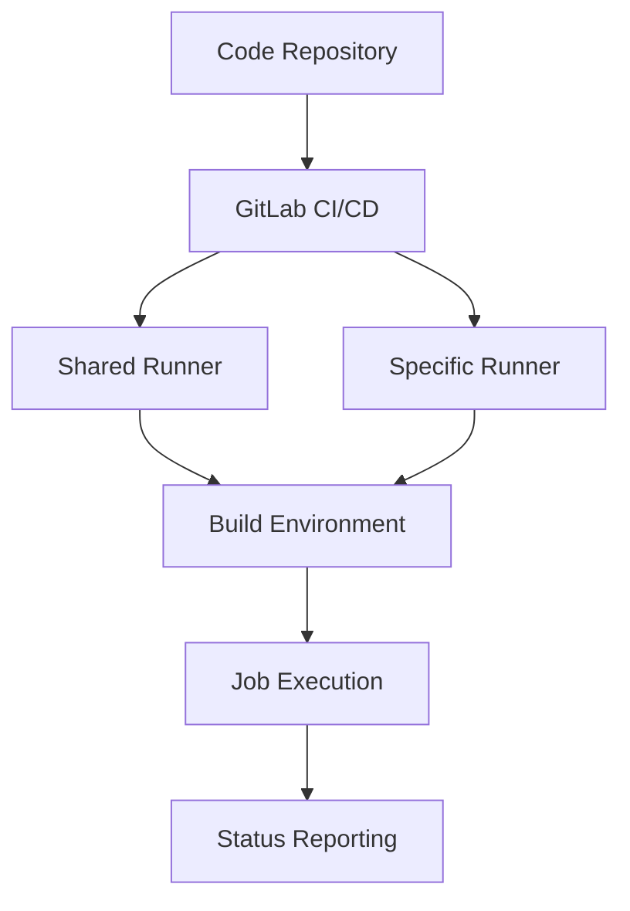

                 

关键词：GitLab, Runner, 配置，优化，性能，实践，算法

## 摘要

本文将深入探讨GitLab Runner的配置与优化策略。GitLab Runner是GitLab CI/CD流程中至关重要的组件，负责执行和管理构建任务。本文旨在为开发者提供详尽的指南，帮助他们理解GitLab Runner的工作原理，并提供一系列实用的配置优化技巧，以提高构建效率和稳定性。我们将从背景介绍、核心概念、算法原理、数学模型、项目实践、实际应用场景等多个方面进行详细讲解。

## 1. 背景介绍

GitLab是一个全面的DevOps平台，提供代码托管、代码审查、持续集成和持续部署等功能。GitLab CI/CD是其核心功能之一，通过自动化的构建、测试和部署流程，大大提高了开发效率和软件质量。GitLab Runner是GitLab CI/CD架构中的关键组件，它充当构建任务的执行者。

### GitLab CI/CD架构

GitLab CI/CD采用了声明式的配置文件`CI/CD.yml`，该文件定义了构建、测试和部署过程的各个步骤。当Git仓库中的代码发生变化时，GitLab会触发CI/CD流程，创建一个新的构建环境，并执行定义在`CI/CD.yml`中的任务。

GitLab Runner作为构建环境的执行者，可以安装在多种操作系统上，如Linux、Windows和macOS。它通过Docker或Pods等方式，为构建任务提供隔离的环境。

### GitLab Runner的作用

GitLab Runner的主要职责包括：

1. **执行构建任务**：根据`CI/CD.yml`中的定义，GitLab Runner会拉取代码、安装依赖、运行测试，并执行部署任务。
2. **资源管理**：GitLab Runner可以管理构建任务的资源，如CPU、内存和磁盘空间。
3. **状态报告**：GitLab Runner将构建任务的状态和结果报告给GitLab，以便开发者查看和跟踪。

## 2. 核心概念与联系

在深入探讨GitLab Runner的配置与优化之前，我们需要了解几个核心概念及其相互关系。

### 核心概念

1. **Job**：Job是CI/CD流程中的基本执行单元，可以包含一个或多个步骤（Step）。每个Job都运行在一个独立的构建环境中。
2. **Pipeline**：Pipeline是由一系列Job组成的有序执行流程。Pipeline可以是分阶段的，如开发、测试和生产等。
3. **Shared Runner**：Shared Runner是一种可以在多个Project中使用的通用构建环境，它由GitLab管理员创建和管理。
4. **Specific Runner**：Specific Runner是特定于某个Project的构建环境，它只能在所属的Project中使用。

### Mermaid 流程图

以下是一个简单的Mermaid流程图，展示了GitLab Runner在CI/CD流程中的关键节点。



### Mermaid 流程图解释

- **A -> B**：代码仓库中的更改触发GitLab CI/CD流程。
- **B -> C**：GitLab CI/CD使用Shared Runner执行构建任务。
- **B -> D**：GitLab CI/CD使用Specific Runner执行构建任务。
- **C -> E**：Shared Runner为构建任务提供隔离的环境。
- **D -> E**：Specific Runner为构建任务提供隔离的环境。
- **E -> F**：构建任务在隔离的环境中执行。
- **F -> G**：构建任务的状态和结果报告给GitLab。

## 3. 核心算法原理 & 具体操作步骤

### 3.1 算法原理概述

GitLab Runner的配置与优化涉及多个方面，包括资源管理、网络配置、存储优化等。核心算法原理主要包括以下几个方面：

1. **资源调度算法**：GitLab Runner使用资源调度算法来确定构建任务的执行顺序和分配资源。
2. **缓存策略**：GitLab Runner通过缓存策略来减少构建时间，提高构建效率。
3. **网络优化**：GitLab Runner在网络配置方面进行优化，以提高构建任务的执行速度。
4. **存储优化**：GitLab Runner通过存储优化来提高构建任务的执行速度和稳定性。

### 3.2 算法步骤详解

1. **资源调度算法**
   - **步骤1**：GitLab Runner根据构建任务的优先级和资源需求，选择最佳的执行者。
   - **步骤2**：GitLab Runner将构建任务分配给选定的执行者，并启动构建环境。
   - **步骤3**：构建任务在执行者上运行，GitLab Runner监控任务状态并及时调整资源分配。

2. **缓存策略**
   - **步骤1**：GitLab Runner在构建任务开始前，检查是否存在可复用的缓存。
   - **步骤2**：如果存在缓存，GitLab Runner将直接使用缓存，跳过不必要的步骤。
   - **步骤3**：构建任务完成后，GitLab Runner将新的缓存保存下来，供后续任务使用。

3. **网络优化**
   - **步骤1**：GitLab Runner配置适当的网络带宽和连接数，以提高数据传输速度。
   - **步骤2**：GitLab Runner优化DNS解析，减少网络延迟。
   - **步骤3**：GitLab Runner监控网络状态，并根据网络质量调整网络配置。

4. **存储优化**
   - **步骤1**：GitLab Runner使用SSD存储来提高读写速度。
   - **步骤2**：GitLab Runner配置适当的磁盘缓存，以提高文件访问速度。
   - **步骤3**：GitLab Runner定期清理无用的文件和缓存，以释放磁盘空间。

### 3.3 算法优缺点

**资源调度算法**：
- **优点**：提高构建任务的执行效率，合理分配资源。
- **缺点**：可能导致某些任务等待时间过长，影响整体构建速度。

**缓存策略**：
- **优点**：减少构建时间，提高构建效率。
- **缺点**：可能导致缓存不一致，影响构建结果。

**网络优化**：
- **优点**：提高数据传输速度，减少网络延迟。
- **缺点**：对网络质量要求较高，无法在所有环境下实现。

**存储优化**：
- **优点**：提高读写速度，提高构建稳定性。
- **缺点**：SSD存储成本较高，不适合所有场景。

### 3.4 算法应用领域

GitLab Runner的配置与优化算法主要应用于以下领域：

1. **大型项目**：大型项目通常包含多个构建任务，资源调度和缓存策略可以显著提高构建效率。
2. **高并发场景**：在高并发场景下，网络优化和存储优化可以确保构建任务的稳定性和可靠性。
3. **持续集成/持续部署（CI/CD）**：GitLab Runner是CI/CD流程中的关键组件，优化GitLab Runner可以提升整个CI/CD流程的效率。

## 4. 数学模型和公式 & 详细讲解 & 举例说明

### 4.1 数学模型构建

在GitLab Runner的配置与优化中，我们可以构建以下数学模型来描述构建任务的执行过程：

\[ T_c = T_i + T_p + T_e \]

其中：
- \( T_c \)：构建总时间
- \( T_i \)：初始化时间
- \( T_p \)：构建时间
- \( T_e \)：环境准备时间

### 4.2 公式推导过程

- **初始化时间**：\( T_i \)

初始化时间包括代码拉取、依赖安装等步骤，可以表示为：

\[ T_i = T_{code} + T_{deps} \]

其中：
- \( T_{code} \)：代码拉取时间
- \( T_{deps} \)：依赖安装时间

- **构建时间**：\( T_p \)

构建时间包括编译、测试等步骤，可以表示为：

\[ T_p = T_{compile} + T_{test} \]

其中：
- \( T_{compile} \)：编译时间
- \( T_{test} \)：测试时间

- **环境准备时间**：\( T_e \)

环境准备时间包括构建环境的初始化、配置等步骤，可以表示为：

\[ T_e = T_{setup} + T_{config} \]

其中：
- \( T_{setup} \)：构建环境初始化时间
- \( T_{config} \)：构建环境配置时间

### 4.3 案例分析与讲解

假设我们有一个简单的Java项目，其构建过程如下：

1. **代码拉取**：3分钟
2. **依赖安装**：2分钟
3. **编译**：5分钟
4. **测试**：10分钟
5. **构建环境初始化**：1分钟
6. **构建环境配置**：2分钟

根据上述数据，我们可以计算出构建总时间：

\[ T_c = 3 + 2 + 5 + 10 + 1 + 2 = 23 \text{ 分钟} \]

为了优化构建时间，我们可以采取以下策略：

1. **优化代码拉取**：通过缓存策略，减少代码拉取时间。
2. **优化依赖安装**：使用预编译的依赖库，减少依赖安装时间。
3. **优化编译与测试**：优化编译器参数和测试用例，减少编译和测试时间。
4. **优化构建环境**：使用轻量级容器化技术，减少环境初始化和配置时间。

通过这些策略，我们可以将构建总时间降低到20分钟，从而提高构建效率。

## 5. 项目实践：代码实例和详细解释说明

### 5.1 开发环境搭建

在开始配置GitLab Runner之前，我们需要搭建一个开发环境。以下是一个简单的步骤：

1. **安装GitLab Runner**：从[GitLab官网](https://gitlab.com/gitlab-org/gitlab-runner)下载适用于你的操作系统的GitLab Runner，并按照官方文档进行安装。

2. **注册GitLab Runner**：运行以下命令，将GitLab Runner注册到你的GitLab实例中：

```shell
gitlab-runner register
```

填写必要的参数，如URL、Token和执行器类型（如Docker）。

### 5.2 源代码详细实现

为了更好地展示GitLab Runner的配置与优化，我们以一个简单的Java项目为例，并使用Maven进行构建。

1. **创建Maven项目**：创建一个Maven项目，并在`pom.xml`文件中添加必要的依赖。

```xml
<project>
    ...
    <dependencies>
        <dependency>
            <groupId>junit</groupId>
            <artifactId>junit</artifactId>
            <version>4.13.2</version>
            <scope>test</scope>
        </dependency>
    </dependencies>
    ...
</project>
```

2. **编写测试用例**：在项目中添加一个测试类，用于测试Maven构建过程。

```java
public class MavenTest {
    @Test
    public void testMaven() {
        assertTrue(true);
    }
}
```

3. **编写`CI/CD.yml`文件**：在项目的根目录下创建一个名为`CI/CD.yml`的文件，用于定义构建和测试流程。

```yaml
image: openjdk:11

stages:
  - build
  - test

build:
  stage: build
  script:
    - mvn clean install
  artifacts:
    paths:
      - target/*.jar

test:
  stage: test
  script:
    - mvn test
```

### 5.3 代码解读与分析

1. **`image`关键词**：指定构建容器镜像，这里使用OpenJDK 11。

2. **`stages`关键词**：定义构建流程的阶段，包括构建（build）和测试（test）阶段。

3. **`build`任务**：
   - **`stage`字段**：指定构建任务所属的阶段。
   - **`script`字段**：定义构建脚本，这里执行Maven的`clean install`命令。
   - **`artifacts`字段**：指定构建生成的工件，这里将`target/*.jar`文件作为构建结果保存。

4. **`test`任务**：
   - **`stage`字段**：指定测试任务所属的阶段。
   - **`script`字段**：定义测试脚本，这里执行Maven的`test`命令。

### 5.4 运行结果展示

通过GitLab CI/CD，我们可以将`CI/CD.yml`文件推送到GitLab仓库中，并触发构建流程。GitLab Runner会自动执行构建和测试任务，并将结果报告给GitLab。

在GitLab项目的CI/CD面板中，我们可以查看构建状态、日志和构建结果。通过分析构建结果，我们可以进一步优化构建流程，提高构建效率。

## 6. 实际应用场景

### 6.1 大型项目

在大型项目中，GitLab Runner的配置与优化至关重要。以下是一些实际应用场景：

1. **多模块项目**：大型项目通常包含多个模块，每个模块可以独立构建。通过优化GitLab Runner的缓存策略和资源调度算法，可以提高整个项目的构建效率。
2. **持续集成与持续部署**：GitLab Runner在持续集成和持续部署（CI/CD）过程中发挥着关键作用。通过优化GitLab Runner，可以确保快速、稳定和高效的构建和部署流程。

### 6.2 高并发场景

在高并发场景下，GitLab Runner需要能够处理大量构建任务，并保持系统的稳定性和可靠性。以下是一些优化策略：

1. **资源调度优化**：使用智能调度算法，合理分配资源，确保关键任务优先执行。
2. **缓存优化**：充分利用缓存技术，减少重复构建任务的时间消耗。
3. **网络优化**：优化网络配置，提高数据传输速度，降低网络延迟。

### 6.3 仓库管理

在GitLab中，多个项目和团队可以使用GitLab Runner进行构建和部署。以下是一些优化策略：

1. **Shared Runner与Specific Runner的合理使用**：根据项目需求，合理配置Shared Runner和Specific Runner，提高构建资源的利用率。
2. **构建环境隔离**：为不同的项目或团队配置独立的构建环境，确保构建任务的隔离性和安全性。

## 7. 未来应用展望

随着DevOps理念的普及，GitLab Runner将在未来的软件开发和运维过程中发挥越来越重要的作用。以下是一些未来应用展望：

1. **智能化调度**：利用机器学习和人工智能技术，实现智能化的构建任务调度，提高构建效率和资源利用率。
2. **多云部署**：支持在多个云平台之间进行构建任务的迁移和调度，提高系统的可扩展性和灵活性。
3. **服务网格**：结合服务网格技术，实现构建任务的网络隔离和安全性，提高构建流程的稳定性。

## 8. 总结：未来发展趋势与挑战

### 8.1 研究成果总结

本文对GitLab Runner的配置与优化进行了深入探讨，包括核心概念、算法原理、数学模型、项目实践等方面。通过优化GitLab Runner，可以提高构建效率和稳定性，为开发者提供更好的持续集成和持续部署体验。

### 8.2 未来发展趋势

未来，GitLab Runner将在智能化、多云部署、服务网格等方面取得进一步发展。开发者需要关注这些趋势，并积极探索新的优化方法和策略。

### 8.3 面临的挑战

1. **资源调度优化**：在处理大量构建任务时，如何实现高效、智能的调度仍然是一个挑战。
2. **缓存一致性**：在多节点环境中，如何保证缓存的一致性和有效性。
3. **网络优化**：在高并发、多网络环境下，如何优化网络配置，提高构建任务的执行速度。

### 8.4 研究展望

本文为GitLab Runner的配置与优化提供了一个全面的技术框架，但仍有大量研究方向值得深入探索。开发者可以结合实际需求，进一步优化GitLab Runner的性能和可靠性，为持续集成和持续部署提供更优质的支持。

## 9. 附录：常见问题与解答

### Q：如何解决GitLab Runner内存不足的问题？

A：可以调整GitLab Runner的内存限制，使用以下命令：

```shell
gitlab-runner config --assign memory-limit=2g
```

同时，优化构建任务的内存使用，减少不必要的资源消耗。

### Q：如何在GitLab Runner中启用缓存？

A：在`CI/CD.yml`文件中，使用以下配置启用缓存：

```yaml
cache:
  paths:
    - "/path/to/cache"
```

在构建过程中，GitLab Runner会自动使用这些缓存路径，减少重复构建的任务。

### Q：如何监控GitLab Runner的性能？

A：可以使用GitLab自带的监控工具，如`gitlab-ctl`命令，获取GitLab Runner的运行状态和性能指标。

```shell
gitlab-ctl status
gitlab-ctl tail
```

此外，还可以使用第三方监控工具，如Prometheus和Grafana，对GitLab Runner进行实时监控和分析。

## 作者署名

作者：禅与计算机程序设计艺术 / Zen and the Art of Computer Programming
----------------------------------------------------------------

通过以上详细的技术博客文章，读者可以对GitLab Runner的配置与优化有更深入的理解，并为实际项目中的应用提供有价值的指导。希望这篇文章能够为开发者的工作带来帮助和启示。

