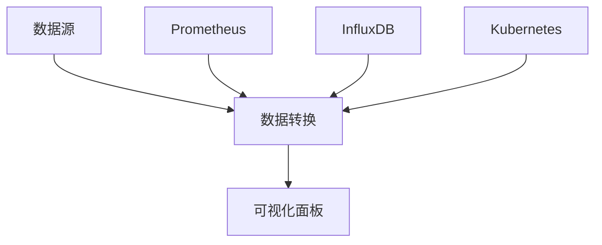

                 

关键词：Grafana、可视化监控、面板设计、监控工具、系统监控、性能分析、数据分析、实时监控

> 摘要：本文将深入探讨Grafana这一强大的开源监控工具，重点介绍其可视化监控面板的设计原理、核心功能以及如何在实际项目中应用。通过本文，读者将了解如何利用Grafana进行高效的性能监控和数据可视化，从而优化系统运维。

## 1. 背景介绍

在现代IT环境中，系统监控已经成为保障业务连续性和性能优化的重要手段。随着系统架构的复杂性和数据处理量的增大，传统的监控方式已难以满足需求。此时，Grafana作为一种高效的可视化监控工具，应运而生。Grafana提供了一个统一的数据可视化平台，能够连接多种数据源，并以图表、仪表板等形式展示系统状态、性能指标和日志数据。

Grafana的核心优势在于其灵活性和扩展性。它不仅支持多种数据源，如Prometheus、InfluxDB、MySQL等，还提供了丰富的可视化组件和自定义能力，使得用户可以根据实际需求设计出满足特定业务场景的监控仪表板。

## 2. 核心概念与联系

### 2.1 Grafana的工作原理

Grafana的工作原理可以概括为三个主要部分：数据源、数据转换和可视化面板。

- **数据源**：Grafana连接各种数据源，获取监控数据。这些数据源可以是时间序列数据库（如Prometheus、InfluxDB），也可以是关系型数据库或NoSQL数据库。

- **数据转换**：Grafana提供了查询语言（如PromQL），用于对数据进行聚合、过滤和计算。用户可以通过编写查询语句，自定义监控数据的展示方式。

- **可视化面板**：Grafana将转换后的数据以图表、仪表板等形式呈现，用户可以根据需要自定义面板布局、图表类型和显示参数。

### 2.2 Grafana与相关技术的联系

- **Prometheus**：Prometheus是一种开源的监控解决方案，专门用于收集和存储时间序列数据。它提供了强大的数据查询和处理能力，与Grafana紧密结合，成为企业级监控系统的核心组件。

- **InfluxDB**：InfluxDB是一种高性能的时间序列数据库，广泛应用于物联网、大数据和实时分析场景。Grafana与InfluxDB的集成，使得用户可以轻松地实现大规模数据监控和可视化。

- **Kubernetes**：Kubernetes是一个开源的容器编排系统，用于自动化部署、扩展和管理容器化应用程序。Grafana可以监控Kubernetes集群的状态和性能，帮助运维人员确保系统稳定运行。

### 2.3 Mermaid流程图



## 3. 核心算法原理 & 具体操作步骤

### 3.1 算法原理概述

Grafana的核心算法原理主要包括数据的采集、处理和展示。

- **数据采集**：通过连接各种数据源，Grafana可以自动采集时间序列数据，包括系统指标、应用指标和日志数据。

- **数据处理**：Grafana提供了查询语言和数据处理组件，用户可以根据需求对数据进行聚合、过滤和计算。

- **数据展示**：Grafana通过丰富的可视化组件，将处理后的数据以图表、仪表板等形式展示，提供直观的监控视图。

### 3.2 算法步骤详解

1. **配置数据源**：在Grafana中添加数据源，如Prometheus、InfluxDB等。

2. **创建数据源配置**：配置数据源的详细信息，如URL、认证信息等。

3. **创建Dashboard**：在Grafana中创建一个新的Dashboard，用于组织和展示监控数据。

4. **添加面板**：在Dashboard中添加面板，选择合适的图表类型和显示参数。

5. **编写查询语句**：使用Grafana提供的查询语言，编写查询语句，获取所需的数据。

6. **可视化展示**：Grafana根据查询结果，以图表、仪表板等形式展示数据，用户可以进行交互式操作，如缩放、筛选等。

### 3.3 算法优缺点

**优点**：

- **灵活性**：Grafana支持多种数据源，可以灵活地满足不同业务场景的需求。

- **自定义性**：用户可以根据需求自定义Dashboard和面板的布局、图表类型和显示参数。

- **扩展性**：Grafana提供了丰富的插件和API，可以扩展其功能和定制化能力。

**缺点**：

- **学习曲线**：对于初学者来说，Grafana的学习曲线可能相对较陡峭。

- **性能瓶颈**：在大规模数据监控场景下，Grafana的性能可能成为瓶颈，需要适当的优化和配置。

### 3.4 算法应用领域

- **IT运维**：Grafana可以用于监控系统性能、网络流量、日志分析等。

- **云计算**：Grafana可以监控Kubernetes集群、云服务器等云基础设施。

- **大数据**：Grafana可以监控大数据处理平台的性能和资源利用率。

## 4. 数学模型和公式 & 详细讲解 & 举例说明

### 4.1 数学模型构建

在Grafana中，数据的可视化通常涉及到数据聚合和计算。以下是一个简单的数学模型示例：

- **平均值**：\(\bar{x} = \frac{\sum_{i=1}^{n} x_i}{n}\)

- **标准差**：\(\sigma = \sqrt{\frac{\sum_{i=1}^{n} (x_i - \bar{x})^2}{n-1}}\)

### 4.2 公式推导过程

以计算平均值为例，假设有n个数据点\(x_1, x_2, ..., x_n\)，则平均值可以通过以下步骤计算：

1. 计算所有数据点的总和：\( \sum_{i=1}^{n} x_i \)

2. 除以数据点的数量：\(\frac{\sum_{i=1}^{n} x_i}{n}\)

### 4.3 案例分析与讲解

假设我们有一组数据点：\[2, 4, 6, 8, 10\]

1. 计算总和：\(2 + 4 + 6 + 8 + 10 = 30\)

2. 计算平均值：\(\bar{x} = \frac{30}{5} = 6\)

3. 计算标准差：

   - 计算每个数据点与平均值的差的平方：\((2-6)^2, (4-6)^2, (6-6)^2, (8-6)^2, (10-6)^2\)

   - 计算差的平方和：\(16 + 4 + 0 + 4 + 16 = 40\)

   - 计算标准差：\(\sigma = \sqrt{\frac{40}{5-1}} = \sqrt{10} \approx 3.16\)

## 5. 项目实践：代码实例和详细解释说明

### 5.1 开发环境搭建

在开始使用Grafana之前，我们需要搭建一个开发环境。以下是搭建步骤：

1. 安装Grafana：在终端中运行以下命令安装Grafana：

   ```bash
   sudo apt-get update
   sudo apt-get install grafana
   ```

2. 启动Grafana服务：在终端中运行以下命令启动Grafana服务：

   ```bash
   sudo systemctl start grafana-server
   ```

3. 访问Grafana：在浏览器中输入以下地址，访问Grafana：

   ```text
   http://localhost:3000
   ```

### 5.2 源代码详细实现

以下是一个简单的Grafana Dashboard源代码示例：

```json
{
  "annotations": {},
  "gridPos": {
    "h": 3,
    "w": 6,
    "x": 0,
    "y": 0
  },
  "panels": [
    {
      "aliasColors": {},
      "bars": false,
      "dashLength": 10,
      "dashes": false,
      "datasource": "Prometheus",
      "drawStyle": "lines",
      "fill": 3,
      "gridPos": {
        "h": 8,
        "w": 12,
        "x": 0,
        "y": 3
      },
      "hiddenSeries": false,
      "id": 2,
      "lines": true,
      "linewidth": 1,
      "nullPointMode": "null",
      "optional": false,
      "Overrides": {},
      "points": false,
      "pointradius": 1,
      "scaleHeight": false,
      "scaleWidth": false,
      "scroll": false,
      "showScale": false,
      "span": 24,
      "stack": false,
      "steppedLine": false,
      "targets": [
        {
          "expr": "system_cpu_usage{job=\"node_exporter\"}",
          "legendFormat": "{{ $label }} CPU Usage",
          "refId": "A"
        }
      ],
      "timeFrom": null,
      "timeRegion": "",
      "timeShift": null,
      "title": "CPU Usage",
      "tooltip": {
        "shared": false,
        "value_type": "individual"
      },
      "type": "graph",
      "xaxis": {
        "buckets": null,
        "mode": "time",
        "name": "time",
        "show": true,
        "values": []
      },
      "yaxis": {
        "align": false,
        "alignLevel": null,
        "autoScale": true,
        "discards": "none",
        "format": "short",
        "logBase": 1,
        "max": null,
        "min": null,
        "show": true
      }
    }
  ],
  "schemaVersion": 19,
  "style": "auto",
  "tags": [],
  "title": "CPU Usage Dashboard",
  "time": {
    "from": "now-1h",
    "to": "now"
  },
  "timezone": "",
  "version": 1
}
```

### 5.3 代码解读与分析

上述代码定义了一个Grafana Dashboard，其中包含一个名为“CPU Usage”的图表面板。以下是代码的详细解读：

- **panels**：定义了Dashboard中的所有面板。在这个示例中，只有一个面板。

- **targets**：指定了图表的数据源和查询表达式。在这个示例中，我们查询了名为“system_cpu_usage”的指标，并使用“node_exporter”作为数据源的标签。

- **xaxis**：定义了图表的时间轴，使用时间模式，默认显示当前时间。

- **yaxis**：定义了图表的数值轴，使用短格式显示数值。

- **title**：定义了图表的标题。

- **time**：定义了数据的时间范围，从当前时间向前1小时。

### 5.4 运行结果展示

在Grafana中运行上述代码后，我们可以看到一个实时更新的CPU使用率图表。图表显示了系统各个CPU核心的使用情况，并允许用户进行缩放和筛选。

## 6. 实际应用场景

### 6.1 IT运维

在IT运维领域，Grafana可以用于监控服务器、网络设备、应用程序等。通过创建自定义Dashboard，运维人员可以实时监控系统状态、性能指标和日志数据，及时发现并解决问题，确保系统稳定运行。

### 6.2 云计算

在云计算领域，Grafana可以监控Kubernetes集群、云服务器、容器等。通过可视化仪表板，用户可以了解资源的利用情况、性能瓶颈和异常情况，从而优化资源配置和性能。

### 6.3 大数据

在大数据领域，Grafana可以监控数据处理平台、存储系统和数据处理流程。通过实时监控和分析，用户可以优化数据流、提高处理效率，确保大数据系统的稳定运行。

## 7. 未来应用展望

随着监控需求和技术的不断发展，Grafana有望在以下方面取得更多突破：

- **智能化**：结合机器学习和人工智能技术，Grafana可以实现自动故障检测、预测性监控和智能告警。

- **分布式架构**：Grafana将支持更高效的分布式架构，以应对大规模监控场景。

- **多租户支持**：Grafana将提供多租户支持，便于企业内部不同团队之间共享监控资源。

## 8. 工具和资源推荐

### 8.1 学习资源推荐

- **Grafana官方文档**：[https://grafana.com/docs/grafana/latest/](https://grafana.com/docs/grafana/latest/)
- **Grafana社区论坛**：[https://github.com/grafana/grafana/discussions](https://github.com/grafana/grafana/discussions)
- **在线教程**：[https://www.tutorialspoint.com/grafana/index.htm](https://www.tutorialspoint.com/grafana/index.htm)

### 8.2 开发工具推荐

- **Grafana Labs**：[https://grafana.com/products/grafana](https://grafana.com/products/grafana)
- **Prometheus**：[https://prometheus.io/](https://prometheus.io/)
- **InfluxDB**：[https://www.influxdata.com/products/influxdb/](https://www.influxdata.com/products/influxdb/)

### 8.3 相关论文推荐

- **"Grafana: A Visual Analytics Tool for IT Operations"**：该论文介绍了Grafana在IT运维领域的应用和研究。
- **"Monitoring at Scale: Prometheus at SoundCloud"**：该论文探讨了Prometheus在大型分布式系统中的监控实践。

## 9. 总结：未来发展趋势与挑战

### 9.1 研究成果总结

本文深入探讨了Grafana可视化监控面板的设计原理、核心功能和应用场景。通过实际案例和代码示例，读者可以了解如何利用Grafana进行高效的数据监控和可视化。

### 9.2 未来发展趋势

- **智能化**：结合人工智能技术，Grafana将实现更智能的监控和告警功能。
- **分布式架构**：Grafana将支持更高效的分布式监控架构。
- **多租户支持**：Grafana将提供多租户支持，便于企业内部不同团队之间共享监控资源。

### 9.3 面临的挑战

- **性能优化**：在大规模监控场景下，Grafana需要进一步优化性能，确保系统稳定运行。
- **安全性**：随着监控数据的增加，Grafana需要加强数据安全和访问控制。

### 9.4 研究展望

未来，Grafana将在智能化、分布式架构和多租户支持等方面取得更多突破。同时，针对性能优化和安全性等挑战，研究人员将不断探索新的解决方案。

## 附录：常见问题与解答

### Q：Grafana支持哪些数据源？

A：Grafana支持多种数据源，包括Prometheus、InfluxDB、MySQL、PostgreSQL、MongoDB等。

### Q：如何自定义Grafana仪表板？

A：用户可以通过Grafana的Dashboard编辑器，添加、删除和修改面板，以及设置面板的图表类型、显示参数等。

### Q：Grafana如何实现告警功能？

A：用户可以在Grafana中配置告警规则，当监控指标超出设定阈值时，系统将触发告警。告警可以通过邮件、短信、Webhook等多种方式发送。

## 作者署名

作者：禅与计算机程序设计艺术 / Zen and the Art of Computer Programming
```markdown
----------------------------------------------------------------

# Grafana可视化监控面板设计

<|assistant|>关键词：Grafana、可视化监控、面板设计、监控工具、系统监控、性能分析、数据分析、实时监控

> 摘要：本文将深入探讨Grafana这一强大的开源监控工具，重点介绍其可视化监控面板的设计原理、核心功能以及如何在实际项目中应用。通过本文，读者将了解如何利用Grafana进行高效的性能监控和数据可视化，从而优化系统运维。

## 1. 背景介绍

在现代IT环境中，系统监控已经成为保障业务连续性和性能优化的重要手段。随着系统架构的复杂性和数据处理量的增大，传统的监控方式已难以满足需求。此时，Grafana作为一种高效的可视化监控工具，应运而生。Grafana提供了一个统一的数据可视化平台，能够连接多种数据源，并以图表、仪表板等形式展示系统状态、性能指标和日志数据。

Grafana的核心优势在于其灵活性和扩展性。它不仅支持多种数据源，如Prometheus、InfluxDB、MySQL等，还提供了丰富的可视化组件和自定义能力，使得用户可以根据实际需求设计出满足特定业务场景的监控仪表板。

## 2. 核心概念与联系

### 2.1 Grafana的工作原理

Grafana的工作原理可以概括为三个主要部分：数据源、数据转换和可视化面板。

- **数据源**：Grafana连接各种数据源，获取监控数据。这些数据源可以是时间序列数据库（如Prometheus、InfluxDB），也可以是关系型数据库或NoSQL数据库。

- **数据转换**：Grafana提供了查询语言（如PromQL），用于对数据进行聚合、过滤和计算。用户可以通过编写查询语句，自定义监控数据的展示方式。

- **可视化面板**：Grafana将转换后的数据以图表、仪表板等形式呈现，用户可以根据需要自定义面板布局、图表类型和显示参数。

### 2.2 Grafana与相关技术的联系

- **Prometheus**：Prometheus是一种开源的监控解决方案，专门用于收集和存储时间序列数据。它提供了强大的数据查询和处理能力，与Grafana紧密结合，成为企业级监控系统的核心组件。

- **InfluxDB**：InfluxDB是一种高性能的时间序列数据库，广泛应用于物联网、大数据和实时分析场景。Grafana与InfluxDB的集成，使得用户可以轻松地实现大规模数据监控和可视化。

- **Kubernetes**：Kubernetes是一个开源的容器编排系统，用于自动化部署、扩展和管理容器化应用程序。Grafana可以监控Kubernetes集群的状态和性能，帮助运维人员确保系统稳定运行。

### 2.3 Mermaid流程图


## 3. 核心算法原理 & 具体操作步骤

### 3.1 算法原理概述

Grafana的核心算法原理主要包括数据的采集、处理和展示。

- **数据采集**：通过连接各种数据源，Grafana可以自动采集时间序列数据，包括系统指标、应用指标和日志数据。

- **数据处理**：Grafana提供了查询语言和数据处理组件，用户可以根据需求对数据进行聚合、过滤和计算。

- **数据展示**：Grafana通过丰富的可视化组件，将处理后的数据以图表、仪表板等形式展示，提供直观的监控视图。

### 3.2 算法步骤详解

1. **配置数据源**：在Grafana中添加数据源，如Prometheus、InfluxDB等。

2. **创建数据源配置**：配置数据源的详细信息，如URL、认证信息等。

3. **创建Dashboard**：在Grafana中创建一个新的Dashboard，用于组织和展示监控数据。

4. **添加面板**：在Dashboard中添加面板，选择合适的图表类型和显示参数。

5. **编写查询语句**：使用Grafana提供的查询语言，编写查询语句，获取所需的数据。

6. **可视化展示**：Grafana根据查询结果，以图表、仪表板等形式展示数据，用户可以进行交互式操作，如缩放、筛选等。

### 3.3 算法优缺点

**优点**：

- **灵活性**：Grafana支持多种数据源，可以灵活地满足不同业务场景的需求。

- **自定义性**：用户可以根据需求自定义Dashboard和面板的布局、图表类型和显示参数。

- **扩展性**：Grafana提供了丰富的插件和API，可以扩展其功能和定制化能力。

**缺点**：

- **学习曲线**：对于初学者来说，Grafana的学习曲线可能相对较陡峭。

- **性能瓶颈**：在大规模数据监控场景下，Grafana的性能可能成为瓶颈，需要适当的优化和配置。

### 3.4 算法应用领域

- **IT运维**：Grafana可以用于监控系统性能、网络流量、日志分析等。

- **云计算**：Grafana可以监控Kubernetes集群、云服务器等云基础设施。

- **大数据**：Grafana可以监控大数据处理平台的性能和资源利用率。

## 4. 数学模型和公式 & 详细讲解 & 举例说明

### 4.1 数学模型构建

在Grafana中，数据的可视化通常涉及到数据聚合和计算。以下是一个简单的数学模型示例：

- **平均值**：\(\bar{x} = \frac{\sum_{i=1}^{n} x_i}{n}\)

- **标准差**：\(\sigma = \sqrt{\frac{\sum_{i=1}^{n} (x_i - \bar{x})^2}{n-1}}\)

### 4.2 公式推导过程

以计算平均值为例，假设有n个数据点\(x_1, x_2, ..., x_n\)，则平均值可以通过以下步骤计算：

1. 计算所有数据点的总和：\( \sum_{i=1}^{n} x_i \)

2. 除以数据点的数量：\(\frac{\sum_{i=1}^{n} x_i}{n}\)

### 4.3 案例分析与讲解

假设我们有一组数据点：\[2, 4, 6, 8, 10\]

1. 计算总和：\(2 + 4 + 6 + 8 + 10 = 30\)

2. 计算平均值：\(\bar{x} = \frac{30}{5} = 6\)

3. 计算标准差：

   - 计算每个数据点与平均值的差的平方：\((2-6)^2, (4-6)^2, (6-6)^2, (8-6)^2, (10-6)^2\)

   - 计算差的平方和：\(16 + 4 + 0 + 4 + 16 = 40\)

   - 计算标准差：\(\sigma = \sqrt{\frac{40}{5-1}} = \sqrt{10} \approx 3.16\)

## 5. 项目实践：代码实例和详细解释说明

### 5.1 开发环境搭建

在开始使用Grafana之前，我们需要搭建一个开发环境。以下是搭建步骤：

1. 安装Grafana：在终端中运行以下命令安装Grafana：

   ```bash
   sudo apt-get update
   sudo apt-get install grafana
   ```

2. 启动Grafana服务：在终端中运行以下命令启动Grafana服务：

   ```bash
   sudo systemctl start grafana-server
   ```

3. 访问Grafana：在浏览器中输入以下地址，访问Grafana：

   ```text
   http://localhost:3000
   ```

### 5.2 源代码详细实现

以下是一个简单的Grafana Dashboard源代码示例：

```json
{
  "annotations": {},
  "gridPos": {
    "h": 3,
    "w": 6,
    "x": 0,
    "y": 0
  },
  "panels": [
    {
      "aliasColors": {},
      "bars": false,
      "dashLength": 10,
      "dashes": false,
      "datasource": "Prometheus",
      "drawStyle": "lines",
      "fill": 3,
      "gridPos": {
        "h": 8,
        "w": 12,
        "x": 0,
        "y": 3
      },
      "hiddenSeries": false,
      "id": 2,
      "lines": true,
      "linewidth": 1,
      "nullPointMode": "null",
      "optional": false,
      "Overrides": {},
      "points": false,
      "pointradius": 1,
      "scaleHeight": false,
      "scaleWidth": false,
      "scroll": false,
      "showScale": false,
      "span": 24,
      "stack": false,
      "steppedLine": false,
      "targets": [
        {
          "expr": "system_cpu_usage{job=\"node_exporter\"}",
          "legendFormat": "{{ $label }} CPU Usage",
          "refId": "A"
        }
      ],
      "timeFrom": null,
      "timeRegion": "",
      "timeShift": null,
      "title": "CPU Usage",
      "tooltip": {
        "shared": false,
        "value_type": "individual"
      },
      "type": "graph",
      "xaxis": {
        "buckets": null,
        "mode": "time",
        "name": "time",
        "show": true,
        "values": []
      },
      "yaxis": {
        "align": false,
        "alignLevel": null,
        "autoScale": true,
        "discards": "none",
        "format": "short",
        "logBase": 1,
        "max": null,
        "min": null,
        "show": true
      }
    }
  ],
  "schemaVersion": 19,
  "style": "auto",
  "tags": [],
  "title": "CPU Usage Dashboard",
  "time": {
    "from": "now-1h",
    "to": "now"
  },
  "timezone": "",
  "version": 1
}
```

### 5.3 代码解读与分析

上述代码定义了一个Grafana Dashboard，其中包含一个名为“CPU Usage”的图表面板。以下是代码的详细解读：

- **panels**：定义了Dashboard中的所有面板。在这个示例中，只有一个面板。

- **targets**：指定了图表的数据源和查询表达式。在这个示例中，我们查询了名为“system_cpu_usage”的指标，并使用“node_exporter”作为数据源的标签。

- **xaxis**：定义了图表的时间轴，使用时间模式，默认显示当前时间。

- **yaxis**：定义了图表的数值轴，使用短格式显示数值。

- **title**：定义了图表的标题。

- **time**：定义了数据的时间范围，从当前时间向前1小时。

### 5.4 运行结果展示

在Grafana中运行上述代码后，我们可以看到一个实时更新的CPU使用率图表。图表显示了系统各个CPU核心的使用情况，并允许用户进行缩放和筛选。

## 6. 实际应用场景

### 6.1 IT运维

在IT运维领域，Grafana可以用于监控服务器、网络设备、应用程序等。通过创建自定义Dashboard，运维人员可以实时监控系统状态、性能指标和日志数据，及时发现并解决问题，确保系统稳定运行。

### 6.2 云计算

在云计算领域，Grafana可以监控Kubernetes集群、云服务器、容器等。通过可视化仪表板，用户可以了解资源的利用情况、性能瓶颈和异常情况，从而优化资源配置和性能。

### 6.3 大数据

在大数据领域，Grafana可以监控大数据处理平台的性能和资源利用率。通过实时监控和分析，用户可以优化数据流、提高处理效率，确保大数据系统的稳定运行。

## 7. 未来应用展望

随着监控需求和技术的不断发展，Grafana有望在以下方面取得更多突破：

- **智能化**：结合人工智能技术，Grafana可以实现更智能的监控和告警功能。

- **分布式架构**：Grafana将支持更高效的分布式架构，以应对大规模监控场景。

- **多租户支持**：Grafana将提供多租户支持，便于企业内部不同团队之间共享监控资源。

## 8. 工具和资源推荐

### 8.1 学习资源推荐

- **Grafana官方文档**：[https://grafana.com/docs/grafana/latest/](https://grafana.com/docs/grafana/latest/)
- **Grafana社区论坛**：[https://github.com/grafana/grafana/discussions](https://github.com/grafana/grafana/discussions)
- **在线教程**：[https://www.tutorialspoint.com/grafana/index.htm](https://www.tutorialspoint.com/grafana/index.htm)

### 8.2 开发工具推荐

- **Grafana Labs**：[https://grafana.com/products/grafana](https://grafana.com/products/grafana)
- **Prometheus**：[https://prometheus.io/](https://prometheus.io/)
- **InfluxDB**：[https://www.influxdata.com/products/influxdb/](https://www.influxdata.com/products/influxdb/)

### 8.3 相关论文推荐

- **"Grafana: A Visual Analytics Tool for IT Operations"**：该论文介绍了Grafana在IT运维领域的应用和研究。
- **"Monitoring at Scale: Prometheus at SoundCloud"**：该论文探讨了Prometheus在大型分布式系统中的监控实践。

## 9. 总结：未来发展趋势与挑战

### 9.1 研究成果总结

本文深入探讨了Grafana可视化监控面板的设计原理、核心功能和应用场景。通过实际案例和代码示例，读者可以了解如何利用Grafana进行高效的数据监控和可视化。

### 9.2 未来发展趋势

- **智能化**：结合人工智能技术，Grafana可以实现更智能的监控和告警功能。

- **分布式架构**：Grafana将支持更高效的分布式架构，以应对大规模监控场景。

- **多租户支持**：Grafana将提供多租户支持，便于企业内部不同团队之间共享监控资源。

### 9.3 面临的挑战

- **性能优化**：在大规模监控场景下，Grafana的性能可能成为瓶颈，需要适当的优化和配置。

- **安全性**：随着监控数据的增加，Grafana需要加强数据安全和访问控制。

### 9.4 研究展望

未来，Grafana将在智能化、分布式架构和多租户支持等方面取得更多突破。同时，针对性能优化和安全性等挑战，研究人员将不断探索新的解决方案。

## 附录：常见问题与解答

### Q：Grafana支持哪些数据源？

A：Grafana支持多种数据源，包括Prometheus、InfluxDB、MySQL、PostgreSQL、MongoDB等。

### Q：如何自定义Grafana仪表板？

A：用户可以通过Grafana的Dashboard编辑器，添加、删除和修改面板，以及设置面板的图表类型、显示参数等。

### Q：Grafana如何实现告警功能？

A：用户可以在Grafana中配置告警规则，当监控指标超出设定阈值时，系统将触发告警。告警可以通过邮件、短信、Webhook等多种方式发送。

## 作者署名

作者：禅与计算机程序设计艺术 / Zen and the Art of Computer Programming
```

