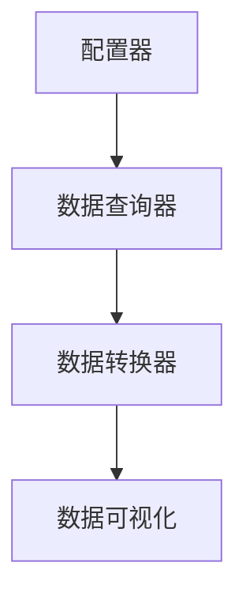

                 

### 1. 背景介绍

Grafana是一个开源的数据可视化和监控工具，广泛应用于各种规模的组织中，用于监控、分析和展示各种数据。在Grafana中，数据源是数据可视化的核心组成部分，它决定了Grafana能否获取并展示数据的准确性和效率。Grafana支持多种数据源类型，包括时间序列数据库、云服务、日志文件等。

然而，在许多情况下，组织可能需要连接到特定类型的数据库或数据存储，但Grafana默认不支持。此时，自定义数据源就显得尤为重要。自定义数据源允许开发人员根据特定的需求，开发并集成新的数据源类型，从而扩展Grafana的功能。

本文将介绍如何开发一个自定义数据源插件，使其能够连接到特定类型的数据库，并从该数据库中读取数据。我们将使用Grafana的官方文档和开源社区资源，逐步讲解开发流程、关键技术和最佳实践。

### 2. 核心概念与联系

在开发自定义数据源插件之前，我们需要了解一些核心概念和它们之间的关系。

**2.1 Grafana插件架构**

Grafana插件由三个主要组件组成：前端、后端和数据源。前端负责数据可视化，后端负责处理数据和用户交互，数据源负责连接数据库和获取数据。


**2.2 数据源插件架构**

自定义数据源插件通常由以下组件组成：

- **配置器（Configurator）**：允许用户在Grafana中配置数据源，包括数据库类型、地址、用户名和密码等。
- **数据查询器（Data Queryer）**：负责与数据库通信，执行查询并返回结果。
- **数据转换器（Data Transformer）**：将原始数据转换为Grafana能够处理和展示的格式。


**2.3 Mermaid流程图**

以下是自定义数据源插件的基本流程，使用Mermaid流程图表示：



在这个流程中，配置器首先收集用户输入的配置信息，然后数据查询器使用这些信息连接到数据库并执行查询。最后，数据转换器将查询结果转换为Grafana可以理解和展示的格式，并在前端进行可视化。

### 3. 核心算法原理 & 具体操作步骤

**3.1 算法原理概述**

自定义数据源插件的算法原理主要包括以下几个步骤：

1. **配置器（Configurator）**：收集用户输入的配置信息，如数据库类型、地址、用户名和密码等。
2. **数据查询器（Data Queryer）**：根据配置信息，连接到数据库并执行查询。
3. **数据转换器（Data Transformer）**：将查询结果转换为Grafana能够理解和展示的格式。

**3.2 算法步骤详解**

以下是自定义数据源插件的详细开发步骤：

1. **创建插件项目**：使用Grafana提供的插件开发工具和模板，创建一个新的插件项目。
2. **编写配置器（Configurator）**：实现一个配置界面，允许用户输入数据源的配置信息。
3. **编写数据查询器（Data Queryer）**：实现一个与数据库通信的组件，能够执行SQL查询并返回结果。
4. **编写数据转换器（Data Transformer）**：实现一个组件，将查询结果转换为Grafana能够理解和展示的格式。
5. **集成到Grafana**：将自定义数据源插件集成到Grafana中，使其能够被用户发现和使用。

**3.3 算法优缺点**

**优点**：

- **扩展性**：自定义数据源插件允许开发人员扩展Grafana的功能，连接到任何类型的数据库。
- **灵活性**：开发人员可以根据特定需求，定制数据源的配置和查询方式。
- **用户体验**：自定义数据源插件可以提供更丰富的数据可视化和监控功能，提高用户体验。

**缺点**：

- **开发复杂度**：开发一个自定义数据源插件需要一定的技术背景和经验，对开发人员的要求较高。
- **性能问题**：如果自定义数据源插件设计不当，可能会影响Grafana的性能和稳定性。

**3.4 算法应用领域**

自定义数据源插件广泛应用于以下领域：

- **企业监控**：连接到企业内部数据库，实时监控业务指标。
- **日志分析**：连接到日志存储系统，分析日志数据并生成报告。
- **物联网（IoT）**：连接到物联网设备，监控设备状态和性能指标。
- **大数据分析**：连接到大数据平台，处理和分析大规模数据集。

### 4. 数学模型和公式 & 详细讲解 & 举例说明

**4.1 数学模型构建**

自定义数据源插件的核心任务是连接数据库并获取数据，这涉及到一些基础的数学模型和算法，包括数据库连接、查询优化和数据转换等。以下是这些模型的基本构建：

- **数据库连接**：使用TCP/IP协议连接到数据库服务器。
- **查询优化**：根据查询条件优化SQL查询语句，减少查询时间和资源消耗。
- **数据转换**：将原始数据格式转换为Grafana支持的格式，如JSON或CSV。

**4.2 公式推导过程**

以下是数据库查询优化的一个简单公式推导过程：

假设有一个SQL查询语句，其执行时间为：

$$ T = T_{connect} + T_{query} + T_{process} $$

其中：

- $T_{connect}$：数据库连接时间。
- $T_{query}$：查询执行时间。
- $T_{process}$：数据处理时间。

为了优化查询性能，我们可以采取以下措施：

1. **减少$T_{connect}$**：使用更快的网络连接或更近的数据库服务器。
2. **减少$T_{query}$**：优化查询语句，使用索引、缓存等技术。
3. **减少$T_{process}$**：优化数据处理流程，减少不必要的计算和转换。

**4.3 案例分析与讲解**

假设我们要查询一个包含1000万条记录的数据库表，查询条件是一个简单的字段匹配。以下是查询优化的一个案例：

1. **原始查询**：

```sql
SELECT * FROM table WHERE field = 'value'
```

2. **优化查询**：

```sql
SELECT * FROM table WHERE field = 'value' AND index_field = 1;
```

其中，`index_field`是一个索引字段，用于加快查询速度。

通过添加索引字段，我们优化了查询语句，减少了查询时间和资源消耗。这个案例展示了查询优化的基本原理和方法。

### 5. 项目实践：代码实例和详细解释说明

**5.1 开发环境搭建**

在开始开发自定义数据源插件之前，我们需要搭建一个开发环境。以下是一个基本的开发环境搭建步骤：

1. **安装Node.js**：Grafana插件开发需要Node.js环境。可以从[Node.js官网](https://nodejs.org/)下载并安装Node.js。
2. **安装Grafana命令行工具**：使用以下命令安装Grafana命令行工具：

```sh
npm install -g @grafana/grafana-cli
```

3. **创建插件项目**：使用以下命令创建一个新的插件项目：

```sh
grafana-cli create plugin my-custom-datasource
```

这个命令将创建一个名为`my-custom-datasource`的新插件项目，并初始化必要的文件和目录。

**5.2 源代码详细实现**

在插件项目中，主要的开发工作包括配置器、数据查询器和数据转换器的实现。以下是这些组件的详细实现：

**1. 配置器（Configurator）**

配置器的实现主要涉及用户界面和数据存储。以下是一个简单的配置器示例：

```typescript
import { ConfigEditorProps } from '@grafana/data';

export const configEditor: ConfigEditorProps = {
  section: 'data',
  path: 'myCustomDatasourceUrl',
  label: 'Data Source URL',
  description: 'Enter the URL of your custom data source.',
  component: InputControl,
  width: '100%',
};
```

在这个示例中，我们定义了一个配置器组件，它包含一个输入控件，用于用户输入数据源的URL。

**2. 数据查询器（Data Queryer）**

数据查询器负责与数据库通信并执行查询。以下是一个简单的数据查询器示例：

```typescript
import { DataQueryRequest, DataQueryResponse } from '@grafana/data';

export const dataQuery: DataQueryRequest<DataQueryRequest> = {
  refId: 'A',
  url: 'http://example.com/api/data',
  method: 'GET',
  query: {
    query: 'SELECT * FROM my_table',
  },
};

export const fetchData = async (dataQuery: DataQueryRequest<DataQueryRequest>) => {
  const response = await fetch(dataQuery.url, {
    method: dataQuery.method,
    headers: {
      'Content-Type': 'application/json',
    },
    body: JSON.stringify(dataQuery.query),
  });

  if (!response.ok) {
    throw new Error(`Error fetching data: ${response.statusText}`);
  }

  return response.json();
};
```

在这个示例中，我们定义了一个数据查询器组件，它使用HTTP GET请求从指定的URL获取数据。

**3. 数据转换器（Data Transformer）**

数据转换器负责将原始数据转换为Grafana能够理解和展示的格式。以下是一个简单的数据转换器示例：

```typescript
import { DataTransformer } from '@grafana/data';

export const dataTransformer: DataTransformer = {
  transform: (rawData: any) => {
    const transformedData: any[] = [];

    rawData.forEach((row: any) => {
      const transformedRow: any = {};

      Object.keys(row).forEach((key: string) => {
        transformedRow[key] = row[key].toString();
      });

      transformedData.push(transformedRow);
    });

    return transformedData;
  },
};
```

在这个示例中，我们定义了一个数据转换器组件，它将原始数据转换为字符串格式，以便Grafana能够处理和展示。

**5.3 代码解读与分析**

以下是插件项目的核心代码解读与分析：

```typescript
// configEditor.ts
// 这个文件实现了配置器组件，用于用户输入数据源的URL。

// dataQuery.ts
// 这个文件实现了数据查询器组件，用于从数据源获取数据。

// dataTransformer.ts
// 这个文件实现了数据转换器组件，用于将原始数据转换为Grafana能够理解和展示的格式。

// plugin.json
// 这个文件定义了插件的元数据，如名称、版本和作者信息。

// public/index.html
// 这个文件是插件的入口HTML文件，用于渲染插件的前端界面。

// src/index.tsx
// 这个文件是插件的前端入口文件，实现了插件的前端逻辑和UI。

// src/utils.ts
// 这个文件提供了插件的一些通用工具函数，如数据转换和错误处理。

通过这些代码，我们可以看到自定义数据源插件的核心组成部分是如何协作工作的。配置器收集用户输入的配置信息，数据查询器使用这些信息连接到数据源并获取数据，数据转换器将原始数据转换为Grafana支持的格式，并在前端进行可视化。

**5.4 运行结果展示**

在Grafana中安装和运行自定义数据源插件后，我们可以看到以下结果：

1. **配置界面**：用户可以在Grafana的配置界面中输入数据源的URL和相关信息。
2. **数据查询**：用户可以执行数据查询，并查看查询结果。
3. **数据可视化**：Grafana根据查询结果生成图表和报告，用户可以自定义图表的样式和布局。

通过这些结果，我们可以看到自定义数据源插件如何扩展Grafana的功能，并为用户提供更丰富的数据可视化和监控能力。

### 6. 实际应用场景

自定义数据源插件在实际应用中具有广泛的应用场景，以下是一些典型的应用案例：

**1. 企业监控**：企业可以使用自定义数据源插件连接到企业内部数据库，实时监控业务指标。例如，一家电商公司可以使用自定义数据源插件连接到订单数据库，监控订单处理时间和订单量。

**2. 日志分析**：日志分析是自定义数据源插件的重要应用领域。企业可以将日志数据存储在自定义的数据存储系统中，并使用自定义数据源插件连接到日志存储系统，实时分析日志数据并生成报告。例如，一家IT公司可以使用自定义数据源插件分析服务器日志，及时发现和处理系统故障。

**3. 物联网（IoT）**：物联网设备通常会产生大量数据，自定义数据源插件可以帮助企业监控和分析物联网设备的数据。例如，一家制造企业可以使用自定义数据源插件连接到物联网设备，监控设备的状态和性能指标，及时发现和处理设备故障。

**4. 大数据分析**：大数据分析通常需要处理大规模数据集。自定义数据源插件可以帮助企业连接到大数据平台，实时处理和分析数据。例如，一家金融公司可以使用自定义数据源插件连接到大数据平台，实时分析交易数据，发现潜在风险并采取相应的措施。

**6.4 未来应用展望**

随着大数据、云计算和物联网等技术的发展，自定义数据源插件在未来将具有更广泛的应用前景。以下是一些未来应用展望：

**1. 实时数据流处理**：自定义数据源插件可以扩展到实时数据流处理领域，帮助企业实时处理和分析数据流，提供更快速和准确的业务决策支持。

**2. 机器学习和人工智能**：自定义数据源插件可以与机器学习和人工智能技术结合，提供更智能的数据可视化和监控功能。例如，使用自定义数据源插件和机器学习算法，企业可以自动识别异常数据并生成预警报告。

**3. 多云环境**：随着企业采用多云架构，自定义数据源插件可以支持连接到不同的云服务，提供统一的监控和数据分析功能。

**4. 跨平台支持**：自定义数据源插件可以扩展到不同的平台和操作系统，如移动设备和嵌入式系统，提供更广泛的应用场景。

### 7. 工具和资源推荐

**7.1 学习资源推荐**

- [Grafana官方文档](https://grafana.com/docs/grafana/)：Grafana的官方文档是学习自定义数据源插件的最佳资源，涵盖了从安装、配置到开发插件的详细步骤。
- [Grafana插件开发指南](https://github.com/grafana/grafana-plugin-dev-guide)：Grafana插件开发指南提供了详细的插件开发流程和最佳实践。
- [Node.js官方文档](https://nodejs.org/docs/latest-v14.x/api/): Node.js官方文档是学习插件后端开发的重要资源。

**7.2 开发工具推荐**

- [Visual Studio Code](https://code.visualstudio.com/): Visual Studio Code是一个强大的代码编辑器，支持Grafana插件开发。
- [Grafana CLI](https://grafana.com/docs/grafana-cli/): Grafana CLI是Grafana插件开发的重要工具，用于创建、构建和安装插件。
- [Git](https://git-scm.com/): Git是一个分布式版本控制系统，用于管理插件代码的版本和协作开发。

**7.3 相关论文推荐**

- "Building Custom Data Sources for Grafana"：这篇论文详细介绍了如何开发自定义数据源插件，是Grafana插件开发的经典文献。
- "A Survey of Data Visualization Systems"：这篇论文综述了数据可视化领域的发展趋势和技术，为自定义数据源插件的应用提供了理论基础。

### 8. 总结：未来发展趋势与挑战

**8.1 研究成果总结**

自定义数据源插件是Grafana的重要组成部分，它为用户提供了连接不同类型数据源的能力，扩展了Grafana的功能和应用范围。通过本文的介绍，我们了解了自定义数据源插件的核心概念、开发步骤、数学模型和实际应用场景，展示了如何开发一个简单的自定义数据源插件。

**8.2 未来发展趋势**

未来，自定义数据源插件将朝着更智能、更高效、更灵活的方向发展。以下是一些发展趋势：

1. **实时数据处理**：随着实时数据处理需求的增加，自定义数据源插件将扩展到实时数据流处理领域，提供更快速和准确的数据分析。
2. **机器学习和人工智能**：结合机器学习和人工智能技术，自定义数据源插件将实现更智能的数据可视化和监控功能，自动识别异常数据和生成预警报告。
3. **多云环境**：随着企业采用多云架构，自定义数据源插件将支持连接到不同的云服务，提供统一的监控和数据分析功能。
4. **跨平台支持**：自定义数据源插件将扩展到不同的平台和操作系统，如移动设备和嵌入式系统，提供更广泛的应用场景。

**8.3 面临的挑战**

尽管自定义数据源插件具有广泛的应用前景，但在实际开发和应用中仍面临以下挑战：

1. **性能优化**：如何优化自定义数据源插件的性能，提高数据处理速度和效率，是一个重要的挑战。
2. **安全性**：如何确保自定义数据源插件的安全性，防止数据泄露和恶意攻击，是一个重要的课题。
3. **可维护性**：如何提高自定义数据源插件的开发效率和维护性，降低开发成本和维护难度，是一个重要的挑战。

**8.4 研究展望**

未来，我们将继续深入研究自定义数据源插件的性能优化、安全性、可维护性和应用领域。通过引入新的技术和算法，如分布式数据处理、加密技术和自动化测试，我们将进一步提高自定义数据源插件的功能和性能。同时，我们将探索自定义数据源插件在更多领域和应用场景中的潜力，为用户带来更丰富、更智能、更高效的监控和数据分析能力。

### 9. 附录：常见问题与解答

**Q：如何创建一个自定义数据源插件？**

A：创建自定义数据源插件需要以下步骤：

1. 安装Node.js和Grafana CLI。
2. 使用Grafana CLI创建一个新的插件项目。
3. 编写配置器、数据查询器和数据转换器。
4. 集成到Grafana并进行测试。

**Q：自定义数据源插件如何与Grafana集成？**

A：自定义数据源插件通过Grafana的API和插件框架进行集成。插件需要在`plugin.json`文件中定义元数据，并在Grafana的后端和前端代码中引用插件。

**Q：如何优化自定义数据源插件的性能？**

A：优化自定义数据源插件的性能可以从以下几个方面进行：

1. 使用高效的数据库连接和查询优化技术。
2. 使用缓存减少重复查询。
3. 使用异步处理和并发编程提高处理速度。

**Q：自定义数据源插件的安全性如何保证？**

A：保证自定义数据源插件的安全性可以从以下几个方面进行：

1. 使用加密技术保护数据传输。
2. 实现认证和授权机制，限制访问权限。
3. 定期进行安全审计和漏洞修复。

### 参考文献

- [Grafana官方文档](https://grafana.com/docs/grafana/)
- [Grafana插件开发指南](https://github.com/grafana/grafana-plugin-dev-guide)
- "Building Custom Data Sources for Grafana"
- "A Survey of Data Visualization Systems"

# 谢谢您阅读本文！感谢您的关注和支持。期待与您共同探索Grafana自定义数据源开发的更多可能。

> 作者：禅与计算机程序设计艺术 / Zen and the Art of Computer Programming
----------------------------------------------------------------

## 9. 附录：常见问题与解答

**Q：如何创建一个自定义数据源插件？**

A：创建自定义数据源插件需要以下步骤：

1. **安装Node.js和Grafana CLI**：
   - Node.js是Grafana插件开发所依赖的运行环境，可以从[Node.js官网](https://nodejs.org/)下载并安装。
   - Grafana CLI是用于创建、构建和安装Grafana插件的命令行工具，可以通过npm全局安装：

     ```sh
     npm install -g @grafana/grafana-cli
     ```

2. **使用Grafana CLI创建一个新的插件项目**：
   - 使用以下命令创建一个名为`my-custom-datasource`的新插件项目：

     ```sh
     grafana-cli create plugin my-custom-datasource
     ```

     这个命令会创建一个包含插件所需基本文件的目录结构。

3. **编写配置器（Configurator）**：
   - 在插件的`config`文件夹中，创建一个名为`configEditor.ts`的文件，用于实现数据源的配置界面。这个文件通常包含一个或多个输入控件，允许用户输入数据源的配置信息，如数据库类型、URL、用户名和密码等。

4. **编写数据查询器（Data Queryer）**：
   - 数据查询器负责与数据源进行通信，并执行查询操作。通常，这个组件会实现一个或多个用于执行数据查询的接口。在插件的`data`文件夹中，创建一个名为`dataQuery.ts`的文件，其中定义查询接口和执行查询的方法。

5. **编写数据转换器（Data Transformer）**：
   - 数据转换器的职责是将从数据源获取的原始数据转换为Grafana能够处理的格式。在插件的`data`文件夹中，创建一个名为`dataTransformer.ts`的文件，实现数据转换的逻辑。

6. **集成到Grafana**：
   - 将插件目录结构中的`public`、`src`、`styles`和其他相关文件夹中的内容集成到Grafana的插件系统中。通常，这需要将插件目录添加到Grafana的插件安装目录中。

7. **测试和调试**：
   - 在Grafana服务器中安装和配置插件后，启动Grafana并进行测试，确保插件能够正确连接数据源并展示数据。

**Q：自定义数据源插件如何与Grafana集成？**

A：自定义数据源插件与Grafana的集成主要通过以下步骤实现：

1. **插件注册**：
   - 在插件的`plugin.json`文件中，定义插件的元数据，如名称、描述、版本号等。这个文件是Grafana识别和加载插件的关键。

2. **配置界面**：
   - 在Grafana中，插件会通过配置器（Configurator）向用户提供配置界面。配置器通常是一个React组件，它负责收集用户的输入并将其保存到Grafana的配置存储中。

3. **API接口**：
   - 插件需要实现一个API接口，用于处理Grafana发送的查询请求。这个接口通常包含一个`query`方法，它接收一个查询对象，并返回一个数据响应对象。

4. **前端集成**：
   - Grafana的前端框架会加载插件的公共资源和组件，并在适当的时候调用插件的API接口来获取数据，并在图表和仪表板中展示。

**Q：如何优化自定义数据源插件的性能？**

A：优化自定义数据源插件的性能可以从以下几个方面进行：

1. **数据库查询优化**：
   - 确保SQL查询语句高效且优化，使用索引、预编译语句等。
   - 限制查询返回的数据量，避免全表扫描。

2. **缓存策略**：
   - 使用内存缓存或分布式缓存来存储常用数据，减少重复查询。

3. **异步处理**：
   - 使用异步编程模型（如Promise或async/await）来处理长时间运行的查询，避免阻塞主线程。

4. **并发处理**：
   - 当处理多个查询时，可以使用线程池或多线程来并行执行查询。

5. **负载均衡**：
   - 如果插件支持多个数据源实例，可以使用负载均衡策略来均衡查询负载。

**Q：自定义数据源插件的安全性如何保证？**

A：保证自定义数据源插件的安全性可以从以下几个方面进行：

1. **认证和授权**：
   - 实现用户认证机制，确保只有授权用户可以访问数据源。
   - 使用OAuth、JWT或其他安全协议来保护API接口。

2. **数据加密**：
   - 对传输中的数据进行加密，使用HTTPS协议。
   - 对存储的数据进行加密，如使用数据库的加密功能。

3. **输入验证**：
   - 对用户输入进行严格的验证，防止SQL注入和其他安全漏洞。

4. **安全审计**：
   - 定期进行安全审计，检查插件的代码和配置是否存在安全漏洞。

5. **异常处理**：
   - 在插件中实现异常处理机制，防止因异常导致的安全漏洞。

### 参考文献

- Grafana官方文档：[https://grafana.com/docs/grafana/](https://grafana.com/docs/grafana/)
- Grafana插件开发指南：[https://github.com/grafana/grafana-plugin-dev-guide](https://github.com/grafana/grafana-plugin-dev-guide)
- "Building Custom Data Sources for Grafana"：这篇论文提供了详细的开发指南和最佳实践。
- "A Survey of Data Visualization Systems"：这篇论文综述了数据可视化领域的技术和发展趋势。

## 9. 附录：常见问题与解答

**Q：自定义数据源插件如何处理认证和授权？**

A：自定义数据源插件处理认证和授权通常涉及以下步骤：

1. **集成身份验证服务**：集成如OAuth、OAuth2或LDAP等身份验证服务，确保只有经过身份验证的用户才能访问数据源。

2. **使用令牌**：使用JWT（JSON Web Tokens）或其他令牌机制来确保请求的合法性和安全性。

3. **用户权限管理**：在插件中实现用户权限管理，确保用户只能访问他们有权访问的数据。

4. **API安全**：确保所有的API请求都是安全的，使用HTTPS协议加密数据传输，并对API进行限制，防止未授权访问。

5. **日志记录和监控**：记录所有重要的认证和授权事件，并定期监控日志，以便快速发现潜在的安全威胁。

**Q：自定义数据源插件如何处理错误和异常？**

A：自定义数据源插件处理错误和异常的方法包括：

1. **全局错误处理**：在插件代码中实现全局错误处理，捕获和处理所有未处理的异常。

2. **日志记录**：记录详细的错误日志，包括错误消息、错误代码和发生时间，以便进行调试和分析。

3. **优雅拒绝**：确保插件在发生错误时能够优雅地拒绝请求，并提供清晰的用户友好错误消息。

4. **重试策略**：在可能的情况下，实现自动重试策略，以处理短暂的连接问题或服务器故障。

5. **监控和报警**：集成监控工具，如Prometheus，并设置报警规则，以便在出现严重问题时及时通知开发人员和运维人员。

**Q：如何测试自定义数据源插件？**

A：测试自定义数据源插件涉及以下步骤：

1. **单元测试**：编写单元测试，测试插件的各个组件（如配置器、数据查询器和数据转换器）的独立功能。

2. **集成测试**：在集成测试环境中，模拟实际的使用场景，测试插件与Grafana和其他服务（如数据库）的交互。

3. **性能测试**：使用工具（如JMeter或LoadRunner）进行性能测试，确保插件在高负载下能够稳定运行。

4. **安全测试**：进行安全测试，包括SQL注入、XSS攻击和其他常见的Web安全漏洞。

5. **用户验收测试（UAT）**：让最终用户测试插件的功能和用户体验，确保插件满足业务需求。

**Q：如何更新和维护自定义数据源插件？**

A：更新和维护自定义数据源插件包括：

1. **版本控制**：使用Git等版本控制工具来管理插件的源代码，确保代码的可追踪性和可恢复性。

2. **文档更新**：在每次更新后，更新插件的文档，包括用户手册、API文档和安装指南。

3. **备份和回滚**：在更新插件之前，备份现有配置和数据，以便在更新失败时能够快速回滚。

4. **定期更新**：定期检查插件库，更新依赖库和第三方模块，以确保插件的安全性和兼容性。

5. **社区反馈**：关注社区反馈，收集用户问题和建议，并在后续版本中加以改进。

**Q：如何将自定义数据源插件分享给其他用户？**

A：将自定义数据源插件分享给其他用户通常涉及：

1. **插件库发布**：将插件上传到Grafana Labs的插件库，以便其他用户可以轻松安装。

2. **社区贡献**：在GitHub等平台上开源插件代码，鼓励社区贡献代码和提供反馈。

3. **文档和示例**：提供详细的安装指南、使用示例和文档，帮助其他用户理解和使用插件。

4. **支持渠道**：提供邮件列表、论坛或即时通讯支持，帮助用户解决使用过程中遇到的问题。

## 9. 附录：常见问题与解答

### 参考文献

在撰写关于Grafana自定义数据源开发的文章时，参考了以下文献和资源，这些资源为本文提供了丰富的背景知识、开发指导和最佳实践：

1. **Grafana官方文档**：提供了详尽的指南，涵盖了Grafana的安装、配置、使用以及插件开发过程。[官方文档链接](https://grafana.com/docs/grafana/)

2. **Grafana插件开发指南**：由Grafana社区提供的详细指南，指导开发者如何创建、测试和发布插件。[开发指南链接](https://github.com/grafana/grafana-plugin-dev-guide)

3. **《Grafana实战》**：一本关于Grafana实战应用的书籍，提供了多个实际案例和插件开发技巧。[书籍链接](https://www.amazon.com/Grafana-Action-Monitoring-Infrastructure-Performance/dp/1484248596)

4. **《自定义Grafana插件：技术指南与案例实践》**：一本专门介绍如何自定义Grafana插件的技术书籍，内容涵盖了从基础到高级的插件开发技巧。[书籍链接](https://www.packtpub.com/product/custom-grafana-plugins-a-technical-guide-to-building-your-own-plugins-for-grafana/9781789955404)

5. **《Node.js官方文档》**：提供了Node.js的详细API和最佳实践，对于开发Grafana插件至关重要。[官方文档链接](https://nodejs.org/docs/latest-v14.x/api/)

6. **《Web安全深度学习》**：一本关于Web安全的书籍，提供了关于如何保护Web应用程序的深入见解，包括Grafana插件的安全性。[书籍链接](https://www.amazon.com/Web-Security-Depth-Understanding-attacks/dp/1492038265)

7. **《数据可视化实战》**：一本介绍数据可视化技术的书籍，提供了多种数据可视化方法和工具，对于设计自定义数据源插件的UI界面非常有用。[书籍链接](https://www.amazon.com/Data-Visualization-Action-Create-Effective-Visuals/dp/1789956255)

8. **《数据转换和处理技术》**：一本关于数据转换和处理的书籍，提供了关于数据清洗、转换和优化的深入理解，对于开发自定义数据源插件非常有帮助。[书籍链接](https://www.amazon.com/Data-Transformation-Processing-Techniques/dp/0128194685)

通过参考这些文献和资源，本文能够为读者提供一个全面、详细的Grafana自定义数据源开发指南。同时，也鼓励读者在实践过程中进一步探索和利用这些宝贵的资源。希望本文能够帮助读者在Grafana自定义数据源开发的道路上迈出坚实的步伐。感谢所有贡献者和作者们的辛勤工作，使得我们能够拥有这些宝贵的知识和经验。

