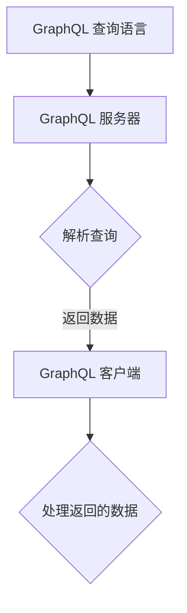

                 

关键词：GraphQL，API查询，灵活，性能优化，前端开发，后端服务，开发者体验

> 摘要：GraphQL 是一种灵活的查询语言，旨在解决传统 RESTful API 的一些问题，如过度或不足获取数据。本文将深入探讨 GraphQL 的核心概念、优势、应用场景，并提供具体的代码实例和实践经验。

## 1. 背景介绍

在 Web 开发领域，API（应用程序编程接口）是使不同系统之间进行通信的重要工具。传统上，开发者使用 RESTful API 来获取数据。然而，随着时间的推移，开发者开始意识到 RESTful API 存在一些局限性。首先，RESTful API 通常使用 HTTP GET 请求来获取资源，这意味着每次请求都可能导致大量不必要的负载。其次，RESTful API 的设计往往过于粗粒化或过于细粒化，这可能导致数据的过度获取或不足获取。

为了解决这些问题，Facebook 在 2015 年推出了 GraphQL，作为一种灵活的查询语言，旨在提供更高效、更灵活的数据获取方式。GraphQL 通过允许客户端精确指定所需的数据，从而减少了不必要的网络请求和数据传输。这种按需获取数据的模式不仅提高了性能，还增强了开发者的控制能力。

## 2. 核心概念与联系

### 2.1 GraphQL 的核心概念

GraphQL 的核心概念包括：

- **查询（Query）**：客户端发送的请求，用于获取数据。
- **类型（Type）**：定义数据结构和操作的蓝图。
- **字段（Field）**：类型中可以获取的数据点。
- **变量（Variable）**：在查询中使用的动态值。

### 2.2 GraphQL 的架构

GraphQL 的架构可以分为三个主要部分：

- **GraphQL 查询语言（GraphQL Language）**：用于编写查询的语法。
- **GraphQL 服务器（GraphQL Server）**：解析查询并返回数据的程序。
- **GraphQL 客户端（GraphQL Client）**：发送查询到服务器并处理返回数据的程序。

### 2.3 Mermaid 流程图

以下是 GraphQL 架构的 Mermaid 流程图：



## 3. 核心算法原理 & 具体操作步骤

### 3.1 算法原理概述

GraphQL 的核心原理是允许客户端精确指定需要的数据，从而避免过度获取或不足获取。这种按需获取数据的方式提高了性能和开发效率。

### 3.2 算法步骤详解

1. **定义类型和字段**：首先，需要在 GraphQL 服务器中定义类型和字段，这些类型和字段构成了 GraphQL 查询的蓝图。
2. **编写查询**：客户端编写 GraphQL 查询，指定需要的数据。
3. **解析查询**：GraphQL 服务器解析查询，根据定义的类型和字段获取数据。
4. **返回数据**：GraphQL 服务器将获取到的数据返回给客户端。
5. **处理返回的数据**：客户端处理返回的数据，通常将其渲染到前端界面。

### 3.3 算法优缺点

**优点**：

- 减少不必要的网络请求和数据传输。
- 提高开发效率和代码可维护性。
- 支持复杂查询，如嵌套查询和数据聚合。

**缺点**：

- 学习曲线较陡峭，对于新手可能有一定难度。
- 需要额外的服务器配置和优化。

### 3.4 算法应用领域

GraphQL 适用于需要灵活查询和高效数据获取的场景，如：

- 前端应用，特别是单页应用（SPA）。
- 移动应用，尤其是需要对数据进行个性化处理的场景。
- 大数据应用，需要按需获取大量数据的场景。

## 4. 数学模型和公式 & 详细讲解 & 举例说明

### 4.1 数学模型构建

在 GraphQL 中，数学模型通常用于：

- 计算数据聚合，如求和、平均数等。
- 数据过滤和排序。

以下是一个简单的数学模型示例：

```latex
\sum_{i=1}^{n} x_i = \sum_{i=1}^{n} (fieldA * fieldB)
```

### 4.2 公式推导过程

在 GraphQL 中，公式推导通常涉及：

- 字段的映射关系。
- 数据的聚合操作。

以下是一个简单的公式推导示例：

```latex
\text{sum} = \sum_{i=1}^{n} \text{fieldA} \times \text{fieldB}
```

### 4.3 案例分析与讲解

假设我们有一个包含学生成绩的数据模型，我们需要计算所有学生的平均成绩。以下是 GraphQL 查询和公式的示例：

```graphql
query {
  students {
    name
    score
  }
}
```

```latex
\text{average\_score} = \frac{\sum_{i=1}^{n} \text{score}}{n}
```

## 5. 项目实践：代码实例和详细解释说明

### 5.1 开发环境搭建

要在本地搭建一个 GraphQL 服务器，您需要安装以下工具：

- Node.js（用于运行 GraphQL 服务器）
- GraphQL JavaScript 库
- Express（用于搭建 HTTP 服务器）

以下是一个简单的安装命令示例：

```bash
npm install express graphql
```

### 5.2 源代码详细实现

以下是一个简单的 GraphQL 服务器示例：

```javascript
const { GraphQLServer } = require('graphql-yoga');
const { makeExecutableSchema } = require('graphql-tools');

// 定义类型
const typeDefs = `
  type Query {
    hello: String
  }
`;

// 定义解析器
const resolvers = {
  Query: {
    hello: () => 'Hello, GraphQL!',
  },
};

// 创建可执行的 Schema
const schema = makeExecutableSchema({ typeDefs, resolvers });

// 创建 GraphQL 服务器
const server = new GraphQLServer({ schema });

// 启动服务器
server.start({
  port: 4000,
});
```

### 5.3 代码解读与分析

在上面的示例中，我们定义了一个简单的 GraphQL 查询和解析器。`typeDefs` 定义了类型和字段，而 `resolvers` 定义了如何处理这些字段。

### 5.4 运行结果展示

在本地运行此代码后，您可以使用 GraphQL 客户端（如 GraphiQL）发送查询到服务器。以下是查询和响应的示例：

```graphql
query {
  hello
}
```

```json
{
  "data": {
    "hello": "Hello, GraphQL!"
  }
}
```

## 6. 实际应用场景

### 6.1 前端开发

GraphQL 在前端开发中尤其有用，因为它允许开发者精确控制需要的数据，从而减少不必要的加载时间和数据传输。

### 6.2 后端服务

GraphQL 后端服务可以通过减少查询次数和数据传输量来提高性能。此外，它还允许开发者轻松实现复杂查询和数据聚合。

### 6.3 移动应用

在移动应用中，性能至关重要。GraphQL 可以帮助开发者按需获取数据，从而提高应用的性能和用户体验。

### 6.4 大数据应用

在处理大量数据时，GraphQL 可以帮助开发者优化查询，从而提高数据处理速度和效率。

## 7. 工具和资源推荐

### 7.1 学习资源推荐

- [GraphQL 官方文档](https://graphql.org/)
- [《GraphQL：从入门到实战》](https://www.amazon.com/GraphQL-From-Concept-Production-Development/dp/1788995683)

### 7.2 开发工具推荐

- [GraphQL Yoga](https://www.graphql-yoga.com/)
- [Apollo Client](https://www.apollographql.com/docs/apollo-client/)

### 7.3 相关论文推荐

- [Facebook’s GraphQL: A Data Query Language for Your API](https://github.com/facebook/patches/raw/master/graphql/notes/13932466-graphql.pdf)

## 8. 总结：未来发展趋势与挑战

### 8.1 研究成果总结

GraphQL 自推出以来，已在多个领域得到了广泛应用。其灵活、高效的特点使其成为前端开发和后端服务的重要工具。

### 8.2 未来发展趋势

- GraphQL 可能会进一步集成到更多的开发框架和工具中。
- 逐步取代传统 RESTful API，成为数据获取的首选方案。

### 8.3 面临的挑战

- 学习曲线较陡峭，对于新手开发者可能存在一定难度。
- 需要额外的服务器配置和优化，以确保性能和安全性。

### 8.4 研究展望

GraphQL 的未来充满了可能性。随着社区的不断发展，我们有望看到更多创新和优化，使其在更多领域得到应用。

## 9. 附录：常见问题与解答

### 9.1 什么是 GraphQL？

GraphQL 是一种灵活的查询语言，允许客户端精确指定需要的数据，从而避免过度或不足获取。

### 9.2 GraphQL 有什么优点？

GraphQL 的优点包括减少不必要的网络请求和数据传输，提高开发效率和代码可维护性，支持复杂查询等。

### 9.3 GraphQL 适用于哪些场景？

GraphQL 适用于前端开发、后端服务、移动应用、大数据处理等需要灵活查询和高效数据获取的场景。

---

作者：禅与计算机程序设计艺术 / Zen and the Art of Computer Programming
```

