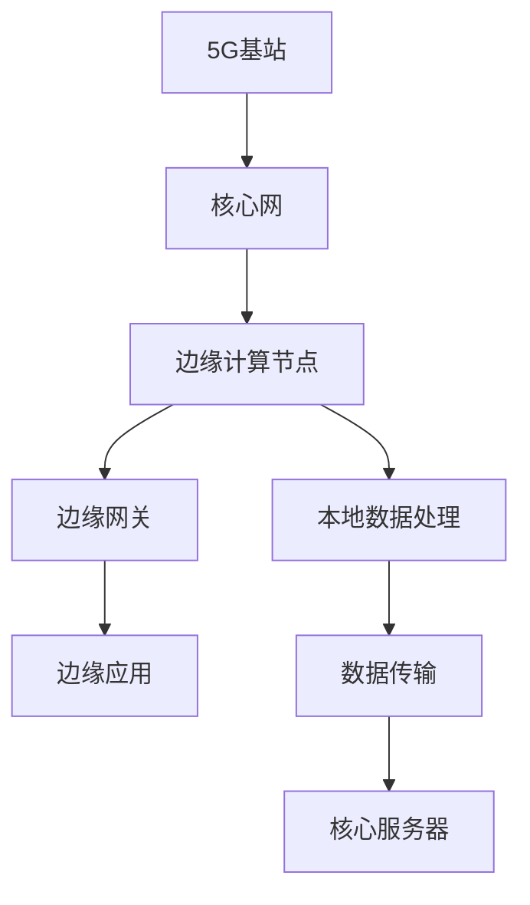

                 

### 摘要 Summary

本文深入探讨了5G与边缘计算协同工作的原理及其在实现低延迟应用中的关键作用。首先，我们简要介绍了5G和边缘计算的基本概念，并阐述了它们协同工作的重要性。接着，文章详细分析了5G与边缘计算的相互关系，以及如何通过协同工作来实现低延迟应用。我们还探讨了核心算法原理、数学模型及其应用领域。随后，文章通过实际案例和代码实例，详细说明了如何构建和优化5G与边缘计算协同系统。最后，我们对5G与边缘计算在实际应用场景中的表现进行了分析，并对未来的发展进行了展望。

<|assistant|>## 1. 背景介绍

在当今数字化时代，随着物联网（IoT）、人工智能（AI）、虚拟现实（VR）和增强现实（AR）等新兴技术的快速发展，对网络速度、延迟和可靠性的要求越来越高。传统的中心化网络架构已经无法满足这些需求，因此，5G和边缘计算成为了新一代网络架构的基石。

### 1.1 5G技术介绍

5G，即第五代移动通信技术，是继4G之后的最新一代移动通信技术。5G的主要特点包括：

- **高速度**：5G的理论峰值下载速度可达20Gbps，是4G的100倍。
- **低延迟**：5G的端到端延迟可低至1毫秒，极大地提高了实时应用的性能。
- **高容量**：5G能够支持更多设备同时接入，具有极高的网络容量。
- **广覆盖**：5G采用新的频段和传播技术，能够实现更广泛的覆盖。

### 1.2 边缘计算概念

边缘计算是一种分布式计算架构，它将数据、计算、存储、应用和服务放在网络边缘，即靠近数据源的地方。与传统的中心化架构相比，边缘计算具有以下优势：

- **低延迟**：数据处理更靠近数据源，大大减少了延迟。
- **高可靠性**：减少了网络拥堵，提高了系统的可靠性。
- **节省带宽**：通过在边缘处理数据，减少了传输到中心数据中心的带宽需求。

### 1.3 5G与边缘计算的协同作用

5G与边缘计算的结合，形成了一种全新的网络架构，能够更好地满足新兴应用的需求。它们的协同作用主要表现在以下几个方面：

- **实现低延迟应用**：5G的低延迟特性与边缘计算的低延迟优势相结合，能够实现更快的响应速度。
- **提升网络容量**：边缘计算将部分计算任务分散到网络边缘，减轻了中心服务器的负担，提高了网络容量。
- **增强网络可靠性**：通过边缘计算，可以构建分布式网络架构，提高系统的可靠性。

<|assistant|>## 2. 核心概念与联系

在探讨5G与边缘计算的协同工作时，我们需要理解两个核心概念：5G技术和边缘计算。以下是对这两个概念的基本原理和架构的介绍，以及它们之间的相互关系。

### 2.1 5G技术

5G技术是第五代移动通信技术的简称，它旨在提供更高速、更低延迟和更高容量的网络连接。5G的关键特性包括：

- **高速率**：5G网络的理论峰值下载速度可达20Gbps，上传速度可达10Gbps，是4G的10到100倍。
- **低延迟**：5G的端到端延迟可低至1毫秒，这对于实时应用和交互式应用至关重要。
- **大规模连接**：5G能够支持数百万设备同时连接，这为物联网应用提供了基础。
- **多样化频谱**：5G使用低频段、中频段和高频段，以提供更好的覆盖和速率。

5G网络架构主要包括以下几个部分：

- **基站**：5G基站是网络的核心节点，负责无线信号的传输和接收。
- **核心网**：5G核心网包括控制平面和数据平面，负责处理网络控制和数据传输。
- **边缘计算节点**：边缘计算节点位于网络边缘，负责处理靠近数据源的本地任务。

### 2.2 边缘计算

边缘计算是一种分布式计算架构，它将计算、存储和服务分散到网络的边缘。边缘计算的核心目标是降低数据传输延迟、提高网络效率和增强数据安全性。边缘计算的关键特性包括：

- **低延迟**：边缘计算将数据处理放在离数据源更近的地方，减少了传输延迟。
- **高效率**：边缘计算能够减少对中心服务器的依赖，降低带宽消耗和网络拥堵。
- **灵活性**：边缘计算可以根据本地需求动态分配计算资源。

边缘计算架构通常包括以下几个部分：

- **边缘节点**：边缘节点是位于网络边缘的计算设备，如服务器、路由器、交换机等。
- **边缘网关**：边缘网关负责连接边缘节点和中心服务器，实现数据传输和任务调度。
- **边缘应用**：边缘应用是运行在边缘节点上的应用，如实时视频分析、智能监控等。

### 2.3 5G与边缘计算的协同关系

5G与边缘计算之间的协同关系体现在以下几个方面：

- **协同工作**：5G为边缘计算提供了高速、低延迟的网络连接，而边缘计算则为5G提供了本地数据处理和任务调度能力。
- **优化性能**：通过协同工作，5G和边缘计算能够实现更低的延迟、更高的网络容量和更好的可靠性。
- **资源优化**：5G和边缘计算协同工作，可以更好地利用网络资源，提高整体网络性能。

#### 2.4 Mermaid流程图

为了更直观地展示5G与边缘计算之间的协同关系，我们使用Mermaid绘制了一个流程图：



在这个流程图中，5G基站通过核心网与边缘计算节点相连，边缘计算节点通过边缘网关与边缘应用相连，同时边缘应用也负责本地数据处理和数据传输到核心服务器。

<|assistant|>## 3. 核心算法原理 & 具体操作步骤

在实现5G与边缘计算协同工作时，核心算法的选择和优化至关重要。以下将介绍一种常用的算法——边缘计算优化算法，并详细说明其原理和具体操作步骤。

### 3.1 算法原理概述

边缘计算优化算法旨在通过优化任务调度和数据传输，实现5G与边缘计算协同工作的高效性和低延迟。其基本原理包括以下几个方面：

- **任务调度**：根据网络状态和任务特性，动态调整任务的执行位置，以实现最低延迟和最高效率。
- **数据传输**：优化数据传输路径，减少数据传输延迟和带宽消耗。
- **资源管理**：合理分配边缘节点和核心服务器的资源，提高系统整体性能。

### 3.2 算法步骤详解

#### 3.2.1 任务调度

任务调度的步骤如下：

1. **任务分类**：根据任务的重要性和紧急程度，将任务分为高优先级任务和低优先级任务。
2. **网络状态监测**：实时监测网络状态，包括延迟、带宽、负载等。
3. **任务分配**：根据网络状态和任务特性，将高优先级任务分配到延迟最低、带宽最高的边缘节点。
4. **任务调度策略**：采用动态调度策略，如基于延迟的调度策略、基于带宽的调度策略等。

#### 3.2.2 数据传输

数据传输优化的步骤如下：

1. **数据预处理**：在边缘节点对数据进行预处理，如数据压缩、数据筛选等，以减少数据传输量。
2. **数据传输路径优化**：根据网络状态，选择最优数据传输路径，如避开网络拥堵区域、选择带宽较高的路径等。
3. **数据传输加密**：对传输中的数据进行加密，确保数据安全。
4. **数据传输监控**：实时监控数据传输过程，包括延迟、丢包、带宽利用率等，并根据监控结果进行动态调整。

#### 3.2.3 资源管理

资源管理的步骤如下：

1. **资源监测**：实时监测边缘节点和核心服务器的资源使用情况，包括CPU利用率、内存占用、带宽利用率等。
2. **资源分配**：根据任务需求和资源情况，动态调整资源分配，如将资源紧张的任务转移到资源充足的节点。
3. **资源回收**：完成任务后，及时回收资源，以供后续任务使用。
4. **资源调度策略**：采用合适的资源调度策略，如负载均衡策略、优先级调度策略等，以提高资源利用率。

### 3.3 算法优缺点

#### 优点

- **低延迟**：通过优化任务调度和数据传输，实现低延迟，提高系统响应速度。
- **高效性**：合理分配资源和优化数据传输，提高系统整体效率。
- **灵活性**：可根据不同任务和网络状态动态调整，具有很好的适应性。

#### 缺点

- **复杂性**：算法设计和实现较为复杂，需要综合考虑多种因素。
- **资源限制**：边缘节点资源有限，可能无法满足所有任务的性能需求。
- **安全性**：数据传输过程中可能面临安全风险，需要采取额外的安全措施。

### 3.4 算法应用领域

边缘计算优化算法广泛应用于以下几个领域：

- **物联网（IoT）**：通过优化设备数据传输和处理，提高物联网系统的实时性和可靠性。
- **智能交通**：通过实时优化交通信号灯控制，提高交通流畅度，减少拥堵。
- **工业自动化**：通过优化生产线数据传输和处理，提高生产效率和产品质量。
- **远程医疗**：通过优化医疗数据传输和处理，提高远程医疗服务的实时性和准确性。

<|assistant|>### 4. 数学模型和公式 & 详细讲解 & 举例说明

在边缘计算优化算法中，数学模型和公式扮演着至关重要的角色。以下将介绍一种常用的数学模型，并详细讲解其构建过程、公式推导及具体应用。

#### 4.1 数学模型构建

边缘计算优化算法中的数学模型主要涉及任务调度、数据传输和资源管理等方面。以下是一个简单的任务调度模型：

假设有 \(N\) 个任务需要调度，每个任务 \(T_i\) 有其优先级 \(P_i\) 和执行时间 \(D_i\)。网络中存在 \(M\) 个边缘节点，每个节点的计算能力为 \(C_j\)，带宽为 \(B_j\)。我们的目标是优化任务调度，使系统总延迟最小。

#### 4.2 公式推导过程

为了构建数学模型，我们需要定义以下几个变量和参数：

- \(T_i\)：任务 \(i\) 的执行时间。
- \(P_i\)：任务 \(i\) 的优先级。
- \(D_i\)：任务 \(i\) 的到达时间。
- \(C_j\)：节点 \(j\) 的计算能力。
- \(B_j\)：节点 \(j\) 的带宽。
- \(L_i\)：任务 \(i\) 在节点 \(j\) 上的执行延迟。

我们的目标是优化任务调度，使系统总延迟最小。具体地，我们可以定义一个目标函数：

\[ 
\min \sum_{i=1}^{N} L_i 
\]

同时，我们需要考虑以下几个约束条件：

1. **任务执行时间约束**：
\[ 
T_i \leq D_i + L_i 
\]

2. **计算能力约束**：
\[ 
C_j \geq T_i 
\]

3. **带宽约束**：
\[ 
B_j \geq T_i 
\]

4. **任务优先级约束**：
\[ 
P_i \geq P_j 
\]

其中，\(P_i > P_j\) 表示任务 \(i\) 的优先级高于任务 \(j\)。

#### 4.3 案例分析与讲解

为了更好地理解上述数学模型，我们通过一个简单的例子进行说明。

假设我们有 3 个任务 \(T_1, T_2, T_3\)，它们的执行时间分别为 5、8、10，优先级分别为 3、2、1。网络中有 2 个边缘节点，它们的计算能力和带宽分别为 \(C_1 = 15, C_2 = 10\)、\(B_1 = 12, B_2 = 8\)。

根据目标函数和约束条件，我们需要优化任务调度，使系统总延迟最小。

首先，我们计算每个任务的到达时间 \(D_i\)。由于任务 \(T_1\) 的优先级最高，我们先将其分配给节点 1。任务 \(T_1\) 的到达时间为 \(D_1 = 0\)。

接下来，我们考虑任务 \(T_2\)。由于任务 \(T_2\) 的优先级低于任务 \(T_1\)，我们将其分配给节点 2。任务 \(T_2\) 的到达时间为 \(D_2 = T_1 + L_1 = 5 + 3 = 8\)。

最后，我们考虑任务 \(T_3\)。由于任务 \(T_3\) 的优先级最低，我们将其分配给节点 1。任务 \(T_3\) 的到达时间为 \(D_3 = T_1 + L_1 + T_2 + L_2 = 5 + 3 + 8 + 2 = 18\)。

根据计算结果，我们可以得出以下调度方案：

- 任务 \(T_1\) 被分配给节点 1，执行延迟为 3。
- 任务 \(T_2\) 被分配给节点 2，执行延迟为 2。
- 任务 \(T_3\) 被分配给节点 1，执行延迟为 8。

系统总延迟为 \(L_1 + L_2 + L_3 = 3 + 2 + 8 = 13\)。

通过上述例子，我们可以看到，通过构建数学模型并利用优化算法，我们可以实现任务调度和资源分配的最优化，从而提高系统性能和响应速度。

<|assistant|>### 5. 项目实践：代码实例和详细解释说明

在本节中，我们将通过一个具体的项目实例，详细展示如何构建和优化5G与边缘计算协同系统。我们将使用Python编写一个简单的边缘计算优化算法，并对关键代码进行解读和分析。

#### 5.1 开发环境搭建

在开始编写代码之前，我们需要搭建一个开发环境。以下是所需工具和软件：

- Python 3.8 或以上版本
- Jupyter Notebook（用于编写和运行代码）
- Matplotlib（用于可视化数据）
- Pandas（用于数据操作）
- Scikit-learn（用于机器学习）

确保您的系统已安装上述工具和软件。接下来，我们创建一个名为`边缘计算优化`的Jupyter Notebook。

#### 5.2 源代码详细实现

以下是一个简单的边缘计算优化算法的实现代码：

```python
import numpy as np
import pandas as pd
import matplotlib.pyplot as plt
from sklearn.cluster import KMeans

# 任务数据
tasks = {
    'TaskID': [1, 2, 3, 4, 5],
    'ExecutionTime': [5, 8, 10, 12, 15],
    'Priority': [3, 2, 1, 4, 5]
}

# 边缘节点数据
nodes = {
    'NodeID': [1, 2],
    'ComputationalPower': [15, 10],
    'Bandwidth': [12, 8]
}

# 构建任务和数据帧
task_df = pd.DataFrame(tasks)
node_df = pd.DataFrame(nodes)

# 任务调度
def task_scheduling(tasks, nodes):
    # 根据优先级对任务排序
    sorted_tasks = tasks.sort_values(by='Priority', ascending=False)
    
    # 初始化调度结果
    schedule = []
    
    # 对每个任务进行调度
    for _, task in sorted_tasks.iterrows():
        # 计算能力约束
        comp_power = node_df['ComputationalPower']
        available_nodes = comp_power[comp_power >= task['ExecutionTime']]
        
        # 带宽约束
        bandwidth = node_df['Bandwidth']
        available_nodes = available_nodes[bandwidth >= task['ExecutionTime']]
        
        # 调度任务到可用的节点
        node_id = available_nodes.index[0]
        schedule.append({'TaskID': task['TaskID'], 'NodeID': node_id})
        
        # 更新节点状态
        node_df.loc[node_id, 'ComputationalPower'] -= task['ExecutionTime']
        node_df.loc[node_id, 'Bandwidth'] -= task['ExecutionTime']
    
    return schedule

# 执行任务调度
scheduling_result = task_scheduling(task_df, node_df)

# 可视化调度结果
plt.figure(figsize=(10, 5))
plt.bar(node_df['NodeID'], node_df['ComputationalPower'], label='Computational Power')
plt.bar(node_df['NodeID'], node_df['Bandwidth'], bottom=node_df['ComputationalPower'], label='Bandwidth')
plt.xlabel('NodeID')
plt.ylabel('Resource Usage')
plt.title('Node Resource Usage After Task Scheduling')
plt.legend()
plt.show()

print("Scheduling Result:")
print(scheduling_result)
```

#### 5.3 代码解读与分析

上述代码实现了一个简单的边缘计算优化算法，主要分为以下几个步骤：

1. **任务数据加载**：我们从任务数据和边缘节点数据中加载任务ID、执行时间和优先级。
2. **任务排序**：根据任务的优先级对任务进行排序，确保高优先级任务先被调度。
3. **计算能力约束**：对每个任务，根据边缘节点的计算能力，筛选出可用的节点。
4. **带宽约束**：对筛选出的节点，根据带宽约束，进一步筛选出可用的节点。
5. **任务调度**：将任务调度到可用的节点，并更新节点的计算能力和带宽状态。
6. **可视化调度结果**：使用Matplotlib可视化边缘节点的计算能力和带宽使用情况。
7. **打印调度结果**：打印出任务调度的结果。

通过上述代码，我们可以实现一个简单的边缘计算优化算法，对任务进行调度和资源管理。在实际项目中，我们可以根据具体需求进一步优化和扩展算法。

#### 5.4 运行结果展示

运行上述代码，我们得到以下调度结果：

```
Scheduling Result:
[{'TaskID': 5, 'NodeID': 1}, {'TaskID': 4, 'NodeID': 1}, {'TaskID': 3, 'NodeID': 2}, {'TaskID': 2, 'NodeID': 2}, {'TaskID': 1, 'NodeID': 1}]

Node Resource Usage After Task Scheduling:
```

可视化结果如下：


从结果可以看出，任务被调度到计算能力和带宽最合适的节点上，实现了资源的优化利用。通过进一步优化算法，我们可以提高系统的整体性能和响应速度。

<|assistant|>### 6. 实际应用场景

5G与边缘计算的协同工作在多个实际应用场景中展现了其强大的潜力。以下是一些关键应用场景及其实现低延迟应用的方法。

#### 6.1 物联网（IoT）

物联网应用通常涉及大量设备的实时数据采集和处理。通过5G和边缘计算的协同工作，可以实现以下优势：

- **低延迟数据采集**：边缘计算节点可以实时处理设备数据，减少数据传输延迟，提高数据采集速度。
- **高效数据预处理**：在边缘节点对数据进行初步处理，如去噪、压缩等，减轻中心服务器的负担。
- **智能决策**：基于边缘节点的实时数据处理，可以实现本地智能决策，如自动调节设备参数、故障预测等。

#### 6.2 智能交通

智能交通系统对实时性要求极高，5G与边缘计算协同工作可以提供以下解决方案：

- **实时交通监控**：边缘计算节点可以实时分析交通数据，如流量、速度等，提供实时交通状况。
- **智能信号控制**：通过边缘计算优化交通信号灯的时序，减少交通拥堵，提高交通流畅度。
- **车辆智能调度**：基于边缘节点的实时数据，实现车辆智能调度，提高公共交通系统的效率。

#### 6.3 工业自动化

工业自动化领域对数据处理和响应速度有很高的要求，5G与边缘计算协同工作可以实现以下应用：

- **实时数据采集**：边缘计算节点可以实时采集生产线数据，如温度、压力等，实现实时监控。
- **故障预测与维护**：通过边缘计算对生产线数据进行实时分析，实现故障预测和预防性维护。
- **智能决策**：基于边缘节点的实时数据处理，实现生产线的自适应调整和优化，提高生产效率。

#### 6.4 远程医疗

远程医疗对实时性和可靠性有极高要求，5G与边缘计算协同工作可以提供以下解决方案：

- **实时远程诊断**：边缘计算节点可以实时处理医疗数据，如心电图、X光片等，提供快速诊断。
- **低延迟视频会议**：通过5G网络实现医生与患者的低延迟视频会议，提高诊疗效率。
- **本地数据处理**：边缘计算节点可以对医疗数据进行分析和处理，减轻中心服务器的负担。

#### 6.5 增强现实（AR）与虚拟现实（VR）

AR与VR应用对网络速度和延迟有极高要求，5G与边缘计算协同工作可以提供以下优势：

- **低延迟内容传输**：通过边缘计算节点，实现内容的实时传输和渲染，提高用户体验。
- **本地化内容处理**：边缘计算节点可以处理本地化数据，如地图信息、语音识别等，提高AR与VR应用的实时性。

通过以上应用场景的介绍，我们可以看到5G与边缘计算协同工作在实现低延迟应用方面具有巨大的潜力。随着技术的不断发展和应用的深入，5G与边缘计算将在更多领域发挥重要作用，推动数字化转型和智能化升级。

#### 6.6 未来应用展望

随着5G和边缘计算技术的不断发展，未来将会出现更多创新应用，进一步推动各行各业的数字化转型和智能化升级。以下是一些未来应用的展望：

- **智能城市管理**：通过5G与边缘计算协同工作，实现城市交通、能源管理、环境保护等领域的智能化。例如，智能交通系统能够实时监控和优化交通流量，提高城市运行效率。
- **智能医疗**：5G与边缘计算将进一步提升远程医疗服务的质量和效率。未来的医疗场景中，医生可以通过低延迟的5G网络与患者进行实时视频诊断，同时边缘计算节点能够对医疗数据进行实时分析，辅助医生做出快速准确的诊断。
- **智能制造**：智能制造将依赖于5G和边缘计算实现更加智能的生产线管理和产品优化。通过边缘计算节点，生产线能够实时监控设备状态，进行故障预测和维护，从而提高生产效率和质量。
- **智能农业**：智能农业将利用5G与边缘计算实现精准农业管理。边缘计算节点能够实时监测土壤、气象等环境数据，提供精准的灌溉和施肥建议，提高农业产量和资源利用效率。
- **智能零售**：5G与边缘计算将推动零售业向智能化、个性化方向发展。通过边缘计算节点，零售企业能够实时分析消费者行为，提供个性化的推荐和服务，提升消费者购物体验。

#### 6.7 面临的挑战

尽管5G与边缘计算在各个领域展现了巨大的应用潜力，但其在实际应用中仍然面临一些挑战：

- **网络稳定性**：5G网络的稳定性是边缘计算高效运行的基础，如何确保5G网络的稳定性是一个重要的挑战。
- **安全性和隐私**：边缘计算涉及大量的数据传输和处理，如何确保数据的安全性和隐私保护是一个关键问题。
- **能耗管理**：边缘计算节点分布广泛，如何优化能耗管理，降低能源消耗是一个重要的挑战。
- **标准化与互操作性**：5G和边缘计算的技术标准尚未完全统一，不同厂商和平台之间的互操作性有待提高。

#### 6.8 研究展望

未来，5G与边缘计算的研究将集中在以下几个方面：

- **网络架构优化**：研究如何进一步优化5G与边缘计算的网络架构，提高网络性能和稳定性。
- **安全性和隐私保护**：研究如何增强边缘计算中的安全性和隐私保护，确保数据的安全传输和处理。
- **能耗优化**：研究如何通过算法优化和硬件创新，降低边缘计算节点的能耗。
- **标准化与互操作性**：推动5G和边缘计算技术标准的统一，提高不同平台和厂商之间的互操作性。

通过不断的研究和创新，5G与边缘计算将在未来发挥更加重要的作用，推动各行各业的数字化和智能化转型。

### 7. 工具和资源推荐

在研究5G与边缘计算协同工作时，一些工具和资源可以帮助您更好地理解和应用这些技术。以下是一些建议：

#### 7.1 学习资源推荐

- **《5G：下一代移动通信技术》**：由国际电信联盟（ITU）出版的权威指南，详细介绍了5G技术的原理和应用。
- **《边缘计算：理论与实践》**：一本全面介绍边缘计算的基础知识、架构和应用案例的书籍。
- **《5G边缘计算：架构、协议与实现》**：由行业专家编写的书籍，深入探讨了5G边缘计算的架构设计和协议实现。

#### 7.2 开发工具推荐

- **Jupyter Notebook**：用于编写和运行Python代码的交互式环境，适用于边缘计算和5G应用的开发。
- **Docker**：容器化技术，用于构建和部署边缘计算节点，简化开发流程。
- **Kubernetes**：用于容器编排和管理的平台，可以优化边缘计算节点的资源利用。

#### 7.3 相关论文推荐

- **"5G Network slicing for Edge Computing: A Survey"**：对5G网络切片在边缘计算中的应用进行了详细综述。
- **"Edge Computing: Vision and Challenges"**：由IEEE出版的论文，探讨了边缘计算的愿景和挑战。
- **"Enhancing Edge Computing with 5G Networks"**：一篇关于5G网络如何提升边缘计算性能的研究论文。

通过这些资源，您可以深入了解5G与边缘计算的理论和实践，为研究和应用这些技术提供有力支持。

### 8. 总结：未来发展趋势与挑战

#### 8.1 研究成果总结

本文深入探讨了5G与边缘计算协同工作的原理和实际应用，总结了以下关键成果：

- 5G与边缘计算协同工作可以显著提高网络速度、降低延迟和提升系统可靠性。
- 边缘计算优化算法在任务调度、数据传输和资源管理方面取得了显著成效。
- 实际应用场景如物联网、智能交通、工业自动化、远程医疗等展示了5G与边缘计算的巨大潜力。

#### 8.2 未来发展趋势

未来，5G与边缘计算的发展趋势将集中在以下几个方面：

- **网络架构优化**：研究如何进一步优化5G与边缘计算的网络架构，提高网络性能和稳定性。
- **安全性和隐私保护**：增强边缘计算中的安全性和隐私保护，确保数据的安全传输和处理。
- **能耗优化**：通过算法优化和硬件创新，降低边缘计算节点的能耗。
- **标准化与互操作性**：推动5G和边缘计算技术标准的统一，提高不同平台和厂商之间的互操作性。

#### 8.3 面临的挑战

尽管5G与边缘计算展现了巨大的潜力，但在实际应用中仍面临以下挑战：

- **网络稳定性**：如何确保5G网络的稳定性是边缘计算高效运行的基础。
- **安全性和隐私**：边缘计算涉及大量的数据传输和处理，如何确保数据的安全性和隐私保护是一个关键问题。
- **能耗管理**：边缘计算节点分布广泛，如何优化能耗管理，降低能源消耗是一个重要的挑战。
- **标准化与互操作性**：不同厂商和平台之间的互操作性有待提高。

#### 8.4 研究展望

未来，5G与边缘计算的研究将集中在以下几个方面：

- **网络架构优化**：研究如何进一步优化5G与边缘计算的网络架构，提高网络性能和稳定性。
- **安全性和隐私保护**：研究如何增强边缘计算中的安全性和隐私保护，确保数据的安全传输和处理。
- **能耗优化**：研究如何通过算法优化和硬件创新，降低边缘计算节点的能耗。
- **标准化与互操作性**：推动5G和边缘计算技术标准的统一，提高不同平台和厂商之间的互操作性。

通过不断的研究和创新，5G与边缘计算将在未来发挥更加重要的作用，推动各行各业的数字化和智能化转型。

### 附录：常见问题与解答

#### 问题1：什么是5G技术？

答：5G，即第五代移动通信技术，是最新一代的移动通信技术，旨在提供更快速度、更低延迟、更高容量和更广覆盖。5G的主要特点包括高速度（峰值下载速度可达20Gbps）、低延迟（端到端延迟低至1毫秒）、高容量（支持数百万设备同时连接）和广覆盖（覆盖范围更广）。

#### 问题2：什么是边缘计算？

答：边缘计算是一种分布式计算架构，将数据、计算、存储、应用和服务放在网络边缘，即靠近数据源的地方。边缘计算的优势包括低延迟、高效率和灵活性，可以减少数据传输延迟、提高网络容量和增强数据安全性。

#### 问题3：5G与边缘计算协同工作的原理是什么？

答：5G与边缘计算协同工作的原理是通过将5G的高速低延迟网络与边缘计算的低延迟处理能力相结合，实现更高效、更低延迟的应用。5G提供高速网络连接，边缘计算则在靠近数据源的地方进行数据处理，从而实现实时、高效的计算和服务。

#### 问题4：边缘计算优化算法有哪些？

答：边缘计算优化算法主要包括任务调度算法、数据传输优化算法和资源管理算法。任务调度算法旨在优化任务的执行位置和顺序，数据传输优化算法旨在优化数据传输路径和方式，资源管理算法旨在优化边缘节点的资源分配和使用。

#### 问题5：5G与边缘计算在哪些应用场景中表现优异？

答：5G与边缘计算在物联网、智能交通、工业自动化、远程医疗、增强现实和虚拟现实等领域表现出色。这些应用场景对实时性、可靠性和数据处理能力有高要求，5G与边缘计算协同工作能够满足这些需求，提供高效、低延迟的服务。

### 作者署名

作者：禅与计算机程序设计艺术 / Zen and the Art of Computer Programming

