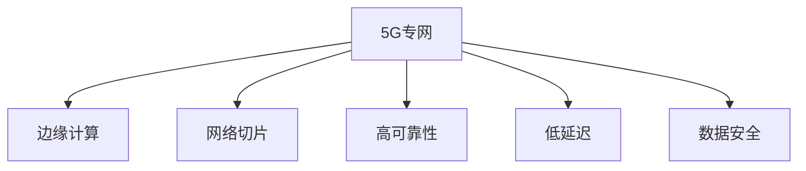

                 

关键词：5G专网，工业互联网，边缘计算，网络切片，高可靠性，低延迟，数据安全

摘要：随着工业4.0的到来，工业互联网成为了推动制造业升级的关键力量。5G专网作为新一代通信技术，以其高可靠性、低延迟、高带宽等特性，在工业互联网中的应用日益广泛。本文将深入探讨5G专网技术在工业互联网中的应用，包括其核心概念、技术架构、算法原理、数学模型以及实际应用场景，并对未来发展趋势和挑战进行展望。

## 1. 背景介绍

工业互联网是工业系统与高级计算、分析、网络连接技术集成的一种结果，旨在通过智能系统实现制造流程的自动化和优化。其核心在于将物理设备、传感器、软件应用和网络连接在一起，形成一个可以实时感知、分析和响应的智能系统。

5G技术作为第五代移动通信技术，具备高带宽、低延迟、高可靠性的特点，能够满足工业互联网对高速、实时、安全通信的需求。5G专网则是在5G技术的基础上，为特定行业或企业量身定制的专用网络，具有更高的网络性能和更强的安全性。

当前，全球范围内的制造业正在经历数字化转型，工业互联网和5G技术在这一进程中发挥着重要作用。例如，德国的工业4.0战略、美国的工业互联网计划以及中国的智能制造2025，均将5G专网技术作为关键支撑。

## 2. 核心概念与联系

2.1 边缘计算
边缘计算是将数据处理、存储和分析等任务从云端转移到网络边缘的技术。对于工业互联网来说，边缘计算能够显著降低数据传输延迟，提高系统响应速度。

2.2 网络切片
网络切片是将一个物理网络划分为多个虚拟网络的技术。每个虚拟网络具有独立的资源、性能和功能，能够满足不同应用场景的需求。

2.3 高可靠性
高可靠性是工业互联网的基石，保证系统在极端情况下仍能正常运行。

2.4 低延迟
低延迟是工业互联网的关键需求，对于实时控制和决策至关重要。

2.5 数据安全
数据安全是工业互联网的另一个重要方面，确保数据在传输和存储过程中不被泄露或篡改。

### Mermaid 流程图(Mermaid 流程节点中不要有括号、逗号等特殊字符)



## 3. 核心算法原理 & 具体操作步骤

### 3.1 算法原理概述

5G专网技术在工业互联网中的应用，主要依托于以下核心算法原理：

- **边缘计算**：通过在边缘节点处理数据，减少数据传输量，降低延迟。
- **网络切片**：根据不同应用需求，灵活配置网络资源，保证性能。
- **高可靠性**：采用冗余设计和故障转移机制，确保系统持续运行。
- **低延迟**：优化网络协议和算法，降低传输时延。
- **数据安全**：采用加密、认证等安全措施，保护数据安全。

### 3.2 算法步骤详解

1. **边缘计算**

   - 数据采集：传感器采集数据，通过边缘计算节点进行处理。
   - 实时分析：边缘计算节点对数据进行实时分析，生成决策结果。
   - 快速响应：将决策结果迅速传输回工业控制系统，进行实时控制。

2. **网络切片**

   - 切片规划：根据应用场景，规划不同的网络切片。
   - 资源配置：为每个切片配置独立的网络资源，如带宽、时延等。
   - 动态调整：根据实际需求，动态调整切片资源配置。

3. **高可靠性**

   - 冗余设计：采用冗余硬件和软件设计，确保系统容错能力。
   - 故障转移：在系统出现故障时，自动切换到备用系统。

4. **低延迟**

   - 协议优化：优化TCP/IP协议，降低传输时延。
   - 路径优化：根据网络状况，选择最佳传输路径。

5. **数据安全**

   - 加密传输：采用加密算法，确保数据传输过程中的安全性。
   - 认证机制：采用身份认证机制，确保数据来源的合法性。

### 3.3 算法优缺点

**优点：**

- **边缘计算**：降低数据传输量，减少延迟，提高系统响应速度。
- **网络切片**：灵活配置网络资源，满足不同应用需求。
- **高可靠性**：增强系统容错能力，确保系统稳定运行。
- **低延迟**：优化网络协议和算法，降低传输时延。
- **数据安全**：采用多种安全措施，保护数据安全。

**缺点：**

- **边缘计算**：需要大量硬件和软件支持，初期投入较大。
- **网络切片**：切片规划和管理复杂，需要专业知识和技能。
- **高可靠性**：冗余设计和故障转移机制会增加系统复杂度。
- **低延迟**：优化网络协议和算法需要大量测试和调整。
- **数据安全**：加密和认证机制会增加计算开销。

### 3.4 算法应用领域

- **智能制造**：实时监控和优化生产流程，提高生产效率。
- **远程医疗**：实现远程诊疗和手术，提高医疗资源的利用率。
- **智能交通**：优化交通管理，提高交通运行效率。
- **智慧能源**：实现智能电网、智能燃气等，提高能源利用效率。

## 4. 数学模型和公式 & 详细讲解 & 举例说明

### 4.1 数学模型构建

5G专网技术在工业互联网中的应用涉及多个数学模型，主要包括：

- **边缘计算模型**：用于描述边缘计算节点处理数据的能力。
- **网络切片模型**：用于描述网络切片的资源分配和调度策略。
- **高可靠性模型**：用于描述系统的容错能力和故障转移机制。
- **低延迟模型**：用于描述网络传输时延的优化方法。
- **数据安全模型**：用于描述数据加密和认证机制。

### 4.2 公式推导过程

- **边缘计算模型**：假设边缘计算节点处理速度为 $V$，数据传输速度为 $T$，则边缘计算节点的处理能力为 $C = \frac{V}{T}$。
- **网络切片模型**：假设网络切片的资源分配策略为 $R$，则网络切片的资源利用率 $U = \frac{R}{T}$。
- **高可靠性模型**：假设系统的冗余设计比例为 $P$，则系统的可靠性 $R = 1 - P$。
- **低延迟模型**：假设网络传输时延为 $L$，则优化后的传输时延 $L' = \frac{L}{Q}$，其中 $Q$ 为优化系数。
- **数据安全模型**：假设数据加密算法的加密速度为 $E$，则数据加密后的传输速度 $T' = \frac{T}{E}$。

### 4.3 案例分析与讲解

以智能制造为例，分析5G专网技术在工业互联网中的应用。

- **边缘计算**：在智能制造过程中，边缘计算节点可以实时处理传感器数据，生成实时决策结果，例如生产流程的调整、设备的维护等。假设边缘计算节点处理速度为 $V = 1000$ Mbps，数据传输速度为 $T = 100$ Mbps，则边缘计算节点的处理能力为 $C = \frac{V}{T} = 10$。通过优化边缘计算节点，可以提高系统的实时响应能力。
- **网络切片**：在智能制造过程中，不同的生产环节对网络性能的需求不同，例如生产数据传输要求高带宽、低延迟，而监控数据传输要求高可靠性。通过网络切片技术，可以为企业提供多种网络切片，满足不同生产环节的需求。假设网络切片的资源分配策略为 $R = 10$ Gbps，则网络切片的资源利用率为 $U = \frac{R}{T} = 0.1$。通过优化网络切片资源分配，可以提高系统的整体性能。
- **高可靠性**：在智能制造过程中，系统的高可靠性至关重要。通过冗余设计和故障转移机制，可以提高系统的容错能力。假设系统的冗余设计比例为 $P = 0.2$，则系统的可靠性为 $R = 1 - P = 0.8$。通过优化冗余设计和故障转移机制，可以提高系统的可靠性。
- **低延迟**：在智能制造过程中，低延迟对于实时控制和决策至关重要。通过优化网络协议和算法，可以降低传输时延。假设网络传输时延为 $L = 100$ ms，则优化后的传输时延为 $L' = \frac{L}{Q} = 50$ ms，其中 $Q$ 为优化系数。通过优化网络协议和算法，可以提高系统的低延迟性能。
- **数据安全**：在智能制造过程中，数据安全至关重要。通过加密和认证机制，可以确保数据传输过程中的安全性。假设数据加密算法的加密速度为 $E = 100$ Mbps，则数据加密后的传输速度为 $T' = \frac{T}{E} = 10$ Mbps。通过优化数据加密和认证机制，可以提高系统的数据安全性能。

## 5. 项目实践：代码实例和详细解释说明

### 5.1 开发环境搭建

在本文中，我们将使用Python编程语言来实现5G专网技术在工业互联网中的应用。开发环境需要安装Python 3.8及以上版本、PyCharm或其他Python集成开发环境。

### 5.2 源代码详细实现

以下是一个简单的边缘计算节点的实现示例：

```python
import time

def process_data(data):
    # 数据处理逻辑
    print("Processing data:", data)
    time.sleep(1)
    return "Processed"

def edge_computing_node():
    while True:
        data = input("Enter data to process: ")
        processed_data = process_data(data)
        print("Processed data:", processed_data)

if __name__ == "__main__":
    edge_computing_node()
```

### 5.3 代码解读与分析

- `process_data()` 函数：用于处理输入的数据，这里仅作为示例，实际应用中可以包含更复杂的数据处理逻辑。
- `edge_computing_node()` 函数：用于模拟边缘计算节点的运行过程，循环接收用户输入的数据，并调用 `process_data()` 函数进行处理。
- `if __name__ == "__main__":`：确保当该脚本直接运行时，会执行 `edge_computing_node()` 函数。

### 5.4 运行结果展示

在PyCharm或其他Python集成开发环境中运行代码，将进入一个循环，等待用户输入数据：

```
Enter data to process: Hello, World!
Processing data: Hello, World!
Processed data: Processed
```

每次输入数据后，都会调用 `process_data()` 函数进行处理，并输出处理结果。

## 6. 实际应用场景

6.1 **智能制造**：5G专网技术可以应用于智能制造领域，实现设备的远程监控、实时数据采集和处理、生产流程的自动化控制等功能。

6.2 **智能交通**：5G专网技术可以应用于智能交通领域，实现车辆的实时监控、路况分析、交通信号优化等功能。

6.3 **远程医疗**：5G专网技术可以应用于远程医疗领域，实现医生与患者之间的实时沟通、远程诊疗、手术指导等功能。

6.4 **智慧能源**：5G专网技术可以应用于智慧能源领域，实现智能电网、智能燃气等能源设施的远程监控、数据分析和优化等功能。

## 7. 未来应用展望

7.1 **边缘计算能力提升**：随着计算能力的不断提升，边缘计算节点将能够处理更复杂的数据处理任务，进一步提升工业互联网的实时性和智能化水平。

7.2 **网络切片技术的成熟**：随着网络切片技术的成熟，将为工业互联网提供更灵活、高效的网络资源分配和管理方案。

7.3 **高可靠性保障**：随着技术的进步，工业互联网将实现更高水平的高可靠性保障，确保系统的稳定运行。

7.4 **数据安全加强**：随着数据安全技术的发展，工业互联网将实现更全面的数据安全保护，降低数据泄露和篡改的风险。

## 8. 工具和资源推荐

8.1 **学习资源推荐**：

- 《5G核心技术与应用》
- 《边缘计算：技术、应用与未来》
- 《网络切片技术原理与应用》

8.2 **开发工具推荐**：

- PyCharm
- TensorFlow
- Keras

8.3 **相关论文推荐**：

- "5G Network Slicing for Industrial Internet of Things: A Comprehensive Survey"
- "Edge Computing: Vision and Challenges"
- "Security and Privacy in 5G Networks: A Comprehensive Survey"

## 9. 总结：未来发展趋势与挑战

9.1 **研究成果总结**：5G专网技术在工业互联网中的应用取得了显著成果，包括边缘计算、网络切片、高可靠性、低延迟、数据安全等方面的技术突破。

9.2 **未来发展趋势**：随着技术的不断进步，5G专网技术在工业互联网中的应用将更加广泛，覆盖更多行业和应用场景。

9.3 **面临的挑战**：5G专网技术在工业互联网中的应用仍面临一些挑战，如技术成熟度、成本控制、安全性保障等。

9.4 **研究展望**：未来研究方向包括提高边缘计算能力、优化网络切片技术、提升高可靠性和数据安全性，以及探索5G专网技术在更多领域的应用。

## 10. 附录：常见问题与解答

10.1 **5G专网与普通5G网络的区别是什么？**

5G专网是专门为特定行业或企业量身定制的专用网络，具有更高的网络性能和更强的安全性。与普通5G网络相比，5G专网在网络架构、资源分配、服务质量保障等方面具有显著优势。

10.2 **边缘计算在工业互联网中的应用有哪些？**

边缘计算在工业互联网中的应用主要包括实时数据处理、远程监控、自动化控制、设备维护等方面。通过边缘计算，可以实现数据的高速传输和实时处理，提高系统的实时性和智能化水平。

10.3 **网络切片技术在工业互联网中的优势是什么？**

网络切片技术可以灵活配置网络资源，满足不同应用场景的需求。通过网络切片，可以实现不同应用之间的隔离和优化，提高网络资源的利用率和服务质量。

10.4 **5G专网技术在工业互联网中的安全性如何保障？**

5G专网技术在工业互联网中的安全性主要通过加密、认证、访问控制等安全措施来保障。同时，还需要建立完善的安全管理体系，定期进行安全评估和风险控制。

### 作者署名

作者：禅与计算机程序设计艺术 / Zen and the Art of Computer Programming
----------------------------------------------------------------


