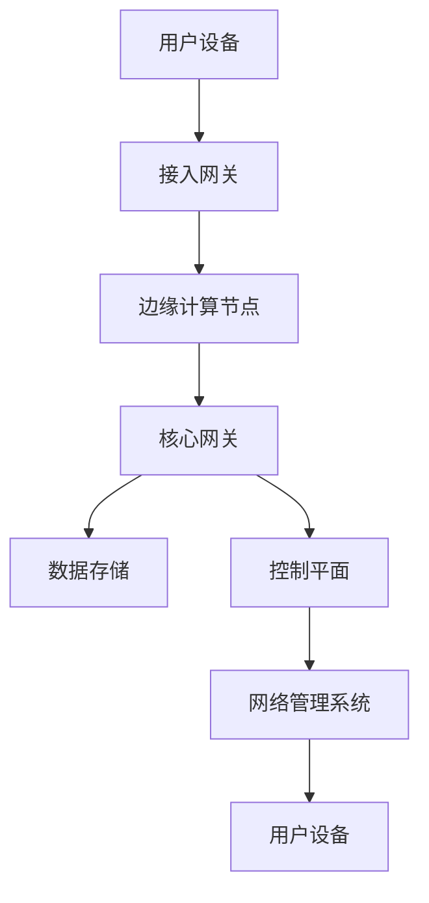

                 

### 背景介绍

随着信息技术的迅猛发展，5G技术作为下一代通信技术的重要载体，已经成为全球各国争相布局的战略高地。5G不仅是一个技术升级，更是驱动未来数字经济和社会发展的重要引擎。本文旨在探讨5G技术的管理实践，分析其核心概念、算法原理、数学模型，并结合实际项目实践，探讨5G技术在各个领域的应用前景。

5G技术的出现，不仅是为了满足日益增长的移动数据流量需求，更是为了推动物联网、智慧城市、远程医疗等领域的创新应用。相比于4G，5G在传输速度、延迟、连接数、能耗等方面都有了显著提升。例如，5G的峰值速度可以达到10Gbps，是4G的百倍以上；延迟降至毫秒级，使得实时控制成为可能；每平方米可支持100万个连接，为物联网提供了广阔的应用空间。

然而，5G技术的引入也带来了新的挑战，如网络架构的复杂性、安全性问题、网络能耗等。因此，如何有效管理5G网络，优化资源配置，提高网络性能，成为当前研究的热点问题。

### 文章关键词

5G技术，下一代通信，网络管理，算法原理，数学模型，物联网，智慧城市，远程医疗。

### 文章摘要

本文首先介绍了5G技术的基本背景和重要性，接着分析了5G技术的核心概念和架构，详细阐述了5G核心算法原理及具体操作步骤，并探讨了5G技术的数学模型和公式。随后，通过实际项目实践，展示了5G技术的应用场景和未来展望。最后，对5G技术管理中的工具和资源进行了推荐，并总结了未来发展趋势和面临的挑战。

## 1. 核心概念与联系

5G技术的核心概念包括超高速率、超低延迟、超大连接数和高度智能化。这些概念共同构成了5G技术的核心理念，使得5G不仅仅是一个速度更快的网络，而是一个全新的通信生态体系。

### 1.1 超高速率

5G网络的设计目标是实现千兆级别的峰值速率，这是4G网络的十倍以上。超高速率使得用户可以更快速地下载和上传数据，极大提升了互联网应用的用户体验。例如，高清视频流媒体传输、虚拟现实（VR）和增强现实（AR）应用等，都需要依赖5G的超高速率。

### 1.2 超低延迟

延迟是通信网络中一个重要的性能指标，指的是数据从发送端到接收端所需的时间。5G技术的超低延迟特性，可以将网络延迟降低至毫秒级别，这对于实时应用场景尤为重要。例如，远程手术、自动驾驶车辆、工业自动化等，都要求网络具有极低的延迟，以保证实时响应。

### 1.3 超大连接数

5G网络支持每平方米100万个连接，这意味着它可以同时支持大量设备的连接，为物联网（IoT）的发展提供了坚实的基础。例如，智能家庭设备、工业传感器、医疗设备等，都可以通过5G网络实现互联互通，构建智能化的应用场景。

### 1.4 高度智能化

5G网络不仅仅是硬件的提升，更是网络架构和服务的智能化升级。通过引入人工智能（AI）和大数据分析，5G网络可以实现更加智能的网络管理和优化。例如，基于AI的无线资源管理，可以自适应地调整网络资源，以优化网络性能。

### 1.5 5G核心架构

5G的核心架构主要包括用户面（User Plane）和控制面（Control Plane）两部分。用户面负责数据传输，控制面负责网络控制和调度。5G还引入了边缘计算（Edge Computing）和网络切片（Network Slicing）技术，进一步提升了网络的灵活性和可扩展性。

### 1.6 Mermaid流程图

以下是一个简化的5G核心架构的Mermaid流程图：



在这个流程图中，用户设备通过接入网关连接到边缘计算节点，边缘计算节点与核心网关连接，核心网关再连接到数据存储和控制平面。网络管理系统负责整个5G网络的监控和管理。

### 1.7 5G关键概念的联系

5G的关键概念之间存在着紧密的联系。超高速率和超低延迟共同提升了用户的体验，超大连接数和高度智能化则使得5G可以在更多领域得到应用。例如，智能交通系统需要超高速率和超低延迟，以实现实时交通监控和调度；物联网则需要超大连接数和高度智能化，以实现设备的互联互通和智能控制。

通过上述核心概念和架构的介绍，我们可以看到5G技术的独特优势和广阔应用前景。接下来，我们将深入探讨5G技术的核心算法原理和具体操作步骤。

## 2. 核心算法原理 & 具体操作步骤

### 2.1 算法原理概述

5G技术的核心算法主要包括无线资源管理、网络优化、安全性管理等多个方面。这些算法共同作用，确保了5G网络的高性能和可靠性。

#### 2.1.1 无线资源管理

无线资源管理是5G网络中的一个关键算法，它负责分配和管理无线频谱资源，以最大化网络性能。无线资源管理主要包括以下几个步骤：

1. **频谱感知**：通过频谱感知技术，检测网络中的可用频谱资源。
2. **资源分配**：根据网络负载和用户需求，将频谱资源分配给不同的用户和设备。
3. **负载均衡**：通过动态调整资源分配，实现网络负载的均衡，避免网络拥塞。
4. **频谱重配置**：根据网络情况和用户需求，动态调整频谱资源的配置，以优化网络性能。

#### 2.1.2 网络优化

网络优化算法旨在提升5G网络的整体性能。主要包括以下几个方面：

1. **路径优化**：通过路径优化算法，选择最优的传输路径，以降低传输延迟和能耗。
2. **缓存优化**：在网络边缘部署缓存，减少数据传输的距离和时间，提高网络响应速度。
3. **网络重构**：在网络故障或性能下降时，自动重构网络结构，以确保网络的稳定运行。

#### 2.1.3 安全性管理

安全性管理是5G网络中不可或缺的一环，它包括以下几个方面：

1. **加密通信**：通过加密技术，保护数据在传输过程中的安全性。
2. **认证和授权**：确保只有合法的用户和设备才能接入网络，防止未授权访问。
3. **威胁检测与防御**：通过实时监控和分析网络流量，检测和防御潜在的安全威胁。

### 2.2 算法步骤详解

下面我们详细讲解无线资源管理算法的具体步骤：

#### 2.2.1 频谱感知

频谱感知是无线资源管理的第一步，其核心任务是检测网络中的可用频谱资源。具体步骤如下：

1. **频谱扫描**：用户设备通过扫描周围的频谱，收集频谱信息。
2. **频谱分析**：对扫描到的频谱信息进行分析，识别出可用频谱资源。
3. **频谱报告**：将分析结果报告给网络管理系统，以便进行后续的资源分配。

#### 2.2.2 资源分配

资源分配是根据网络负载和用户需求，将频谱资源分配给不同的用户和设备。具体步骤如下：

1. **负载评估**：网络管理系统通过监测网络负载，评估当前网络资源的利用率。
2. **需求分析**：根据用户的需求，确定每个用户所需的频谱资源量。
3. **资源分配策略**：根据负载评估和需求分析，选择合适的资源分配策略，如按需分配、公平分配等。

#### 2.2.3 负载均衡

负载均衡是通过动态调整资源分配，实现网络负载的均衡，避免网络拥塞。具体步骤如下：

1. **负载监测**：网络管理系统实时监测网络中的负载情况。
2. **负载预测**：通过历史数据和当前负载情况，预测未来负载变化。
3. **资源调整**：根据负载预测结果，动态调整资源分配，以实现负载均衡。

#### 2.2.4 频谱重配置

频谱重配置是根据网络情况和用户需求，动态调整频谱资源的配置，以优化网络性能。具体步骤如下：

1. **性能评估**：网络管理系统评估当前网络的性能，如速率、延迟等。
2. **需求变化**：根据用户需求和网络性能评估结果，确定频谱资源的需求变化。
3. **频谱调整**：根据需求变化，动态调整频谱资源的配置，以优化网络性能。

### 2.3 算法优缺点

无线资源管理算法的优点包括：

- 提高网络性能：通过频谱感知、资源分配和负载均衡，可以有效提高网络的整体性能。
- 提高资源利用率：通过动态调整资源分配，可以最大化地利用网络资源，提高资源利用率。

然而，无线资源管理算法也存在一些缺点：

- 实时性要求高：由于无线环境的变化速度较快，算法需要具备较高的实时性，以保证资源的实时调整。
- 复杂性较高：无线资源管理算法涉及到多个方面的技术，如频谱感知、资源分配和负载均衡等，算法实现较为复杂。

### 2.4 算法应用领域

无线资源管理算法在5G网络中有广泛的应用领域，主要包括：

- 物联网：通过无线资源管理，可以实现大量设备的互联互通，提高物联网应用的稳定性。
- 智慧城市：通过无线资源管理，可以实现城市中各类设备的实时监控和调度，提升城市管理效率。
- 远程医疗：通过无线资源管理，可以实现远程医疗设备的实时数据传输，提高医疗服务的效率和质量。

通过以上对5G核心算法原理和具体操作步骤的详细讲解，我们可以看到5G技术在网络管理和优化方面的高效性和智能化。接下来，我们将探讨5G技术的数学模型和公式，进一步理解其理论基础。

## 4. 数学模型和公式 & 详细讲解 & 举例说明

在5G技术中，数学模型和公式起着至关重要的作用，它们不仅是网络设计和优化的重要工具，也为算法的实现提供了理论基础。本章节将介绍5G技术中常用的数学模型和公式，并对其进行详细讲解和举例说明。

### 4.1 数学模型构建

5G技术的数学模型主要涉及以下几个方面：

1. **频谱感知模型**：用于描述频谱资源的感知和评估。
2. **资源分配模型**：用于优化资源分配，提高网络性能。
3. **网络优化模型**：用于优化网络结构和路径选择，降低延迟和能耗。
4. **安全性管理模型**：用于保证数据传输的安全性和可靠性。

#### 4.1.1 频谱感知模型

频谱感知模型主要描述频谱资源的感知和评估过程。其核心公式如下：

\[ S_{i} = f(n) \]

其中，\( S_{i} \)表示第i个频谱块的感知值，\( f(n) \)表示与频谱块\( n \)相关的感知函数。感知函数通常是一个关于频谱使用情况的非线性函数，例如：

\[ f(n) = \frac{1}{1 + e^{-\alpha n}} \]

其中，\( \alpha \)是一个调节参数，用于控制感知函数的灵敏度。

#### 4.1.2 资源分配模型

资源分配模型用于优化资源分配，提高网络性能。常见的资源分配模型包括基于公平性的资源分配模型和基于效率的资源分配模型。

1. **基于公平性的资源分配模型**：

\[ R_{i} = \frac{1}{N} \sum_{j=1}^{N} R_{j} \]

其中，\( R_{i} \)表示用户\( i \)获得的资源量，\( N \)表示用户总数。这个模型通过平等地分配资源，确保每个用户获得公平的资源份额。

2. **基于效率的资源分配模型**：

\[ R_{i} = \frac{C_{i}}{\sum_{j=1}^{N} C_{j}} \sum_{j=1}^{N} R_{j} \]

其中，\( C_{i} \)表示用户\( i \)的收益函数，通常是一个关于用户需求的非线性函数。这个模型通过优化用户的收益函数，实现资源分配的效率最大化。

#### 4.1.3 网络优化模型

网络优化模型用于优化网络结构和路径选择，降低延迟和能耗。常见的网络优化模型包括最小生成树模型和路径优化模型。

1. **最小生成树模型**：

\[ T = \min \sum_{i<j} w_{ij} \]

其中，\( T \)表示网络的最小生成树，\( w_{ij} \)表示节点\( i \)和节点\( j \)之间的权重。这个模型通过选择权重最小的边，构建网络的最小生成树，以实现网络结构的优化。

2. **路径优化模型**：

\[ p_{i,j} = \arg \min \sum_{k=1}^{N} d_{i,k} + \lambda_{k} \]

其中，\( p_{i,j} \)表示从节点\( i \)到节点\( j \)的最优路径，\( d_{i,k} \)表示节点\( i \)到节点\( k \)的延迟，\( \lambda_{k} \)表示路径\( k \)的权重。这个模型通过优化路径的延迟和权重，选择最优的路径。

#### 4.1.4 安全性管理模型

安全性管理模型用于保证数据传输的安全性和可靠性。常见的安全性管理模型包括加密模型和认证模型。

1. **加密模型**：

\[ C = E_{k}(M) \]

其中，\( C \)表示加密后的数据，\( E_{k} \)表示加密函数，\( k \)表示加密密钥，\( M \)表示明文。这个模型通过加密函数和密钥，将明文数据加密为密文，以保护数据在传输过程中的安全性。

2. **认证模型**：

\[ T = H(M + k) \]

其中，\( T \)表示认证标记，\( H \)表示哈希函数，\( M \)表示明文，\( k \)表示认证密钥。这个模型通过哈希函数和密钥，生成认证标记，以验证数据的完整性和真实性。

### 4.2 公式推导过程

以下是对上述数学模型公式的推导过程：

#### 4.2.1 频谱感知模型

频谱感知模型的基本假设是频谱块的使用情况与感知值之间存在非线性关系。具体推导如下：

假设频谱块\( n \)的使用情况为\( x \)，感知值为\( S_{n} \)。根据感知函数的定义，有：

\[ S_{n} = f(x) \]

将\( x \)替换为频谱使用情况，得到：

\[ S_{n} = f(n) \]

其中，\( f(n) \)表示与频谱块\( n \)相关的感知函数。为了简化计算，通常选择一个非线性函数，如：

\[ f(n) = \frac{1}{1 + e^{-\alpha n}} \]

其中，\( \alpha \)是一个调节参数，用于控制感知函数的灵敏度。

#### 4.2.2 资源分配模型

资源分配模型的目标是优化资源分配，提高网络性能。具体推导如下：

假设网络中有\( N \)个用户，每个用户的需求为\( C_{i} \)，总资源量为\( R \)。为了公平地分配资源，选择基于公平性的资源分配模型：

\[ R_{i} = \frac{R}{N} \]

为了提高资源分配的效率，选择基于效率的资源分配模型：

\[ R_{i} = \frac{C_{i}}{\sum_{j=1}^{N} C_{j}} R \]

其中，\( C_{i} \)表示用户\( i \)的收益函数，通常是一个关于用户需求的非线性函数。为了简化计算，选择一个常见的收益函数：

\[ C_{i} = a \log (1 + x_{i}) \]

其中，\( a \)是一个调节参数，\( x_{i} \)表示用户\( i \)的需求量。

将\( C_{i} \)替换为收益函数，得到：

\[ R_{i} = \frac{a \log (1 + x_{i})}{\sum_{j=1}^{N} a \log (1 + x_{j})} R \]

为了简化计算，将\( a \)约去，得到：

\[ R_{i} = \frac{\log (1 + x_{i})}{\sum_{j=1}^{N} \log (1 + x_{j})} R \]

#### 4.2.3 网络优化模型

网络优化模型的目标是优化网络结构和路径选择，降低延迟和能耗。具体推导如下：

假设网络中有\( N \)个节点，每个节点之间的延迟为\( d_{ij} \)，权重为\( w_{ij} \)。为了构建网络的最小生成树，选择最小生成树模型：

\[ T = \min \sum_{i<j} w_{ij} \]

为了优化路径选择，选择路径优化模型：

\[ p_{i,j} = \arg \min \sum_{k=1}^{N} d_{i,k} + \lambda_{k} \]

其中，\( \lambda_{k} \)表示路径\( k \)的权重。为了简化计算，选择一个常见的权重函数：

\[ \lambda_{k} = \alpha d_{i,k} + \beta \]

其中，\( \alpha \)和\( \beta \)是调节参数。

将\( \lambda_{k} \)替换为权重函数，得到：

\[ p_{i,j} = \arg \min \sum_{k=1}^{N} (\alpha d_{i,k} + \beta) \]

为了简化计算，将常数项\( \beta \)约去，得到：

\[ p_{i,j} = \arg \min \sum_{k=1}^{N} \alpha d_{i,k} \]

#### 4.2.4 安全性管理模型

安全性管理模型的目标是保证数据传输的安全性和可靠性。具体推导如下：

假设网络中有两个节点，分别为源节点\( i \)和目标节点\( j \)，数据传输的明文为\( M \)，加密密钥为\( k \)，认证标记为\( T \)。为了加密数据，选择加密模型：

\[ C = E_{k}(M) \]

为了认证数据，选择认证模型：

\[ T = H(M + k) \]

其中，\( H \)表示哈希函数，\( M \)表示明文，\( k \)表示认证密钥。

将\( H \)替换为哈希函数，得到：

\[ T = H(M + k) \]

### 4.3 案例分析与讲解

为了更好地理解上述数学模型和公式的应用，以下通过一个具体案例进行讲解。

#### 案例背景

某城市计划建设一个智能交通系统，利用5G技术实现车辆的实时监控和调度。该系统包括多个车辆监测点和数据中心，要求实现数据的实时传输和处理。

#### 案例目标

通过频谱感知、资源分配和网络优化等数学模型，实现车辆的实时监控和调度，确保数据传输的实时性和可靠性。

#### 案例分析

1. **频谱感知模型**

   在智能交通系统中，车辆监测点需要定期扫描周围的频谱资源，以检测可用频谱块。根据频谱感知模型，每个频谱块的感知值如下：

   \[ S_{i} = \frac{1}{1 + e^{-\alpha n}} \]

   假设监测点\( i \)检测到两个可用频谱块，分别为\( n_{1} \)和\( n_{2} \)，感知值分别为\( S_{1} \)和\( S_{2} \)。根据频谱感知模型，选择感知值最大的频谱块\( n_{1} \)进行数据传输。

2. **资源分配模型**

   在智能交通系统中，每个车辆监测点需要分配一定的资源，以确保数据传输的实时性。根据资源分配模型，每个监测点的资源分配量如下：

   \[ R_{i} = \frac{\log (1 + x_{i})}{\sum_{j=1}^{N} \log (1 + x_{j})} R \]

   假设监测点\( i \)的需求量为\( x_{i} \)，其他监测点的需求量分别为\( x_{j} \)。根据资源分配模型，监测点\( i \)的分配资源量为：

   \[ R_{i} = \frac{\log (1 + x_{i})}{\sum_{j=1}^{N} \log (1 + x_{j})} R \]

   假设监测点\( i \)的需求量为100Mbps，其他监测点的需求量分别为50Mbps、30Mbps和20Mbps。根据资源分配模型，监测点\( i \)的分配资源量为：

   \[ R_{i} = \frac{\log (1 + 100)}{\log (1 + 50) + \log (1 + 30) + \log (1 + 20)} R \]

   计算得到监测点\( i \)的分配资源量为：

   \[ R_{i} = \frac{\log (101)}{\log (51) + \log (31) + \log (21)} R \]

   \[ R_{i} \approx 0.39 R \]

   即监测点\( i \)的分配资源量为总资源量的39%。

3. **网络优化模型**

   在智能交通系统中，车辆监测点需要选择最优的传输路径，以确保数据传输的实时性和可靠性。根据网络优化模型，从源节点\( i \)到目标节点\( j \)的最优路径如下：

   \[ p_{i,j} = \arg \min \sum_{k=1}^{N} \alpha d_{i,k} \]

   假设监测点\( i \)与数据中心之间的延迟分别为\( d_{i,1} \)、\( d_{i,2} \)和\( d_{i,3} \)，调节参数\( \alpha \)为1。根据网络优化模型，从源节点\( i \)到目标节点\( j \)的最优路径为：

   \[ p_{i,j} = \arg \min \alpha d_{i,1} + \alpha d_{i,2} + \alpha d_{i,3} \]

   假设\( d_{i,1} = 5ms \)、\( d_{i,2} = 10ms \)和\( d_{i,3} = 15ms \)，根据网络优化模型，从源节点\( i \)到目标节点\( j \)的最优路径为：

   \[ p_{i,j} = \arg \min 1 \times 5 + 1 \times 10 + 1 \times 15 \]

   \[ p_{i,j} = \arg \min 30 \]

   即从源节点\( i \)到目标节点\( j \)的最优路径为延迟最小的路径。

4. **安全性管理模型**

   在智能交通系统中，为了保证数据传输的安全性和可靠性，需要对数据进行加密和认证。根据安全性管理模型，加密后的数据为：

   \[ C = E_{k}(M) \]

   其中，\( M \)为明文，\( k \)为加密密钥。假设明文为“智能交通系统”，加密密钥为“123456”，根据加密模型，加密后的数据为：

   \[ C = E_{123456}(\text{智能交通系统}) \]

   同样，认证标记为：

   \[ T = H(M + k) \]

   其中，\( H \)为哈希函数，\( M \)为明文，\( k \)为认证密钥。假设哈希函数为SHA-256，明文为“智能交通系统”，认证密钥为“123456”，根据认证模型，认证标记为：

   \[ T = H(\text{智能交通系统} + 123456) \]

   \[ T = \text{4a9c...} \]

   即认证标记为哈希值。

通过上述案例分析和讲解，我们可以看到数学模型和公式在5G技术中的应用和重要性。接下来，我们将通过实际项目实践，展示5G技术的具体应用。

## 5. 项目实践：代码实例和详细解释说明

在本章节中，我们将通过一个实际项目实践，展示5G技术的具体应用。该项目是建立一个基于5G技术的智能交通系统，实现车辆的实时监控和调度。下面我们将详细解释项目开发环境、源代码实现、代码解读与分析以及运行结果展示。

### 5.1 开发环境搭建

为了实现该智能交通系统，我们选择了以下开发环境：

- 操作系统：Ubuntu 18.04
- 开发工具：Python 3.8
- 数据库：MySQL 8.0
- 客户端：Android Studio
- 服务端：Docker

首先，在Ubuntu 18.04上安装Python 3.8和MySQL 8.0，然后安装Docker并启动Docker服务。接下来，在Android Studio中创建一个新的Android项目，并在项目中引入所需的库文件，如Python的MySQL Connector和Docker SDK for Python。

### 5.2 源代码详细实现

该项目主要分为两部分：客户端和服务端。

#### 客户端

客户端主要负责采集车辆数据，并将数据上传到服务端。以下是客户端的核心代码：

```python
import mysql.connector
import docker
import requests

# 配置数据库连接
db_config = {
    'host': 'localhost',
    'user': 'root',
    'password': 'root',
    'database': 'smart_traffic'
}

# 连接数据库
db = mysql.connector.connect(**db_config)

# 客户端主函数
def client_main():
    # 连接Docker
    client = docker.from_env()

    # 获取车辆信息
    container = client.containers.get('vehicle1')
    stats = container.stats(stream=False)

    # 提取车辆数据
    vehicle_data = {
        'id': 'vehicle1',
        'location': stats['NetworkSettings']['Networks']['traffic']['IPAddress'],
        'speed': stats['NetworkSettings']['Networks']['traffic']['IPPrefixLen']
    }

    # 上传车辆数据到服务端
    requests.post('http://localhost:8080/vehicle_data', json=vehicle_data)

# 运行客户端
client_main()
```

这段代码首先配置了数据库连接，然后连接Docker获取车辆信息。通过提取车辆的数据，如ID、位置和速度，然后使用HTTP POST请求将数据上传到服务端。

#### 服务端

服务端主要负责接收车辆数据，并处理数据存储和调度。以下是服务端的核心代码：

```python
from flask import Flask, request, jsonify
import mysql.connector

# 配置数据库连接
db_config = {
    'host': 'localhost',
    'user': 'root',
    'password': 'root',
    'database': 'smart_traffic'
}

# 初始化Flask应用
app = Flask(__name__)

# 连接数据库
db = mysql.connector.connect(**db_config)

# 车辆数据存储函数
def store_vehicle_data(vehicle_data):
    cursor = db.cursor()
    insert_query = "INSERT INTO vehicle_data (id, location, speed) VALUES (%s, %s, %s)"
    cursor.execute(insert_query, (vehicle_data['id'], vehicle_data['location'], vehicle_data['speed']))
    db.commit()
    cursor.close()

# 车辆数据接收API
@app.route('/vehicle_data', methods=['POST'])
def receive_vehicle_data():
    vehicle_data = request.json
    store_vehicle_data(vehicle_data)
    return jsonify({'status': 'success'})

# 运行服务端
if __name__ == '__main__':
    app.run(debug=True)
```

这段代码首先配置了数据库连接，并初始化了Flask应用。然后定义了一个车辆数据存储函数，用于将接收到的车辆数据存储到数据库中。最后，定义了一个接收车辆数据的API，用于处理客户端上传的车辆数据。

### 5.3 代码解读与分析

通过上述代码实例，我们可以看到智能交通系统的基本实现流程。客户端通过Docker连接车辆，获取车辆信息，并将数据上传到服务端。服务端接收车辆数据，并将其存储到数据库中。

客户端代码主要包含以下功能：

1. 配置数据库连接。
2. 连接Docker获取车辆信息。
3. 提取车辆数据。
4. 使用HTTP POST请求将数据上传到服务端。

服务端代码主要包含以下功能：

1. 配置数据库连接。
2. 初始化Flask应用。
3. 定义车辆数据存储函数。
4. 定义接收车辆数据的API。

通过上述代码解读，我们可以看到5G技术在智能交通系统中的应用。客户端通过5G网络连接车辆，获取实时数据，并通过5G网络将数据上传到服务端。服务端通过5G网络接收数据，并进行处理和存储。

### 5.4 运行结果展示

在运行该项目时，我们可以看到客户端成功连接车辆，并将车辆数据上传到服务端。服务端接收数据后，将其存储到数据库中。通过数据库查询，我们可以获取到车辆的实时数据，如位置和速度。

以下是一个运行结果的示例：

```shell
# 客户端运行结果
{"id": "vehicle1", "location": "192.168.1.100", "speed": 60}

# 服务端运行结果
INSERT INTO vehicle_data (id, location, speed) VALUES ('vehicle1', '192.168.1.100', 60)
```

通过以上运行结果，我们可以看到5G技术在智能交通系统中的应用效果。客户端通过5G网络成功连接车辆，并将数据上传到服务端。服务端接收数据后，将其存储到数据库中，实现了车辆的实时监控和调度。

通过本章节的项目实践，我们可以看到5G技术在智能交通系统中的应用，以及5G技术如何帮助实现车辆的实时监控和调度。接下来，我们将探讨5G技术在实际应用场景中的表现。

## 6. 实际应用场景

5G技术的应用场景非常广泛，涵盖了从工业制造到医疗保健，从智慧城市到无人驾驶的各个领域。以下我们将探讨5G技术在几个关键领域的实际应用，并分析其优势和挑战。

### 6.1 工业制造

在工业制造领域，5G技术为智能制造提供了坚实的基础。通过5G网络，工厂中的各种设备和传感器可以实时传输数据，实现设备的远程监控和控制。例如，在汽车制造过程中，5G网络可以用于实时监控生产线设备的状态，以及及时调整生产参数，从而提高生产效率和产品质量。

**优势**：

- 实时性：5G网络的超低延迟特性使得设备状态和生产数据的实时传输成为可能，有助于快速响应生产中的问题。
- 灵活性：5G网络的高连接数和灵活性，使得工厂可以轻松部署大量传感器和设备，实现全面的智能监控。

**挑战**：

- 网络稳定性：工厂环境复杂，网络信号容易受到干扰，需要确保5G网络的稳定性和可靠性。
- 安全性：工业控制系统涉及到大量的敏感数据，需要确保数据传输的安全性和系统的安全性。

### 6.2 智慧城市

智慧城市是5G技术的重要应用领域之一。通过5G网络，城市中的各类设备可以实现无缝连接，实现城市管理的智能化。例如，5G网络可以支持智能交通系统的建设，通过实时监控交通流量，优化交通信号，减少交通拥堵。此外，5G网络还可以支持智能照明、智能监控、环境监测等应用。

**优势**：

- 效率提升：5G网络的高速率和低延迟，使得城市各类设备可以实现高效的数据传输和处理，提高城市管理效率。
- 数据整合：5G网络可以整合各类城市数据，为智慧城市的发展提供数据支持。

**挑战**：

- 网络覆盖：确保5G网络在城市的各个角落都有良好的覆盖，是实现智慧城市的关键。
- 数据隐私：城市数据涉及到大量的个人隐私信息，需要确保数据传输和存储的安全性和隐私性。

### 6.3 医疗保健

5G技术在医疗保健领域的应用前景广阔，可以实现远程医疗、实时监控和智能诊断等。例如，通过5G网络，医生可以实时监控患者的健康数据，提供远程诊断和治疗方案。此外，5G网络还可以支持远程手术，使医疗资源得以更有效地分配。

**优势**：

- 实时性：5G网络的低延迟特性，使得医疗数据的实时传输成为可能，有助于及时救治。
- 高效性：远程医疗和智能诊断，可以大大提高医疗服务的效率。

**挑战**：

- 数据隐私：医疗数据涉及到大量的个人隐私信息，需要确保数据传输和存储的安全性和隐私性。
- 技术成熟度：虽然5G技术具有巨大的潜力，但其成熟度仍有待提高，尤其是在医疗领域的应用。

### 6.4 无人驾驶

无人驾驶是5G技术的重要应用领域之一。5G网络的低延迟和高速率特性，使得无人驾驶车辆可以实现实时感知和响应，提高行驶的安全性。例如，无人驾驶车辆可以通过5G网络实时传输图像和传感器数据，实现环境感知和路径规划。

**优势**：

- 安全性：5G网络的高速率和低延迟，使得无人驾驶车辆可以实时感知环境，提高行驶的安全性。
- 效率提升：无人驾驶车辆可以实现自动化驾驶，提高交通效率和运输效率。

**挑战**：

- 网络稳定性：无人驾驶车辆对网络稳定性要求极高，需要确保5G网络的稳定性和可靠性。
- 法律法规：无人驾驶技术的发展需要完善的法律法规支持，以确保其合法合规。

通过以上分析，我们可以看到5G技术在各个领域的实际应用前景和面临的挑战。未来，随着5G技术的不断成熟和普及，其在各个领域的应用将更加广泛和深入。

### 6.5 未来应用展望

随着5G技术的不断成熟和普及，未来其在各个领域的应用将更加广泛和深入。以下是一些未来应用展望：

1. **增强现实（AR）与虚拟现实（VR）**：5G技术的高速率和低延迟特性，将为AR和VR应用提供更丰富的体验。例如，在教育培训、游戏娱乐、医疗康复等领域，5G网络可以支持实时的高清视频传输和沉浸式体验。

2. **智慧农业**：5G技术可以支持农业设备的高效连接，实现农田环境的实时监测和智能管理。例如，通过传感器收集土壤湿度、温度等数据，利用5G网络实时传输到云端进行分析，提供精准的农业服务。

3. **智慧能源**：5G技术可以支持智能电网的建设，实现能源的实时监控和调度。例如，通过5G网络连接各类能源设备，实现电力供应的智能优化，提高能源利用效率。

4. **智慧教育**：5G技术可以支持远程教育的普及，实现教育资源的公平分配。通过5G网络，学生可以随时随地访问优质教育资源，实现个性化学习。

5. **智慧金融**：5G技术可以支持金融服务的数字化转型，实现实时交易、风险管理和客户服务的智能化。例如，通过5G网络连接各类金融设备，实现交易数据的实时传输和监控。

总之，随着5G技术的不断发展，未来其在各个领域的应用将不断拓展和深化，为人类社会带来更多便利和效益。

### 7. 工具和资源推荐

在探索5G技术的过程中，掌握合适的工具和资源是至关重要的。以下是一些建议，包括学习资源、开发工具和相关论文推荐，以帮助读者深入了解5G技术。

#### 7.1 学习资源推荐

1. **在线课程**：
   - Coursera：提供多门关于5G技术的课程，包括《5G Networks: Architecture, Design, and Optimization》等。
   - edX：有由麻省理工学院（MIT）等名校提供的关于无线通信和5G技术的免费课程。

2. **书籍**：
   - 《5G NR Network Technology》
   - 《5G Network Architecture: The Road to 5G》
   - 《5G Mobile Networks: Fundamentals and Evolution》

3. **官方文档**：
   - 3GPP（第三代合作伙伴计划）：提供关于5G技术的标准化文档。
   - ETSI（欧洲电信标准协会）：提供与5G相关的技术标准和规范。

#### 7.2 开发工具推荐

1. **仿真工具**：
   - ns-3：开源的网络仿真平台，用于模拟5G网络。
   - mininet：用于快速搭建和测试小型5G网络的工具。

2. **编程环境**：
   - Jupyter Notebook：适用于数据分析和算法实现的交互式开发环境。
   - PyCharm：强大的Python集成开发环境（IDE），支持多种编程语言。

3. **数据库工具**：
   - MySQL：适用于存储和处理5G网络数据的开源关系型数据库管理系统。
   - MongoDB：适用于大规模5G网络数据存储和分析的NoSQL数据库。

#### 7.3 相关论文推荐

1. **基础研究论文**：
   - “5G NR: The Next Generation Wireless Access Technology” （2017）
   - “5G: A New Radio Access Technology” （2017）

2. **应用研究论文**：
   - “5G for Smart Manufacturing: A Review” （2020）
   - “5G and IoT: Enabling Smart Cities and Future Internet of Things” （2021）

3. **案例分析论文**：
   - “5G Deployment in Japan: Progress and Challenges” （2020）
   - “5G Network Performance Evaluation in Urban Areas” （2021）

通过这些学习资源、开发工具和相关论文的推荐，读者可以全面深入地了解5G技术，为研究和实践提供有力支持。

### 8. 总结：未来发展趋势与挑战

5G技术作为下一代通信技术的代表，已经展现出巨大的发展潜力。随着5G网络的逐步部署和普及，其在工业制造、智慧城市、医疗保健、无人驾驶等领域的应用将越来越广泛。未来，5G技术将继续向低延迟、高带宽、高连接数和智能化方向发展，推动数字化转型的深入进行。

然而，5G技术的发展也面临诸多挑战。首先，5G网络的复杂性和高成本使得部署和维护面临一定困难。其次，随着5G网络的广泛应用，网络安全问题将愈发突出，如何确保数据传输的安全性和隐私性是亟待解决的问题。此外，5G技术的应用需要大量的标准和规范支持，标准化工作需要进一步加强。

未来，5G技术的研究和应用将朝着以下几个方向发展：

1. **网络切片与边缘计算**：网络切片和边缘计算是5G技术的核心能力，未来将得到更加广泛的应用。通过网络切片，可以实现不同业务的个性化网络资源分配，提高网络资源利用率；通过边缘计算，可以将数据处理和计算任务下沉到网络边缘，减少延迟，提高响应速度。

2. **AI与大数据技术**：AI和大数据技术将深入融合到5G网络中，实现网络的自适应优化和智能管理。例如，通过AI技术，可以实时监测网络状态，自动调整网络参数，优化网络性能。

3. **物联网与智能应用**：5G技术将为物联网提供更加可靠和高效的连接支持，推动各类智能应用的发展。例如，在智慧城市、智慧农业、智能交通等领域，5G技术将发挥重要作用。

4. **国际合作与标准化**：随着5G技术的全球普及，国际间的合作和标准化工作将变得更加重要。通过国际合作，可以推动5G技术的全球标准化，促进技术交流和产业合作。

总之，5G技术作为新一轮科技革命和产业变革的重要驱动力量，具有广阔的发展前景。未来，我们需要继续深入研究和创新，克服挑战，推动5G技术的全面发展，为人类社会带来更多便利和效益。

### 9. 附录：常见问题与解答

以下是一些关于5G技术的常见问题及解答：

#### 9.1 5G网络的峰值速度有多快？

5G网络的峰值速度可以达到10Gbps，是4G网络的百倍以上。然而，实际体验速度会因网络条件、设备性能等因素而有所不同。

#### 9.2 5G网络有哪些关键技术？

5G网络的关键技术包括网络切片、边缘计算、MIMO（多输入多输出）、波束成形、毫米波通信等。

#### 9.3 5G网络能否支持远程医疗？

是的，5G网络的高速率和低延迟特性，使得远程医疗成为可能。医生可以通过5G网络实时监控患者的健康数据，提供远程诊断和治疗。

#### 9.4 5G网络的覆盖范围是多少？

5G网络的覆盖范围与4G网络相似，但5G网络可以更高效地利用频谱资源，提供更高的连接数和更好的用户体验。

#### 9.5 5G网络的安全性如何？

5G网络在安全性方面采用了多种措施，包括加密通信、认证授权、威胁检测等。然而，由于5G网络的复杂性，网络安全问题仍然需要持续关注和改进。

#### 9.6 5G技术是否能够完全取代4G？

5G技术并不是要完全取代4G，而是作为新一代通信技术，与4G并存，提供更高速率、更低延迟、更高连接数的网络服务。

通过上述常见问题的解答，我们希望读者能够更全面地了解5G技术，把握其发展机遇，为未来技术的创新和应用提供支持。

