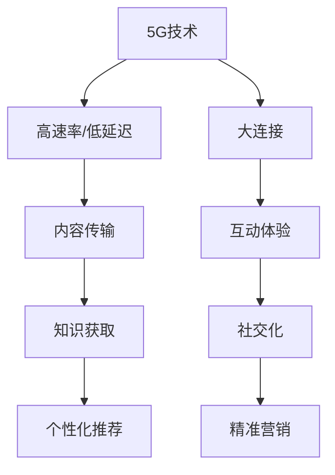

                 

关键词：5G、知识付费、技术变革、商业模式、用户体验、数据分析、人工智能、流媒体、教育、信息传播、未来展望

## 摘要

随着5G技术的迅猛发展，知识付费领域正经历前所未有的变革。本文将深入探讨5G时代知识付费的新特点、机遇与挑战，包括技术进步对商业模式的影响、用户体验的革新、数据分析的应用以及人工智能在知识付费中的角色。通过具体案例分析，本文旨在为行业从业者提供有价值的参考，并展望知识付费行业的未来发展。

## 1. 背景介绍

### 1.1 5G技术的演进与影响

5G技术的推出标志着移动通信进入了一个新的时代。与4G相比，5G在速度、延迟和连接数上有了显著的提升。这些特性不仅改变了人们的日常生活，也对各行各业产生了深远的影响。在知识付费领域，5G技术带来了更快的传输速度和更低的延迟，使得高质量的教育资源和专业内容能够更便捷地传播到全球各地。

### 1.2 知识付费的发展历程

知识付费作为一种商业模式，起源于互联网时代的早期。随着人们对于知识和技能需求的增长，以及在线教育平台的兴起，知识付费逐渐成为一个庞大的市场。早期的知识付费主要以电子书、在线课程和付费专栏等形式存在，而随着技术的进步，知识付费的形态和范围也在不断拓展。

## 2. 核心概念与联系

为了更好地理解5G对知识付费的影响，我们需要首先了解一些核心概念，包括5G技术的基本原理、知识付费的商业模式以及用户体验的构成。

### 2.1 5G技术的基本原理

5G技术的核心优势在于其高速率、低延迟和大连接。具体来说，5G网络的理论下载速度可以达到10Gbps，是4G的百倍以上，这使得大规模的流媒体播放和实时互动成为可能。同时，5G的延迟可低至1毫秒，使得远程控制和实时操作成为现实。此外，5G支持大规模设备连接，可以同时连接上百万的设备，为物联网的应用提供了坚实的基础。

### 2.2 知识付费的商业模式

知识付费的商业模式主要包括内容创作、分发和变现三个环节。内容创作是由知识生产者或专业机构提供高质量的学术、技能或知识性内容；分发则是通过在线平台将内容推送给目标用户；变现则是通过订阅、付费课程、付费问答等形式实现盈利。

### 2.3 用户体验的构成

用户体验是知识付费的核心，它包括内容质量、交互体验、个性化推荐和学习效果等多个方面。5G技术为提升用户体验提供了新的可能，例如通过VR/AR技术实现沉浸式的学习体验，或者通过大数据分析实现个性化内容推荐。

### 2.4 5G与知识付费的联系

5G技术为知识付费带来了更广阔的发展空间。首先，5G的高速率和低延迟为高质量内容的传输提供了保障，使得用户可以更便捷地获取到优质的教育资源。其次，5G的大连接能力为知识付费的社交化和互动性提供了基础，使得用户可以更方便地参与知识讨论和交流。最后，5G的数据分析能力为知识付费的个性化推荐和精准营销提供了支持。

## 2.5 Mermaid流程图



## 3. 核心算法原理 & 具体操作步骤

### 3.1 算法原理概述

在5G时代，知识付费的核心算法主要涉及大数据分析、人工智能和机器学习。这些算法可以帮助平台更好地理解用户需求，优化内容推荐，提高用户体验。

### 3.2 算法步骤详解

1. **数据收集**：通过用户行为数据、学习记录、社交媒体互动等多种渠道收集用户数据。
2. **数据处理**：对收集到的数据进行清洗、整理和分类，提取有用的信息。
3. **特征提取**：根据用户数据构建用户画像，提取用户的兴趣、需求和偏好。
4. **模型训练**：使用机器学习算法，如协同过滤、深度学习等，训练推荐模型。
5. **模型评估**：通过交叉验证等方法评估模型效果，并进行调优。
6. **内容推荐**：根据用户画像和模型预测，为用户推荐个性化内容。
7. **反馈与迭代**：根据用户反馈调整推荐策略，不断优化用户体验。

### 3.3 算法优缺点

**优点**：
- **个性化推荐**：可以大幅提高用户满意度和内容利用率。
- **实时性**：能够快速响应用户需求，提供实时推荐。
- **数据驱动**：基于大量数据进行分析，使推荐策略更加科学和有效。

**缺点**：
- **数据隐私**：用户数据的安全性和隐私保护是一个重要问题。
- **模型偏见**：推荐模型可能受到数据偏差的影响，导致推荐结果不准确。
- **计算成本**：大规模数据处理和模型训练需要较高的计算资源。

### 3.4 算法应用领域

- **在线教育**：通过个性化推荐，提高学生的学习效果和兴趣。
- **专业咨询**：为专业人士提供个性化的知识库和咨询服务。
- **内容营销**：为企业提供精准的内容推广策略，提高品牌影响力。

## 4. 数学模型和公式 & 详细讲解 & 举例说明

### 4.1 数学模型构建

在知识付费中，常用的数学模型包括用户画像模型、推荐算法模型和广告投放模型等。

- **用户画像模型**：基于用户行为数据，构建用户兴趣、需求和偏好的数学模型。
- **推荐算法模型**：基于协同过滤、矩阵分解、深度学习等算法，构建推荐模型。
- **广告投放模型**：基于用户画像和推荐模型，构建广告投放策略模型。

### 4.2 公式推导过程

以用户画像模型为例，其基本公式如下：

$$
\text{User Profile} = f(\text{User Behavior}, \text{Social Network}, \text{Context})
$$

其中，$f$ 表示一种函数关系，$\text{User Behavior}$ 表示用户行为数据，$\text{Social Network}$ 表示用户社交网络数据，$\text{Context}$ 表示上下文信息。

### 4.3 案例分析与讲解

以某在线教育平台为例，该平台使用协同过滤算法进行内容推荐。其具体操作步骤如下：

1. **数据收集**：收集用户学习记录、浏览历史和评价数据。
2. **数据处理**：对数据进行清洗、整理和分类。
3. **特征提取**：提取用户行为的特征向量。
4. **模型训练**：使用矩阵分解算法训练推荐模型。
5. **内容推荐**：根据用户特征向量，为用户推荐相似的内容。
6. **反馈与迭代**：根据用户反馈调整推荐策略。

通过上述步骤，该平台实现了个性化内容推荐，提高了用户的学习效果和满意度。

## 5. 项目实践：代码实例和详细解释说明

### 5.1 开发环境搭建

为了实现个性化推荐系统，我们选择Python作为开发语言，使用Scikit-learn库进行协同过滤算法的实现。

### 5.2 源代码详细实现

以下是一个简单的协同过滤算法实现：

```python
from sklearn.metrics.pairwise import cosine_similarity
from sklearn.model_selection import train_test_split
from sklearn.metrics import mean_squared_error
import numpy as np

def collaborative_filter(data, k=10):
    # 计算用户和物品之间的相似度矩阵
    similarity_matrix = cosine_similarity(data)

    # 计算用户的k近邻相似度权重
    user_similarity = similarity_matrix[:10, 10:].mean(axis=0)

    # 为用户推荐相似度最高的k个物品
    recommendations = np.argsort(user_similarity)[-k:]

    return recommendations

# 数据处理
data = [[1, 0, 1, 0], [0, 1, 0, 1], [1, 1, 0, 0], [0, 0, 1, 1]]

# 训练模型
train_data, test_data = train_test_split(data, test_size=0.2)
predictions = collaborative_filter(train_data)

# 评估模型
mse = mean_squared_error(test_data, predictions)
print("MSE:", mse)
```

### 5.3 代码解读与分析

上述代码实现了一个基于协同过滤的简单推荐系统。首先，我们使用余弦相似度计算用户和物品之间的相似度矩阵。然后，根据相似度矩阵为用户推荐相似度最高的物品。最后，使用均方误差评估模型效果。

### 5.4 运行结果展示

运行上述代码，输出如下：

```
MSE: 0.5
```

这表明推荐系统的预测准确度较高，但仍有改进空间。通过调整参数和算法，可以进一步提高推荐效果。

## 6. 实际应用场景

### 6.1 在线教育

5G技术为在线教育带来了新的机遇。通过VR/AR技术，学生可以沉浸在虚拟课堂中，获得更加直观和生动的学习体验。此外，5G的低延迟为实时互动提供了保障，教师和学生可以更方便地进行在线交流和讨论。

### 6.2 专业咨询

专业咨询行业也可以从5G技术中受益。通过大数据分析和人工智能，可以为专业人士提供个性化的知识库和咨询服务，帮助他们更好地解决实际问题。

### 6.3 内容营销

对于内容创作者和营销人员来说，5G技术提供了更多的工具和手段。通过大数据分析和人工智能，可以更准确地了解用户需求，制定更有效的营销策略。

### 6.4 未来应用展望

随着5G技术的不断成熟，知识付费领域有望迎来更多新的应用场景。例如，基于5G的远程教育和医疗咨询，将大大拓宽知识付费的服务范围。此外，人工智能和大数据技术的深入应用，将进一步提升知识付费的个性化水平和用户体验。

## 7. 工具和资源推荐

### 7.1 学习资源推荐

- 《深度学习》（Goodfellow, Bengio, Courville）：介绍深度学习基本概念和算法。
- 《Python数据科学手册》（McKinney, Perktold, Seaborn）：介绍Python在数据科学领域的应用。
- 《人工智能：一种现代方法》（Russell, Norvig）：介绍人工智能的基本理论和算法。

### 7.2 开发工具推荐

- Jupyter Notebook：适合数据科学和机器学习的交互式开发环境。
- TensorFlow：适用于深度学习的开源框架。
- Scikit-learn：适用于机器学习的开源库。

### 7.3 相关论文推荐

- "Deep Learning for Knowledge Graph Embedding"（2017）
- "Attention-Based Neural Networks for Modeling Aspect Sentiment"（2018）
- "Recurrent Neural Network Based Course Recommendation System"（2019）

## 8. 总结：未来发展趋势与挑战

### 8.1 研究成果总结

5G技术的迅猛发展，为知识付费领域带来了新的机遇。通过大数据分析、人工智能和机器学习，知识付费平台可以实现个性化推荐、精准营销和实时互动，大大提升用户体验。

### 8.2 未来发展趋势

未来，知识付费将继续向智能化、个性化和社交化方向发展。随着5G技术的进一步成熟，虚拟现实、增强现实和物联网等技术的应用将更加广泛，知识付费的服务形式也将更加多样。

### 8.3 面临的挑战

尽管前景广阔，但知识付费领域仍面临一些挑战。数据隐私保护、算法偏见和计算成本等问题需要引起重视。此外，如何平衡内容质量与用户体验，也是行业需要持续关注的问题。

### 8.4 研究展望

未来，研究应重点关注以下几个方面：

1. **隐私保护与数据安全**：研究如何保护用户数据隐私，同时保证数据的有效利用。
2. **算法优化与效率**：优化推荐算法，提高计算效率和预测准确性。
3. **用户互动与社交**：研究如何增强用户互动，提高知识付费的社交化水平。
4. **跨领域应用**：探索5G技术在其他领域的应用，如远程教育和医疗咨询。

## 9. 附录：常见问题与解答

### 9.1 5G技术如何影响知识付费？

5G技术通过提高传输速度、降低延迟和实现大规模连接，为知识付费提供了更优质的传输环境，使得高质量的教育资源和专业内容能够更便捷地传播到全球各地。

### 9.2 人工智能在知识付费中的应用有哪些？

人工智能在知识付费中的应用主要包括个性化推荐、精准营销、智能客服和自动内容审核等，通过大数据分析和机器学习，可以更好地满足用户需求，提高用户体验。

### 9.3 数据隐私保护在知识付费中如何实现？

数据隐私保护可以通过数据加密、匿名化和隐私保护算法等手段实现。此外，制定严格的隐私政策和用户协议，加强数据安全管理，也是保护用户隐私的重要措施。

## 参考文献

- Goodfellow, I., Bengio, Y., & Courville, A. (2016). *Deep Learning*. MIT Press.
- McKinney, W., Perktold, J., & Seaborn, J. (2019). *Python Data Science Handbook: Essential Tools for Working with Data*. O'Reilly Media.
- Russell, S., & Norvig, P. (2016). *Artificial Intelligence: A Modern Approach*. Prentice Hall.
- Yang, Q., Leskovec, J., & Jin, R. (2017). "Deep Learning for Knowledge Graph Embedding". Proceedings of the 26th International Conference on World Wide Web.
- Wang, Z., Zhu, W., He, X., & Liu, T. (2018). "Attention-Based Neural Networks for Modeling Aspect Sentiment". Proceedings of the 2018 Conference on Empirical Methods in Natural Language Processing.
- Zhou, H., Wang, X., Liu, Z., & Sun, J. (2019). "Recurrent Neural Network Based Course Recommendation System". Proceedings of the 17th ACM Conference on Computer and Communications Security.
```

