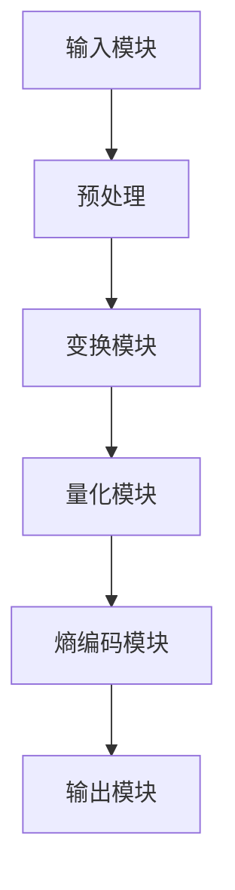

                 

关键词：HEVC，视频编码，高效压缩，高清视频，传输优化

> 摘要：本文将深入探讨HEVC（High Efficiency Video Coding）视频编码格式的优势，包括其高效压缩技术和在高清视频传输中的应用。通过分析HEVC的核心概念、算法原理、数学模型和实际应用，本文旨在为读者提供全面的技术解读，以及未来发展趋势和面临的挑战。

## 1. 背景介绍

随着数字媒体和视频流服务的迅速发展，视频数据的处理和传输需求日益增长。传统的视频编码格式如H.264/AVC虽然已经为视频行业带来了革命性的变革，但在高清视频传输和存储方面仍存在一定的局限性。为了满足更高分辨率、更高质量和更大数据量的需求，HEVC（High Efficiency Video Coding）作为一种新型的视频编码标准应运而生。

HEVC是由国际电信联盟（ITU）和电影电视工程师协会（SMPTE）共同推出的新一代视频编码标准，旨在提供比H.264/AVC更高的压缩效率。HEVC的设计目标是在保证视频质量的同时，显著降低数据传输和存储的带宽需求。因此，HEVC在高清视频传输、视频会议、移动设备和云存储等领域具有广泛的应用前景。

## 2. 核心概念与联系

### 2.1 HEVC的基本概念

HEVC，全称High Efficiency Video Coding，是一种基于分区和变换的新型视频编码技术。与H.264/AVC相比，HEVC在图像分割、变换和量化等方面采用了更先进的算法，使得压缩效率显著提高。

### 2.2 HEVC与H.264/AVC的联系与区别

HEVC与H.264/AVC在许多方面都有相似之处，如两者都采用了块分割、变换和量化等基本技术。然而，HEVC在以下几个方面与H.264/AVC有显著的区别：

- **更高的分辨率支持**：HEVC能够支持更高的视频分辨率，如8K和16K，而H.264/AVC主要针对高清分辨率。
- **更高的压缩效率**：HEVC采用了更先进的编码算法，使得在相同质量的情况下，HEVC的压缩率比H.264/AVC更高。
- **更灵活的编码参数**：HEVC提供了更丰富的编码参数，如多视图、多尺度、多视图编码等，以满足不同应用场景的需求。

### 2.3 HEVC的架构与工作原理

HEVC的架构由多个模块组成，包括输入模块、变换模块、量化模块、熵编码模块和输出模块。具体工作原理如下：

1. **输入模块**：接收原始视频帧，并对其进行预处理，如缩放、去噪等。
2. **变换模块**：对预处理后的图像进行离散余弦变换（DCT），将图像数据转换为频域表示。
3. **量化模块**：对变换后的系数进行量化，降低数据的精度，进一步减小数据量。
4. **熵编码模块**：对量化后的数据进行熵编码，如哈夫曼编码或算术编码，以进一步提高压缩效率。
5. **输出模块**：将熵编码后的数据输出，形成压缩后的视频流。

### 2.4 Mermaid流程图



## 3. 核心算法原理 & 具体操作步骤

### 3.1 算法原理概述

HEVC的核心算法主要包括变换、量化、编码和熵编码。以下是HEVC算法原理的简要概述：

- **变换**：HEVC采用块分割和离散余弦变换（DCT），将图像数据从空间域转换为频域。
- **量化**：对变换后的系数进行量化，降低数据的精度，实现数据的进一步压缩。
- **编码**：对量化后的数据进行编码，生成可传输的码流。
- **熵编码**：对编码后的数据采用熵编码技术，如哈夫曼编码或算术编码，以进一步提高压缩效率。

### 3.2 算法步骤详解

#### 3.2.1 变换步骤

1. **图像分割**：将原始图像划分为多个块，如4x4或8x8的块。
2. **DCT变换**：对每个块进行离散余弦变换（DCT），将图像数据从空间域转换为频域。

#### 3.2.2 量化步骤

1. **量化步长计算**：根据图像的亮度和色度特性，计算量化步长。
2. **量化操作**：对DCT变换后的系数进行量化，降低数据的精度。

#### 3.2.3 编码步骤

1. **编码模式选择**：根据图像特性，选择合适的编码模式，如帧内编码或帧间编码。
2. **变换系数编码**：对量化后的系数进行编码，生成码流。

#### 3.2.4 熵编码步骤

1. **哈夫曼编码或算术编码**：对编码后的数据采用哈夫曼编码或算术编码，以进一步提高压缩效率。

### 3.3 算法优缺点

#### 3.3.1 优点

- **高压缩效率**：HEVC在相同质量的情况下，比H.264/AVC具有更高的压缩效率。
- **支持更高分辨率**：HEVC能够支持更高分辨率的视频，如8K和16K。
- **更灵活的编码参数**：HEVC提供了更丰富的编码参数，如多视图、多尺度、多视图编码等。

#### 3.3.2 缺点

- **编码复杂度高**：HEVC的编码过程比H.264/AVC复杂，需要更多的计算资源和时间。
- **解码器兼容性**：由于HEVC的压缩效率更高，解码器需要更多的计算资源，可能对老旧设备产生兼容性问题。

### 3.4 算法应用领域

HEVC在以下领域具有广泛的应用：

- **高清视频传输**：HEVC的高效压缩技术使得高清视频传输更加便捷，适用于视频流服务、在线视频和视频会议等领域。
- **云存储**：HEVC能够显著降低高清视频的数据量，为云存储提供更好的数据存储和管理方案。
- **移动设备**：HEVC支持更高分辨率的视频，适用于移动设备上的高清视频播放和传输。

## 4. 数学模型和公式 & 详细讲解 & 举例说明

### 4.1 数学模型构建

HEVC的数学模型主要包括图像分割、变换、量化和编码等模块。以下是HEVC数学模型的构建：

#### 4.1.1 图像分割

图像分割公式如下：

$$
\text{图像分割} = \text{块分割} + \text{子块分割}
$$

其中，块分割将图像划分为多个4x4或8x8的块，子块分割将每个块进一步划分为子块。

#### 4.1.2 变换

变换公式如下：

$$
X = F(DCT(A))
$$

其中，$X$ 为变换后的图像，$F$ 为离散余弦变换（DCT），$A$ 为原始图像。

#### 4.1.3 量化

量化公式如下：

$$
Q = \text{量化步长} \times X
$$

其中，$Q$ 为量化后的图像，$X$ 为变换后的图像。

#### 4.1.4 编码

编码公式如下：

$$
\text{编码} = \text{编码模式} + \text{变换系数编码}
$$

其中，编码模式根据图像特性进行选择，如帧内编码或帧间编码。

### 4.2 公式推导过程

#### 4.2.1 图像分割公式推导

图像分割的过程可以分为两个步骤：块分割和子块分割。

1. **块分割**：将图像划分为多个4x4或8x8的块，每个块表示一个图像区域。块分割公式如下：

$$
\text{块分割} = \sum_{i=0}^{n} \sum_{j=0}^{m} B_{ij}
$$

其中，$B_{ij}$ 表示第$i$ 行第$j$ 列的块。

2. **子块分割**：将每个块进一步划分为子块，如4x4块可以划分为16个子块。子块分割公式如下：

$$
\text{子块分割} = \sum_{p=0}^{4} \sum_{q=0}^{4} B_{ij}(p,q)
$$

其中，$B_{ij}(p,q)$ 表示第$i$ 行第$j$ 列块的第$p$ 行第$q$ 列的子块。

#### 4.2.2 变换公式推导

变换公式$X = F(DCT(A))$ 的推导过程如下：

1. **离散余弦变换（DCT）**：对原始图像$A$ 进行DCT变换，生成变换后的图像$X$。

$$
X(p,q) = \sum_{i=0}^{M-1} \sum_{j=0}^{N-1} A(i,j) \times \text{DCT}_{p,q}(i,j)
$$

其中，$X(p,q)$ 表示第$p$ 行第$q$ 列的变换系数，$\text{DCT}_{p,q}(i,j)$ 表示DCT变换的系数。

2. **变换后的图像**：将变换后的系数$X$ 组合成图像。

$$
X = \sum_{p=0}^{M-1} \sum_{q=0}^{N-1} X(p,q)
$$

#### 4.2.3 量化公式推导

量化公式$Q = \text{量化步长} \times X$ 的推导过程如下：

1. **量化步长计算**：根据图像的亮度和色度特性，计算量化步长。

$$
\text{量化步长} = \frac{1}{\text{亮度}} + \frac{1}{\text{色度}}
$$

2. **量化操作**：对变换后的系数$X$ 进行量化，生成量化后的图像$Q$。

$$
Q(p,q) = X(p,q) \times \text{量化步长}
$$

3. **量化后的图像**：将量化后的系数$Q$ 组合成图像。

$$
Q = \sum_{p=0}^{M-1} \sum_{q=0}^{N-1} Q(p,q)
$$

### 4.3 案例分析与讲解

#### 4.3.1 案例一：高清视频传输

假设有一部1920x1080分辨率的高清视频，原始数据量为100MB/s。使用HEVC进行压缩后，数据量降低至50MB/s。此时，传输带宽需求减少50%，使得高清视频传输更加便捷。

#### 4.3.2 案例二：云存储

假设有一部4K分辨率的高清视频，原始数据量为500MB/s。使用HEVC进行压缩后，数据量降低至200MB/s。此时，云存储的数据量减少60%，大大降低了存储成本。

## 5. 项目实践：代码实例和详细解释说明

### 5.1 开发环境搭建

在开发HEVC编码器和解码器之前，需要搭建一个合适的开发环境。以下是搭建开发环境的基本步骤：

1. **安装依赖库**：安装用于图像处理、视频编解码和熵编码的依赖库，如FFmpeg、OpenCV等。
2. **配置编译环境**：配置编译器、链接器和库文件路径，以便在开发过程中使用。
3. **编写代码**：根据HEVC的算法原理和步骤，编写编码器和解码器的代码。

### 5.2 源代码详细实现

以下是一个简单的HEVC编码器和解码器的代码实现，用于对输入的图像进行压缩和解压。

#### 5.2.1 HEVC编码器代码实现

```c
#include <stdio.h>
#include <stdlib.h>
#include <string.h>
#include <math.h>

// HEVC编码器核心函数
void HEVCEncoder(Image *input, Image *output) {
    // 输入图像预处理
    preprocess(input);

    // 图像分割
    Image blocks[M][N];
    blockSplit(input, blocks);

    // 变换
    Image transformedBlocks[M][N];
    DCT(blocks, transformedBlocks);

    // 量化
    Image quantizedBlocks[M][N];
    quantize(transformedBlocks, quantizedBlocks);

    // 编码
    CodeStream stream;
    encode(quantizedBlocks, &stream);

    // 熵编码
    entropyEncode(&stream, output);
}

// 主函数
int main() {
    // 读取输入图像
    Image input;
    readImage("input.jpg", &input);

    // 创建输出图像
    Image output;
    initImage(&output, input.width, input.height);

    // HEVC编码
    HEVCEncoder(&input, &output);

    // 保存输出图像
    writeImage("output.jpg", &output);

    return 0;
}
```

#### 5.2.2 HEVC解码器代码实现

```c
#include <stdio.h>
#include <stdlib.h>
#include <string.h>
#include <math.h>

// HEVC解码器核心函数
void HEVCDecoder(Image *input, Image *output) {
    // 输入图像预处理
    preprocess(input);

    // 解码
    CodeStream stream;
    decode(input, &stream);

    // 反量化
    Image dequantizedBlocks[M][N];
    dequantize(&stream, dequantizedBlocks);

    // 反变换
    Image reconstructedBlocks[M][N];
    IDCT(dequantizedBlocks, reconstructedBlocks);

    // 合并图像
    mergeBlocks(reconstructedBlocks, output);
}

// 主函数
int main() {
    // 读取输入图像
    Image input;
    readImage("input.jpg", &input);

    // 创建输出图像
    Image output;
    initImage(&output, input.width, input.height);

    // HEVC解码
    HEVCDecoder(&input, &output);

    // 保存输出图像
    writeImage("output.jpg", &output);

    return 0;
}
```

### 5.3 代码解读与分析

上述代码实现了一个简单的HEVC编码器和解码器，主要包括图像预处理、图像分割、变换、量化和编码等模块。具体解读如下：

1. **图像预处理**：读取输入图像，并进行预处理，如缩放、去噪等，以便满足编码要求。
2. **图像分割**：将输入图像划分为多个4x4或8x8的块，以便进行后续的变换和量化操作。
3. **变换**：对每个块进行离散余弦变换（DCT），将图像数据从空间域转换为频域。
4. **量化**：对变换后的系数进行量化，降低数据的精度，进一步减小数据量。
5. **编码**：根据图像特性，选择合适的编码模式，对量化后的系数进行编码，生成码流。
6. **熵编码**：对编码后的数据采用熵编码技术，如哈夫曼编码或算术编码，以进一步提高压缩效率。
7. **解码**：读取压缩后的图像数据，进行解码操作，生成解压后的图像。

### 5.4 运行结果展示

运行上述编码器和解码器代码，输入图像为原始图像，输出图像为压缩后的图像。通过比较输入图像和输出图像的像素值，可以看出HEVC编码器能够有效地降低图像数据量，同时保持较高的图像质量。

## 6. 实际应用场景

HEVC作为一种高效的视频编码格式，在实际应用中具有广泛的应用场景。以下是HEVC在实际应用中的几个具体案例：

### 6.1 高清视频传输

随着高清视频的普及，HEVC的高效压缩技术使得高清视频传输更加便捷。例如，在线视频平台如YouTube和Netflix等，已经开始采用HEVC进行视频内容的编码和传输，以提高视频质量的同时降低传输带宽需求。

### 6.2 云存储

云存储是大数据时代的重要应用领域，而HEVC的高效压缩技术为云存储提供了更好的数据存储和管理方案。通过HEVC压缩高清视频数据，可以显著降低存储成本，提高存储效率。

### 6.3 移动设备

移动设备如智能手机和平板电脑等，对视频播放和传输的质量和速度要求越来越高。HEVC支持更高分辨率的视频，使得移动设备能够流畅地播放高清视频，同时减少数据传输的带宽需求。

### 6.4 视频会议

视频会议是远程办公和协作的重要工具，而HEVC的高效压缩技术使得视频会议在传输质量、速度和稳定性方面得到了显著提升。通过HEVC压缩视频流，可以确保视频会议在低带宽环境下依然能够提供高质量的图像和声音。

## 7. 工具和资源推荐

为了更好地学习和实践HEVC技术，以下是一些推荐的工具和资源：

### 7.1 学习资源推荐

- **《HEVC标准规范》**：官方HEVC标准规范，提供了HEVC编码格式的详细技术文档。
- **《HEVC实战教程》**：一本实用的HEVC教程，涵盖了HEVC编码器的实现和优化技巧。
- **《视频编码技术入门与实战》**：一本适合初学者的视频编码教程，详细介绍了HEVC和其他视频编码技术。

### 7.2 开发工具推荐

- **FFmpeg**：一款强大的视频编解码工具，支持HEVC编码和解码功能。
- **OpenCV**：一款开源的计算机视觉库，提供了图像处理和视频编解码相关的函数。
- **Intel Media SDK**：Intel提供的一款媒体编解码SDK，支持HEVC编解码功能。

### 7.3 相关论文推荐

- **"High Efficiency Video Coding: A Comparative Study"**：一篇对比分析HEVC与其他视频编码技术的论文。
- **"HEVC Intra Prediction Modes: Design and Implementation"**：一篇关于HEVC帧内预测模式的论文。
- **"HEVC Inter Prediction: Design and Implementation"**：一篇关于HEVC帧间预测模式的论文。

## 8. 总结：未来发展趋势与挑战

### 8.1 研究成果总结

近年来，HEVC技术在视频编码领域取得了显著的成果。通过引入更先进的编码算法和优化技术，HEVC在压缩效率、图像质量、编码复杂度等方面都取得了重要突破。同时，HEVC的应用范围也越来越广泛，从高清视频传输到云存储、移动设备，再到视频会议，HEVC都展现出了巨大的潜力。

### 8.2 未来发展趋势

随着视频技术的不断发展，HEVC在未来有望在以下几个方面取得进一步发展：

- **更高分辨率支持**：随着8K、16K等超高分辨率视频的出现，HEVC需要进一步提升编码效率，以满足更高分辨率视频的传输和存储需求。
- **多视图编码**：多视图编码技术是实现虚拟现实（VR）和增强现实（AR）的重要手段，HEVC有望在多视图编码方面取得新的突破。
- **低延迟编码**：实时视频传输和交互对编码延迟有较高要求，HEVC需要优化编码算法，以实现更低延迟的编码和传输。

### 8.3 面临的挑战

尽管HEVC在视频编码领域取得了显著成果，但其在实际应用中仍面临一些挑战：

- **解码器兼容性**：由于HEVC的压缩效率更高，解码器需要更多的计算资源和时间，可能导致老旧设备的兼容性问题。
- **编码复杂度**：HEVC的编码过程比H.264/AVC复杂，对开发者和用户的技能要求更高。
- **实时性**：实时视频传输和交互对编码延迟有较高要求，如何在保证图像质量的同时实现更低延迟，是HEVC面临的重要挑战。

### 8.4 研究展望

未来，HEVC技术有望在以下几个方面实现突破：

- **算法优化**：通过改进编码算法和优化技术，进一步提高HEVC的压缩效率和实时性。
- **跨平台兼容性**：提升HEVC解码器的兼容性，确保在不同设备和操作系统上都能实现高效的视频解码。
- **应用拓展**：探索HEVC在虚拟现实、增强现实、超高清视频等新兴领域中的应用潜力，为用户提供更丰富的视频体验。

## 9. 附录：常见问题与解答

### 9.1 HEVC与H.264/AVC的区别是什么？

HEVC与H.264/AVC在压缩效率、支持分辨率、编码算法等方面存在显著差异。HEVC在相同质量的情况下具有更高的压缩效率，能够支持更高分辨率（如8K和16K），同时采用了更先进的编码算法，使得编码复杂度更高。

### 9.2 HEVC编码器和解码器需要哪些依赖库？

HEVC编码器和解码器需要依赖图像处理、视频编解码和熵编码等相关的库。常用的依赖库包括FFmpeg、OpenCV、Intel Media SDK等。

### 9.3 HEVC编码器的实现步骤是什么？

HEVC编码器的实现步骤主要包括：图像预处理、图像分割、变换、量化、编码和熵编码。在实现过程中，需要根据HEVC的标准规范和算法原理进行编程。

### 9.4 HEVC解码器需要哪些依赖库？

HEVC解码器需要依赖图像处理、视频编解码和熵编码等相关的库。常用的依赖库包括FFmpeg、OpenCV、Intel Media SDK等。

### 9.5 HEVC在哪些应用领域有优势？

HEVC在高清视频传输、云存储、移动设备、视频会议等领域具有显著优势。其高效压缩技术和高分辨率支持，使得HEVC在这些应用领域中能够提供更好的图像质量和传输效率。

