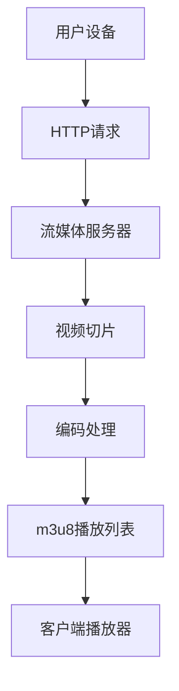

                 

关键词：HLS流媒体，m3u8协议，直播技术，网络传输，流媒体协议，流媒体播放，互联网技术

> 摘要：本文将深入探讨HLS流媒体技术及其核心技术——m3u8协议。文章首先介绍了HLS流媒体的基本概念和原理，随后详细解析了m3u8协议的各个组成部分及其工作原理。通过实际案例和代码示例，读者将全面了解HLS流媒体技术的应用场景和开发细节。最后，文章总结了HLS流媒体技术的发展趋势和未来挑战。

## 1. 背景介绍

随着互联网的普及和移动设备的广泛应用，流媒体技术在在线娱乐、教育、新闻等众多领域得到了广泛应用。流媒体技术允许用户通过互联网实时获取和播放视频、音频等多媒体内容，而不需要下载整个文件。流媒体技术的核心在于如何高效、稳定地传输和播放媒体内容，同时保证用户体验。

在众多的流媒体协议中，HLS（HTTP Live Streaming）因其开放性、兼容性和可扩展性而成为流媒体领域的核心技术。HLS协议由苹果公司于2009年推出，支持多种视频编码格式，如H.264和HEVC，并能够适应不同网络环境和设备性能。

m3u8协议是HLS的核心组成部分，它定义了流媒体文件的播放列表格式。通过m3u8协议，流媒体服务器可以将多媒体内容分割成多个小片段，并生成对应的播放列表文件，以便客户端能够按照正确的顺序播放这些片段。

## 2. 核心概念与联系

### 2.1 HLS协议基本原理

HLS协议的工作原理主要包括以下几个步骤：

1. **切片**：流媒体服务器将视频内容切割成多个时长较短（通常为几秒到几十秒）的小片段，每个片段通常以ts为后缀。
2. **编码**：每个视频片段经过编码处理，生成对应的编码流，通常采用H.264或HEVC编码格式。
3. **打包**：编码后的视频片段被打包成m3u8播放列表文件，该文件包含了所有片段的URL地址和播放顺序。
4. **播放**：客户端下载m3u8播放列表文件，并根据播放列表中的URL地址逐一下载和播放视频片段。

### 2.2 m3u8协议详解

m3u8协议是一种基于HTTP协议的播放列表格式，其文件扩展名为`.m3u8`。一个典型的m3u8文件包含以下两部分：

1. **#EXTM3U**：标头部分，用于声明这是一个m3u8播放列表文件。
2. **播放列表项**：列表项包含一个或多个URL地址，每个URL地址对应一个视频片段。

以下是一个简单的m3u8播放列表示例：

```bash
#EXTM3U
#EXT-X-STREAM-INF:BANDWIDTH=1280000
https://example.com/stream/segment1.ts
#EXT-X-STREAM-INF:BANDWIDTH=640000
https://example.com/stream/segment2.ts
#EXT-X-STREAM-INF:BANDWIDTH=320000
https://example.com/stream/segment3.ts
```

在上面的示例中，有三个播放列表项，分别对应不同的视频片段。`BANDWIDTH`属性用于指定每个片段的带宽，以便客户端选择合适的片段进行播放。

### 2.3 流媒体架构

以下是一个简化的流媒体架构图，展示了HLS协议和m3u8协议在流媒体传输中的角色和关系。



在这个架构中，用户设备通过HTTP请求向流媒体服务器获取m3u8播放列表，流媒体服务器根据播放列表中的URL地址逐一发送视频片段给客户端播放器，客户端播放器将这些片段按顺序播放，从而实现流媒体播放。

## 3. 核心算法原理 & 具体操作步骤

### 3.1 算法原理概述

HLS协议的核心算法原理主要包括视频切片、编码处理和播放列表生成。具体步骤如下：

1. **视频切片**：流媒体服务器将视频内容切割成多个时长较短的小片段，以便客户端可以按需下载和播放。
2. **编码处理**：每个视频片段经过编码处理，生成对应的编码流，通常采用H.264或HEVC编码格式。
3. **播放列表生成**：流媒体服务器根据视频片段和编码流的URL地址生成m3u8播放列表文件，该文件包含了所有片段的URL地址和播放顺序。

### 3.2 算法步骤详解

1. **切片**：视频切片是将视频内容切割成多个时长较短的小片段。HLS协议通常将每个片段时长设置为几秒到几十秒。切片的目的是提高流媒体传输的灵活性和可扩展性，以便客户端可以按需下载和播放。
2. **编码**：编码处理是将视频片段转换成编码流，以便客户端可以播放。常用的编码格式有H.264和HEVC。编码过程中，视频片段被分割成一系列的图像帧，然后对图像帧进行压缩编码。
3. **打包**：编码后的视频片段被打包成m3u8播放列表文件。在打包过程中，流媒体服务器需要生成一个m3u8文件，该文件包含了所有视频片段的URL地址和播放顺序。m3u8文件的格式如下：

```bash
#EXTM3U
#EXT-X-STREAM-INF:BANDWIDTH=1280000
https://example.com/stream/segment1.ts
#EXT-X-STREAM-INF:BANDWIDTH=640000
https://example.com/stream/segment2.ts
#EXT-X-STREAM-INF:BANDWIDTH=320000
https://example.com/stream/segment3.ts
```

在上面的示例中，有三个播放列表项，分别对应不同的视频片段。`BANDWIDTH`属性用于指定每个片段的带宽，以便客户端选择合适的片段进行播放。

### 3.3 算法优缺点

**优点**：

1. **灵活性和可扩展性**：HLS协议支持多种视频编码格式和不同的片段时长，可以根据网络环境和设备性能进行自适应播放。
2. **跨平台兼容性**：HLS协议广泛应用于多种设备和平台，包括iOS、Android、Web等。
3. **高效传输**：通过将视频内容切割成多个小片段，HLS协议可以按需传输和播放，从而提高传输效率和降低带宽消耗。

**缺点**：

1. **启动延迟**：由于需要下载m3u8播放列表文件，HLS协议的启动延迟相对较长。
2. **切片数量过多**：在低带宽环境中，过多的切片可能会导致下载和播放效率降低。

### 3.4 算法应用领域

HLS协议广泛应用于流媒体领域，包括直播、点播、在线教育、新闻等。以下是一些典型的应用场景：

1. **直播**：HLS协议可以实时传输和播放直播内容，适用于在线演唱会、体育赛事、新闻报道等场景。
2. **点播**：HLS协议支持点播服务，用户可以随时观看视频内容，适用于视频平台、教育平台等。
3. **在线教育**：HLS协议可以支持在线教育平台的视频教学，用户可以通过互联网观看教学视频。

## 4. 数学模型和公式 & 详细讲解 & 举例说明

### 4.1 数学模型构建

HLS协议的数学模型主要包括视频切片时长、编码参数和播放列表生成等。以下是一个简化的数学模型：

1. **视频切片时长**：设视频时长为T，切片时长为S，则视频可以分割成多个片段，片段个数为n = T/S。
2. **编码参数**：设编码码率为C，编码格式为F，则每个视频片段的编码数据量为D = C * S。
3. **播放列表生成**：设播放列表项数为m，则播放列表的带宽总和为B = m * D。

### 4.2 公式推导过程

根据上述数学模型，可以推导出以下公式：

1. **切片时长**：S = T/n，其中n为片段个数。
2. **编码数据量**：D = C * S，其中C为编码码率，S为切片时长。
3. **播放列表带宽**：B = m * D，其中m为播放列表项数，D为每个片段的编码数据量。

### 4.3 案例分析与讲解

以下是一个具体案例：

假设一个视频时长为5分钟，编码码率为2Mbps，切片时长为10秒，播放列表项数为3。

1. **视频切片时长**：S = 5分钟/10秒 = 300秒。
2. **编码数据量**：D = 2Mbps * 10秒 = 20秒。
3. **播放列表带宽**：B = 3 * 20秒 = 60秒。

在这个案例中，视频被分割成300个片段，每个片段的编码数据量为20秒，播放列表的带宽总和为60秒。

## 5. 项目实践：代码实例和详细解释说明

### 5.1 开发环境搭建

为了演示HLS流媒体技术的实现，我们将使用一个简单的Python示例。首先，确保你已经安装了Python 3.x版本和以下库：

- Flask：一个轻量级的Web框架。
- av：一个用于处理视频和音频的库。

你可以使用pip命令安装这些库：

```bash
pip install Flask av
```

### 5.2 源代码详细实现

以下是一个简单的HLS流媒体服务器实现：

```python
from flask import Flask, send_file
import os

app = Flask(__name__)

@app.route('/stream.m3u8')
def stream():
    playlist = '#EXTM3U\n'
    for i in range(1, 4):
        segment = f'segment{i}.ts'
        playlist += f'#EXTINF:10,\n{segment}\n'
    return playlist

@app.route('/stream/<filename>')
def segment(filename):
    return send_file(os.path.join('stream', filename), mimetype='video/MP2T')

if __name__ == '__main__':
    app.run(debug=True)
```

在这个示例中，我们定义了两个路由：一个是用于返回m3u8播放列表的路由`/stream.m3u8`，另一个是用于返回视频片段的路由`/stream/<filename>`。

### 5.3 代码解读与分析

1. **Flask应用**：首先，我们导入了Flask模块，并创建了一个Flask应用实例。
2. **播放列表生成**：在`stream`函数中，我们生成了一个简单的m3u8播放列表，其中包含了三个视频片段的URL地址。
3. **视频片段获取**：在`segment`函数中，我们使用`send_file`函数将视频片段发送给客户端播放器。

### 5.4 运行结果展示

1. **启动Flask服务器**：运行上面的代码，启动Flask服务器。
2. **访问播放列表**：在浏览器中访问`http://127.0.0.1:5000/stream.m3u8`，你将看到一个简单的m3u8播放列表。
3. **播放视频片段**：根据播放列表中的URL地址，逐一访问视频片段，例如`http://127.0.0.1:5000/stream/segment1.ts`。

通过这个简单的示例，你将了解HLS流媒体技术的实现过程。

## 6. 实际应用场景

HLS流媒体技术在各个领域都有广泛的应用，以下是一些典型的实际应用场景：

1. **直播**：HLS协议支持实时直播，广泛应用于在线直播平台、体育赛事直播、新闻直播等场景。
2. **点播**：HLS协议支持点播服务，用户可以在视频平台上观看视频内容。
3. **在线教育**：HLS协议可以支持在线教育平台的视频教学，学生可以通过互联网观看教学视频。
4. **企业培训**：企业可以使用HLS协议进行内部培训，员工可以通过互联网学习。
5. **医疗远程会诊**：HLS协议可以支持医疗远程会诊，医生可以通过互联网观看患者视频资料。

## 7. 工具和资源推荐

### 7.1 学习资源推荐

- 《HTTP Live Streaming (HLS) - Overview》：苹果公司的HLS技术概述。
- 《HLS Streaming with FFmpeg》：使用FFmpeg实现HLS流媒体的教程。
- 《Building a HLS Server with Flask》：使用Flask实现HLS流媒体服务器的教程。

### 7.2 开发工具推荐

- FFmpeg：一个强大的视频处理工具，可以用于HLS流媒体的生成和转换。
- HLS.js：一个开源的HLS播放器库，适用于Web浏览器。
- VLC媒体播放器：一个功能强大的媒体播放器，支持多种流媒体协议。

### 7.3 相关论文推荐

- 《HTTP Live Streaming》：苹果公司发布的关于HLS协议的官方文档。
- 《An Overview of HLS》：对HLS协议的综述性论文。

## 8. 总结：未来发展趋势与挑战

### 8.1 研究成果总结

HLS流媒体技术自推出以来，在流媒体领域取得了显著的成果。其开放性、兼容性和可扩展性使其广泛应用于各种场景。同时，随着技术的不断发展，HLS协议也在不断优化和更新，以适应新的需求和挑战。

### 8.2 未来发展趋势

1. **自适应码率**：未来，HLS协议将更加注重自适应码率技术的实现，以提高用户体验和带宽利用率。
2. **边缘计算**：随着边缘计算技术的发展，HLS协议将更加注重在边缘节点进行数据处理和传输，以降低网络延迟和带宽消耗。
3. **多屏协同**：未来，HLS协议将支持多屏协同播放，实现多设备间的无缝切换和同步播放。

### 8.3 面临的挑战

1. **网络延迟**：在网络环境较差的地区，HLS协议需要优化传输和播放策略，以降低网络延迟。
2. **兼容性问题**：随着新设备的不断推出，HLS协议需要不断更新和兼容，以确保在各种设备上都能正常播放。
3. **版权保护**：在流媒体领域，版权保护一直是重要的议题。未来，HLS协议需要更加重视版权保护，以确保合法内容的安全传输和播放。

### 8.4 研究展望

未来，HLS协议将继续发展，以适应不断变化的技术和市场需求。同时，研究人员将关注自适应码率、边缘计算、多屏协同等新兴技术，为HLS协议的发展提供新的思路和解决方案。

## 9. 附录：常见问题与解答

### 9.1 什么是HLS流媒体？

HLS流媒体是一种基于HTTP协议的流媒体传输技术，由苹果公司于2009年推出。它通过将视频内容切割成多个小片段，并生成对应的播放列表文件，以便客户端可以按需下载和播放。

### 9.2 m3u8协议是什么？

m3u8协议是一种基于HTTP协议的播放列表格式，用于定义HLS流媒体中的视频片段播放顺序和URL地址。一个典型的m3u8文件包含标头部分和播放列表项，其中播放列表项包含了视频片段的URL地址。

### 9.3 HLS流媒体的优势是什么？

HLS流媒体具有以下优势：

1. **开放性和兼容性**：HLS协议基于HTTP协议，可以与各种设备和平台兼容。
2. **灵活性和可扩展性**：HLS协议支持多种视频编码格式和不同的片段时长，可以根据网络环境和设备性能进行自适应播放。
3. **高效传输**：通过将视频内容切割成多个小片段，HLS协议可以按需传输和播放，从而提高传输效率和降低带宽消耗。

### 9.4 HLS流媒体有哪些应用场景？

HLS流媒体广泛应用于以下场景：

1. **直播**：实时传输和播放直播内容，如在线直播平台、体育赛事直播、新闻直播等。
2. **点播**：支持用户随时观看视频内容，如视频平台、在线教育平台等。
3. **在线教育**：支持在线教育平台的视频教学，学生可以通过互联网观看教学视频。
4. **企业培训**：企业可以使用HLS协议进行内部培训，员工可以通过互联网学习。
5. **医疗远程会诊**：医生可以通过互联网观看患者视频资料，进行远程诊断和治疗。

