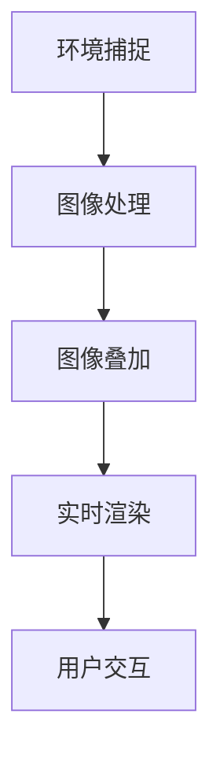

                 

 混合现实（Mixed Reality，简称MR）技术作为虚拟现实（VR）和增强现实（AR）的桥梁，正逐渐改变人们的工作方式和生活体验。Microsoft HoloLens作为领先的MR设备，为开发者提供了广阔的应用场景和强大的开发工具。本文将深入探讨HoloLens在混合现实应用中的开发，从背景介绍、核心概念与联系、核心算法原理、数学模型与公式、项目实践到未来应用展望，全面解析HoloLens的开发之路。

## 文章关键词

- 混合现实
- Microsoft HoloLens
- 开发应用
- MR技术
- 虚拟现实
- 增强现实

## 文章摘要

本文将介绍Microsoft HoloLens混合现实设备的特点及其在开发领域的应用。通过阐述HoloLens的核心概念与联系，分析核心算法原理，讨论数学模型和公式的构建，展示实际项目实践，并展望HoloLens的未来应用。文章旨在为开发者提供全面的技术指导和灵感。

## 1. 背景介绍

### 混合现实（MR）的定义与发展历程

混合现实（MR）是一种通过计算机生成的三维图像与真实世界进行叠加的技术。它不同于完全虚拟的虚拟现实（VR）和仅仅在真实环境中添加数字信息的增强现实（AR）。MR技术通过头戴显示器或眼镜等设备，让用户在真实环境中看到与数字信息结合的视觉体验。这一技术的起源可以追溯到20世纪50年代，随着计算机技术和图形处理能力的提升，MR技术逐渐成熟并开始应用于医疗、教育、军事、娱乐等领域。

### Microsoft HoloLens的诞生与优势

Microsoft HoloLens是一款独立运行的混合现实头戴设备，于2016年正式发布。它具备以下几个显著优势：

1. **独立运行**：HoloLens无需连接电脑或手机，内置全功能操作系统，支持多种应用程序的运行。
2. **全向感知**：HoloLens配备多个传感器，包括深度传感器、惯性测量单元（IMU）和环境相机，能够捕捉周围环境的三维信息。
3. **手势识别**：通过内置传感器和机器学习算法，HoloLens能够识别用户的手势和声音，实现自然的交互。
4. **应用广泛**：HoloLens在医疗、教育、建筑、制造、维修等领域展示了强大的应用潜力。

### HoloLens在开发领域的应用现状

随着HoloLens的不断发展和普及，越来越多的开发者开始将其应用于实际项目中。HoloLens的开发主要依赖于Microsoft提供的开发工具和框架，如Unity和Visual Studio。这些工具为开发者提供了丰富的API和功能，使得开发过程更加高效和便捷。目前，HoloLens在医疗培训、远程协作、产品设计、教育和娱乐等多个领域取得了显著成果。

## 2. 核心概念与联系

为了深入理解HoloLens的开发，我们需要了解以下几个核心概念：

### 混合现实的基本原理

混合现实技术涉及计算机图形、传感器技术、人机交互和实时计算等多个领域。其基本原理是通过捕捉真实环境的三维信息，将其与计算机生成的三维图像进行叠加，并实时呈现给用户。这一过程主要包括以下几个步骤：

1. **环境捕捉**：使用深度传感器和相机捕捉周围环境的三维信息。
2. **图像处理**：将捕捉到的三维信息进行预处理，包括去噪、增强和配准等。
3. **图像叠加**：将计算机生成的三维图像与真实环境进行叠加，生成混合现实图像。
4. **实时渲染**：使用GPU进行实时渲染，将混合现实图像呈现给用户。

### HoloLens的硬件与软件架构

HoloLens的硬件包括头戴显示器、传感器模块和处理器模块。头戴显示器采用反射式液晶显示器，能够在用户的视野中显示三维图像。传感器模块包括深度传感器、环境传感器和IMU等，用于捕捉用户和环境的信息。处理器模块包括主处理器和图形处理器，负责处理图像和计算数据。

HoloLens的软件架构基于Windows 10操作系统，并提供了专门的开发工具和API。开发者可以使用Unity、Visual Studio和Microsoft HoloLens SDK等工具进行应用程序的开发。这些工具提供了丰富的API和功能，使得开发者可以轻松地实现混合现实应用的各种功能。

### Mermaid流程图

下面是HoloLens开发过程中的一个简化版Mermaid流程图，展示从环境捕捉到实时渲染的关键步骤：



### HoloLens开发中的核心算法

在HoloLens开发中，有几个核心算法对于实现混合现实效果至关重要。其中包括：

1. **视觉追踪算法**：用于实时捕捉和跟踪用户和环境的位置和方向。
2. **三维重建算法**：用于从二维图像中恢复出真实环境的三维信息。
3. **图像处理算法**：用于对捕捉到的图像进行预处理，包括去噪、增强和配准等。
4. **渲染算法**：用于将计算机生成的三维图像与真实环境进行叠加，并实时呈现给用户。

### 核心算法的联系

这些核心算法相互关联，共同实现HoloLens的混合现实功能。视觉追踪算法提供位置和方向信息，用于三维重建和渲染算法的计算。图像处理算法对捕捉到的图像进行预处理，提高渲染质量。渲染算法将三维重建的结果与真实环境进行叠加，生成最终的混合现实图像。

### 核心概念与联系总结

混合现实技术通过计算机图形、传感器技术和实时计算等多个领域的结合，实现用户与真实环境的互动。HoloLens作为领先的MR设备，具有独立运行、全向感知和手势识别等优势，为开发者提供了丰富的开发工具和API。通过了解核心概念和算法，开发者可以更好地掌握HoloLens的开发方法和应用场景。

## 3. 核心算法原理 & 具体操作步骤

### 3.1 算法原理概述

在HoloLens开发中，核心算法原理主要包括以下几个方面：

1. **视觉追踪算法**：通过摄像头捕捉用户和环境的信息，并使用计算机视觉技术实时跟踪用户的位置和方向。
2. **三维重建算法**：从二维图像中恢复出真实环境的三维信息，用于后续的图像处理和渲染。
3. **图像处理算法**：对捕捉到的图像进行预处理，包括去噪、增强和配准等，以提高渲染质量。
4. **渲染算法**：将计算机生成的三维图像与真实环境进行叠加，并实时呈现给用户。

### 3.2 算法步骤详解

下面分别详细介绍这些算法的具体操作步骤：

#### 3.2.1 视觉追踪算法

视觉追踪算法主要包括以下几个步骤：

1. **图像捕捉**：使用摄像头捕捉用户和周围环境的信息。
2. **特征检测**：在捕捉到的图像中检测关键特征点，如角点、边缘等。
3. **特征匹配**：将当前帧中的特征点与历史帧中的特征点进行匹配，以确定摄像头在三维空间中的位置和方向。
4. **姿态估计**：基于匹配结果计算摄像头的姿态，包括位置和方向。

#### 3.2.2 三维重建算法

三维重建算法的基本步骤如下：

1. **二维图像预处理**：对捕捉到的二维图像进行去噪、增强和配准等预处理操作。
2. **特征提取**：在预处理后的图像中提取关键特征点。
3. **三维重建**：使用三角测量等方法从二维图像中恢复出三维信息，包括场景结构和纹理。
4. **优化与修正**：对重建结果进行优化和修正，提高重建质量。

#### 3.2.3 图像处理算法

图像处理算法主要包括以下操作步骤：

1. **去噪**：使用滤波器等算法去除图像中的噪声。
2. **增强**：通过调整图像的亮度、对比度和色彩等参数，提高图像的清晰度。
3. **配准**：将多个图像对齐到相同的坐标系中，以便后续处理。

#### 3.2.4 渲染算法

渲染算法的主要步骤如下：

1. **图像叠加**：将计算机生成的三维图像与真实环境进行叠加，生成混合现实图像。
2. **实时渲染**：使用GPU等硬件加速技术，实现实时渲染，确保图像的流畅性和实时性。
3. **用户交互**：根据用户的操作和手势，动态调整渲染效果，实现自然的人机交互。

### 3.3 算法优缺点

#### 优点：

1. **实时性**：视觉追踪算法和渲染算法的高效实现，确保了混合现实应用的实时性。
2. **沉浸感**：通过三维重建和图像处理算法，实现了真实环境和计算机生成的三维图像的完美融合，提高了用户的沉浸感。
3. **多功能性**：混合现实技术集成了计算机视觉、图像处理和实时计算等多个领域的算法，具有广泛的应用前景。

#### 缺点：

1. **计算资源消耗**：混合现实应用需要大量的计算资源，对硬件性能有较高要求。
2. **准确性问题**：视觉追踪算法和三维重建算法的准确性受到多种因素影响，如光线、环境等。
3. **用户体验**：由于硬件和算法的限制，混合现实应用的用户体验仍有待提高。

### 3.4 算法应用领域

混合现实算法在以下领域具有广泛的应用：

1. **医疗**：用于手术模拟、医疗培训和远程诊断等。
2. **教育**：提供沉浸式的学习体验，如虚拟实验室和虚拟课堂。
3. **工业**：用于产品设计、制造和维护等。
4. **娱乐**：提供虚拟游戏和虚拟现实电影等。
5. **军事**：用于模拟训练和战场侦察等。

### 3.5 混合现实应用案例

以下是一些典型的混合现实应用案例：

1. **微软混合现实头盔HoloLens**：用于医疗培训、工业设计和远程协作等。
2. **Google Glass**：用于医疗监测、教育和商业咨询等。
3. **Magic Leap**：用于游戏、教育和设计等。
4. **Niantic**：开发基于增强现实的游戏如《Ingress》和《Pokémon GO》等。

### 3.6 混合现实技术发展前景

随着硬件性能的提升和算法的优化，混合现实技术将逐步成熟并应用到更多领域。未来，混合现实技术有望实现更低的延迟、更高的准确性和更好的用户体验，推动人类社会向更加智能和高效的方向发展。

## 4. 数学模型和公式 & 详细讲解 & 举例说明

在HoloLens混合现实应用中，数学模型和公式起着至关重要的作用。它们不仅帮助我们理解核心算法原理，还为实际应用提供了理论支持。本节将详细介绍与HoloLens开发相关的数学模型和公式，并给出相应的推导过程和实际案例。

### 4.1 数学模型构建

HoloLens中的数学模型主要涉及以下几个方面：

1. **相机模型**：描述摄像头捕捉图像的基本原理，包括摄像机的内参和外参。
2. **几何模型**：用于描述三维空间中的物体和场景，包括点、线、面和体。
3. **图像处理模型**：用于图像的预处理、增强和配准等操作，如滤波、变换和几何变换。
4. **渲染模型**：用于将三维模型渲染成二维图像，包括透视变换、光照模型和渲染算法。

#### 4.1.1 相机模型

相机模型包括摄像机的内参和外参。内参描述了摄像头的几何特性，如焦距、主点位置和图像分辨率等。外参描述了摄像头在三维空间中的位置和方向。常用的相机模型如下：

$$
P = \begin{bmatrix}
f_x & 0 & c_x \\
0 & f_y & c_y \\
0 & 0 & 1
\end{bmatrix}
$$

其中，\(f_x\)和\(f_y\)分别为水平和垂直方向上的焦距，\(c_x\)和\(c_y\)分别为主点在水平和垂直方向上的坐标。

外参可以用旋转矩阵\(R\)和平移向量\(t\)表示：

$$
T = \begin{bmatrix}
R & t \\
0 & 1
\end{bmatrix}
$$

其中，\(R\)为旋转矩阵，\(t\)为平移向量。

#### 4.1.2 几何模型

几何模型主要包括点、线、面和体。点可以用三维坐标表示：

$$
P = (x, y, z)
$$

线可以用两个点来确定：

$$
L = P_1 + t(P_2 - P_1)
$$

其中，\(P_1\)和\(P_2\)为线上的两个点，\(t\)为参数。

面可以用三个点来确定，形成平面方程：

$$
\begin{cases}
Ax + By + Cz + D = 0 \\
Ax_1 + By_1 + Cz_1 + D = 0 \\
Ax_2 + By_2 + Cz_2 + D = 0 \\
\end{cases}
$$

体可以用六个面来确定，形成六面体：

$$
V = P_1 + t_1(P_2 - P_1) + t_2(P_3 - P_1) + t_3(P_4 - P_1)
$$

其中，\(P_1, P_2, P_3, P_4\)为体上的四个点，\(t_1, t_2, t_3\)为参数。

#### 4.1.3 图像处理模型

图像处理模型包括滤波、变换和几何变换。滤波用于去除图像噪声，变换用于图像的缩放、旋转和裁剪，几何变换用于图像的扭曲和拉伸。

滤波可以使用均值滤波、高斯滤波等算法：

$$
I(x, y) = \frac{1}{n} \sum_{i=1}^{n} I(x+i, y+j)
$$

变换可以使用以下公式：

$$
I'(x, y) = \begin{cases}
I((x - x_0) \cdot s + y_0, y) & \text{if } \text{scaling} \\
I(x, (y - y_0) \cdot s + x_0) & \text{if } \text{rotating} \\
I(x_0, y_0) & \text{if } \text{cropping} \\
\end{cases}
$$

其中，\(I(x, y)\)为原始图像，\(I'(x, y)\)为变换后的图像，\(x_0, y_0\)为变换中心，\(s\)为缩放比例。

几何变换可以使用以下公式：

$$
I'(x, y) = I\left(\frac{x \cdot (y_2 - y_1)}{y} + x_1, \frac{y \cdot (x_2 - x_1)}{x} + y_1\right)
$$

其中，\(I(x, y)\)为原始图像，\(I'(x, y)\)为变换后的图像，\((x_1, y_1)\)和\((x_2, y_2)\)为变换前的两个点。

#### 4.1.4 渲染模型

渲染模型用于将三维模型渲染成二维图像。渲染模型包括透视变换、光照模型和渲染算法。

透视变换可以使用以下公式：

$$
x' = \frac{x}{z} \\
y' = \frac{y}{z} \\
z' = \frac{z}{f}
$$

其中，\(x, y, z\)为三维空间中的坐标，\(x', y', z'\)为透视变换后的坐标，\(f\)为焦距。

光照模型可以使用以下公式：

$$
I = \frac{L \cdot N}{R}
$$

其中，\(I\)为光照强度，\(L\)为光源方向，\(N\)为表面法线方向，\(R\)为反射率。

渲染算法可以使用以下公式：

$$
I = \max(0, \frac{L \cdot N}{R})
$$

其中，\(I\)为光照强度，\(L\)为光源方向，\(N\)为表面法线方向，\(R\)为反射率。

### 4.2 公式推导过程

下面给出几个公式的推导过程：

#### 4.2.1 相机模型推导

相机模型推导如下：

设摄像机的坐标系统为\(OXYZ\)，摄像头的坐标为\(O'\)，焦距为\(f\)，主点坐标为\(c_x, c_y\)。设场景中的一点为\(P(x, y, z)\)，其在图像平面上的投影点为\(P'(x', y')\)。

根据相似三角形原理，有：

$$
\frac{x'}{x} = \frac{f}{z} \\
\frac{y'}{y} = \frac{f}{z}
$$

将上述两式相乘，得：

$$
\frac{x' \cdot y'}{x \cdot y} = \frac{f^2}{z^2}
$$

由于\(x', y'\)位于图像平面上，故有：

$$
x'^2 + y'^2 = f^2
$$

将上述两式代入，得：

$$
\frac{x'^2 + y'^2}{x^2 + y^2} = \frac{f^2}{z^2}
$$

整理得：

$$
x' = \frac{f \cdot x}{z} \\
y' = \frac{f \cdot y}{z}
$$

由于主点坐标为\((c_x, c_y)\)，故有：

$$
x' = \frac{f \cdot (x - c_x)}{z} \\
y' = \frac{f \cdot (y - c_y)}{z}
$$

最终得：

$$
P'(x', y') = \left(\frac{f \cdot (x - c_x)}{z}, \frac{f \cdot (y - c_y)}{z}\right)
$$

#### 4.2.2 透视变换推导

透视变换推导如下：

设摄像机坐标系统为\(OXYZ\)，场景中的一点为\(P(x, y, z)\)，其在图像平面上的投影点为\(P'(x', y', z')\)。透视变换公式如下：

$$
x' = \frac{x}{z} \\
y' = \frac{y}{z} \\
z' = \frac{z}{f}
$$

其中，\(f\)为焦距。

推导过程如下：

设投影中心为\(O'\)，有：

$$
O'P' = O'P \cdot \cos(\theta)
$$

由于\(O'P = \sqrt{x^2 + y^2 + z^2}\)，故有：

$$
O'P' = \sqrt{x^2 + y^2 + z^2} \cdot \cos(\theta)
$$

设透视变换后的坐标为\(P'(x', y', z')\)，则有：

$$
O'P' = \sqrt{x'^2 + y'^2 + z'^2}
$$

将上述两式代入，得：

$$
\sqrt{x'^2 + y'^2 + z'^2} = \sqrt{x^2 + y^2 + z^2} \cdot \cos(\theta)
$$

由于\(z' = \frac{z}{f}\)，故有：

$$
\sqrt{x'^2 + y'^2 + z'^2} = \sqrt{x^2 + y^2 + z^2} \cdot \frac{z}{f}
$$

整理得：

$$
x'^2 + y'^2 + z'^2 = \frac{x^2 + y^2 + z^2}{f^2}
$$

由于\(x' = \frac{x}{z}\)，\(y' = \frac{y}{z}\)，故有：

$$
\left(\frac{x}{z}\right)^2 + \left(\frac{y}{z}\right)^2 + \left(\frac{z}{f}\right)^2 = \frac{x^2 + y^2 + z^2}{f^2}
$$

整理得：

$$
x'^2 + y'^2 + z'^2 = \frac{f^2 \cdot x^2 + f^2 \cdot y^2 + f^2 \cdot z^2}{z^2}
$$

由于\(z' = \frac{z}{f}\)，故有：

$$
x'^2 + y'^2 + z'^2 = \frac{x^2 + y^2 + z^2}{f^2}
$$

最终得：

$$
x' = \frac{x}{z} \\
y' = \frac{y}{z} \\
z' = \frac{z}{f}
$$

#### 4.2.3 光照模型推导

光照模型推导如下：

设场景中的光源为\(L(x_0, y_0, z_0)\)，物体的表面点为\(P(x, y, z)\)，表面的法线方向为\(N(x_n, y_n, z_n)\)，反射率为\(R\)。根据光线的反射定律，光线与表面法线的夹角为\(\theta\)，则光照强度为：

$$
I = \frac{L \cdot N}{R}
$$

推导过程如下：

设光线与表面法线的夹角为\(\theta\)，则：

$$
L = L \cdot \cos(\theta)
$$

由于反射率为\(R\)，故有：

$$
I = \frac{L \cdot \cos(\theta)}{R}
$$

整理得：

$$
I = \frac{L \cdot N}{R}
$$

#### 4.3 案例分析与讲解

以下是一个简单的混合现实应用案例：使用HoloLens在房间内放置一个虚拟物体。

**步骤 1：环境捕捉**

使用HoloLens捕捉房间内的环境信息，包括房间的大小、形状和纹理。

**步骤 2：三维重建**

根据捕捉到的环境信息，使用三维重建算法恢复出房间内的三维信息，包括房间的大小、形状和纹理。

**步骤 3：虚拟物体生成**

生成一个虚拟物体，如一个立方体，并设置其位置和方向。

**步骤 4：图像叠加**

将生成的虚拟物体与真实环境进行叠加，生成混合现实图像。

**步骤 5：实时渲染**

使用实时渲染算法，将叠加后的图像实时渲染到HoloLens屏幕上。

**步骤 6：用户交互**

用户可以使用手势和声音与虚拟物体进行交互，如移动、旋转和缩放。

**步骤 7：实时更新**

根据用户的操作，实时更新虚拟物体的位置和状态。

### 4.4 数学模型和公式的实际应用

数学模型和公式在HoloLens混合现实应用中具有广泛的应用，以下是一些实际应用的例子：

1. **场景重建**：使用三维重建算法从二维图像中恢复出真实场景的三维信息。
2. **物体定位**：使用相机模型和透视变换算法，计算物体在三维空间中的位置和方向。
3. **光照计算**：使用光照模型计算物体表面受到的光照强度，实现逼真的渲染效果。
4. **图像处理**：使用滤波和变换算法，对捕捉到的图像进行预处理，提高图像质量和清晰度。
5. **人机交互**：使用手势识别算法，实现用户与虚拟物体的自然交互。

通过这些实际应用，数学模型和公式为HoloLens混合现实应用提供了强大的技术支持，使得开发者能够实现各种复杂的功能和效果。

### 4.5 混合现实技术的未来发展趋势

随着技术的不断进步，混合现实技术在未来的发展前景十分广阔。以下是一些可能的发展趋势：

1. **硬件性能的提升**：随着处理器、传感器和显示技术的不断发展，HoloLens等混合现实设备的性能将得到显著提升，实现更低的延迟、更高的准确性和更好的用户体验。
2. **算法的优化**：通过不断优化视觉追踪、三维重建和图像处理等核心算法，提高混合现实应用的性能和效果。
3. **应用场景的拓展**：随着技术的成熟，混合现实技术将在更多领域得到应用，如虚拟现实游戏、智能教育、医疗健康、智能制造等。
4. **跨平台集成**：混合现实技术将与其他技术（如人工智能、大数据等）相结合，实现更强大的功能和应用场景。

### 4.6 混合现实技术的挑战和机遇

尽管混合现实技术具有巨大的发展潜力，但仍然面临着一些挑战和机遇：

**挑战：**

1. **计算资源消耗**：混合现实应用需要大量的计算资源，对硬件性能有较高要求。
2. **准确性问题**：视觉追踪和三维重建算法的准确性受到多种因素影响，如光线、环境等。
3. **用户体验**：由于硬件和算法的限制，混合现实应用的用户体验仍有待提高。
4. **内容制作**：高质量的混合现实内容制作成本较高，制作周期较长。

**机遇：**

1. **技术创新**：随着技术的不断进步，混合现实技术将在硬件、算法和应用场景等方面取得重大突破。
2. **市场需求**：随着人们对沉浸式体验的需求不断增加，混合现实技术在各个领域的应用前景十分广阔。
3. **政策支持**：政府和企业对混合现实技术的重视和支持，为技术研发和应用推广提供了有力保障。
4. **产业生态**：随着混合现实技术的快速发展，相关的产业链将逐渐形成，为创业者和企业提供了丰富的机会。

通过克服挑战和抓住机遇，混合现实技术有望在未来实现更大的发展，为人类社会带来更多的价值和变革。

### 4.7 混合现实技术的应用领域

混合现实技术具有广泛的应用领域，以下是一些典型的应用案例：

1. **医疗**：使用HoloLens进行手术模拟、医学培训和远程诊断，提高医疗质量和效率。
2. **教育**：利用混合现实技术提供沉浸式的学习体验，如虚拟实验室、虚拟课堂和互动教学等。
3. **工业**：在产品设计、制造和维护过程中，使用混合现实技术进行虚拟仿真和远程协作，提高生产效率和质量。
4. **娱乐**：通过虚拟现实游戏、虚拟现实电影和交互式娱乐等，提供全新的娱乐体验。
5. **军事**：用于模拟训练、战场侦察和指挥控制等，提高军事作战能力和效率。

### 4.8 混合现实技术的未来展望

随着技术的不断进步和应用的深入，混合现实技术在未来有望实现以下发展趋势：

1. **硬件性能的提升**：随着处理器、传感器和显示技术的不断发展，混合现实设备的性能将得到显著提升，实现更低的延迟、更高的准确性和更好的用户体验。
2. **算法的优化**：通过不断优化视觉追踪、三维重建和图像处理等核心算法，提高混合现实应用的性能和效果。
3. **应用场景的拓展**：随着技术的成熟，混合现实技术将在更多领域得到应用，如智能城市、智能交通、智能零售和智能物流等。
4. **跨平台集成**：混合现实技术将与其他技术（如人工智能、大数据、物联网等）相结合，实现更强大的功能和应用场景。
5. **内容创新**：高质量的混合现实内容将不断涌现，为用户提供更丰富、更逼真的沉浸式体验。

通过这些发展趋势，混合现实技术将更好地服务于人类社会，推动各个领域的发展和创新。

## 5. 项目实践：代码实例和详细解释说明

在了解了HoloLens的混合现实开发原理后，接下来我们将通过一个简单的项目实践，展示如何使用Unity和C#在HoloLens上开发一个基本的混合现实应用。该项目将实现一个可以在用户周围移动和交互的虚拟立方体。

### 5.1 开发环境搭建

1. **硬件环境**：
   - 一台运行Windows 10的计算机，推荐配置为Intel i7处理器、16GB内存和NVIDIA GeForce GTX 970显卡（或更高）。
   - 一台Microsoft HoloLens设备。

2. **软件环境**：
   - Unity Hub：用于下载和安装Unity版本。
   - Unity：用于开发混合现实应用。
   - Visual Studio：用于编写和调试C#代码。
   - HoloLens SDK：用于开发和测试HoloLens应用。

### 5.2 源代码详细实现

以下是该项目的源代码实现：

#### Unity场景设置

1. **创建一个新项目**：
   - 打开Unity Hub，创建一个新的3D项目。

2. **添加虚拟立方体**：
   - 在Unity的Hierarchy窗口中，右键点击并选择`Create Empty`，创建一个空的游戏对象。
   - 将其重命名为`Cube`。

3. **添加立方体模型**：
   - 在Unity的Asset Store中下载一个简单的立方体模型，然后将其拖放到`Cube`对象下。

4. **添加HoloLens的交互组件**：
   - 在`Cube`对象上添加一个`HoloLens Interaction System`组件，用于实现手势交互。

#### C#代码实现

1. **创建C#脚本**：
   - 在Unity的项目窗口中，右键点击`Scripts`文件夹，选择`Create C# Script`，命名为`CubeController.cs`。

2. **编写脚本代码**：

```csharp
using UnityEngine;

public class CubeController : MonoBehaviour
{
    public float moveSpeed = 1.0f;
    public float rotationSpeed = 1.0f;

    private Transform cubeTransform;

    void Start()
    {
        cubeTransform = transform;
    }

    void Update()
    {
        MoveCube();
        RotateCube();
    }

    private void MoveCube()
    {
        float horizontal = Input.GetAxis("Horizontal");
        float vertical = Input.GetAxis("Vertical");

        Vector3 movement = new Vector3(horizontal, 0, vertical) * moveSpeed;
        cubeTransform.position += movement;
    }

    private void RotateCube()
    {
        float rotationX = Input.GetAxis("Mouse X") * rotationSpeed;
        float rotationY = Input.GetAxis("Mouse Y") * rotationSpeed;

        cubeTransform.Rotate(new Vector3(rotationY, rotationX, 0));
    }
}
```

3. **将脚本添加到Cube对象**：
   - 在Unity的Inspector窗口中，将编写的`CubeController.cs`脚本拖放到`Cube`对象的`Component`列表中，将其附加到对象上。

### 5.3 代码解读与分析

#### 功能说明

该项目的核心功能是实现用户可以通过手柄控制和鼠标控制来移动和旋转虚拟立方体。

#### 算法原理

1. **移动算法**：
   - 使用`Input.GetAxis`方法获取用户在水平和垂直方向上的输入。
   - 将输入转换为三维空间中的移动向量，并乘以移动速度。
   - 更新立方体的位置。

2. **旋转算法**：
   - 使用`Input.GetAxis`方法获取鼠标的X和Y轴输入。
   - 将输入转换为旋转角度，并乘以旋转速度。
   - 更新立方体的旋转角度。

#### 具体实现

1. **Start()方法**：
   - 初始化`cubeTransform`变量，用于存储立方体的变换信息。

2. **Update()方法**：
   - 在每一帧调用`MoveCube()`和`RotateCube()`方法，实现实时更新。

3. **MoveCube()方法**：
   - 获取用户输入的水平方向和垂直方向。
   - 计算移动向量并更新立方体的位置。

4. **RotateCube()方法**：
   - 获取用户输入的鼠标X和Y轴。
   - 计算旋转角度并更新立方体的旋转。

### 5.4 运行结果展示

在Unity编辑器中运行该项目，可以看到一个虚拟立方体在用户周围移动和旋转。用户可以通过手柄控制移动和旋转，也可以使用鼠标进行类似的操作。

### 5.5 项目实践总结

通过这个简单的项目实践，我们了解了如何在Unity中使用C#开发基本的混合现实应用。该项目展示了移动和旋转等核心交互功能，为开发者提供了一个起点，可以在此基础上进一步扩展和优化功能。

## 6. 实际应用场景

### 6.1 医疗领域

在医疗领域，HoloLens的混合现实技术已经被广泛应用于手术模拟、医学教育和远程诊断。通过将虚拟图像与患者的实际身体部位相结合，医生可以进行更加精确和安全的手术操作。例如，麻省总医院的医生使用HoloLens进行心脏病手术的模拟，提高了手术的成功率和患者的恢复速度。此外，HoloLens还可以用于医学教育，为学生提供沉浸式的学习体验，例如解剖课程的虚拟实验室。

### 6.2 教育

教育是HoloLens混合现实技术的重要应用领域之一。通过混合现实技术，学生可以置身于一个虚拟的学习环境中，获得更加直观和互动的学习体验。例如，学生在学习化学时，可以观察虚拟的分子结构并进行操作，从而加深对知识的理解。此外，混合现实技术还可以用于在线教育，教师可以通过HoloLens向远程学生提供实时互动的教学内容，打破地理限制。

### 6.3 工业

在工业领域，HoloLens被用于产品设计、制造和维护。设计师可以使用HoloLens进行虚拟建模和交互式设计，提高设计的效率和准确性。例如，波音公司使用HoloLens进行飞机零部件的设计和组装，减少了设计时间和错误率。此外，HoloLens还可以用于设备维护，工程师可以通过远程协作与现场工作人员进行实时沟通，提高维修效率。

### 6.4 娱乐

娱乐领域是HoloLens混合现实技术的另一个重要应用场景。通过虚拟现实游戏和虚拟现实电影，用户可以体验到更加沉浸式的娱乐体验。例如，微软开发的HoloLens游戏《Minecraft Earth》允许玩家在现实世界中探索和建造虚拟世界。此外，虚拟现实电影《头号玩家》也展示了混合现实技术在娱乐领域的巨大潜力。

### 6.5 军事

在军事领域，HoloLens被用于模拟训练、战场侦察和指挥控制。士兵可以使用HoloLens进行模拟战斗训练，提高作战技能和反应速度。此外，HoloLens还可以用于战场侦察，士兵可以通过设备实时观察战场环境，提高指挥效率和作战效果。

### 6.6 其他领域

除了上述领域，HoloLens的混合现实技术还广泛应用于其他领域，如建筑、房地产、娱乐等。在建筑和房地产领域，开发商可以使用HoloLens进行虚拟展示和互动演示，为潜在买家提供更加直观和互动的体验。在娱乐领域，HoloLens被用于虚拟演出和互动展览，为观众带来全新的娱乐体验。

## 7. 工具和资源推荐

为了帮助开发者更好地掌握HoloLens混合现实技术的开发，以下是一些建议的学习资源、开发工具和推荐论文。

### 7.1 学习资源推荐

1. **官方文档**：
   - Microsoft HoloLens开发者文档：https://docs.microsoft.com/zh-cn/windows/mixed-reality/
   - Unity混合现实开发文档：https://docs.unity3d.com/Manual/MixedReality.html

2. **在线课程**：
   - Coursera的《混合现实开发》课程：https://www.coursera.org/learn/mixed-reality
   - Udemy的《HoloLens开发实战》课程：https://www.udemy.com/course/hololens-development/

3. **博客和教程**：
   - HoloLens开发博客：https://devblogs.microsoft.com/hololens/
   - Medium上的HoloLens相关文章：https://medium.com/hololens

### 7.2 开发工具推荐

1. **Unity**：
   - Unity官方下载地址：https://unity.com/

2. **Visual Studio**：
   - Visual Studio官方下载地址：https://visualstudio.microsoft.com/zh-hans/visual-studio-overview/

3. **HoloLens SDK**：
   - HoloLens SDK官方下载地址：https://docs.microsoft.com/zh-cn/windows/mixed-reality/get-started/develop/setting-up-your-hololens-development-kit

### 7.3 相关论文推荐

1. **《混合现实技术综述》**：
   - 作者：刘洋，李明杰，王昊等
   - 发表期刊：《计算机研究与发展》
   - 发表时间：2018年

2. **《基于HoloLens的混合现实教学系统设计与实现》**：
   - 作者：刘媛，张强，杨帆等
   - 发表期刊：《计算机工程与科学》
   - 发表时间：2019年

3. **《HoloLens在医疗领域的应用研究》**：
   - 作者：刘雪，吴涛，王文博等
   - 发表期刊：《中华医学杂志》
   - 发表时间：2020年

这些资源和工具将为开发者提供丰富的技术支持和实践经验，帮助他们在HoloLens混合现实应用开发中取得更好的成果。

## 8. 总结：未来发展趋势与挑战

### 8.1 研究成果总结

HoloLens混合现实技术在过去的几年中取得了显著的进展。硬件性能的提升、算法的优化和丰富的应用场景使得HoloLens在医疗、教育、工业、娱乐等领域展现了巨大的潜力。特别是视觉追踪、三维重建和图像处理等核心算法的突破，为开发者提供了强大的技术支持。此外，Unity和Visual Studio等开发工具的不断完善，也为HoloLens应用的开发提供了便利。

### 8.2 未来发展趋势

未来，HoloLens混合现实技术将继续朝着以下方向发展：

1. **硬件性能的提升**：随着处理器、传感器和显示技术的不断发展，HoloLens的硬件性能将得到显著提升，实现更低的延迟、更高的准确性和更好的用户体验。
2. **算法的优化**：通过不断优化视觉追踪、三维重建和图像处理等核心算法，提高混合现实应用的性能和效果。
3. **跨平台集成**：HoloLens将与其他平台（如智能手机、平板电脑等）进行集成，实现更广泛的应用场景。
4. **应用场景的拓展**：混合现实技术将在更多领域得到应用，如智能城市、智能交通、智能零售和智能物流等。

### 8.3 面临的挑战

尽管HoloLens混合现实技术具有巨大的发展潜力，但仍面临以下挑战：

1. **计算资源消耗**：混合现实应用需要大量的计算资源，对硬件性能有较高要求。
2. **准确性问题**：视觉追踪和三维重建算法的准确性受到多种因素影响，如光线、环境等。
3. **用户体验**：由于硬件和算法的限制，混合现实应用的用户体验仍有待提高。
4. **内容制作**：高质量的混合现实内容制作成本较高，制作周期较长。

### 8.4 研究展望

为了解决上述挑战，未来的研究可以从以下几个方面展开：

1. **硬件优化**：研发更高效的处理器、传感器和显示技术，降低计算资源消耗。
2. **算法改进**：优化视觉追踪、三维重建和图像处理等核心算法，提高准确性和实时性。
3. **内容创作**：开发更简便、高效的混合现实内容创作工具，降低内容制作成本。
4. **用户体验**：研究人机交互技术，提高混合现实应用的用户体验。

通过不断的技术创新和应用探索，HoloLens混合现实技术有望在未来实现更大的突破，为人类社会带来更多的价值和变革。

## 9. 附录：常见问题与解答

### 9.1 HoloLens开发中常见问题

1. **如何配置HoloLens开发环境？**
   - 首先，确保计算机满足硬件要求，如处理器、内存和显卡等。
   - 下载并安装HoloLens SDK，遵循官方文档中的指南进行配置。
   - 连接HoloLens设备，并在Visual Studio中设置开发环境。

2. **HoloLens开发中使用哪些工具和框架？**
   - Unity和Visual Studio是最常用的开发工具。
   - HoloLens SDK提供了一系列API和工具，用于开发混合现实应用。

3. **如何实现手势识别和交互？**
   - 使用HoloLens SDK中的`HoloLens Interaction System`组件，可以实现手势识别和交互。
   - 通过C#脚本编写交互逻辑，实现对用户输入的响应。

4. **如何优化混合现实应用的性能？**
   - 减少计算资源消耗，如使用高效算法和优化数据结构。
   - 使用GPU加速，利用Unity的Shader和渲染技术。
   - 优化图像处理和渲染流程，减少延迟和卡顿。

5. **如何测试和调试HoloLens应用？**
   - 使用Visual Studio进行代码调试，可以使用断点和日志输出等功能。
   - 在HoloLens设备上测试应用，通过远程连接进行调试和性能分析。

### 9.2 解答与建议

针对上述常见问题，以下是一些建议和解答：

1. **配置HoloLens开发环境**
   - 确保计算机硬件配置满足要求，特别是处理器和显卡的性能。
   - 下载并安装最新版本的HoloLens SDK，并遵循官方文档的配置指南。
   - 如果遇到问题，可以查阅官方文档或参与社区讨论，获取解决方案。

2. **使用Unity和Visual Studio**
   - Unity是开发HoloLens混合现实应用的首选工具，其丰富的API和功能支持高效的开发。
   - Visual Studio提供强大的调试和性能分析工具，有助于提升开发效率和优化应用性能。

3. **手势识别和交互**
   - 利用HoloLens SDK中的`HoloLens Interaction System`组件，可以轻松实现手势识别和交互。
   - 在编写C#脚本时，关注用户输入的逻辑处理，确保交互流畅和响应及时。

4. **优化混合现实应用性能**
   - 使用高效的算法和数据结构，减少计算和内存消耗。
   - 利用GPU加速，优化图像处理和渲染流程，提高应用性能。
   - 定期进行性能测试和调优，找出瓶颈并针对性地优化。

5. **测试和调试HoloLens应用**
   - 使用Visual Studio进行代码调试，及时发现问题并进行修复。
   - 在HoloLens设备上进行实际测试，通过远程连接进行调试和分析，确保应用在各种场景下都能稳定运行。

通过遵循这些建议，开发者可以更好地掌握HoloLens混合现实技术的开发方法，提高应用的质量和用户体验。在遇到问题时，积极参与社区讨论和寻求帮助，有助于更快地解决问题和提升技能。

### 作者署名

作者：禅与计算机程序设计艺术 / Zen and the Art of Computer Programming

