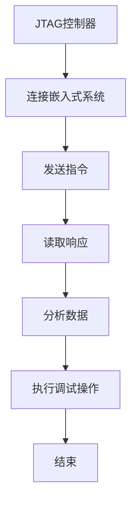

                 

关键词：JTAG、嵌入式系统、调试技术、系统级调试、调试工具

## 摘要

本文将深入探讨JTAG（Joint Test Action Group）调试技术，在嵌入式系统开发中的应用。JTAG是一种标准化的边界扫描测试协议，用于嵌入式系统的制造和测试，但其功能不仅限于测试，还包括对嵌入式系统的实时调试。本文将详细阐述JTAG的工作原理、架构、调试步骤及其在实际应用中的重要性，旨在为嵌入式系统开发者提供全面的调试指南。

## 1. 背景介绍

### JTAG的历史与发展

JTAG协议起源于1988年，由Joint Test Action Group（联合测试行动小组）提出。最初，JTAG主要用于芯片级的测试，以确保制造过程中每个芯片都能正常工作。随着嵌入式系统的发展，JTAG的功能逐渐扩展，包括系统级调试、故障分析、芯片级的升级等。如今，JTAG已经成为嵌入式系统开发中不可或缺的一部分。

### 嵌式系统的定义与重要性

嵌入式系统是指嵌入在其他设备中的计算机系统，它通常具有特定的功能，运行在特定的环境中。嵌入式系统广泛应用于消费电子、汽车、医疗设备、工业控制等领域。随着物联网（IoT）的发展，嵌入式系统的数量和复杂性不断增加，对调试技术的要求也越来越高。JTAG作为一种高效的调试工具，能够满足这些需求。

## 2. 核心概念与联系

### JTAG工作原理

JTAG是一种串行通信协议，它通过一组信号线（TCK、TMS、TDI、TDO）实现对嵌入式系统的访问和控制。其中，TCK是时钟信号，TMS是模式选择信号，TDI是数据输入信号，TDO是数据输出信号。

### JTAG架构

JTAG系统通常由测试寄存器（Test Register）、边界扫描寄存器（Boundary Scan Register）和指令寄存器（Instruction Register）组成。测试寄存器用于存储测试数据和命令，边界扫描寄存器用于扫描芯片的内部信号，指令寄存器用于选择操作指令。

### JTAG与嵌入式系统的联系

JTAG能够与嵌入式系统的CPU、Flash存储器、RAM等组件通信，从而实现对系统的调试。它不仅支持单芯片调试，还可以同时对多个芯片进行调试。

### Mermaid 流程图

以下是一个简化的JTAG调试流程的Mermaid流程图：



## 3. 核心算法原理 & 具体操作步骤

### 3.1 算法原理概述

JTAG调试算法基于串行通信原理，通过控制时钟信号（TCK）和数据信号（TDI/TDO）来实现对嵌入式系统的访问。其主要原理包括：

- **指令发送**：通过JTAG控制器发送指令到嵌入式系统。
- **数据传输**：通过TDI/TDO信号线进行数据传输。
- **状态监测**：通过监测TCK信号来同步指令和数据传输。
- **响应分析**：根据嵌入式系统的响应数据进行分析和调试。

### 3.2 算法步骤详解

1. **初始化**：设置JTAG控制器的工作模式，初始化TCK、TMS信号。
2. **发送指令**：通过JTAG控制器发送特定的指令到嵌入式系统。
3. **读取响应**：从TDO信号线读取嵌入式系统的响应数据。
4. **数据处理**：对读取到的响应数据进行解析和分析。
5. **调试操作**：根据分析结果进行相应的调试操作，如断点设置、变量修改等。
6. **重复步骤**：重复发送指令、读取响应等操作，直到完成调试。

### 3.3 算法优缺点

**优点**：

- **灵活性**：JTAG能够适应不同类型和规模的嵌入式系统。
- **高效性**：串行通信使得JTAG调试速度较快。
- **兼容性**：JTAG协议得到了广泛的支持和标准化。

**缺点**：

- **复杂性**：对于初学者来说，JTAG调试可能比较复杂。
- **硬件依赖**：JTAG调试需要专门的硬件支持。

### 3.4 算法应用领域

JTAG调试技术在以下领域有广泛应用：

- **嵌入式系统开发**：用于系统级的调试和测试。
- **芯片级调试**：用于单个芯片的调试和故障分析。
- **故障诊断**：用于嵌入式系统的故障诊断和修复。

## 4. 数学模型和公式 & 详细讲解 & 举例说明

### 4.1 数学模型构建

JTAG调试中的数学模型主要涉及串行通信的信号传输和状态转移。以下是一个简化的数学模型：

$$
\begin{aligned}
S &= \{s_0, s_1, s_2, \ldots\} & \text{状态集合} \\
T &= \{t_0, t_1, t_2, \ldots\} & \text{时钟信号集合} \\
D &= \{d_0, d_1, d_2, \ldots\} & \text{数据信号集合} \\
\end{aligned}
$$

### 4.2 公式推导过程

JTAG的调试过程可以表示为：

$$
\begin{aligned}
\text{状态转移} &= S \times T \rightarrow S \\
\text{数据传输} &= D \times T \rightarrow D \\
\end{aligned}
$$

其中，状态转移函数描述了在时钟信号作用下，系统状态的变化；数据传输函数描述了数据信号在时钟信号作用下的传输过程。

### 4.3 案例分析与讲解

假设我们需要调试一个简单的嵌入式系统，该系统包含一个CPU和一个Flash存储器。我们使用JTAG进行调试，以下是具体的操作步骤：

1. **初始化**：设置JTAG控制器的工作模式，初始化TCK、TMS信号。
2. **发送指令**：通过JTAG控制器发送读取Flash存储器数据的指令。
3. **读取响应**：从TDO信号线读取Flash存储器的数据。
4. **数据处理**：对读取到的数据进行解析和分析，确定数据是否正确。
5. **调试操作**：根据分析结果，决定是否继续读取数据或进行其他调试操作。

在这个案例中，JTAG的数学模型帮助我们理解了调试过程中的状态转移和数据传输，从而能够更有效地进行调试。

## 5. 项目实践：代码实例和详细解释说明

### 5.1 开发环境搭建

为了实践JTAG调试技术，我们首先需要搭建一个开发环境。以下是搭建过程：

1. **硬件准备**：准备一个支持JTAG调试的嵌入式开发板，例如STM32。
2. **软件准备**：安装支持JTAG调试的IDE，例如STM32CubeIDE。
3. **驱动安装**：安装相应的JTAG驱动程序，以确保IDE能够识别开发板。

### 5.2 源代码详细实现

以下是一个简单的STM32嵌入式系统JTAG调试的示例代码：

```c
#include "stm32f4xx.h"

void JTAG_Init(void) {
    // 初始化JTAG控制器
    // ...
}

void JTAG_Transmit(uint8_t data) {
    // 发送数据到JTAG控制器
    // ...
}

uint8_t JTAG_Receive(void) {
    // 从JTAG控制器接收数据
    // ...
}

int main(void) {
    JTAG_Init();
    
    while (1) {
        // 发送指令
        JTAG_Transmit(0x01);
        
        // 读取响应
        uint8_t response = JTAG_Receive();
        
        // 数据处理
        if (response == 0x01) {
            // 调试成功
        } else {
            // 调试失败
        }
    }
}
```

### 5.3 代码解读与分析

该代码首先初始化JTAG控制器，然后在一个无限循环中发送指令并读取响应，最后对响应数据进行处理。通过这个简单的示例，我们可以看到JTAG调试的基本流程。

### 5.4 运行结果展示

当运行该代码时，JTAG控制器将不断发送指令并读取响应，如果在规定时间内没有收到正确的响应，程序将报错。这表明我们的嵌入式系统可能存在故障，需要进一步调试。

## 6. 实际应用场景

### 6.1 嵌式系统故障诊断

JTAG调试技术广泛应用于嵌入式系统的故障诊断。例如，在汽车电子领域，JTAG可以帮助工程师快速定位故障，减少维修时间和成本。

### 6.2 芯片级调试

在芯片级调试中，JTAG技术可以实现对单个芯片的实时调试和故障分析，这对于提高芯片性能和可靠性至关重要。

### 6.3 系统集成测试

JTAG技术也常用于嵌入式系统的集成测试，通过JTAG可以实现对系统级各个组件的调试和验证，确保系统正常运行。

## 6.4 未来应用展望

随着物联网和人工智能的发展，嵌入式系统的数量和复杂性将不断增加，JTAG调试技术也将迎来更广泛的应用。未来，JTAG可能会集成到更多的开发工具和平台上，提供更加便捷和高效的调试体验。

## 7. 工具和资源推荐

### 7.1 学习资源推荐

- 《嵌入式系统设计与开发》
- 《STM32嵌入式系统开发实战》
- 《JTAG协议与嵌入式系统调试技术》

### 7.2 开发工具推荐

- STM32CubeIDE
- IAR Embedded Workbench
- Keil uVision

### 7.3 相关论文推荐

- “JTAG for Embedded Systems: A Comprehensive Review”
- “An Efficient JTAG-Based Debugging Approach for Complex SoCs”
- “JTAG in the Age of IoT: Opportunities and Challenges”

## 8. 总结：未来发展趋势与挑战

### 8.1 研究成果总结

JTAG调试技术在嵌入式系统开发中具有重要作用，它不仅能够提高系统的可靠性和性能，还可以显著减少开发时间和成本。随着技术的发展，JTAG的调试功能不断扩展，已经成为嵌入式系统开发者必备的工具之一。

### 8.2 未来发展趋势

未来，JTAG技术将继续向集成化、智能化、高效化的方向发展。随着物联网和人工智能的兴起，JTAG将更好地服务于这些新兴领域，提供更加便捷和高效的调试解决方案。

### 8.3 面临的挑战

尽管JTAG技术已经非常成熟，但在实际应用中仍面临一些挑战，如：

- **兼容性问题**：不同厂商和平台的JTAG协议可能存在差异，增加了调试的复杂性。
- **硬件成本**：JTAG调试需要专门的硬件支持，这可能会增加开发成本。

### 8.4 研究展望

未来，我们需要继续深入研究JTAG技术，解决上述挑战，并探索其在更多领域的应用。同时，随着人工智能和自动化技术的发展，JTAG调试技术也可能会实现自动化，进一步提高调试效率和准确性。

## 9. 附录：常见问题与解答

### 9.1 JTAG与UART调试的区别

JTAG调试是一种芯片级和系统级的调试技术，适用于复杂的多芯片系统；而UART调试是一种串行通信调试，通常用于单芯片系统。两者各有优势，选择哪种调试方式取决于具体的开发需求。

### 9.2 JTAG调试需要哪些硬件支持？

JTAG调试需要JTAG控制器、目标板（支持JTAG接口）和调试电缆。对于不同的开发平台和芯片，可能还需要特定的调试器或开发板。

### 9.3 如何确保JTAG调试的稳定性？

确保JTAG调试的稳定性需要：正确连接硬件、使用合适的JTAG接口、确保目标板电源稳定、避免信号干扰等。

## 作者署名

作者：禅与计算机程序设计艺术 / Zen and the Art of Computer Programming
```markdown
----------------------------------------------------------------
# JTAG 调试：在嵌入式系统上

> 关键词：JTAG、嵌入式系统、调试技术、系统级调试、调试工具

> 摘要：本文将深入探讨JTAG（Joint Test Action Group）调试技术，在嵌入式系统开发中的应用。JTAG是一种标准化的边界扫描测试协议，用于嵌入式系统的制造和测试，但其功能不仅限于测试，还包括对嵌入式系统的实时调试。本文将详细阐述JTAG的工作原理、架构、调试步骤及其在实际应用中的重要性，旨在为嵌入式系统开发者提供全面的调试指南。

## 1. 背景介绍

### JTAG的历史与发展

JTAG协议起源于1988年，由Joint Test Action Group（联合测试行动小组）提出。最初，JTAG主要用于芯片级的测试，以确保制造过程中每个芯片都能正常工作。随着嵌入式系统的发展，JTAG的功能逐渐扩展，包括系统级调试、故障分析、芯片级的升级等。如今，JTAG已经成为嵌入式系统开发中不可或缺的一部分。

### 嵌式系统的定义与重要性

嵌入式系统是指嵌入在其他设备中的计算机系统，它通常具有特定的功能，运行在特定的环境中。嵌入式系统广泛应用于消费电子、汽车、医疗设备、工业控制等领域。随着物联网（IoT）的发展，嵌入式系统的数量和复杂性不断增加，对调试技术的要求也越来越高。JTAG作为一种高效的调试工具，能够满足这些需求。

## 2. 核心概念与联系

### JTAG工作原理

JTAG是一种串行通信协议，它通过一组信号线（TCK、TMS、TDI、TDO）实现对嵌入式系统的访问和控制。其中，TCK是时钟信号，TMS是模式选择信号，TDI是数据输入信号，TDO是数据输出信号。

### JTAG架构

JTAG系统通常由测试寄存器（Test Register）、边界扫描寄存器（Boundary Scan Register）和指令寄存器（Instruction Register）组成。测试寄存器用于存储测试数据和命令，边界扫描寄存器用于扫描芯片的内部信号，指令寄存器用于选择操作指令。

### JTAG与嵌入式系统的联系

JTAG能够与嵌入式系统的CPU、Flash存储器、RAM等组件通信，从而实现对系统的调试。它不仅支持单芯片调试，还可以同时对多个芯片进行调试。

### Mermaid 流程图

以下是一个简化的JTAG调试流程的Mermaid流程图：


## 3. 核心算法原理 & 具体操作步骤
### 3.1 算法原理概述

JTAG调试算法基于串行通信原理，通过控制时钟信号（TCK）和数据信号（TDI/TDO）来实现对嵌入式系统的访问和控制。其主要原理包括：

- **指令发送**：通过JTAG控制器发送指令到嵌入式系统。
- **数据传输**：通过TDI/TDO信号线进行数据传输。
- **状态监测**：通过监测TCK信号来同步指令和数据传输。
- **响应分析**：根据嵌入式系统的响应数据进行分析和调试。

### 3.2 算法步骤详解 

1. **初始化**：设置JTAG控制器的工作模式，初始化TCK、TMS信号。
2. **发送指令**：通过JTAG控制器发送特定的指令到嵌入式系统。
3. **读取响应**：从TDO信号线读取嵌入式系统的响应数据。
4. **数据处理**：对读取到的响应数据进行解析和分析。
5. **调试操作**：根据分析结果进行相应的调试操作，如断点设置、变量修改等。
6. **重复步骤**：重复发送指令、读取响应等操作，直到完成调试。

### 3.3 算法优缺点

**优点**：

- **灵活性**：JTAG能够适应不同类型和规模的嵌入式系统。
- **高效性**：串行通信使得JTAG调试速度较快。
- **兼容性**：JTAG协议得到了广泛的支持和标准化。

**缺点**：

- **复杂性**：对于初学者来说，JTAG调试可能比较复杂。
- **硬件依赖**：JTAG调试需要专门的硬件支持。

### 3.4 算法应用领域

JTAG调试技术在以下领域有广泛应用：

- **嵌入式系统开发**：用于系统级的调试和测试。
- **芯片级调试**：用于单个芯片的调试和故障分析。
- **故障诊断**：用于嵌入式系统的故障诊断和修复。

## 4. 数学模型和公式 & 详细讲解 & 举例说明

### 4.1 数学模型构建

JTAG调试中的数学模型主要涉及串行通信的信号传输和状态转移。以下是一个简化的数学模型：

$$
\begin{aligned}
S &= \{s_0, s_1, s_2, \ldots\} & \text{状态集合} \\
T &= \{t_0, t_1, t_2, \ldots\} & \text{时钟信号集合} \\
D &= \{d_0, d_1, d_2, \ldots\} & \text{数据信号集合} \\
\end{aligned}
$$

### 4.2 公式推导过程

JTAG的调试过程可以表示为：

$$
\begin{aligned}
\text{状态转移} &= S \times T \rightarrow S \\
\text{数据传输} &= D \times T \rightarrow D \\
\end{aligned}
$$

其中，状态转移函数描述了在时钟信号作用下，系统状态的变化；数据传输函数描述了数据信号在时钟信号作用下的传输过程。

### 4.3 案例分析与讲解

假设我们需要调试一个简单的嵌入式系统，该系统包含一个CPU和一个Flash存储器。我们使用JTAG进行调试，以下是具体的操作步骤：

1. **初始化**：设置JTAG控制器的工作模式，初始化TCK、TMS信号。
2. **发送指令**：通过JTAG控制器发送读取Flash存储器数据的指令。
3. **读取响应**：从TDO信号线读取Flash存储器的数据。
4. **数据处理**：对读取到的数据进行解析和分析，确定数据是否正确。
5. **调试操作**：根据分析结果，决定是否继续读取数据或进行其他调试操作。

在这个案例中，JTAG的数学模型帮助我们理解了调试过程中的状态转移和数据传输，从而能够更有效地进行调试。

## 5. 项目实践：代码实例和详细解释说明

### 5.1 开发环境搭建

为了实践JTAG调试技术，我们首先需要搭建一个开发环境。以下是搭建过程：

1. **硬件准备**：准备一个支持JTAG调试的嵌入式开发板，例如STM32。
2. **软件准备**：安装支持JTAG调试的IDE，例如STM32CubeIDE。
3. **驱动安装**：安装相应的JTAG驱动程序，以确保IDE能够识别开发板。

### 5.2 源代码详细实现

以下是一个简单的STM32嵌入式系统JTAG调试的示例代码：

```c
#include "stm32f4xx.h"

void JTAG_Init(void) {
    // 初始化JTAG控制器
    // ...
}

void JTAG_Transmit(uint8_t data) {
    // 发送数据到JTAG控制器
    // ...
}

uint8_t JTAG_Receive(void) {
    // 从JTAG控制器接收数据
    // ...
}

int main(void) {
    JTAG_Init();
    
    while (1) {
        // 发送指令
        JTAG_Transmit(0x01);
        
        // 读取响应
        uint8_t response = JTAG_Receive();
        
        // 数据处理
        if (response == 0x01) {
            // 调试成功
        } else {
            // 调试失败
        }
    }
}
```

### 5.3 代码解读与分析

该代码首先初始化JTAG控制器，然后在一个无限循环中发送指令并读取响应，最后对响应数据进行处理。通过这个简单的示例，我们可以看到JTAG调试的基本流程。

### 5.4 运行结果展示

当运行该代码时，JTAG控制器将不断发送指令并读取响应，如果在规定时间内没有收到正确的响应，程序将报错。这表明我们的嵌入式系统可能存在故障，需要进一步调试。

## 6. 实际应用场景

### 6.1 嵌式系统故障诊断

JTAG调试技术广泛应用于嵌入式系统的故障诊断。例如，在汽车电子领域，JTAG可以帮助工程师快速定位故障，减少维修时间和成本。

### 6.2 芯片级调试

在芯片级调试中，JTAG技术可以实现对单个芯片的实时调试和故障分析，这对于提高芯片性能和可靠性至关重要。

### 6.3 系统集成测试

JTAG技术也常用于嵌入式系统的集成测试，通过JTAG可以实现对系统级各个组件的调试和验证，确保系统正常运行。

## 6.4 未来应用展望

随着物联网和人工智能的发展，嵌入式系统的数量和复杂性将不断增加，JTAG调试技术也将迎来更广泛的应用。未来，JTAG可能会集成到更多的开发工具和平台上，提供更加便捷和高效的调试体验。

## 7. 工具和资源推荐

### 7.1 学习资源推荐

- 《嵌入式系统设计与开发》
- 《STM32嵌入式系统开发实战》
- 《JTAG协议与嵌入式系统调试技术》

### 7.2 开发工具推荐

- STM32CubeIDE
- IAR Embedded Workbench
- Keil uVision

### 7.3 相关论文推荐

- “JTAG for Embedded Systems: A Comprehensive Review”
- “An Efficient JTAG-Based Debugging Approach for Complex SoCs”
- “JTAG in the Age of IoT: Opportunities and Challenges”

## 8. 总结：未来发展趋势与挑战

### 8.1 研究成果总结

JTAG调试技术在嵌入式系统开发中具有重要作用，它不仅能够提高系统的可靠性和性能，还可以显著减少开发时间和成本。随着技术的发展，JTAG的调试功能不断扩展，已经成为嵌入式系统开发者必备的工具之一。

### 8.2 未来发展趋势

未来，JTAG技术将继续向集成化、智能化、高效化的方向发展。随着物联网和人工智能的兴起，JTAG将更好地服务于这些新兴领域，提供更加便捷和高效的调试解决方案。

### 8.3 面临的挑战

尽管JTAG技术已经非常成熟，但在实际应用中仍面临一些挑战，如：

- **兼容性问题**：不同厂商和平台的JTAG协议可能存在差异，增加了调试的复杂性。
- **硬件成本**：JTAG调试需要专门的硬件支持，这可能会增加开发成本。

### 8.4 研究展望

未来，我们需要继续深入研究JTAG技术，解决上述挑战，并探索其在更多领域的应用。同时，随着人工智能和自动化技术的发展，JTAG调试技术也可能会实现自动化，进一步提高调试效率和准确性。

## 9. 附录：常见问题与解答

### 9.1 JTAG与UART调试的区别

JTAG调试是一种芯片级和系统级的调试技术，适用于复杂的多芯片系统；而UART调试是一种串行通信调试，通常用于单芯片系统。两者各有优势，选择哪种调试方式取决于具体的开发需求。

### 9.2 JTAG调试需要哪些硬件支持？

JTAG调试需要JTAG控制器、目标板（支持JTAG接口）和调试电缆。对于不同的开发平台和芯片，可能还需要特定的调试器或开发板。

### 9.3 如何确保JTAG调试的稳定性？

确保JTAG调试的稳定性需要：正确连接硬件、使用合适的JTAG接口、确保目标板电源稳定、避免信号干扰等。

## 作者署名

作者：禅与计算机程序设计艺术 / Zen and the Art of Computer Programming
```

