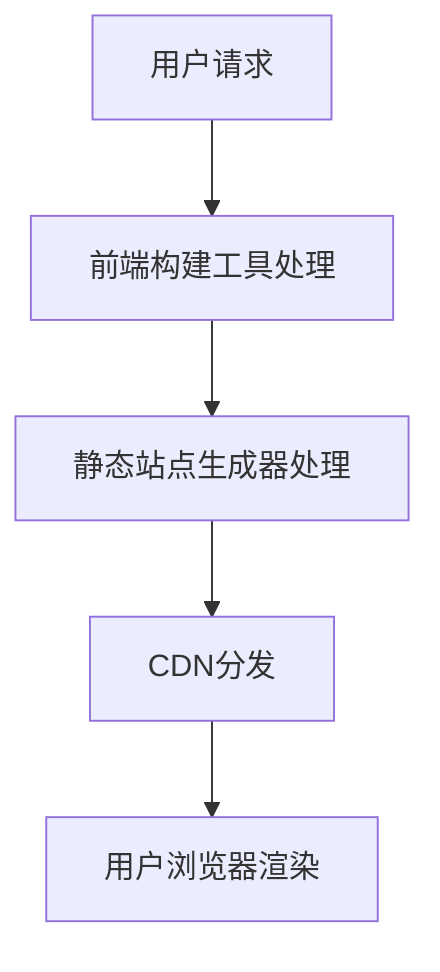

                 

关键词： Jamstack、现代Web开发、前端构建、静态站点生成器、服务端渲染、性能优化、安全性、SEO、响应式设计、Web组件

> 摘要：本文深入探讨了Jamstack——一种以静态站点生成器、现代前端构建工具和CDN为基础设施的现代Web开发新范式。通过剖析其核心概念、架构原理及实际应用，揭示了Jamstack相较于传统Web开发的诸多优势，并展望了其在未来Web开发中的发展趋势和挑战。

## 1. 背景介绍

在互联网飞速发展的今天，Web开发经历了多次重大的变革。从最初的静态网页，到动态网页，再到复杂的企业级应用，Web开发的技术栈也在不断地演进。然而，随着用户需求的日益复杂和多样化，以及全球互联网流量的持续增长，传统Web开发的模式开始暴露出一些问题，如性能瓶颈、安全性隐患、SEO难度增加等。

为了解决这些问题，一种新的Web开发范式——Jamstack（JavaScript、APIs、Markup）应运而生。Jamstack将前端和后端分离，通过静态站点生成器、现代前端构建工具和CDN等基础设施，实现高性能、安全性高、SEO友好的Web应用。

## 2. 核心概念与联系

### 2.1 JavaScript

JavaScript是Web开发的核心技术之一，负责页面的动态交互和用户界面。在Jamstack中，JavaScript主要用于前端构建，通过JavaScript框架（如React、Vue、Angular等）实现复杂的应用程序。

### 2.2 APIs

API（Application Programming Interface）是应用程序间的接口，允许不同的系统和服务进行数据交换和交互。在Jamstack中，API主要用于后端服务，提供动态数据和服务逻辑。

### 2.3 Markup

Markup是指HTML、CSS等标记语言，用于构建网页的结构和样式。在Jamstack中，Markup通过静态站点生成器生成，使得网页具有高性能和SEO优势。

### 2.4 Mermaid 流程图



## 3. 核心算法原理 & 具体操作步骤

### 3.1 算法原理概述

Jamstack的核心算法原理在于前端和后端的分离。前端由JavaScript和Markup构建，后端由API提供服务。通过这种方式，可以大大提高Web应用的性能、安全性和SEO。

### 3.2 算法步骤详解

1. 用户在浏览器中输入URL并发送请求。
2. 前端构建工具接收请求，解析URL并加载对应的JavaScript框架。
3. 静态站点生成器根据URL生成对应的Markup文件，并将其发送到CDN。
4. CDN将Markup文件缓存并分发到用户所在的地理位置。
5. 用户浏览器接收到Markup文件，并进行渲染。

### 3.3 算法优缺点

#### 优点：

- **高性能**：静态站点生成器和CDN可以大幅提高页面加载速度。
- **安全性**：通过API进行数据交互，可以避免直接暴露后端服务。
- **SEO友好**：静态站点更容易被搜索引擎索引，提高SEO效果。

#### 缺点：

- **开发复杂度**：前端和后端分离，需要更多的开发和维护工作。
- **动态数据处理**：对于需要动态数据的场景，可能需要额外的数据同步和处理。

### 3.4 算法应用领域

Jamstack适用于各种Web应用场景，尤其是对性能、安全性和SEO要求较高的场景。如电子商务、内容管理系统、社交媒体等。

## 4. 数学模型和公式 & 详细讲解 & 举例说明

### 4.1 数学模型构建

 Jamstack的数学模型可以看作是三部分：前端性能、后端性能和CDN性能。

### 4.2 公式推导过程

设 \( P_f \) 为前端性能，\( P_b \) 为后端性能，\( P_c \) 为CDN性能，则总体性能 \( P \) 可以表示为：

\[ P = P_f + P_b + P_c \]

### 4.3 案例分析与讲解

以一个电子商务网站为例，前端性能主要由页面加载速度决定，后端性能主要由数据库查询速度决定，CDN性能主要由数据传输速度决定。通过优化这三个部分，可以大大提高网站的总体性能。

## 5. 项目实践：代码实例和详细解释说明

### 5.1 开发环境搭建

在本地环境搭建一个简单的Jamstack项目，需要安装Node.js、npm、Git等工具。

```shell
npm install -g create-react-app
create-react-app jamstack-project
cd jamstack-project
npm install axios
```

### 5.2 源代码详细实现

在项目中创建一个简单的API服务，用于获取商品数据。

```javascript
// api.js
const axios = require('axios');

const getProducts = async () => {
  const response = await axios.get('https://api.example.com/products');
  return response.data;
};

module.exports = { getProducts };
```

### 5.3 代码解读与分析

通过axios库，我们实现了对API服务的请求，并在组件中使用该服务获取商品数据。

```javascript
// App.js
import React, { useState, useEffect } from 'react';
import { getProducts } from './api';

const App = () => {
  const [products, setProducts] = useState([]);

  useEffect(() => {
    const fetchProducts = async () => {
      const data = await getProducts();
      setProducts(data);
    };
    fetchProducts();
  }, []);

  return (
    <div>
      {products.map((product) => (
        <div key={product.id}>
          <h2>{product.name}</h2>
          <p>{product.description}</p>
        </div>
      ))}
    </div>
  );
};

export default App;
```

### 5.4 运行结果展示

运行项目后，浏览器会展示获取到的商品数据，实现了一个简单的电子商务网站。

## 6. 实际应用场景

### 6.1 电子商务

电子商务网站对性能、安全性和SEO有较高要求，Jamstack可以很好地满足这些需求。

### 6.2 内容管理系统

内容管理系统需要快速响应和良好的SEO，Jamstack是理想的选择。

### 6.3 社交媒体

社交媒体应用需要实时数据更新和高度互动性，Jamstack可以通过API实现数据同步。

## 7. 未来应用展望

随着Web技术的不断发展，Jamstack在未来将会有更广泛的应用。例如，结合Serverless架构，可以实现更轻量级、弹性更强大的Web应用。

## 8. 总结：未来发展趋势与挑战

### 8.1 研究成果总结

Jamstack在性能、安全性、SEO等方面具有明显优势，适用于各种Web应用场景。

### 8.2 未来发展趋势

随着Web技术的不断发展，Jamstack将在更多领域得到应用，成为现代Web开发的主流范式。

### 8.3 面临的挑战

Jamstack的开发复杂度较高，对于初学者可能有一定难度。此外，对于需要大量动态数据的场景，Jamstack可能需要额外的优化。

### 8.4 研究展望

未来研究可以关注如何降低Jamstack的开发复杂度，以及如何更好地结合其他新兴技术，如Serverless、容器化等。

## 9. 附录：常见问题与解答

### 9.1 Jamstack与传统Web开发的区别？

Jamstack将前端和后端分离，通过静态站点生成器、现代前端构建工具和CDN实现高性能、安全性高、SEO友好的Web应用。

### 9.2 Jamstack适合哪些应用场景？

Jamstack适用于对性能、安全性和SEO有较高要求的场景，如电子商务、内容管理系统、社交媒体等。

### 9.3 如何优化Jamstack的性能？

可以通过优化前端构建、后端API和服务端渲染等环节来提高性能。

## 作者署名

作者：禅与计算机程序设计艺术 / Zen and the Art of Computer Programming

----------------------------------------------------------------

以上就是本文的完整内容，感谢您的阅读！希望本文能够帮助您更好地理解和应用Jamstack，提高您的Web开发技能。如果您有任何疑问或建议，欢迎在评论区留言交流。再次感谢！

