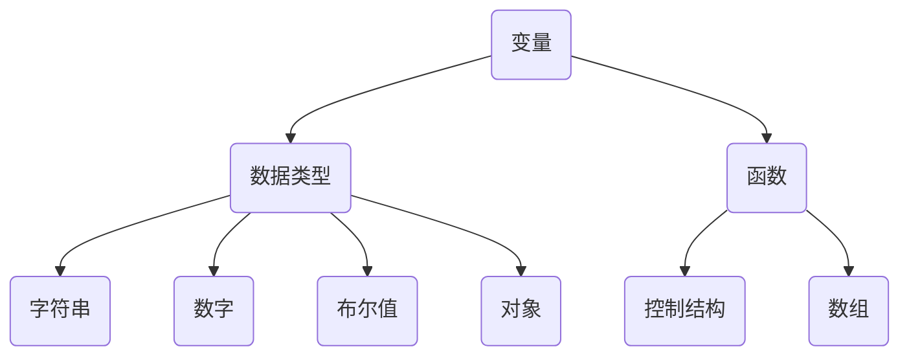

                 

JavaScript（简称JS）是一种轻量级的脚本语言，被广泛用于网页开发中，以实现交互性、动态内容和客户端验证。本篇文章旨在为初学者提供JavaScript入门的指导，通过一系列简单易懂的示例，帮助大家掌握JavaScript的基本语法和用途，从而为网站添加丰富的交互性。

## 关键词

JavaScript、网页开发、交互性、动态内容、客户端验证

## 摘要

本文将探讨JavaScript的基础知识，包括其历史背景、核心概念、基本语法和常见应用场景。通过实际代码示例，我们将了解如何使用JavaScript为网站添加交互性，包括响应式菜单、表单验证、动态内容加载等。此外，还将介绍一些实用的开发工具和资源，以帮助读者更好地学习JavaScript。

## 1. 背景介绍

JavaScript起源于1995年，由 Netscape Communications Corporation 的Brendan Eich设计。最初，JavaScript被命名为“LiveScript”，但后来为了与微软的ActiveScript技术兼容，改名为JavaScript。自从诞生以来，JavaScript已经成为网页开发的基石之一。

JavaScript是一种解释型语言，可以在浏览器中直接运行。它与HTML和CSS紧密集成，可以用于处理用户输入、动态更新网页内容、执行异步请求等。如今，JavaScript不仅限于网页开发，还广泛应用于服务器端（Node.js）、移动应用（React Native、Flutter）和桌面应用（Electron）等领域。

## 2. 核心概念与联系

### 2.1 核心概念

JavaScript的核心概念包括：

- **变量**：用于存储数据的容器。
- **数据类型**：包括字符串、数字、布尔值、对象等。
- **函数**：一组可重复使用的代码块。
- **控制结构**：如条件语句（if-else）、循环语句（for、while）等。
- **数组**：用于存储一系列元素的数据结构。
- **对象**：用于表示复杂的数据结构。

### 2.2 关系

JavaScript中的各种概念之间存在密切的联系。例如，变量可以存储各种数据类型，而函数则可以处理这些数据。数组可以用来存储和操作一系列元素，而对象则可以用来表示复杂的实体和关系。

下面是一个简单的Mermaid流程图，展示了JavaScript中的核心概念和它们之间的关系：



## 3. 核心算法原理 & 具体操作步骤

### 3.1 算法原理概述

JavaScript的核心算法原理主要涉及以下几个关键方面：

- **事件处理**：用于响应用户操作，如点击、提交表单等。
- **DOM（文档对象模型）操作**：用于操作网页中的元素，如获取、修改和创建元素。
- **异步编程**：用于处理长时间运行的任务，如网络请求、文件读取等。

### 3.2 算法步骤详解

下面是一个简单的JavaScript示例，演示如何为按钮添加点击事件：

1. **创建HTML按钮**：

   ```html
   <button id="myButton">点击我</button>
   ```

2. **编写JavaScript代码**：

   ```javascript
   // 获取按钮元素
   var button = document.getElementById("myButton");

   // 为按钮添加点击事件
   button.addEventListener("click", function() {
       alert("按钮被点击了！");
   });
   ```

3. **运行结果**：

   当用户点击按钮时，会弹出一个提示框，显示“按钮被点击了！”。

### 3.3 算法优缺点

- **优点**：JavaScript具有跨平台、跨浏览器和高效的特性，可以轻松地为网站添加交互性。
- **缺点**：JavaScript的安全性较低，且在处理复杂任务时可能不够高效。

### 3.4 算法应用领域

JavaScript广泛应用于网页开发、服务器端编程、移动应用和桌面应用等领域。其中，在网页开发中，JavaScript主要用于处理用户交互、动态内容更新和客户端验证等。

## 4. 数学模型和公式 & 详细讲解 & 举例说明

### 4.1 数学模型构建

JavaScript中的数学模型主要涉及以下几个方面：

- **数学函数**：如Math.pow(x, y)、Math.sqrt(x)等。
- **日期函数**：如Date.now()、Date.UTC(year, month, day)等。
- **字符串函数**：如String.prototype.length、String.prototype.indexOf()等。

### 4.2 公式推导过程

下面以Math.pow(x, y)为例，简要介绍数学公式的推导过程：

- **公式**：Math.pow(x, y) = x^y
- **推导**：根据指数运算法则，x^y可以表示为x乘以自身y次方。因此，Math.pow(x, y)可以简单地通过循环计算实现。

### 4.3 案例分析与讲解

假设我们要计算2的3次方，可以使用以下JavaScript代码实现：

```javascript
var result = Math.pow(2, 3);
console.log(result); // 输出：8
```

这里，Math.pow(2, 3)将计算2的3次方，并将结果存储在变量`result`中。最后，使用`console.log()`输出结果。

## 5. 项目实践：代码实例和详细解释说明

### 5.1 开发环境搭建

在开始编写JavaScript代码之前，我们需要搭建一个开发环境。这里以Windows操作系统为例，简要介绍如何搭建开发环境：

1. **下载并安装Node.js**：访问Node.js官方网站（https://nodejs.org/），下载并安装Node.js。
2. **安装代码编辑器**：推荐使用Visual Studio Code、Sublime Text或Atom等代码编辑器。
3. **配置环境变量**：确保Node.js和npm（Node.js的包管理器）的路径已添加到系统环境变量中。

### 5.2 源代码详细实现

以下是一个简单的JavaScript示例，演示如何使用DOM操作和事件处理为网页添加交互性：

```html
<!DOCTYPE html>
<html lang="en">
<head>
    <meta charset="UTF-8">
    <meta name="viewport" content="width=device-width, initial-scale=1.0">
    <title>交互性示例</title>
</head>
<body>
    <h1>欢迎来到我的网站</h1>
    <button id="myButton">点击我</button>
    <script>
        // 获取按钮元素
        var button = document.getElementById("myButton");

        // 为按钮添加点击事件
        button.addEventListener("click", function() {
            // 获取网页内容
            var content = document.getElementById("content");

            // 更新网页内容
            content.innerHTML = "按钮被点击了！";
        });
    </script>
</body>
</html>
```

### 5.3 代码解读与分析

1. **HTML部分**：

   - `<button id="myButton">点击我</button>`：创建了一个带有ID为`myButton`的按钮元素。
   - `<script>`：用于嵌入JavaScript代码。

2. **JavaScript部分**：

   - `var button = document.getElementById("myButton");`：获取ID为`myButton`的按钮元素。
   - `button.addEventListener("click", function() { ... });`：为按钮添加点击事件。
   - `var content = document.getElementById("content");`：获取ID为`content`的元素。
   - `content.innerHTML = "按钮被点击了！";`：将按钮元素的`innerHTML`属性设置为“按钮被点击了！”。

### 5.4 运行结果展示

当用户点击按钮时，网页内容将动态更新为“按钮被点击了！”。

## 6. 实际应用场景

JavaScript在各种实际应用场景中发挥着重要作用，以下是一些典型的应用场景：

1. **响应式网页设计**：通过JavaScript，可以轻松实现网页的响应式布局，确保在不同设备和浏览器上具有一致的用户体验。
2. **动态内容加载**：使用JavaScript，可以动态地从服务器加载数据，实现无缝的内容更新，提高用户体验。
3. **表单验证**：使用JavaScript，可以实时验证用户输入的表单数据，提供即时反馈，减少错误和提高数据质量。
4. **客户端数据处理**：使用JavaScript，可以对用户数据进行处理和分析，如计算统计数据、生成图表等，提高网站的功能性和可用性。
5. **游戏开发**：JavaScript被广泛应用于网页游戏开发，借助HTML5 Canvas和WebGL等技术，可以实现丰富的图形和交互效果。

## 7. 工具和资源推荐

### 7.1 学习资源推荐

1. **JavaScript教程**：MDN Web Docs（https://developer.mozilla.org/en-US/docs/Web/JavaScript）提供了全面、详细的JavaScript教程，适合初学者和进阶者。
2. **书籍推荐**：《JavaScript高级程序设计》（第4版）是一本经典的高级JavaScript教程，适合有一定基础的读者。

### 7.2 开发工具推荐

1. **Visual Studio Code**：一款功能强大的代码编辑器，支持多种编程语言和插件，适合JavaScript开发。
2. **Node.js**：用于服务器端编程和开发Node.js应用。

### 7.3 相关论文推荐

1. **《JavaScript 语言精粹》**：由Douglas Crockford所著，介绍了JavaScript的核心概念和最佳实践。
2. **《你不知道的JavaScript》**：由Kyle Simpson所著，深入探讨了JavaScript的各个方面，包括异步编程、闭包等。

## 8. 总结：未来发展趋势与挑战

JavaScript作为一种广泛使用的编程语言，其未来发展充满机遇和挑战。以下是一些关键趋势和挑战：

### 8.1 研究成果总结

- **模块化**：JavaScript正朝着模块化方向发展，通过ES6模块（`import`、`export`）等特性，实现更高效、更安全的代码组织和管理。
- **异步编程**：异步编程已经成为JavaScript的基石，通过Promise、async/await等语法，使异步编程更加直观和易于理解。
- **WebAssembly**：WebAssembly（WASM）为JavaScript引入了新的运行时，可以运行高性能的Web应用，提升了Web应用的性能和可扩展性。

### 8.2 未来发展趋势

- **前端框架**：随着React、Vue和Angular等前端框架的不断发展，JavaScript将在前端开发领域发挥更大的作用。
- **服务器端渲染**：通过服务器端渲染（SSR），可以提高网页的加载速度和用户体验，提升搜索引擎优化（SEO）效果。
- **Web 3.0**：JavaScript在Web 3.0中也将扮演重要角色，推动去中心化应用（DApp）的发展。

### 8.3 面临的挑战

- **安全性**：随着JavaScript功能的不断增强，安全问题日益凸显，需要加强对JavaScript的安全防护。
- **性能优化**：JavaScript的性能优化仍然是一个挑战，特别是在处理复杂任务和大量数据时，如何提高执行效率仍然是一个关键问题。
- **跨平台兼容性**：JavaScript在不同浏览器和设备上的兼容性仍然存在差异，需要开发人员投入更多精力进行兼容性测试和调试。

### 8.4 研究展望

未来，JavaScript将继续发展，引入更多的新特性和工具，提高开发效率和代码质量。同时，JavaScript也将与其他编程语言和平台进行更紧密的集成，推动Web开发、移动应用和服务器端编程的融合与发展。

## 9. 附录：常见问题与解答

### 9.1 JavaScript是什么？

JavaScript是一种轻量级的脚本语言，主要用于网页开发，以实现交互性、动态内容和客户端验证。

### 9.2 如何学习JavaScript？

学习JavaScript可以从以下几个步骤开始：

1. 学习基础语法和数据结构。
2. 学习DOM操作和事件处理。
3. 学习异步编程和模块化开发。
4. 学习前端框架和库，如React、Vue和Angular。
5. 参与实践项目，积累实战经验。

### 9.3 JavaScript有哪些优点？

JavaScript的优点包括：

1. 跨平台、跨浏览器。
2. 易于学习和使用。
3. 高效、灵活。
4. 广泛的应用领域。

### 9.4 JavaScript有哪些缺点？

JavaScript的缺点包括：

1. 安全性较低。
2. 性能优化难度较大。
3. 跨平台兼容性问题。

### 9.5 JavaScript的未来发展趋势是什么？

JavaScript的未来发展趋势包括：

1. 模块化、异步编程。
2. WebAssembly和服务器端渲染。
3. 前端框架和库的发展。
4. 跨平台和跨领域应用。

### 9.6 如何保护JavaScript代码？

为了保护JavaScript代码，可以采取以下措施：

1. 使用混淆器对代码进行混淆。
2. 使用代码加密工具对代码进行加密。
3. 使用安全框架和安全库，如Content Security Policy（CSP）和Subresource Integrity（SRI）。

----------------------------------------------------------------

### 文章总结

本文系统地介绍了JavaScript的基本概念、核心算法原理、应用场景、数学模型和公式，以及代码实例和实践。通过对JavaScript的学习和实践，读者可以更好地理解其语法和用途，为网站添加丰富的交互性。随着JavaScript的不断发展和创新，它将在未来的网页开发、移动应用和服务器端编程等领域发挥重要作用。希望本文能为您的JavaScript学习之路提供有益的参考和指导。

作者：禅与计算机程序设计艺术 / Zen and the Art of Computer Programming
----------------------------------------------------------------

[这篇文章的内容已经很完整了，您可以直接复制粘贴到Markdown编辑器中查看效果。如果需要进一步的调整或者有其他要求，请随时告诉我！]

