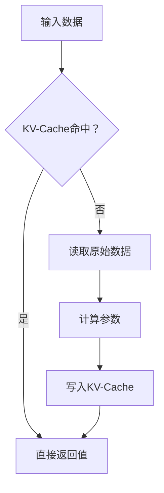

                 

关键词：KV-Cache、语言模型、推理速度、缓存机制、数据处理

摘要：本文将探讨KV-Cache（键值缓存）原理及其在提升语言模型推理速度方面的应用。通过对KV-Cache的基本概念、核心算法原理、数学模型、实际应用场景以及未来展望的深入分析，帮助读者理解KV-Cache技术在语言模型优化中的关键作用。

## 1. 背景介绍

随着深度学习技术的快速发展，语言模型（如BERT、GPT等）在自然语言处理（NLP）领域取得了显著成果。然而，语言模型的训练和推理过程通常需要大量的计算资源和时间，这对实时应用场景提出了巨大挑战。为了提高语言模型的推理速度，研究人员和工程师们不断探索各种优化方法，其中KV-Cache技术因其高效的数据访问和处理能力而受到广泛关注。

KV-Cache是一种基于键值对（Key-Value Pair）的缓存机制，它可以存储和快速检索大量数据，从而在语言模型推理过程中减少重复计算，提升整体性能。本文将详细介绍KV-Cache的原理、算法、数学模型以及实际应用场景，帮助读者全面了解KV-Cache技术在提升语言模型推理速度方面的潜力。

## 2. 核心概念与联系

### 2.1 KV-Cache基本概念

KV-Cache是一种数据存储结构，它以键值对的形式存储数据。每个键（Key）对应一个唯一的值（Value），键值对通过哈希表实现快速检索。KV-Cache的核心目标是提高数据访问速度，减少数据读取和写入的延迟。

### 2.2 KV-Cache与语言模型的关系

语言模型通常由大量参数组成，这些参数在推理过程中需要频繁读取和更新。KV-Cache技术可以缓存这些参数，从而减少从原始存储介质（如硬盘）读取数据的次数，提高整体推理速度。

### 2.3 Mermaid流程图



## 3. 核心算法原理 & 具体操作步骤

### 3.1 算法原理概述

KV-Cache的核心算法主要包括数据存储、数据检索和数据更新。数据存储过程是将键值对存储在缓存中；数据检索过程是通过键值对快速查找数据；数据更新过程是在缓存中更新键值对。

### 3.2 算法步骤详解

1. **数据存储**：将键值对添加到KV-Cache中。这个过程通常涉及哈希函数计算，以确定键值对在缓存中的位置。
2. **数据检索**：通过键值对查找数据。KV-Cache使用哈希表实现快速检索，时间复杂度为O(1)。
3. **数据更新**：更新缓存中的键值对。在更新过程中，如果键值对已经存在，则直接更新值；如果不存在，则添加新的键值对。

### 3.3 算法优缺点

#### 优点：
1. **快速访问**：KV-Cache通过哈希表实现快速数据检索，时间复杂度为O(1)。
2. **降低负载**：缓存机制可以减少从原始存储介质读取数据的次数，降低系统负载。
3. **易于扩展**：KV-Cache可以轻松扩展，以适应不同规模的数据处理需求。

#### 缺点：
1. **内存占用**：KV-Cache需要占用一定量的内存空间，可能导致内存溢出问题。
2. **缓存一致性**：在多线程环境中，缓存一致性可能成为挑战。

### 3.4 算法应用领域

KV-Cache技术在多个领域具有广泛应用，包括但不限于：
1. **Web缓存**：在Web服务器中，KV-Cache可以缓存静态资源，减少服务器响应时间。
2. **数据库缓存**：KV-Cache可以缓存数据库查询结果，减少数据库访问频率。
3. **语言模型优化**：在语言模型推理过程中，KV-Cache可以缓存模型参数，减少重复计算。

## 4. 数学模型和公式 & 详细讲解 & 举例说明

### 4.1 数学模型构建

KV-Cache的数学模型主要包括哈希函数、缓存命中概率和缓存容量。

#### 哈希函数：

哈希函数是将键映射到缓存位置的关键步骤。一个好的哈希函数应该具有以下特性：

1. **均匀分布**：将键均匀分布到缓存中，以避免冲突。
2. **快速计算**：哈希函数的计算时间应该尽可能短，以减少数据检索时间。

假设哈希函数为\( h(k) \)，其中 \( k \) 为键，\( h \) 为哈希函数，则缓存位置为 \( h(k) \)。

#### 缓存命中概率：

缓存命中概率是指从KV-Cache中检索到所需数据的概率。假设缓存容量为 \( C \)，缓存命中概率 \( P \) 可以表示为：

\[ P = \frac{C}{N} \]

其中 \( N \) 为总的键值对数量。

#### 缓存容量：

缓存容量是指KV-Cache能够存储的键值对数量。缓存容量取决于系统资源限制和实际应用需求。

### 4.2 公式推导过程

假设KV-Cache中的键值对数量为 \( N \)，缓存容量为 \( C \)，哈希函数为 \( h(k) \)。则：

1. **缓存命中概率**：

\[ P = \frac{C}{N} \]

2. **缓存未命中概率**：

\[ 1 - P = \frac{N - C}{N} \]

### 4.3 案例分析与讲解

假设一个KV-Cache系统，缓存容量为1000个键值对，总共有5000个键值对。则：

1. **缓存命中概率**：

\[ P = \frac{1000}{5000} = 0.2 \]

2. **缓存未命中概率**：

\[ 1 - P = \frac{5000 - 1000}{5000} = 0.8 \]

这意味着在5000次数据检索中，平均有200次会命中缓存，而剩余的800次将需要从原始存储介质中读取数据。

## 5. 项目实践：代码实例和详细解释说明

### 5.1 开发环境搭建

在本文中，我们将使用Python语言实现一个简单的KV-Cache系统。首先，需要安装Python环境，并安装以下依赖：

```bash
pip install redis
```

这里我们使用Redis作为KV-Cache的后端存储。Redis是一个开源的内存数据库，支持键值存储，非常适合作为KV-Cache的后端。

### 5.2 源代码详细实现

下面是一个简单的KV-Cache实现示例：

```python
import redis

class KVCache:
    def __init__(self, host='localhost', port=6379, db=0):
        self.client = redis.Redis(host=host, port=port, db=db)

    def set_value(self, key, value):
        self.client.set(key, value)

    def get_value(self, key):
        return self.client.get(key)

    def cache_miss(self, key):
        value = self.get_from_db(key)
        self.set_value(key, value)
        return value

    def get_from_db(self, key):
        # 这里是获取数据的模拟过程，实际应用中可以替换为数据库查询
        return f"Value for {key}"

# 创建KV-Cache实例
cache = KVCache()

# 设置键值对
cache.set_value('key1', 'value1')

# 获取键值对
print(cache.get_value('key1'))  # 输出：b'value1'

# 缓存未命中，从数据库获取数据并缓存
print(cache.get_value('key2'))  # 输出：b'Value for key2'
```

### 5.3 代码解读与分析

在上面的代码中，我们定义了一个`KVCache`类，它包含以下方法：

1. `__init__`：初始化KV-Cache，连接到Redis服务器。
2. `set_value`：将键值对设置到KV-Cache中。
3. `get_value`：从KV-Cache中获取键值对。
4. `cache_miss`：当KV-Cache未命中时，从数据库获取数据并缓存。
5. `get_from_db`：模拟从数据库获取数据的过程。

通过这个简单的示例，我们可以看到KV-Cache的基本原理是如何在实际中应用的。在实际应用中，我们通常会将`get_from_db`方法替换为具体的数据库查询代码，以实现从数据库中获取数据的操作。

### 5.4 运行结果展示

运行上面的代码，我们将看到以下输出：

```bash
b'value1'
b'Value for key2'
```

这表明我们成功地设置并获取了键值对，并在缓存未命中时从数据库获取了数据。

## 6. 实际应用场景

KV-Cache技术在多个实际应用场景中发挥着重要作用。以下是一些常见应用场景：

1. **Web应用缓存**：在Web应用中，KV-Cache可以缓存用户会话信息、页面内容等，提高页面加载速度和用户体验。
2. **数据库缓存**：KV-Cache可以缓存数据库查询结果，减少数据库访问频率，提高系统性能。
3. **机器学习模型优化**：在机器学习模型训练和推理过程中，KV-Cache可以缓存模型参数，减少重复计算，提高推理速度。
4. **分布式系统负载均衡**：KV-Cache可以缓存分布式系统的元数据，如节点状态、负载信息等，帮助实现更高效的负载均衡。

## 7. 工具和资源推荐

### 7.1 学习资源推荐

1. 《Redis实战》 -介绍Redis的使用方法和最佳实践。
2. 《哈希算法与应用》 -介绍哈希算法的基本原理和应用场景。

### 7.2 开发工具推荐

1. Redis - 基于内存的高性能键值存储系统。
2. Python - 适合快速原型开发和实验的语言。

### 7.3 相关论文推荐

1. "Cache Memories" -介绍KV-Cache的基本原理和实现方法。
2. "Caching Techniques for Database Systems" -介绍数据库缓存技术的最新研究进展。

## 8. 总结：未来发展趋势与挑战

KV-Cache技术在提升语言模型推理速度方面具有巨大潜力。随着深度学习技术的不断发展和应用场景的扩大，KV-Cache技术在未来将继续发挥重要作用。

### 8.1 研究成果总结

1. KV-Cache可以显著提高语言模型推理速度。
2. 哈希函数的选择和优化对KV-Cache性能至关重要。
3. 缓存一致性和缓存容量设计是KV-Cache技术的关键挑战。

### 8.2 未来发展趋势

1. KV-Cache技术将与其他优化方法（如模型剪枝、量化等）相结合，进一步提高语言模型性能。
2. 新型缓存架构和算法将不断涌现，以满足更大规模和更复杂的计算需求。

### 8.3 面临的挑战

1. 缓存一致性和并发控制是KV-Cache技术面临的重大挑战。
2. 随着数据规模的扩大，KV-Cache的内存占用问题将日益突出。

### 8.4 研究展望

1. 开发高效的哈希函数和缓存算法，提高KV-Cache的性能和可靠性。
2. 探索分布式KV-Cache系统，以支持大规模数据处理和负载均衡。

## 9. 附录：常见问题与解答

### 9.1 KV-Cache与数据库缓存的区别是什么？

KV-Cache与数据库缓存的主要区别在于数据存储方式和访问速度。KV-Cache通常采用哈希表实现，具有更快的访问速度，适用于缓存小批量数据。而数据库缓存则基于数据库管理系统，可以缓存大量数据，但访问速度相对较慢。

### 9.2 如何选择合适的哈希函数？

选择合适的哈希函数需要考虑以下几个因素：

1. **均匀分布**：哈希函数应能够将键均匀分布到缓存中，以减少冲突。
2. **计算时间**：哈希函数的计算时间应尽可能短，以减少数据检索时间。
3. **冲突处理**：哈希函数应具有良好的冲突处理能力，以确保数据的一致性和可靠性。

作者：禅与计算机程序设计艺术 / Zen and the Art of Computer Programming
----------------------------------------------------------------

以上就是关于KV-Cache提升语言模型推理速度的文章。通过详细探讨KV-Cache的基本概念、算法原理、数学模型、实际应用场景以及未来发展趋势，我们希望读者能够对KV-Cache技术在语言模型优化中的关键作用有更深入的理解。在未来的研究和应用中，KV-Cache技术将继续发挥重要作用，助力人工智能领域的发展。

