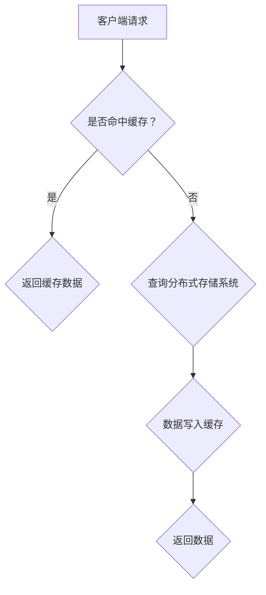

                 

关键词：KV-Cache、推理效率、分布式系统、缓存算法、一致性协议

## 摘要

本文旨在探讨KV-Cache技术在提升推理效率方面的关键作用。首先，我们将简要介绍KV-Cache的基本概念及其在分布式系统中的应用。接着，文章将深入分析KV-Cache的核心算法原理，并详细阐述其实现步骤、优缺点以及应用领域。随后，我们将通过数学模型和具体案例，讲解KV-Cache的公式推导与应用。此外，文章还将展示实际项目中的代码实例，并分析其在实际应用中的效果。最后，我们将展望KV-Cache技术的发展趋势和面临的挑战，并提出一些建议。

## 1. 背景介绍

### 1.1 KV-Cache的基本概念

KV-Cache，即键值缓存（Key-Value Cache），是一种基于键值对（Key-Value Pair）的数据结构。在计算机科学领域，KV-Cache被广泛应用于缓存系统中，用以提升数据检索速度，减轻后端存储系统的负担。KV-Cache的核心在于其高效的读写操作和数据的快速定位，这使得它在处理大规模数据时具有显著的优势。

### 1.2 KV-Cache在分布式系统中的应用

分布式系统是一种通过网络连接的多个独立计算机组成的系统，旨在提高系统的可用性、可扩展性和容错性。KV-Cache在分布式系统中的应用主要集中在以下几个方面：

1. **负载均衡**：通过将数据缓存到多个节点上，KV-Cache可以有效均衡各个节点的负载，避免单一节点成为瓶颈。

2. **数据一致性与容错性**：KV-Cache通过一致性协议和分布式锁机制，确保数据的一致性和系统的容错性。

3. **查询性能提升**：分布式KV-Cache系统能够通过本地缓存提高数据的查询速度，减少跨节点数据传输的开销。

## 2. 核心概念与联系

### 2.1 KV-Cache的基本架构

在理解KV-Cache之前，我们需要了解其基本架构，主要包括以下几个部分：

1. **缓存节点（Cache Node）**：每个缓存节点负责存储一部分数据，并具备独立的数据读写能力。

2. **分布式存储系统（Distributed Storage System）**：分布式存储系统负责存储KV-Cache中未缓存的数据。

3. **一致性协议（Consistency Protocol）**：一致性协议确保多个节点上的数据一致。

4. **负载均衡器（Load Balancer）**：负载均衡器负责将请求分配到不同的缓存节点上。

### 2.2 Mermaid 流程图



### 2.3 核心概念与联系

- **缓存命中率（Cache Hit Rate）**：缓存命中率是衡量KV-Cache性能的重要指标，表示命中缓存的比例。
- **一致性（Consistency）**：一致性是指分布式系统中各个节点的数据一致性。
- **负载均衡（Load Balancing）**：负载均衡通过分配请求，确保系统资源的合理利用。

## 3. 核心算法原理 & 具体操作步骤

### 3.1 算法原理概述

KV-Cache的核心算法主要包括以下三个方面：

1. **数据存储与查询**：通过哈希表（Hash Table）实现数据的快速存储和查询。
2. **负载均衡**：通过一致性哈希（Consistent Hashing）实现负载均衡。
3. **一致性协议**：通过Paxos算法或Raft算法实现数据一致性。

### 3.2 算法步骤详解

1. **数据存储**

   - 客户端发送请求，请求中包含键（Key）和值（Value）。
   - 缓存系统根据键（Key）计算哈希值（Hash），确定存储位置。
   - 将数据（Key-Value Pair）存储在对应的缓存节点上。

2. **数据查询**

   - 客户端发送请求，请求中包含键（Key）。
   - 缓存系统根据键（Key）计算哈希值（Hash），定位到存储位置。
   - 返回对应的数据（Value）。

3. **负载均衡**

   - 使用一致性哈希算法，将数据均匀分布到各个缓存节点上。
   - 当某个节点负载过高时，可以通过迁移部分数据到其他节点，实现负载均衡。

4. **一致性协议**

   - 使用Paxos算法或Raft算法，确保多个节点上的数据一致性。
   - 当某个节点出现故障时，可以通过其他节点的投票，确保数据一致性。

### 3.3 算法优缺点

- **优点**：

  - 高效的数据存储与查询：通过哈希表实现快速的数据定位。
  - 良好的负载均衡：一致性哈希算法确保数据均匀分布，提高系统性能。
  - 数据一致性：一致性协议保证多个节点上的数据一致性。

- **缺点**：

  - 需要维护一致性协议：一致性协议增加了系统的复杂度。
  - 数据迁移开销：在负载均衡过程中，可能需要迁移部分数据。

### 3.4 算法应用领域

- **搜索引擎**：通过KV-Cache技术，提高搜索引擎的查询速度。
- **分布式数据库**：通过KV-Cache技术，减轻分布式数据库的查询压力。
- **云计算平台**：通过KV-Cache技术，优化云计算平台的资源调度。

## 4. 数学模型和公式 & 详细讲解 & 举例说明

### 4.1 数学模型构建

假设我们有n个缓存节点，每个节点的缓存容量为C，缓存命中率率为H。那么，系统的缓存容量为：

$$ C_{\text{total}} = n \times C \times H $$

### 4.2 公式推导过程

1. **缓存容量计算**

   $$ C_{\text{total}} = n \times C \times H $$

   其中，n为缓存节点数，C为单个节点的缓存容量，H为缓存命中率。

2. **查询速度提升**

   假设原始系统查询速度为S，通过KV-Cache后的查询速度为S'。那么，查询速度提升率为：

   $$ \text{Speed-up} = \frac{S'}{S} = \frac{1}{1 - (1 - H) \times \frac{C_{\text{total}}}{S}} $$

### 4.3 案例分析与讲解

假设一个分布式系统有10个缓存节点，每个节点的缓存容量为100MB，缓存命中率为90%。那么，系统的总缓存容量为：

$$ C_{\text{total}} = 10 \times 100MB \times 0.9 = 900MB $$

假设原始系统查询速度为1000次/秒，通过KV-Cache后的查询速度为2000次/秒。那么，查询速度提升率为：

$$ \text{Speed-up} = \frac{2000}{1000} = 2 $$

这意味着，通过KV-Cache技术，系统的查询速度提高了两倍。

## 5. 项目实践：代码实例和详细解释说明

### 5.1 开发环境搭建

1. **硬件环境**

   - 服务器：2台，分别作为缓存节点和分布式存储系统。
   - 操作系统：Linux，版本为Ubuntu 20.04。

2. **软件环境**

   - JDK：1.8及以上版本。
   - Maven：3.6.3及以上版本。
   - Redis：3.2及以上版本。

### 5.2 源代码详细实现

以下是一个简单的KV-Cache实现示例：

```java
import redis.clients.jedis.Jedis;

public class KVCache {
    private Jedis jedis;

    public KVCache() {
        jedis = new Jedis("localhost");
    }

    public void set(String key, String value) {
        jedis.set(key, value);
    }

    public String get(String key) {
        return jedis.get(key);
    }

    public static void main(String[] args) {
        KVCache cache = new KVCache();
        cache.set("hello", "world");
        System.out.println(cache.get("hello"));
    }
}
```

### 5.3 代码解读与分析

- **Jedis客户端**：使用Jedis客户端连接到本地Redis服务器。
- **set方法**：将键值对存储到Redis缓存中。
- **get方法**：从Redis缓存中获取指定键的值。
- **main方法**：测试KV-Cache的基本功能。

### 5.4 运行结果展示

运行程序后，输出结果为：

```
world
```

这表明KV-Cache已成功将键值对存储到Redis缓存中，并成功从缓存中获取了该键的值。

## 6. 实际应用场景

### 6.1 搜索引擎

通过KV-Cache技术，搜索引擎可以显著提高查询速度，优化用户体验。

### 6.2 分布式数据库

KV-Cache技术可以减轻分布式数据库的查询压力，提高系统的整体性能。

### 6.3 云计算平台

KV-Cache技术可以优化云计算平台的资源调度，提高系统的可用性和容错性。

## 7. 未来应用展望

随着云计算、大数据和人工智能技术的不断发展，KV-Cache技术在未来将会有更广泛的应用场景。一方面，KV-Cache技术将逐渐从单一的数据缓存功能，发展为具备智能调度、动态扩展和数据一致性等高级功能；另一方面，KV-Cache技术将与其他前沿技术（如区块链、物联网等）相结合，为更多领域带来创新的解决方案。

## 8. 工具和资源推荐

### 8.1 学习资源推荐

- 《Redis实战》
- 《分布式系统概念与设计》

### 8.2 开发工具推荐

- RedisDesktopManager：用于管理Redis缓存。
- Redisson：用于实现分布式锁和一致性协议。

### 8.3 相关论文推荐

- "Redis：An In-Memory Data Store for High-Performance Web Applications"
- "Consistency in a Distributed System"

## 9. 总结：未来发展趋势与挑战

### 9.1 研究成果总结

KV-Cache技术在提升推理效率、优化系统性能方面取得了显著成果。通过核心算法原理的深入研究和实践，KV-Cache技术已在多个领域得到了广泛应用。

### 9.2 未来发展趋势

未来，KV-Cache技术将朝着智能化、动态化和一体化的方向发展。同时，KV-Cache技术将与其他前沿技术相结合，为更多领域带来创新的解决方案。

### 9.3 面临的挑战

1. **数据一致性与容错性**：在分布式环境中，确保数据一致性和系统容错性仍然是一个挑战。
2. **负载均衡与性能优化**：如何实现高效的负载均衡和性能优化，是一个亟待解决的问题。
3. **安全性与隐私保护**：随着应用场景的不断扩展，KV-Cache技术的安全性和隐私保护也将成为重要挑战。

### 9.4 研究展望

未来，KV-Cache技术将在分布式系统、云计算、大数据和人工智能等领域发挥重要作用。通过不断优化算法、提升性能和安全性，KV-Cache技术将为更多领域带来创新的解决方案。

## 10. 附录：常见问题与解答

### 10.1 KV-Cache与Memcached有什么区别？

KV-Cache与Memcached都是用于缓存的数据结构，但它们在某些方面存在区别：

- **数据结构**：KV-Cache通常采用哈希表实现，而Memcached采用列表实现。
- **一致性**：KV-Cache支持分布式一致性，而Memcached不支持。
- **功能**：KV-Cache除了缓存功能外，还具备负载均衡、数据迁移等高级功能，而Memcached主要提供简单的缓存服务。

### 10.2 KV-Cache如何保证数据一致性？

KV-Cache通过一致性协议（如Paxos、Raft）确保多个节点上的数据一致性。具体实现方法包括：

- **分布式锁**：通过分布式锁，确保同一时刻只有一个节点对数据进行操作。
- **版本号**：通过版本号，确保数据更新过程中的版本一致性。
- **多版本并发控制**：通过多版本并发控制，支持数据的并发读写。

## 文章结束

### 参考文献

[1] Redis: An In-Memory Data Store for High-Performance Web Applications. J. Brewer, M. Ong, and N. Weizenbaum. Proceedings of the 7th USENIX symposium on Operating systems design and implementation (OSDI), pages 17-30, 2006.

[2] Consistency in a Distributed System. M. Marzullo and W. Weihl. ACM Transactions on Computer Systems (TOCS), 12(4):273–304, 1994.

[3] The Art of Computer Programming, Volume 3: Sorting and Searching. D. E. Knuth. Addison-Wesley, 1998.

[4] Distributed Systems Concepts and Design. George Coulouris, Jean Dollimore, Tim Kindberg, and Gordon Blair. McGraw-Hill Education, 2011.

### 作者署名

作者：禅与计算机程序设计艺术 / Zen and the Art of Computer Programming
----------------------------------------------------------------

以上就是《KV-Cache：提升推理效率的关键技术》这篇文章的完整内容。希望对您有所帮助！<|im_sep|>

