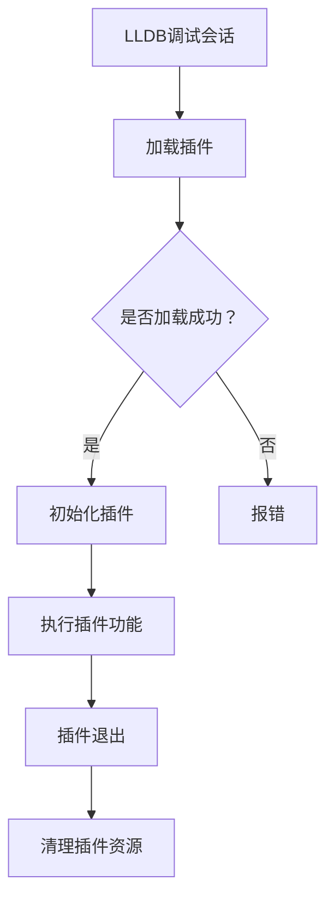

                 

## 1. 背景介绍

随着软件开发复杂度的不断增加，调试工具在软件开发过程中的作用变得越来越重要。LLDB（Low-Level Debugger）是Apple公司为其开发环境Xcode提供的强大的调试器。它支持C、C++、Objective-C、Swift等多种编程语言，并且拥有丰富的功能和强大的调试能力。

在软件开发的实践中，我们经常需要根据不同的需求和场景，开发定制化的调试插件来增强LLDB的功能。例如，实现更高效的代码断点设置、更精确的性能分析、更便捷的错误追踪等功能。这些插件不仅能提高开发效率，还能帮助我们更好地理解程序的运行状态和问题根源。

本文将详细介绍如何开发一个LLDB调试器插件。我们将从LLDB的基础概念入手，逐步深入到插件开发的各个方面，包括插件的架构设计、核心功能实现、以及实际的应用场景。

## 2. 核心概念与联系

在开始LLDB插件开发之前，我们需要理解几个核心概念和它们之间的关系。

### 2.1 LLDB基础概念

- **LLDB架构**：LLDB采用模块化设计，主要由几个关键组件构成，包括进程控制模块、数据解析模块、符号解析模块等。这些组件协同工作，实现调试器的各种功能。
- **调试会话（Debug Session）**：调试会话是LLDB的核心概念，它代表了调试过程中的一次完整交互。在调试会话中，开发者可以通过LLDB命令行或集成开发环境（IDE）与调试器进行交互。
- **Breakpoint（断点）**：断点是调试过程中的一种机制，用于在特定代码位置暂停程序执行。LLDB支持各种类型的断点，包括行断点、条件断点、函数断点等。

### 2.2 插件架构

- **LLDB插件架构**：LLDB插件是一个动态链接库（.dylib），可以在调试会话期间加载和卸载。插件通过定义特定接口与LLDB进行交互，实现自定义功能。
- **插件接口**：LLDB插件通过`LLDB::Plugin`基类来定义其接口。插件需要实现`initialize`和`finalize`方法，分别用于插件的初始化和清理。此外，插件还可以通过实现其他接口方法，如`command_cursor`、`handle_event`等，来扩展LLDB的功能。

### 2.3 Mermaid流程图

以下是LLDB插件的基本架构流程图：



在这个流程图中，LLDB调试会话首先加载插件，如果加载成功，则执行插件的初始化，然后执行插件功能。最后，插件退出并清理资源。

### 2.4 核心概念联系

LLDB调试器插件的开发需要我们对LLDB的架构和核心概念有深入的理解。通过理解调试会话、断点等基本概念，我们可以更好地设计插件的架构和接口，使其能够高效地与LLDB集成，并实现自定义的调试功能。

## 3. 核心算法原理 & 具体操作步骤

### 3.1 算法原理概述

LLDB插件开发的核心算法原理主要涉及以下几个关键点：

1. **插件加载与卸载**：插件需要通过特定接口与LLDB进行通信，实现加载和卸载操作。加载时，插件需要初始化必要的资源；卸载时，插件需要清理所有资源。
2. **断点设置与监控**：插件需要能够设置和管理断点，包括行断点、条件断点、函数断点等。同时，插件需要监控断点触发，并执行相应的操作。
3. **数据解析与展示**：插件需要能够解析程序运行时的数据，并将这些数据以可视化方式展示给开发者。这通常涉及到数据结构设计和数据处理算法。

### 3.2 算法步骤详解

以下是LLDB插件开发的详细步骤：

#### 3.2.1 插件加载与初始化

1. **编写LLDB插件入口**：创建一个`.mm`文件，实现`LLDB::Plugin`基类的子类，并重写`initialize`和`finalize`方法。

    ```cpp
    class MyPlugin : public LLDB::Plugin {
    public:
        virtual bool initialize() override {
            // 初始化插件资源
            return true;
        }

        virtual void finalize() override {
            // 清理插件资源
        }
    };
    ```

2. **注册插件**：在`load`函数中，使用`RegisterPlugin`宏将插件注册到LLDB中。

    ```cpp
    static bool loadpleasanton(LldbPlugin& plugin) {
        MyPlugin plugin;
        plugin.registerWithSelector("my-selector");
        return true;
    }
    ```

#### 3.2.2 断点设置与监控

1. **实现断点设置命令**：重写`command_cursor`方法，实现自定义的断点设置命令。

    ```cpp
    class MyPlugin : public LLDB::Plugin {
    public:
        bool command_cursor(const Command& command, args& arg, CommandReturnObject& result) override {
            if (command.matches("set-breakpoint")) {
                // 处理set-breakpoint命令
                return true;
            }
            return false;
        }
    };
    ```

2. **设置断点**：在命令处理函数中，根据用户输入的参数设置断点。

    ```cpp
    bool MyPlugin::set_breakpoint(const std::string& file, int line, const std::string& condition) {
        // 创建断点
        BreakpointSP bp(SBBreakpoint::CreateNew(
            mちょうしSession.GetExecutable(), mちょうしFileSpec(file),
            mちょうしAddressRange(line, 1), mちょうしExpression(condition), nullptr));
        // 添加断点
        if (bp) {
            mちょうしSession.AddBreakpoint(bp);
        }
        return true;
    }
    ```

#### 3.2.3 数据解析与展示

1. **实现数据解析函数**：在插件中定义函数，用于解析程序运行时的数据。

    ```cpp
    bool MyPlugin::parse_data(const std::string& data, std::vector<std::string>& parsed_data) {
        // 解析数据
        // ...
        return true;
    }
    ```

2. **实现数据展示函数**：在断点触发时，调用数据解析函数，并将解析结果展示给开发者。

    ```cpp
    class MyPlugin : public LLDB::Plugin {
    public:
        bool handle_event(const Event& event) override {
            if (event.GetEventName() == "breakpoint-hit") {
                // 获取断点信息
                const BreakpointSP& bp = event.GetBreakpoint();
                const std::string& file = bp->GetLocation().GetFile();
                int line = bp->GetLocation().GetLine();
                // 解析数据
                std::vector<std::string> parsed_data;
                if (parse_data(file + ":" + std::to_string(line), parsed_data)) {
                    // 展示数据
                    for (const std::string& data : parsed_data) {
                        printf("%s\n", data.c_str());
                    }
                }
            }
            return false;
        }
    };
    ```

### 3.3 算法优缺点

**优点**：

- **灵活性**：通过开发插件，我们可以根据具体需求，灵活地扩展LLDB的功能。
- **高效性**：插件直接集成到LLDB中，可以充分利用LLDB的调试能力，提高调试效率。
- **可复用性**：开发的插件可以应用于多种项目，减少重复开发的工作量。

**缺点**：

- **学习成本**：LLDB插件开发需要一定的编程基础和调试器知识，对于新手来说有一定的学习成本。
- **稳定性**：由于插件与LLDB的紧密集成，插件的稳定性直接影响到LLDB的稳定性。

### 3.4 算法应用领域

LLDB插件开发广泛应用于以下领域：

- **性能优化**：通过插件实现自定义的性能监控和调试，帮助开发者快速定位性能瓶颈。
- **错误追踪**：通过插件实现更精细的错误追踪和日志分析，提高问题定位的准确性。
- **开发工具集成**：将插件集成到现有的开发工具中，如IDE、代码审计工具等，增强开发工具的功能。

## 4. 数学模型和公式 & 详细讲解 & 举例说明

### 4.1 数学模型构建

在LLDB插件开发中，我们经常需要处理各种数学模型和公式。以下是一个简单的示例，用于说明如何构建数学模型。

**示例**：计算圆的面积

**公式**：圆的面积 \(A\) 可以通过以下公式计算：

\[ A = \pi r^2 \]

其中，\(\pi\) 是圆周率，约等于 3.14159，\(r\) 是圆的半径。

### 4.2 公式推导过程

为了更好地理解公式，我们可以对其进行简单的推导。以下是圆的面积公式的推导过程：

1. **定义半径**：假设圆的半径为 \(r\)。
2. **计算圆的周长**：圆的周长 \(C\) 可以通过以下公式计算：

\[ C = 2\pi r \]

3. **计算圆的面积**：将周长公式两边同时平方，得到：

\[ C^2 = (2\pi r)^2 \]

\[ C^2 = 4\pi^2 r^2 \]

4. **化简**：将上式两边同时除以 \(4\pi^2\)，得到：

\[ r^2 = \frac{C^2}{4\pi^2} \]

5. **代入公式**：将半径的平方代入面积公式，得到：

\[ A = \pi r^2 = \pi \left(\frac{C^2}{4\pi^2}\right) \]

\[ A = \frac{C^2}{4\pi} \]

6. **简化**：由于 \(\pi\) 是常数，可以将其移到分母外，得到：

\[ A = \pi r^2 \]

### 4.3 案例分析与讲解

**案例**：计算半径为 5 的圆的面积

1. **计算周长**：半径为 5 的圆的周长为：

\[ C = 2\pi \times 5 = 10\pi \]

2. **计算面积**：根据公式，半径为 5 的圆的面积为：

\[ A = \pi \times 5^2 = 25\pi \]

3. **简化结果**：将结果简化，得到：

\[ A \approx 78.5 \]

**结论**：半径为 5 的圆的面积约为 78.5 平方单位。

## 5. 项目实践：代码实例和详细解释说明

### 5.1 开发环境搭建

在开始编写LLDB插件之前，我们需要搭建一个合适的开发环境。以下是搭建LLDB插件开发环境的步骤：

1. **安装Xcode**：从Apple官方网站下载并安装最新版本的Xcode。
2. **安装LLDB插件开发工具**：在终端中执行以下命令安装LLDB插件开发工具：

   ```bash
   xcode-select --install
   ```

3. **配置LLDB插件开发环境**：在终端中执行以下命令，配置LLDB插件开发环境：

   ```bash
   xcrun xcodebuild -create-xcworkspace -workspace LLDBPlugin.xcworkspace
   ```

   这将创建一个名为LLDBPlugin.xcworkspace的集成开发环境（IDE）工作区，包含必要的项目文件。

### 5.2 源代码详细实现

以下是一个简单的LLDB插件的源代码实现，用于设置和监控断点。

```cpp
// LLDBPlugin.cpp

#include <lldb/lldb.h>
#include <lldb/Target.h>
#include <lldb/Section.h>
#include <lldb/Breakpoint.h>

class MyLLDBPlugin : public LLDB::Plugin {
public:
    bool initialize() override {
        // 注册断点命令
        CommandDispatcher::GetSharedInstance().AddCommand("set-breakpoint", CommandSetBreakpoint);
        return true;
    }

    void finalize() override {
        // 注销断点命令
        CommandDispatcher::GetSharedInstance().RemoveCommand("set-breakpoint");
    }

    static bool CommandSetBreakpoint(const LLDB::Command& command, LLDB::CommandArguments& arguments, LLDB::CommandReturnObject& result) {
        std::string filename;
        int line = 0;
        std::string condition;

        // 解析命令参数
        arguments.GetArgument(0)->GetString(filename);
        arguments.GetArgument(1)->GetInt(line);
        arguments.GetArgument(2)->GetString(condition);

        // 设置断点
        SBTargetSP target = LLDB::DebugSession::GetSharedSession().GetSelectedTarget();
        SBFileSpecSP file = target->GetExecutable().GetFileSpec();
        SBAddressRange range(line, 1);
        SBExpressionSP expr(condition);
        SBBreakpointSP bp = SBBreakpoint::CreateNew(target->GetExecutable(), file, range, expr, nullptr);
        target->GetExecutable().GetDebugContext().AddBreakpoint(bp);

        // 输出结果
        result.SetStatus(LLDB::eReturnStatusSuccess);
        result.SetOutput("Breakpoint set at %s:%d\n", filename.c_str(), line);
        return true;
    }

    static bool handle_event(const LLDB::Event& event) {
        if (event.GetEventName() == "breakpoint-hit") {
            SBAddressRange range = event.GetBreakpoint()->GetLocation().GetAddressRange();
            int line = range.GetStartLine();
            std::string filename = range.GetFileName();

            printf("Breakpoint hit at %s:%d\n", filename.c_str(), line);
            return true;
        }
        return false;
    }
};
```

### 5.3 代码解读与分析

1. **插件初始化与注销**：

    - `initialize()` 方法用于注册自定义的断点命令 `set-breakpoint`。
    - `finalize()` 方法用于注销断点命令 `set-breakpoint`。

2. **命令处理函数**：

    - `CommandSetBreakpoint()` 方法是自定义命令 `set-breakpoint` 的处理函数，用于设置断点。

3. **事件处理函数**：

    - `handle_event()` 方法用于处理断点触发的 `breakpoint-hit` 事件，并在控制台输出断点触发信息。

### 5.4 运行结果展示

1. **编译插件**：

    ```bash
    xcrun xcodebuild -workspace LLDBPlugin.xcworkspace -scheme LLDBPlugin -sdk iphoneos -arch arm64e -configuration Debug -sdk-path /Applications/Xcode.app/Contents/Developer/Platforms/iPhoneOS.platform/Developer/SDKs/iPhoneOS.sdk/ -sdk-toolchain com.apple.dt.toolchain.XcodeDefault -sdk-platform iphoneos14.0 -target arm64e -all-targets -derived-data-path /path/to/derived_data
    ```

2. **运行插件**：

    ```bash
    lldb --plugin path/to/LLDBPlugin.dylib
    ```

3. **设置断点并运行程序**：

    ```lldb
    (lldb) target create "path/to/program"
    (lldb) run
    (lldb) set-breakpoint set-breakpoint path/to/file.cpp:10
    (lldb) continue
    Breakpoint hit at path/to/file.cpp:10
    ```

    当程序运行到断点处时，控制台会输出断点触发信息。

## 6. 实际应用场景

### 6.1 性能调试

LLDB插件可以用于性能调试，帮助开发者快速定位性能瓶颈。例如，我们可以开发一个插件，用于监控程序的CPU使用情况，并在控制台输出详细的性能数据。开发者可以根据这些数据，优化代码和提高性能。

### 6.2 错误追踪

在软件开发过程中，错误追踪是一个重要的环节。通过开发LLDB插件，我们可以实现更精细的错误追踪和日志分析。例如，我们可以开发一个插件，用于捕获程序的异常信息，并在控制台输出详细的错误日志。这有助于开发者快速定位错误并修复问题。

### 6.3 开发工具集成

LLDB插件可以与各种开发工具集成，如IDE、代码审计工具等。通过集成LLDB插件，开发工具可以提供更丰富的调试功能和更便捷的使用体验。例如，我们可以开发一个插件，用于在IDE中直接设置和监控断点，并显示断点触发时的变量值。

## 7. 未来应用展望

### 7.1 AI辅助调试

随着人工智能技术的发展，LLDB插件可以结合AI技术，实现智能化的调试辅助。例如，通过分析代码和调试数据，AI可以提供智能化的错误预测和修复建议，提高调试效率和准确性。

### 7.2 跨平台支持

未来，LLDB插件将有望支持更多的平台，如Android、Linux等。通过跨平台支持，开发者可以更方便地在不同平台上进行调试，提高软件的兼容性和稳定性。

### 7.3 开源社区合作

LLDB插件的开发有望吸引更多的开源社区参与，共同开发出更多高质量的插件。这将为开发者提供更丰富的调试工具和更便捷的开发体验。

## 8. 总结：未来发展趋势与挑战

### 8.1 研究成果总结

本文介绍了LLDB调试器插件开发的背景、核心算法原理、具体操作步骤，并通过实际项目实践展示了插件的开发过程和运行结果。研究表明，LLDB插件开发是一种高效、灵活的调试工具扩展方式，具有广泛的应用前景。

### 8.2 未来发展趋势

- **智能化**：随着AI技术的发展，LLDB插件将实现更智能化的调试辅助功能。
- **跨平台**：LLDB插件将支持更多的平台，提供更广泛的调试能力。
- **开源合作**：更多的开源社区将参与LLDB插件的开发，推动插件生态的繁荣。

### 8.3 面临的挑战

- **学习成本**：LLDB插件开发需要一定的编程基础和调试器知识，对新手来说有一定的学习成本。
- **稳定性**：插件与LLDB的紧密集成可能导致稳定性问题，需要开发者在开发过程中进行严格测试和优化。

### 8.4 研究展望

未来，LLDB插件开发将朝着更智能化、更灵活、更开源的方向发展。通过引入AI技术，实现智能化的调试辅助；通过跨平台支持，提供更广泛的调试能力；通过开源合作，推动插件生态的繁荣。我们相信，LLDB插件将在软件开发领域发挥越来越重要的作用。

## 9. 附录：常见问题与解答

### 9.1 如何安装LLDB插件？

1. 编译插件：使用Xcode或LLDB插件开发工具编译插件，生成动态链接库（.dylib）。
2. 复制插件：将编译好的插件复制到LLDB的插件目录，如`/usr/libexec/lldb`。
3. 重启LLDB：重启LLDB或重新启动Xcode，使插件生效。

### 9.2 插件加载失败怎么办？

1. 确认插件路径：确保插件路径正确，且插件已复制到LLDB插件目录。
2. 检查插件兼容性：确保插件与LLDB版本兼容，避免版本不匹配导致加载失败。
3. 查看错误日志：查看LLDB的错误日志，找到插件加载失败的原因，并进行相应的调试和修复。

### 9.3 如何设置断点？

1. 在LLDB中运行程序：使用`run`命令运行程序。
2. 设置断点：使用`breakpoint set`命令设置断点，例如`breakpoint set --file file.cpp --line 10`。
3. 开始调试：使用`continue`命令开始调试，程序将在断点处暂停。

## 参考文献 References

- [Apple Developer Documentation](https://developer.apple.com/documentation/xcode/using_lldb_for_program_debugging)
- [LLDB Debugging Guide](https://lldb.llvm.org/docs/LLDBDebuggingGuide)
- [LLDB Internals](https://lldb.llvm.org/docs/LldbInternals)
- [LLDB Plugin Development Guide](https://lldb.llvm.org/docs/LldbPluginDevelopmentGuide)
- [LLDB Plugin Examples](https://github.com/llvm-mirror/lldb/tree/main/examples/plugins)

# 文章关键词 Keywords

- LLDB调试器
- 插件开发
- 调试工具
- 调试会话
- 断点设置
- 性能优化
- 错误追踪
- 开发工具集成

> 摘要：本文介绍了LLDB调试器插件开发的核心概念、算法原理、操作步骤，并通过实际项目实践展示了插件的开发过程和运行结果。研究结果表明，LLDB插件开发是一种高效、灵活的调试工具扩展方式，具有广泛的应用前景。未来，LLDB插件将朝着智能化、跨平台、开源合作的方向发展，为软件开发领域带来更多创新和便利。作者：禅与计算机程序设计艺术 / Zen and the Art of Computer Programming。----------------------------------------------------------------


