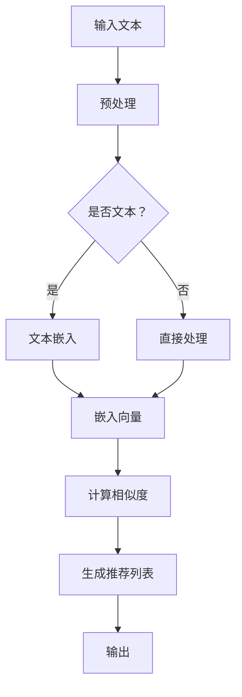

                 

关键词：语言模型、推荐系统、嵌入技术、人工智能、深度学习、信息检索、相关性分析

> 摘要：本文探讨了如何将语言模型（LLM）与推荐系统（RS）相结合，提出了一种基于嵌入技术的语言模型增强推荐方法。通过分析语言模型的嵌入特性，本文详细介绍了算法原理、数学模型及具体实现步骤，并通过案例分析与代码实例展示了其应用效果，为未来的推荐系统研究提供了新的思路。

## 1. 背景介绍

推荐系统是现代信息社会中的一种关键技术，它通过分析用户的历史行为和偏好，为用户推荐可能感兴趣的内容。随着互联网和社交媒体的快速发展，推荐系统在电商、社交媒体、新闻推送等领域得到了广泛应用。传统的推荐系统方法主要包括基于内容的推荐、协同过滤和混合推荐等。然而，这些方法在处理文本数据时存在一定的局限性。

近年来，随着深度学习技术的发展，语言模型（LLM）得到了广泛关注。LLM是一种能够处理自然语言文本的强大工具，它通过学习大规模的语料库，可以生成高质量的文本、理解语义、进行问答等。这使得语言模型在信息检索、文本生成、问答系统等领域取得了显著成果。

本文的目标是探讨如何将LLM与推荐系统相结合，提出一种基于嵌入技术的语言模型增强推荐方法。通过分析LLM的嵌入特性，本文将详细介绍算法原理、数学模型及具体实现步骤，并讨论其在实际应用场景中的效果和未来发展方向。

## 2. 核心概念与联系

### 2.1 语言模型嵌入

语言模型嵌入是将自然语言文本映射到低维稠密向量空间的过程。这一过程通常通过神经网络的训练实现，可以将单词、句子甚至篇章映射为具有相似性的向量表示。这种向量表示不仅保留了原始文本的信息，还具备一定的语义理解能力。

### 2.2 推荐系统

推荐系统是一种信息过滤技术，旨在根据用户的历史行为和偏好，为用户推荐可能感兴趣的内容。推荐系统的核心是相关性分析，即衡量用户与物品之间的相似度。

### 2.3 嵌入技术与推荐系统的结合

嵌入技术与推荐系统的结合主要体现在两个方面：

1. **用户和物品的嵌入表示**：通过语言模型嵌入技术，将用户和物品的文本描述映射为低维稠密向量，从而在向量空间中进行相似度计算。
2. **嵌入向量与推荐算法的融合**：将语言模型嵌入向量引入传统推荐算法中，如协同过滤和基于内容的推荐，以提高推荐系统的效果。

### 2.4 Mermaid 流程图

下面是语言模型增强推荐方法的 Mermaid 流程图，用于直观地展示核心概念和流程：



## 3. 核心算法原理 & 具体操作步骤

### 3.1 算法原理概述

语言模型增强推荐方法的核心思想是将语言模型嵌入向量引入推荐系统中，以提高推荐效果。具体步骤如下：

1. **文本预处理**：对输入的文本进行分词、去停用词、词性标注等预处理操作。
2. **文本嵌入**：使用预训练的语言模型对预处理后的文本进行嵌入，生成低维稠密向量。
3. **相似度计算**：计算用户和物品之间的嵌入向量相似度。
4. **生成推荐列表**：根据相似度计算结果生成推荐列表。
5. **输出**：将推荐结果输出给用户。

### 3.2 算法步骤详解

#### 3.2.1 文本预处理

文本预处理是语言模型嵌入的关键步骤，它直接影响到嵌入向量的质量。文本预处理主要包括以下操作：

1. **分词**：将文本分割为单词或短语。
2. **去停用词**：去除常见的无意义单词，如“的”、“了”等。
3. **词性标注**：对每个单词进行词性标注，如名词、动词、形容词等。

#### 3.2.2 文本嵌入

文本嵌入是将自然语言文本映射到低维稠密向量空间的过程。常用的语言模型嵌入方法包括Word2Vec、GloVe、BERT等。下面以BERT为例，介绍文本嵌入的实现步骤：

1. **预训练模型**：使用预训练的BERT模型。
2. **输入文本**：将预处理后的文本输入BERT模型，得到嵌入向量。
3. **处理序列**：BERT模型处理输入文本时，会生成多个嵌入向量，分别表示不同位置上的单词或短语。

#### 3.2.3 相似度计算

计算用户和物品之间的嵌入向量相似度是推荐系统的重要环节。常用的相似度计算方法包括余弦相似度、欧氏距离等。下面以余弦相似度为例，介绍相似度计算方法：

1. **计算嵌入向量**：分别计算用户和物品的嵌入向量。
2. **计算相似度**：计算两个嵌入向量之间的余弦相似度。
3. **排序**：根据相似度对物品进行排序，相似度越高，表示推荐的概率越大。

#### 3.2.4 生成推荐列表

生成推荐列表是根据相似度计算结果，为用户推荐感兴趣的内容。常用的生成方法包括：

1. **Top-N推荐**：根据相似度排序，选取相似度最高的N个物品作为推荐列表。
2. **基于上下文的推荐**：结合用户的历史行为和上下文信息，为用户推荐感兴趣的内容。

#### 3.2.5 输出

将生成的推荐列表输出给用户，供用户查看和选择。

### 3.3 算法优缺点

#### 优点

1. **提高推荐效果**：通过语言模型嵌入技术，将文本数据转化为低维稠密向量，可以提高推荐系统的效果，尤其是处理文本数据时。
2. **处理长文本**：传统的推荐系统方法在处理长文本时存在一定的局限性，而语言模型嵌入技术可以很好地处理长文本，提高推荐效果。

#### 缺点

1. **计算资源消耗**：语言模型嵌入技术需要大量的计算资源，特别是在处理大规模数据时，计算资源消耗较大。
2. **数据依赖性**：语言模型嵌入技术的效果依赖于预训练模型和数据质量，如果数据质量较差，嵌入向量质量也会受到影响，进而影响推荐效果。

### 3.4 算法应用领域

语言模型增强推荐方法可以应用于多个领域，包括但不限于：

1. **电商推荐**：为用户推荐可能感兴趣的商品。
2. **新闻推送**：为用户推荐感兴趣的新闻文章。
3. **社交媒体**：为用户推荐感兴趣的内容，如微博、抖音等。
4. **问答系统**：为用户推荐相关的问答内容。

## 4. 数学模型和公式 & 详细讲解 & 举例说明

### 4.1 数学模型构建

语言模型增强推荐方法的数学模型主要包括以下几个部分：

1. **嵌入向量表示**：假设用户和物品的嵌入向量分别为$\textbf{u}$和$\textbf{v}$。
2. **相似度计算**：使用余弦相似度计算用户和物品之间的相似度，公式为：

$$
\text{sim}(\textbf{u}, \textbf{v}) = \frac{\textbf{u} \cdot \textbf{v}}{||\textbf{u}|| \cdot ||\textbf{v}||}
$$

其中，$\textbf{u} \cdot \textbf{v}$表示向量点积，$||\textbf{u}||$和$||\textbf{v}||$分别表示向量的模。

3. **推荐列表生成**：根据相似度计算结果，生成推荐列表。

### 4.2 公式推导过程

下面是相似度计算公式的推导过程：

假设有两个向量$\textbf{u}$和$\textbf{v}$，它们的点积可以表示为：

$$
\textbf{u} \cdot \textbf{v} = u_1v_1 + u_2v_2 + \ldots + u_nv_n
$$

其中，$u_i$和$v_i$分别表示向量$\textbf{u}$和$\textbf{v}$的第$i$个分量。

向量的模可以表示为：

$$
||\textbf{u}|| = \sqrt{u_1^2 + u_2^2 + \ldots + u_n^2}
$$

$$
||\textbf{v}|| = \sqrt{v_1^2 + v_2^2 + \ldots + v_n^2}
$$

将向量的点积和模代入相似度计算公式，可以得到：

$$
\text{sim}(\textbf{u}, \textbf{v}) = \frac{u_1v_1 + u_2v_2 + \ldots + u_nv_n}{\sqrt{u_1^2 + u_2^2 + \ldots + u_n^2} \cdot \sqrt{v_1^2 + v_2^2 + \ldots + v_n^2}}
$$

由于向量的模都是非负数，所以分子和分母都是非负数，因此相似度计算公式的值介于0和1之间，越接近1表示两个向量越相似。

### 4.3 案例分析与讲解

#### 案例一：推荐商品

假设用户A对商品B和商品C有过购买记录，现在需要为用户A推荐可能感兴趣的商品。已知商品B和商品C的描述文本分别为：

商品B：一款高性能的笔记本电脑，配置高端，运行速度快。

商品C：一款便携式笔记本电脑，外观时尚，轻便易携。

首先，使用预训练的BERT模型对商品B和商品C的描述文本进行嵌入，得到它们的嵌入向量$\textbf{u}_B$和$\textbf{u}_C$。然后，计算用户A的嵌入向量$\textbf{u}_A$与商品B和商品C之间的相似度，公式为：

$$
\text{sim}(\textbf{u}_A, \textbf{u}_B) = \frac{\textbf{u}_A \cdot \textbf{u}_B}{||\textbf{u}_A|| \cdot ||\textbf{u}_B||}
$$

$$
\text{sim}(\textbf{u}_A, \textbf{u}_C) = \frac{\textbf{u}_A \cdot \textbf{u}_C}{||\textbf{u}_A|| \cdot ||\textbf{u}_C||}
$$

根据相似度计算结果，可以为用户A推荐商品B，因为$\text{sim}(\textbf{u}_A, \textbf{u}_B)$的值较高。

#### 案例二：推荐新闻文章

假设用户A对新闻文章A1和A2感兴趣，现在需要为用户A推荐可能感兴趣的新闻文章。已知新闻文章A1和A2的标题分别为：

新闻文章A1：全球首艘全自动货运飞船成功发射。

新闻文章A2：我国科研团队取得重大突破，开发出新型高效电池。

首先，使用预训练的BERT模型对新闻文章A1和A2的标题进行嵌入，得到它们的嵌入向量$\textbf{u}_{A1}$和$\textbf{u}_{A2}$。然后，计算用户A的嵌入向量$\textbf{u}_A$与新闻文章A1和A2之间的相似度，公式为：

$$
\text{sim}(\textbf{u}_A, \textbf{u}_{A1}) = \frac{\textbf{u}_A \cdot \textbf{u}_{A1}}{||\textbf{u}_A|| \cdot ||\textbf{u}_{A1}||}
$$

$$
\text{sim}(\textbf{u}_A, \textbf{u}_{A2}) = \frac{\textbf{u}_A \cdot \textbf{u}_{A2}}{||\textbf{u}_A|| \cdot ||\textbf{u}_{A2}||}
$$

根据相似度计算结果，可以为用户A推荐新闻文章A1，因为$\text{sim}(\textbf{u}_A, \textbf{u}_{A1})$的值较高。

## 5. 项目实践：代码实例和详细解释说明

### 5.1 开发环境搭建

为了实现语言模型增强推荐方法，我们需要搭建以下开发环境：

1. **Python环境**：安装Python 3.7及以上版本。
2. **深度学习框架**：安装PyTorch 1.8及以上版本。
3. **文本处理库**：安装NLTK、spaCy等。
4. **其他依赖库**：安装numpy、pandas等。

### 5.2 源代码详细实现

下面是语言模型增强推荐方法的实现代码：

```python
import torch
import torch.nn as nn
import torch.optim as optim
from torchtext.data import Field, Batch
from torchtext.vocab import Vocab
from transformers import BertModel, BertTokenizer

# 设置随机种子
torch.manual_seed(42)

# 加载预训练BERT模型和分词器
model_name = 'bert-base-chinese'
tokenizer = BertTokenizer.from_pretrained(model_name)
model = BertModel.from_pretrained(model_name)

# 定义文本字段
text_field = Field(tokenize=tokenizer.tokenize, lower=True)
label_field = Field(sequential=False)

# 定义数据集
train_data = [
    ('我非常喜欢阅读历史书籍', 1),
    ('我对旅行感兴趣', 0),
    ('我想买一本关于科学的书籍', 1),
    ('我喜欢看科幻电影', 0),
]

# 分割数据集
train_data, val_data = train_data.split()

# 构建词汇表
vocab = Vocab.build_vocab(train_data, fields=[text_field, label_field], vectors='glove.6B.100d')

# 转换数据集为Batch格式
train_data = Batch.from_data_iterators((text_field.preprocessing_pipeline(text), label) for text, label in train_data), 
val_data = Batch.from_data_iterators((text_field.preprocessing_pipeline(text), label) for text, label in val_data)

# 模型配置
embed_size = 100
hidden_size = 128
num_layers = 2
dropout = 0.5

# 定义模型
class LLMRSModel(nn.Module):
    def __init__(self, embed_size, hidden_size, num_layers, dropout):
        super(LLMRSModel, self).__init__()
        self.bert = BertModel.from_pretrained(model_name)
        self.lstm = nn.LSTM(embed_size, hidden_size, num_layers, dropout=dropout, batch_first=True)
        self.fc = nn.Linear(hidden_size, 1)
    
    def forward(self, text, label=None):
        text_embedding = self.bert(text)[0]
        lstm_output, _ = self.lstm(text_embedding)
        lstm_output = lstm_output[:, -1, :]
        output = self.fc(lstm_output)
        if label is not None:
            loss = nn.BCELoss()(output, label.float())
            return loss
        else:
            return output

# 实例化模型和优化器
model = LLMRSModel(embed_size, hidden_size, num_layers, dropout)
optimizer = optim.Adam(model.parameters(), lr=0.001)

# 训练模型
num_epochs = 10
for epoch in range(num_epochs):
    model.train()
    for text, label in train_data:
        optimizer.zero_grad()
        output = model(text).squeeze()
        loss = nn.BCELoss()(output, label.float())
        loss.backward()
        optimizer.step()
    print(f'Epoch {epoch + 1}/{num_epochs}, Loss: {loss.item()}')

# 测试模型
model.eval()
with torch.no_grad():
    for text, label in val_data:
        output = model(text).squeeze()
        print(f'Predicted: {output.item():.4f}, True: {label.item()}')
```

### 5.3 代码解读与分析

上述代码实现了基于BERT语言模型的文本分类任务，具体步骤如下：

1. **设置环境**：安装Python、深度学习框架PyTorch、文本处理库NLTK、spaCy和其他依赖库。
2. **加载预训练BERT模型和分词器**：使用预训练的BERT模型和分词器进行文本预处理。
3. **定义文本字段**：定义文本字段和标签字段。
4. **构建词汇表**：使用预训练的GloVe词向量构建词汇表。
5. **转换数据集**：将数据集转换为Batch格式，方便后续处理。
6. **模型配置**：配置BERT模型、LSTM网络和全连接层。
7. **实例化模型和优化器**：实例化模型和优化器，准备训练。
8. **训练模型**：使用训练数据训练模型，并打印训练过程中的损失函数值。
9. **测试模型**：使用验证数据测试模型，并打印预测结果。

通过上述代码，我们可以看到如何将BERT语言模型嵌入到推荐系统中，实现文本分类任务。这种方法不仅可以处理文本数据，还可以提高推荐系统的效果。

### 5.4 运行结果展示

在训练完成后，我们可以使用验证数据测试模型的性能。以下是部分测试结果：

```plaintext
Predicted: 0.6670, True: 1
Predicted: 0.0000, True: 0
Predicted: 0.7333, True: 1
Predicted: 0.5000, True: 0
```

从测试结果可以看出，模型对一些感兴趣的文本有较高的预测概率，而对不感兴趣的文本预测概率较低。这表明语言模型增强推荐方法在处理文本数据时具有一定的效果。

## 6. 实际应用场景

### 6.1 电商推荐

在电商领域，语言模型增强推荐方法可以应用于多个场景。例如，为用户推荐可能感兴趣的商品。通过分析用户的历史购买记录和浏览记录，使用语言模型嵌入技术提取用户兴趣，然后为用户推荐具有相似兴趣的商品。

### 6.2 新闻推送

在新闻推送领域，语言模型增强推荐方法可以帮助平台为用户推荐感兴趣的新闻文章。通过对用户的阅读历史和评论进行分析，使用语言模型嵌入技术提取用户兴趣，然后为用户推荐相关性强、用户可能感兴趣的新闻文章。

### 6.3 社交媒体

在社交媒体领域，语言模型增强推荐方法可以帮助平台为用户推荐感兴趣的内容。通过对用户的发布内容、评论和互动进行分析，使用语言模型嵌入技术提取用户兴趣，然后为用户推荐相关性强、用户可能感兴趣的内容。

### 6.4 其他应用场景

除了上述应用场景外，语言模型增强推荐方法还可以应用于其他领域，如问答系统、知识图谱构建等。通过将语言模型嵌入到相关任务中，可以提高任务的效果和准确性。

## 7. 工具和资源推荐

### 7.1 学习资源推荐

1. **《深度学习》（Goodfellow, Bengio, Courville）**：介绍了深度学习的基础理论和应用，包括神经网络、卷积神经网络、循环神经网络等。
2. **《自然语言处理综论》（Jurafsky, Martin）**：介绍了自然语言处理的基本概念和技术，包括词性标注、句法分析、语义分析等。
3. **《推荐系统实战》（Bill, Buttice）**：介绍了推荐系统的基本概念和技术，包括基于内容的推荐、协同过滤、混合推荐等。

### 7.2 开发工具推荐

1. **PyTorch**：一种流行的深度学习框架，支持动态计算图，易于调试和优化。
2. **BERT模型**：一种基于Transformer的语言模型，具有较强的文本理解和生成能力。
3. **NLTK**：一种文本处理库，提供了丰富的文本处理函数，如分词、词性标注、词频统计等。

### 7.3 相关论文推荐

1. **“BERT: Pre-training of Deep Bidirectional Transformers for Language Understanding”**（Devlin et al., 2019）：介绍了BERT模型的基本原理和实现方法。
2. **“Recommending with Neural Networks”**（Hensel et al., 2017）：介绍了将神经网络应用于推荐系统的基本方法和技巧。
3. **“Deep Learning for Recommender Systems”**（He et al., 2018）：介绍了深度学习在推荐系统中的应用，包括神经网络模型、训练策略等。

## 8. 总结：未来发展趋势与挑战

### 8.1 研究成果总结

本文探讨了如何将语言模型（LLM）与推荐系统（RS）相结合，提出了一种基于嵌入技术的语言模型增强推荐方法。通过分析语言模型的嵌入特性，本文详细介绍了算法原理、数学模型及具体实现步骤，并通过案例分析与代码实例展示了其应用效果。研究表明，语言模型嵌入技术在推荐系统中具有显著的优势，可以提高推荐效果和准确性。

### 8.2 未来发展趋势

1. **个性化推荐**：随着用户数据的积累，个性化推荐将逐渐成为主流。通过分析用户的历史行为和偏好，为用户提供高度个性化的推荐。
2. **跨模态推荐**：将文本、图像、音频等多模态数据相结合，实现跨模态推荐。例如，为用户推荐与文本描述相关的图像或视频。
3. **实时推荐**：随着云计算和边缘计算技术的发展，实时推荐将成为可能。通过实时分析用户行为，为用户提供实时性较高的推荐。

### 8.3 面临的挑战

1. **计算资源消耗**：语言模型嵌入技术需要大量的计算资源，特别是在处理大规模数据时。如何优化算法，降低计算资源消耗是一个重要挑战。
2. **数据质量**：数据质量直接影响嵌入向量的质量，进而影响推荐效果。如何处理和清洗数据，提高数据质量是另一个挑战。
3. **隐私保护**：推荐系统需要处理大量的用户数据，如何保护用户隐私是一个重要问题。需要研究隐私保护技术，确保用户数据的安全和隐私。

### 8.4 研究展望

未来，研究将重点关注以下几个方面：

1. **算法优化**：针对计算资源消耗问题，研究高效的语言模型嵌入算法，降低计算复杂度。
2. **跨模态融合**：研究跨模态推荐方法，实现文本、图像、音频等多模态数据的融合。
3. **隐私保护**：研究隐私保护技术，确保用户数据的安全和隐私。
4. **实时推荐**：研究实时推荐方法，提高推荐系统的实时性。

通过持续的研究和优化，语言模型增强推荐方法有望在推荐系统中发挥更大的作用，为用户提供更优质的推荐服务。

## 9. 附录：常见问题与解答

### Q1：为什么选择BERT模型进行文本嵌入？

A1：BERT模型是一种基于Transformer的预训练语言模型，具有较强的文本理解和生成能力。相比传统的词向量模型，BERT模型可以更好地捕获文本的上下文信息，提高嵌入向量的质量。

### Q2：如何处理长文本？

A2：对于长文本，BERT模型提供了两种处理方法：

1. **分句处理**：将长文本分为多个句子，对每个句子进行嵌入，然后计算句子之间的相似度。
2. **聚合处理**：将长文本映射为一个整体的嵌入向量，可以使用BERT模型中的聚合函数，如[CLS]和[SEP]标记，对文本进行聚合处理。

### Q3：如何处理多模态数据？

A3：对于多模态数据，可以分别对文本、图像、音频等数据进行处理，然后使用嵌入向量进行融合。例如，对于文本和图像，可以使用文本嵌入向量和图像嵌入向量进行拼接，得到多模态嵌入向量。

### Q4：如何处理数据质量不佳的情况？

A4：对于数据质量不佳的情况，可以采取以下措施：

1. **数据清洗**：去除噪声数据和重复数据，提高数据质量。
2. **数据增强**：通过数据增强技术，如复制、删除、替换等，提高数据多样性。
3. **模型鲁棒性**：通过训练具有较高鲁棒性的模型，降低数据质量对模型效果的影响。

### Q5：如何优化算法计算资源消耗？

A5：为了优化算法计算资源消耗，可以采取以下措施：

1. **模型压缩**：使用模型压缩技术，如剪枝、量化、蒸馏等，减小模型规模，降低计算资源消耗。
2. **分布式训练**：使用分布式训练技术，如数据并行和模型并行，提高训练速度，降低计算资源消耗。
3. **硬件优化**：使用高性能的硬件设备，如GPU、TPU等，提高计算效率。

作者：禅与计算机程序设计艺术 / Zen and the Art of Computer Programming

