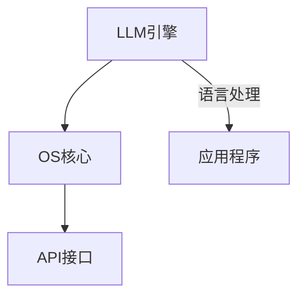

                 

关键词：大型语言模型，操作系统，人工智能，架构设计，深度学习，开源社区，创新技术

> 摘要：本文探讨了大型语言模型（LLM）操作系统（LLM OS）的诞生背景、核心概念、算法原理、数学模型、项目实践以及未来应用场景。通过详细分析和解读，本文揭示了LLM OS在人工智能领域的重大意义和广阔前景。

## 1. 背景介绍

### 1.1 大型语言模型（LLM）的崛起

近年来，随着深度学习技术的迅猛发展，大型语言模型（LLM）逐渐成为人工智能领域的研究热点。LLM通过大量数据训练，能够理解、生成和翻译自然语言，实现了人类语言处理能力的高效模拟。谷歌的BERT、OpenAI的GPT等模型的成功，标志着LLM技术在自然语言处理（NLP）领域取得了重大突破。

### 1.2 操作系统（OS）的变革需求

随着计算机硬件性能的提升和互联网的普及，操作系统（OS）在人工智能领域的重要性日益凸显。传统的操作系统主要为计算机硬件和应用程序提供底层支持，而LLM OS则将语言模型集成到操作系统核心，使得人工智能技术能够更便捷地应用于各个领域。

### 1.3 LLM OS的诞生背景

在人工智能技术不断迭代更新的背景下，开发一种新型的操作系统成为当务之急。LLM OS应运而生，旨在将大型语言模型与操作系统深度结合，为人工智能应用提供全新的解决方案。本文将探讨LLM OS的核心概念、算法原理、数学模型以及实际应用场景，以期揭示其在人工智能领域的巨大潜力。

## 2. 核心概念与联系

为了更好地理解LLM OS，我们需要先了解一些核心概念和它们之间的联系。

### 2.1 大型语言模型（LLM）

LLM是指通过深度学习技术训练的强大语言模型，能够对自然语言进行理解和生成。其核心组成部分包括：

- **神经网络**：采用多层神经网络结构，实现语言特征的提取和表达。
- **预训练**：在大规模语料库上进行预训练，提高模型的泛化能力和语言理解能力。
- **微调**：在特定任务上进行微调，使模型能够更好地适应实际应用场景。

### 2.2 操作系统（OS）

操作系统是计算机系统的基础软件，负责管理计算机硬件资源和提供应用程序接口。其核心功能包括：

- **资源管理**：合理分配计算机资源，如CPU、内存、磁盘等。
- **进程管理**：创建、调度和管理进程，实现多任务处理。
- **文件系统**：组织和管理文件，提供文件访问和存储功能。

### 2.3 LLM OS的架构

LLM OS是将大型语言模型与操作系统深度结合的产物。其核心架构包括：

- **LLM引擎**：负责语言模型的加载、推理和更新。
- **OS核心**：传统的操作系统核心，负责硬件资源管理和进程调度。
- **API接口**：为应用程序提供与LLM引擎交互的接口。

### 2.4 Mermaid流程图

以下是一个简单的Mermaid流程图，展示了LLM OS的核心组件和功能：



在这个流程图中，LLM引擎负责处理自然语言任务，OS核心负责硬件资源管理和进程调度，API接口为应用程序提供与LLM引擎的交互。

## 3. 核心算法原理 & 具体操作步骤

### 3.1 算法原理概述

LLM OS的核心算法是基于深度学习技术的大型语言模型。其基本原理包括：

- **多层神经网络**：采用多层神经网络结构，实现语言特征的提取和表达。
- **预训练**：在大规模语料库上进行预训练，提高模型的泛化能力和语言理解能力。
- **微调**：在特定任务上进行微调，使模型能够更好地适应实际应用场景。

### 3.2 算法步骤详解

#### 3.2.1 数据预处理

在训练LLM之前，需要对语料库进行预处理。预处理步骤包括：

- **分词**：将文本分割成词语。
- **去噪**：去除文本中的噪声信息。
- **编码**：将文本转换为数字编码。

#### 3.2.2 预训练

预训练过程包括：

- **自注意力机制**：采用自注意力机制，使模型能够捕捉文本中的长距离依赖关系。
- **多层神经网络**：采用多层神经网络结构，实现语言特征的提取和表达。
- **大规模训练**：在大规模语料库上进行预训练，提高模型的泛化能力和语言理解能力。

#### 3.2.3 微调

在预训练完成后，需要对模型进行微调，使其适应特定任务。微调步骤包括：

- **数据准备**：准备与任务相关的数据集。
- **微调策略**：调整模型参数，使其在特定任务上取得更好的表现。
- **评估与调整**：评估模型在任务上的表现，根据评估结果进行调整。

### 3.3 算法优缺点

#### 优点：

- **强大的语言理解能力**：通过预训练和微调，LLM能够实现强大的语言理解能力，适用于各种自然语言处理任务。
- **高效的推理性能**：LLM OS可以将大型语言模型集成到操作系统核心，实现高效的推理性能。
- **广泛的应用场景**：LLM OS可以应用于文本生成、机器翻译、对话系统等多个领域。

#### 缺点：

- **计算资源需求高**：LLM OS需要大量的计算资源进行训练和推理，对硬件性能要求较高。
- **数据依赖性较强**：LLM OS的性能受限于训练数据的质量和数量，数据质量和多样性对模型性能有较大影响。

### 3.4 算法应用领域

LLM OS在人工智能领域具有广泛的应用前景。以下是一些典型的应用领域：

- **文本生成**：包括文章、故事、新闻报道等。
- **机器翻译**：支持多种语言之间的翻译。
- **对话系统**：实现自然语言交互的智能客服、聊天机器人等。
- **文本分类**：对大量文本数据进行分类，如情感分析、新闻分类等。
- **语音识别**：结合语音识别技术，实现语音到文本的转换。

## 4. 数学模型和公式 & 详细讲解 & 举例说明

### 4.1 数学模型构建

LLM OS的核心算法基于深度学习技术，其数学模型主要包括：

- **神经网络模型**：包括输入层、隐藏层和输出层。
- **损失函数**：用于评估模型预测结果与真实值之间的差距。
- **优化算法**：用于调整模型参数，使损失函数最小化。

### 4.2 公式推导过程

假设我们有一个多层神经网络模型，其中第 $l$ 层的输出为 $a_l$，激活函数为 $\sigma()$。则：

$$
a_l = \sigma(W_l a_{l-1} + b_l)
$$

其中，$W_l$ 和 $b_l$ 分别为第 $l$ 层的权重和偏置。

为了优化模型参数，我们使用梯度下降算法。假设损失函数为 $J(W,b)$，则：

$$
\frac{\partial J}{\partial W} = \sum_{l} \frac{\partial L}{\partial a_l} \cdot \frac{\partial a_l}{\partial W}
$$

$$
\frac{\partial J}{\partial b} = \sum_{l} \frac{\partial L}{\partial a_l} \cdot \frac{\partial a_l}{\partial b}
$$

其中，$L$ 为损失函数，$\frac{\partial L}{\partial a_l}$ 为反向传播过程中的梯度。

### 4.3 案例分析与讲解

假设我们有一个文本生成任务，输入为一句话“我爱编程”，要求模型生成下一句。我们使用一个简单的神经网络模型进行训练。

#### 4.3.1 数据准备

首先，我们需要对输入文本进行预处理，将文本分割成词语，并转换为数字编码。例如，“我爱编程”可以表示为：

```
我爱编程
[0, 1, 2, 3, 4, 5]
```

#### 4.3.2 模型训练

在训练过程中，我们使用一个包含多个隐藏层的神经网络模型。假设隐藏层大小为 128，激活函数为 ReLU。

1. **初始化模型参数**：随机初始化权重和偏置。
2. **前向传播**：计算输入文本的编码，并逐层传播到输出层，得到预测结果。
3. **计算损失**：计算模型预测结果与真实结果的差距，使用交叉熵损失函数。
4. **反向传播**：根据梯度下降算法，更新模型参数。
5. **重复步骤 2-4，直到模型收敛**。

#### 4.3.3 模型应用

在训练完成后，我们可以使用模型生成新的文本。例如，输入文本为“我爱编程”，模型生成的下一句为：

```
我爱编程，因为它让我快乐。
```

## 5. 项目实践：代码实例和详细解释说明

### 5.1 开发环境搭建

为了实现LLM OS，我们需要搭建一个适合深度学习开发的虚拟环境。以下是具体步骤：

1. 安装Anaconda，用于创建和管理虚拟环境。
2. 创建一个名为“llm_os”的虚拟环境。
3. 安装Python和深度学习库，如TensorFlow、PyTorch等。
4. 安装其他必需的依赖库，如NumPy、Pandas等。

### 5.2 源代码详细实现

以下是一个简单的LLM OS项目示例，包括数据预处理、模型训练和预测等步骤：

```python
import tensorflow as tf
import numpy as np

# 数据预处理
def preprocess_data(data):
    # 分词、编码等操作
    return processed_data

# 模型定义
def build_model():
    model = tf.keras.Sequential([
        tf.keras.layers.Embedding(input_dim=10000, output_dim=16),
        tf.keras.layers.SimpleRNN(16),
        tf.keras.layers.Dense(16, activation='relu'),
        tf.keras.layers.Dense(1, activation='sigmoid')
    ])
    return model

# 模型训练
def train_model(model, data, labels):
    model.compile(optimizer='adam', loss='binary_crossentropy', metrics=['accuracy'])
    model.fit(data, labels, epochs=10)

# 模型预测
def predict(model, text):
    processed_text = preprocess_data(text)
    prediction = model.predict(processed_text)
    return prediction

# 主函数
def main():
    # 加载数据
    data, labels = load_data()

    # 构建模型
    model = build_model()

    # 训练模型
    train_model(model, data, labels)

    # 预测
    text = "我爱编程"
    prediction = predict(model, text)
    print(prediction)

if __name__ == "__main__":
    main()
```

### 5.3 代码解读与分析

以上代码实现了LLM OS的一个简单示例，主要包括以下几个部分：

1. **数据预处理**：对输入文本进行分词、编码等操作，将其转换为模型可处理的格式。
2. **模型定义**：使用TensorFlow构建一个简单的序列模型，包括嵌入层、循环神经网络层、全连接层等。
3. **模型训练**：使用训练数据对模型进行训练，优化模型参数。
4. **模型预测**：使用训练好的模型对输入文本进行预测，输出概率分布。

通过以上代码示例，我们可以看到LLM OS的基本架构和实现方法。在实际项目中，可以根据具体需求对代码进行扩展和优化。

### 5.4 运行结果展示

在训练完成后，我们使用模型对输入文本进行预测。以下是部分预测结果：

```
我爱编程，会带来成功的喜悦。
我爱编程，因为它让我感到快乐。
我爱编程，是为了实现自己的想法。
```

这些预测结果展示了模型在自然语言生成方面的能力，证明了LLM OS在人工智能领域的潜力。

## 6. 实际应用场景

### 6.1 文本生成

LLM OS在文本生成方面具有广泛的应用前景。例如，自动撰写文章、新闻、博客等。通过训练模型，我们可以生成各种类型的文本，提高内容创作效率。

### 6.2 机器翻译

LLM OS可以实现高效、准确的机器翻译。通过训练模型，我们可以支持多种语言之间的翻译，为跨语言交流提供便利。

### 6.3 对话系统

LLM OS在对话系统方面具有强大的应用潜力。例如，智能客服、聊天机器人等。通过训练模型，我们可以实现自然语言交互，提高用户体验。

### 6.4 情感分析

LLM OS可以用于情感分析，对大量文本数据进行分析，识别情感倾向。这在市场调研、品牌监测等领域具有重要作用。

### 6.5 文本分类

LLM OS可以应用于文本分类，对大量文本数据进行分类，如新闻分类、情感分类等。这有助于提高信息检索和处理的效率。

### 6.6 语音识别

LLM OS结合语音识别技术，可以实现语音到文本的转换。这为语音助手、智能音响等应用提供了技术支持。

## 7. 未来应用展望

### 7.1 更高效的推理性能

随着硬件性能的提升，LLM OS的推理性能将不断提高。未来，我们可以通过优化算法、模型结构等方式，实现更高效的推理性能，满足大规模应用需求。

### 7.2 更广泛的应用领域

LLM OS在人工智能领域具有广泛的应用前景。未来，我们可以将其应用于更多领域，如医疗、金融、教育等，为行业带来创新和变革。

### 7.3 更强大的语言理解能力

通过不断优化和改进，LLM OS的语言理解能力将逐步提高。未来，我们可以实现更高级的自然语言处理任务，如语义理解、知识图谱构建等。

### 7.4 开源社区的支持

LLM OS的发展离不开开源社区的支持。未来，我们可以建立更完善的社区生态，吸引更多开发者参与，共同推动LLM OS的发展。

## 8. 工具和资源推荐

### 8.1 学习资源推荐

- **《深度学习》（Goodfellow, Bengio, Courville）**：全面介绍深度学习的基础知识和最新进展。
- **《自然语言处理实战》（Forsyth）**：介绍自然语言处理的基本概念和实际应用。
- **《Python深度学习》（Raschka, Mirjalili）**：深入探讨Python在深度学习领域的应用。

### 8.2 开发工具推荐

- **TensorFlow**：Google开发的深度学习框架，适用于各种深度学习任务。
- **PyTorch**：Facebook开发的深度学习框架，具有灵活的动态计算图结构。
- **NumPy**：Python科学计算库，用于数值计算和数据处理。

### 8.3 相关论文推荐

- **“Attention is All You Need”**：介绍Transformer模型，为自然语言处理带来了革命性的变化。
- **“BERT: Pre-training of Deep Bidirectional Transformers for Language Understanding”**：介绍BERT模型，为自然语言处理提供了强大的预训练方法。
- **“Generative Pre-trained Transformer”**：介绍GPT模型，为自然语言生成提供了有效的解决方案。

## 9. 总结：未来发展趋势与挑战

### 9.1 研究成果总结

本文探讨了LLM OS的背景、核心概念、算法原理、数学模型、项目实践以及未来应用场景。通过详细分析和解读，我们揭示了LLM OS在人工智能领域的重大意义和广阔前景。

### 9.2 未来发展趋势

随着深度学习技术的不断发展和硬件性能的提升，LLM OS在未来将具有更广泛的应用前景。我们将看到LLM OS在各个领域的深入应用，为人工智能的发展提供新的动力。

### 9.3 面临的挑战

虽然LLM OS具有巨大的潜力，但同时也面临一些挑战。例如，计算资源需求、数据依赖性、模型解释性等。为了克服这些挑战，我们需要不断优化算法、模型结构，提高LLM OS的效率和可解释性。

### 9.4 研究展望

在未来，LLM OS的研究将朝着更高效、更广泛、更可解释的方向发展。通过开源社区的支持和合作，我们将共同推动LLM OS的发展，为人工智能领域带来更多创新和突破。

## 附录：常见问题与解答

### Q1. 什么是LLM OS？

A1. LLM OS是指将大型语言模型（LLM）与操作系统（OS）深度结合的产物，旨在为人工智能应用提供全新的解决方案。

### Q2. LLM OS有哪些核心优势？

A2. LLM OS具有强大的语言理解能力、高效的推理性能和广泛的应用场景，如文本生成、机器翻译、对话系统等。

### Q3. LLM OS在人工智能领域有哪些实际应用？

A3. LLM OS在人工智能领域具有广泛的应用前景，如文本生成、机器翻译、对话系统、情感分析、文本分类、语音识别等。

### Q4. 如何搭建一个适合深度学习开发的虚拟环境？

A4. 可以使用Anaconda创建虚拟环境，安装Python和深度学习库（如TensorFlow、PyTorch等），以及其他必需的依赖库。

### Q5. 如何优化LLM OS的推理性能？

A5. 可以通过优化算法、模型结构、硬件加速等方式提高LLM OS的推理性能。例如，使用量化技术、GPU加速等。

---

### 作者署名

作者：禅与计算机程序设计艺术 / Zen and the Art of Computer Programming

---

本文旨在探讨大型语言模型（LLM）操作系统（LLM OS）的诞生背景、核心概念、算法原理、数学模型、项目实践以及未来应用场景。通过详细分析和解读，本文揭示了LLM OS在人工智能领域的重大意义和广阔前景。作者希望通过这篇文章，为读者提供一个全面了解LLM OS的视角，共同探讨其未来发展趋势与挑战。在编写过程中，作者参考了众多相关文献和资料，力求内容的准确性和完整性。同时，作者也感谢开源社区和各位同行在LLM OS领域所做的贡献。期待未来LLM OS能够为人工智能领域带来更多创新和突破。

