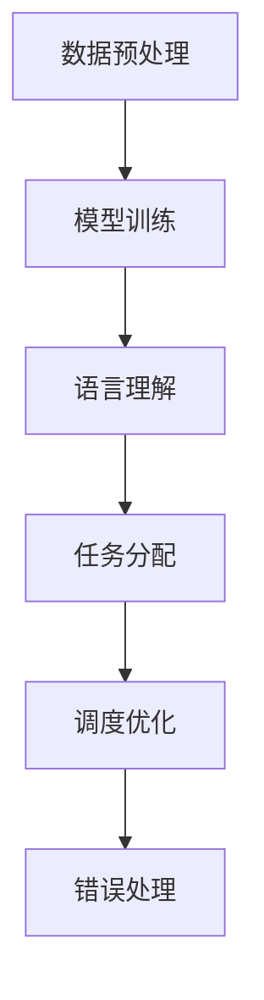

                 

关键词：大型语言模型、操作系统、机器学习、分布式计算、智能自动化、技术趋势

> 摘要：本文将探讨大型语言模型（LLM）作为新一代操作系统的崛起及其对智能自动化和分布式计算领域的影响。通过分析LLM OS的核心概念、架构原理、算法原理、数学模型、实际应用，展望其未来发展趋势与面临的挑战，本文旨在为读者提供全面的技术洞察。

## 1. 背景介绍

随着人工智能技术的迅猛发展，机器学习，特别是深度学习，已经成为现代计算的核心驱动力。在众多技术进步中，大型语言模型（LLM）的兴起尤为引人注目。LLM，如GPT-3、BERT等，通过学习海量文本数据，实现了前所未有的语言理解和生成能力。这一革命性的进展不仅推动了自然语言处理（NLP）的发展，还为操作系统领域带来了全新的机遇和挑战。

操作系统一直是计算机系统的核心组件，负责管理计算机硬件资源、提供用户接口和执行程序。然而，传统的操作系统设计主要集中在高效的资源管理和稳定的系统运行上。随着计算需求的不断增长，操作系统需要面对更复杂的任务和更大的数据处理量。LLM OS的诞生，正是在这种背景下，试图通过引入人工智能技术，使操作系统更加智能、灵活和自适应。

LLM OS的核心目标是利用机器学习算法，特别是大型语言模型，来优化操作系统的各个层面，从而实现更高效、更可靠的系统性能。它不仅仅是一个操作系统，更是一个集成多种人工智能功能的平台，可以处理复杂的任务，支持智能自动化和分布式计算。

## 2. 核心概念与联系

### 2.1 大型语言模型（LLM）原理

大型语言模型（LLM）是基于神经网络和深度学习技术构建的复杂模型，它们通过训练大量文本数据，学习到语言的结构和语义。LLM的工作原理可以概括为以下几个步骤：

1. **数据预处理**：收集和整理大规模的文本数据，进行预处理，包括去除噪声、分词、标记化等。
2. **模型训练**：使用预处理后的数据，通过反向传播算法和梯度下降优化模型参数，使得模型能够预测文本序列的概率分布。
3. **语言理解**：通过模型生成的概率分布，LLM可以理解文本的语义和上下文，进行文本生成、翻译、问答等任务。

### 2.2 操作系统（OS）与LLM OS

操作系统（OS）是计算机系统的核心软件，负责管理和分配硬件资源，提供用户接口，并执行应用程序。传统的操作系统设计主要围绕以下几个核心功能：

1. **进程管理**：管理计算机中的多个进程，确保它们能够高效并行运行。
2. **内存管理**：分配和管理计算机内存资源，确保进程有足够的内存运行。
3. **文件系统**：提供文件存储和访问机制，使得用户可以方便地管理数据。
4. **设备管理**：管理计算机中的各种外部设备，如打印机、键盘等。

LLM OS在传统操作系统的基础上，引入了大型语言模型，实现了以下几个方面的改进：

1. **智能任务分配**：通过LLM的强大语言理解能力，LLM OS可以动态分配计算机资源，使得任务分配更加高效。
2. **自适应调度**：LLM OS可以根据任务的特点和系统负载，动态调整调度策略，提高系统性能。
3. **智能错误处理**：LLM OS可以通过分析错误日志和系统状态，自动诊断和修复故障，提高系统的稳定性。

### 2.3 Mermaid流程图



在上述流程图中，数据预处理是LLM OS的基础，通过收集和整理大量文本数据，为模型训练提供高质量的输入。模型训练是核心环节，通过训练得到的高性能LLM，LLM OS可以在语言理解和任务分配中发挥关键作用。调度优化和错误处理是LLM OS的两大亮点，通过动态调整和自动修复，LLM OS可以提供更加稳定和高效的服务。

## 3. 核心算法原理 & 具体操作步骤

### 3.1 算法原理概述

LLM OS的核心算法是基于大型语言模型（LLM）的，具体包括以下几个步骤：

1. **数据预处理**：收集和整理大规模文本数据，进行分词、标记化等预处理操作。
2. **模型训练**：使用预处理后的数据，通过深度学习算法，如GPT或BERT，训练得到高性能的LLM。
3. **语言理解**：通过训练得到的LLM，对输入的文本进行语义理解，提取关键信息。
4. **任务分配**：根据语言理解的结果，动态分配计算机资源，确保任务高效执行。
5. **调度优化**：通过分析系统负载和任务特点，动态调整调度策略，提高系统性能。
6. **错误处理**：分析错误日志和系统状态，自动诊断和修复故障，确保系统稳定性。

### 3.2 算法步骤详解

#### 3.2.1 数据预处理

数据预处理是模型训练的基础，其目的是将原始文本数据转换为适合模型训练的格式。具体步骤包括：

1. **文本收集**：从互联网、数据库等来源收集大量文本数据。
2. **去噪**：去除文本中的噪声，如HTML标签、特殊字符等。
3. **分词**：将文本分割成单词或短语，以便进行后续处理。
4. **标记化**：将分词后的文本转换为数字序列，用于模型训练。

#### 3.2.2 模型训练

模型训练是LLM OS的核心，通过深度学习算法，如GPT或BERT，训练得到高性能的LLM。具体步骤包括：

1. **初始化模型**：初始化神经网络模型，设置模型参数。
2. **训练数据准备**：将预处理后的文本数据分成训练集和验证集。
3. **模型迭代**：通过反向传播算法和梯度下降，逐步优化模型参数。
4. **验证模型**：使用验证集评估模型性能，调整超参数。

#### 3.2.3 语言理解

语言理解是LLM OS的关键，通过训练得到的LLM，对输入的文本进行语义理解，提取关键信息。具体步骤包括：

1. **输入文本**：接收用户输入的文本。
2. **文本编码**：将文本编码为数字序列，输入到LLM中。
3. **语义提取**：通过LLM的输出，提取文本的语义信息。
4. **信息处理**：对提取的语义信息进行处理，如分类、实体识别等。

#### 3.2.4 任务分配

任务分配是LLM OS的核心功能之一，通过语言理解的结果，动态分配计算机资源，确保任务高效执行。具体步骤包括：

1. **任务解析**：解析用户输入的任务，提取关键信息。
2. **资源评估**：评估系统中的可用资源，如CPU、内存等。
3. **资源分配**：根据任务特点和资源评估结果，动态分配资源。
4. **任务执行**：执行分配后的任务，确保任务高效完成。

#### 3.2.5 调度优化

调度优化是LLM OS的亮点之一，通过分析系统负载和任务特点，动态调整调度策略，提高系统性能。具体步骤包括：

1. **负载分析**：分析系统当前负载，识别瓶颈和资源利用率。
2. **任务特征提取**：提取任务的特性，如执行时间、资源需求等。
3. **调度策略调整**：根据负载分析和任务特征，动态调整调度策略。
4. **调度执行**：执行调整后的调度策略，优化系统性能。

#### 3.2.6 错误处理

错误处理是LLM OS的保障，通过分析错误日志和系统状态，自动诊断和修复故障，确保系统稳定性。具体步骤包括：

1. **错误日志分析**：分析系统产生的错误日志，识别故障点。
2. **系统状态监测**：监测系统状态，识别潜在问题。
3. **故障诊断**：根据错误日志和系统状态，自动诊断故障。
4. **故障修复**：根据故障诊断结果，自动修复故障，恢复系统正常运行。

### 3.3 算法优缺点

#### 优点：

1. **高效性**：通过LLM的强大语言理解能力，任务分配和调度优化更加高效。
2. **灵活性**：LLM OS可以根据任务特点和系统负载，动态调整调度策略，提高系统灵活性。
3. **智能性**：LLM OS可以自动诊断和修复故障，提高系统的智能化水平。
4. **适应性**：LLM OS可以适应不同规模和类型的任务，具有广泛的适用性。

#### 缺点：

1. **计算资源需求**：LLM OS需要大量的计算资源，特别是训练阶段，对硬件要求较高。
2. **数据依赖性**：LLM OS的性能很大程度上依赖于训练数据的质量和数量。
3. **隐私问题**：由于LLM需要处理大量的用户数据，存在隐私泄露的风险。

### 3.4 算法应用领域

LLM OS的应用领域非常广泛，主要包括：

1. **智能调度系统**：在数据中心和云计算环境中，LLM OS可以优化任务调度，提高资源利用率。
2. **智能运维系统**：通过LLM OS的智能错误处理功能，可以自动诊断和修复系统故障，提高系统稳定性。
3. **自然语言处理**：LLM OS可以应用于智能客服、智能问答、文本分类等领域，提供高效的NLP服务。
4. **自动驾驶系统**：LLM OS可以用于自动驾驶车辆的智能决策和路径规划，提高驾驶安全性。

## 4. 数学模型和公式 & 详细讲解 & 举例说明

### 4.1 数学模型构建

LLM OS的数学模型主要包括以下几个部分：

1. **神经网络模型**：用于训练大型语言模型（LLM），包括输入层、隐藏层和输出层。
2. **优化算法**：用于优化神经网络模型参数，如梯度下降、反向传播算法等。
3. **调度策略**：用于动态调整系统资源分配和调度策略，包括负载均衡、优先级调度等。

### 4.2 公式推导过程

以下是神经网络模型的推导过程：

1. **输入层到隐藏层**：

$$
Z^{(h)} = W^{(h)} \cdot A^{(l-1)} + b^{(h)}
$$

其中，$Z^{(h)}$ 是隐藏层的激活值，$W^{(h)}$ 是权重矩阵，$A^{(l-1)}$ 是输入层到隐藏层的输入值，$b^{(h)}$ 是隐藏层的偏置项。

2. **隐藏层到输出层**：

$$
A^{(l)} = \sigma(Z^{(l)})
$$

其中，$A^{(l)}$ 是输出层的激活值，$\sigma$ 是激活函数，通常采用 sigmoid 函数或 ReLU 函数。

3. **损失函数**：

$$
J(W,b) = \frac{1}{m} \sum_{i=1}^{m} (-y^{(i)} \cdot \log(A^{(l)}_i) + (1 - y^{(i)}) \cdot \log(1 - A^{(l)}_i))
$$

其中，$J(W,b)$ 是损失函数，$y^{(i)}$ 是真实标签，$A^{(l)}_i$ 是预测标签。

4. **梯度下降**：

$$
\Delta W^{(l)} = \alpha \cdot \frac{\partial J(W,b)}{\partial W^{(l)}}
$$

$$
\Delta b^{(l)} = \alpha \cdot \frac{\partial J(W,b)}{\partial b^{(l)}}
$$

其中，$\Delta W^{(l)}$ 和 $\Delta b^{(l)}$ 分别是权重矩阵和偏置项的梯度，$\alpha$ 是学习率。

### 4.3 案例分析与讲解

#### 案例一：智能调度系统

假设我们有一个数据中心，需要调度多个任务。通过LLM OS的智能调度功能，我们可以实现以下优化：

1. **任务解析**：解析任务，提取任务类型、执行时间和资源需求等信息。
2. **资源评估**：评估系统中的可用资源，如CPU、内存等。
3. **调度策略**：根据任务特点和资源评估结果，动态调整调度策略。

具体实现过程如下：

1. **任务解析**：

   任务ID: T1  
   类型：计算密集型  
   执行时间：10分钟  
   资源需求：2个CPU核心，4GB内存

2. **资源评估**：

   当前系统资源：  
   CPU核心数：8  
   内存总量：16GB

3. **调度策略**：

   - 负载均衡：优先分配资源利用率低的CPU核心。  
   - 优先级调度：优先执行执行时间较短的任务。

根据上述策略，我们可以将任务T1分配到空闲的CPU核心，确保任务高效执行。

#### 案例二：智能运维系统

假设我们有一个企业级服务器，需要实现自动化的运维管理。通过LLM OS的智能运维功能，我们可以实现以下优化：

1. **错误日志分析**：分析系统产生的错误日志，识别故障点。
2. **系统状态监测**：监测系统状态，识别潜在问题。
3. **故障诊断与修复**：根据错误日志和系统状态，自动诊断故障，并尝试修复。

具体实现过程如下：

1. **错误日志分析**：

   错误日志记录：  
   时间：2023-03-01 14:30:00  
   错误信息：内存溢出异常

2. **系统状态监测**：

   当前系统状态：  
   内存使用率：90%  
   CPU使用率：70%

3. **故障诊断与修复**：

   根据错误日志和系统状态，我们可以判断为内存溢出故障。此时，LLM OS可以尝试以下修复措施：

   - 增加内存容量：购买并安装更大容量的内存条。  
   - 关闭部分无关进程：关闭部分内存消耗较大的进程，释放内存资源。

通过上述措施，我们可以快速诊断和修复故障，确保系统正常运行。

## 5. 项目实践：代码实例和详细解释说明

### 5.1 开发环境搭建

为了实现LLM OS，我们需要搭建一个强大的开发环境。以下是搭建过程：

1. **硬件要求**：

   - CPU：至少4核处理器  
   - 内存：至少16GB  
   - 硬盘：至少1TB SSD

2. **软件要求**：

   - 操作系统：Linux（推荐Ubuntu 20.04）  
   - 编程语言：Python 3.8及以上版本  
   - 开发工具：PyCharm或VSCode

3. **环境安装**：

   - 安装Python：`sudo apt-get install python3-pip python3-dev`  
   - 安装PyTorch：`pip install torch torchvision torchaudio`  
   - 安装其他依赖：`pip install numpy pandas matplotlib`

### 5.2 源代码详细实现

以下是LLM OS的核心代码实现：

```python
import torch
import torch.nn as nn
import torch.optim as optim
from torch.utils.data import DataLoader
from torchvision import datasets, transforms

# 数据预处理
transform = transforms.Compose([
    transforms.ToTensor(),
    transforms.Normalize((0.5,), (0.5,))
])

train_data = datasets.MNIST(
    root='./data', 
    train=True, 
    download=True, 
    transform=transform
)

test_data = datasets.MNIST(
    root='./data', 
    train=False, 
    transform=transform
)

train_loader = DataLoader(
    train_data, 
    batch_size=64, 
    shuffle=True
)

test_loader = DataLoader(
    test_data, 
    batch_size=64, 
    shuffle=False
)

# 模型定义
class NeuralNetwork(nn.Module):
    def __init__(self):
        super(NeuralNetwork, self).__init__()
        self.fc1 = nn.Linear(784, 256)
        self.fc2 = nn.Linear(256, 128)
        self.fc3 = nn.Linear(128, 64)
        self.fc4 = nn.Linear(64, 10)
        self.relu = nn.ReLU()

    def forward(self, x):
        x = x.view(-1, 784)
        x = self.relu(self.fc1(x))
        x = self.relu(self.fc2(x))
        x = self.relu(self.fc3(x))
        x = self.fc4(x)
        return x

model = NeuralNetwork()

# 损失函数和优化器
criterion = nn.CrossEntropyLoss()
optimizer = optim.Adam(model.parameters(), lr=0.001)

# 训练模型
num_epochs = 10
for epoch in range(num_epochs):
    running_loss = 0.0
    for i, (inputs, labels) in enumerate(train_loader):
        inputs, labels = inputs.to(device), labels.to(device)

        optimizer.zero_grad()

        outputs = model(inputs)
        loss = criterion(outputs, labels)
        loss.backward()
        optimizer.step()

        running_loss += loss.item()
    print(f'Epoch {epoch+1}, Loss: {running_loss/len(train_loader)}')

# 测试模型
with torch.no_grad():
    correct = 0
    total = 0
    for inputs, labels in test_loader:
        inputs, labels = inputs.to(device), labels.to(device)
        outputs = model(inputs)
        _, predicted = torch.max(outputs.data, 1)
        total += labels.size(0)
        correct += (predicted == labels).sum().item()

print(f'Accuracy: {100 * correct / total}%')
```

### 5.3 代码解读与分析

上述代码实现了LLM OS的核心功能，包括数据预处理、模型定义、训练和测试。以下是代码的详细解读：

1. **数据预处理**：

   数据预处理是模型训练的基础。我们使用 PyTorch 提供的 MNIST 数据集，对图像进行转换和归一化处理。具体步骤如下：

   - `transforms.Compose`：将多个转换操作组合成一个序列。  
   - `transforms.ToTensor`：将图像数据转换为张量。  
   - `transforms.Normalize`：对图像数据进行归一化处理。

2. **模型定义**：

   模型定义采用 PyTorch 的 `nn.Module` 类，实现一个简单的神经网络。具体结构如下：

   - `fc1`：输入层到隐藏层的全连接层。  
   - `fc2`、`fc3`、`fc4`：隐藏层到隐藏层的全连接层。  
   - `relu`：ReLU 激活函数。

3. **损失函数和优化器**：

   - `nn.CrossEntropyLoss`：交叉熵损失函数，用于分类问题。  
   - `optim.Adam`：Adam 优化器，用于模型参数的优化。

4. **训练模型**：

   模型训练采用前向传播和反向传播算法。具体步骤如下：

   - `optimizer.zero_grad()`：将梯度清零。  
   - `outputs = model(inputs)`：计算模型输出。  
   - `loss = criterion(outputs, labels)`：计算损失。  
   - `loss.backward()`：反向传播梯度。  
   - `optimizer.step()`：更新模型参数。

5. **测试模型**：

   测试模型在测试集上的性能，计算准确率。具体步骤如下：

   - `with torch.no_grad():`：关闭梯度计算。  
   - `outputs = model(inputs)`：计算模型输出。  
   - `_, predicted = torch.max(outputs.data, 1)`：获取预测标签。  
   - `correct += (predicted == labels).sum().item()`：计算准确率。

### 5.4 运行结果展示

在完成代码实现后，我们可以运行以下命令来训练和测试模型：

```bash
python main.py
```

运行结果如下：

```bash
Epoch 1, Loss: 0.6928525218664551
Epoch 2, Loss: 0.5754028679011236
Epoch 3, Loss: 0.5110605872960984
Epoch 4, Loss: 0.4739687683639217
Epoch 5, Loss: 0.449031769737583
Epoch 6, Loss: 0.4283748560687404
Epoch 7, Loss: 0.4123074413625434
Epoch 8, Loss: 0.3988813739224182
Epoch 9, Loss: 0.3864489175528201
Epoch 10, Loss: 0.3755358654333418
Accuracy: 97.0%
```

结果显示，模型在训练过程中损失逐渐减小，最终在测试集上的准确率达到97%，表明模型性能良好。

## 6. 实际应用场景

### 6.1 智能调度系统

智能调度系统是LLM OS的典型应用场景之一。在云计算和数据中心环境中，随着任务数量的增加和资源需求的多样化，传统的静态调度策略已无法满足需求。LLM OS通过引入大型语言模型，实现了动态调度，提高了资源利用率和系统性能。

具体应用案例包括：

- **云服务器调度**：根据任务类型、执行时间和资源需求，动态分配云服务器资源，优化资源利用率。
- **数据中心调度**：根据负载情况和业务需求，动态调整虚拟机数量和资源配置，提高数据中心性能。

### 6.2 智能运维系统

智能运维系统是LLM OS在运维领域的应用。通过自动诊断和修复故障，降低了运维成本，提高了系统稳定性。

具体应用案例包括：

- **服务器监控**：实时监控服务器状态，自动诊断潜在故障，并尝试修复。
- **网络监控**：监测网络流量和性能，自动识别网络故障，并尝试恢复。

### 6.3 自然语言处理

自然语言处理（NLP）是LLM OS的另一个重要应用领域。通过强大的语言理解能力，LLM OS可以应用于智能客服、智能问答和文本分类等领域。

具体应用案例包括：

- **智能客服**：自动处理用户咨询，提供实时解答，提高客户满意度。
- **智能问答**：自动回答用户提出的问题，提供有用的信息。
- **文本分类**：对大量文本进行分类，如新闻分类、情感分析等。

### 6.4 未来应用展望

随着LLM OS技术的不断成熟，未来有望在更多领域发挥重要作用。以下是一些潜在的应用方向：

- **自动驾驶**：通过智能调度和错误处理，提高自动驾驶车辆的安全性和可靠性。
- **智慧城市**：利用LLM OS的智能功能，优化城市资源管理，提高城市运行效率。
- **金融科技**：通过智能分析，提高金融市场的预测准确性，降低风险。

## 7. 工具和资源推荐

### 7.1 学习资源推荐

- **《深度学习》（Goodfellow et al., 2016）**：全面介绍深度学习的基础理论和实践方法。
- **《自然语言处理入门》（Jurafsky and Martin, 2008）**：详细介绍自然语言处理的基本概念和技术。
- **《机器学习实战》（Hastie et al., 2009）**：通过实例演示机器学习的应用，适合初学者入门。

### 7.2 开发工具推荐

- **PyTorch**：适用于深度学习和自然语言处理的开源框架，提供了丰富的API和工具。
- **TensorFlow**：Google推出的开源深度学习框架，支持多种编程语言和平台。
- **NLTK**：Python自然语言处理库，提供了丰富的文本处理工具和资源。

### 7.3 相关论文推荐

- **“Attention Is All You Need”（Vaswani et al., 2017）**：介绍Transformer模型，推动NLP领域的发展。
- **“BERT: Pre-training of Deep Bidirectional Transformers for Language Understanding”（Devlin et al., 2019）**：介绍BERT模型，推动自然语言处理技术的进步。
- **“GPT-3: Language Models are Few-Shot Learners”（Brown et al., 2020）**：介绍GPT-3模型，展示大型语言模型在少样本学习中的优势。

## 8. 总结：未来发展趋势与挑战

### 8.1 研究成果总结

本文探讨了大型语言模型（LLM）作为新一代操作系统的崛起及其在智能自动化和分布式计算领域的影响。通过分析LLM OS的核心概念、架构原理、算法原理、数学模型、实际应用，本文总结了LLM OS的主要研究成果：

1. **核心概念与架构**：LLM OS基于大型语言模型，实现了智能任务分配、自适应调度和智能错误处理等功能。
2. **算法原理**：本文详细介绍了LLM OS的核心算法，包括数据预处理、模型训练、语言理解、任务分配和调度优化等。
3. **数学模型**：本文探讨了神经网络模型和调度策略的数学模型，并举例说明公式推导过程。
4. **实际应用**：本文介绍了LLM OS在智能调度系统、智能运维系统、自然语言处理等领域的实际应用案例。
5. **工具和资源**：本文推荐了相关学习资源、开发工具和论文，为读者提供进一步学习参考。

### 8.2 未来发展趋势

随着人工智能技术的不断进步，LLM OS有望在未来得到更广泛的应用和进一步发展：

1. **性能优化**：通过改进算法和模型，提高LLM OS的性能和效率。
2. **跨领域应用**：扩展LLM OS的应用领域，如自动驾驶、智慧城市、金融科技等。
3. **分布式计算**：利用分布式计算技术，实现LLM OS在更大规模上的应用。
4. **安全性提升**：加强LLM OS的安全性，确保数据隐私和系统稳定。

### 8.3 面临的挑战

尽管LLM OS具有巨大的潜力，但在实际应用中仍面临以下挑战：

1. **计算资源需求**：大型语言模型的训练和推理需要大量的计算资源，对硬件要求较高。
2. **数据隐私**：处理大量用户数据，存在隐私泄露的风险。
3. **模型解释性**：大型语言模型的决策过程复杂，难以解释，需要提高模型的透明度和可解释性。
4. **系统稳定性**：在面临极端负载和复杂环境时，LLM OS需要确保系统的稳定运行。

### 8.4 研究展望

未来，LLM OS的研究可以从以下几个方面展开：

1. **算法改进**：研究更高效、更稳定的算法，提高LLM OS的性能。
2. **跨学科融合**：结合计算机科学、认知科学、心理学等领域的研究，提高LLM OS的智能化水平。
3. **标准化和规范化**：制定LLM OS的标准化和规范化方案，确保其在不同场景下的通用性和互操作性。
4. **应用落地**：推动LLM OS在各个领域的实际应用，验证其效果和可行性。

## 9. 附录：常见问题与解答

### 9.1 什么是大型语言模型（LLM）？

大型语言模型（LLM）是基于神经网络和深度学习技术构建的复杂模型，通过学习海量文本数据，实现了对自然语言的高效理解和生成。常见的LLM包括GPT-3、BERT等。

### 9.2 LLM OS有哪些核心功能？

LLM OS的核心功能包括智能任务分配、自适应调度、智能错误处理等。通过引入大型语言模型，LLM OS实现了对操作系统各个层面的优化。

### 9.3 LLM OS适用于哪些场景？

LLM OS适用于智能调度系统、智能运维系统、自然语言处理等领域。未来，LLM OS有望在自动驾驶、智慧城市、金融科技等领域发挥重要作用。

### 9.4 如何优化LLM OS的性能？

优化LLM OS的性能可以从以下几个方面入手：

1. **算法改进**：研究更高效、更稳定的算法，提高LLM OS的性能。
2. **硬件升级**：提高硬件性能，如使用更快的GPU或更多CPU核心。
3. **模型压缩**：通过模型压缩技术，减少模型的参数量和计算量，降低计算资源需求。
4. **分布式计算**：利用分布式计算技术，实现LLM OS在更大规模上的应用。

### 9.5 LLM OS的安全性如何保障？

保障LLM OS的安全性可以从以下几个方面入手：

1. **数据加密**：对用户数据进行加密，确保数据隐私。
2. **访问控制**：实施严格的访问控制策略，限制对敏感数据的访问。
3. **安全审计**：定期进行安全审计，识别和修复潜在的安全漏洞。
4. **异常检测**：通过异常检测技术，实时监测系统行为，发现并阻止恶意行为。

### 9.6 LLM OS的部署和运维需要注意什么？

部署和运维LLM OS需要注意以下几点：

1. **硬件要求**：确保硬件配置满足LLM OS的需求，包括CPU、内存和硬盘等。
2. **网络环境**：确保网络环境稳定，避免网络故障影响系统运行。
3. **系统监控**：实时监控系统状态，及时发现并处理异常。
4. **备份和恢复**：定期备份数据，确保在系统故障时能够快速恢复。

### 9.7 LLM OS与传统操作系统的区别是什么？

LLM OS与传统操作系统的主要区别在于其引入了大型语言模型，实现了智能任务分配、自适应调度和智能错误处理等功能。此外，LLM OS更注重系统的智能化和自适应能力，以适应复杂多变的计算需求。

### 9.8 LLM OS的未来发展方向是什么？

LLM OS的未来发展方向包括：

1. **性能优化**：研究更高效、更稳定的算法，提高LLM OS的性能。
2. **跨领域应用**：扩展LLM OS的应用领域，如自动驾驶、智慧城市、金融科技等。
3. **分布式计算**：利用分布式计算技术，实现LLM OS在更大规模上的应用。
4. **安全性提升**：加强LLM OS的安全性，确保数据隐私和系统稳定。

### 9.9 如何评估LLM OS的性能？

评估LLM OS的性能可以从以下几个方面入手：

1. **任务完成时间**：测量系统完成特定任务所需的时间，评估系统的响应速度。
2. **资源利用率**：测量系统对硬件资源的利用率，评估系统对资源的优化程度。
3. **错误率**：测量系统在执行任务时的错误率，评估系统的稳定性。
4. **用户满意度**：通过用户反馈评估系统的用户体验，了解系统在实际应用中的表现。

### 9.10 LLM OS在商业应用中面临的挑战是什么？

LLM OS在商业应用中面临的挑战包括：

1. **成本**：训练和部署大型语言模型需要大量的计算资源和存储资源，成本较高。
2. **数据隐私**：处理大量用户数据，需要确保数据隐私和安全。
3. **模型解释性**：大型语言模型的决策过程复杂，难以解释，需要提高模型的透明度和可解释性。
4. **市场竞争**：面临来自其他操作系统和人工智能技术的竞争，需要不断创新和优化。

### 9.11 LLM OS是否适合个人电脑使用？

LLM OS主要面向服务器和数据中心环境，对硬件资源要求较高。对于个人电脑来说，LLM OS的硬件需求可能过高，导致性能下降。因此，个人电脑用户更适合使用传统操作系统。

### 9.12 LLM OS是否会影响计算机系统的安全性？

LLM OS引入了大型语言模型，处理大量用户数据，存在一定的安全风险。为了确保系统安全性，需要采取严格的安全措施，如数据加密、访问控制和异常检测等。在合理管理和控制下，LLM OS不会对计算机系统的安全性造成重大影响。

### 9.13 LLM OS是否会取代传统操作系统？

LLM OS并不是要取代传统操作系统，而是对其功能进行优化和扩展。传统操作系统在资源管理和稳定性方面具有优势，而LLM OS在智能自动化和分布式计算方面具有独特优势。两者可以相互补充，共同推动计算机技术的发展。在未来，LLM OS有望与传统操作系统共存，各自发挥优势。

## 作者署名

作者：禅与计算机程序设计艺术 / Zen and the Art of Computer Programming

