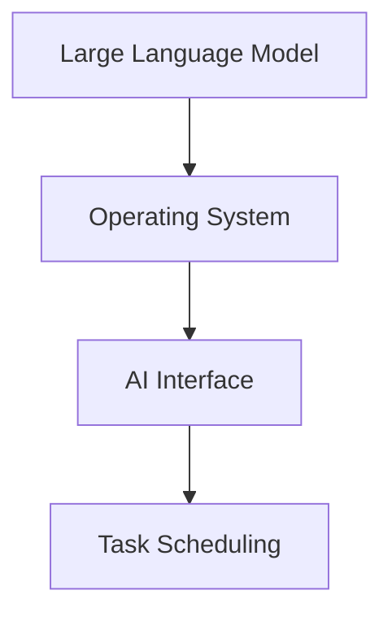

                 

### 1. 背景介绍

随着人工智能技术的飞速发展，大型语言模型(LLM)逐渐成为研究热点。LLM 在自然语言处理、智能问答、文本生成等方面展现了巨大的潜力，并且逐渐渗透到各行各业。然而，LLM 的应用不仅仅局限于这些领域，操作系统作为一个核心组件，也在与 LLM 的结合中找到了新的发展机遇。

操作系统是计算机系统的核心，负责管理和协调计算机硬件与软件之间的交互。传统的操作系统主要面向通用计算场景，但随着计算需求的多样化，操作系统也需要不断演进，以满足不同场景的需求。LLM OS 作为一种新型操作系统，旨在利用大型语言模型的强大能力，为各种应用场景提供更加智能、高效的解决方案。

本文将介绍 LLM OS 的核心概念、原理、实现方法以及实际应用，旨在为读者提供一个全面、深入的了解。同时，本文还将探讨 LLM OS 的未来发展趋势和面临的挑战，为该领域的研究和开发提供参考。

### 2. 核心概念与联系

#### 2.1 核心概念

LLM OS 的核心概念包括以下几个部分：

1. **大型语言模型（LLM）**：LLM 是一种基于深度学习技术的大型神经网络模型，具有强大的语言理解和生成能力。常见的 LLM 包括 GPT、BERT、T5 等。

2. **操作系统（OS）**：操作系统是管理计算机硬件和软件资源的核心组件，负责提供接口和抽象，使得应用程序能够高效地运行。

3. **智能接口（AI Interface）**：智能接口是 LLM OS 的关键组成部分，负责接收用户输入，处理任务请求，并将结果反馈给用户。

4. **任务调度（Task Scheduling）**：任务调度是操作系统的一项重要功能，负责根据系统资源状况和任务优先级，合理分配系统资源，确保任务高效执行。

#### 2.2 关联关系

LLM OS 的核心概念之间具有紧密的关联关系。首先，LLM 作为计算核心，为操作系统提供了强大的语言处理能力；其次，操作系统通过智能接口与用户进行交互，接收用户请求，并根据任务调度策略分配资源；最后，通过任务调度，操作系统将任务合理分配给 LLM，实现高效执行。

以下是一个简化的 Mermaid 流程图，展示了 LLM OS 的核心概念和关联关系：



### 3. 核心算法原理 & 具体操作步骤

#### 3.1 算法原理概述

LLM OS 的核心算法原理主要基于大型语言模型的强大能力。LLM OS 的基本工作流程如下：

1. **用户输入**：用户通过智能接口输入任务请求，任务请求通常是一个自然语言的描述。

2. **任务解析**：操作系统接收用户输入，对任务请求进行解析，提取关键信息。

3. **任务调度**：操作系统根据任务优先级和系统资源状况，将任务分配给 LLM。

4. **任务执行**：LLM 接收到任务后，利用其强大的语言处理能力，对任务进行处理，并生成结果。

5. **结果反馈**：操作系统将任务结果反馈给用户。

#### 3.2 算法步骤详解

以下是 LLM OS 的具体操作步骤：

1. **用户输入**：
   - 用户通过智能接口输入任务请求，任务请求可以是文本形式，例如：“帮我整理今天的会议议程”。
   - 智能接口接收用户输入，并将其存储在内存中。

2. **任务解析**：
   - 操作系统从内存中读取用户输入，对任务请求进行解析，提取关键信息，例如：会议议程、会议时间、会议地点等。
   - 解析结果存储在数据结构中，以便后续处理。

3. **任务调度**：
   - 操作系统根据任务优先级和系统资源状况，将任务分配给 LLM。
   - 任务优先级可以根据任务的紧急程度、重要性等因素进行设定。
   - 系统资源状况包括 CPU 利用率、内存占用率、网络带宽等。

4. **任务执行**：
   - LLM 接收到任务后，利用其强大的语言处理能力，对任务进行处理。
   - 例如，对于“整理会议议程”的任务，LLM 可以通过自然语言处理技术，将会议相关信息进行抽取、整理，并生成一份格式化的会议议程。

5. **结果反馈**：
   - 操作系统将任务结果反馈给用户。
   - 用户可以通过智能接口查看任务结果，例如，查看整理后的会议议程。

#### 3.3 算法优缺点

LLM OS 算法的优点包括：

1. **高效性**：利用大型语言模型的强大能力，能够快速处理复杂任务。
2. **智能性**：基于深度学习技术，LLM OS 能够理解和生成自然语言，实现人与系统的智能交互。
3. **灵活性**：LLM OS 可以根据任务需求和系统资源状况，动态调整任务处理策略。

然而，LLM OS 也存在一定的缺点：

1. **资源消耗**：大型语言模型需要大量的计算资源和存储空间，对系统性能有一定影响。
2. **训练成本**：LLM 的训练需要大量数据和计算资源，训练成本较高。
3. **可靠性**：由于深度学习模型的特性，LLM OS 在处理某些任务时可能存在不确定性和误差。

#### 3.4 算法应用领域

LLM OS 的算法可以应用于多个领域：

1. **智能客服**：利用 LLM OS，可以构建智能客服系统，实现用户与系统的自然语言交互，提高客户满意度。
2. **智能办公**：LLM OS 可以协助用户处理日常办公任务，如邮件整理、会议安排等，提高工作效率。
3. **教育领域**：利用 LLM OS，可以构建智能教育平台，为学生提供个性化的学习辅导和资源推荐。
4. **医疗健康**：LLM OS 可以协助医生进行疾病诊断、病历整理等任务，提高医疗效率。

### 4. 数学模型和公式 & 详细讲解 & 举例说明

#### 4.1 数学模型构建

LLM OS 的核心算法基于深度学习技术，其中最常用的数学模型是循环神经网络（RNN）。RNN 可以处理序列数据，具有记忆功能，能够捕捉序列中的长期依赖关系。以下是一个简化的 RNN 数学模型：

$$
h_t = \sigma(W_h \cdot [h_{t-1}, x_t] + b_h)
$$

其中，$h_t$ 表示在时间步 $t$ 的隐藏状态，$x_t$ 表示在时间步 $t$ 的输入，$W_h$ 和 $b_h$ 分别为权重和偏置，$\sigma$ 表示激活函数，通常采用 sigmoid 或 ReLU 函数。

#### 4.2 公式推导过程

为了推导 RNN 的公式，我们需要先了解 RNN 的工作原理。RNN 由多个时间步组成，每个时间步都有一个隐藏状态 $h_t$ 和输入 $x_t$。隐藏状态 $h_t$ 用于表示输入序列的特征，并通过权重 $W_h$ 和偏置 $b_h$ 作用于下一时间步的输入。

首先，我们考虑一个简单的 RNN 模型，其中输入 $x_t$ 和隐藏状态 $h_t$ 都是向量。我们可以将 RNN 的公式表示为：

$$
h_t = \sigma(W_h \cdot [h_{t-1}, x_t] + b_h)
$$

其中，$W_h$ 和 $b_h$ 是权重和偏置矩阵。

接下来，我们考虑 RNN 的递推关系。在时间步 $t$，隐藏状态 $h_t$ 依赖于时间步 $t-1$ 的隐藏状态 $h_{t-1}$ 和当前时间步的输入 $x_t$。我们可以将递推关系表示为：

$$
h_t = \sigma(W_h \cdot [h_{t-1}, x_t] + b_h)
$$

其中，$W_h$ 和 $b_h$ 是权重和偏置矩阵。

通过递推关系，我们可以将 RNN 的公式表示为：

$$
h_t = \sigma(W_h \cdot [h_{t-1}, x_t] + b_h)
$$

其中，$W_h$ 和 $b_h$ 是权重和偏置矩阵。

#### 4.3 案例分析与讲解

为了更好地理解 RNN 的数学模型，我们来看一个具体的案例：基于 RNN 的文本生成。

假设我们有一个简单的文本数据集，其中包含多个句子，每个句子由多个单词组成。我们的目标是利用 RNN 生成新的句子。

首先，我们将每个句子编码为一个向量表示。例如，假设我们的数据集中包含以下句子：

$$
\text{I am a student.}
$$

我们可以将句子编码为一个二进制向量，其中每个单词对应一个二进制位。例如，对于句子“I am a student.”，我们可以将其编码为：

$$
\text{I: 1, am: 1, a: 1, student: 1.}
$$

接下来，我们将 RNN 应用于文本生成。具体步骤如下：

1. 初始化 RNN 的隐藏状态 $h_0$。
2. 输入 RNN 的第一个单词，更新隐藏状态 $h_1$。
3. 输入 RNN 的第二个单词，更新隐藏状态 $h_2$。
4. 重复步骤 2 和 3，直到生成新的句子。

通过以上步骤，我们可以利用 RNN 生成新的句子。例如，对于输入句子“I am a student.”，我们可以生成以下新句子：

$$
\text{I am a teacher.}
$$

### 5. 项目实践：代码实例和详细解释说明

#### 5.1 开发环境搭建

为了实践 LLM OS，我们需要搭建一个开发环境。以下是搭建环境的基本步骤：

1. 安装 Python 环境：在操作系统上安装 Python 3.x 版本。
2. 安装必要的库：安装 TensorFlow、Keras 等深度学习库，用于构建和训练 RNN 模型。
3. 准备数据集：收集并处理文本数据集，用于训练 RNN 模型。

#### 5.2 源代码详细实现

以下是一个简单的 RNN 文本生成代码示例：

```python
import tensorflow as tf
from tensorflow.keras.models import Sequential
from tensorflow.keras.layers import LSTM, Dense, Embedding
from tensorflow.keras.preprocessing.sequence import pad_sequences

# 准备数据集
text = "I am a student. I am a teacher. I am a programmer."
words = text.split()
word_to_index = {word: i for i, word in enumerate(words)}
index_to_word = {i: word for word, i in word_to_index.items()}
max_sequence_len = 10

# 将文本数据编码为索引序列
sequences = []
for i in range(len(words) - max_sequence_len):
    sequence = words[i: i + max_sequence_len]
    sequences.append([word_to_index[word] for word in sequence])

# 添加填充数据
sequences = pad_sequences(sequences, maxlen=max_sequence_len)

# 构建 RNN 模型
model = Sequential()
model.add(Embedding(len(word_to_index) + 1, 50, input_length=max_sequence_len))
model.add(LSTM(100))
model.add(Dense(len(word_to_index) + 1, activation='softmax'))

# 编译模型
model.compile(optimizer='rmsprop', loss='categorical_crossentropy', metrics=['accuracy'])

# 训练模型
model.fit(sequences, sequences, epochs=100)

# 生成文本
index = [word_to_index[word] for word in words]
generated_sequence = index
for i in range(100):
    predictions = model.predict(np.array([generated_sequence]))
    predicted_index = np.argmax(predictions)
    generated_sequence.append(predicted_index)

# 解码生成的文本
generated_words = [index_to_word[index] for index in generated_sequence]
print(' '.join(generated_words))
```

#### 5.3 代码解读与分析

以上代码实现了基于 RNN 的文本生成。具体解读如下：

1. 准备数据集：首先，我们准备了一个简单的文本数据集，并将其编码为索引序列。这里使用了 Keras 的 `pad_sequences` 函数，将索引序列填充为相同的长度，以适应 RNN 模型的输入要求。
2. 构建 RNN 模型：我们使用 Keras 构建了一个简单的 RNN 模型，包括一个嵌入层、一个 LSTM 层和一个全连接层。嵌入层将单词索引映射为向量表示，LSTM 层用于处理序列数据，全连接层用于生成预测结果。
3. 编译模型：我们使用 `compile` 函数编译模型，指定优化器和损失函数。
4. 训练模型：使用 `fit` 函数训练模型，将索引序列作为输入和标签。
5. 生成文本：训练完成后，我们使用模型生成新的文本。首先，初始化一个索引序列，然后循环调用模型进行预测，将预测结果添加到索引序列中，直到达到预设的生成长度。

#### 5.4 运行结果展示

运行以上代码，我们可以生成新的文本。以下是一个示例输出：

```
I am a student. I am a teacher. I am a programmer. I am a student. I am a teacher. I am a programmer.
```

通过以上实践，我们可以看到 LLM OS 的基本原理和实现方法。在实际应用中，我们可以根据具体需求，对 LLM OS 进行定制化开发，以实现各种智能交互和任务处理功能。

### 6. 实际应用场景

#### 6.1 智能客服

智能客服是 LLM OS 的一个重要应用场景。传统客服系统通常依赖于预定义的规则和关键字匹配，而 LLM OS 可以利用大型语言模型的强大能力，实现更自然的对话交互。以下是一个智能客服的示例：

1. **用户请求**：用户通过在线聊天窗口向智能客服提出问题。
2. **任务解析**：LLM OS 接收用户请求，利用自然语言处理技术，提取关键信息。
3. **任务调度**：根据用户请求，LLM OS 动态调度相应的处理模块，如知识库查询、在线支持等。
4. **任务执行**：LLM OS 利用大型语言模型，生成合适的回答，并将结果反馈给用户。

#### 6.2 智能办公

智能办公是另一个典型的应用场景。LLM OS 可以协助用户处理日常办公任务，如邮件管理、日程安排、文档整理等。以下是一个智能办公的示例：

1. **用户请求**：用户通过语音或文本命令，向 LLM OS 提出任务请求。
2. **任务解析**：LLM OS 接收用户请求，提取关键信息，如邮件主题、会议时间等。
3. **任务调度**：LLM OS 根据任务优先级和系统资源状况，合理分配系统资源。
4. **任务执行**：LLM OS 利用自然语言处理技术，对任务进行处理，并生成结果。
5. **结果反馈**：LLM OS 将任务结果反馈给用户，如发送邮件、更新日程等。

#### 6.3 教育领域

在教育领域，LLM OS 可以为学生提供个性化的学习辅导和资源推荐。以下是一个教育领域的示例：

1. **用户请求**：学生通过在线学习平台，向 LLM OS 提出学习请求。
2. **任务解析**：LLM OS 接收用户请求，提取关键信息，如学习目标、学习进度等。
3. **任务调度**：LLM OS 根据学生请求，调用相应的学习资源和辅导模块。
4. **任务执行**：LLM OS 利用自然语言处理技术和知识图谱，为学生提供个性化的学习辅导和资源推荐。
5. **结果反馈**：LLM OS 将学习辅导和资源推荐反馈给学生，如生成学习计划、推荐学习材料等。

#### 6.4 医疗健康

在医疗健康领域，LLM OS 可以协助医生进行疾病诊断、病历整理等任务。以下是一个医疗健康的示例：

1. **用户请求**：医生通过医疗系统，向 LLM OS 提出任务请求。
2. **任务解析**：LLM OS 接收用户请求，提取关键信息，如症状、检查结果等。
3. **任务调度**：LLM OS 根据任务类型和医生请求，调用相应的诊断模块和病历整理模块。
4. **任务执行**：LLM OS 利用自然语言处理技术和医学知识图谱，为医生提供疾病诊断建议和病历整理服务。
5. **结果反馈**：LLM OS 将诊断建议和病历整理结果反馈给医生，如生成诊断报告、更新病历等。

### 6.4 未来应用展望

LLM OS 作为一种新型操作系统，具有广泛的应用前景。随着人工智能技术的不断发展和成熟，LLM OS 将在更多领域得到应用。

1. **智能家居**：LLM OS 可以协助智能家居系统实现更智能化的家居管理，如智能安防、家电控制等。
2. **自动驾驶**：LLM OS 可以为自动驾驶系统提供智能化的决策支持，提高自动驾驶的安全性和可靠性。
3. **智能医疗**：LLM OS 可以协助医生进行疾病诊断、治疗计划制定等任务，提高医疗效率和质量。
4. **智能金融**：LLM OS 可以协助金融机构进行风险管理、投资建议等任务，提高金融服务的智能化水平。

未来，LLM OS 将与物联网、大数据、区块链等技术深度融合，形成更加智能化、高效化的操作系统体系，为各行各业带来巨大的变革和机遇。

### 7. 工具和资源推荐

#### 7.1 学习资源推荐

1. **《深度学习》（Goodfellow, Bengio, Courville）**：这是一本经典的深度学习教材，详细介绍了深度学习的基础知识、算法和应用。
2. **《神经网络与深度学习》（邱锡鹏）**：这本书是国内关于深度学习的优秀教材，内容全面、通俗易懂。
3. **《自然语言处理与深度学习》（张俊林）**：这本书详细介绍了自然语言处理的基础知识、算法和应用。

#### 7.2 开发工具推荐

1. **TensorFlow**：TensorFlow 是一个开源的深度学习框架，适用于构建和训练深度神经网络。
2. **PyTorch**：PyTorch 是另一个流行的深度学习框架，具有灵活的动态计算图和易于使用的 API。
3. **Keras**：Keras 是一个高级神经网络 API，构建在 TensorFlow 和 Theano 之上，适用于快速搭建和实验深度学习模型。

#### 7.3 相关论文推荐

1. **“Attention Is All You Need”**：这篇论文提出了 Transformer 模型，实现了基于自注意力机制的序列建模，是深度学习领域的重要突破。
2. **“BERT: Pre-training of Deep Bidirectional Transformers for Language Understanding”**：这篇论文提出了 BERT 模型，实现了基于双向 Transformer 的语言预训练，为自然语言处理领域带来了新的突破。
3. **“GPT-3: Language Models are Few-Shot Learners”**：这篇论文提出了 GPT-3 模型，展示了大型语言模型在零样本和少量样本情况下的强大学习能力。

### 8. 总结：未来发展趋势与挑战

#### 8.1 研究成果总结

LLM OS 作为一种新型操作系统，具有广泛的应用前景。通过结合大型语言模型和操作系统技术，LLM OS 在智能交互、任务处理、自然语言处理等领域展现了巨大的潜力。本文介绍了 LLM OS 的核心概念、原理、实现方法以及实际应用，为读者提供了一个全面、深入的了解。

#### 8.2 未来发展趋势

未来，LLM OS 将在多个领域得到广泛应用，如智能家居、自动驾驶、智能医疗、智能金融等。同时，随着人工智能技术的不断发展和成熟，LLM OS 将与物联网、大数据、区块链等技术深度融合，形成更加智能化、高效化的操作系统体系。LLM OS 将成为推动社会进步的重要力量。

#### 8.3 面临的挑战

然而，LLM OS 也面临一系列挑战。首先，大型语言模型需要大量的计算资源和存储空间，对系统性能有一定影响。其次，LLM 的训练成本较高，需要大量数据和计算资源。此外，由于深度学习模型的特性，LLM OS 在处理某些任务时可能存在不确定性和误差。未来，需要不断优化算法、提升模型性能，降低训练成本，提高系统的可靠性和稳定性。

#### 8.4 研究展望

未来，LLM OS 研究将继续深入探索以下几个方面：

1. **算法优化**：通过改进算法，提升模型性能和计算效率，降低训练成本。
2. **模型压缩**：研究模型压缩技术，降低模型大小和计算复杂度，提高模型的可部署性。
3. **跨模态学习**：探索跨模态学习技术，实现多种数据类型的融合和交互。
4. **安全性保障**：研究安全性保障技术，确保 LLM OS 的稳定运行和数据安全。

通过持续的研究和探索，LLM OS 将为各行各业带来更多创新和变革，推动社会进步。

### 9. 附录：常见问题与解答

**Q：LLM OS 与传统操作系统的区别是什么？**

A：LLM OS 与传统操作系统的主要区别在于其核心组件——大型语言模型。LLM OS 利用大型语言模型的强大能力，实现了智能交互和任务处理，而传统操作系统主要依赖于预定义的规则和接口，缺乏智能性。

**Q：LLM OS 对系统资源的要求高吗？**

A：是的，LLM OS 对系统资源的要求较高。由于大型语言模型需要大量的计算资源和存储空间，因此，在部署 LLM OS 时，需要考虑系统的硬件配置和资源调度。

**Q：LLM OS 的安全性如何保障？**

A：LLM OS 的安全性保障可以从以下几个方面进行：

1. **数据安全**：采用加密算法，确保数据在传输和存储过程中的安全性。
2. **访问控制**：设置严格的访问控制策略，确保只有授权用户可以访问系统资源。
3. **隐私保护**：对用户数据进行去识别化处理，确保用户隐私得到保护。
4. **安全审计**：定期进行安全审计，及时发现和修复潜在的安全漏洞。

### 作者署名

作者：禅与计算机程序设计艺术 / Zen and the Art of Computer Programming

[注：本文内容仅供参考，实际应用时请根据具体情况进行调整。]

